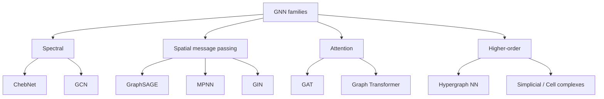

# Graph neural networks for connectomics

> A connectome is a graph. Treating it as a flat vector throws away the geometry. Treating it as a graph adds a lot of code and sometimes very little accuracy. This chapter is about when the trade is worth it.

Functional and structural connectomes are the canonical neuroimaging objects with native graph structure: nodes are parcels, edges are correlations or streamline counts, the topology is fixed (or nearly so) across subjects. GNNs are the obvious tool. They are also a frequent source of irreproducible benchmarks. Both things are true.

## Connectomes as graphs

A functional connectome from a typical pipeline (see [Functional connectivity](../analysis/functional.md) and [Resting-state in practice](../analysis/resting-state.md)) is:

| Element | Typical choice |
| --- | --- |
| **Nodes** $V$ | Parcels from an atlas: Schaefer-200/400, Glasser-360, AAL-90, Desikan-Killiany-68 |
| **Node features** $X \in \mathbb{R}^{N \times d}$ | Mean BOLD timeseries, ROI-wise statistics, demographics broadcast to nodes, or one-hot identity |
| **Edges** $E$ | Pearson / partial correlation (FC), streamline count (SC), or a thresholded/sparsified version |
| **Edge weights** $W \in \mathbb{R}^{N \times N}$ | Raw correlation; Fisher-z; absolute / signed; top-k% kept |
| **Edge features** | Length, FA, tract count, time-lag |

A few practical decisions you will be defending in review:

- **Density.** Raw FC matrices are dense. GNNs prefer sparsity. Common: keep top 10-20% of edges per subject, or apply a population-level mask.
- **Signed vs absolute.** Anti-correlations are real but most GCN-style layers assume non-negative weights. Either keep sign and use a signed GCN, or split into positive / negative graphs.
- **Self-loops.** Always added in practice (they show up automatically in `add_self_loops`).

## Why GNNs at all?

Why not flatten the upper triangle of a $N \times N$ FC matrix into a vector and use a logistic regression or MLP? Often that works *embarrassingly well*. The case for GNNs:

- **Permutation invariance over the right axis.** A GNN doesn't care about node ordering inside a graph (but it *does* care that node $i$ is the same parcel across subjects). An MLP on a flattened FC vector implicitly memorises a parcel ordering.
- **Inductive bias from message passing.** Information flows along edges. Useful when the **pattern of connections** is the signal, not the raw weights.
- **Sample efficiency.** With small N (the usual neuroimaging curse), structural priors help.
- **Multimodal fusion.** Different edge types (FC, SC, length) are natural in a heterogeneous GNN. Flattening loses this.

The case against: see "When NOT to use GNNs" at the end.

## A quick taxonomy



| Layer | One-line idea | Strength | Weakness |
| --- | --- | --- | --- |
| **GCN** ([Kipf & Welling, 2017](https://doi.org/10.48550/arXiv.1609.02907)) | Symmetric normalised neighbour averaging: $H' = \sigma(\tilde D^{-1/2} \tilde A \tilde D^{-1/2} H W)$ | Cheap, strong baseline | Oversmooths; transductive flavour by default |
| **GraphSAGE** ([Hamilton et al., 2017](https://doi.org/10.48550/arXiv.1706.02216)) | Sample $k$ neighbours, aggregate, concat with self | Inductive; scales | Sampling adds variance |
| **GAT** ([Veličković et al., 2018](https://doi.org/10.48550/arXiv.1710.10903)) | Learn attention coefficients on edges | Picks important edges; multi-head | Slower; overfits on small graphs |
| **GIN** ([Xu et al., 2019](https://doi.org/10.48550/arXiv.1810.00826)) | Max-expressive sum aggregator: $h_v' = \mathrm{MLP}((1+\epsilon) h_v + \sum_{u \in \mathcal{N}(v)} h_u)$ | Provably as powerful as 1-WL test | Less stable on noisy weighted graphs |

For brain graphs, GCN and GAT are the most-tried; GIN is increasingly common; GraphSAGE is rare because brain graphs are tiny.

## Population graphs

[Parisot et al., 2017/2018](https://doi.org/10.1016/j.media.2018.06.001). Build a single graph whose **nodes are subjects**, with edges encoding phenotypic similarity (age, sex, site). Each node's feature vector is a per-subject brain summary (e.g. flattened FC, or graph-pooled FC). Disease prediction becomes semi-supervised node classification with a GCN.

Why it works: it explicitly models the demographic structure of the cohort and lets the GCN borrow strength across similar subjects.

Why it's tricky:

- The phenotypic edge function is a hyperparameter with big effects.
- "Site" edges leak site bias into the prediction unless you stratify carefully.
- Strict held-out-site evaluation often collapses performance — the literature is full of population-graph models that beat MLPs only because subjects from the same site share a label distribution.

## Pooling and readout

For whole-brain classification (one prediction per subject, not per node), you need to pool the node embeddings into a graph embedding.

| Strategy | Idea | Trade-off |
| --- | --- | --- |
| **Mean / sum / max** | Reduce $H \in \mathbb{R}^{N \times d}$ along $N$ | Strong baseline; loses structure |
| **Set2Set** | LSTM over node embeddings | Order-invariant; richer |
| **Top-k pooling** | Score nodes, keep top-k, drop the rest | Interpretable; can be unstable |
| **DiffPool** ([Ying et al., 2018](https://doi.org/10.48550/arXiv.1806.08804)) | Learn a soft cluster assignment per layer | Hierarchical; many parameters |
| **SAGPool** | Self-attention scores → top-k | Cleaner than vanilla top-k |

For brain graphs, mean readout + a small MLP is the baseline you must beat. Anything more elaborate needs an ablation.

## Heterogeneous and signed graphs

Brain data is naturally heterogeneous: positive and negative FC, multiple edge types (FC + SC), multiple node types in multimodal studies.

- **Signed GCNs** ([Derr et al., 2018](https://doi.org/10.1145/3269206.3271717)). Separate aggregation for friends (positive edges) and enemies (negative edges).
- **R-GCN** ([Schlichtkrull et al., 2018](https://doi.org/10.1007/978-3-319-93417-4_38)) and HetGNNs. One weight matrix per relation type.
- **Multiplex GNNs.** One layer per modality, then fuse.

The right choice depends on your story: if SC modulates FC, R-GCN with an SC and FC relation is well-aligned with the hypothesis.

## Oversmoothing

Stack too many GCN layers and every node embedding converges to the same vector. Concretely, with $L$ layers and connected graph,

$$\|H^{(L)} - \pi \mathbf{1}^\top\|_F \to 0$$

as $L \to \infty$ (where $\pi$ is the stationary distribution of the normalised adjacency). For brain graphs with diameter ~3-5, two to three message-passing layers is usually plenty. Counter-measures:

- **Residual / skip connections** between layers.
- **DropEdge** ([Rong et al., 2020](https://doi.org/10.48550/arXiv.1907.10903)) — randomly drop edges per training step.
- **PairNorm**, **GraphNorm** — normalise embeddings to prevent collapse.
- **Initial residual + identity** (GCNII) — provably mitigates oversmoothing.

## Brain-specific architectures

| Model | Idea | Pros / cons |
| --- | --- | --- |
| **BrainNetCNN** ([Kawahara et al., 2017](https://doi.org/10.1016/j.neuroimage.2016.09.046)) | Edge-to-edge → edge-to-node → node-to-graph convolutions on the FC matrix | Not technically a GNN; but the "spirit" is graph-aware. Strong baseline. |
| **BrainGNN** ([Li et al., 2021](https://doi.org/10.1016/j.media.2021.102233)) | ROI-aware GCN with per-ROI kernels and top-k pooling for interpretability | Interpretable; many hyperparameters |
| **GraphHeat** ([Xu et al., 2019](https://doi.org/10.24963/ijcai.2019/267)) | Heat kernel filters for graph signal processing on brain graphs | Smooth, low-pass; good for FC noise |
| **BrainNetTransformer** ([Kan et al., 2022](https://doi.org/10.48550/arXiv.2210.06681)) | Self-attention with ROI-aware attention bias | Strong on ABIDE / ABCD; data-hungry |
| **STAGIN** ([Kim et al., 2021](https://doi.org/10.48550/arXiv.2105.13495)) | Dynamic FC + spatio-temporal attention | For task fMRI / dynamic graphs |

For static FC classification on N < 1000, start with BrainNetCNN as a baseline and BrainGNN as the GNN entrant. Compare both to a vanilla MLP on the Fisher-z'd upper triangle.

## Reproducibility caveat — the elephant

A recurring finding ([Abraham et al., 2017](https://doi.org/10.1016/j.neuroimage.2016.10.045), [He et al., 2020](https://doi.org/10.1016/j.neuroimage.2019.116276), [Pervaiz et al., 2020](https://doi.org/10.1016/j.neuroimage.2020.116604)) and especially in the GNN-for-neuroimaging literature: many published models beat baselines under **random-split** cross-validation but fail under **leave-one-site-out** or **held-out-site** evaluation. The reasons:

1. **Site / scanner leakage.** Site is encoded in the FC matrix; the model learns to classify site, not disease.
2. **Atlas-induced data leakage.** Group-defined parcellations use the whole dataset; subsequent CV is no longer independent.
3. **Reporting selection.** The "best CV fold" is reported; hyperparameters are tuned on the test set; pre-registration is rare.

If you're publishing a GNN result, hold out at least one site. Report cross-site AUC alongside random-split AUC. If the gap is large, you have a site classifier, not a disease classifier.

## Worked example — FC matrix to GCN classifier in PyTorch Geometric

A minimal but realistic pipeline: per-subject FC matrix → top-k sparsified graph → 2-layer GCN with global mean pooling → binary classification.

```python
import numpy as np
import torch
import torch.nn.functional as F
from torch_geometric.data import Data, DataLoader
from torch_geometric.nn import GCNConv, global_mean_pool

# 1. Build a Data object per subject from an N x N FC matrix.
def fc_to_data(fc, label, top_k_pct=0.10):
    fc = fc.copy()
    np.fill_diagonal(fc, 0.0)
    n = fc.shape[0]
    # Fisher-z; absolute value for thresholding only.
    fc_z = np.arctanh(np.clip(fc, -0.999, 0.999))
    thresh = np.quantile(np.abs(fc_z), 1 - top_k_pct)
    mask = np.abs(fc_z) >= thresh
    src, dst = np.where(mask)
    edge_index = torch.tensor(np.vstack([src, dst]), dtype=torch.long)
    edge_weight = torch.tensor(fc_z[src, dst], dtype=torch.float)
    # Node features: identity (let the GCN learn parcel-specific embeddings).
    x = torch.eye(n, dtype=torch.float)
    return Data(x=x, edge_index=edge_index, edge_attr=edge_weight,
                y=torch.tensor([label], dtype=torch.long))

# 2. Stack into a dataset.
data_list = [fc_to_data(fc_i, y_i) for fc_i, y_i in zip(fc_matrices, labels)]
loader = DataLoader(data_list, batch_size=16, shuffle=True)

# 3. Two-layer GCN with residual + mean readout.
class BrainGCN(torch.nn.Module):
    def __init__(self, n_parcels, hidden=64, num_classes=2):
        super().__init__()
        self.conv1 = GCNConv(n_parcels, hidden)
        self.conv2 = GCNConv(hidden, hidden)
        self.lin = torch.nn.Linear(hidden, num_classes)

    def forward(self, data):
        x, edge_index, ew, batch = (data.x, data.edge_index,
                                    data.edge_attr, data.batch)
        h1 = F.relu(self.conv1(x, edge_index, edge_weight=ew))
        h1 = F.dropout(h1, p=0.3, training=self.training)
        h2 = F.relu(self.conv2(h1, edge_index, edge_weight=ew)) + h1   # residual
        g = global_mean_pool(h2, batch)
        return self.lin(g)

device = "cuda"
model = BrainGCN(n_parcels=fc_matrices[0].shape[0]).to(device)
opt = torch.optim.AdamW(model.parameters(), lr=1e-3, weight_decay=5e-4)

# 4. Training loop.
for epoch in range(100):
    model.train()
    for batch in loader:
        batch = batch.to(device)
        logits = model(batch)
        loss = F.cross_entropy(logits, batch.y)
        opt.zero_grad(); loss.backward(); opt.step()
```

Beat the obvious baseline:

```python
# Logistic regression on the upper triangle of FC.
from sklearn.linear_model import LogisticRegressionCV
iu = np.triu_indices(n_parcels, k=1)
X = np.stack([np.arctanh(np.clip(fc[iu], -0.999, 0.999)) for fc in fc_matrices])
clf = LogisticRegressionCV(Cs=10, cv=5, max_iter=2000).fit(X, labels)
```

If your GCN doesn't beat this with held-out-site CV, you don't have a GCN result yet.

## When NOT to use GNNs

- **Small N (< 200), clean signal.** A logistic regression on the Fisher-z'd upper triangle will often match or beat a GNN — and is trivially interpretable.
- **Strongly separable classes.** If the FC means differ by ~1 SD between classes, a linear classifier suffices and a GNN just adds overfitting risk.
- **No held-out-site available.** You'll publish a result you can't defend.
- **Wrong primitive.** If the question is voxel-level (e.g. lesion segmentation), a 3D U-Net is the right tool — see [Deep learning for imaging](deep-learning.md).
- **Dynamic / state-dependent task fMRI.** Static GNNs miss the dynamics; you want a spatio-temporal model (STAGIN-style) or recurrent-on-graph hybrid.

A reasonable rule: report MLP-on-Pearson, BrainNetCNN, and your GNN of choice side by side, with held-out-site evaluation. Anything else is selling a hyperparameter sweep as a method.

## References

1. **Kipf TN, Welling M.** Semi-supervised classification with graph convolutional networks (GCN). *ICLR.* 2017. [doi:10.48550/arXiv.1609.02907](https://doi.org/10.48550/arXiv.1609.02907)
2. **Hamilton WL, Ying R, Leskovec J.** Inductive representation learning on large graphs (GraphSAGE). *NeurIPS.* 2017. [doi:10.48550/arXiv.1706.02216](https://doi.org/10.48550/arXiv.1706.02216)
3. **Veličković P, Cucurull G, Casanova A, et al.** Graph attention networks (GAT). *ICLR.* 2018. [doi:10.48550/arXiv.1710.10903](https://doi.org/10.48550/arXiv.1710.10903)
4. **Xu K, Hu W, Leskovec J, Jegelka S.** How powerful are graph neural networks? (GIN). *ICLR.* 2019. [doi:10.48550/arXiv.1810.00826](https://doi.org/10.48550/arXiv.1810.00826)
5. **Parisot S, Ktena SI, Ferrante E, et al.** Disease prediction using graph convolutional networks: application to autism spectrum disorder and Alzheimer's disease. *Med Image Anal.* 2018;48:117-130. [doi:10.1016/j.media.2018.06.001](https://doi.org/10.1016/j.media.2018.06.001)
6. **Kawahara J, Brown CJ, Miller SP, et al.** BrainNetCNN: convolutional neural networks for brain networks. *NeuroImage.* 2017;146:1038-1049. [doi:10.1016/j.neuroimage.2016.09.046](https://doi.org/10.1016/j.neuroimage.2016.09.046)
7. **Li X, Zhou Y, Dvornek N, et al.** BrainGNN: Interpretable brain graph neural network for fMRI analysis. *Med Image Anal.* 2021;74:102233. [doi:10.1016/j.media.2021.102233](https://doi.org/10.1016/j.media.2021.102233)
8. **Kan X, Dai W, Cui H, et al.** Brain Network Transformer. *NeurIPS.* 2022. [doi:10.48550/arXiv.2210.06681](https://doi.org/10.48550/arXiv.2210.06681)
9. **Ying R, You J, Morris C, et al.** Hierarchical graph representation learning with differentiable pooling (DiffPool). *NeurIPS.* 2018. [doi:10.48550/arXiv.1806.08804](https://doi.org/10.48550/arXiv.1806.08804)
10. **Rong Y, Huang W, Xu T, Huang J.** DropEdge: towards deep graph convolutional networks on node classification. *ICLR.* 2020. [doi:10.48550/arXiv.1907.10903](https://doi.org/10.48550/arXiv.1907.10903)
11. **Pervaiz U, Vidaurre D, Woolrich MW, Smith SM.** Optimising network modelling methods for fMRI. *NeuroImage.* 2020;211:116604. [doi:10.1016/j.neuroimage.2020.116604](https://doi.org/10.1016/j.neuroimage.2020.116604)
12. **He T, Kong R, Holmes AJ, et al.** Deep neural networks and kernel regression achieve comparable accuracies for functional connectivity prediction of behavior and demographics. *NeuroImage.* 2020;206:116276. [doi:10.1016/j.neuroimage.2019.116276](https://doi.org/10.1016/j.neuroimage.2019.116276)

## Where to next

- [Classical ML on imaging features](classical-ml.md) — the baseline you must beat with the flattened FC vector.
- [Interpretability](interpretability.md) — per-ROI attribution is where GNN results either become biologically meaningful or fall apart.
- [Uncertainty quantification](uncertainty.md) — GNNs are notoriously overconfident on small cohorts; conformal prediction is your friend.
- [Evaluation](evaluation.md) — held-out-site CV and the reproducibility checklist.
