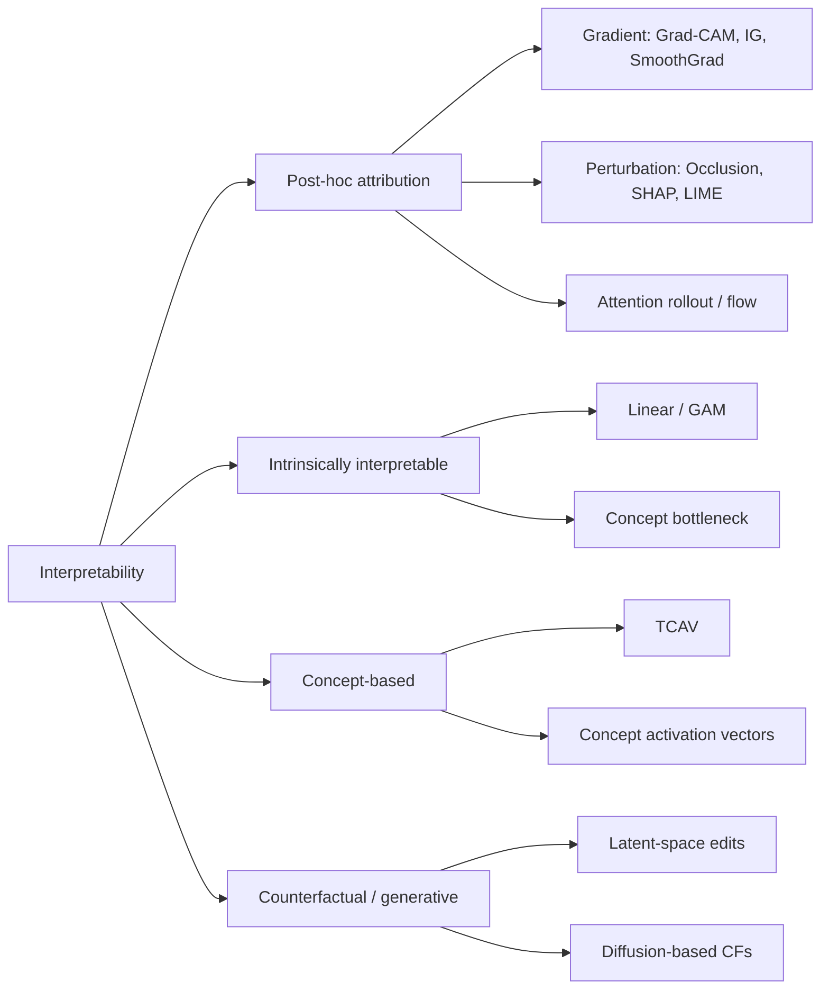

# Interpretability for neuro models

> Heatmaps are seductive and mostly wrong. This chapter is about getting honest, falsifiable explanations out of a 3D classifier — and proving the explanation isn't just pretty noise.

A model that diagnoses Alzheimer's at 92% AUC is interesting. A model that diagnoses Alzheimer's at 92% AUC *because the hippocampus matters more than the lateral ventricles* is publishable. A model that does it because of the scanner serial number embedded in a corner voxel is a scandal waiting to happen. Interpretability is how you tell those three apart.

## Why interpretability matters here

Neuroimaging interpretability has three audiences and three failure modes:

| Audience | What they want | What kills them |
| --- | --- | --- |
| **Clinicians** | "Which voxels drove this decision?" | Maps that change every run, or every patient, with no anatomical story |
| **Scientists** | "Did the model learn something biological?" | Shortcut features (site, scanner, sequence parameters) |
| **Regulators** | "Can you justify the prediction post-hoc?" | Methods that pass no sanity check (see Adebayo 2018) |

If you cannot explain the model, you cannot debug it, defend it in review, or deploy it under FDA/EMA scrutiny. See also [Regulatory and ethics](regulatory.md).

## The post-hoc landscape



### Gradient-based methods

| Method | Idea | When it shines | Known failure mode |
| --- | --- | --- | --- |
| **Saliency** | $\partial y / \partial x$ | Fast sanity check | Noisy, sign-confused |
| **Grad-CAM** | Weight feature maps by $\partial y / \partial A^k$ | Convnets; produces blob-level maps | Last-conv-layer only; misses fine structure |
| **Integrated gradients** | Path integral $\int_{\alpha=0}^{1} \partial y / \partial x \big|_{\tilde x + \alpha(x-\tilde x)} d\alpha$ | Axiomatic; sensitivity + completeness | Baseline $\tilde x$ choice dominates results |
| **SmoothGrad** | Average gradients over noisy copies | Cleans up saliency | Smooths over real features too |
| **DeepLIFT / LRP** | Backpropagate reference-relative contributions | Theory-friendly | Requires per-layer rules |

### Perturbation-based methods

- **Occlusion.** Slide a patch of zeros (or mean intensity) across the volume; record how much the prediction drops. Slow on 3D ($O(n^3)$ patches), but model-agnostic and trustworthy.
- **SHAP.** Shapley values approximated by sampling. Theoretically optimal; computationally brutal. `DeepExplainer` and `GradientExplainer` are the only versions that scale to images.
- **LIME.** Locally fits a linear surrogate around the input. Designed for tabular data; on images it's basically superpixel-occlusion. Use only when the model is a black box (e.g. wrapped API).

Perturbation methods have one big advantage: they need no gradients, so they work on ensembles, frozen ONNX exports, and even radiology-report classifiers.

### Attention maps — useful with caveats

Attention weights from a vision transformer (UNETR, Swin UNETR) are tempting to plot directly. They are *not* faithful explanations:

- Attention is multi-head and multi-layer. A single layer's map is a summary, not a cause.
- [Jain & Wallace, 2019](https://doi.org/10.18653/v1/N19-1357) showed attention often disagrees with leave-one-out feature importance.
- Use **attention rollout** or **attention flow** ([Abnar & Zuidema, 2020](https://doi.org/10.18653/v1/2020.acl-main.385)) to aggregate across layers — or, better, run integrated gradients *over* attention weights.

A useful rule: if the attention map "looks right," verify it with an occlusion sweep on the same regions.

## 3D-specific tricks

A 3D heatmap (e.g. $96 \times 96 \times 96$) cannot go directly into a figure. Three projections that actually work:

1. **Maximum-intensity projection (MIP).** For each axial slice $z$, take $\max_{z'} M(x,y,z')$. Quick, but flattens depth.
2. **Best-slice + outline.** Pick the slice with peak attribution, overlay a contour at, say, the 95th percentile of $M$.
3. **Atlas overlap.** Register the saliency map to MNI152, then for each ROI $r$ in an atlas $A$ (Harvard-Oxford, Desikan-Killiany, AAL), compute

$$\text{Score}(r) = \frac{1}{|r|} \sum_{v \in r} M(v).$$

The third is what wins reviewer arguments. Reporting "saliency was 3.2× higher in left hippocampus than in matched white matter" is concrete; a screenshot of a colourful brain is not.

## Concept-based methods

Pixel attribution answers *where*. Concept-based methods answer *what*.

- **TCAV** ([Kim et al., 2018](https://doi.org/10.48550/arXiv.1711.11279)). Train a linear probe to separate activations for examples with concept $C$ (e.g. "cortical atrophy") from random examples. The directional derivative of the prediction along this concept vector $v_C$ is the **concept sensitivity**:

$$\text{TCAV}_C(\ell) = \mathbb{P}_x \!\left[ \nabla h_\ell(x) \cdot v_C > 0 \right].$$

- **Concept bottleneck models** ([Koh et al., 2020](https://doi.org/10.48550/arXiv.2007.04612)). Force the model to predict human-defined concepts first ("hippocampal volume," "white-matter hyperintensity load") and use only those concepts to make the final decision. Lower raw accuracy, drastically higher trust.

For neuroimaging, concept bottlenecks pair beautifully with FreeSurfer-derived features as the bottleneck layer.

## Counterfactual and generative explanations

> "What would have to change about this brain for the model to flip its prediction?"

Counterfactuals beat heatmaps when stakeholders ask *why*, not *where*. Approaches:

- **Latent edits.** Train a VAE / StyleGAN on healthy brains; project a patient through it; walk the latent toward the decision boundary of the classifier.
- **Diffusion CFs.** [Sanchez & Tsaftaris, 2022](https://doi.org/10.48550/arXiv.2203.04106) — guide a diffusion model with classifier gradients to synthesise a near-input that the model now classifies differently.
- **Pixel-space CFs** (xGEMs, DiVE). Constrained optimisation in image space — fast but artefact-prone.

A good counterfactual is **sparse** (few voxels change), **realistic** (still looks like a brain), and **proximal** (close to the input).

## Faithfulness checks — the part nobody runs

This is the section that separates a defensible interpretability claim from interpretability theatre.

### Adebayo sanity checks ([Adebayo et al., 2018](https://doi.org/10.48550/arXiv.1810.03292))

Two simple tests every saliency method should pass:

1. **Model randomisation.** Re-initialise the model layer-by-layer from the top. If the saliency map barely changes, the method is not actually explaining the model — it's edge-detecting the input. Guided backprop famously fails this.
2. **Data randomisation.** Train on randomly shuffled labels. If saliency still highlights the "right" regions, the method is just an input prior.

If your saliency method fails either, your figure is decorative, not evidential.

### ROAR / RemOve And Retrain ([Hooker et al., 2019](https://doi.org/10.48550/arXiv.1806.10758))

Mask the top-k% most "important" voxels, retrain the model, measure accuracy drop. If important voxels were truly important, accuracy collapses. If accuracy barely budges, the attribution was misleading.

ROAR is expensive (one full retrain per attribution method) but it's the gold standard.

### Insertion / deletion AUC ([Petsiuk et al., 2018](https://doi.org/10.48550/arXiv.1806.07421))

Cheaper alternatives. Delete (or insert) voxels in attribution order; the prediction curve should drop (or rise) sharply. Report AUC.

## Beginner pitfall — the heatmap that "looks right"

A trained CNN classifying Alzheimer's will produce a Grad-CAM that nicely lights up medial temporal regions. Beautiful figure. Reviewers love it. Then you do this:

```python
# Replace all model weights with random noise.
import torch
for p in model.parameters():
    p.data = torch.randn_like(p.data)
gradcam = run_gradcam(model, x)   # still highlights medial temporal regions
```

Why? Because **the input itself** has structure (high contrast, central focus), and many saliency methods leak that structure regardless of the model. Always run the sanity check before publication. If the random-weight map looks similar, you have an *input* explanation, not a *model* explanation.

## Worked example — captum on a 3D classifier

Captum ([Kokhlikyan et al., 2020](https://doi.org/10.48550/arXiv.2009.07896)) is the standard PyTorch attribution library and handles 3D tensors out of the box.

```python
import torch
import nibabel as nib
import numpy as np
from captum.attr import IntegratedGradients, Occlusion, NoiseTunnel
from captum.attr import LayerGradCam, LayerAttribution

# 1. Load a trained 3D classifier (e.g. DenseNet121 from MONAI).
from monai.networks.nets import DenseNet121
model = DenseNet121(spatial_dims=3, in_channels=1, out_channels=2).cuda().eval()
model.load_state_dict(torch.load("ad_classifier.pt", weights_only=True))

# 2. Load a single volume; shape (1, 1, D, H, W).
img = nib.load("sub-001_T1w.nii.gz").get_fdata().astype(np.float32)
img = (img - img.mean()) / (img.std() + 1e-6)
x = torch.tensor(img).unsqueeze(0).unsqueeze(0).cuda()
target = 1                                     # predicted "AD" class

# 3. Integrated gradients with a zero baseline (and a noise-tunnel for smoothing).
ig = IntegratedGradients(model)
nt = NoiseTunnel(ig)
ig_attr = nt.attribute(x, nt_samples=5, nt_type="smoothgrad_sq",
                        target=target, n_steps=32)
ig_map = ig_attr.squeeze().detach().cpu().numpy()

# 4. Grad-CAM on the last conv block (find a real layer name from your model).
last_conv = model.features.denseblock4.denselayer16.layers.conv2
gc = LayerGradCam(model, last_conv)
gc_attr = gc.attribute(x, target=target)
gc_up = LayerAttribution.interpolate(gc_attr, x.shape[2:])
gc_map = gc_up.squeeze().detach().cpu().numpy()

# 5. Occlusion sweep — slow but gradient-free ground truth.
occ = Occlusion(model)
occ_attr = occ.attribute(x, target=target,
                         sliding_window_shapes=(1, 16, 16, 16),
                         strides=(1, 8, 8, 8))
occ_map = occ_attr.squeeze().detach().cpu().numpy()

# 6. Save as NIfTI for ROI overlap analysis in MNI space.
nib.save(nib.Nifti1Image(ig_map, affine=nib.load("sub-001_T1w.nii.gz").affine),
         "ig_attr.nii.gz")
```

From here: register `ig_attr.nii.gz` to MNI152, intersect with an atlas, and report ROI-wise mean attribution with bootstrap CIs. That is a figure a reviewer can argue with.

## Regulatory expectations

Regulators do not (yet) mandate any specific interpretability method, but they expect **post-hoc explainability** for any decision-impacting AI ([FDA AI/ML guiding principles](https://www.fda.gov/medical-devices/software-medical-device-samd/good-machine-learning-practice-medical-device-development-guiding-principles), EU AI Act Art. 13). Practical guidance:

- Pick a method that passes the Adebayo sanity checks on your data — and document the test.
- Report attribution **distributions**, not single examples (e.g. ROI saliency across the test cohort).
- Pair attribution with a **failure analysis**: cases where the model is confidently wrong and where saliency leaks (e.g. onto the skull, onto image borders) are smoking guns.
- For deployment, freeze the interpretability pipeline alongside the model — the explanation method is part of the device.

See [Regulatory and ethics](regulatory.md) for the broader compliance picture.

## When interpretability fails (and you should admit it)

- **Ensembles.** Averaging attributions across an ensemble is principled but expensive; quoting one model's map is misleading.
- **Transformers with global attention.** Maps are diffuse by construction. Use integrated gradients or perturbation, not raw attention.
- **Self-supervised features.** A frozen DINO encoder + linear probe can be highly accurate and almost impossible to attribute meaningfully at the input level. Switch to concept-based methods.

## References

1. **Adebayo J, Gilmer J, Muelly M, et al.** Sanity checks for saliency maps. *NeurIPS.* 2018. [doi:10.48550/arXiv.1810.03292](https://doi.org/10.48550/arXiv.1810.03292)
2. **Selvaraju RR, Cogswell M, Das A, et al.** Grad-CAM: visual explanations from deep networks via gradient-based localization. *ICCV.* 2017. [doi:10.1109/ICCV.2017.74](https://doi.org/10.1109/ICCV.2017.74)
3. **Sundararajan M, Taly A, Yan Q.** Axiomatic attribution for deep networks (integrated gradients). *ICML.* 2017. [doi:10.48550/arXiv.1703.01365](https://doi.org/10.48550/arXiv.1703.01365)
4. **Lundberg SM, Lee S-I.** A unified approach to interpreting model predictions (SHAP). *NeurIPS.* 2017. [doi:10.48550/arXiv.1705.07874](https://doi.org/10.48550/arXiv.1705.07874)
5. **Ribeiro MT, Singh S, Guestrin C.** "Why should I trust you?": explaining the predictions of any classifier (LIME). *KDD.* 2016. [doi:10.1145/2939672.2939778](https://doi.org/10.1145/2939672.2939778)
6. **Kim B, Wattenberg M, Gilmer J, et al.** Interpretability beyond feature attribution: TCAV. *ICML.* 2018. [doi:10.48550/arXiv.1711.11279](https://doi.org/10.48550/arXiv.1711.11279)
7. **Koh PW, Nguyen T, Tang YS, et al.** Concept bottleneck models. *ICML.* 2020. [doi:10.48550/arXiv.2007.04612](https://doi.org/10.48550/arXiv.2007.04612)
8. **Hooker S, Erhan D, Kindermans P-J, Kim B.** A benchmark for interpretability methods in deep neural networks (ROAR). *NeurIPS.* 2019. [doi:10.48550/arXiv.1806.10758](https://doi.org/10.48550/arXiv.1806.10758)
9. **Kokhlikyan N, Miglani V, Martin M, et al.** Captum: a unified and generic model interpretability library for PyTorch. *arXiv:2009.07896.* 2020. [doi:10.48550/arXiv.2009.07896](https://doi.org/10.48550/arXiv.2009.07896)
10. **Abnar S, Zuidema W.** Quantifying attention flow in transformers. *ACL.* 2020. [doi:10.18653/v1/2020.acl-main.385](https://doi.org/10.18653/v1/2020.acl-main.385)
11. **Sanchez P, Tsaftaris SA.** Diffusion causal models for counterfactual estimation. *CLeaR.* 2022. [doi:10.48550/arXiv.2203.04106](https://doi.org/10.48550/arXiv.2203.04106)
12. **Petsiuk V, Das A, Saenko K.** RISE: randomized input sampling for explanation (insertion / deletion). *BMVC.* 2018. [doi:10.48550/arXiv.1806.07421](https://doi.org/10.48550/arXiv.1806.07421)

## Where to next

- [Uncertainty quantification](uncertainty.md) — once you trust *where* the model looks, ask how much you trust *that* it looked.
- [Evaluation](evaluation.md) — interpretability is part of evaluation, not separate from it.
- [Regulatory and ethics](regulatory.md) — what explanations regulators expect on the dossier.
