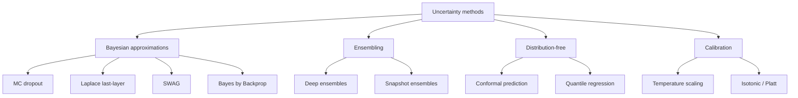

# Uncertainty quantification

> A model that is 99% confident and wrong is more dangerous than a model that is 70% confident and wrong. Uncertainty quantification is how you stop shipping the first one.

Point predictions hide everything important. For clinical and scientific neuroimaging you need a calibrated probability, an honest interval, and a way to **refer** the cases the model should not be handling alone. This chapter is about the methods that actually deliver those.

## Aleatoric vs epistemic — and what to do about each

| Type | Source | Reducible? | Clinical implication |
| --- | --- | --- | --- |
| **Aleatoric** | Noise in the data (motion, low SNR, ambiguous boundaries) | No — collect cleaner data | Flag the *image*, not the model |
| **Epistemic** | Model uncertainty (small training set, novel input) | Yes — more data, better model | Flag the *case*, route to expert |

Total predictive uncertainty decomposes as:

$$\mathrm{Var}[y \mid x] = \underbrace{\mathbb{E}_\theta \!\left[\sigma^2(x; \theta)\right]}_{\text{aleatoric}} + \underbrace{\mathrm{Var}_\theta\!\left[\mu(x; \theta)\right]}_{\text{epistemic}}.$$

You need both, and the clinical action depends on which dominates. A high-aleatoric segmentation on a motion-corrupted scan means "rescan." A high-epistemic prediction on a rare pathology means "send to a neuroradiologist."

## The landscape



## Monte Carlo dropout

[Gal & Ghahramani, 2016](https://doi.org/10.48550/arXiv.1506.02142) showed that dropout at inference time approximates a Bayesian posterior over weights. Cheap, model-agnostic, ubiquitous:

```python
def mc_predict(model, x, T=20):
    model.train()                           # keep dropout active
    with torch.no_grad():
        ps = torch.stack([model(x).softmax(1) for _ in range(T)])
    return ps.mean(0), ps.var(0)            # mean prediction, predictive variance
```

Caveats:
- Only valid if the network actually contains dropout layers. Many modern architectures (UNETR, Swin) use very little.
- Variance shrinks as $T$ grows; report enough samples (T=20-50 is typical for 3D).
- Not a real posterior. Treat it as a useful diagnostic, not a probabilistic guarantee.

## Deep ensembles

[Lakshminarayanan et al., 2017](https://doi.org/10.48550/arXiv.1612.01474). Train $M$ models from different initialisations on the same data; average the softmax outputs. Almost always the strongest non-trivial baseline.

- $M = 5$ is the sweet spot. $M = 10$ if you can afford it.
- Diversity matters more than calibration of any single member.
- The variance across members is your epistemic uncertainty estimate.
- Cost: $M\times$ training and inference. For 3D U-Nets that's serious. Knowledge distillation back to a single model can recover some calibration at deployment time.

**Snapshot ensembles** ([Huang et al., 2017](https://doi.org/10.48550/arXiv.1704.00109)) approximate ensembles by saving checkpoints along a cyclic learning rate schedule — one training run, $M$ models. Diversity is lower than independent ensembles but the cost ratio is great.

## SWAG — stochastic weight averaging Gaussian

[Maddox et al., 2019](https://doi.org/10.48550/arXiv.1902.02476). Fit a Gaussian over weights using the trajectory of SGD at high LR. Cheap (one training run), better calibration than MC dropout, lower diversity than deep ensembles.

Pipeline:
1. Train to near-convergence.
2. Switch to a constant high LR.
3. Collect weight snapshots every $k$ epochs.
4. Fit a Gaussian (diagonal + low-rank covariance) over snapshots.
5. At inference, sample weights → forward pass → average predictions.

## Bayesian last-layer methods

Sometimes you don't need full posteriors over millions of weights — just the last layer.

- **Laplace approximation** ([Daxberger et al., 2021](https://doi.org/10.48550/arXiv.2106.14806)). After training, fit a Gaussian centred at the MAP estimate of the last layer using the Hessian (often diagonal or Kronecker-factored). `laplace-torch` makes this a three-line operation.
- **Bayes by Backprop (BBB) lite.** Variational distribution over last-layer weights only. Trains as a regular network plus a KL term.

For a typical neuroimaging classifier, Laplace last-layer is the best calibration-per-line-of-code on the market.

```python
from laplace import Laplace
la = Laplace(model, "classification",
             subset_of_weights="last_layer",
             hessian_structure="kron")
la.fit(train_loader)
la.optimize_prior_precision()
mean, var = la(x_test)
```

## Conformal prediction — the modern frequentist answer

[Vovk et al., 2005](https://doi.org/10.1007/b106715); reviewed by [Angelopoulos & Bates, 2021](https://doi.org/10.48550/arXiv.2107.07511). Distribution-free, model-agnostic, finite-sample valid. If you can afford a held-out calibration set, you should be using this.

**Split conformal recipe (classification):**

1. Train your model on $\mathcal{D}_{\text{train}}$.
2. Hold out a calibration set $\mathcal{D}_{\text{cal}}$ of size $n$.
3. For each calibration example $(x_i, y_i)$, compute a **non-conformity score** $s_i = 1 - \hat p_\theta(y_i \mid x_i)$.
4. Let $\hat q = \lceil (n+1)(1-\alpha) \rceil / n$ quantile of $\{s_i\}$.
5. For a test input $x$, output the prediction set $\mathcal{C}(x) = \{y : 1 - \hat p_\theta(y \mid x) \leq \hat q\}$.

The guarantee: $\mathbb{P}\!\left[ y_{\text{test}} \in \mathcal{C}(x_{\text{test}}) \right] \geq 1 - \alpha$, with no model assumptions, provided calibration and test data are exchangeable.

```python
import numpy as np

def split_conformal(probs_cal, y_cal, probs_test, alpha=0.1):
    # probs_*: (N, K) softmax outputs; y_cal: (N,) true labels
    n = len(y_cal)
    scores = 1.0 - probs_cal[np.arange(n), y_cal]
    q_level = np.ceil((n + 1) * (1 - alpha)) / n
    q_hat = np.quantile(scores, q_level, method="higher")
    sets = probs_test >= (1 - q_hat)          # boolean (M, K)
    return sets, q_hat
```

For segmentation, the equivalent is *risk-controlling prediction sets* ([Bates et al., 2021](https://doi.org/10.48550/arXiv.2101.02703)) — produce a thresholded mask that contains the true lesion with probability $1 - \alpha$ on average.

**Exchangeability is the catch.** Site shift, scanner change, population drift all break the guarantee. Pair conformal with OOD detection (below).

## Calibration

A model is **calibrated** when its predicted probabilities match observed frequencies: among predictions of confidence $p$, roughly $p$ fraction are correct.

### Reliability diagrams and ECE

Bin predictions by predicted confidence; plot empirical accuracy per bin. Expected Calibration Error:

$$\mathrm{ECE} = \sum_{b=1}^{B} \frac{|B_b|}{N} \big| \mathrm{acc}(B_b) - \mathrm{conf}(B_b) \big|.$$

Report **ECE** and **maximum calibration error** alongside AUC, every time. A modern CNN trained with cross-entropy is typically *overconfident*; ECE of 5-15% is depressingly normal.

### Temperature scaling

[Guo et al., 2017](https://doi.org/10.48550/arXiv.1706.04599). Single parameter $T > 0$ rescales logits: $\hat p = \mathrm{softmax}(z / T)$. Fit $T$ by minimising NLL on a held-out set. Cheap, monotonic, preserves accuracy, fixes most calibration problems for in-distribution data.

```python
import torch, torch.nn.functional as F
T = torch.nn.Parameter(torch.ones(1, device="cuda"))
opt = torch.optim.LBFGS([T], lr=0.1, max_iter=50)

def closure():
    opt.zero_grad()
    loss = F.cross_entropy(logits_val / T, y_val)
    loss.backward()
    return loss
opt.step(closure)
```

### Isotonic regression and Platt scaling

When temperature scaling isn't enough (e.g. multi-modal miscalibration), fit a monotone non-parametric mapping with `sklearn.isotonic.IsotonicRegression`. Needs a larger calibration set than temperature scaling.

## Distribution shift and OOD detection

Calibration on the training distribution is necessary but not sufficient. The clinic ships you scanners, sequences and pathologies you haven't seen.

| Method | What it measures | Notes |
| --- | --- | --- |
| **Mahalanobis on features** ([Lee et al., 2018](https://doi.org/10.48550/arXiv.1807.03888)) | Distance of penultimate-layer features to per-class Gaussians | Strong; needs class-conditional fit |
| **Energy score** ([Liu et al., 2020](https://doi.org/10.48550/arXiv.2010.03759)) | $-T \log \sum_k e^{z_k / T}$ | Drop-in for softmax confidence; better separation |
| **ODIN** ([Liang et al., 2018](https://doi.org/10.48550/arXiv.1706.02690)) | Input perturbation + temperature scaling | Older; mostly subsumed by energy |
| **Reconstruction-based** | Autoencoder error on input | Slow; good when no labels available |

Practical pipeline: penultimate-layer Mahalanobis + energy score, both thresholded on a held-out *in-distribution* validation set. Anything above threshold is flagged.

## Selective prediction and referral

Uncertainty estimates are useful only if they drive a decision. The wiring:

```python
def predict_with_referral(model, x, tau_conf=0.9, tau_ood=mahal_threshold):
    p, var = mc_predict(model, x, T=30)         # epistemic estimate
    conf = p.max(1).values
    ood = mahalanobis(features(x))
    keep = (conf >= tau_conf) & (ood < tau_ood)
    return p, keep                              # downstream code refers ~keep cases
```

Choose $\tau$ from a **risk-coverage** curve: plot error rate vs coverage (fraction of cases the model retains). Pick the operating point that matches your clinical risk tolerance. Conformal can give you the same curve with formal guarantees.

## Worked example — MONAI segmentation with split conformal

Pixel-wise conformal prediction for a 3D segmentation model, producing a "risk-controlling" mask: the model's mask plus a margin large enough that the true lesion is contained with high probability.

```python
import numpy as np
import torch
from monai.networks.nets import UNet
from monai.inferers import sliding_window_inference
from monai.data import DataLoader, Dataset

device = "cuda"
model = UNet(spatial_dims=3, in_channels=1, out_channels=2,
             channels=(16, 32, 64, 128, 256), strides=(2, 2, 2, 2)).to(device)
model.load_state_dict(torch.load("seg_model.pt", weights_only=True))
model.eval()

# 1. Compute per-voxel non-conformity scores on the calibration set.
@torch.no_grad()
def softmax_lesion_probs(volume):
    out = sliding_window_inference(volume.to(device), (96, 96, 96), 4, model)
    return out.softmax(1)[:, 1]                 # (B, D, H, W) foreground prob

all_scores = []
for batch in DataLoader(cal_dataset, batch_size=1):
    p = softmax_lesion_probs(batch["image"]).cpu().numpy()
    y = batch["label"].numpy().squeeze() > 0
    # Non-conformity: 1 - p at true-foreground voxels.
    s = 1.0 - p[y]
    all_scores.append(s)
scores = np.concatenate(all_scores)

# 2. Pick the (1-alpha) quantile -> threshold on probability.
alpha = 0.1
n = len(scores)
q_level = np.ceil((n + 1) * (1 - alpha)) / n
q_hat = np.quantile(scores, q_level, method="higher")
prob_threshold = 1.0 - q_hat
print(f"Use prob_threshold = {prob_threshold:.3f} for {1 - alpha:.0%} coverage")

# 3. At test time, threshold the softmax map.
test_volume = next(iter(DataLoader(test_dataset, batch_size=1)))["image"]
p_test = softmax_lesion_probs(test_volume).cpu().numpy()
risk_controlling_mask = p_test >= prob_threshold
```

The mask contains the true lesion voxel-set with $\geq 90\%$ marginal probability, with no Bayesian assumptions. Pair with temperature scaling first if the network is wildly overconfident — calibration before conformal makes the prediction sets tighter.

## When uncertainty quantification doesn't help

Be honest about the cases where these methods *cannot* save you:

- **Label noise dominates.** If 20% of your training labels are wrong, no uncertainty method tells you which 20%. Fix the labels.
- **Deterministic mistakes.** A model that always confuses lacunes for perivascular spaces will produce confident, calibrated, wrong predictions. Uncertainty does not detect systematic bias.
- **Spurious-feature shortcuts.** A model that diagnoses Alzheimer's from scanner site will be well-calibrated on the training site distribution and disastrous on a new site. Need [interpretability](interpretability.md) + OOD, not just uncertainty.
- **Tiny test sets.** Calibration metrics (ECE, reliability) are noisy below ~500 samples. Don't celebrate ECE = 1.2% on $n = 60$.

## Reporting checklist

- [ ] Predictive distribution (mean + variance, or prediction set), not just argmax.
- [ ] Calibration metric (ECE, MCE) before and after temperature scaling.
- [ ] Risk-coverage curve with chosen operating point justified.
- [ ] OOD detection AUROC on at least one external dataset.
- [ ] Failure-mode analysis for high-uncertainty cases (often the most clinically interesting).

## References

1. **Gal Y, Ghahramani Z.** Dropout as a Bayesian approximation. *ICML.* 2016. [doi:10.48550/arXiv.1506.02142](https://doi.org/10.48550/arXiv.1506.02142)
2. **Lakshminarayanan B, Pritzel A, Blundell C.** Simple and scalable predictive uncertainty estimation using deep ensembles. *NeurIPS.* 2017. [doi:10.48550/arXiv.1612.01474](https://doi.org/10.48550/arXiv.1612.01474)
3. **Maddox WJ, Garipov T, Izmailov P, Vetrov D, Wilson AG.** A simple baseline for Bayesian uncertainty in deep learning (SWAG). *NeurIPS.* 2019. [doi:10.48550/arXiv.1902.02476](https://doi.org/10.48550/arXiv.1902.02476)
4. **Vovk V, Gammerman A, Shafer G.** *Algorithmic Learning in a Random World.* Springer; 2005. [doi:10.1007/b106715](https://doi.org/10.1007/b106715)
5. **Angelopoulos AN, Bates S.** A gentle introduction to conformal prediction and distribution-free uncertainty quantification. *arXiv:2107.07511.* 2021. [doi:10.48550/arXiv.2107.07511](https://doi.org/10.48550/arXiv.2107.07511)
6. **Bates S, Angelopoulos A, Lei L, Malik J, Jordan MI.** Distribution-free, risk-controlling prediction sets. *J ACM.* 2021. [doi:10.48550/arXiv.2101.02703](https://doi.org/10.48550/arXiv.2101.02703)
7. **Daxberger E, Kristiadi A, Immer A, et al.** Laplace redux: effortless Bayesian deep learning. *NeurIPS.* 2021. [doi:10.48550/arXiv.2106.14806](https://doi.org/10.48550/arXiv.2106.14806)
8. **Guo C, Pleiss G, Sun Y, Weinberger KQ.** On calibration of modern neural networks. *ICML.* 2017. [doi:10.48550/arXiv.1706.04599](https://doi.org/10.48550/arXiv.1706.04599)
9. **Lee K, Lee K, Lee H, Shin J.** A simple unified framework for detecting OOD samples and adversarial attacks (Mahalanobis). *NeurIPS.* 2018. [doi:10.48550/arXiv.1807.03888](https://doi.org/10.48550/arXiv.1807.03888)
10. **Liu W, Wang X, Owens J, Li Y.** Energy-based out-of-distribution detection. *NeurIPS.* 2020. [doi:10.48550/arXiv.2010.03759](https://doi.org/10.48550/arXiv.2010.03759)
11. **Kendall A, Gal Y.** What uncertainties do we need in Bayesian deep learning for computer vision? *NeurIPS.* 2017. [doi:10.48550/arXiv.1703.04977](https://doi.org/10.48550/arXiv.1703.04977)
12. **Huang G, Li Y, Pleiss G, et al.** Snapshot ensembles. *ICLR.* 2017. [doi:10.48550/arXiv.1704.00109](https://doi.org/10.48550/arXiv.1704.00109)

## Where to next

- [Interpretability](interpretability.md) — uncertainty answers *how sure*; interpretability answers *why*.
- [Evaluation](evaluation.md) — calibration and selective prediction belong on every results table.
- [Regulatory and ethics](regulatory.md) — referral thresholds and OOD detection are increasingly expected in regulatory submissions.
