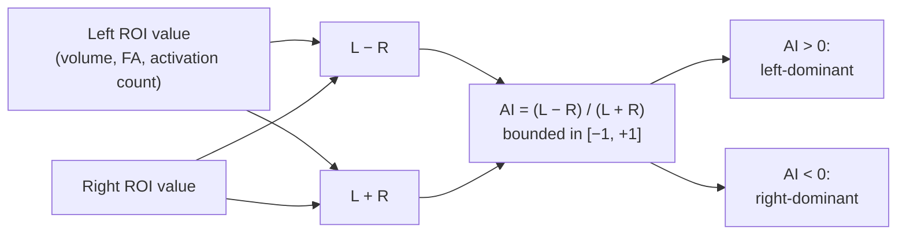

# Asymmetry analysis — laterality and the AI

> How to quantify left–right differences cleanly: the asymmetry index, language LI from fMRI, hippocampal AI in TLE, frontal alpha asymmetry, and the statistical pitfalls that bite.

Course map: why hemispheric asymmetry matters → the AI formula → structural AI (hippocampus and TLE) → fMRI language LI → DWI tract asymmetry → EEG frontal alpha asymmetry → statistical treatment → software → frontiers → references → where to next.

## 1. Learning objectives

By the end of this page you should be able to:

- Write the asymmetry index in its two common forms and state which is bounded.
- Compute a hippocampal AI from FreeSurfer `aseg.stats` and interpret it in TLE lateralisation.
- Run a multi-threshold / bootstrap language LI on task fMRI and explain why a single-threshold LI is fragile.
- Spot the regression-to-the-mean and scale-artifact pitfalls that inflate AI-based group statistics.
- Replace a collapsed AI with a mixed-effects model with hemisphere × group interaction when appropriate.
- Cite the dominant clinical use cases (TLE, pre-surgical language mapping, depression FAA) and their failure modes.

## 2. Why asymmetry matters

The brain is *not* symmetric. Language is left-dominant in roughly 95% of right-handers; the planum temporale is larger on the left; the arcuate fasciculus is bigger on the left; the hippocampus shrinks asymmetrically in temporal-lobe epilepsy; frontal-alpha asymmetry has been pursued for decades as a depression biomarker. The clinical-research literature treats laterality as one of the most stable biological signatures the field has.

The methodological appeal of asymmetry is that it is a **within-subject contrast** — every subject is their own control — so it is robust to between-subject confounds like head size, sex, and scanner. That advantage is real but it does *not* exempt you from null models or from the regression-to-the-mean problem laid out in §8.

Clinical and research heavyweights:

- TLE lateralisation (which hippocampus is sclerotic).
- Pre-surgical language lateralisation (which hemisphere carries language, replacing the Wada test).
- Alzheimer's disease (asymmetric atrophy patterns).
- Autism and schizophrenia (loss-of-asymmetry hypotheses).
- Depression and affective neuroscience (frontal alpha asymmetry as approach-vs-withdrawal motivation).
- Cross-link to [clinical/epilepsy.md](../clinical/epilepsy.md) and [structural.md](structural.md) for the disease-side detail.

## 3. The asymmetry index — formula and interpretation



The classical asymmetry index:

$$
\text{AI} \;=\; \frac{L - R}{(L + R) / 2} \;=\; \frac{2 (L - R)}{L + R}.
$$

The **bounded variant** (the one most modern papers use for ratio-scale data):

$$
\text{AI} \;=\; \frac{L - R}{L + R} \;\in\; [-1, +1].
$$

Negative values are right-dominant; positive values are left-dominant; zero is symmetric. Dividing by the sum removes scale dependence so two subjects with very different absolute volumes can be compared on the same axis.

### 3.1 The lateralisation index (LI) in fMRI

For task fMRI, the AI is recast as a **lateralisation index** $\text{LI}$, applied to suprathreshold voxel counts or summed activation magnitude within hemispheric ROIs:

$$
\text{LI} \;=\; \frac{\text{Activation}_L - \text{Activation}_R}{\text{Activation}_L + \text{Activation}_R}.
$$

Convention: $|\text{LI}| > 0.2$ is "lateralised"; $-0.2 \leq \text{LI} \leq 0.2$ is "bilateral"; the sign indicates direction. The convention is widely used clinically but is essentially arbitrary; report the continuous value plus a CI.

### 3.2 Multi-threshold LI and the bootstrap

A single-threshold LI is sensitive to the activation threshold chosen — a more conservative $z$ usually pushes LI to one extreme. The fix:

- **Multi-threshold LI** ([Wilke & Lidzba 2007](https://doi.org/10.1016/j.jneumeth.2006.10.011)): compute LI across many statistical thresholds and report the full curve and/or a weighted mean.
- **Bootstrap LI** ([Wilke & Schmithorst 2006](https://doi.org/10.1016/j.neuroimage.2006.04.182)): at each threshold, draw bootstrap samples of voxels within each hemisphere; produce an LI distribution and report mean + CI. Implemented in the [LI Toolbox](https://www.medizin.uni-tuebingen.de/de/das-klinikum/einrichtungen/kliniken/kinderklinik/kinderheilkunde-iii/forschung/li-toolbox) for SPM.

The bootstrap LI is the reference for clinical pre-surgical language mapping.

## 4. Structural asymmetry — the hippocampus and TLE

This is the **killer use case** for the AI. Temporal-lobe epilepsy patients commonly have asymmetric hippocampal volume — the affected (epileptogenic) side is smaller. An AI of $\geq 0.05$–$0.10$ (with the smaller side ipsilateral to scalp-EEG findings) is one of the most reliable structural biomarkers for surgical lateralisation in TLE.

Pipeline (the entire workflow in five steps):

1. Run FreeSurfer's `recon-all` (or FastSurfer) — see [structural.md](structural.md).
2. Read `aseg.stats` per subject; extract `Left-Hippocampus` and `Right-Hippocampus` volumes.
3. Compute $\text{AI} = (L - R) / (L + R)$.
4. Compare against a healthy reference distribution (slight $L > R$ in healthy adults is normal, [Pedraza 2004](https://doi.org/10.1017/S1355617704105080)).
5. Report a z-score against the reference; flag $|z| > 2$ as candidate for ipsilateral hippocampal sclerosis.

### 4.1 What "atrophy" looks like

In hippocampal sclerosis (mesial temporal sclerosis, the dominant TLE substrate), the affected hippocampus can lose 30% or more of its volume, with paired T2/FLAIR hyperintensity and loss of internal architecture. The volume AI captures the gross asymmetry; signal-intensity AI captures the gliosis. Cross-link to [clinical/epilepsy.md](../clinical/epilepsy.md) for the full surgical-candidate workup and the HARNESS-MRI protocol.

### 4.2 Specialist nuance — subfields beat the whole hippocampus

Whole-hippocampus AI misses the **subfield-specific** atrophy patterns that drive the disease. CA1 subfield atrophy is the most sensitive structural marker of HS-TLE ([Bernhardt 2016](https://doi.org/10.1093/brain/aww178)); CA1 + CA4 + subiculum patterns also distinguish HS subtypes. The FreeSurfer hippocampal-subfield module ([Iglesias 2015](https://doi.org/10.1016/j.neuroimage.2015.04.042)) is the standard pipeline; compute per-subfield AIs and report the full vector.

### 4.3 Other structural AIs

- **Cortical thickness AI** mapped genome-wide and across 17K subjects by ENIGMA ([Kong 2018](https://doi.org/10.1073/pnas.1718418115)).
- **Planum temporale AI** — the classical Geschwind-Levitsky finding: left > right in language-dominant individuals.
- **Amygdala, caudate, putamen** — modest asymmetries; volume AIs feature in autism and OCD literatures.

## 5. fMRI language laterality — replacing the Wada test

The Wada (intracarotid amobarbital) test was the historical gold standard for surgical language and memory lateralisation: anaesthetise one hemisphere and watch what the other can do. It is invasive (~1% stroke risk), expensive, and increasingly hard to deliver. Task fMRI with a language LI is the modern replacement, validated against Wada at 80–90% agreement in pre-surgical TLE cohorts.

### 5.1 Tasks

- **Covert verb generation** — see a noun, silently generate verbs. The classical Broca-activating task.
- **Sentence completion** — read a partial sentence, complete silently.
- **Semantic decision** — categorise words (living vs non-living). [Binder 2008](https://doi.org/10.1212/01.WNL.0000326592.42961.b9) is the canonical reference for pre-surgical predictive value.
- **Auditory comprehension** — listen to sentences vs reversed speech. Engages Wernicke's area.

Run two or three tasks and report concordance; single-task LI is not enough for a surgical decision.

### 5.2 ROI choice

LI changes substantially with the ROI mask. Standard choices: inferior frontal gyrus (Broca) + middle / superior temporal gyrus (Wernicke), or larger whole-hemisphere frontotemporal masks. [Wilke 2007](https://doi.org/10.1016/j.jneumeth.2006.10.011) discusses the sensitivity of LI to mask choice in detail. Pre-register the mask.

### 5.3 Practical points

- **Threshold dependence**: always report the multi-threshold curve, not a single point.
- **Bilingualism**: language LI is weaker in early bilinguals; document language history.
- **Active control task**: run a low-level baseline (rest, fixation, reversed speech) to remove non-language activity.
- **Integration with DWI**: pair the LI with arcuate fasciculus tractography (TractSeg, MRtrix bundles); concordance of activation lateralisation and arcuate AI strengthens the surgical case.
- **Pitfalls**: motion in the magnet (especially in younger or anxious patients), task non-compliance, signal dropout in orbitofrontal and anterior-temporal regions. Always inspect motion regressors and brain-coverage masks before trusting LI.

## 6. DWI tract asymmetry

The white-matter side of the same story.

### 6.1 Arcuate fasciculus

The arcuate is the classical left-lateralised language tract — left > right by volume in roughly 80% of right-handers. The right arcuate exists but is consistently smaller; it is hypothesised to carry prosody and music processing rather than syntax ([Catani 2007](https://doi.org/10.1073/pnas.0702116104)). Pipeline:

1. Run a CSD pipeline (see [diffusion.md](diffusion.md)) and segment the arcuate per hemisphere — [TractSeg](https://github.com/MIC-DKFZ/TractSeg) ([Wasserthal 2018](https://doi.org/10.1016/j.neuroimage.2018.07.070)) is the modern default.
2. Extract tract volume, mean FA, and streamline count per side.
3. Compute AI per metric.

### 6.2 Other tracts

- **Uncinate fasciculus** — asymmetry studied in psychosis, antisocial behaviour, executive dysfunction; effect sizes small and inconsistent.
- **Cingulum** — subtle asymmetry; clinical relevance unclear.
- **Inferior longitudinal fasciculus** — generally symmetric; AI is rarely informative.

### 6.3 The tractography asymmetry caveat

Tractography asymmetry is partly an **algorithmic artifact**: the smaller right arcuate reflects in part a shorter and more curved trajectory that streamline algorithms systematically under-recover. Always pair tract-AI claims with a histology or expert-dissection reference, and report the reconstruction stack you used. See the reproducibility-crisis section of [diffusion.md](diffusion.md) — tract volumes vary substantially across MRtrix vs FSL vs DSI Studio.

## 7. EEG frontal alpha asymmetry (FAA)

The most famous EEG asymmetry measure. FAA is the difference in scalp-recorded alpha-band (8–13 Hz) power between right and left frontal electrodes:

$$
\text{FAA} \;=\; \ln P_\alpha(F4) - \ln P_\alpha(F3).
$$

Because alpha power is *inversely* related to cortical activity (alpha desynchronises during engagement), a positive FAA — *less* left alpha — is interpreted as relatively greater left frontal activity, classically tied to approach motivation and lower depression risk ([Davidson 1992](https://doi.org/10.1016/0278-2626\(92\)90065-T)). For phase-based EEG metrics and the broader connectivity machinery, see [eeg.md §5](../analysis/eeg.md#5-functional-connectivity-in-eeg); this section does not duplicate PLV / PLI math.

### 7.1 The reproducibility problem

A 2006 meta-analysis ([Thibodeau 2006](https://doi.org/10.1037/0021-843X.115.4.715)) found small effect sizes for FAA-depression associations across dozens of studies. Test-retest reliability over weeks sits around ICC = 0.4. FAA is also strongly **reference-dependent**: average reference, REST reference, mastoid reference, and Laplacian transforms can each flip the sign of a borderline finding. Modern practice:

- Use average reference or REST reference; document.
- Compute FAA on long resting recordings (≥ 5 min); short blocks are unstable.
- Pair scalp FAA with a source-localised alpha lateralisation ([Smith 2018](https://doi.org/10.1111/psyp.13019)); source-space alpha asymmetry is more stable.
- Report bootstrap CIs, not just point estimates.

### 7.2 Other EEG asymmetries

- **Theta asymmetry** — emerging in depression and ADHD literatures.
- **Beta asymmetry** — used in attention and motor research.
- **ERP-latency asymmetries** (MMN, P3) — left vs right scalp latencies differ in some clinical populations.

## 8. Statistical treatment

The AI is a *ratio* of two random variables. Standard parametric stats on it can be wrong in subtle ways. The four issues that bite hardest:

### 8.1 Regression to the mean

$\text{AI} = (L - R) / (L + R)$ has non-uniform sensitivity to the denominator: subjects with both $L$ and $R$ small (smaller hippocampi overall, smaller activation totals) have noisier AI even when their underlying laterality is the same as everyone else's. Always check whether a group difference in AI tracks a group difference in absolute $(L + R)$ rather than true laterality. The honest sanity check: compute the AI on the absolute values *and* on the residuals of $L - R$ regressed on $L + R$; the two should agree.

### 8.2 Scaling artifacts and distributional assumptions

AI is bounded in $[-1, +1]$; its distribution is rarely Gaussian. Standard $t$-tests and Pearson correlations assume normality. Bootstrap CIs, non-parametric tests (Mann-Whitney, Wilcoxon), or generalised linear models with a beta-family link are safer defaults.

### 8.3 Handedness as a covariate

Right- and left-handers have systematically different baseline lateralisation. **Always** stratify by handedness or include it as a covariate; report handedness composition. Mixed-handedness ("ambidextrous") subjects often look like outliers; treat as a separate group rather than collapsing into right-handers.

### 8.4 A better alternative — mixed-effects model with hemisphere as factor

Collapsing $L$ and $R$ into a single scalar AI throws away half the information and inflates noise. The information-preserving alternative is a mixed-effects model with hemisphere as a within-subject factor:

$$
y_{ij} \;=\; \beta_0 \;+\; \beta_1\, \text{group}_i \;+\; \beta_2\, \text{hemisphere}_{ij} \;+\; \beta_3\, (\text{group} \times \text{hemisphere})_{ij} \;+\; u_i \;+\; \varepsilon_{ij},
$$

with $u_i$ a per-subject random intercept. The **interaction term $\beta_3$ IS the laterality test** — does the L–R difference differ between groups? This formulation also accommodates covariates (age, sex, handedness, ICV) without collapsing to a ratio. Cross-link to [longitudinal.md](longitudinal.md) for the mixed-model machinery and to [group-stats.md](group-stats.md) for the design-matrix view.

### 8.5 Permutation AI

When parametric assumptions are uncomfortable, a within-subject permutation test is the safe default: shuffle the hemisphere labels for each subject, recompute the group AI, rebuild the null distribution. Implemented in `nilearn` and FSL `randomise` for voxelwise / vertexwise AI maps.

### 8.6 Multiple comparisons

If you compute AIs at every voxel, vertex, or parcel, you have a multiple-comparisons problem identical to any other neuroimaging map. Use TFCE + permutation (the modern default) or cluster correction with a tight cluster-forming threshold; see [multiple-comparisons.md](multiple-comparisons.md).

### 8.7 A bootstrap LI in Python

```python
import numpy as np

def bootstrap_LI(act_L, act_R, n_boot=10_000, rng=None):
    """Compute bootstrap mean + 95% CI for the laterality index.

    act_L, act_R: 1-D arrays of suprathreshold voxel values (or counts) per hemisphere.
    """
    rng = np.random.default_rng(rng)
    Ls = rng.choice(act_L, size=(n_boot, len(act_L)), replace=True).sum(axis=1)
    Rs = rng.choice(act_R, size=(n_boot, len(act_R)), replace=True).sum(axis=1)
    LI = (Ls - Rs) / (Ls + Rs)
    return LI.mean(), np.percentile(LI, [2.5, 97.5])

# Example usage on a single subject:
# left_vox  = stat_map[mask_left]
# right_vox = stat_map[mask_right]
# mean_LI, (lo, hi) = bootstrap_LI(left_vox, right_vox)
```

This is the same machinery the LI Toolbox runs; the production version sweeps a grid of statistical thresholds and reports the LI curve.

## 9. Software

- [LI Toolbox (Wilke)](https://www.medizin.uni-tuebingen.de/de/das-klinikum/einrichtungen/kliniken/kinderklinik/kinderheilkunde-iii/forschung/li-toolbox) — SPM toolbox for bootstrap LI on task fMRI; the de facto clinical standard.
- [FreeSurfer](https://surfer.nmr.mgh.harvard.edu/) — `aseg.stats` and the hippocampal-subfield module ([Iglesias 2015](https://doi.org/10.1016/j.neuroimage.2015.04.042)) for structural AI.
- [ENIGMA Toolbox](https://github.com/MICA-MNI/ENIGMA) — pre-computed AI maps for many disorders and hemispheric meta-analyses.
- [TractSeg](https://github.com/MIC-DKFZ/TractSeg) — bundle segmentation for tract-volume / FA AI.
- [MNE-Python](https://mne.tools) — `psd_array_welch` / `psd_array_multitaper` on F3 / F4 channels (or source labels) for FAA; spectral connectivity submodule for the broader EEG asymmetry literature ([eeg.md §5](../analysis/eeg.md#5-functional-connectivity-in-eeg)).
- [PALM (FSL)](https://fsl.fmrib.ox.ac.uk/fsl/fslwiki/PALM) — permutation testing for voxelwise / vertexwise AI maps; supports paired within-subject contrasts.

## 10. Frontiers

- **Multi-modal AI fusion.** Combining structural, DWI, and functional asymmetry into a joint laterality score outperforms any single modality ([Kong 2022](https://doi.org/10.1126/sciadv.abh3669)).
- **Hemispheric specialisation as a continuum.** Laterality is not binary L/R but a gradient of segregation vs integration; [Karolis 2019](https://doi.org/10.1038/s41467-019-09452-y) maps four functional axes of lateralisation that cut across the simple left-vs-right framing.
- **Genome-wide association of brain asymmetry.** Large consortia (ENIGMA-laterality) have begun finding heritable common variants associated with cortical and subcortical asymmetry patterns ([Sha 2021](https://doi.org/10.1073/pnas.2113095118)).
- **Developmental trajectory.** AI changes with age — most structural asymmetries are present at birth but their magnitude shifts through childhood and adolescence; longitudinal analyses require mixed models per [longitudinal.md](longitudinal.md).
- **Asymmetry in connectomes.** Per-edge L–R asymmetry of structural or functional connectomes captures network-level laterality that per-region AI misses; pairs naturally with the metrics in [network-metrics.md](network-metrics.md).

## 11. References

1. Wilke M, Lidzba K. LI-tool: a new toolbox to assess lateralization in functional MR-data. *J Neurosci Methods.* 2007;163(1):128-136. [doi:10.1016/j.jneumeth.2006.10.011](https://doi.org/10.1016/j.jneumeth.2006.10.011)
2. Wilke M, Schmithorst VJ. A combined bootstrap/histogram analysis approach for computing a lateralization index from neuroimaging data. *NeuroImage.* 2006;33(2):522-530. [doi:10.1016/j.neuroimage.2006.04.182](https://doi.org/10.1016/j.neuroimage.2006.04.182)
3. Binder JR, Swanson SJ, Hammeke TA, et al. Use of preoperative functional MRI to predict verbal memory decline after temporal lobe epilepsy surgery. *Neurology.* 2008;71(23):1788-1795. [doi:10.1212/01.WNL.0000326592.42961.b9](https://doi.org/10.1212/01.WNL.0000326592.42961.b9)
4. Pedraza O, Bowers D, Gilmore R. Asymmetry of the hippocampus and amygdala in MRI volumetric measurements of normal adults. *J Int Neuropsychol Soc.* 2004;10(5):664-678. [doi:10.1017/S1355617704105080](https://doi.org/10.1017/S1355617704105080)
5. Bernhardt BC, Bernasconi A, Liu M, et al. The spectrum of structural and functional imaging abnormalities in temporal lobe epilepsy. *Brain.* 2016;139(8):2228-2239. [doi:10.1093/brain/aww178](https://doi.org/10.1093/brain/aww178)
6. Iglesias JE, Augustinack JC, Nguyen K, et al. A computational atlas of the hippocampal formation using ex vivo, ultra-high resolution MRI. *NeuroImage.* 2015;115:117-137. [doi:10.1016/j.neuroimage.2015.04.042](https://doi.org/10.1016/j.neuroimage.2015.04.042)
7. Kong X-Z, Mathias SR, Guadalupe T, et al. Mapping cortical brain asymmetry in 17,141 healthy individuals worldwide via the ENIGMA Consortium. *PNAS.* 2018;115(22):E5154-E5163. [doi:10.1073/pnas.1718418115](https://doi.org/10.1073/pnas.1718418115)
8. Catani M, Allin MPG, Husain M, et al. Symmetries in human brain language pathways correlate with verbal recall. *PNAS.* 2007;104(43):17163-17168. [doi:10.1073/pnas.0702116104](https://doi.org/10.1073/pnas.0702116104)
9. Wasserthal J, Neher P, Maier-Hein KH. TractSeg — fast and accurate white matter tract segmentation. *NeuroImage.* 2018;183:239-253. [doi:10.1016/j.neuroimage.2018.07.070](https://doi.org/10.1016/j.neuroimage.2018.07.070)
10. Davidson RJ. Anterior cerebral asymmetry and the nature of emotion. *Brain Cogn.* 1992;20(1):125-151. [doi:10.1016/0278-2626(92)90065-T](https://doi.org/10.1016/0278-2626\(92\)90065-T)
11. Thibodeau R, Jorgensen RS, Kim S. Depression, anxiety, and resting frontal EEG asymmetry: a meta-analytic review. *J Abnorm Psychol.* 2006;115(4):715-729. [doi:10.1037/0021-843X.115.4.715](https://doi.org/10.1037/0021-843X.115.4.715)
12. Smith EE, Cavanagh JF, Allen JJB. Intracranial source activity (eLORETA) related to scalp-level asymmetry scores and depression status. *Psychophysiology.* 2018;55(1):e13019. [doi:10.1111/psyp.13019](https://doi.org/10.1111/psyp.13019)
13. Karolis VR, Corbetta M, Thiebaut de Schotten M. The architecture of functional lateralisation and its relationship to callosal connectivity in the human brain. *Nat Commun.* 2019;10:1417. [doi:10.1038/s41467-019-09452-y](https://doi.org/10.1038/s41467-019-09452-y)
14. Kong X-Z, Postema MC, Guadalupe T, et al. Mapping brain asymmetry in health and disease through the ENIGMA Consortium. *Sci Adv.* 2022;8(20):eabh3669. [doi:10.1126/sciadv.abh3669](https://doi.org/10.1126/sciadv.abh3669)
15. Sha Z, Schijven D, Carrion-Castillo A, et al. The genetic architecture of structural left–right asymmetry of the human brain. *PNAS.* 2021;118(34):e2113095118. [doi:10.1073/pnas.2113095118](https://doi.org/10.1073/pnas.2113095118)

## 12. Where to next

- [structural.md](structural.md) — hippocampal-volume context and the FreeSurfer pipeline that produces the inputs to a structural AI.
- [functional.md](functional.md) — task and resting fMRI pipelines upstream of LI.
- [eeg.md §5](../analysis/eeg.md#5-functional-connectivity-in-eeg) — EEG connectivity and the broader spectral-asymmetry literature.
- [group-stats.md](group-stats.md) — second-level GLM, between-subject design.
- [longitudinal.md](longitudinal.md) — mixed-effects modelling with hemisphere as a within-subject factor.
- [clinical/epilepsy.md](../clinical/epilepsy.md) — TLE workup, HARNESS-MRI, and the surgical use case for hippocampal AI.
- [network-metrics.md](network-metrics.md) — once you have laterality at the regional level, the same machinery extends to per-edge connectome asymmetry.
