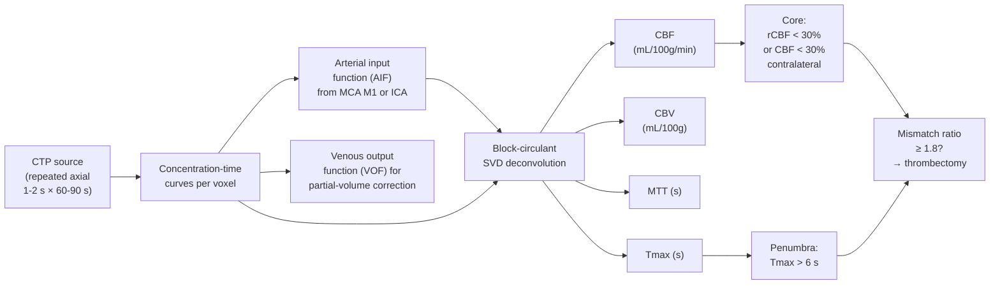

# CT analysis — from HU volumes to clinical inference

> Hounsfield Units to ASPECTS to penumbra: the CT-specific analysis pipeline that turns DICOM stacks into stroke triage, hemorrhage volumes, and clinical-trial endpoints.

Course map: why CT analysis differs from MR analysis → HU calibration → tissue segmentation → ICH segmentation and volume → ASPECTS → CT-perfusion deconvolution → CTA / LVO detection → multi-modal MR-CT integration → disease applications → frontiers → software → references.

## 1. Learning objectives

- State the three things CT analysis can *skip* compared to MR analysis (bias-field correction, intensity normalisation, multi-site harmonisation at the intensity level) and the new thing it adds (windowing).
- Read the HU range for any brain tissue and explain why pure-threshold segmentation works for skull and CSF but fails for GM / WM separation.
- Compute an ICH volume by the ABC/2 rule and explain why automated nnU-Net variants are now displacing it.
- Score an NCCT on the ASPECTS template and quantify the inter-rater variability that motivated automated e-ASPECTS / Frontier ASPECTS.
- Derive CBF / CBV / Tmax from CTP source data via deconvolution against an arterial input function.
- Recognise the DAWN / DEFUSE-3 mismatch thresholds (Tmax > 6 s, rCBF < 30%, ratio ≥ 1.8) and name the FDA-cleared software that produced them.

## 2. Why CT analysis differs from MR analysis

Hounsfield Units are calibrated. The same brain tissue reports within ~10% across scanners and across decades — no MR-style intensity normalisation, no bias-field correction with N4, no inter-scanner ComBat at the intensity level. Where MR pipelines spend half their compute budget on intensity hygiene, CT pipelines spend it on segmentation, windowing, and downstream quantification.

But CT brings its own twists. Dose, kernel, and patient size all set the noise floor. Soft-tissue contrast is roughly 10 HU between gray and white matter — beneath what an 8-bit display can resolve without **windowing**, the clinical practice of mapping a chosen HU range (e.g., 0-75 HU for brain) to the full 256-greyscale display dynamic range. Window/level (W/L) choices:

| Window | Width / Level (HU) | Use |
|---|---|---|
| Brain | 80 / 35 | Standard grey-white differentiation |
| Subdural / blood | 130 / 50 | Stroke and ICH; widens to catch hyperdense clot |
| Bone | 2000 / 700 | Skull base, fractures, mastoid |
| Lung | 1500 / -600 | Chest CT (not neuro but on the same scanner) |
| Wide / soft tissue | 400 / 40 | Abdomen / neck |

Multi-window inputs to deep networks meaningfully boost small-lesion sensitivity, which is why most published ICH and stroke models stack 3-5 windows as input channels.

For the underlying physics — Beer-Lambert, polychromatic beam hardening, reconstruction families — see [fundamentals/sequences/ct.md](../fundamentals/sequences/ct.md). This page is what you do *after* you have a HU volume.

## 3. HU calibration and tissue segmentation

### Phantom QC

Every clinical CT site runs the ACR CT accreditation phantom (water module: 0 ± 5 HU at the central ROI). Daily air calibrations and quarterly full QC are mandatory. For research analyses, document scanner / kernel / kVp in the dataset; HU drift of ~10 HU across vendors is normal and reproducible.

### Tissue HU ranges in brain

| Tissue | HU range |
|---|---|
| Air | −1000 to −800 |
| Fat | −100 to −50 |
| CSF | 0 to 15 |
| White matter | 20 to 30 |
| Gray matter | 30 to 45 |
| Acute blood | 40 to 90 |
| Chronic calcification | 100 to 300 |
| Cortical bone | 200 to 3000 |

### Segmentation strategies

- **Pure HU thresholding** works for the easy classes: bone (> 250 HU), CSF (< 15 HU), air (< -500 HU). Skull stripping by `bone-and-fill` morphology is robust because the bone-brain HU boundary is unambiguous.
- **Bayesian / Gaussian-mixture** models handle GM / WM overlap by fitting a 3-class mixture in HU space — works in healthy brains, breaks in oedema and around lesions.
- **Deep-learning segmentation** is now standard. [BLAST-CT](https://github.com/biomedia-mira/blast-ct) ([Monteiro 2020](https://doi.org/10.1016/S2589-7500(20)30085-6)) and [DeepBleed](https://github.com/msharrock/deepbleed) cover hemorrhage; [nnU-Net](https://github.com/MIC-DKFZ/nnUNet) ([Isensee 2021](https://doi.org/10.1038/s41592-020-01008-z)) trained on the [RSNA Intracranial Hemorrhage challenge](https://www.kaggle.com/competitions/rsna-intracranial-hemorrhage-detection) is the open-source ICH baseline; FreeSurfer's [`recon-all-clinical`](https://surfer.nmr.mgh.harvard.edu/fswiki/recon-all-clinical) ([Iglesias 2023](https://doi.org/10.1016/j.media.2023.102910)) ports the cortical-surface reconstruction pipeline to CT and to clinical low-resolution MRI.

## 4. ICH segmentation and volume estimation

### ABC/2 — the clinical standard

For two decades, intracerebral haemorrhage volume has been computed at the bedside by the **ABC/2** rule:

$$
V_{\text{ICH}} \approx \frac{A \times B \times C}{2}
$$

where $A$ is the largest in-plane diameter on the slice with the biggest haematoma, $B$ is the perpendicular diameter on that same slice (in cm), and $C$ is the number of slices containing haemorrhage multiplied by slice thickness. Fast, hand-measurable, and embedded in the [ICH score](https://doi.org/10.1161/01.STR.32.4.891) ([Hemphill 2001](https://doi.org/10.1161/01.STR.32.4.891)). Inter-rater agreement is good for round haemorrhages, poor for irregular shapes — which is why automation has been a moving target.

### Modern automated ICH segmentation

- [BLAST-CT](https://github.com/biomedia-mira/blast-ct) — multiclass segmentation of haemorrhage, contusion, ischaemia on head CT; [Monteiro 2020 *Lancet Digital Health*](https://doi.org/10.1016/S2589-7500(20)30085-6).
- [DeepBleed](https://github.com/msharrock/deepbleed) — single-class haemorrhage detection / segmentation.
- nnU-Net variants trained on the RSNA-ICH dataset ([Lee 2020](https://doi.org/10.1148/ryai.2020190211)) and CQ500 ([Chilamkurthy 2018](https://doi.org/10.1016/S0140-6736(18)31645-3)).
- Commercial: [Aidoc](https://www.aidoc.com), [RapidAI Rapid ICH](https://www.rapidai.com/rapid-ich), [Viz.ai Viz ICH](https://www.viz.ai), [Brainomix e-ICH](https://www.brainomix.com).

Volume is the dominant outcome predictor: every additional 10 mL of ICH volume increases 30-day mortality by roughly 30%. The **ICH score** ([Hemphill 2001](https://doi.org/10.1161/01.STR.32.4.891)) combines age (≥80 yr), GCS, ICH volume (≥30 mL), intraventricular extension, and infratentorial location for a 0-6 mortality grade. Cross-link: [clinical/stroke-and-tbi.md](../clinical/stroke-and-tbi.md).

## 5. ASPECTS — the Alberta Stroke Program Early CT Score

A 10-point reverse score (10 = normal, 0 = devastating) assessing 10 standardised regions of the MCA territory (caudate, lentiform, insula, internal capsule, M1-M6 cortical zones) for early ischaemic change on NCCT — sulcal effacement, loss of grey-white differentiation, hypodensity ([Barber 2000](https://doi.org/10.1016/S0140-6736(00)02237-6)).

**Clinical thresholds.**

- ASPECTS = 10: normal scan.
- ASPECTS ≥ 7: thrombectomy generally favourable.
- ASPECTS 6: borderline — requires CTP or clinical adjudication.
- ASPECTS ≤ 5: large established core; trial evidence for thrombectomy is mixed (TENSION, SELECT2).

**Manual variability.** Inter-rater κ for human readers is 0.6-0.7 — adequate for triage, marginal for trial-eligibility adjudication. The 1-point steps near the 5/6 decision boundary translate to materially different recommendations across raters.

**Automated ASPECTS.** [e-ASPECTS](https://www.brainomix.com) (Brainomix), [RAPID ASPECTS](https://www.rapidai.com), and Frontier ASPECTS push κ to 0.85+ against expert consensus, with FDA clearance for clinical-decision support ([Nagel 2017](https://doi.org/10.1161/STROKEAHA.117.018676)). The win is consistency: the same algorithm gives the same score across the night shift, the weekend, and the four sites in a multi-centre trial.

## 6. CT perfusion analysis



### The deconvolution model

After iodinated bolus, each voxel's HU rise-and-fall is the convolution of the arterial input function $C_{\text{AIF}}(t)$ with the local impulse residue function $R(t)$:

$$
C_{\text{voxel}}(t) = \text{CBF} \cdot \big( C_{\text{AIF}} \ast R \big)(t).
$$

Recovering $R(t)$ from $C_{\text{voxel}}$ and $C_{\text{AIF}}$ is a deconvolution. Direct SVD inversion is unstable in the presence of bolus delay (which is exactly the situation in stroke). **Block-circulant SVD deconvolution** ([Wu 2003](https://doi.org/10.1002/mrm.10522)) is the modern standard — robust to arterial-arrival delay, and what every major commercial vendor implements.

Outputs per voxel:

| Map | Definition | Units | Clinical role |
|---|---|---|---|
| **CBF** | Peak of $R(t)$ × CBF scaling | mL/100 g/min | Core estimation (rCBF < 30%) |
| **CBV** | $\int R(t)\,dt$ × CBF | mL/100 g | Less dynamic; tumour vascularity |
| **MTT** | CBV / CBF | s | Slow flow indicator |
| **Tmax** | Time at which the deconvolved residue function peaks | s | Penumbra (Tmax > 6 s) |

### Trial-defined thresholds

The thresholds embedded in modern stroke trials are not eyeballed — they come from FDA-cleared software:

| Region | Threshold | Trial origin |
|---|---|---|
| **Core** | rCBF < 30% of contralateral (or CBF < 30%) | DEFUSE-3, DAWN, EXTEND-IA |
| **Penumbra** | Tmax > 6 s | DEFUSE-3, EXTEND-IA |
| **Mismatch ratio** | (Tmax > 6 s volume) / (core volume) ≥ 1.8 | DEFUSE-3 |
| **Mismatch volume** | (Tmax > 6 s) − (core) ≥ 15 mL | DEFUSE-3 |
| **Maximum core** | ≤ 70 mL (DEFUSE-3); ≤ 31-51 mL (DAWN, age- and NIHSS-dependent) | DEFUSE-3, DAWN |

### Software variability — the open harmonisation problem

[RAPID](https://www.rapidai.com) (iSchemaView, the trial standard for DAWN and DEFUSE-3), [Brain-CTP / e-CTP](https://www.brainomix.com) (Brainomix), [OleaSphere](https://www.olea-medical.com), and [iSchemaView](https://www.ischemaview.com) all consume the same CTP source data and emit *different* core / penumbra estimates. The differences are real and clinically significant — a borderline thrombectomy decision can flip depending on which post-processor is hospital-installed. [Bivard 2019](https://doi.org/10.1161/STROKEAHA.118.024349) and follow-up work (Albers 2020, Olivot 2023) document the harmonisation gap; the field has no consensus calibration.

Cross-link: [tools/clinical-deployment.md](../tools/clinical-deployment.md) for the deployment side.

## 7. CTA and LVO detection

Maximum-intensity-projection (MIP) reconstructions render the contrast-filled arterial tree from the helical CTA acquisition. A radiologist reads the MIP for **large-vessel occlusion (LVO)**: occlusion at the intracranial ICA, M1, M2, A1, or basilar — the lesions eligible for mechanical thrombectomy.

**Automated LVO detection.** FDA-cleared since 2018 — [Viz.ai](https://www.viz.ai) (the original; CMS New Technology Add-on Payment in 2020), [RapidAI](https://www.rapidai.com), [Brainomix](https://www.brainomix.com) — with sensitivity 80-95% and specificity 90-95% on real-world cohorts. Cite [Murray 2020](https://doi.org/10.1136/svn-2019-000297) for a representative external validation.

The clinical win is **workflow**: a positive LVO detection triggers a smartphone alert to the on-call neurointerventionalist *before* the human radiologist finalises the read, saving roughly 30 minutes in door-to-groin time in deployed centres. The cost is false-positive fatigue — even 90% specificity translates to hundreds of false alarms per year in a busy comprehensive stroke centre.

## 8. Multi-modal MR-CT integration

```python
import ants
ct = ants.image_read("sub-01_ct.nii.gz")
t1 = ants.image_read("sub-01_T1w.nii.gz")
# Rigid within-subject registration (same-day NCCT and MPRAGE)
reg = ants.registration(fixed=t1, moving=ct, type_of_transform="Rigid")
ct_in_t1 = reg["warpedmovout"]
ants.image_write(ct_in_t1, "sub-01_ct_in_T1w.nii.gz")
```

**Same-day rigid registration** (within-subject NCCT ↔ MPRAGE) is the easy case — both volumes are of the same skull, neither has distortion. Mutual-information cost (ANTs `Rigid` or FSL `flirt -cost mutualinfo`) converges reliably.

**CT → template normalisation** has two paths:

1. Direct CT → CT-template (e.g., Rorden 2012 [ATLAS-ICH](https://www.nitrc.org/projects/clinicaltbx)). Works when MR is unavailable; the CT template is coarser than MNI but adequate for lesion-symptom mapping at the lobar level.
2. CT → subject MR → MNI152. More accurate when an MR is available; uses the cortical detail of the MR to drive the nonlinear warp.

**MR-CT fusion** is routine in radiotherapy planning (CT gives electron density for dose calculation, MR gives target conspicuity) and stereotactic neurosurgery (MR for target, CT for the fiducial frame).

## 9. Disease application table

| Application | CT-derived metric | Clinical action | Cross-link |
|---|---|---|---|
| Acute ischaemic stroke | ASPECTS, LVO on CTA, core / penumbra on CTP | IV tPA + thrombectomy (DAWN, DEFUSE-3) | [clinical/stroke-and-tbi.md](../clinical/stroke-and-tbi.md) |
| Intracerebral haemorrhage | ICH volume (ABC/2 or automated), IVH presence | ICH score → surgery vs medical | [Hemphill 2001](https://doi.org/10.1161/01.STR.32.4.891) |
| Subarachnoid haemorrhage | Fisher / modified-Fisher grade | Vasospasm risk stratification | [Frontera 2006](https://doi.org/10.1227/01.NEU.0000218821.34014.1B) |
| TBI | Marshall and Rotterdam classifications | ICU admission, ICP monitoring | [Marshall 1991](https://doi.org/10.3171/jns.1991.75.1s.s14) |
| Hydrocephalus | Evans index, FOHR, callosal angle | Shunt vs watch (NPH workup) | Standard neuroradiology |
| Tumour follow-up | Residual contrast enhancement; necrosis volume | Re-operation, radiation re-planning | When MR unavailable |
| Pulmonary embolism (incidental) | Filling defect on CTA | Anticoagulation | Not neuro |
| Brain death | CTA cerebral circulation arrest | Adjunct to clinical exam | [AAN 2015 guideline](https://doi.org/10.1212/WNL.0000000000001999) |

## 10. Frontiers

- **Photon-counting CT (PCCT).** Direct-conversion CdTe / CdZnTe detectors deliver sub-millimetre resolution, K-edge subtraction for novel contrast (gold, bismuth, gadolinium nanoparticles), and lower dose at equivalent SNR. Siemens Naeotom Alpha FDA-cleared 2021. The neuroimaging applications — sub-millimetre vessel-wall imaging, multi-contrast simultaneous K-edge maps — are early but rapidly advancing. Cite [Willemink 2018](https://doi.org/10.1148/radiol.2018172656).
- **Deep-learning reconstruction validation.** The AAPM TG279 working group is the active venue for low-dose hallucination, calibration on rare pathology, and regulatory frameworks for re-training. Open question: how do you certify that a DLR reconstruction does not invent a lesion or erase one?
- **DL-based denoising at ultra-low dose.** Sub-mSv head CT is in active development (current standard is ~2 mSv). Promising for paediatric and longitudinal cohorts; the diagnostic-equivalence trials are not yet conclusive.
- **CT radiomics.** Engineered + DL-extracted texture and shape features predict tumour grade, treatment response, and survival in lung, renal, glioma, and meningioma cohorts. Reproducibility across scanners and kernels is the dominant obstacle; the [IBSI initiative](https://theibsi.github.io) is the standardisation venue.
- **Radiogenomics on CT.** Predicting molecular markers (IDH, MGMT, EGFR) from CT features alone — less powerful than MR radiogenomics, but relevant when MR is unavailable.
- **AI for CTP automation and harmonisation.** Cross-vendor calibration of core / penumbra estimates remains an open problem; an open-source reference implementation against which to benchmark RAPID, Brain-CTP, OleaSphere would change the field. Cross-link [ai/regulatory.md](../ai/regulatory.md) for the FDA-cleared landscape.
- **CT brain-age and dementia screening.** Cortical-thickness on CT via [`recon-all-clinical`](https://surfer.nmr.mgh.harvard.edu/fswiki/recon-all-clinical) ([Iglesias 2023](https://doi.org/10.1016/j.media.2023.102910)) opens dementia biomarkers in cohorts that have CT but not MR — early, but actively published.

## 11. Software ecosystem

| Tool | Role |
|---|---|
| [3D Slicer](https://www.slicer.org) | Open-source visualisation, segmentation, registration |
| [ITK-SNAP](http://www.itksnap.org) | Manual + semi-automated segmentation; widely used for ICH masks |
| [BLAST-CT](https://github.com/biomedia-mira/blast-ct) | Multiclass CT lesion segmentation ([Monteiro 2020](https://doi.org/10.1016/S2589-7500(20)30085-6)) |
| [DeepBleed](https://github.com/msharrock/deepbleed) | Open ICH segmentation |
| [nnU-Net](https://github.com/MIC-DKFZ/nnUNet) | Default segmentation backbone; multiple CT challenge winners |
| [`recon-all-clinical`](https://surfer.nmr.mgh.harvard.edu/fswiki/recon-all-clinical) | FreeSurfer cortical surfaces from CT and low-res clinical MR |
| [RapidAI](https://www.rapidai.com) | FDA-cleared CTP, LVO, ICH, ASPECTS (clinical) |
| [Brain-CTP / e-CTP / e-ASPECTS](https://www.brainomix.com) | Brainomix CTP and ASPECTS automation |
| [OleaSphere](https://www.olea-medical.com) | Multimodal post-processing including CTP |
| [Viz.ai](https://www.viz.ai) | LVO + ICH + workflow paging |
| [Aidoc](https://www.aidoc.com) | Broad CT triage (ICH, PE, cervical fracture) |
| [pydicom](https://pydicom.github.io), [SimpleITK](https://simpleitk.org), [dcm2niix](https://github.com/rordenlab/dcm2niix) | Programmatic CT I/O |
| [ATLAS-ICH atlas](https://www.nitrc.org/projects/clinicaltbx) | CT-template warping (Rorden 2012) |
| [Clinical Toolbox for SPM](https://www.nitrc.org/projects/clinicaltbx) | CT normalisation in SPM |

## 12. References

1. **Hounsfield GN.** Computerized transverse axial scanning (tomography): Part 1. *Br J Radiol.* 1973;46(552):1016-1022. [doi:10.1259/0007-1285-46-552-1016](https://doi.org/10.1259/0007-1285-46-552-1016)
2. **Hemphill JC III, Bonovich DC, Besmertis L, Manley GT, Johnston SC.** The ICH score: a simple, reliable grading scale for intracerebral hemorrhage. *Stroke.* 2001;32(4):891-897. [doi:10.1161/01.STR.32.4.891](https://doi.org/10.1161/01.STR.32.4.891)
3. **Barber PA, Demchuk AM, Zhang J, Buchan AM.** Validity and reliability of a quantitative computed tomography score in predicting outcome of hyperacute stroke before thrombolytic therapy: ASPECTS Study Group. *Lancet.* 2000;355(9216):1670-1674. [doi:10.1016/S0140-6736(00)02237-6](https://doi.org/10.1016/S0140-6736(00)02237-6)
4. **Nagel S, Sinha D, Day D, et al.** e-ASPECTS software is non-inferior to neuroradiologists in applying the ASPECT score to computed tomography scans of acute ischemic stroke patients. *Stroke.* 2017;12(6):615-622. [doi:10.1161/STROKEAHA.117.018676](https://doi.org/10.1161/STROKEAHA.117.018676)
5. **Wu O, Østergaard L, Weisskoff RM, Benner T, Rosen BR, Sorensen AG.** Tracer arrival timing-insensitive technique for estimating flow in MR perfusion-weighted imaging using singular value decomposition with a block-circulant deconvolution matrix. *Magn Reson Med.* 2003;50(1):164-174. [doi:10.1002/mrm.10522](https://doi.org/10.1002/mrm.10522)
6. **Nogueira RG, Jadhav AP, Haussen DC, et al.** Thrombectomy 6 to 24 hours after stroke (DAWN). *N Engl J Med.* 2018;378(1):11-21. [doi:10.1056/NEJMoa1706442](https://doi.org/10.1056/NEJMoa1706442)
7. **Albers GW, Marks MP, Kemp S, et al.** Thrombectomy for stroke at 6 to 16 hours with selection by perfusion imaging (DEFUSE-3). *N Engl J Med.* 2018;378(8):708-718. [doi:10.1056/NEJMoa1713973](https://doi.org/10.1056/NEJMoa1713973)
8. **Goyal M, Menon BK, van Zwam WH, et al.** Endovascular thrombectomy after large-vessel ischaemic stroke (HERMES). *Lancet.* 2016;387(10029):1723-1731. [doi:10.1016/S0140-6736(16)00163-X](https://doi.org/10.1016/S0140-6736(16)00163-X)
9. **Bivard A, Kleinig T, Miteff F, et al.** Ischemic core thresholds change with time to reperfusion: a case control study. *Stroke.* 2019;50(8):2192-2199. [doi:10.1161/STROKEAHA.118.024349](https://doi.org/10.1161/STROKEAHA.118.024349)
10. **Murray NM, Unberath M, Hager GD, Hui FK.** Artificial intelligence to diagnose ischemic stroke and identify large vessel occlusions: a systematic review. *J Neurointerv Surg.* 2020;12(2):156-164. [doi:10.1136/svn-2019-000297](https://doi.org/10.1136/svn-2019-000297)
11. **Monteiro M, Newcombe VFJ, Mathieu F, et al.** Multiclass semantic segmentation and quantification of traumatic brain injury lesions on head CT using deep learning (BLAST-CT). *Lancet Digital Health.* 2020;2(6):e314-e322. [doi:10.1016/S2589-7500(20)30085-6](https://doi.org/10.1016/S2589-7500(20)30085-6)
12. **Chilamkurthy S, Ghosh R, Tanamala S, et al.** Deep learning algorithms for detection of critical findings in head CT scans (CQ500). *Lancet.* 2018;392(10162):2388-2396. [doi:10.1016/S0140-6736(18)31645-3](https://doi.org/10.1016/S0140-6736(18)31645-3)
13. **Lee H, Yune S, Mansouri M, et al.** An explainable deep-learning algorithm for the detection of acute intracranial haemorrhage from small datasets. *Nat Biomed Eng.* 2019;3(3):173-182. [doi:10.1038/s41551-018-0324-9](https://doi.org/10.1038/s41551-018-0324-9)
14. **Isensee F, Jaeger PF, Kohl SAA, Petersen J, Maier-Hein KH.** nnU-Net: a self-configuring method for deep learning-based biomedical image segmentation. *Nat Methods.* 2021;18:203-211. [doi:10.1038/s41592-020-01008-z](https://doi.org/10.1038/s41592-020-01008-z)
15. **Iglesias JE, Billot B, Balbastre Y, et al.** SynthSR / recon-all-clinical: cortical surface reconstruction from low-resolution clinical MRI and CT. *Med Image Anal.* 2023;86:102910. [doi:10.1016/j.media.2023.102910](https://doi.org/10.1016/j.media.2023.102910)
16. **Willemink MJ, Persson M, Pourmorteza A, Pelc NJ, Fleischmann D.** Photon-counting CT: technical principles and clinical prospects. *Radiology.* 2018;289(2):293-312. [doi:10.1148/radiol.2018172656](https://doi.org/10.1148/radiol.2018172656)
17. **Frontera JA, Claassen J, Schmidt JM, et al.** Prediction of symptomatic vasospasm after subarachnoid hemorrhage: the modified Fisher scale. *Neurosurgery.* 2006;59(1):21-27. [doi:10.1227/01.NEU.0000218821.34014.1B](https://doi.org/10.1227/01.NEU.0000218821.34014.1B)
18. **Mongan J, Moy L, Kahn CE Jr.** Checklist for Artificial Intelligence in Medical Imaging (CLAIM). *Radiol Artif Intell.* 2020;2(2):e200029. [doi:10.1148/ryai.2020200029](https://doi.org/10.1148/ryai.2020200029)
19. **Rorden C, Bonilha L, Fridriksson J, Bender B, Karnath HO.** Age-specific CT and MRI templates for spatial normalization. *NeuroImage.* 2012;61(4):957-965. [doi:10.1016/j.neuroimage.2012.03.020](https://doi.org/10.1016/j.neuroimage.2012.03.020)

## 13. Where to next

- Physics and acquisition companion: [fundamentals/sequences/ct.md](../fundamentals/sequences/ct.md).
- BIDS storage: [bids/modalities/ct.md](../bids/modalities/ct.md) — BEP024 layout.
- Clinical context: [clinical/stroke-and-tbi.md](../clinical/stroke-and-tbi.md) — DAWN / DEFUSE-3 trial decisions in detail.
- Regulatory AI landscape: [ai/regulatory.md](../ai/regulatory.md) — FDA-cleared CT tools (RAPID, Viz.ai, Aidoc, Brainomix).
- Deployment tooling: [tools/clinical-deployment.md](../tools/clinical-deployment.md) — how the RAPID smartphone alert actually reaches the on-call interventionalist.
- Cross-modality mass-univariate statistics: [group-stats.md](group-stats.md), [multiple-comparisons.md](multiple-comparisons.md).

### Closing

CT analysis is the most direct path from a scanner export to a clinical decision in neurology. The HU scale removes the inter-scanner harmonisation problem that dominates MR analysis. The new problems are windowing, CT-perfusion software fragmentation, and the regulatory choreography of AI triage. Acute-stroke imaging in 2025 is a CT story — automated ASPECTS, automated LVO, automated CTP, FDA-cleared smartphone-paged workflows — and the analysis-side discipline is to know what your pipeline computes, what it does *not* compute, and which trial the threshold came from.
