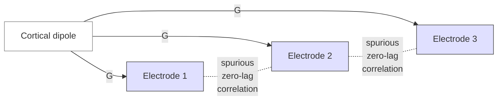

# EEG analysis — from raw traces to inference

> ERP, time-frequency, source localisation, connectivity, and EEG decoding — the analysis pipeline that turns voltage time-series into testable claims about the brain.

Course map: ERP analysis → time-frequency → connectivity → source localisation → decoding / MVPA → microstates → clinical → references.

## 1. Learning objectives

- Distinguish peak amplitude, mean amplitude, and jackknife latency as ERP metrics, and state when each is honest.
- Pick between Morlet wavelets, multi-taper, and band-pass-plus-Hilbert for time-frequency analysis given trial length and band of interest.
- Spot a connectivity result that is *volume conduction*, not coupling — and name the metric that fixes it.
- Compare distributed-source (MNE, dSPM, sLORETA, eLORETA) and beamformer (LCMV, DICS) inverses by assumption and failure mode.
- Run time-resolved MVPA with King–Dehaene temporal generalisation and explain what its off-diagonal structure means.
- Cite the COBIDAS-MEEG checklist items that distinguish a reproducible analysis from a non-reproducible one.

## 2. Where this page sits

Three EEG pages, three different jobs:

- [fundamentals/sequences/eeg.md](../fundamentals/sequences/eeg.md) — physics, biophysics, hardware, preprocessing through to clean epochs on disk. The acquisition-side authority. Cross-link target for any forward-model, electrode, or skull-conductivity claim here.
- [eeg-meg.md](eeg-meg.md) — the joint EEG / MEG analysis page; high-level overview, the canonical MNE-Python ERP recipe, MEG-specific source-reconstruction notes (BEM from T1 MRI, empty-room covariance). Cross-link target for shared infrastructure and for MEG-only material.
- **This page** — deep dive on each EEG-specific analysis technique: ERP statistics, time-frequency methods, EEG connectivity in the presence of volume conduction, EEG-source-localisation comparison, EEG decoding / BCI, EEG microstates. Stops at the boundary of MEG-specific content.

Read the fundamentals page if you are unsure about the forward problem; read [eeg-meg.md](eeg-meg.md) if you want the working MNE-Python recipe end-to-end; stay here for the depth.

## 3. ERP analysis — the workhorse

### 3.1 Why averaging works

Averaging $K$ time-locked epochs of a noisy signal cancels the noise as $\sqrt{K}$ (SNR boost) provided the noise is zero-mean and uncorrelated with the trigger. Stimulus-locked deflections (post-synaptic population responses at fixed latency after stimulus) survive the average; spontaneous oscillations (random phase per trial) attenuate. This is the entire trick that lets a 5 µV cortical response survive 20 µV background EEG with 100 trials.

Read [Luck 2014](https://mitpress.mit.edu/9780262525855/) (Introduction to the ERP Technique, 2nd ed., ISBN 978-0262525855) as the canonical entry-point textbook. [Cohen 2014](https://mitpress.mit.edu/9780262019873/) (Analyzing Neural Time Series Data, ISBN 978-0262019873) is the indispensable Python-friendly companion that covers time-frequency depth this page can't.

### 3.2 Amplitude and latency metrics

| Metric | Definition | Bias | When to use |
|---|---|---|---|
| **Peak amplitude** | max(\|signal\|) in a window | Larger $N$ → smaller measured peak; noise-dependent | Almost never for inference; only descriptive |
| **Mean amplitude** | mean over an a-priori window | Unbiased, low variance | The default for ERP statistics |
| **Area under curve** | integral over window | Sensitive to baseline; unbiased | Late components (P3, slow waves) |
| **Peak latency** | argmax in window | High variance, biased toward window edges | Avoid; prefer jackknife |
| **Jackknife latency** ([Kiesel 2008](https://doi.org/10.1111/j.1469-8986.2007.00618.x)) | latency on $N$ leave-one-out averages | Low variance | Latency-difference tests |
| **Fractional-area latency** | time at $X\%$ of cumulative area | Robust to noise | Slow components |

The single most common ERP error is reporting peak amplitude on a noisy condition and concluding it's smaller — noise *makes* peak amplitude smaller. Switch to mean amplitude or pre-register the peak window.

### 3.3 Components and conventions

ERP components are named by polarity and latency: P1 (positive, ~100 ms), N1 (negative, ~100 ms), N170 (face-specific negative at ~170 ms), MMN (mismatch negativity, ~150–250 ms), N400 (semantic-violation negative at ~400 ms), P3 / P300 (positive, ~300–500 ms), N2pc (lateralised attention, ~200–300 ms), ERN (error-related negativity), LRP (lateralised readiness potential), P600 (syntactic / re-analysis), CNV (contingent negative variation).

The [ERP-CORE](https://erpinfo.org/erp-core) open dataset ([Kappenman 2021](https://doi.org/10.1016/j.neuroimage.2020.117465)) is the community reference: six paradigms (N170, MMN, N2pc, N400, P3, ERN, LRP) with raw data, standard scripts, and benchmark effect sizes. New analysis pipelines should be tested against ERP-CORE before being applied to expensive cohorts.

### 3.4 Difference waves and contrasts

Almost every ERP claim is a *contrast*: condition A minus condition B per subject, then test the difference wave against zero across subjects. The oddball paradigm produces the P3 (rare minus frequent); the mismatch paradigm produces the MMN (deviant minus standard); the semantic-violation paradigm produces the N400 (incongruent minus congruent). Always test the difference, not the raw waveforms — the raw waveforms include nuisance components (early sensory P1 / N1) that subtract out.

### 3.5 Single-trial ERP and mass-univariate statistics

Single-trial ERP measurement is harder than averaging because the signal lives at SNR < 0 dB per trial. Bayesian decoding methods ([Pernet 2011](https://doi.org/10.1155/2011/831409); [LIMO EEG](https://github.com/LIMO-EEG-Toolbox/limo_tools)) fit per-trial models with priors that pool information across trials and electrodes.

Mass-univariate ERP statistics — running a GLM at every (time × channel) point and correcting for multiple comparisons — is the modern default for sensor-level inference. Review: [Groppe 2011](https://doi.org/10.1111/j.1469-8986.2011.01273.x). Cluster-based permutation tests ([Maris & Oostenveld 2007](https://doi.org/10.1016/j.jneumeth.2007.03.024)) are the right multiple-comparison correction because the autocorrelation in time × channels makes Bonferroni / FDR pathologically conservative; the same machinery operates on source-localised maps. See [multiple-comparisons.md](multiple-comparisons.md) for the broader landscape.

## 4. Time-frequency decomposition

ERPs only show *phase-locked* activity. Activity that is time-locked but *not* phase-locked (induced oscillations, gamma bursts) cancels in the average and requires time-frequency analysis to recover.

### 4.1 Methods

| Method | Time-frequency trade-off | Strength | Use when |
|---|---|---|---|
| **Morlet wavelets** ([Tallon-Baudry 1996](https://doi.org/10.1523/JNEUROSCI.16-13-04240.1996)) | Adaptive; broader in time at low freq, narrower at high | Smooth, intuitive, the cognition default | General-purpose cortical oscillations |
| **Multi-taper** (Mitra & Bokil; [Slepian sequences](https://doi.org/10.1002/j.1538-7305.1978.tb02104.x)) | Best frequency resolution at the cost of temporal smoothing | Variance-controlled spectra | Long epochs, sleep, intracranial |
| **Hilbert on band-passed signal** | Set by filter bandwidth | Cheapest; phase + amplitude in one shot | Narrow-band hypotheses (alpha, beta) |
| **Stockwell (S-transform)** | Hybrid time-frequency | Rare; sometimes useful for transient morphology | Niche |
| **Empirical Mode Decomposition (EMD)** | Data-driven IMFs | Adaptive, non-stationary signals | Sleep, transients |

The default in [MNE-Python](https://mne.tools) is Morlet via `mne.time_frequency.tfr_morlet`. For multi-taper see `tfr_multitaper`. For Hilbert see `mne.filter.filter_data` + `np.angle(scipy.signal.hilbert(...))`.

### 4.2 Power vs phase outputs

- **ERSP — event-related spectral perturbation**: trial-averaged power change relative to baseline. Captures induced (non-phase-locked) activity.
- **ITC — inter-trial coherence** (also "phase-locking value across trials"): how consistently phase aligns to the trigger across trials. Captures phase-locked transients invisible to averaging if amplitude varies wildly.

The math for ITC at frequency $f$ and time $t$ across $N$ trials with single-trial phases $\phi_n(t,f)$:

$$
\text{ITC}(t,f) \;=\; \frac{1}{N}\left|\sum_{n=1}^{N} e^{i\phi_n(t,f)}\right|.
$$

$\text{ITC} = 1$ means perfect phase alignment, $\text{ITC} = 0$ means uniformly random phase. ITC and ERSP carry independent information: a stimulus can phase-reset an ongoing oscillation (ITC spikes) without changing its amplitude (flat ERSP).

### 4.3 Baseline normalisation

Three choices, all defensible:

- **dB**: $10 \log_{10}(P(t,f) / P_\text{baseline}(f))$. Symmetric for power increases and decreases.
- **Percent**: $(P(t,f) - P_\text{baseline}(f)) / P_\text{baseline}(f)$. Intuitive; biased toward larger values.
- **Z-score** against the baseline distribution: standardised, statistical-friendly.

Pick *before* peeking at the data, document, and apply consistently across cohort.

### 4.4 A Morlet TFR in MNE-Python

```python
import numpy as np
import mne

# epochs: an mne.Epochs object already preprocessed (see fundamentals/sequences/eeg.md)
freqs    = np.logspace(np.log10(2), np.log10(40), 25)
n_cycles = freqs / 2.0       # adaptive: 2 / f s per wavelet => ~250 ms at 8 Hz

power, itc = mne.time_frequency.tfr_morlet(
    epochs, freqs=freqs, n_cycles=n_cycles,
    return_itc=True, average=True, n_jobs=4,
)
power.apply_baseline(baseline=(-0.5, -0.1), mode="logratio")   # dB

power.plot_topo(title="Power (dB rel. to baseline)")
itc.plot_topo(title="ITC")
```

[`tfr_morlet`](https://mne.tools/stable/generated/mne.time_frequency.tfr_morlet.html) returns averaged TFR; for single-trial use `average=False` and you get a `(n_epochs, n_channels, n_freqs, n_times)` array — the input for trial-by-trial statistics.

## 5. Functional connectivity in EEG

### 5.1 The volume-conduction problem

Every cortical source contributes to *every* scalp electrode (the conductivity table in [fundamentals/sequences/eeg.md §3.4](../fundamentals/sequences/eeg.md) is the load-bearing physics). A single dipole near central cortex produces non-zero potential at every electrode in the cap. If you correlate two scalp channels you mostly measure *shared sources* — not coupling.



The fix lives at two levels: **source-project before connectivity** (compute connectivity on inverse-solution sources, not scalp electrodes), and use **VC-resistant metrics** (those that ignore zero-lag interactions). Both are needed at sensor level; source projection helps but does not fully eliminate the problem because the inverse is itself smooth.

### 5.2 Metrics, by what they fix

| Metric | What it measures | Volume-conduction resistant? | Directed? |
|---|---|---|---|
| **Coherence** | Magnitude-squared linear coupling in frequency | No (zero-lag dominates) | No |
| **Imaginary coherence** ([Nolte 2004](https://doi.org/10.1016/j.clinph.2004.04.029)) | Imaginary part only | Yes | No |
| **PLV** ([Lachaux 1999](https://doi.org/10.1002/(SICI)1097-0193(1999)8:4%3C194::AID-HBM4%3E3.0.CO;2-C)) | Phase-only consistency | No | No |
| **WPLI** ([Vinck 2011](https://doi.org/10.1016/j.neuroimage.2011.01.055)) | Weighted imaginary-part PLV | Yes | No |
| **PLI** ([Stam 2007](https://doi.org/10.1002/hbm.20346)) | Sign of imaginary coupling | Yes | No |
| **wSMI** ([Bourdillon 2020](https://doi.org/10.1016/j.neuroimage.2020.117072)) | Symbolic mutual information | Yes; nonlinear | No |
| **Granger causality / DTF / PDC** | Temporal precedence of prediction | Partial | Yes |
| **Cross-frequency coupling (PAC, MI)** ([Tort 2010](https://doi.org/10.1152/jn.00106.2010)) | Phase of slow modulates amplitude of fast | Use with care; metric-dependent | Implicit |

Defaults for cortical EEG coupling: **WPLI** or **PLI** for undirected coupling, **time-domain Granger on source signals** for directed, **Tort MI** for phase-amplitude coupling. Avoid raw coherence and raw PLV on scalp data unless you have very tight a-priori electrode pairs and an honest discussion of volume conduction.

[Stam 2014](https://doi.org/10.1038/nrn3801) is the standard methodological review of network-science approaches to EEG connectivity.

### 5.3 Graph-theoretic network analysis

Once you have a $C \times C$ connectivity matrix (channels or sources), graph metrics summarise it: degree, clustering coefficient, characteristic path length, modularity, rich-club coefficient, betweenness. The canonical implementation is the [Brain Connectivity Toolbox (BCT)](https://www.nitrc.org/projects/bct/) ([Rubinov & Sporns 2010](https://doi.org/10.1016/j.neuroimage.2009.10.003)) in MATLAB; [bctpy](https://pypi.org/project/bctpy/) is the Python port. Always threshold the matrix before computing graph metrics (proportional threshold preferred over absolute) and run a sensitivity analysis across thresholds.

### 5.4 Cross-frequency coupling

Phase-amplitude coupling (PAC) — the phase of a slow oscillation modulates the amplitude of a faster one — is implicated in memory (theta-gamma in hippocampus), attention, and motor control. The Tort modulation index ([Tort 2010](https://doi.org/10.1152/jn.00106.2010)) is the standard estimator. Pitfalls: spurious PAC arises from sharp transients (waveform asymmetry, non-sinusoidal oscillations); always test against surrogate distributions and inspect the waveform shape ([Cole & Voytek 2017](https://doi.org/10.1016/j.tics.2016.12.008)).

## 6. Source localisation

The inverse problem in EEG (recover cortical current distribution from $N$ scalp potentials) is *ill-posed*: many source configurations produce identical scalp patterns. Every algorithm picks a different regularisation / prior.

### 6.1 Prerequisites

You need three things, all from the [fundamentals/sequences/eeg.md §3.5](../fundamentals/sequences/eeg.md) physics: a **forward model** (BEM from MRI segmentations, or a template head when no MRI is available — accept the loss of accuracy), a **source space** (cortical mesh, usually from FreeSurfer's `oct5` / `oct6` decimation), and a **noise covariance** estimate (pre-stimulus baseline for ERP data; empty-room for MEG, see [eeg-meg.md](eeg-meg.md)).

### 6.2 Inverse methods

| Method | Prior | Best for | Failure mode |
|---|---|---|---|
| **Equivalent dipole fit** | $\le 2$ dipoles | Focal sources, epileptic spikes | Wrong # dipoles → biased location |
| **MNE** ([Hämäläinen & Ilmoniemi 1994](https://doi.org/10.1007/BF02512476)) | L2 minimum norm; smooth | Distributed cortical activity | Superficial bias (depth weighting required) |
| **dSPM** ([Dale 2000](https://doi.org/10.1016/S0896-6273(00)81138-1)) | MNE normalised by noise covariance | Statistical maps | Inherits MNE smoothness |
| **sLORETA** ([Pascual-Marqui 2002](https://www.uzh.ch/keyinst/loreta.htm)) | Zero-localisation-error under ideal noise | Clinical EEG inverse | Overly diffuse on real noise |
| **eLORETA** ([Pascual-Marqui 2007](https://doi.org/10.1098/rsta.2011.0081)) | Smoothed, weighted | Stable, low resolution | Loss of focality |
| **LCMV beamformer** ([Van Veen 1997](https://doi.org/10.1109/10.623056)) | Adaptive spatial filter; pass single source, reject all others | Many trials, focal sources | Suppresses correlated sources (bilateral auditory) |
| **DICS beamformer** ([Gross 2001](https://doi.org/10.1073/pnas.98.2.694)) | Frequency-domain LCMV | Oscillatory source connectivity | Same correlated-source pitfall |
| **MUSIC / RAP-MUSIC** ([Mosher 1992](https://doi.org/10.1109/10.121197)) | Subspace scan | Multiple focal sources | Sensitive to noise covariance |

### 6.3 Practice

- Always validate source localisation on simulated data with known dipoles *for your montage* before trusting it on real data. Use [`mne.simulation.simulate_evoked`](https://mne.tools/stable/generated/mne.simulation.simulate_evoked.html) for the round-trip test.
- **HD-EEG (>=128 channels)** markedly improves source-localisation precision; [Michel & Brunet 2019](https://doi.org/10.3389/fneur.2019.00325) is the practical review.
- Report the forward model (BEM vs FEM vs template), source space resolution, regularisation parameter $\lambda^2$, and the noise-covariance time window. These four numbers determine whether anyone can reproduce your inverse solution.
- For clinical epilepsy source localisation, see [clinical/epilepsy.md](../clinical/epilepsy.md) and the ESI literature ([Brodbeck 2011](https://doi.org/10.1093/brain/awr243)).

## 7. EEG decoding — MVPA on time-series

### 7.1 Why decode

Decoding tests for **representation**: if a classifier can predict the stimulus or condition from a single trial above chance, the relevant information is *present* in the signal at that time, in some linear combination of electrodes / sources. Univariate analysis can miss this when the signal lives in a distributed pattern.

Three flavours of question:

- **Decoding accuracy over time**: when does the brain *have* the information?
- **Temporal generalisation** ([King & Dehaene 2014](https://doi.org/10.1016/j.tics.2014.01.002)): train a classifier at time $t$, test at all other times. A diagonal-only result means *transient* coding; an off-diagonal result means *persistent* or recurrent coding. Reading the generalisation matrix is its own diagnostic skill.
- **Cross-condition generalisation**: train on condition A, test on condition B. Tests whether the representations share format.

### 7.2 Classifiers

- **Logistic regression / linear SVM** on raw or band-passed signals (the default; works surprisingly well; interpret coefficients via [Haufe 2014](https://doi.org/10.1016/j.neuroimage.2013.10.067) patterns, not filters).
- **CSP — Common Spatial Pattern** ([Blankertz 2008](https://doi.org/10.1109/MSP.2008.4408441)): the canonical motor-imagery feature; finds spatial filters that maximise variance for one class against another.
- **Riemannian classifiers** ([Barachant 2012](https://doi.org/10.1109/TBME.2011.2172210)): operate on trial covariance matrices in their natural manifold (symmetric positive definite matrices). State-of-the-art on most BCI benchmarks; implemented in [pyRiemann](https://pyriemann.readthedocs.io/) with a scikit-learn API.
- **Deep learning**: [EEGNet](https://github.com/vlawhern/arl-eegmodels) ([Lawhern 2018](https://doi.org/10.1088/1741-2552/aace8c)) is the compact CNN baseline; [Braindecode](https://braindecode.org/) ships ShallowConvNet, DeepConvNet, EEGResNet, transformers. Compare against linear baselines — deep models often only modestly beat them on within-subject data.

### 7.3 Cross-validation

**Subject-leave-out** is the honest test for any generalisation claim. **Within-subject** k-fold is OK for personalised models but leaks through temporal autocorrelation if you split trials at random within a continuous block. Use [`sklearn.model_selection.GroupKFold`](https://scikit-learn.org/stable/modules/generated/sklearn.model_selection.GroupKFold.html) with subject or block as the group.

### 7.4 The replication crisis in EEG decoding

Small samples, dozens of hyperparameters, and the temptation to peek mean reported accuracies are often inflated. Mandatory hygiene:

- Report effect sizes, not just accuracies — Cohen's $d$ on the per-subject accuracy vs chance.
- Run permutation tests on the temporal-generalisation matrix; cluster-correct over the (train, test) time grid.
- Hold out a true test set; tune on a separate validation set.
- Beware double-dipping: feature selection on the same data used for testing.
- Use the [MOABB](https://github.com/NeuroTechX/moabb) benchmarks for cross-dataset evaluation.

## 8. Microstate analysis

EEG microstates are 4–7 quasi-stable scalp topographies that the global field power (GFP) cycles through, each lasting 60–120 ms; together they capture ~70% of the variance in spontaneous EEG.

Standard pipeline:

1. Find GFP peaks (timepoints of high signal-to-noise).
2. Cluster the topographies at peaks via modified $k$-means or topographic-atomize-agglomerate hierarchical clustering ([Murray 2008](https://doi.org/10.1007/s10548-008-0054-5)).
3. Backfit each cluster topography to the continuous data — at every timepoint, assign the closest microstate.
4. Compute per-microstate metrics: duration, occurrence frequency, time coverage, transition probabilities.

Disease relevance: schizophrenia (altered class D coverage; [Lehmann 2005](https://doi.org/10.1016/j.pscychresns.2005.06.005)), depression, frontotemporal dementia, ageing. Open-source implementation: [`pycrostates`](https://github.com/vferat/pycrostates) in Python and the [Microstate EEGlab Toolbox](https://github.com/atpoulsen/Microstate-EEGlab-toolbox) in MATLAB. The canonical methodological review is [Michel & Koenig 2018](https://doi.org/10.1016/j.neuroimage.2017.11.062).

Caveats: cluster solutions are not uniquely identified (sign / order / number of clusters); polarity is typically ignored ("symmetric" clustering); microstate maps vary across labs and across age groups, so always compare clusters against a published reference set before claiming biological meaning.

## 9. Clinical EEG analysis

- **Sleep staging.** 30-second epoch scoring per [AASM rules](https://aasm.org/clinical-resources/scoring-manual/); five stages (Wake, N1, N2, N3, REM). Automated DL scoring achieves near-expert agreement ([Stephansen 2018](https://doi.org/10.1038/s41467-018-07229-3); [U-Sleep](https://github.com/perslev/U-Sleep), [Perslev 2021](https://doi.org/10.1038/s41746-021-00440-5)).
- **Epilepsy.** Inter-ictal spike detection (automated with the [SpikeInterface](https://github.com/SpikeInterface/spikeinterface) family or [Persyst](https://www.persyst.com/) commercially), source localisation of interictal epileptiform discharges (ESI) using dipole fits or sLORETA ([Brodbeck 2011](https://doi.org/10.1093/brain/awr243)), pre-surgical workup. Cross-link to [clinical/epilepsy.md](../clinical/epilepsy.md).
- **ICU continuous EEG.** Detection of non-convulsive status epilepticus, burst-suppression quantification ([BSR — burst suppression ratio](https://doi.org/10.1097/01.WCB.0000125866.41796.E7)), ischaemia monitoring, prognostication after cardiac arrest ([Sandroni 2014](https://doi.org/10.1007/s00134-014-3470-x)).
- **Brain-death determination.** 30 minutes of electrocerebral inactivity at high gain is *confirmatory*, not gold standard; clinical criteria (apnoea, brainstem reflexes) come first.
- **Anaesthesia depth monitoring.** Frontal-EEG derived indices (BIS — bispectral index, [SedLine](https://www.masimo.com/products/continuous/sedline-brain-function-monitor/)) used for titration; α-band frontal coherence is the modern research target ([Purdon 2013](https://doi.org/10.1073/pnas.1221180110)).

## 10. Software ecosystem

- [MNE-Python](https://mne.tools) — canonical research stack ([Gramfort 2013](https://doi.org/10.3389/fnins.2013.00267)); ERPs, time-frequency, source localisation, connectivity, decoding all in one Python library; BIDS-aware via [mne-bids](https://mne.tools/mne-bids/).
- [EEGLAB](https://eeglab.org) — MATLAB; legacy but huge plugin ecosystem including [LIMO](https://github.com/LIMO-EEG-Toolbox/limo_tools), [FieldTrip integration](https://www.fieldtriptoolbox.org/), [ICLabel](https://github.com/sccn/ICLabel), [CleanLine](https://github.com/sccn/cleanline_plugin); ([Delorme & Makeig 2004](https://doi.org/10.1016/j.jneumeth.2003.10.009)).
- [FieldTrip](https://www.fieldtriptoolbox.org) — MATLAB; the connectivity / source-localisation workhorse for high-end labs ([Oostenveld 2011](https://doi.org/10.1155/2011/156869)).
- [Brainstorm](https://neuroimage.usc.edu/brainstorm/) — MATLAB; the source-localisation GUI of choice.
- [Braindecode](https://braindecode.org/) — Python; deep-learning baselines for EEG with PyTorch.
- [pyRiemann](https://pyriemann.readthedocs.io/) — Riemannian classifiers in scikit-learn API.
- [Autoreject](https://autoreject.github.io/) — automatic bad-epoch / bad-channel detection ([Jas 2017](https://doi.org/10.1016/j.neuroimage.2017.06.030)).
- [ICA cleanup pipeline](ica.md#5-ica-for-eeg) — the standard route for blink / saccade / muscle / ECG artifact removal; AMICA, extended Infomax, [ICLabel](https://github.com/sccn/ICLabel) classification, and the 1 Hz-filter-for-ICA trick ([Winkler 2015](https://doi.org/10.1109/EMBC.2015.7319296)). The full ICA math and EEG-specific nuances live in [ica.md](ica.md).
- [MNE-BIDS](https://mne.tools/mne-bids/) — BIDS-EEG I/O.
- [pycrostates](https://github.com/vferat/pycrostates) — microstate analysis in Python.
- [MOABB](https://github.com/NeuroTechX/moabb) — cross-dataset BCI benchmark suite.
- [PREP pipeline](http://vislab.github.io/EEG-Clean-Tools/) — standardised preprocessing for large studies.

## 11. Reproducibility and reporting

- **COBIDAS-MEEG** ([Pernet 2020](https://doi.org/10.1038/s41593-020-00709-0)) is the OHBM-endorsed reporting standard. Every EEG paper should walk through its checklist: paradigm, hardware, electrodes, reference, filters, ICA components, epoch window, baseline, rejection criteria, statistical model, multiple-comparisons correction, and code / data availability.
- **ERP-CORE** ([Kappenman 2021](https://doi.org/10.1016/j.neuroimage.2020.117465)) — open dataset + standard processing reference for ERP work; benchmark new pipelines against it.
- **Preregister** paradigm, epoch window, ROI / electrode cluster, and statistical test *before* data collection. Use the [OSF preregistration template](https://osf.io/zab38/).
- **Share** raw + processed + scripts via [OpenNeuro](https://openneuro.org), [Zenodo](https://zenodo.org), or [G-Node](https://gin.g-node.org). BIDS-EEG ([Pernet 2019](https://doi.org/10.1038/s41597-019-0104-8)) is the required format.
- **Pin** software versions (MNE-Python, scikit-learn, numpy) in the methods section; small numerical differences across versions can flip cluster-permutation outcomes.

## 12. References

1. **Luck SJ.** *An Introduction to the Event-Related Potential Technique.* 2nd ed. MIT Press; 2014. ISBN [978-0262525855](https://mitpress.mit.edu/9780262525855/).
2. **Cohen MX.** *Analyzing Neural Time Series Data: Theory and Practice.* MIT Press; 2014. ISBN [978-0262019873](https://mitpress.mit.edu/9780262019873/).
3. **Kiesel A, Miller J, Jolicoeur P, Brisson B.** Measurement of ERP latency differences: a comparison of single-participant and jackknife-based scoring methods. *Psychophysiology.* 2008;45(2):250–274. [doi:10.1111/j.1469-8986.2007.00618.x](https://doi.org/10.1111/j.1469-8986.2007.00618.x)
4. **Groppe DM, Urbach TP, Kutas M.** Mass univariate analysis of event-related brain potentials/fields: a critical tutorial review. *Psychophysiology.* 2011;48(12):1711–1725. [doi:10.1111/j.1469-8986.2011.01273.x](https://doi.org/10.1111/j.1469-8986.2011.01273.x)
5. **Pernet CR, Chauveau N, Gaspar C, Rousselet GA.** LIMO EEG: a toolbox for hierarchical linear modeling of electroencephalographic data. *Comput Intell Neurosci.* 2011;2011:831409. [doi:10.1155/2011/831409](https://doi.org/10.1155/2011/831409)
6. **Maris E, Oostenveld R.** Nonparametric statistical testing of EEG- and MEG-data. *J Neurosci Methods.* 2007;164(1):177–190. [doi:10.1016/j.jneumeth.2007.03.024](https://doi.org/10.1016/j.jneumeth.2007.03.024)
7. **Tallon-Baudry C, Bertrand O, Delpuech C, Pernier J.** Stimulus specificity of phase-locked and non-phase-locked 40 Hz visual responses in human. *J Neurosci.* 1996;16(13):4240–4249. [doi:10.1523/JNEUROSCI.16-13-04240.1996](https://doi.org/10.1523/JNEUROSCI.16-13-04240.1996)
8. **Nolte G, Bai O, Wheaton L, Mari Z, Vorbach S, Hallett M.** Identifying true brain interaction from EEG data using the imaginary part of coherency. *Clin Neurophysiol.* 2004;115(10):2292–2307. [doi:10.1016/j.clinph.2004.04.029](https://doi.org/10.1016/j.clinph.2004.04.029)
9. **Lachaux JP, Rodriguez E, Martinerie J, Varela FJ.** Measuring phase synchrony in brain signals. *Hum Brain Mapp.* 1999;8(4):194–208. [doi:10.1002/(SICI)1097-0193(1999)8:4<194::AID-HBM4>3.0.CO;2-C](https://doi.org/10.1002/(SICI)1097-0193(1999)8:4%3C194::AID-HBM4%3E3.0.CO;2-C)
10. **Stam CJ, Nolte G, Daffertshofer A.** Phase lag index: assessment of functional connectivity from multi-channel EEG and MEG. *Hum Brain Mapp.* 2007;28(11):1178–1193. [doi:10.1002/hbm.20346](https://doi.org/10.1002/hbm.20346)
11. **Vinck M, Oostenveld R, van Wingerden M, Battaglia F, Pennartz CM.** An improved index of phase-synchronization (WPLI). *NeuroImage.* 2011;55(4):1548–1565. [doi:10.1016/j.neuroimage.2011.01.055](https://doi.org/10.1016/j.neuroimage.2011.01.055)
12. **Bourdillon P, Hermann B, Sitt JD, Naccache L.** Symbolic mutual information (wSMI) of EEG. *NeuroImage.* 2020;220:117072. [doi:10.1016/j.neuroimage.2020.117072](https://doi.org/10.1016/j.neuroimage.2020.117072)
13. **Tort ABL, Komorowski R, Eichenbaum H, Kopell N.** Measuring phase-amplitude coupling between neuronal oscillations of different frequencies. *J Neurophysiol.* 2010;104(2):1195–1210. [doi:10.1152/jn.00106.2010](https://doi.org/10.1152/jn.00106.2010)
14. **Cole SR, Voytek B.** Brain oscillations and the importance of waveform shape. *Trends Cogn Sci.* 2017;21(2):137–149. [doi:10.1016/j.tics.2016.12.008](https://doi.org/10.1016/j.tics.2016.12.008)
15. **Stam CJ.** Modern network science of neurological disorders. *Nat Rev Neurosci.* 2014;15:683–695. [doi:10.1038/nrn3801](https://doi.org/10.1038/nrn3801)
16. **Rubinov M, Sporns O.** Complex network measures of brain connectivity: uses and interpretations. *NeuroImage.* 2010;52(3):1059–1069. [doi:10.1016/j.neuroimage.2009.10.003](https://doi.org/10.1016/j.neuroimage.2009.10.003)
17. **Hämäläinen MS, Ilmoniemi RJ.** Interpreting magnetic fields of the brain: minimum norm estimates. *Med Biol Eng Comput.* 1994;32(1):35–42. [doi:10.1007/BF02512476](https://doi.org/10.1007/BF02512476)
18. **Dale AM, Liu AK, Fischl BR, et al.** Dynamic statistical parametric mapping: combining fMRI and MEG for high-resolution imaging of cortical activity. *Neuron.* 2000;26(1):55–67. [doi:10.1016/S0896-6273(00)81138-1](https://doi.org/10.1016/S0896-6273(00)81138-1)
19. **Pascual-Marqui RD.** Standardized low-resolution brain electromagnetic tomography (sLORETA): technical details. *Methods Find Exp Clin Pharmacol.* 2002;24(Suppl D):5–12. ([Author site](https://www.uzh.ch/keyinst/loreta.htm))
20. **Pascual-Marqui RD.** Discrete, 3D distributed, linear imaging methods of electric neuronal activity. Part 1: eLORETA. *Philos Trans R Soc A.* 2011;369(1952):3768–3784. [doi:10.1098/rsta.2011.0081](https://doi.org/10.1098/rsta.2011.0081)
21. **Van Veen BD, van Drongelen W, Yuchtman M, Suzuki A.** Localization of brain electrical activity via linearly constrained minimum variance spatial filtering. *IEEE Trans Biomed Eng.* 1997;44(9):867–880. [doi:10.1109/10.623056](https://doi.org/10.1109/10.623056)
22. **Gross J, Kujala J, Hämäläinen M, Timmermann L, Schnitzler A, Salmelin R.** Dynamic imaging of coherent sources: DICS. *Proc Natl Acad Sci USA.* 2001;98(2):694–699. [doi:10.1073/pnas.98.2.694](https://doi.org/10.1073/pnas.98.2.694)
23. **Mosher JC, Lewis PS, Leahy RM.** Multiple dipole modeling and localization from spatio-temporal MEG data. *IEEE Trans Biomed Eng.* 1992;39(6):541–557. [doi:10.1109/10.121197](https://doi.org/10.1109/10.121197)
24. **Michel CM, Brunet D.** EEG source imaging: a practical review of the analysis steps. *Front Neurol.* 2019;10:325. [doi:10.3389/fneur.2019.00325](https://doi.org/10.3389/fneur.2019.00325)
25. **Brodbeck V, Spinelli L, Lascano AM, et al.** Electroencephalographic source imaging: a prospective study of 152 operated epileptic patients. *Brain.* 2011;134(10):2887–2897. [doi:10.1093/brain/awr243](https://doi.org/10.1093/brain/awr243)
26. **King JR, Dehaene S.** Characterizing the dynamics of mental representations: the temporal generalization method. *Trends Cogn Sci.* 2014;18(4):203–210. [doi:10.1016/j.tics.2014.01.002](https://doi.org/10.1016/j.tics.2014.01.002)
27. **Lawhern VJ, Solon AJ, Waytowich NR, Gordon SM, Hung CP, Lance BJ.** EEGNet: a compact convolutional neural network for EEG-based brain–computer interfaces. *J Neural Eng.* 2018;15(5):056013. [doi:10.1088/1741-2552/aace8c](https://doi.org/10.1088/1741-2552/aace8c)
28. **Blankertz B, Tomioka R, Lemm S, Kawanabe M, Müller KR.** Optimizing spatial filters for robust EEG single-trial analysis. *IEEE Signal Process Mag.* 2008;25(1):41–56. [doi:10.1109/MSP.2008.4408441](https://doi.org/10.1109/MSP.2008.4408441)
29. **Barachant A, Bonnet S, Congedo M, Jutten C.** Multiclass brain–computer interface classification by Riemannian geometry. *IEEE Trans Biomed Eng.* 2012;59(4):920–928. [doi:10.1109/TBME.2011.2172210](https://doi.org/10.1109/TBME.2011.2172210)
30. **Haufe S, Meinecke F, Görgen K, et al.** On the interpretation of weight vectors of linear models in multivariate neuroimaging. *NeuroImage.* 2014;87:96–110. [doi:10.1016/j.neuroimage.2013.10.067](https://doi.org/10.1016/j.neuroimage.2013.10.067)
31. **Michel CM, Koenig T.** EEG microstates as a tool for studying the temporal dynamics of whole-brain neuronal networks: a review. *NeuroImage.* 2018;180:577–593. [doi:10.1016/j.neuroimage.2017.11.062](https://doi.org/10.1016/j.neuroimage.2017.11.062)
32. **Lehmann D, Faber PL, Galderisi S, et al.** EEG microstate duration and syntax in acute, medication-naive, first-episode schizophrenia. *Psychiatry Res Neuroimaging.* 2005;138(2):141–156. [doi:10.1016/j.pscychresns.2005.06.005](https://doi.org/10.1016/j.pscychresns.2005.06.005)
33. **Murray MM, Brunet D, Michel CM.** Topographic ERP analyses: a step-by-step tutorial review. *Brain Topogr.* 2008;20(4):249–264. [doi:10.1007/s10548-008-0054-5](https://doi.org/10.1007/s10548-008-0054-5)
34. **Pernet C, Garrido MI, Gramfort A, et al.** Issues and recommendations from the OHBM COBIDAS MEEG committee for reproducible EEG and MEG research. *Nat Neurosci.* 2020;23:1473–1483. [doi:10.1038/s41593-020-00709-0](https://doi.org/10.1038/s41593-020-00709-0)
35. **Kappenman ES, Farrens JL, Zhang W, Stewart AX, Luck SJ.** ERP CORE: an open resource for human event-related potential research. *NeuroImage.* 2021;225:117465. [doi:10.1016/j.neuroimage.2020.117465](https://doi.org/10.1016/j.neuroimage.2020.117465)
36. **Pernet CR, Appelhoff S, Gorgolewski KJ, et al.** EEG-BIDS, an extension to the brain imaging data structure for electroencephalography. *Sci Data.* 2019;6:103. [doi:10.1038/s41597-019-0104-8](https://doi.org/10.1038/s41597-019-0104-8)
37. **Stephansen JB, Olesen AN, Olsen M, et al.** Neural network analysis of sleep stages enables efficient diagnosis of narcolepsy. *Nat Commun.* 2018;9:5229. [doi:10.1038/s41467-018-07229-3](https://doi.org/10.1038/s41467-018-07229-3)
38. **Perslev M, Darkner S, Kempfner L, Nikolic M, Jennum PJ, Igel C.** U-Sleep: resilient high-frequency sleep staging. *NPJ Digit Med.* 2021;4:72. [doi:10.1038/s41746-021-00440-5](https://doi.org/10.1038/s41746-021-00440-5)
39. **Sandroni C, Cariou A, Cavallaro F, et al.** Prognostication in comatose survivors of cardiac arrest. *Intensive Care Med.* 2014;40(12):1816–1831. [doi:10.1007/s00134-014-3470-x](https://doi.org/10.1007/s00134-014-3470-x)
40. **Purdon PL, Pierce ET, Mukamel EA, et al.** Electroencephalogram signatures of loss and recovery of consciousness from propofol. *Proc Natl Acad Sci USA.* 2013;110(12):E1142–E1151. [doi:10.1073/pnas.1221180110](https://doi.org/10.1073/pnas.1221180110)
41. **Gramfort A, Luessi M, Larson E, et al.** MEG and EEG data analysis with MNE-Python. *Front Neurosci.* 2013;7:267. [doi:10.3389/fnins.2013.00267](https://doi.org/10.3389/fnins.2013.00267)
42. **Delorme A, Makeig S.** EEGLAB: an open source toolbox for analysis of single-trial EEG dynamics including independent component analysis. *J Neurosci Methods.* 2004;134(1):9–21. [doi:10.1016/j.jneumeth.2003.10.009](https://doi.org/10.1016/j.jneumeth.2003.10.009)
43. **Oostenveld R, Fries P, Maris E, Schoffelen J-M.** FieldTrip: open source software for advanced analysis of MEG, EEG, and invasive electrophysiological data. *Comput Intell Neurosci.* 2011;2011:156869. [doi:10.1155/2011/156869](https://doi.org/10.1155/2011/156869)
44. **Jas M, Engemann DA, Bekhti Y, Raimondo F, Gramfort A.** Autoreject: automated artifact rejection for MEG and EEG data. *NeuroImage.* 2017;159:417–429. [doi:10.1016/j.neuroimage.2017.06.030](https://doi.org/10.1016/j.neuroimage.2017.06.030)

## 13. Where to next

- Acquisition and physics companion: [fundamentals/sequences/eeg.md](../fundamentals/sequences/eeg.md).
- Joint EEG / MEG view and MEG-specific source-reconstruction recipes: [eeg-meg.md](eeg-meg.md).
- Repeated-measures designs and subject random effects: [longitudinal.md](longitudinal.md).
- Mass-univariate GLM machinery shared with all modalities: [group-stats.md](group-stats.md) and [multiple-comparisons.md](multiple-comparisons.md).
- Clinical EEG context: [clinical/epilepsy.md](../clinical/epilepsy.md).

### Closing

EEG analysis is the longest pipeline in this handbook because the signal is small, the artifacts are many, and almost every interesting result depends on a chain of decisions made before you see the data. The ERP / TFR / connectivity / source / decoding split is not a menu — most studies use two or three of these — but each has its own pathologies that no other check will catch. Pre-register the choice, run on ERP-CORE first, source-project before connectivity, validate the inverse on simulated dipoles, and report effect sizes, not just p-values. The millisecond resolution is real; the temptation to overclaim is the failure mode.
