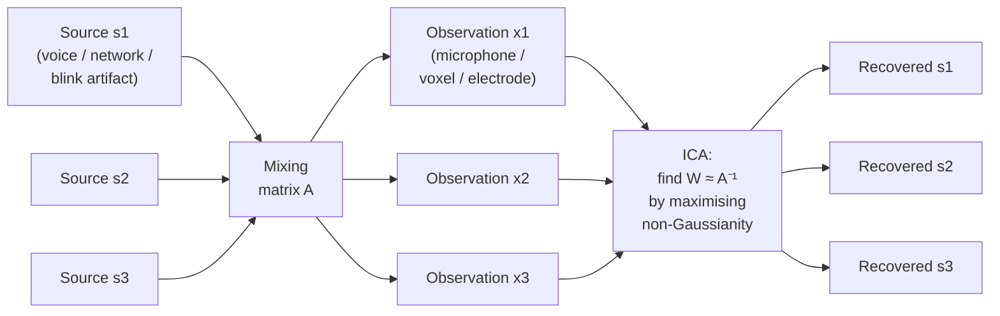

# Independent Component Analysis (ICA) for neuroimaging

> From scalp / 4D-fMRI noise to the default-mode network — ICA is the most-used decomposition in neuroimaging, and the most misused.

Course map: the blind-source-separation idea → the math (FastICA, Infomax) → ICA for fMRI (MELODIC, dual regression, ICA-AROMA) → ICA for EEG (artifact removal, ICLabel, AMICA) → the intrinsic networks ICA recovers → advanced pitfalls → software → references → where to next.

## 1. Learning objectives

By the end of this page you should be able to:

- Write the ICA generative model in one line and explain why non-Gaussianity makes the sources identifiable.
- Pick between FastICA, Infomax, and AMICA and say what each is optimising.
- Run single-subject MELODIC, group ICA + dual regression on fMRI, and ICA-AROMA for motion cleanup.
- Run ICA on EEG, label components with ICLabel, and remove blink / saccade / muscle / ECG artifacts.
- Diagnose the failure modes — random-init non-determinism, sign ambiguity, PCA-pre-reduction trade-off, group-ICA mixing assumption.
- Cross-link ICA to the intrinsic-network literature and to canonical decompositions (CCA, SCCA, PLS).

## 2. The intuition — the cocktail-party problem

The classical setup. Three people are speaking simultaneously in a room with three microphones. Each microphone records a different linear mixture of the three voices. ICA recovers the three original voices from the three mixtures *without knowing the room geometry* — without ever being told who is sitting where.



The neuroimaging map: voices become brain networks (DMN, salience) or artifacts (eye blinks, head motion); microphones become voxels (fMRI) or electrodes (EEG); the mixing matrix becomes the unknown projection from neural sources to the sensor / voxel grid.

## 3. The math

The generative model is one equation:

$$
\mathbf{x}(t) \;=\; \mathbf{A}\,\mathbf{s}(t), \qquad \mathbf{x} \in \mathbb{R}^{N}, \;\; \mathbf{s} \in \mathbb{R}^{K}, \;\; \mathbf{A} \in \mathbb{R}^{N \times K}.
$$

$\mathbf{x}$ are the observed signals at time $t$, $\mathbf{s}$ are the unknown independent sources, and $\mathbf{A}$ is the unknown mixing matrix. ICA estimates the unmixing matrix $\mathbf{W} \approx \mathbf{A}^{-1}$ so that

$$
\hat{\mathbf{s}}(t) \;=\; \mathbf{W}\,\mathbf{x}(t)
$$

recovers the sources (up to sign and scale). The identifiability theorem ([Comon 1994](https://doi.org/10.1016/0165-1684(94)90029-9)) says that if **at most one** source is Gaussian and the sources are statistically independent, $\mathbf{W}$ is uniquely identified.

Two practical estimators dominate:

- **FastICA** ([Hyvärinen & Oja 2000](https://doi.org/10.1016/S0893-6080(00)00026-5)) — maximises non-Gaussianity (kurtosis or negentropy) of $\mathbf{W}\mathbf{x}$ by a fixed-point iteration. Fast, deterministic given fixed init, scikit-learn-default.
- **Infomax** ([Bell & Sejnowski 1995](https://doi.org/10.1162/neco.1995.7.6.1129)) — maximises mutual information between $\mathbf{x}$ and a non-linear transform of $\mathbf{W}\mathbf{x}$; equivalent to minimising mutual information among $\hat{s}_i$. Extended Infomax (Lee et al.) handles both super- and sub-Gaussian sources and is the EEGLAB default. **AMICA** ([Palmer 2008](https://sccn.ucsd.edu/~jason/amica_a.pdf)) generalises Infomax to multiple models with non-stationary mixing — the gold standard for EEG.

PCA whitening is standard preprocessing: project $\mathbf{x}$ onto the top-$K$ principal components, scaled so the covariance becomes the identity. Whitening fixes the scale ambiguity, reduces dimensionality, and makes the ICA optimisation orders of magnitude better-conditioned. ICA needs at least $K$ independent samples for $K$ components — in fMRI, that bounds $K$ at roughly the number of timepoints; in EEG, at roughly the number of channels.

## 4. ICA for fMRI

### 4.1 Single-subject MELODIC

[MELODIC](https://fsl.fmrib.ox.ac.uk/fsl/fslwiki/MELODIC) ([Beckmann & Smith 2004](https://doi.org/10.1109/TMI.2003.822821)) decomposes a 4D BOLD series (voxels × time) into spatial maps × time courses. Each component is a spatial pattern that varies coherently in time. The components fall into three buckets:

- **Neural networks** — recognisable DMN, dorsal-attention, ventral-attention, executive-control, salience, sensorimotor, auditory, visual.
- **Structured noise** — head motion patterns, CSF pulsation, vessel-time series, scanner artifacts; characteristic spatial maps (edge rings for motion, ventricles for CSF) and time courses (high-frequency or motion-correlated).
- **Mixtures of the two** — the hardest to label; the reason automated classifiers exist.

The number of components is set by the user, by PCA dimensionality estimators (MDL, BIC, Laplace approximation), or by MELODIC's automatic order selection. Typical single-subject MELODIC settings: 20–40 components for a 5–10 minute scan at TR = 2 s.

### 4.2 Group ICA

Two paradigms, both implemented in [GIFT](https://trendscenter.org/software/gift/) and FSL:

- **Temporal concatenation** ([Calhoun 2001](https://doi.org/10.1002/hbm.1048)) — stack every subject's BOLD along the time axis, run one ICA, back-project per subject to get individual spatial maps and time courses. The dominant fMRI group-ICA approach.
- **Tensor ICA** ([Beckmann & Smith 2005](https://doi.org/10.1109/TMI.2004.836285)) — a three-way decomposition of the (voxel × time × subject) tensor into shared spatial, temporal, and subject-mode profiles. Strong assumption of shared time courses across subjects; appropriate for task fMRI.

### 4.3 Dual regression

[Dual regression](https://fsl.fmrib.ox.ac.uk/fsl/fslwiki/DualRegression) ([Nickerson 2017](https://doi.org/10.3389/fnins.2017.00115)) is the standard route from group ICA to per-subject component maps for second-level statistics:

1. **Stage 1** — regress the group spatial maps onto each subject's BOLD to get subject-specific time courses.
2. **Stage 2** — regress those time courses onto the subject's BOLD to get subject-specific spatial maps.
3. **Second level** — group-compare the subject-specific maps via voxelwise GLM + TFCE permutation (`randomise -T`).

The output is a per-network group map of where each subject's network "fits" differently. Dual regression is the standard rs-fMRI ICA-based group-stats route, complementary to the seed-based and parcellation-based approaches in [resting-state.md §Three analysis families](resting-state.md#three-analysis-families).

### 4.4 ICA-AROMA — the motion-cleanup killer app

[ICA-AROMA](https://github.com/maartenmennes/ICA-AROMA) ([Pruim 2015](https://doi.org/10.1016/j.neuroimage.2015.02.064)) is a four-feature classifier that flags motion-related independent components and regresses them out non-aggressively:

- **High-frequency content** — fraction of power above 0.1 Hz.
- **Motion correlation** — maximum absolute correlation with realignment parameters.
- **Edge fraction** — proportion of high-z voxels at the brain edge.
- **CSF fraction** — proportion of high-z voxels in CSF.

A simple linear classifier (trained on labelled components) decides motion vs not-motion; the non-aggressive regression preserves shared variance with non-motion components. ICA-AROMA is now baked into [fMRIPrep](https://fmriprep.org) as the default motion-cleanup option for resting state — it consistently beats 24-parameter motion regression and scrubbing on standard reproducibility benchmarks ([Parkes 2018](https://doi.org/10.1016/j.neuroimage.2017.12.073)).

### 4.5 Advanced nuances for fMRI ICA

- **Number-of-components choice**: too few merges real networks; too many splits them. MDL / BIC give a starting point; manual sensitivity analysis at $K \in \{20, 30, 40, 50\}$ is good practice.
- **Sign and scale indeterminacy**: ICA recovers $\mathbf{s}$ up to a per-component sign and scale. Components are not orderable; matching across subjects requires spatial correlation against a template ([Smith 2009](https://doi.org/10.1073/pnas.0905267106) 10-network or [Allen 2014](https://doi.org/10.1093/cercor/bhs352) 28-network).
- **Group-ICA shared-mixing assumption**: temporal concatenation assumes every subject's brain mixes the same sources the same way. Plausibly true for healthy adults; questionable for clinical cohorts with structural lesions. Dual regression is robust to mild violations.

## 5. ICA for EEG

The killer use of ICA on EEG is **artifact removal**. Eye blinks, saccades, muscle bursts, ECG bleed-through, and electrode pops have spatial signatures that ICA isolates cleanly. The cost of doing EEG analysis without ICA is throwing away 30–60% of epochs to manual rejection; the cost of doing it with ICA is one extra preprocessing step per recording.

### 5.1 The standard EEG-ICA pipeline

1. **High-pass filter** at 1 Hz before ICA. [Winkler 2015](https://doi.org/10.1109/EMBC.2015.7319296) showed that 1 Hz substantially improves ICA decomposition quality vs the standard 0.1 Hz cutoff used for ERP analysis — slow drifts violate stationarity assumptions. Many pipelines run ICA on a 1 Hz-filtered copy and apply the resulting weights to the 0.1 Hz-filtered analysis copy.
2. **Run ICA** with extended Infomax (`runica` in EEGLAB), AMICA, or [Picard](https://github.com/pierreablin/picard) (a modern fast solver). AMICA is the gold standard when computational budget allows.
3. **Label components** — manually by inspecting topography + time course + spectrum + ERP, or automatically with [ICLabel](https://github.com/sccn/ICLabel) ([Pion-Tonachini 2019](https://doi.org/10.1016/j.neuroimage.2019.05.026)), which classifies each component as brain / muscle / eye / heart / line-noise / channel-noise / other with a CNN trained on labelled crowdsourced data.
4. **Remove artifact components** by zeroing their rows in $\mathbf{W}$ and reconstructing the cleaned signal.

### 5.2 What good and bad EEG components look like

| Component class | Spatial topography | Time course | Spectrum |
|---|---|---|---|
| **Brain** | Smooth dipolar | Continuous, brain-like rhythms | Peak at alpha (8–13 Hz) or beta (15–30 Hz) |
| **Eye blink** | Bilateral frontal, AF3 / AF4 / Fp1 / Fp2 dominant | Sharp ~200 ms spikes at irregular intervals | 1/f with low-frequency dominance |
| **Lateral eye movement** | Frontal, left-right opposite polarity | Square-wave saccades | Low-frequency dominance |
| **Muscle (EMG)** | Localised to temporal / neck electrodes | Continuous high-frequency burst | Broadband > 20 Hz, flat |
| **ECG** | Bilateral, weak temporal lobes | Regular ~1 Hz QRS-shaped spikes | Sharp peak near heart rate |
| **Line noise** | Diffuse or local | Sinusoidal | Sharp peak at 50 / 60 Hz |
| **Bad channel** | Single electrode dominant | Spiky / dead / drifting | Anything |

### 5.3 AMICA — the EEG gold standard

[AMICA](https://sccn.ucsd.edu/~jason/amica_a.pdf) ([Palmer 2008](https://sccn.ucsd.edu/~jason/amica_a.pdf)) fits multiple ICA models simultaneously, allowing the mixing matrix to change between stationary segments of the recording. It produces cleaner, more interpretable components than `runica` on long recordings (sleep, naturalistic viewing) where stationarity is implausible. The cost is hours of compute per session; routine for clinical studies, optional for screening.

### 5.4 Advanced nuances for EEG ICA

- **Dimensionality**: ICA needs more independent samples than components. With $\leq 32$ channels the decomposition is unstable; high-density (64 / 128 / 256-channel) systems give cleaner components.
- **Pre-filter cutoff**: ICA on 0.1 Hz-filtered data leaks slow drift into components; ICA on 1 Hz-filtered data is cleaner — apply the resulting $\mathbf{W}$ back to the 0.1 Hz-filtered analysis copy.
- **Epoch concatenation**: ICA assumes stationarity across the data fed in; concatenating very different conditions or sessions can break this. AMICA handles it explicitly; classical Infomax does not.
- **Channel-count threshold for ICA**: rule of thumb is ICA needs at least $20 \times \text{channels}^2$ samples for stable decomposition ([Onton 2006](https://doi.org/10.1016/S0079-6123(06)59006-6)) — at 64 channels and 500 Hz that's roughly 2.5 minutes of clean data minimum.

Cross-link to [eeg.md](eeg.md) for the broader EEG-analysis pipeline that consumes ICA-cleaned epochs.

## 6. ICA-derived intrinsic networks

The dominant non-artifact contribution of ICA to neuroimaging is the modern map of **intrinsic / resting-state networks**. The networks reproducibly recovered by ICA on rs-fMRI across hundreds of cohorts are:

- **Default-mode network (DMN)** — posterior cingulate / precuneus, medial prefrontal, angular gyrus; the most-replicated rs-fMRI finding ([Greicius 2003](https://doi.org/10.1073/pnas.0135058100)).
- **Salience network** — anterior insula and dorsal ACC.
- **Dorsal and ventral attention networks** — intraparietal sulcus + frontal eye fields; temporoparietal junction + ventral frontal.
- **Fronto-parietal control / executive** — dorsolateral PFC + posterior parietal.
- **Sensorimotor** — pre/post-central gyrus.
- **Auditory** — superior temporal gyrus.
- **Primary and lateral visual** — occipital cortex.

The 10-network parcellation in [Smith 2009](https://doi.org/10.1073/pnas.0905267106) shows that the same networks emerge whether you decompose a 36-subject resting-state dataset or a 7000-subject task-fMRI meta-analysis from BrainMap — the intrinsic networks recapitulate the task-evoked networks. The [Allen 2014](https://doi.org/10.1093/cercor/bhs352) 28-network parcellation extends to subcortical and cerebellar components for clinical use. See [resting-state.md](resting-state.md) for the broader rs-fMRI context and how these networks slot into seed-based / parcellation-based analysis.

## 7. Advanced pitfalls

### 7.1 Non-deterministic decompositions

ICA optimisations are non-convex and depend on random initialisation. Two runs on the same data can produce slightly different components in different orders. The mitigations:

- **Fix the random seed** and report it.
- **Run ICASSO** ([Himberg 2004](https://doi.org/10.1016/j.neuroimage.2003.10.025)) — repeat ICA $K$ times with different inits, cluster the components across runs, keep only stable clusters with high intra-cluster similarity. The gold standard for production neuroscience.

### 7.2 Order ambiguity

ICA components have no natural ordering. Group ICA assigns an arbitrary index per component. To compare across subjects or runs, match by spatial correlation against a template (Smith 2009 / Allen 2014) and re-label.

### 7.3 Sign of component weights

Multiplying a component's spatial map by $-1$ and its time course by $-1$ gives the same observation. Do not interpret the sign of an ICA spatial map — only the magnitude and the topography are meaningful. "Positive in the DMN" is not a claim ICA can make.

### 7.4 PCA pre-reduction trade-off

Whitening to $K$ components throws away $N - K$ dimensions of the data. Too aggressive (small $K$) merges real networks; too lax (large $K$) splits real networks into spatially adjacent fragments and dilutes interpretability. Standard practice: try $K \in \{20, 30, 40, 50, 70\}$ and report the one whose components have the best correspondence with the Smith 2009 / Allen 2014 templates.

### 7.5 ICA vs CCA, SCCA, PLS for multi-modal data

ICA decomposes a single modality. When the question is *joint* structure across modalities — fMRI + EEG, fMRI + behaviour, fMRI + gene expression — the appropriate machinery is canonical correlation analysis (CCA), sparse CCA (SCCA), or partial-least-squares (PLS). [Smith 2015](https://doi.org/10.1038/nn.4125) demonstrated CCA between rs-fMRI connectivity and a battery of behavioural / demographic measures in the HCP, finding a single "positive-negative axis" of life outcomes. Do not stretch ICA to do what these methods do.

### 7.6 Group-ICA generalisability for clinical data

Group ICA assumes every subject mixes the same sources with similar weights. Severe structural pathology (large strokes, surgical resections, hydrocephalus) violates this. Two responses: dual regression at the per-subject level (more robust), or per-subject ICA followed by manual matching (most robust, least scalable).

### 7.7 Dynamic ICA — sliding-window or HMM

Static ICA assumes the mixing is stationary. Sliding-window ICA and HMM-based decomposition recover *time-varying* mixing patterns; the same caveats as dynamic FC apply (see [resting-state.md §Dynamic FC](resting-state.md#dynamic-fc)) — without a phase-randomised null, "state transitions" are not credible.

## 8. Software

- [FSL MELODIC](https://fsl.fmrib.ox.ac.uk/fsl/fslwiki/MELODIC) — single-subject + temporal-concatenation group ICA + dual regression for fMRI; the FSL workhorse.
- [GIFT toolbox (TReNDS)](https://trendscenter.org/software/gift/) — comprehensive group-ICA, dynamic-ICA, and dFC toolbox (Calhoun lab); MATLAB + Python.
- [ICA-AROMA](https://github.com/maartenmennes/ICA-AROMA) — motion-component classifier; baked into [fMRIPrep](https://fmriprep.org).
- [EEGLAB ICA](https://eeglab.org/) — `runica`, extended Infomax, integration with AMICA.
- [AMICA (SCCN)](https://sccn.ucsd.edu/~jason/amica_a.pdf) — multi-model EEG ICA; the EEG gold standard.
- [ICLabel plugin](https://github.com/sccn/ICLabel) — automatic CNN-based component classification for EEG.
- [MNE-Python ICA](https://mne.tools/stable/generated/mne.preprocessing.ICA.html) — sklearn-compatible EEG/MEG ICA with Infomax, FastICA, and Picard backends.
- [Picard](https://github.com/pierreablin/picard) — fast preconditioned ICA solver; the modern speed default.
- [scikit-learn FastICA](https://scikit-learn.org/stable/modules/generated/sklearn.decomposition.FastICA.html) — general-purpose FastICA for non-imaging applications and prototyping.

## 9. A short MNE-Python EEG-ICA snippet

```python
import mne
from mne.preprocessing import ICA

raw = mne.io.read_raw_fif("sub-001_eeg.fif", preload=True)
raw_for_ica = raw.copy().filter(l_freq=1.0, h_freq=None)   # 1 Hz HP for ICA

ica = ICA(n_components=0.99, method="picard", random_state=0, max_iter="auto")
ica.fit(raw_for_ica)

# Automated artifact identification
eog_idx, _ = ica.find_bads_eog(raw, ch_name="Fp1")
ecg_idx, _ = ica.find_bads_ecg(raw, method="correlation")
ica.exclude = list(set(eog_idx + ecg_idx))

# Apply the weights to the analysis copy (filtered at 0.1 Hz)
raw_clean = ica.apply(raw.copy())
```

## 10. References

1. Bell AJ, Sejnowski TJ. An information-maximization approach to blind separation and blind deconvolution. *Neural Comput.* 1995;7(6):1129-1159. [doi:10.1162/neco.1995.7.6.1129](https://doi.org/10.1162/neco.1995.7.6.1129)
2. Hyvärinen A, Oja E. Independent component analysis: algorithms and applications. *Neural Netw.* 2000;13(4-5):411-430. [doi:10.1016/S0893-6080(00)00026-5](https://doi.org/10.1016/S0893-6080(00)00026-5)
3. Comon P. Independent component analysis, a new concept? *Signal Process.* 1994;36(3):287-314. [doi:10.1016/0165-1684(94)90029-9](https://doi.org/10.1016/0165-1684(94)90029-9)
4. Beckmann CF, Smith SM. Probabilistic independent component analysis for functional magnetic resonance imaging. *IEEE Trans Med Imaging.* 2004;23(2):137-152. [doi:10.1109/TMI.2003.822821](https://doi.org/10.1109/TMI.2003.822821)
5. Calhoun VD, Adali T, Pearlson GD, Pekar JJ. A method for making group inferences from functional MRI data using independent component analysis. *Hum Brain Mapp.* 2001;14(3):140-151. [doi:10.1002/hbm.1048](https://doi.org/10.1002/hbm.1048)
6. Pruim RHR, Mennes M, van Rooij D, Llera A, Buitelaar JK, Beckmann CF. ICA-AROMA: a robust ICA-based strategy for removing motion artifacts from fMRI data. *NeuroImage.* 2015;112:267-277. [doi:10.1016/j.neuroimage.2015.02.064](https://doi.org/10.1016/j.neuroimage.2015.02.064)
7. Nickerson LD, Smith SM, Öngür D, Beckmann CF. Using dual regression to investigate network shape and amplitude in functional connectivity analyses. *Front Neurosci.* 2017;11:115. [doi:10.3389/fnins.2017.00115](https://doi.org/10.3389/fnins.2017.00115)
8. Greicius MD, Krasnow B, Reiss AL, Menon V. Functional connectivity in the resting brain: a network analysis of the default mode hypothesis. *PNAS.* 2003;100(1):253-258. [doi:10.1073/pnas.0135058100](https://doi.org/10.1073/pnas.0135058100)
9. Smith SM, Fox PT, Miller KL, et al. Correspondence of the brain's functional architecture during activation and rest. *PNAS.* 2009;106(31):13040-13045. [doi:10.1073/pnas.0905267106](https://doi.org/10.1073/pnas.0905267106)
10. Allen EA, Damaraju E, Plis SM, Erhardt EB, Eichele T, Calhoun VD. Tracking whole-brain connectivity dynamics in the resting state. *Cereb Cortex.* 2014;24(3):663-676. [doi:10.1093/cercor/bhs352](https://doi.org/10.1093/cercor/bhs352)
11. Pion-Tonachini L, Kreutz-Delgado K, Makeig S. ICLabel: an automated electroencephalographic independent component classifier, dataset, and website. *NeuroImage.* 2019;198:181-197. [doi:10.1016/j.neuroimage.2019.05.026](https://doi.org/10.1016/j.neuroimage.2019.05.026)
12. Winkler I, Debener S, Müller K-R, Tangermann M. On the influence of high-pass filtering on ICA-based artifact reduction in EEG-ERP. *EMBC.* 2015:4101-4105. [doi:10.1109/EMBC.2015.7319296](https://doi.org/10.1109/EMBC.2015.7319296)
13. Himberg J, Hyvärinen A, Esposito F. Validating the independent components of neuroimaging time series via clustering and visualization. *NeuroImage.* 2004;22(3):1214-1222. [doi:10.1016/j.neuroimage.2003.10.025](https://doi.org/10.1016/j.neuroimage.2003.10.025)
14. Smith SM, Nichols TE, Vidaurre D, et al. A positive-negative mode of population covariation links brain connectivity, demographics and behavior. *Nat Neurosci.* 2015;18(11):1565-1567. [doi:10.1038/nn.4125](https://doi.org/10.1038/nn.4125)
15. Parkes L, Fulcher B, Yücel M, Fornito A. An evaluation of the efficacy, reliability, and sensitivity of motion correction strategies for resting-state functional MRI. *NeuroImage.* 2018;171:415-436. [doi:10.1016/j.neuroimage.2017.12.073](https://doi.org/10.1016/j.neuroimage.2017.12.073)
16. Onton J, Westerfield M, Townsend J, Makeig S. Imaging human EEG dynamics using independent component analysis. *Neurosci Biobehav Rev.* 2006;30(6):808-822. [doi:10.1016/j.neubiorev.2006.06.007](https://doi.org/10.1016/j.neubiorev.2006.06.007)
17. Beckmann CF, Smith SM. Tensorial extensions of independent component analysis for multisubject FMRI analysis. *NeuroImage.* 2005;25(1):294-311. [doi:10.1016/j.neuroimage.2004.10.043](https://doi.org/10.1016/j.neuroimage.2004.10.043)

## 11. Where to next

- [functional.md](functional.md) — the broader fMRI connectivity pipeline; ICA sits alongside seed-based and parcellation-based approaches.
- [resting-state.md](resting-state.md) — the three rs-fMRI analysis families (seed / ICA / parcellation) and the dual-regression group-stats route.
- [eeg.md](eeg.md) — the EEG analysis pipeline that consumes ICA-cleaned epochs; ERP, time-frequency, source localisation, MVPA, microstates.
- [multiple-comparisons.md](multiple-comparisons.md) — TFCE permutation for the per-network voxelwise group stats that come out of dual regression.
- [network-metrics.md](network-metrics.md) — what to do with the connectome once the ICA pipeline has parcellated the brain into networks.
