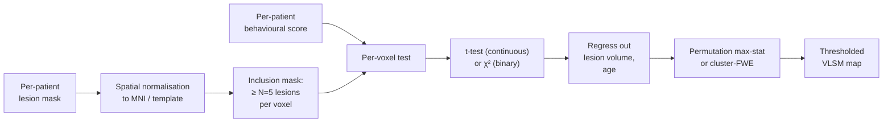
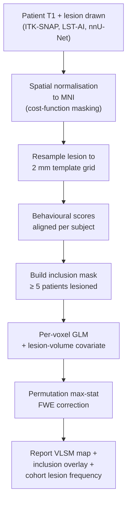

# Lesion-symptom mapping (LSM, VLSM)

> Mapping the relationship between lesion location and behavioural deficit — the stroke-research workhorse for inferring brain-behaviour causation from natural experiments.

Course map: why lesion data → VLSM → multivariate LSM (SVR-LSM, SCCAN) → connectome lesion-symptom mapping (CLSM / disconnectome) → a complete pipeline → disease applications → specialist pitfalls → software → references → where to next.

## 1. Learning objectives

By the end of this page you should be able to:

- State the inferential advantage of lesion data over correlational neuroimaging, and its limits.
- Run a Voxel-based Lesion-Symptom Mapping (VLSM) analysis with the right inclusion mask, covariates, and permutation correction.
- Choose between mass-univariate VLSM, SVR-LSM, and SCCAN for a given hypothesis.
- Build a disconnectome from a lesion mask using a normative connectome and interpret the result.
- Cite the dominant clinical use cases (aphasia, neglect, motor recovery, working memory) and their canonical lesion-substrate findings.
- Spot the design pitfalls — lesion-volume confound, MCA-territory anatomical bias, time-since-stroke heterogeneity, statistical power — that reviewers will probe.

## 2. The natural-experiment logic

Stroke, traumatic brain injury, tumour resection, and penetrating injuries give us **lesions we'd never ethically induce.** Comparing what patients can't do, given where the lesion sits, lets us infer functional anatomy — and unlike correlational fMRI, the inference is **causal**: that region's loss caused this deficit.

The logic goes back to Broca and Wernicke (single-case studies, late 19th century), then Karl Lashley's mass-action experiments, and through Geschwind and Galaburda's disconnection-syndrome era. The modern statistical revolution arrived with [Bates 2003](https://doi.org/10.1038/nn1050) — voxel-based lesion-symptom mapping (VLSM) — which extended the GLM-on-every-voxel logic of fMRI to lesion data and put group-level statistics behind what had been single-case-study inference.

The advantage over correlational neuroimaging is causation. The trade-offs:

- **Sample size.** Stroke / TBI cohorts are typically $N = 50$–$200$, well below the BWAS thresholds discussed in [reliability.md §5](reliability.md#5-the-bwas-reckoning-marek-2022).
- **Anatomical bias.** Lesions cluster in vascular territories (especially MCA); cortex outside those territories is under-sampled.
- **Selection bias.** Stroke survivors are a non-random subset of stroke patients; severity, age, and comorbidity all bias who appears in the cohort.
- **Time-since-injury.** Acute, sub-acute, and chronic lesions present different brain-behaviour relationships because of compensatory plasticity. Cross-link to [clinical/stroke-and-tbi.md](../clinical/stroke-and-tbi.md).

## 3. Voxel-based lesion-symptom mapping (VLSM)

The classical method ([Bates 2003](https://doi.org/10.1038/nn1050)) — the lesion-data analogue of mass-univariate fMRI.



### 3.1 The per-voxel test

For each voxel $v$ in template space, partition patients into "lesion present at $v$" vs "lesion absent at $v$". For continuous behaviour, a two-sample $t$-test compares the behaviour score across the two groups; for binary outcomes, a $\chi^2$ test. The result is a per-voxel statistical map: where in the brain does damage predict worse behaviour?

### 3.2 The inclusion mask

You can't run a stable test on a voxel that's lesioned in 0 or 1 patients. The standard fix: restrict the analysis to voxels lesioned in at least $N_{\text{min}}$ patients, typically $N_{\text{min}} = 5$ or $10$. Report the inclusion map alongside the result — readers need to see which voxels were actually testable.

### 3.3 Lesion-volume confound

Total lesion volume correlates strongly with overall stroke severity (and therefore most behavioural deficits). A naive VLSM will then "find" every voxel that tends to be lesioned in big strokes — a confounded, anatomy-of-stroke result, not a brain-behaviour mapping. The standard fix: **include lesion volume as a covariate** in the per-voxel GLM. Some studies also report results with and without the covariate to demonstrate robustness.

### 3.4 Multiple-comparisons correction

Hundreds of thousands of voxels, the same problem as fMRI — but with smaller $N$ and irregular spatial sampling. Permutation-based **maximum statistic** (Westfall & Young) is the standard for VLSM because it controls FWE without assuming smoothness; cluster-extent FWE is harder to calibrate on the irregular lesion-overlap masks. Cross-link to [multiple-comparisons.md](multiple-comparisons.md).

Implementations:

- **[NiiStat](https://www.nitrc.org/projects/niistat)** ([Rorden 2007](https://doi.org/10.1162/jocn.2007.19.7.1081)) — MATLAB; mass-univariate VLSM with permutation.
- **[LESYMAP](https://github.com/dorianps/LESYMAP)** ([Pustina 2018](https://doi.org/10.1016/j.neuroimage.2017.10.027)) — R; mass-univariate and SCCAN multivariate in one package.

## 4. Multivariate lesion-symptom mapping

VLSM treats each voxel independently and ignores the network organisation of brain function. Multivariate LSM treats all lesioned voxels jointly.

**SVR-LSM** ([Zhang 2014](https://doi.org/10.1002/hbm.22569)) — Support-Vector Regression Lesion-Symptom Mapping. Train an SVR with the per-voxel lesion-status vector as features and the behaviour as the target; the SVR's $\beta$ weights identify which voxels carry predictive signal. Permutation tests on the weight magnitudes give voxelwise inference. Native handling of multi-voxel deficit configurations; doesn't have the per-voxel independence assumption of VLSM.

**SCCAN** ([Pustina 2017](https://doi.org/10.1093/brain/aww314)) — Sparse Canonical Correlation Analysis for LSM. Finds linearly-related lesion-behaviour components with sparse spatial regularisation. Especially powerful for compound deficits where multiple voxel clusters jointly contribute.

**Bayesian LSM with spatial priors** — emerging family; adds spatial smoothness priors to the multivariate inference. Computationally heavier; not yet routine.

| Method | Strength | Weakness |
|---|---|---|
| **VLSM (mass-univariate)** | Simple, well-understood, voxel-level inference | Ignores between-voxel dependencies; conservative |
| **SVR-LSM** | Respects multi-voxel structure; high predictive power | Weights harder to interpret; permutation expensive |
| **SCCAN** | Identifies compound deficit-region patterns | Hyperparameter (sparsity) sensitive |
| **CLSM (§5)** | Captures disconnection effects beyond the lesion | Depends on the quality of the normative connectome |

The reviewer-friendly default is to **report VLSM and at least one multivariate method**, with the agreement (or disagreement) of the maps treated as a triangulation, not a contradiction.

## 5. Connectome lesion-symptom mapping (CLSM / disconnectome)

The modern step — and increasingly the field's headline framing.

**Insight.** A focal cortical lesion doesn't just knock out the voxels it covers; it disconnects everything the lesioned region connected to. For symptoms driven by network dysfunction (neglect, executive function, semantic memory), the *disconnection profile* often predicts behaviour better than the lesion location itself.

**Method** ([Boes 2015](https://doi.org/10.1093/brain/awv228) — "lesion network mapping"):

1. Take each patient's lesion mask.
2. Use a **normative healthy-brain connectome** (e.g., HCP-based) as a lookup: which voxels does the lesioned tissue connect to?
3. The resulting **disconnection map** describes which downstream regions are likely disconnected.
4. Run the lesion-symptom logic on the disconnection map instead of the raw lesion mask.

**Tooling.**

- **[BCBToolkit](https://toolkit.bcblab.com/)** ([Foulon 2018](https://doi.org/10.1093/gigascience/giy004)) — the standard pipeline; turns an MNI lesion mask into a structural disconnection profile.
- **[Lead-DBS / Lead-Connectome](https://www.lead-dbs.org/)** — used widely in DBS / lesion-network work.

**Headline result.** [Salvalaggio 2020](https://doi.org/10.1093/brain/awaa156) showed that for several stroke deficits (neglect, language, motor), structural and functional disconnection beat lesion location at predicting outcome — a strong endorsement of moving past pure VLSM for symptoms driven by network damage.

## 6. A complete pipeline

The minimal end-to-end VLSM workflow:



A minimal Python snippet to build the inclusion mask from a stack of binary lesion masks already in template space:

```python
import nibabel as nib
import numpy as np

# lesions: shape (N_patients, X, Y, Z) — binary masks, already in MNI
lesions = np.stack([nib.load(p).get_fdata() > 0 for p in lesion_paths]).astype(np.int8)
overlap = lesions.sum(axis=0)               # per-voxel patient count
inclusion = overlap >= 5                    # standard N_min cutoff
print(f"Testable voxels: {inclusion.sum():,} of {inclusion.size:,}")

# Save the inclusion mask alongside any VLSM result
ref = nib.load(lesion_paths[0])
nib.save(nib.Nifti1Image(inclusion.astype(np.uint8), ref.affine), "vlsm_inclusion.nii.gz")
```

**Lesion segmentation.** Manual drawing in [ITK-SNAP](http://www.itksnap.org) remains the gold standard for chronic-stroke lesions; modern deep-learning segmenters ([LST-AI](https://github.com/CompImg/LST-AI), nnU-Net trained on stroke cohorts) can give a strong first pass. Cross-link to [fundamentals/medical-imaging/segmentation.md](../fundamentals/medical-imaging/segmentation.md).

**Spatial normalisation.** A lesion is by definition a place where the registration's intensity model is wrong. The two fixes:

- **Cost-function masking** — exclude the lesion from the registration metric so it doesn't drive the transform.
- **Template-based normalisation** with lesion priors — registers to a population template that already accommodates lesions.

Cross-link to [fundamentals/medical-imaging/registration.md](../fundamentals/medical-imaging/registration.md).

## 7. Disease applications

| Deficit | Canonical lesion substrate | Reference |
|---|---|---|
| **Aphasia (Broca's, Wernicke's)** | Left IFG (Broca) / left STG-TPJ (Wernicke); VLSM has refined this to more distributed perisylvian networks | [Bates 2003](https://doi.org/10.1038/nn1050); [Mirman 2015](https://doi.org/10.1038/ncomms7762) |
| **Hemispatial neglect** | Right inferior parietal lobule / TPJ; SLF-II disconnection drives chronic neglect | [Mort 2003](https://doi.org/10.1093/brain/awg200); [Bartolomeo 2007](https://doi.org/10.1093/cercor/bhl164) |
| **Working memory deficits** | Dorsolateral prefrontal cortex; recovery depends on intact parietal connectivity | DLPFC LSM literature |
| **Motor recovery (upper limb)** | Corticospinal-tract integrity (FA / lesion-load) predicts recovery better than M1 lesion size | [Lindenberg 2010](https://doi.org/10.1212/WNL.0b013e3181d3e2b8) |
| **Apraxia** | Left inferior parietal lobule / arcuate disconnection | apraxia LSM canon |

For the broader clinical workup of stroke and TBI cohorts that produce these data, cross-link to [clinical/stroke-and-tbi.md](../clinical/stroke-and-tbi.md).

## 8. Specialist pitfalls

**Statistical power.** A 100-patient stroke cohort gives, voxelwise, less power than a 30-subject fMRI design after multiple-comparisons correction. Cluster-extent FWE often fails to find anything; permutation max-stat is more honest about the low power. Run a power analysis before promising the cohort that the study will find something.

**Lesion-volume confound.** Always include lesion volume as a covariate; report results with and without. A VLSM that disappears when lesion volume is regressed out was never a brain-behaviour finding, it was an anatomy-of-stroke finding.

**Anatomical bias.** Lesions cluster in MCA territory because that's where strokes happen. Regions outside MCA territory (e.g., medial-frontal cortex, brainstem) are systematically under-sampled and a "negative result" there means nothing. Report the lesion-frequency map alongside any VLSM finding so readers can see what was testable.

**Time since stroke.** Acute (< 1 week), sub-acute (1 week – 6 months), and chronic (> 6 months) lesions show systematically different brain-behaviour relationships because of evolving plasticity, oedema resolution, and compensatory recruitment. Either restrict to one phase or model phase as a covariate; don't pool naively.

**Population validity.** Stroke survivors who make it into a research cohort are systematically younger, less severely affected, and more compliant than the source population. Generalisation to the broader stroke population needs explicit caveat.

**Multivariate vs univariate.** SVR-LSM and SCCAN are more powerful but harder to interpret. Multivariate methods can "find" effects driven by a single high-weight voxel that VLSM would also find; they can also genuinely find compound deficits invisible to mass-univariate methods. Report both and treat agreement as triangulation.

**Disconnection beats lesion location for many symptoms.** [Salvalaggio 2020](https://doi.org/10.1093/brain/awaa156) is the clearest demonstration. For network-driven symptoms (neglect, executive dysfunction), defaulting to CLSM rather than VLSM is increasingly the right move.

**Hemispheric pooling.** Right- and left-hemisphere lesions are not symmetric controls of each other for lateralised functions (language, neglect). Either analyse per-hemisphere or use a laterality-explicit design; cross-link to [asymmetry.md](asymmetry.md).

**Reporting standards.** Include the lesion-overlap map, the inclusion mask, the covariate list, the permutation count, and the unthresholded statistical map (NeuroVault) — all of which are now expected by reviewers. Cross-link to [reliability.md §8](reliability.md#8-reporting-standards).

## 9. Software

| Tool | Role | Notes |
|---|---|---|
| [NiiStat](https://www.nitrc.org/projects/niistat) | Mass-univariate VLSM + permutation | MATLAB; the classical reference implementation |
| [LESYMAP](https://github.com/dorianps/LESYMAP) | VLSM + SCCAN | R; integrates with ANTsR for registration |
| [BCBToolkit](https://toolkit.bcblab.com/) | Disconnection mapping (CLSM) | Pipeline for lesion → disconnection profile using a normative connectome |
| [Lead-DBS / Lead-Connectome](https://www.lead-dbs.org/) | Lesion / electrode network mapping | Strong for DBS work; also used in stroke / TBI lesion-network analyses |
| [MRIcron / MRIcroGL](https://www.nitrc.org/projects/mricron) | Lesion drawing + visualisation | The standard manual-tracing tool for chronic-stroke lesions |
| [ITK-SNAP](http://www.itksnap.org) | Lesion segmentation (manual + semi-automated) | The other standard manual-tracing option; better for 3D editing |
| [ATLAS (Liew 2018)](https://doi.org/10.1038/sdata.2018.11) | Open dataset of 304+ T1 stroke lesions with masks | The standard benchmark cohort for lesion-segmentation models |

## 10. References

1. Bates E, Wilson SM, Saygin AP, et al. Voxel-based lesion-symptom mapping. *Nat Neurosci.* 2003;6(5):448-450. [doi:10.1038/nn1050](https://doi.org/10.1038/nn1050)
2. Rorden C, Karnath HO, Bonilha L. Improving lesion-symptom mapping. *J Cogn Neurosci.* 2007;19(7):1081-1088. [doi:10.1162/jocn.2007.19.7.1081](https://doi.org/10.1162/jocn.2007.19.7.1081)
3. Pustina D, Avants B, Faseyitan OK, Medaglia JD, Coslett HB. Improved accuracy of lesion to symptom mapping with multivariate sparse canonical correlations. *Brain.* 2017;140(7):1976-1986. [doi:10.1093/brain/aww314](https://doi.org/10.1093/brain/aww314)
4. Pustina D, Coslett HB, Ungar L, et al. Enhanced estimations of post-stroke aphasia severity using stacked multimodal predictions. *NeuroImage.* 2018;176:295-305. [doi:10.1016/j.neuroimage.2017.10.027](https://doi.org/10.1016/j.neuroimage.2017.10.027)
5. Zhang Y, Kimberg DY, Coslett HB, Schwartz MF, Wang Z. Multivariate lesion-symptom mapping using support vector regression. *Hum Brain Mapp.* 2014;35(12):5861-5876. [doi:10.1002/hbm.22569](https://doi.org/10.1002/hbm.22569)
6. Boes AD, Prasad S, Liu H, et al. Network localization of neurological symptoms from focal brain lesions. *Brain.* 2015;138(Pt 10):3061-3075. [doi:10.1093/brain/awv228](https://doi.org/10.1093/brain/awv228)
7. Foulon C, Cerliani L, Kinkingnéhun S, et al. Advanced lesion symptom mapping analyses and implementation as BCBtoolkit. *GigaScience.* 2018;7(3):1-17. [doi:10.1093/gigascience/giy004](https://doi.org/10.1093/gigascience/giy004)
8. Salvalaggio A, De Filippo De Grazia M, Zorzi M, Thiebaut de Schotten M, Corbetta M. Post-stroke deficit prediction from lesion and indirect structural and functional disconnection. *Brain.* 2020;143(7):2173-2188. [doi:10.1093/brain/awaa156](https://doi.org/10.1093/brain/awaa156)
9. Mort DJ, Malhotra P, Mannan SK, et al. The anatomy of visual neglect. *Brain.* 2003;126(Pt 9):1986-1997. [doi:10.1093/brain/awg200](https://doi.org/10.1093/brain/awg200)
10. Bartolomeo P, Thiebaut de Schotten M, Doricchi F. Left unilateral neglect as a disconnection syndrome. *Cereb Cortex.* 2007;17(11):2479-2490. [doi:10.1093/cercor/bhl164](https://doi.org/10.1093/cercor/bhl164)
11. Mirman D, Chen Q, Zhang Y, et al. Neural organization of spoken language revealed by lesion-symptom mapping. *Nat Commun.* 2015;6:6762. [doi:10.1038/ncomms7762](https://doi.org/10.1038/ncomms7762)
12. Lindenberg R, Renga V, Zhu LL, Betzler F, Alsop D, Schlaug G. Structural integrity of corticospinal motor fibers predicts motor impairment in chronic stroke. *Neurology.* 2010;74(4):280-287. [doi:10.1212/WNL.0b013e3181d3e2b8](https://doi.org/10.1212/WNL.0b013e3181d3e2b8)
13. Liew SL, Anglin JM, Banks NW, et al. A large, open source dataset of stroke anatomical brain images and manual lesion segmentations. *Sci Data.* 2018;5:180011. [doi:10.1038/sdata.2018.11](https://doi.org/10.1038/sdata.2018.11)

## 11. Where to next

- [clinical/stroke-and-tbi.md](../clinical/stroke-and-tbi.md) — the clinical workup of the cohorts that VLSM analyses.
- [group-stats.md](group-stats.md) — the per-voxel GLM machinery that VLSM is a special case of.
- [multiple-comparisons.md](multiple-comparisons.md) — permutation max-stat correction for the irregular VLSM map.
- [fundamentals/medical-imaging/segmentation.md](../fundamentals/medical-imaging/segmentation.md) — getting the lesion masks in the first place.
- [fundamentals/medical-imaging/registration.md](../fundamentals/medical-imaging/registration.md) — cost-function masking for lesion normalisation.
- [network-metrics.md](network-metrics.md) — the normative-connectome machinery that disconnectome LSM relies on.
- [asymmetry.md](asymmetry.md) — handling lateralised deficits and hemispheric pooling.
- [reliability.md](reliability.md) — power and reporting context for small-N lesion cohorts.
