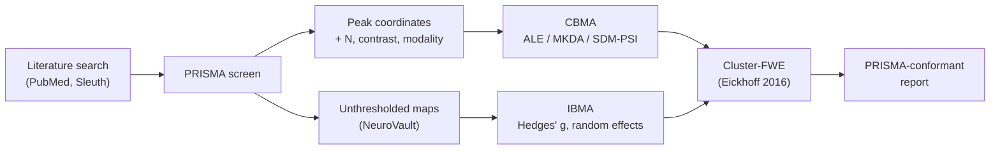

# Coordinate-based and image-based meta-analysis

> How to pool findings across studies cleanly: coordinate-based (ALE, SDM-PSI) versus image-based (IBMA) meta-analysis, with the kernel choice, FWE correction, and pre-registration that make them credible.

Course map: why neuroimaging meta-analyses → coordinate-based (ALE, KDA, MKDA) → image-based (IBMA) → a complete pipeline → tools → preregistration and reporting → specialist pitfalls → references → where to next.

## 1. Learning objectives

By the end of this page you should be able to:

- State the difference between coordinate-based (CBMA) and image-based (IBMA) meta-analysis and pick the right one for a given corpus.
- Run an Activation Likelihood Estimation (ALE) analysis in [NiMARE](https://nimare.readthedocs.io) end-to-end, with cluster-FWE correction.
- Choose between ALE, MKDA, and SDM-PSI based on what each study reports.
- Pre-register a neuroimaging meta-analysis on [PROSPERO](https://www.crd.york.ac.uk/PROSPERO/) and report it to PRISMA 2020.
- Spot the dominant pitfalls — within-experiment dependence, coordinate-system mixing, the publication-bias problem, ALE smoothing artefacts.
- Cross-link to the broader open-science apparatus (NeuroVault, the BWAS reckoning).

## 2. Why pool across studies

Any single fMRI study has small $N$ and inflated effect sizes — the Marek BWAS finding ([Marek 2022](https://doi.org/10.1038/s41586-022-04492-w), unpacked in detail in [reliability.md](reliability.md)) makes this concrete. Meta-analysis is how the field accumulates knowledge in spite of that; it is also the only honest way to make claims like "the dorsal anterior cingulate is consistently engaged by cognitive control" or "the amygdala is over-recruited in anxiety disorders".

Two flavours, defined by what is shared:

- **Coordinate-based meta-analysis (CBMA).** Uses only the published **peak coordinates** of significant clusters from each study — the lowest common denominator across the literature. Works on almost every paper ever published.
- **Image-based meta-analysis (IBMA).** Uses the full **unthresholded statistical maps** when authors share them (typically on [NeuroVault](https://neurovault.org)). Gold standard, but only ~10% of papers share their maps.



## 3. Coordinate-based meta-analysis (CBMA)

The workhorse for legacy literature, where almost no one shared their unthresholded maps. Three families dominate.

### 3.1 Activation Likelihood Estimation (ALE)

ALE ([Turkeltaub 2002](https://doi.org/10.1006/nimg.2002.1131); revised in [Eickhoff 2012](https://doi.org/10.1002/hbm.21186)) is the most-used CBMA method. The recipe:

- Each reported peak coordinate is convolved with a **3D Gaussian kernel** whose full-width-half-maximum (FWHM) is proportional to the subject-N of that experiment (smaller studies → wider kernels, reflecting greater spatial uncertainty).
- For each experiment, the per-voxel **modelled activation (MA) map** is the union (probabilistic OR) of all that experiment's kernels.
- The **ALE statistic** at each voxel is the union probability across experiments — the probability that *at least one* experiment activates at that voxel under a model where each study's true peak is uncertain by its kernel.
- The **null** is the random spatial distribution of coordinates (a fixed-marginal label permutation).
- **Inference**: cluster-level FWE correction at $p < 0.05$ with a voxel-forming threshold of $p < 0.001$ ([Eickhoff 2016](https://doi.org/10.1016/j.neuroimage.2016.04.072)). This is the modern standard; older "FDR on ALE" results should be treated with caution.

### 3.2 SDM-PSI

Seed-based $d$ mapping with Permutation of Subject Images ([Albajes-Eizagirre 2019](https://doi.org/10.1016/j.neuroimage.2018.10.077), [SDM-PSI](https://www.sdmproject.com)) is a hybrid. It reconstructs **effect-size maps** from peaks plus signs (positive vs negative contrasts) and treats the meta-analysis as a multivariate, random-effects problem — closer to IBMA in spirit, but tractable on coordinate data. It also supports mixed CBMA + IBMA studies in the same model.

### 3.3 (M)KDA and the older family

- **Kernel Density Estimation (KDA)** — older method, simply counts coordinate density per voxel. Mostly superseded by ALE.
- **Multilevel Kernel Density Analysis (MKDA)** ([Wager 2007](https://doi.org/10.1093/scan/nsm015)) — Wager's multi-kernel approach: each study contributes one indicator map; pooled via random-effects. Still useful when ALE's per-N kernel-scaling is not desired.

| Method | Inputs | Threshold | When to reach for it |
|---|---|---|---|
| **ALE** | Peak coordinates + N per experiment | Cluster-FWE (Eickhoff 2016) | Default for activation meta-analyses; widely cited |
| **MKDA** | Peak coordinates + study-level indicators | Cluster-FWE on weighted density | When per-subject kernel scaling is not desired |
| **SDM-PSI** | Peaks **+ signs** (and effect sizes if available) | Permutation, random effects | Mixed-direction contrasts; mixed CBMA + IBMA |
| **KDA** | Coordinates only | FWE | Historical / sanity check |

## 4. Image-based meta-analysis (IBMA)

When authors share unthresholded $t$ or $z$ maps, you can do real meta-analysis at the voxel level — exactly the way every other field of medicine does it.

The standard pipeline:

- Convert each shared map to a per-voxel **Hedges' $g$** (bias-corrected standardised mean difference).
- Pool with **fixed-effects** ($\tau^2 = 0$, all studies estimating one true effect) or — almost always more honest — **random-effects** (DerSimonian-Laird or restricted maximum likelihood) inverse-variance weighting at each voxel:

$$
\bar{g}_v \;=\; \frac{\sum_i w_{iv}\, g_{iv}}{\sum_i w_{iv}}, \qquad w_{iv} \;=\; \frac{1}{\hat\sigma_{iv}^2 + \hat\tau_v^2}.
$$

- Test $\bar g_v / \text{SE}(\bar g_v)$ voxelwise; correct for multiple comparisons (cross-link to [multiple-comparisons.md](multiple-comparisons.md)).

**Repository**: [NeuroVault](https://neurovault.org) ([Gorgolewski 2015](https://doi.org/10.3389/fninf.2015.00008)) is the canonical place to find and deposit unthresholded maps.

**Software**: [NiMARE](https://github.com/neurostuff/NiMARE) supports both CBMA and IBMA via a single estimator API.

IBMA gives much higher effect-size precision than CBMA at the cost of needing the original maps — currently only ~10% of fMRI papers share them, although that share is rising fast as journals (NeuroImage, eLife) mandate it.

## 5. A complete pipeline

A minimal NiMARE ALE workflow on a Sleuth-style coordinate file:

```python
from nimare.io import convert_sleuth_to_dataset
from nimare.meta.cbma.ale import ALE
from nimare.correct import FWECorrector

# 1. Load a Sleuth-style text file (peaks per experiment + N)
dset = convert_sleuth_to_dataset("working_memory_peaks.txt")

# 2. Fit ALE with the modern kernel
meta = ALE(kernel__sample_size_factor=None)  # FWHM scaled by per-experiment N
results = meta.fit(dset)

# 3. Cluster-FWE correction (Eickhoff 2016 recommendation)
corr = FWECorrector(method="montecarlo", n_iters=10000, voxel_thresh=0.001)
corrected = corr.transform(results)

# 4. Write the thresholded z-map
corrected.save_maps(output_dir="results/", prefix="WM_ALE")
```

For an IBMA on shared maps, swap `convert_sleuth_to_dataset` for a NeuroVault collection loader and the `ALE` estimator for `nimare.meta.ibma.Stouffers` or `nimare.meta.ibma.WeightedLeastSquares`.

## 6. Tools

The cross-link to [tools/index.md](../tools/index.md) has the catalogue; the comparison that matters when choosing:

| Tool | Language | CBMA | IBMA | When to reach for it |
|---|---|---|---|---|
| [NiMARE](https://nimare.readthedocs.io) | Python | Yes (ALE, MKDA, KDA, SCALE) | Yes (Stouffer, WLS, DerSimonian-Laird) | The modern stack; scriptable, reproducible, plays well with [Nilearn](https://nilearn.github.io) |
| [GingerALE](https://www.brainmap.org/ale/) | Java GUI | Yes (ALE) | No | The legacy reference; cite it even when you re-do the analysis in NiMARE |
| [Neurosynth Compose](https://compose.neurosynth.org) | Web | Yes (via NiMARE) | Limited | No install; great for teaching and quick prototypes; built on the [NeuroQuery](https://neuroquery.org) / NeuroSynth corpora |
| [SDM-PSI](https://www.sdmproject.com) | Java GUI | Yes (with signs) | Yes | When you have a mix of peak and map inputs, or directional contrasts |
| [Sleuth](https://www.brainmap.org/sleuth/) | Java GUI | Database query | — | BrainMap database front-end; produces ALE-ready coordinate files |

Coordinate-system note: GingerALE and SDM-PSI both expect MNI; convert Talairach coordinates with the [Lancaster icbm2tal](https://doi.org/10.1002/hbm.20345) transform first.

## 7. Pre-registration and reporting

A meta-analysis is a primary study, not a literature review. Treat it that way.

- **[PROSPERO](https://www.crd.york.ac.uk/PROSPERO/)** ([Booth 2012](https://doi.org/10.1186/2046-4053-1-2)) — the international register for systematic reviews and meta-analyses, hosted by the University of York Centre for Reviews and Dissemination. Register before you screen.
- **[PRISMA 2020](http://www.prisma-statement.org)** ([Page 2021](https://doi.org/10.1136/bmj.n71)) — the reporting standard. The PRISMA flow diagram (records identified → screened → included) is now expected by every clinical journal and by most neuroimaging journals.
- **Neuroimaging-specific reporting** — the [Müller 2018](https://doi.org/10.1016/j.neubiorev.2017.11.012) checklist for CBMA covers what to report beyond PRISMA: kernel choice, contrast direction, coordinate-system harmonisation, software version, FWE method, and the experiment-level (not paper-level) inclusion table.

Cross-link to [reliability.md](reliability.md) for the broader pre-registration story and to [ai/regulatory.md](../ai/regulatory.md) for the clinical-AI reporting analogues (TRIPOD+AI, CLAIM).

## 8. Specialist pitfalls

**Coordinate redundancy.** Preprints, conference abstracts, and journal publications of the same study often re-report the same peaks. Always dedupe by author + cohort N + scanner protocol, not by paper. Two reports of the same cohort inflate the corpus and break the independence assumption that ALE / MKDA rely on.

**Within-experiment dependence.** A single paper often reports several contrasts from one cohort (e.g., 2-back > 0-back, 3-back > 0-back, 3-back > 2-back). These contrasts are not independent. Use **experiment** (one contrast, one cohort) as the unit, and either pool contrasts within a cohort to one map or down-weight per-paper.

**Statistical power of CBMA.** Eickhoff's simulations ([Eickhoff 2016](https://doi.org/10.1016/j.neuroimage.2016.04.072)) showed that ALE needs **≥ 17 experiments** to reliably detect a moderate effect at cluster-FWE. Sub-corpus subgroup analyses (e.g., "ALE of left-handers only, $k = 6$") are usually under-powered to the point of being uninformative.

**Publication bias.** Trim-and-fill, Egger's regression, and funnel plots are well-developed for clinical psychology meta-analyses but only nascent for neuroimaging — there is no per-voxel funnel plot. The honest substitute is a **sensitivity analysis** that drops the most extreme studies and re-runs. SDM-PSI has built-in heterogeneity diagnostics ($I^2$, Egger's intercept on the meta-analytic effect).

**Coordinate-system harmonisation.** Talairach vs MNI is a real ~5-10 mm offset that ALE will smear with the kernel but not eliminate. Always convert pre-2002 Talairach coordinates to MNI using the [Lancaster icbm2tal](https://doi.org/10.1002/hbm.20345) transform, not the older Brett affine.

**The "ALE bias" controversy.** A line of work argued that ALE's spatial smoothing alone could produce clusters under the null, inflating the false-positive rate. The Eickhoff 2016 cluster-FWE correction (voxel-forming $p < 0.001$ + cluster-FWE $p < 0.05$) is the modern fix; FDR on ALE is no longer the standard. Cross-link to [multiple-comparisons.md](multiple-comparisons.md) and to the Eklund cluster-correction story.

**Specific co-activation networks (SCAN).** The meta-analytic equivalent of functional connectivity: which regions co-activate across tasks in a CBMA corpus ([Laird 2011](https://doi.org/10.1093/cercor/bhq262)). Useful for triangulating an ROI's task-general profile, but vulnerable to the same publication-bias and coordinate-system pitfalls as the underlying ALE.

**Multi-comparison correction across moderators.** Subgroup analyses (left- vs right-handers; clinical vs control; visual vs auditory variant) multiply the analyses. Each one inherits the full ALE pipeline including its own cluster-FWE correction — but the *family* of subgroup contrasts is uncorrected unless you say so. Pre-register the subgroup plan.

## 9. References

1. Turkeltaub PE, Eden GF, Jones KM, Zeffiro TA. Meta-analysis of the functional neuroanatomy of single-word reading: method and validation. *NeuroImage.* 2002;16(3 Pt 1):765-780. [doi:10.1006/nimg.2002.1131](https://doi.org/10.1006/nimg.2002.1131)
2. Eickhoff SB, Bzdok D, Laird AR, Kurth F, Fox PT. Activation likelihood estimation meta-analysis revisited. *NeuroImage.* 2012;59(3):2349-2361. [doi:10.1002/hbm.21186](https://doi.org/10.1002/hbm.21186)
3. Eickhoff SB, Nichols TE, Laird AR, et al. Behavior, sensitivity, and power of activation likelihood estimation characterized by massive empirical simulation. *NeuroImage.* 2016;137:70-85. [doi:10.1016/j.neuroimage.2016.04.072](https://doi.org/10.1016/j.neuroimage.2016.04.072)
4. Albajes-Eizagirre A, Solanes A, Vieta E, Radua J. Voxel-based meta-analysis via permutation of subject images (PSI): theory and implementation for SDM. *NeuroImage.* 2019;186:174-184. [doi:10.1016/j.neuroimage.2018.10.077](https://doi.org/10.1016/j.neuroimage.2018.10.077)
5. Wager TD, Lindquist M, Kaplan L. Meta-analysis of functional neuroimaging data: current and future directions. *Soc Cogn Affect Neurosci.* 2007;2(2):150-158. [doi:10.1093/scan/nsm015](https://doi.org/10.1093/scan/nsm015)
6. Gorgolewski KJ, Varoquaux G, Rivera G, et al. NeuroVault.org: a web-based repository for collecting and sharing unthresholded statistical maps of the human brain. *Front Neuroinform.* 2015;9:8. [doi:10.3389/fninf.2015.00008](https://doi.org/10.3389/fninf.2015.00008)
7. Booth A, Clarke M, Dooley G, et al. The nuts and bolts of PROSPERO: an international prospective register of systematic reviews. *Syst Rev.* 2012;1:2. [doi:10.1186/2046-4053-1-2](https://doi.org/10.1186/2046-4053-1-2)
8. Page MJ, McKenzie JE, Bossuyt PM, et al. The PRISMA 2020 statement: an updated guideline for reporting systematic reviews. *BMJ.* 2021;372:n71. [doi:10.1136/bmj.n71](https://doi.org/10.1136/bmj.n71)
9. Müller VI, Cieslik EC, Laird AR, et al. Ten simple rules for neuroimaging meta-analysis. *Neurosci Biobehav Rev.* 2018;84:151-161. [doi:10.1016/j.neubiorev.2017.11.012](https://doi.org/10.1016/j.neubiorev.2017.11.012)
10. Lancaster JL, Tordesillas-Gutiérrez D, Martinez M, et al. Bias between MNI and Talairach coordinates analyzed using the ICBM-152 brain template. *Hum Brain Mapp.* 2007;28(11):1194-1205. [doi:10.1002/hbm.20345](https://doi.org/10.1002/hbm.20345)
11. Laird AR, Fox PM, Eickhoff SB, et al. Behavioral interpretations of intrinsic connectivity networks. *Cereb Cortex.* 2011;21(10):2189-2198. [doi:10.1093/cercor/bhq262](https://doi.org/10.1093/cercor/bhq262)
12. Marek S, Tervo-Clemmens B, Calabro FJ, et al. Reproducible brain-wide association studies require thousands of individuals. *Nature.* 2022;603:654-660. [doi:10.1038/s41586-022-04492-w](https://doi.org/10.1038/s41586-022-04492-w)

## 10. Where to next

- [group-stats.md](group-stats.md) — the second-level GLM that every meta-analysis is, in spirit, an aggregation of.
- [multiple-comparisons.md](multiple-comparisons.md) — the cluster-FWE machinery that ALE / MKDA rely on.
- [reliability.md](reliability.md) — why single-study effect sizes are inflated, and why meta-analysis is now obligatory.
- [ai/evaluation.md](../ai/evaluation.md) — the analogous "your model won't replicate" story on the AI side.
- [tools/index.md](../tools/index.md) — NiMARE, GingerALE, Neurosynth Compose, SDM-PSI catalogue entries.
- [landmark/papers.md](../landmark/papers.md) — the citable Marek BWAS and Eickhoff ALE papers.
