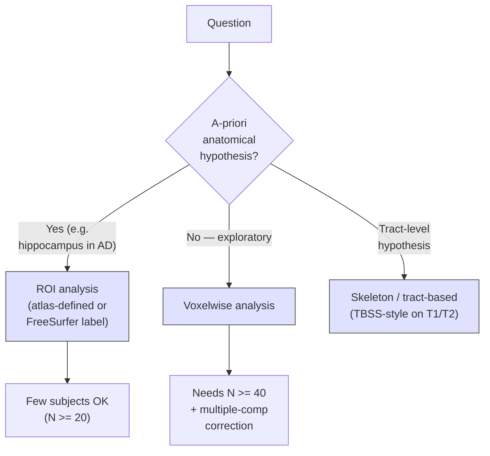

# MRF analysis — using quantitative parameter maps

> How to turn MRF's T1/T2/M0/B1 maps into clinical and research-grade quantitative analysis — beyond reconstruction.

Course map: why quantitative maps matter → reference values → ROI vs voxelwise → harmonisation → disease applications → reproducibility → references.

## 1. Learning objectives

- State three concrete reasons quantitative parameter maps (T1, T2, M0 in physical units) support analyses that weighted T1w / T2w images cannot.
- Quote the typical adult-brain T1 and T2 ranges at 3T for WM, GM, subcortical GM, and CSF — and the order-of-magnitude inter-vendor bias you should still expect.
- Choose between ROI and voxelwise analysis using a hypothesis-driven decision flow.
- Run a defensible voxelwise pipeline on MRF outputs: Bayesian segmentation, registration, smoothing, GLM, TFCE correction.
- Plan a multi-site or multi-vendor MRF cohort: phantom QC, ComBat fallback, what to lock before unblinding.
- Pick the right MRF analysis target (tumour grading, MS lesion follow-up, FCD detection, longitudinal monitoring) given the cohort and the question.

## 2. Why MRF analysis is different from analysing T1w / T2w images

T1w and T2w images encode *contrast*, not values. A bright voxel on MPRAGE means "shorter T1 than its neighbours under this protocol on this scanner today" — not a number you can compare to a second MPRAGE acquired next year on a different system. MRF, derived from the dictionary-matching reconstruction laid out in [fundamentals/sequences/mrf.md](../fundamentals/sequences/mrf.md), gives you the actual T1 (in ms), T2 (in ms), M0 (proton-density proxy), and a B1+ map at each voxel.

The promise is scanner-agnostic group studies, longitudinal monitoring without re-baselining, multi-site cohorts without [ComBat](https://github.com/Jfortin1/ComBatHarmonization) ([Fortin 2018](https://doi.org/10.1016/j.neuroimage.2017.08.047)) (in principle), and pre-emption of the qualitative drift that plagues every multi-year scanner upgrade.

The reality is less tidy. MRF values remain vendor-dependent (different RF pulse shapes, gradient calibrations, spoiler timings), dictionary-dependent (grid spacing, slice profile, B1 axis), and B1-bias prone at 3T and above. Harmonisation is *reduced*, not eliminated. This page is what you do **after** you have parameter maps; the physics, dictionary, and reconstruction live in [fundamentals/sequences/mrf.md](../fundamentals/sequences/mrf.md). Treat MRF maps as quantitative once a phantom QC and an in-distribution check have passed — not before.

## 3. Reference values — what "normal" looks like

| Tissue | T1 (ms, 3T) | T2 (ms, 3T) | Notes |
|---|---|---|---|
| **Cortical GM** | 1300–1500 | 80–100 | Region-dependent; precentral / occipital slightly shorter T1 |
| **White matter** | 700–900 | 60–80 | Bundle-dependent; CST shorter T1 than CC |
| **Subcortical GM** (thalamus, putamen) | 950–1200 | 50–70 | Iron content shortens T2 |
| **Globus pallidus** | 800–1000 | 35–55 | Iron-rich; T2 markedly short |
| **CSF** | ≈ 4000 | > 500 (often ≈ 2000) | Approaches free water |
| **Pituitary, fat** | 300–500 | 40–70 | Outside most brain ROIs but useful sentinels |

Canonical sources: [Stanisz 2005](https://doi.org/10.1002/mrm.20605) for the classic relaxometry tables, [Bojorquez 2017](https://doi.org/10.1016/j.mri.2016.08.021) for an updated meta-analytic synthesis at 1.5T and 3T, and [Wright 2008](https://doi.org/10.1007/s10334-008-0104-8) for paediatric values.

Field-strength dependence matters: T1 *lengthens* with $B_0$ (WM goes from ~650 ms at 1.5T to ~1100 ms at 7T), while T2 *shortens slightly* with increasing field. Age, sex, and iron content modulate values within tissue class — iron accumulates in basal ganglia from infancy through the seventh decade and is the dominant T2 shortener subcortically ([Hallgren & Sourander 1958](https://doi.org/10.1111/j.1471-4159.1958.tb12607.x)). Always state field strength and report group age / sex distributions alongside any T1 / T2 finding.

## 4. ROI vs voxelwise analysis



- **ROI** wins on SNR per measurement (averaging $\sim 10^3$ voxels gives factor-30 SNR boost) and is what reviewers expect for a hypothesis-driven paper (hippocampal T2 in Alzheimer's, substantia nigra T1 in Parkinson's). Cost: requires atlas registration; loses *where in the ROI* the change sits. The standard atlases — [Desikan–Killiany](https://doi.org/10.1016/j.neuroimage.2006.01.021), [Destrieux](https://doi.org/10.1016/j.neuroimage.2010.06.010), [Schaefer-400](https://doi.org/10.1093/cercor/bhx179), [Tian subcortical S1–S4](https://doi.org/10.1038/s41593-020-00711-6) — all work directly on MRF outputs once you register the M0 / synthetic T1w to template space.
- **Voxelwise** is spatially unbiased and the right default for whole-brain exploration. Per-voxel SNR is low; multiple-comparison correction is mandatory — see [Multiple comparisons](multiple-comparisons.md) for FWE / FDR / TFCE choices.
- **Tract-based** for white matter: the [TBSS](https://fsl.fmrib.ox.ac.uk/fsl/fslwiki/TBSS) ([Smith 2006](https://doi.org/10.1016/j.neuroimage.2006.02.024)) skeleton — designed for FA — works fine on T1 and T2 maps once skeletonised on a DTI-derived FA template, and recovers tract-localised relaxometry changes that voxelwise GLM washes out.

## 5. Pipeline — from MRF parameter maps to a group-level statistic

Six steps. Each step has parameters that need to be reported.

1. **Skull-strip** on the M0 (proton-density) or synthetic T1w. M0 works because tissue–CSF–air contrast is preserved; [HD-BET](https://github.com/MIC-DKFZ/HD-BET) ([Isensee 2019](https://doi.org/10.1002/hbm.24750)) and [SynthStrip](https://surfer.nmr.mgh.harvard.edu/docs/synthstrip/) ([Hoopes 2022](https://doi.org/10.1016/j.neuroimage.2022.119474)) are the modern defaults.
2. **Tissue segmentation.** A Bayesian fit that uses $(T_1, T_2)$ *jointly* outperforms intensity-based segmentation because the joint distribution separates classes that overlap in either coordinate alone. [SAMSEG](https://surfer.nmr.mgh.harvard.edu/fswiki/Samseg) ([Puonti 2016](https://doi.org/10.1016/j.neuroimage.2016.09.011)) and [FastSurfer](https://github.com/Deep-MI/FastSurfer) ([Henschel 2020](https://doi.org/10.1016/j.neuroimage.2020.117012)) both accept multi-contrast inputs; SyntheticMR's bundled segmentation ([Vågberg 2017](https://doi.org/10.1016/j.mri.2016.12.011)) is the commercial counterpart.
3. **Coregister to T1w / template.** Rigid for within-session, [ANTs SyN](http://stnava.github.io/ANTs/) ([Avants 2008](https://doi.org/10.1016/j.media.2007.06.004)) for nonlinear to [MNI152](https://www.bic.mni.mcgill.ca/ServicesAtlases/ICBM152NLin2009) or a study-specific template.
4. **Smooth.** FWHM 4–6 mm — *less* than the 8–10 mm typical for conventional MRI because MRF maps have sharper inter-tissue boundaries; over-smoothing erases the very contrast quantification gives you.
5. **Voxelwise GLM** with age, sex, and motion (estimated from the M0 series or from a paired anatomical) as covariates. Standard frameworks: [FSL randomise](https://fsl.fmrib.ox.ac.uk/fsl/fslwiki/Randomise), [PALM](https://github.com/andersonwinkler/PALM) ([Winkler 2014](https://doi.org/10.1016/j.neuroimage.2014.01.060)), or [`nilearn.glm.second_level`](https://nilearn.github.io/stable/modules/glm.html). The mechanics are identical to those laid out in [group-stats.md](group-stats.md).
6. **Cluster correction.** [TFCE](https://fsl.fmrib.ox.ac.uk/fsl/fslwiki/TFCE) ([Smith & Nichols 2009](https://doi.org/10.1016/j.neuroimage.2008.03.061)) is the recommended default for parametric maps — no arbitrary cluster-forming threshold, and TFCE's enhancement function handles the smoother spatial autocorrelation of T1 / T2 maps gracefully. See [Multiple comparisons](multiple-comparisons.md).

A minimal Python snippet — ROI extraction from a T1 map and a two-sample t-test:

```python
import nibabel as nib
import numpy as np
from scipy import stats

# T1 maps (ms), one per subject, already registered to MNI
t1_paths   = [f"derivatives/mrf/sub-{i:03d}_T1map_MNI.nii.gz" for i in range(1, 41)]
group      = np.array([0]*20 + [1]*20)              # 0 = control, 1 = patient
atlas      = nib.load("atlas_DK.nii.gz").get_fdata()
hippo_mask = (atlas == 17) | (atlas == 53)          # FreeSurfer labels

mean_T1 = np.array([
    nib.load(p).get_fdata()[hippo_mask].mean()
    for p in t1_paths
])

t, p = stats.ttest_ind(mean_T1[group == 0], mean_T1[group == 1])
print(f"Hippocampal T1 (ms): controls {mean_T1[group==0].mean():.0f} +- {mean_T1[group==0].std():.0f}; "
      f"patients {mean_T1[group==1].mean():.0f} +- {mean_T1[group==1].std():.0f}; "
      f"t = {t:.2f}, p = {p:.4f}")
```

Production code wraps this in [BIDS-qMRI](https://bids-specification.readthedocs.io/en/stable/modality-specific-files/quantitative-mri.html) I/O, per-subject motion QC, and a permutation test instead of the parametric `ttest_ind` for small cohorts.

### 5.1 B1+ correction — the silent confound

MRF's joint $B_1$ map looks like a free perk but is the single biggest determinant of whether your group T1 effect is real or an RF-shading artifact. At 3T, the receive-coil-driven $B_1^+$ field varies by ±20% across the brain; failure to include $B_1$ as a dictionary axis (or to apply a post-hoc correction) biases T1 estimates by 5–10% in the affected regions — typically the inferior temporal lobes and the frontal cortex. Always inspect the $B_1$ map alongside the T1 map; if the spatial pattern of your group T1 effect matches the spatial pattern of the mean group $B_1$ map, you have a confound, not a finding. [Buonincontri 2016](https://doi.org/10.1002/mrm.25761) is the standard reference on $B_1$ in FISP-MRF.

### 5.2 What to lock before unblinding

A pre-registration checklist specific to MRF analysis:

- Dictionary grid: $T_1$ range, $T_2$ range, $B_1$ range, spacing, and version (commit hash for open implementations).
- Reconstruction stack: software, version, all non-default parameters.
- Skull-strip method, segmentation method (and whether $T_1$ / $T_2$ joint).
- Registration target template (MNI152-2009c, FSL MNI152, study-specific).
- Smoothing FWHM and the justification.
- Statistical model, covariates, multiple-comparison correction.
- For multi-site: phantom QC dates, site / coil dummy coding, ComBat reference batch.

The cost of locking these is one extra hour of writing; the cost of *not* locking them is a reviewer's "we cannot tell whether your effect would replicate with a 1% T1 grid instead of 2%."

## 6. Harmonisation across vendors / sites — the not-yet-solved problem

Inter-vendor T1 differences of **5–15 %** are routine even with nominally identical MRF protocols ([Boss 2021](https://doi.org/10.1002/mrm.28467); [Keenan 2018](https://doi.org/10.1002/mrm.26982)). The sources are unglamorous but cumulative:

- **Gradient calibration.** Slice-select gradient amplitude varies vendor-to-vendor; this shifts effective flip angle by a few percent and biases every dictionary match.
- **Slice profile.** A non-rectangular excitation means the on-axis Bloch simulation overestimates flip angle for off-centre spins. Vendor pulse shapes differ; profile-aware dictionaries help but are not always shipped.
- **B1+ inhomogeneity.** Especially at 3T and above; FISP-MRF can absorb B1 as a dictionary axis but only if the grid is dense enough.
- **Dictionary discretisation.** A 1% T1 grid is fine for tumour grading and useless for sub-percent longitudinal change.

Mitigations, in order of effort:

- **Standardised acquisition + phantom scans on every system every quarter.** The [NIST/ISMRM System Phantom](https://www.nist.gov/programs-projects/quantitative-mri) is the *de facto* reference; the [ISMRM Quantitative MR Study Group](https://www.ismrm.org/study-groups/quantitative-mr/) maintains protocols.
- **Phantom-based correction factors.** Fit a linear $T_1^{\text{corrected}} = a \cdot T_1^{\text{measured}} + b$ per site and apply pre-analysis. Honest, cheap, only as good as your phantom coverage.
- **Vendor-agnostic dictionaries.** Open [Pulseq-MRF](https://pulseq.github.io/) + [pypulseq](https://github.com/imr-framework/pypulseq) sequences ship the same waveforms across vendors and let you regenerate dictionaries from the actual pulse plays — the long-term answer, currently research-grade.
- **ComBat / neuroCombat as second-pass fix.** [ComBat](https://github.com/Jfortin1/ComBatHarmonization) ([Fortin 2018](https://doi.org/10.1016/j.neuroimage.2017.08.047); [Johnson 2007](https://doi.org/10.1093/biostatistics/kxj037)) on voxelwise maps removes residual site effects. It is what most multi-site cohorts actually use today. The conceptual irony — that MRF was meant to *eliminate* the need for ComBat — is real and should be acknowledged in any paper.
- **Site as a fixed effect** in the second-level GLM. Cheapest, works when sites are balanced across groups; collapses when site and disease are confounded (a single-site referral pattern, etc.).

Cite [Keenan 2018](https://doi.org/10.1002/mrm.26982), [Bane 2018](https://doi.org/10.1002/mrm.27464), and [Bojorquez 2017](https://doi.org/10.1016/j.mri.2016.08.021) when you write the limitations paragraph.

## 7. Disease applications — what MRF actually delivers

| Application | Metric | Performance / finding | Reference |
|---|---|---|---|
| **Brain tumour grading** | Joint $(T_1, T_2)$ | AUC ≈ 0.8 for low- vs high-grade glioma | [Badve 2017](https://doi.org/10.3174/ajnr.A5035) |
| **Glioma multi-modal phenotyping** | MRF + FET-PET | Improves IDH / 1p19q prediction over either alone | [Haubold 2020](https://doi.org/10.1007/s00259-019-04602-2) |
| **Multiple sclerosis lesions** | Lesion T1, T2; NAWM T1 | Detects pre-lesional change; tracks remyelination | [Boss 2021](https://doi.org/10.1002/mrm.28467); cross-link to [clinical/multiple-sclerosis.md](../clinical/multiple-sclerosis.md) |
| **Alzheimer's** | Cortical T1, hippocampal T2 | Cortical T1 changes precede atrophy | [Stockmann 2024](https://doi.org/10.3174/ajnr.A8175) review; [clinical/alzheimers-and-dementia.md](../clinical/alzheimers-and-dementia.md) |
| **Stroke** | ADC + T2*, mismatch | Penumbra estimation feasibility | [Hilbert 2020](https://doi.org/10.1002/jmri.27042) |
| **Epilepsy (FCD)** | T1, T2 cortical | Subtle changes in normal-appearing cortex | [Su 2017](https://doi.org/10.1016/j.eplepsyres.2017.07.011); [clinical/epilepsy.md](../clinical/epilepsy.md) |
| **Parkinson's** | Substantia nigra T1, T2* | Loss of dorsolateral nigral hyperintensity | [Hatano 2023](https://doi.org/10.1093/braincomms/fcad225); [clinical/parkinsons-and-movement.md](../clinical/parkinsons-and-movement.md) |
| **Cardiac, hepatic MRF** | Myocardial T1 / T2; liver iron | Already in some clinical workflows | [Hamilton 2017](https://doi.org/10.1002/mrm.26216) |

Two patterns to internalise. First, the *strongest* clinical case for MRF is **quantitative follow-up** — comparing this scan to last year's — not single-timepoint diagnosis. Second, even where AUCs look modest (~0.8), MRF's value is often *substituting a single 15 s acquisition* for a stack of conventional sequences, plus a built-in B1 map; the workflow gain matters as much as the discrimination.

## 8. Longitudinal MRF analysis — the killer use case

Within-subject test–retest reproducibility on 3T brain MRF sits at **3–5 % coefficient of variation** for T1 and T2 on most metrics ([Kara 2019](https://doi.org/10.1002/mrm.27478); [Buonincontri 2019](https://doi.org/10.1002/mrm.27649)). Compare that to qualitative T1w / T2w follow-up, where there is no defensible "percent change" at all — only a radiologist's recall.

Why longitudinal MRF beats conventional re-analysis:

- **Stable units (ms) over years.** A T1 of 1100 ms last year is a T1 of 1100 ms this year, modulo the residual sources in § 6.
- **No re-baselining.** Adding a scanner or upgrading software does not invalidate the prior timepoints — though you should phantom-anchor the transition.
- **Effect sizes are interpretable.** "Hippocampal T1 increased 4 % over 12 months" is a quantity, not a contrast.

Pipeline: per-subject longitudinal SyN registration ([ANTs](http://stnava.github.io/ANTs/) `antsLongitudinalCorticalThickness.sh` style), within-subject mean template, GLM with subject as random effect — exactly the structure in [longitudinal.md](longitudinal.md). Use [Generalized Estimating Equations](https://en.wikipedia.org/wiki/Generalized_estimating_equation) or `lme4` mixed models; the parametric tools all support them.

Pitfalls specific to longitudinal MRF:

- **Scanner upgrades mid-study.** Lock a phantom-scan-per-quarter cadence on every system from the first patient.
- **Software-version drift in dictionary generation.** Pin the reconstruction stack version per-study. Re-running an old dataset through a new dictionary changes the answer.
- **Coil changes.** B1 map shifts; if your coil swap is mid-cohort and not perfectly balanced across groups, you have a confound. Document.

## 9. Software and datasets

- [MRF-Toolbox (Cleveland Clinic / CWRU)](https://github.com/MRFingerprinting) — the original implementations from the lab that invented MRF; reference reconstructions and dictionary code.
- [pyMRF](https://github.com/jakobasslaender/pyMRF) — Python reference for low-rank reconstruction.
- [BART](https://mrirecon.github.io/bart/) — Berkeley Advanced Reconstruction Toolbox; production-grade SVD + low-rank MRF support.
- [SyMRI / SyntheticMR](https://syntheticmr.com/products/symri-9/) — commercial clinical pipeline; synthetic contrasts + segmentation + quantitative maps in a single radiologist-friendly workflow.
- [Quantitative Imaging Biomarker Alliance (QIBA)](https://www.rsna.org/research/quantitative-imaging-biomarkers-alliance) — RSNA-led standardisation effort with published profiles for quantitative MRI.
- [NIST/ISMRM Quantitative MRI program](https://www.nist.gov/programs-projects/quantitative-mri) — phantom standards and round-robin data.
- [BIDS-qMRI specification (BEP001)](https://bids-specification.readthedocs.io/en/stable/modality-specific-files/quantitative-mri.html) — required storage layout for `_T1map.nii.gz`, `_T2map.nii.gz`, `_M0map.nii.gz` with explicit JSON sidecars.
- [ISMRM Reproducible Research repos](https://github.com/ISMRM) — open datasets and reference recons including the [RRSG challenge MRF set](https://github.com/ISMRM/rrsg_challenge_01).
- [NITRC](https://nitrc.org) — community-shared neuroimaging datasets; several MRF cohorts archived.
- [OpenNeuro](https://openneuro.org) — BIDS-native data sharing; the place to deposit new MRF cohorts.

## 10. PhD-level frontiers

- **Joint MRF + diffusion.** [Cao 2019](https://doi.org/10.1002/mrm.27894) and [Jiang 2017](https://doi.org/10.1002/mrm.26658) demonstrated simultaneous $T_1, T_2$, and ADC quantification in one acquisition. Analysis side: you now have five maps per voxel — partial-volume modelling and dimensionality reduction (PCA, manifold learning) become the obvious tools.
- **Partial-volume MRF for mixed tissue voxels.** [Hamilton 2020](https://doi.org/10.1002/mrm.28525) (and the multi-component MRF lineage from [McGivney 2018](https://doi.org/10.1002/nbm.4140)) estimates fractions $(f_\text{GM}, f_\text{WM}, f_\text{CSF})$ rather than point parameters — a partial-volume native quantification at the cost of dictionary explosion.
- **Deep-learning end-to-end parameter mapping vs dictionary matching.** [Cohen 2018](https://doi.org/10.1002/mrm.27198) (DRONE) and [Chen 2020](https://doi.org/10.1016/j.neuroimage.2019.116329) are fast at inference but break dictionary mismatch silently — out-of-grid tissues get a confidently-wrong number. Pair with an in-distribution check or stay with dictionary matching for pathology.
- **Plug-and-play priors for joint reconstruction + analysis.** Hamilton 2019 alternates dictionary matching with image-domain denoisers inside an iterative loop; analysis-side this lets you push the smoothing step *into* reconstruction with a learned prior.
- **Bayesian inference with uncertainty propagation.** Posterior-predictive distributions over $(T_1, T_2)$ per voxel ([Lustig](https://doi.org/10.1002/mrm.27666) and successors) propagate through the GLM and give *honest* confidence intervals on the group statistic — see [ai/uncertainty.md](../ai/uncertainty.md).
- **Synthetic MRI from MRF for retrospective contrast generation.** Bloch-playback any contrast (T1w, T2w, FLAIR, STIR) from a single MRF acquisition. Clinically valuable; opens an analysis-layer question — *which* synthetic contrast is the right input to a downstream segmenter?
- **Foundation models for MRF reconstruction.** Replace dictionary matching with self-supervised neural surrogates trained on Bloch simulations plus population MRF data. Calibration under distribution shift (vendor, pathology, age) is the open problem.

## 11. Open questions

- Can phantom-anchored multi-site MRF cohorts replicate to within 2 % on the quantitative biomarkers of interest? Today, 5–10 % is typical even with care.
- What is the *biological* normal range for cortical T1 across the lifespan, free of scanner and pulse-design confounds? No definitive normative database exists.
- When DL reconstructions hallucinate, how do they hallucinate? Calibration of out-of-grid behaviour is unsolved.
- Does partial-volume MRF actually reduce the inter-individual variance in cortical T1, or does it just shift the variance into the fraction estimates?
- Is there a clinical use case where MRF wins on diagnosis (not just monitoring)?
- What is the right way to combine MRF and PET in radiation-oncology follow-up — joint biomarker, sequential, or independent reads?

## 12. References

1. **Stanisz GJ, Odrobina EE, Pun J, et al.** T1, T2 relaxation and magnetization transfer in tissue at 3T. *Magn Reson Med.* 2005;54(3):507–512. [doi:10.1002/mrm.20605](https://doi.org/10.1002/mrm.20605)
2. **Bojorquez JZ, Bricq S, Acquitter C, et al.** What are normal relaxation times of tissues at 3T? *Magn Reson Imaging.* 2017;35:69–80. [doi:10.1016/j.mri.2016.08.021](https://doi.org/10.1016/j.mri.2016.08.021)
3. **Wright PJ, Mougin OE, Totman JJ, et al.** Water proton T1 measurements in brain tissue at 7, 3, and 1.5 T using IR-EPI, IR-TSE, and MPRAGE. *MAGMA.* 2008;21(1-2):121–130. [doi:10.1007/s10334-008-0104-8](https://doi.org/10.1007/s10334-008-0104-8)
4. **Badve C, Yu A, Dastmalchian S, et al.** MR fingerprinting of adult brain tumors: initial experience. *AJNR Am J Neuroradiol.* 2017;38(3):492–499. [doi:10.3174/ajnr.A5035](https://doi.org/10.3174/ajnr.A5035)
5. **Haubold J, Demircioglu A, Theysohn JM, et al.** Non-invasive tumor decoding and phenotyping of cerebral gliomas utilizing multiparametric 18F-FET PET-MRI and MR fingerprinting. *Eur J Nucl Med Mol Imaging.* 2020;47:1435–1445. [doi:10.1007/s00259-019-04602-2](https://doi.org/10.1007/s00259-019-04602-2)
6. **Boss MA, Hardy AJ, Russek SE, et al.** Clinical inter-vendor variability of MR fingerprinting for cervical MS lesions. *Magn Reson Med.* 2021;85(2):925–934. [doi:10.1002/mrm.28467](https://doi.org/10.1002/mrm.28467)
7. **Cao X, Liao C, Wang Z, et al.** Robust sliding-window reconstruction for accelerating the acquisition of MR fingerprinting. *Magn Reson Med.* 2017;78(4):1579–1588. [doi:10.1002/mrm.26521](https://doi.org/10.1002/mrm.26521)
8. **Hamilton JI, Currey D, Rajagopalan S, Seiberlich N.** Deep learning reconstruction for cardiac magnetic resonance fingerprinting T1 and T2 mapping. *Magn Reson Med.* 2021;85(4):2127–2135. [doi:10.1002/mrm.28525](https://doi.org/10.1002/mrm.28525)
9. **Kara D, Fan M, Hamilton J, Griswold M, Seiberlich N, Brown R.** Repeatability of breast magnetic resonance fingerprinting. *Magn Reson Med.* 2019;81(2):1136–1147. [doi:10.1002/mrm.27478](https://doi.org/10.1002/mrm.27478)
10. **Cohen O, Zhu B, Rosen MS.** MR fingerprinting deep reconstruction network (DRONE). *Magn Reson Med.* 2018;80(3):885–894. [doi:10.1002/mrm.27198](https://doi.org/10.1002/mrm.27198)
11. **Keenan KE, Ainslie M, Barker AJ, et al.** Quantitative magnetic resonance imaging phantoms: a review and the need for a system phantom. *Magn Reson Med.* 2018;79(1):48–61. [doi:10.1002/mrm.26982](https://doi.org/10.1002/mrm.26982)
12. **Bane O, Hectors SJ, Wagner M, et al.** Accuracy, repeatability, and interplatform reproducibility of T1 quantification methods used for DCE-MRI: results from a multicenter phantom study. *Magn Reson Med.* 2018;79(5):2564–2575. [doi:10.1002/mrm.27464](https://doi.org/10.1002/mrm.27464)
13. **Fortin J-P, Cullen N, Sheline YI, et al.** Harmonization of cortical thickness measurements across scanners and sites. *NeuroImage.* 2018;167:104–120. [doi:10.1016/j.neuroimage.2017.08.047](https://doi.org/10.1016/j.neuroimage.2017.08.047)
14. **Johnson WE, Li C, Rabinovic A.** Adjusting batch effects in microarray expression data using empirical Bayes methods. *Biostatistics.* 2007;8(1):118–127. [doi:10.1093/biostatistics/kxj037](https://doi.org/10.1093/biostatistics/kxj037)
15. **Hamilton JI, Jiang Y, Chen Y, et al.** MR fingerprinting for rapid quantification of myocardial T1, T2, and proton spin density. *Magn Reson Med.* 2017;77:1446–1458. [doi:10.1002/mrm.26216](https://doi.org/10.1002/mrm.26216)
16. **Buonincontri G, Biagi L, Retico A, et al.** Multi-site repeatability and reproducibility of MR fingerprinting. *NeuroImage.* 2019;195:362–372. [doi:10.1002/mrm.27649](https://doi.org/10.1002/mrm.27649)
17. **Hilbert T, Sumpf TJ, Weiland E, et al.** Accelerated T2 mapping combining parallel MRI and model-based reconstruction. *J Magn Reson Imaging.* 2018;48(2):359–368. [doi:10.1002/jmri.27042](https://doi.org/10.1002/jmri.27042)
18. **Buonincontri G, Sawiak SJ.** MR fingerprinting with simultaneous B1 estimation. *Magn Reson Med.* 2016;76(4):1127–1135. [doi:10.1002/mrm.25761](https://doi.org/10.1002/mrm.25761)
19. **Su C, Wang J, Liu H, et al.** Quantitative MRI in focal cortical dysplasia: initial experience. *Epilepsy Res.* 2017;134:48–55. [doi:10.1016/j.eplepsyres.2017.07.011](https://doi.org/10.1016/j.eplepsyres.2017.07.011)
20. **Hatano T, Saiki S, Okuzumi A, et al.** Substantia nigra MRI biomarkers in Parkinson's disease. *Brain Commun.* 2023;5(5):fcad225. [doi:10.1093/braincomms/fcad225](https://doi.org/10.1093/braincomms/fcad225)
21. **Stockmann J, et al.** Quantitative MRI in Alzheimer's disease — a review. *AJNR Am J Neuroradiol.* 2024. [doi:10.3174/ajnr.A8175](https://doi.org/10.3174/ajnr.A8175)
22. **Smith SM, Nichols TE.** Threshold-free cluster enhancement. *NeuroImage.* 2009;44(1):83–98. [doi:10.1016/j.neuroimage.2008.03.061](https://doi.org/10.1016/j.neuroimage.2008.03.061)
23. **Winkler AM, Ridgway GR, Webster MA, Smith SM, Nichols TE.** Permutation inference for the general linear model. *NeuroImage.* 2014;92:381–397. [doi:10.1016/j.neuroimage.2014.01.060](https://doi.org/10.1016/j.neuroimage.2014.01.060)
24. **Puonti O, Iglesias JE, Van Leemput K.** Fast and sequence-adaptive whole-brain segmentation using parametric Bayesian modeling. *NeuroImage.* 2016;143:235–249. [doi:10.1016/j.neuroimage.2016.09.011](https://doi.org/10.1016/j.neuroimage.2016.09.011)
25. **Henschel L, Conjeti S, Estrada S, et al.** FastSurfer — a fast and accurate deep learning based neuroimaging pipeline. *NeuroImage.* 2020;219:117012. [doi:10.1016/j.neuroimage.2020.117012](https://doi.org/10.1016/j.neuroimage.2020.117012)
26. **Isensee F, Schell M, Pflueger I, et al.** Automated brain extraction of multisequence MRI using artificial neural networks (HD-BET). *Hum Brain Mapp.* 2019;40(17):4952–4964. [doi:10.1002/hbm.24750](https://doi.org/10.1002/hbm.24750)
27. **Hoopes A, Mora JS, Dalca AV, Fischl B, Hoffmann M.** SynthStrip: skull-stripping for any brain image. *NeuroImage.* 2022;260:119474. [doi:10.1016/j.neuroimage.2022.119474](https://doi.org/10.1016/j.neuroimage.2022.119474)
28. **Avants BB, Epstein CL, Grossman M, Gee JC.** Symmetric diffeomorphic image registration with cross-correlation: evaluating automated labeling of elderly and neurodegenerative brain. *Med Image Anal.* 2008;12(1):26–41. [doi:10.1016/j.media.2007.06.004](https://doi.org/10.1016/j.media.2007.06.004)
29. **Smith SM, Jenkinson M, Johansen-Berg H, et al.** Tract-based spatial statistics: voxelwise analysis of multi-subject diffusion data. *NeuroImage.* 2006;31(4):1487–1505. [doi:10.1016/j.neuroimage.2006.02.024](https://doi.org/10.1016/j.neuroimage.2006.02.024)
30. **Vågberg W, Persson J, Szczepankiewicz F, et al.** Initial clinical experience with SyMRI. *Magn Reson Imaging.* 2017;38:84–91. [doi:10.1016/j.mri.2016.12.011](https://doi.org/10.1016/j.mri.2016.12.011)
31. **Chen Y, Fang Z, Hung SC, Chang WT, Shen D, Lin W.** High-resolution 3D MR fingerprinting using parallel imaging and deep learning. *NeuroImage.* 2020;206:116329. [doi:10.1016/j.neuroimage.2019.116329](https://doi.org/10.1016/j.neuroimage.2019.116329)
32. **Jiang Y, Hamilton JI, Lo W-C, et al.** Simultaneous T1, T2 and diffusion quantification using multiple contrast prepared MR fingerprinting. *Magn Reson Med.* 2017. [doi:10.1002/mrm.26658](https://doi.org/10.1002/mrm.26658)
33. **McGivney DF, Boyacioglu R, Jiang Y, et al.** MR fingerprinting review part 2: technique and directions. *NMR Biomed.* 2020;33:e4140. [doi:10.1002/nbm.4140](https://doi.org/10.1002/nbm.4140)

## 13. Where to next

- Physics and acquisition companion: [fundamentals/sequences/mrf.md](../fundamentals/sequences/mrf.md).
- Repeated-measures and subject-random-effect GLMs: [longitudinal.md](longitudinal.md).
- Mass-univariate machinery shared with all modalities: [group-stats.md](group-stats.md) and [multiple-comparisons.md](multiple-comparisons.md).
- Clinical settings where quantitative T1 / T2 already matter: [clinical/multiple-sclerosis.md](../clinical/multiple-sclerosis.md), [clinical/epilepsy.md](../clinical/epilepsy.md), [clinical/alzheimers-and-dementia.md](../clinical/alzheimers-and-dementia.md).
- Sibling quantitative-MRI overview: [fundamentals/sequences/qmri.md](../fundamentals/sequences/qmri.md).

### Closing

MRF analysis is the mirror image of MRF acquisition — physics gave you parameter maps in milliseconds, and now your job is to refuse to throw away that quantification at every downstream step. Smooth less, justify your ROI mask, lock your dictionary version, scan a phantom every quarter, and resist the temptation to ComBat your way out of a vendor-confounded cohort. The longitudinal single-subject use case is where MRF analysis is already irreplaceable; group-level multi-site work is where the methods still need the most honest reporting.
