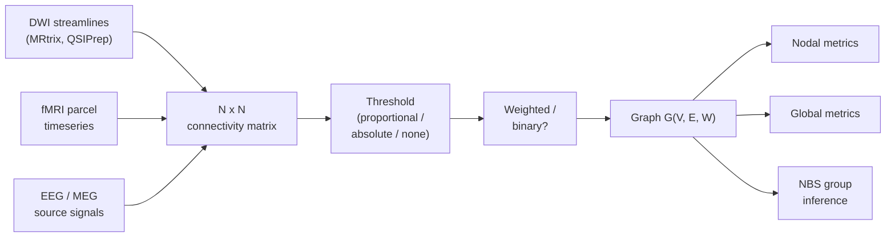

# Network metrics — graph theory for brain connectomes

> From a connectivity matrix to a defensible group-level claim: nodal, edge, and global metrics, the null-model machinery, and NBS for inference.

Course map: why graph theory → building the matrix → nodal metrics (with node strength) → edge-level inference (NBS) → global metrics → null models → a complete pipeline → disease applications → edge cases and frontiers → software → references → where to next.

## 1. Learning objectives

By the end of this page you should be able to:

- Build a connectivity matrix from DWI, fMRI, or EEG/MEG and explain which edge-weight convention you used.
- Compute node strength, betweenness, clustering, modularity, and a small-world index in [NetworkX](https://networkx.org) or [bctpy](https://github.com/aestrivex/bctpy).
- Run a [Network-Based Statistic (NBS)](https://www.nitrc.org/projects/nbs/) ([Zalesky 2010](https://doi.org/10.1016/j.neuroimage.2010.06.041)) for edge-wise group inference and explain why edge-wise FDR is usually weaker.
- Justify a parcellation choice (or a multi-resolution sensitivity analysis) for the metrics you report.
- Build a degree-preserving null and report metric z-scores instead of raw values.
- State the dominant pitfalls — parcellation-dependence, thresholding controversy, test-retest reliability — that reviewers will probe.

## 2. Why graph theory at all

A connectome is a square symmetric matrix: rows and columns are brain regions, entries are connection strengths. Graph theory turns that matrix into countable properties — "this node is a hub", "this network is modular", "this edge differs between groups". The metrics are the same whether the matrix came from DWI streamlines (see [diffusion.md](diffusion.md)), fMRI Pearson correlations (see [functional.md](functional.md) and [resting-state.md](resting-state.md)), or EEG/MEG phase-locking (see [eeg.md](eeg.md)).

The promise is **topology over geometry**: a 5 mm shift in a hub node matters more than a 5 mm shift in a peripheral node. The promise is real but conditional. Almost every graph metric depends on density, parcellation, and edge-weight convention, and many metrics are highly correlated with one another. A "modularity = 0.42" reported in isolation tells you nothing — you need a null model with matched degree distribution before the number means anything.

[Bullmore & Sporns 2009](https://doi.org/10.1038/nrn2575) is the canonical introductory review; [Rubinov & Sporns 2010](https://doi.org/10.1016/j.neuroimage.2009.10.003) is the metric-by-metric reference and ships as the [Brain Connectivity Toolbox (BCT)](https://www.nitrc.org/projects/bct/).

## 3. Building the connectivity matrix



### 3.1 By modality

- **DWI structural connectome.** `tck2connectome` over an atlas (Desikan-Killiany 84, Glasser 360, Schaefer-400 + Tian-S4 ~450, Lausanne family). Edge weight is streamline count, streamline density, [SIFT2-weighted](https://doi.org/10.1016/j.neuroimage.2015.06.092) streamline count, or mean FA along the bundle. See [diffusion.md §Connectomes](diffusion.md) for the load-bearing pipeline.
- **fMRI functional connectome.** Mean BOLD per parcel → Pearson, partial, or regularised inverse covariance ([Smith 2011](https://doi.org/10.1016/j.neuroimage.2010.08.063)). Apply Fisher z-transform before stats. See [functional.md](functional.md) and [resting-state.md](resting-state.md).
- **EEG / MEG functional connectome.** Source-project first, then use VC-resistant metrics (wPLI, PLI, imaginary coherence) — see [eeg.md §5](eeg.md#5-functional-connectivity-in-eeg). Don't use raw coherence on scalp data.

### 3.2 Thresholding — proportional vs absolute

Two conventions, both defensible, neither neutral:

- **Proportional**: keep the top $p\%$ of edges per subject. Equalises density across subjects.
- **Absolute**: keep edges above a fixed correlation / streamline-count threshold. Allows density itself to be a between-group variable.

[van den Heuvel 2017](https://doi.org/10.1016/j.neuroimage.2017.02.005) showed that proportional thresholding can introduce spurious group differences when patient groups have systematically weaker connections — you end up keeping noise edges in the weaker group to hit the density target. The current best practice is to **report at multiple thresholds (sensitivity analysis)** and be explicit about which convention you used.

### 3.3 Weighted vs binary

Binary networks $a_{ij} \in \{0,1\}$ have simpler metrics and stronger theory, but throw away most of the data. Weighted networks $w_{ij} \in \mathbb{R}_{\geq 0}$ preserve more information but require weight-distribution-matched null models. The honest default for FA / SIFT2 connectomes is weighted; the honest default for very sparse / noisy data is binary at a single chosen threshold.

### 3.4 Symmetric vs directed

Granger causality, DCM, and transfer entropy produce directed matrices. Pearson, partial correlation, streamline counts, and PLV/wPLI are inherently symmetric. Most graph-theoretic metrics in standard libraries assume symmetric (undirected) graphs; directed variants exist but require the directed-graph version of every metric (in-degree vs out-degree, directed modularity, etc.).

## 4. Nodal (per-node) metrics

The nodal metrics are how you say "this region is special." They split into **degree / strength** (how connected), **centrality** (how important for global routing), **clustering** (how locally cliquey), and **participation** (how cross-modular).

### 4.1 Degree and node strength

For a binary network, the degree of node $i$ is the number of edges it has:

$$
k_i \;=\; \sum_{j} a_{ij}, \qquad a_{ij} \in \{0, 1\}.
$$

For a weighted network, the weighted analogue is **node strength**:

$$
s_i \;=\; \sum_{j} w_{ij}, \qquad w_{ij} \in \mathbb{R}_{\geq 0}.
$$

Node strength is "how well-connected the region is, weighted by the strength of each connection." It is the single most-cited nodal metric in the brain-network literature because it has a direct biological interpretation (a hub has lots of strong connections), it is robust to threshold choice (no thresholding required), and it correlates with measures from completely different fields (energy consumption, gene expression, lesion-deficit predictability).

Typical interpretations on a Desikan-Killiany cortical FC matrix:

| Strength tier | Typical regions (DK / cortical FC) | Interpretation |
|---|---|---|
| **High** | Precuneus, superior parietal lobule, posterior cingulate, superior frontal | Cortical hub; integrative; part of the rich club |
| **Medium** | Inferior parietal, supramarginal, middle temporal, lateral occipital | Specialised but well-coupled |
| **Low** | Temporal pole, entorhinal, frontal pole, transverse temporal | Edge-of-network; often unstable across scans |

Disease relevance — **hub disruption** appears in almost every disorder studied:

- **Alzheimer's disease**: hubs of intrinsic FC overlap with regions of amyloid deposition and atrophy ([Buckner 2009](https://doi.org/10.1523/JNEUROSCI.5062-08.2009); [Crossley 2014](https://doi.org/10.1093/brain/awu132)).
- **Schizophrenia**: reduced rich-club strength and altered participation ([van den Heuvel 2013](https://doi.org/10.1001/jamapsychiatry.2013.1328)).
- **Temporal-lobe epilepsy**: ipsilateral hub reorganisation ([Bernhardt 2015](https://doi.org/10.1016/j.yebeh.2015.06.005)); cross-link to [clinical/epilepsy.md](../clinical/epilepsy.md).
- **Stroke**: lesion-network mapping of indirect disconnection ([Salvalaggio 2020](https://doi.org/10.1093/brain/awaa156)).

### 4.2 Centrality metrics

| Metric | Definition | Interpretation |
|---|---|---|
| **Betweenness centrality** $b_i$ | Fraction of all pairwise shortest paths that pass through node $i$ | "Bottleneck" / "broker" — routes traffic between otherwise distant nodes |
| **Closeness centrality** | Inverse of the mean shortest-path length from $i$ to all other nodes | Global accessibility — how quickly $i$ can reach the rest of the network |
| **Eigenvector centrality** | $i$ scores high if connected to other high-scoring nodes (recursive); equivalent to PageRank with a uniform damping | "Connected to the connected" — captures hub-of-hubs structure |
| **Local clustering coefficient** $C_i$ | Fraction of $i$'s neighbours that are connected to each other | Local segregation — high $C_i$ means $i$ sits in a tight cluster |
| **Participation coefficient** $P_i$ ([Guimerà & Amaral 2005](https://doi.org/10.1038/nature03288)) | $1 - \sum_m (k_{i,m} / k_i)^2$ summed over modules $m$ | Cross-module diversity — identifies **connector hubs** that bridge communities |

Connector hubs (high strength + high participation) and provincial hubs (high strength + low participation) play very different roles. Reporting strength without participation is the standard "easy result" that hides architecture.

## 5. Edge-level inference

Per-edge $t$-tests across a 400×400 connectome give 79,800 tests. Bonferroni / FDR are honest but lose almost all power for distributed effects. The standard fix is the **Network-Based Statistic (NBS)** ([Zalesky 2010](https://doi.org/10.1016/j.neuroimage.2010.06.041)), implemented in [Zalesky's NBS toolbox](https://www.nitrc.org/projects/nbs/) and in [bctpy](https://github.com/aestrivex/bctpy).

The algorithm:

1. Run an edge-wise $t$-test (or any statistic).
2. Threshold edges at a lenient cut (e.g., $t > 3$).
3. Find connected components in the suprathreshold subgraph.
4. Permute group labels many times and rebuild the null distribution of the **size of the largest component**.
5. Report any observed component whose size exceeds the 95th percentile of the null.

NBS exploits the same spatial / topological clustering that voxel-wise cluster correction exploits, but on the connectome. It is dramatically more sensitive than edge-wise FDR when the true effect is a sub-network, but says nothing about which individual edges are significant — only that the component as a whole is.

Alternatives: SPICE (spatially-pairwise associated component), the Sun et al. constrained NBS, and straight Benjamini-Hochberg FDR on edges. Cross-link to [multiple-comparisons.md](multiple-comparisons.md) for the broader correction landscape.

## 6. Global (whole-network) metrics

Global metrics summarise the whole graph as a few scalars. They are the most over-interpreted numbers in the field.

- **Characteristic path length** $L$ — average shortest-path length over all pairs of nodes. Lower $L$ means tighter global integration.
- **Global clustering coefficient** $C$ — average of $C_i$ across nodes. Higher $C$ means stronger local segregation.
- **Modularity** $Q$ ([Newman 2006](https://doi.org/10.1073/pnas.0601602103)) — quality of a community partition; how much intra-community edge weight exceeds the expectation under a degree-preserving null. Sensitive to the community-detection algorithm (Louvain, Leiden, Infomap); use consensus partitions and report the algorithm.
- **Small-worldness** ([Bassett & Bullmore 2006](https://doi.org/10.1177/1073858406293182)):

$$
\sigma \;=\; \frac{C / C_{\text{rand}}}{L / L_{\text{rand}}}.
$$

  Watts-Strogatz: a small-world has high local clustering but short path length, $\sigma \gg 1$. Almost every biological network is small-world; the metric is rarely diagnostic on its own ([resting-state.md graph-metrics table](resting-state.md#graph-metrics)).
- **Rich-club coefficient** ([Colizza 2006](https://doi.org/10.1038/nphys209); [van den Heuvel 2011](https://doi.org/10.1523/JNEUROSCI.3539-11.2011)) — propensity of high-degree nodes to interconnect more than expected under a degree-preserving null. The brain's rich club is the small set of high-strength hubs that carries most long-range traffic. Cross-link to the one-row summary in [resting-state.md graph-metrics](resting-state.md#graph-metrics) and the parcellation-dependence note in [diffusion.md §Connectome scaling](diffusion.md#connectome-scaling-parcellation-choice-and-edge-density-distortion).
- **Assortativity** — Pearson correlation between the degrees of connected node pairs. Positive means hubs connect to hubs; brain networks are generally weakly assortative or weakly disassortative depending on modality.

## 7. Null models — the half of the analysis that gets skipped

Almost every metric depends on density, degree distribution, and weight distribution. You cannot say "modularity = 0.4 is high" without a null model that fixes those low-level properties. Three nulls cover most uses:

- **Degree-preserving rewiring** ([Maslov & Sneppen 2002](https://doi.org/10.1126/science.1065103)). The standard null for binary networks. Repeatedly swap edge pairs $(a, b), (c, d) \to (a, d), (c, b)$ while preserving every node's degree. Implementations: `networkx.double_edge_swap`, `bct.randmio_und`. Run $\sim 10 \times E$ swaps.
- **Hirschberger-Qi-Steuer (HQS)**. A weighted-network null that preserves the empirical weight distribution. Useful when weights are heavy-tailed (FA, streamline counts).
- **Spatially-constrained null** ([BrainSMASH, Burt 2020](https://doi.org/10.1016/j.neuroimage.2020.117038); [BrainSpace](https://github.com/MICA-MNI/BrainSpace)). Preserves the spatial autocorrelation of brain maps. Required whenever you correlate a graph metric (or any brain map) with another brain map — gene expression, cortical thickness, receptor density. Without it, smooth maps spuriously correlate with everything.

Always report metric **z-scores** against the matched null, not raw values. A modularity of 0.4 with $z = 1.2$ vs the null is null-indistinguishable; a modularity of 0.4 with $z = 12$ is the actual finding.

## 8. A complete pipeline

```python
import networkx as nx
import numpy as np

# M is an N x N symmetric weighted connectome (FA, streamline density, or Fisher-z FC)
G = nx.from_numpy_array(M)

# --- nodal metrics
strength    = dict(G.degree(weight="weight"))                       # node strength
between     = nx.betweenness_centrality(G, weight="weight")
clustering  = nx.clustering(G, weight="weight")                     # per-node C_i
mean_C      = float(np.mean(list(clustering.values())))

# --- modularity via Louvain
communities = nx.community.louvain_communities(G, weight="weight", seed=0)
Q           = nx.community.modularity(G, communities, weight="weight")

# --- null model: degree-preserving rewiring (use BCT for weighted)
null_Q = []
for _ in range(500):
    H = nx.double_edge_swap(G.copy(), nswap=10 * G.number_of_edges(), max_tries=10**6)
    null_Q.append(nx.community.modularity(
        H, nx.community.louvain_communities(H, weight="weight", seed=0), weight="weight"))
Q_z = (Q - np.mean(null_Q)) / np.std(null_Q)
print(f"Modularity Q = {Q:.3f}, z vs null = {Q_z:.2f}")
```

For weighted-rewiring nulls (preserving the weight distribution as well as degree), use [bctpy](https://github.com/aestrivex/bctpy)'s `null_model_und_sign` — NetworkX's edge swap only preserves binary degree.

## 9. Disease applications

| Disorder | Network signature | Reference |
|---|---|---|
| **Alzheimer's disease** | Hub disruption; reduced strength in DMN cortical hubs; overlap with amyloid deposition | [Buckner 2009](https://doi.org/10.1523/JNEUROSCI.5062-08.2009); [Crossley 2014](https://doi.org/10.1093/brain/awu132) |
| **Schizophrenia** | Reduced rich-club coupling; altered modular structure | [van den Heuvel 2013](https://doi.org/10.1001/jamapsychiatry.2013.1328) |
| **Temporal-lobe epilepsy** | Increased path length; ipsilateral hub reorganisation; altered modularity | [Bernhardt 2015](https://doi.org/10.1016/j.yebeh.2015.06.005); cross-link [clinical/epilepsy.md](../clinical/epilepsy.md) |
| **Stroke** | Lesion-mapped indirect structural and functional disconnection | [Salvalaggio 2020](https://doi.org/10.1093/brain/awaa156) |
| **Autism spectrum** | Increased modularity in adolescence; altered long-range integration | [Rudie 2013](https://doi.org/10.1016/j.nicl.2012.10.006) |
| **Parkinson's disease** | Cortical-subcortical decoupling; cerebellar hub reorganisation | [Berman 2016](https://doi.org/10.1093/brain/aww148) |

## 10. Edge cases and frontiers

### 10.1 Parcellation dependence

The same tractogram routed through DK-84, Glasser-360, or Lausanne-1000 gives connectomes with mean edge densities differing by an order of magnitude — and a hub at DK resolution can fragment into several Lausanne-500 nodes and vanish from the rich club. See [diffusion.md §Connectome scaling](diffusion.md#connectome-scaling-parcellation-choice-and-edge-density-distortion). Either justify a single resolution against your hypothesis, or run a multi-resolution sensitivity analysis (the Lausanne family was built for this).

### 10.2 Edge-weight distribution

Streamline counts and FC weights are heavy-tailed. Many graph metrics assume something closer to Gaussian. Common fixes: log-transform weights, apply a proportional threshold, or use binary metrics at multiple densities. There is no universally correct choice — pre-register one and report sensitivity to the others.

### 10.3 Negative correlations in fMRI

GSR mathematically forces mean FC to zero and induces anti-correlations (see [functional.md edge cases](functional.md)). Three traditions: keep negatives (with signed metrics), drop them (binary positive-only graphs), or take absolute values. No consensus; document choice and run the analysis both ways for the headline result.

### 10.4 Graph neural networks as an alternative

GNNs sidestep the metric-choice problem by learning a representation directly from the graph ([Kim & Ye 2020](https://arxiv.org/abs/2007.05546)). They often *modestly* beat flat-vector baselines and demand much more code; the case for and against is laid out in [ai/gnn.md](../ai/gnn.md).

### 10.5 Test-retest reliability

Nodal strength on HCP retest data has ICC around 0.6 ([Andellini 2015](https://doi.org/10.1016/j.jneumeth.2015.05.020)); global modularity is often worse. Group-level metrics are stable enough for cross-sectional contrasts; individual-difference work needs ≥ 30 min of data per subject (see [resting-state.md sample-size](resting-state.md#sample-size)).

### 10.6 Edge-of-network nodes

Low-degree regions (temporal pole, frontal pole, entorhinal cortex) have unstable centrality and clustering across scans; either exclude them from per-node statistics or report with explicit caveats.

### 10.7 Multi-layer networks

Structural × functional layers, dynamic-FC time layers — proper multi-layer formalism is laid out in [Buldú & Porter 2018](https://doi.org/10.1088/2632-072X/aabb5d). Standard libraries don't ship multi-layer metrics; [muxViz](https://github.com/manlius/muxViz) and `pymnet` do.

### 10.8 Hypergraphs and higher-order interactions

Edges between *pairs* of nodes ignore triadic and higher-order interactions ([Battiston 2020](https://doi.org/10.1016/j.physrep.2020.05.004)). Hypergraph methods are emerging but not yet routine clinically.

### 10.9 Statistical treatment

Once you have per-subject metrics, the second-level analysis is a standard GLM — see [group-stats.md](group-stats.md). For longitudinal designs (test-retest, treatment, development), use mixed models per [longitudinal.md](longitudinal.md).

## 11. Software

- [Brain Connectivity Toolbox (BCT)](https://www.nitrc.org/projects/bct/) — [Rubinov & Sporns 2010](https://doi.org/10.1016/j.neuroimage.2009.10.003); the canonical MATLAB library for brain graph metrics. Every other library replicates BCT's conventions.
- [bctpy](https://github.com/aestrivex/bctpy) — Python port of BCT; same function names.
- [brainconn](https://github.com/FIU-Neuro/brainconn) — modern Python re-implementation; actively maintained.
- [NetworkX](https://networkx.org) — general-purpose Python graph library; not brain-specific but covers most metrics.
- [igraph](https://igraph.org) — fast C/Python/R graph library; what you reach for when NetworkX is too slow.
- [BrainSpace](https://github.com/MICA-MNI/BrainSpace) — gradient analysis and spatially-constrained nulls (spin tests, BrainSMASH).
- [NBS toolbox](https://www.nitrc.org/projects/nbs/) — Zalesky's NBS in MATLAB; the canonical implementation.
- [Connectome Mapping Toolkit (CMP3)](https://github.com/connectomicslab/connectomemapper3) — end-to-end DWI → multi-resolution Lausanne connectome pipeline.
- [neurolib](https://github.com/neurolib-dev/neurolib) and [The Virtual Brain (TVB)](https://www.thevirtualbrain.org/) — connectome-based whole-brain modelling.

## 12. References

1. Rubinov M, Sporns O. Complex network measures of brain connectivity: uses and interpretations. *NeuroImage.* 2010;52(3):1059-1069. [doi:10.1016/j.neuroimage.2009.10.003](https://doi.org/10.1016/j.neuroimage.2009.10.003)
2. Bullmore E, Sporns O. Complex brain networks: graph theoretical analysis of structural and functional systems. *Nat Rev Neurosci.* 2009;10:186-198. [doi:10.1038/nrn2575](https://doi.org/10.1038/nrn2575)
3. Bassett DS, Bullmore E. Small-world brain networks. *Neuroscientist.* 2006;12(6):512-523. [doi:10.1177/1073858406293182](https://doi.org/10.1177/1073858406293182)
4. Newman MEJ. Modularity and community structure in networks. *PNAS.* 2006;103(23):8577-8582. [doi:10.1073/pnas.0601602103](https://doi.org/10.1073/pnas.0601602103)
5. Zalesky A, Fornito A, Bullmore ET. Network-based statistic: identifying differences in brain networks. *NeuroImage.* 2010;53(4):1197-1207. [doi:10.1016/j.neuroimage.2010.06.041](https://doi.org/10.1016/j.neuroimage.2010.06.041)
6. van den Heuvel MP, Sporns O. Rich-club organization of the human connectome. *J Neurosci.* 2011;31(44):15775-15786. [doi:10.1523/JNEUROSCI.3539-11.2011](https://doi.org/10.1523/JNEUROSCI.3539-11.2011)
7. Buckner RL, Sepulcre J, Talukdar T, et al. Cortical hubs revealed by intrinsic functional connectivity. *J Neurosci.* 2009;29(6):1860-1873. [doi:10.1523/JNEUROSCI.5062-08.2009](https://doi.org/10.1523/JNEUROSCI.5062-08.2009)
8. van den Heuvel MP, Sporns O, Collin G, et al. Abnormal rich-club organization and functional brain dynamics in schizophrenia. *JAMA Psychiatry.* 2013;70(8):783-792. [doi:10.1001/jamapsychiatry.2013.1328](https://doi.org/10.1001/jamapsychiatry.2013.1328)
9. Bernhardt BC, Bonilha L, Gross DW. Network analysis for a network disorder: the emerging role of graph theory in the study of epilepsy. *Epilepsy Behav.* 2015;50:162-170. [doi:10.1016/j.yebeh.2015.06.005](https://doi.org/10.1016/j.yebeh.2015.06.005)
10. Maslov S, Sneppen K. Specificity and stability in topology of protein networks. *Science.* 2002;296(5569):910-913. [doi:10.1126/science.1065103](https://doi.org/10.1126/science.1065103)
11. Burt JB, Helmer M, Shinn M, Anticevic A, Murray JD. Generative modeling of brain maps with spatial autocorrelation. *NeuroImage.* 2020;220:117038. [doi:10.1016/j.neuroimage.2020.117038](https://doi.org/10.1016/j.neuroimage.2020.117038)
12. van den Heuvel MP, de Lange SC, Zalesky A, Seguin C, Yeo BTT, Schmidt R. Proportional thresholding in resting-state functional connectivity networks. *NeuroImage.* 2017;152:437-449. [doi:10.1016/j.neuroimage.2017.02.005](https://doi.org/10.1016/j.neuroimage.2017.02.005)
13. Guimerà R, Amaral LAN. Functional cartography of complex metabolic networks. *Nature.* 2005;433(7028):895-900. [doi:10.1038/nature03288](https://doi.org/10.1038/nature03288)
14. Crossley NA, Mechelli A, Scott J, et al. The hubs of the human connectome are generally implicated in the anatomy of brain disorders. *Brain.* 2014;137(8):2382-2395. [doi:10.1093/brain/awu132](https://doi.org/10.1093/brain/awu132)
15. Salvalaggio A, De Filippo De Grazia M, Zorzi M, Thiebaut de Schotten M, Corbetta M. Post-stroke deficit prediction from lesion and indirect structural and functional disconnection. *Brain.* 2020;143(7):2173-2188. [doi:10.1093/brain/awaa156](https://doi.org/10.1093/brain/awaa156)
16. Andellini M, Cannatà V, Gazzellini S, Bernardi B, Napolitano A. Test-retest reliability of graph metrics of resting state MRI functional brain networks. *J Neurosci Methods.* 2015;253:183-192. [doi:10.1016/j.jneumeth.2015.05.020](https://doi.org/10.1016/j.jneumeth.2015.05.020)
17. Kim BH, Ye JC. Understanding graph isomorphism network for rs-fMRI functional connectivity analysis. *Front Neurosci.* 2020;14:630. [arXiv:2007.05546](https://arxiv.org/abs/2007.05546)
18. Buldú JM, Porter MA. Frequency-based brain networks. *J Phys Complex.* 2018;1:015002. [doi:10.1088/2632-072X/aabb5d](https://doi.org/10.1088/2632-072X/aabb5d)
19. Battiston F, Cencetti G, Iacopini I, et al. Networks beyond pairwise interactions. *Phys Rep.* 2020;874:1-92. [doi:10.1016/j.physrep.2020.05.004](https://doi.org/10.1016/j.physrep.2020.05.004)

## 13. Where to next

- [diffusion.md](diffusion.md) — building the DWI connectome whose metrics you compute here.
- [resting-state.md](resting-state.md) — FC matrices and the graph-metric table that this page extends.
- [eeg.md §5](eeg.md#5-functional-connectivity-in-eeg) — connectivity in the presence of volume conduction.
- [ai/gnn.md](../ai/gnn.md) — graph neural networks as an alternative to hand-engineered metrics.
- [group-stats.md](group-stats.md) and [multiple-comparisons.md](multiple-comparisons.md) — once you have per-subject metrics.
- [asymmetry.md](asymmetry.md) — left–right network differences and the AI machinery.
