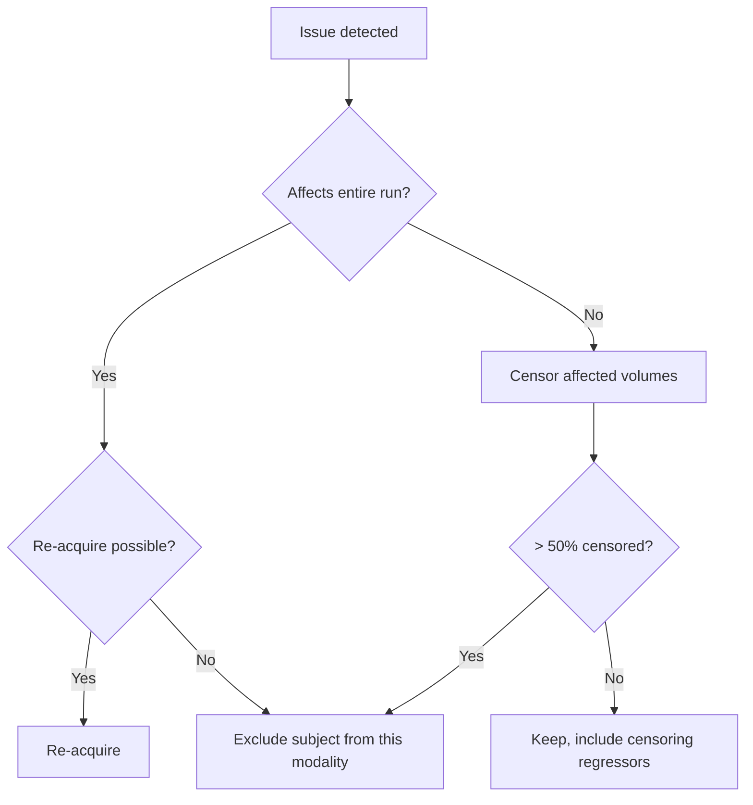

# Quality control and outlier detection

> Garbage in, garbage out — but most QC failures are subtle, and the obvious ones still go undetected in publication. Build the pipeline that catches both.

QC sits between preprocessing and inference. It is unglamorous, time-consuming, and the single highest-leverage thing you can do for reproducibility. A clean cohort with n=40 beats a noisy one with n=120 every time.

This page assumes you've already preprocessed with [fMRIPrep, QSIPrep, or equivalent](../landmark/pipelines.md). If you haven't, start there.

## Structural QC

The shortlist of things that break structural analyses:

- **Motion** — visible blurring at white-matter/gray-matter boundaries.
- **Ghosting** — Nyquist (N/2) ghosts from EPI bleed-through or hardware issues.
- **Intensity non-uniformity** — bias field from coil sensitivity; corrects with N4 but heavy bias breaks FreeSurfer.
- **Truncation** — top of head or cerebellum cropped.
- **FreeSurfer `recon-all` errors** — pial/white surface misplacements, skull-strip failures, topology fixes that destroyed real anatomy.

### MRIQC and the image quality metrics

[MRIQC](https://mriqc.readthedocs.io) [Esteban et al., 2017](https://doi.org/10.1371/journal.pone.0184661)[^mriqc] computes per-subject Image Quality Metrics (IQMs):

| Metric | What it measures | T1w threshold (rule of thumb) |
| --- | --- | --- |
| **CNR** | Contrast-to-noise between GM and WM | > 2.5 |
| **SNR** | Within-WM signal-to-noise | > 12 |
| **EFC** | Entropy-focus criterion (motion blur) | < 0.6 |
| **FBER** | Foreground-to-background energy ratio | > 3000 |
| **CJV** | Coefficient of joint variation (intensity uniformity) | < 0.6 |

Use MRIQC's group report; the IQMs are most useful as *outliers within your cohort*, not against absolute thresholds.

### FreeSurfer QC

`recon-all` finishes silently even when it's wrong. Always inspect:

- `aparc+aseg.mgz` overlaid on `T1.mgz` — check pial surface follows GM/CSF, white surface follows GM/WM.
- The `?h.aparc.stats` table — cortical thickness > 4 mm or < 1.5 mm in any region is suspicious.
- `recon-all.log` for `topology defect` warnings.

For paediatric or lesion data, prefer `recon-all-clinical` [Iglesias et al., 2023](https://doi.org/10.1016/j.media.2023.102910)[^recall] — it tolerates 0.5-3 mm scans and is robust to white-matter hyperintensities.

## fMRI QC

The four numbers that decide whether a BOLD run is usable.

### Framewise displacement (FD) [Power et al., 2012](https://doi.org/10.1016/j.neuroimage.2011.10.018)[^power]

$$
\text{FD}_i = |\Delta d_{x,i}| + |\Delta d_{y,i}| + |\Delta d_{z,i}| + 50 \cdot (|\Delta \alpha_i| + |\Delta \beta_i| + |\Delta \gamma_i|)
$$

Translations + rotations (converted to arc length on a 50 mm sphere). Thresholds people actually use:

- **Strict** (resting-state in adults): FD < 0.2 mm, exclude scans with > 20% censored volumes.
- **Lenient** (paediatric, clinical): FD < 0.5 mm, > 50% censored is the cutoff.
- **Mean FD** as a group-level regressor — non-negotiable for any cross-sectional comparison.

### DVARS

Root-mean-square change in BOLD intensity from volume to volume. Co-spikes with FD when motion happens; spikes alone usually indicate scanner artefact (RF, gradient instability).

### tSNR

$$
\text{tSNR}(v) = \frac{\bar{y}(v)}{\sigma_y(v)}
$$

per voxel after detrending. Whole-brain median tSNR < 50 on 3T is a warning; < 30 is unusable for most analyses. Drops in tSNR localised to one slice point at a coil-element failure.

### Carpet (grayplot) [Power 2017](https://doi.org/10.1016/j.neuroimage.2016.08.009)[^carpet]

The single most diagnostic plot for fMRI. One row per voxel (ordered: GM, WM, CSF), one column per timepoint, intensity-normalised. Motion shows as vertical stripes; physiology as horizontal banding; coil glitches as discrete bright rectangles.

```python
import numpy as np, matplotlib.pyplot as plt
from nilearn.image import load_img, math_img
from nilearn.maskers import NiftiMasker

bold = "sub-01_task-rest_desc-preproc_bold.nii.gz"
gm = "sub-01_label-GM_mask.nii.gz"
wm = "sub-01_label-WM_mask.nii.gz"
csf = "sub-01_label-CSF_mask.nii.gz"

def grab(mask):
    return NiftiMasker(mask_img=mask, standardize="zscore_sample").fit_transform(bold).T

stack = np.vstack([grab(gm), grab(wm), grab(csf)])
splits = [grab(gm).shape[0], grab(gm).shape[0] + grab(wm).shape[0]]

fig, ax = plt.subplots(figsize=(10, 6))
ax.imshow(stack, aspect="auto", cmap="gray", vmin=-2, vmax=2, interpolation="nearest")
for s in splits:
    ax.axhline(s, color="red", lw=0.5)
ax.set(xlabel="time (TR)", ylabel="voxels (GM | WM | CSF)")
plt.tight_layout(); plt.savefig("carpet.png", dpi=150)
```

What to look for: a clean carpet has uniform speckle. A bad carpet has obvious global stripes, drift bands, or "vertical comets" coincident with motion spikes.

## DWI QC

Diffusion data fails in ways structural and fMRI data do not.

- **bvec / bval mismatch** — eyeball that the number of vectors equals the number of volumes, and the b=0 volumes line up where you expect.
- **Eddy-current residuals** — `eddy` writes `*_eddy_corrected.eddy_residuals.nii.gz`; bright bands or signal pile-up at the brain edge mean correction failed.
- **Slicewise outliers** — `eddy_outlier_report` flags individual slices with > 4σ deviation. > 5% of slices flagged is a problem; > 10% means re-acquire.
- **Tensor sanity check** — FA in the genu of the corpus callosum should be ~0.7-0.8; if it's 0.3, your tensor fit is wrong or your gradients are mis-specified.

QSIPrep emits a per-subject HTML report with all of the above; read it before merging cohorts.

## Surface and registration QC

- **Cortical-thickness outliers** — z-score each subject's regional thickness against the cohort. Anything > 3σ from the mean in > 3 regions is worth inspecting.
- **Alignment scoring** — overlay the BOLD-to-T1 boundary on the GM/WM interface; manually score 1-5.
- **Visual checklist** — `fmriprep`'s reports include co-registration animations. Open every single one. Yes, every one.

A simple Z-score outlier function:

```python
import pandas as pd
df = pd.read_csv("group_thickness.csv")  # rows=subj, cols=regions
z = (df - df.mean()) / df.std(ddof=1)
flagged = (z.abs() > 3).sum(axis=1)
print(flagged[flagged > 3].sort_values(ascending=False))
```

## When to exclude vs censor vs re-acquire

The decision tree most labs converge on:



Hard rules:

- **Censoring during preprocessing > exclusion after**: scrubbing motion spikes with `nilearn`'s `clean_img` or fMRIPrep's confound TSV is fine for resting-state.
- **Re-acquisition only helps if you catch it during the session.** Build a real-time QC dashboard if you can.
- **Document the decision per subject.** A `qc_decisions.csv` with `subject, modality, status, reason` is non-optional for any paper.

## Tools by modality

| Tool | What it covers | When to use |
| --- | --- | --- |
| **MRIQC** | T1w, T2w, BOLD IQMs + group reports | First pass on every dataset |
| **fMRIPrep reports** | Coreg, confound time series, carpet plots | Mandatory walk-through per subject |
| **eddy QC / `eddy_quad`** | DWI slicewise + volume outliers | Always for DWI |
| **`recon-all-clinical`** | FreeSurfer on low-res / clinical scans | When stock recon-all fails |
| **Custom dashboards** | Cohort-level outlier views | Anything > 50 subjects; build it in `streamlit` or `dash` |

## Inter-rater reliability

If you score QC manually, two raters scoring 20 subjects in common is the minimum for reporting. Compute Cohen's κ or ICC(3,1) for ordinal ratings:

```python
from sklearn.metrics import cohen_kappa_score
print(cohen_kappa_score(rater1, rater2, weights="quadratic"))
```

A κ < 0.6 means your rubric is too vague; rewrite the criteria with explicit visual examples before you continue.

## Build a QC log, not a QC moment

The single biggest improvement a lab can make: every dataset gets a row in a structured `qc_log.csv` (or SQLite, or a Datalad-tracked spreadsheet), with rater, date, decisions, and links to the visualisation. This is the artefact that lets a reviewer reproduce your sample.

!!! tip "Beginner takeaway"
    Five things to look at first:

    1. **Mean FD** per BOLD run — exclude or censor > 0.5 mm.
    2. **Carpet plot** — vertical stripes mean motion; rectangles mean scanner glitch.
    3. **FreeSurfer pial surface** overlaid on T1 — is it on the GM/CSF boundary?
    4. **BOLD-to-T1 alignment animation** in the fMRIPrep report.
    5. **DWI tensor FA** in the corpus callosum genu — should be ~0.7.

## References

[^mriqc]: Esteban O, Birman D, Schaer M, et al. MRIQC: advancing the automatic prediction of image quality in MRI from unseen sites. *PLoS One.* 2017;12(9):e0184661. [doi:10.1371/journal.pone.0184661](https://doi.org/10.1371/journal.pone.0184661)
[^recall]: Iglesias JE, Billot B, Balbastre Y, et al. SynthSR / recon-all-clinical: a robust framework for clinical-resolution MRI. *Med Image Anal.* 2023;86:102910. [doi:10.1016/j.media.2023.102910](https://doi.org/10.1016/j.media.2023.102910)
[^power]: Power JD, Barnes KA, Snyder AZ, Schlaggar BL, Petersen SE. Spurious but systematic correlations in functional connectivity MRI networks arise from subject motion. *NeuroImage.* 2012;59(3):2142-2154. [doi:10.1016/j.neuroimage.2011.10.018](https://doi.org/10.1016/j.neuroimage.2011.10.018)
[^carpet]: Power JD. A simple but useful way to assess fMRI scan qualities. *NeuroImage.* 2017;154:150-158. [doi:10.1016/j.neuroimage.2016.08.009](https://doi.org/10.1016/j.neuroimage.2016.08.009)

1. **Esteban O, Markiewicz CJ, Blair RW, et al.** fMRIPrep: a robust preprocessing pipeline for functional MRI. *Nat Methods.* 2019;16(1):111-116. [doi:10.1038/s41592-018-0235-4](https://doi.org/10.1038/s41592-018-0235-4)
2. **Andersson JLR, Sotiropoulos SN.** An integrated approach to correction for off-resonance effects and subject movement in diffusion MR imaging. *NeuroImage.* 2016;125:1063-1078. [doi:10.1016/j.neuroimage.2015.10.019](https://doi.org/10.1016/j.neuroimage.2015.10.019)
3. **Satterthwaite TD, Wolf DH, Loughead J, et al.** Impact of in-scanner head motion on functional connectivity. *NeuroImage.* 2012;60(1):623-632. [doi:10.1016/j.neuroimage.2011.12.063](https://doi.org/10.1016/j.neuroimage.2011.12.063)
4. **Parkes L, Fulcher B, Yücel M, Fornito A.** An evaluation of the efficacy, reliability, and sensitivity of motion correction strategies for resting-state functional MRI. *NeuroImage.* 2018;171:415-436. [doi:10.1016/j.neuroimage.2017.12.073](https://doi.org/10.1016/j.neuroimage.2017.12.073)

## Where to next

[Resting-state connectivity in practice](resting-state.md) — once the data is QC'd, what do you actually compute?
