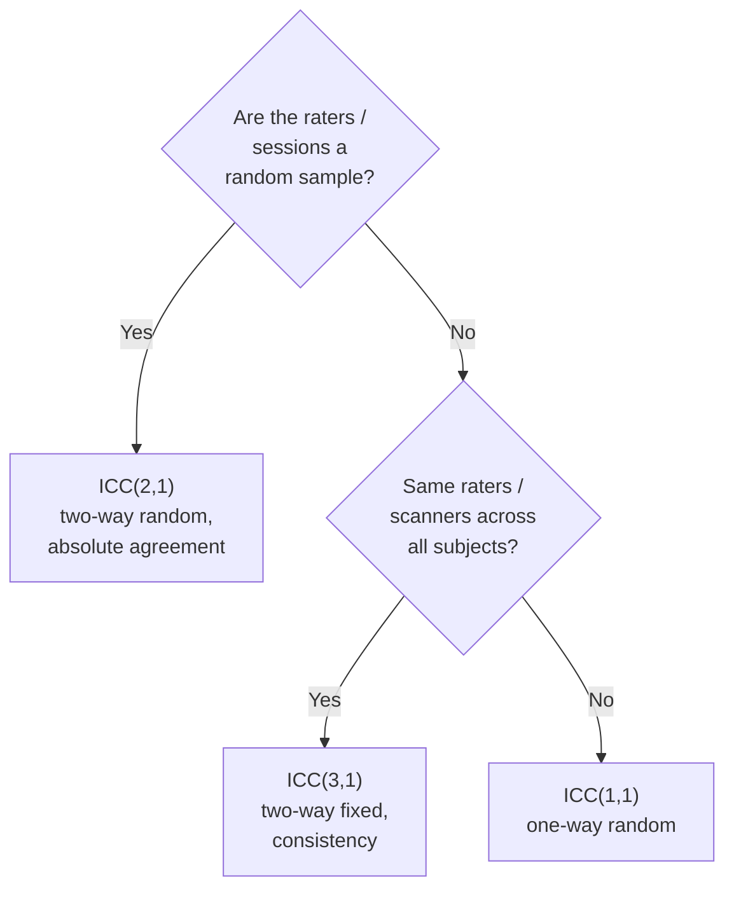

# Reliability, reproducibility, and the BWAS reckoning

> Why your effect size estimate from N=30 won't hold up — and how to design / report studies that survive replication.

Course map: reliability vs reproducibility vs validity → the ICC → test-retest in practice → the BWAS reckoning (Marek 2022) → bootstrap / cross-validation / conformal → pre-registration and open data → reporting standards → specialist pitfalls → references → where to next.

## 1. Learning objectives

By the end of this page you should be able to:

- Distinguish reliability, reproducibility, replicability, and validity, and say which one you're claiming in any given paper.
- Compute and interpret ICC(1,1), ICC(2,1), and ICC(3,1) with the right model for your design.
- Quote ballpark ICCs for cortical thickness, functional-connectivity edges, DWI FA, and ERP amplitude — and explain why FC edge ICC is the field's open problem.
- Articulate the Marek 2022 BWAS finding and what it implies for single-site cohorts.
- Build bootstrap CIs, leak-free cross-validation, and conformal prediction intervals around any metric.
- Cite the reporting standards (COBIDAS, TRIPOD+AI, CLAIM) that journals and regulators now expect.

## 2. Three terms that aren't the same

The vocabulary is the single most-misused thing in the open-science literature; pin it down before anything else.

| Term | Definition | Example failure |
|---|---|---|
| **Reliability** | Within-subject consistency — does the same scan today and next month give the same answer? | Cortical thickness has ICC ≈ 0.9 (excellent); a single resting-state FC edge has ICC ≈ 0.3 (poor) |
| **Reproducibility** | Can a different team reproduce your result from *your* data and *your* code? | A pipeline that won't re-build in someone else's container |
| **Replicability** | Does the effect hold in a *new* sample? | A brain-behaviour correlation of $r = 0.5$ at N = 30 that drops to $r = 0.05$ at N = 3000 |
| **Validity** | Does the measure track what it claims to track? | High-ICC fMRI activation in a region that has no causal role in the task |

The [NASEM 2019 *Reproducibility and Replicability in Science*](https://www.nationalacademies.org/our-work/reproducibility-and-replicability-in-science) report is the canonical reference for this taxonomy and the one to cite in any methods or discussion section that uses these words. The core point: **high reliability does not imply replicable findings, and replicable findings can still be invalid.**

## 3. The Intraclass Correlation Coefficient (ICC)

The single most-used reliability statistic. The classical Shrout-Fleiss formulation ([Shrout & Fleiss 1979](https://doi.org/10.1037/0033-2909.86.2.420); revisited by [McGraw & Wong 1996](https://doi.org/10.1037/1082-989X.1.1.30)) for a single rater / scan:

$$
\text{ICC}(2,1) \;=\; \frac{\sigma^2_{\text{subj}}}{\sigma^2_{\text{subj}} \;+\; \sigma^2_{\text{rater}} \;+\; \sigma^2_{\text{err}}}.
$$

The numerator is the between-subject variance you care about; the denominator is everything. ICC asks: of all the variance you see in the measurement, what fraction is real subject-to-subject differences versus measurement noise?

### 3.1 Which ICC variant?



- **ICC(1,1)** — one-way random; each subject rated by a *different* set of raters / scanners. Multi-site cohorts.
- **ICC(2,1)** — two-way random, absolute agreement; same raters / scanners on every subject and you care about absolute values. The standard for test-retest with a single scanner.
- **ICC(3,1)** — two-way mixed, consistency; same raters / scanners, you only care that *rankings* are preserved, not absolute values. The right choice if you'll later z-score within scanner.

Rule of thumb interpretation ([Cicchetti 1994](https://doi.org/10.1037/1040-3590.6.4.284)):

| ICC | Interpretation |
|---|---|
| < 0.40 | Poor |
| 0.40 – 0.59 | Fair |
| 0.60 – 0.74 | Good |
| ≥ 0.75 | Excellent |

### 3.2 Typical neuroimaging ICCs

| Measure | Typical ICC | Source |
|---|---|---|
| Cortical thickness (FreeSurfer) | 0.85 – 0.95 | [Madan & Kensinger 2017](https://doi.org/10.1016/j.bandc.2017.02.006) |
| Subcortical volumes | 0.80 – 0.95 | structural pipelines |
| DWI FA (tract-averaged) | 0.80 – 0.90 | [Vollmar 2010](https://doi.org/10.1016/j.neuroimage.2010.02.043) |
| Functional-connectivity edge | **0.20 – 0.40** | [Noble 2019](https://doi.org/10.1016/j.neuroimage.2019.116157) |
| Task-evoked fMRI activation | 0.40 – 0.50 | [Bennett & Miller 2010](https://doi.org/10.1111/j.1749-6632.2010.05446.x) |
| EEG ERP amplitude | 0.50 – 0.80 | [Cassidy 2012](https://doi.org/10.1111/j.1469-8986.2011.01284.x) |
| EEG resting power (eyes-closed alpha) | 0.80 – 0.90 | EEG canon |

Functional-connectivity edge ICC is **the field's open problem.** A single edge between two regions is reliable to about $r = 0.3$ across sessions — well below "fair." Aggregating to network-level metrics helps somewhat (ICC ≈ 0.5–0.7 for global graph metrics) but does not magically rescue per-edge analyses. See [network-metrics.md §10.5](network-metrics.md#105-test-retest-reliability) for the connectome-specific picture.

## 4. Test-retest design in practice

A defensible reliability study has more design than you'd think.

**Interval.** Same-day captures pure measurement noise; one-week captures short-term physiological state plus measurement; one-month plus captures slow physiology and learning; one-year plus is no longer test-retest, it's longitudinal. Match the interval to what you want to *call* the construct stable over.

**Sample size.** For tight CIs on an ICC estimate, $N \geq 30$ subjects with at least two sessions each. Smaller cohorts give ICC point estimates with confidence intervals so wide they're nearly uninformative.

**Canonical cohorts.**

- **HCP Retest** — 45 subjects from the HCP Young Adult dataset scanned twice. The standard benchmark for resting-state and task-fMRI reliability.
- **Midnight Scan Club** — 10 subjects with > 5 hours of fMRI each, designed for individual-differences work where per-subject precision matters more than cohort size.
- **TestRetestReliability** OpenNeuro collections — multiple modality-specific test-retest datasets.

**Generalisability theory** ([Cronbach 1972](https://doi.org/10.1007/BF02289341)) extends ICC to decompose variance across multiple facets (sessions, raters, parcellations, days) simultaneously. Useful when you want to know not just "is it reliable" but "what's the dominant source of unreliability."

**Pipeline overview.** Scan each subject twice → preprocess identically → extract the metric → compute split-half and between-session correlations → fit the appropriate ICC model in [pingouin](https://pingouin-stats.org/) or R's `irr` / `psych`.

```python
import pingouin as pg
import pandas as pd

# Long-format dataframe: cols = subject, session, value
icc = pg.intraclass_corr(
    data=df, targets="subject", raters="session", ratings="value"
)
print(icc.loc[icc["Type"] == "ICC2", ["ICC", "CI95%", "F", "pval"]])
```

`pg.intraclass_corr` returns all six Shrout-Fleiss variants in one table; pick the row that matches your design from §3.1.

## 5. The BWAS reckoning — Marek 2022

The single most consequential reliability paper of the past decade.

**Reference**: [Marek S, Tervo-Clemmens B, Calabro FJ, et al. Reproducible brain-wide association studies require thousands of individuals. *Nature.* 2022;603:654-660.](https://doi.org/10.1038/s41586-022-04492-w)

**Setup.** Brain-Wide Association Studies (BWAS) correlate a brain measure (FC edge, cortical thickness, voxel activation) with a behavioural / phenotypic variable (IQ, psychopathology score, age). The authors leveraged the three largest cohorts available — **ABCD** ($N \approx 11{,}000$), **UK Biobank** ($N \approx 40{,}000$), and **HCP Young Adult** ($N \approx 1{,}200$) — to ask: at what $N$ does the BWAS effect-size estimate stabilise?

**Key findings.**

- True brain-behaviour effect sizes are **tiny**: median $|r| \approx 0.01$–$0.10$ for FC-behaviour and structure-behaviour associations, depending on the behaviour and how it's measured.
- Single-site cohorts of $N < 1{,}000$ produce **inflated** effect-size estimates with very wide CIs. A reported $r = 0.4$ at $N = 50$ is much more likely to be sampling noise than a true large effect.
- To reliably detect and replicate an effect of true size $r = 0.1$ at $\alpha = 0.05$ with 80% power, $N \approx 1{,}500$ is needed; for $r = 0.05$, well over $N = 5{,}000$.
- Most of the existing BWAS literature is correspondingly under-powered, and the published large-effect-size claims are mostly winners-curse inflation.

**Implications for everyone.**

- Single-study claims of large brain-behaviour associations should be **presumed inflated** until replicated in a larger cohort.
- Effect-size **meta-analysis** is now obligatory for any clinical-translation claim — cross-link to [meta-analysis.md](meta-analysis.md).
- **Within-subject designs** (task vs rest, pre vs post intervention) extract higher power per $N$ than between-subject designs because they cancel the dominant inter-subject variance. Where the question allows it, prefer within-subject.
- **Pooled mega-cohorts** (ABCD, UK Biobank, ENIGMA) are now where headline BWAS findings should live; single-site cohorts are for hypothesis generation and mechanism, not for effect-size estimation.

The Marek paper has been the basis for a wave of preregistered, large-N replication efforts — and for the rise of pooled-image consortia like ENIGMA that put thousands of subjects behind any single analysis.

## 6. Bootstrap, cross-validation, and conformal prediction

Three techniques that put honest uncertainty on any metric without leaning on parametric assumptions.

**Bootstrap CI on a metric.** Resample subjects with replacement, recompute the metric, repeat $B = 1000$+ times; report the 2.5 / 97.5 percentiles as a 95% CI. Works for any computable statistic — Cohen's $d$, an ICC, a connectome metric, an AUC.

```python
import numpy as np
rng = np.random.default_rng(0)
boot = np.array([
    metric(x[rng.integers(0, len(x), size=len(x))]) for _ in range(2000)
])
ci_low, ci_high = np.percentile(boot, [2.5, 97.5])
```

**Cross-validation for prediction.** Split-half, $k$-fold, leave-one-subject-out. **Never leak across subjects** — that means split *by subject* (`GroupKFold` keyed on subject ID), and for longitudinal data, all of a subject's sessions go in one fold. The exact same point is made on the AI side in [ai/evaluation.md §1](../ai/evaluation.md), which goes deeper on data-leakage failure modes.

**Conformal prediction.** Model-agnostic prediction intervals with frequentist coverage guarantees ([Angelopoulos & Bates 2023](https://doi.org/10.48550/arXiv.2107.07511)). Given any black-box predictor and a held-out calibration set, conformal returns intervals that contain the true value at least $(1 - \alpha)$ fraction of the time — under exchangeability, regardless of model class. The right tool for deploying a predictor with honest uncertainty. Cross-link to [ai/uncertainty.md](../ai/uncertainty.md).

**Permutation tests** for null distributions on group statistics — see [multiple-comparisons.md](multiple-comparisons.md) and [group-stats.md](group-stats.md).

## 7. Pre-registration and open data

The most powerful single change you can make to a study's replicability is to commit to its design *before* you see the data.

- **[OSF](https://osf.io)** — the open-science platform. Pre-register hypothesis, design, sample size, exclusion criteria, primary analysis, ROIs / masks, statistical test, and decision rule. Time-stamped, citable.
- **[AsPredicted](https://aspredicted.org)** — lightweight 9-question pre-registration template; useful for behavioural and pilot work.
- **Registered Reports** ([Chambers 2013](https://doi.org/10.1016/j.cortex.2012.12.016)) — stage-1 review of the design before data collection; provisional acceptance contingent on executing the plan. Eliminates p-hacking and HARKing. Many neuroimaging journals (Cortex, NeuroImage, eLife) now offer this format.
- **What to pre-register**: hypothesis, sample size with power calculation, exclusion criteria, primary outcome measure, statistical model, multiple-comparisons plan, decision rule, planned sensitivity analyses.

**Open data.**

- **[OpenNeuro](https://openneuro.org)** for raw scans in BIDS. Cross-link to [bids/index.md](../bids/index.md).
- **[NeuroVault](https://neurovault.org)** for unthresholded derivative statistical maps. Cross-link to [meta-analysis.md](meta-analysis.md).
- **[Zenodo](https://zenodo.org)** for citable, DOI-tagged code releases.

**Open code.** A `pip install`-able package, a containerised pipeline ([BIDS App](https://bids-apps.neuroimaging.io/) or [Docker / Singularity](../computing/index.md)), and a Zenodo DOI for the analysis snapshot used in the paper.

## 8. Reporting standards

Different journals and regulators expect different checklists; the modern field uses several.

| Standard | Domain | Reference |
|---|---|---|
| **COBIDAS (fMRI)** | Best practices for fMRI data analysis and sharing | [Nichols 2017](https://doi.org/10.1038/nn.4500) |
| **COBIDAS MEEG** | OHBM committee recommendations for EEG / MEG | [Pernet 2020](https://doi.org/10.1038/s41593-020-00709-0) |
| **PRISMA 2020** | Systematic reviews and meta-analyses | [Page 2021](https://doi.org/10.1136/bmj.n71) |
| **TRIPOD+AI** | Multivariable prediction models including AI | [Collins 2024](https://doi.org/10.1136/bmj-2023-078378) |
| **CLAIM** | Clinical AI in radiology | [Mongan 2020](https://doi.org/10.1148/ryai.2020200029) |
| **FAIR** principles | Findable, Accessible, Interoperable, Reusable data | [Wilkinson 2016](https://doi.org/10.1038/sdata.2016.18) |

For the regulatory implications of TRIPOD+AI and CLAIM, cross-link to [ai/regulatory.md](../ai/regulatory.md); for the AI-side evaluation framework see [ai/evaluation.md](../ai/evaluation.md).

## 9. Specialist pitfalls

**High ICC ≠ valid.** A measure can be reliably wrong. Cortical thickness has ICC ≈ 0.9 in every modern pipeline — including in regions where the absolute values from FreeSurfer and ANTs differ by 20%. Pick the right measure first, *then* check that it's reliable.

**Aggregating unreliable metrics doesn't fix unreliability.** Averaging FC edges with ICC 0.2 each into a network metric does **not** automatically give you ICC 0.9. The exact gain depends on between-edge correlations and is often modest; for genuinely independent edges with shared noise structure, the network metric can be *less* reliable than the most reliable edge. Compute the network-metric ICC empirically, don't assume it.

**Reliability of a difference score is always lower than either component.** This is the most important formula no one teaches:

$$
\text{ICC}(L - R) \;=\; \frac{\sigma_L^2 \, \text{ICC}_L \;+\; \sigma_R^2 \, \text{ICC}_R \;-\; 2 \sigma_L \sigma_R r_{LR} \, r_{xx}}{\sigma_L^2 \;+\; \sigma_R^2 \;-\; 2 \sigma_L \sigma_R r_{LR}}
$$

When $L$ and $R$ are positively correlated and similarly reliable (e.g., left vs right hippocampal volume), the difference-score ICC can drop dramatically. This is why pre-vs-post change scores and laterality indices need much larger $N$ for the same precision — cross-link to [longitudinal.md](longitudinal.md) for the longitudinal version and to [asymmetry.md](asymmetry.md) for the laterality version.

**Selection bias in published replication studies.** Effects that didn't replicate often don't get reported. Take published replication rates with a grain of salt; the literature on which effects "fail to replicate" is itself subject to publication bias.

**Confusing reliability with validity in clinical translation.** A biomarker that's reliable in a test-retest cohort can still fail at predicting clinical outcome. Validity requires linking the measure to a clinical reference standard, not just to itself across sessions.

**Site as a noise source.** Multi-site reliability is dramatically worse than within-site. Run ComBat (see [tools/index.md](../tools/index.md#harmonization)) before computing cross-site ICCs; otherwise the site effect dominates and the ICC is uninterpretable.

**QC affects ICC.** Excluding motion-contaminated sessions raises the apparent ICC because you've removed the most-variable timepoints. Report ICCs **before and after** QC exclusion; only the pre-exclusion number is honest about your measurement system. Cross-link to [qc.md](qc.md) for the QC machinery.

## 10. References

1. Marek S, Tervo-Clemmens B, Calabro FJ, et al. Reproducible brain-wide association studies require thousands of individuals. *Nature.* 2022;603:654-660. [doi:10.1038/s41586-022-04492-w](https://doi.org/10.1038/s41586-022-04492-w)
2. Shrout PE, Fleiss JL. Intraclass correlations: uses in assessing rater reliability. *Psychol Bull.* 1979;86(2):420-428. [doi:10.1037/0033-2909.86.2.420](https://doi.org/10.1037/0033-2909.86.2.420)
3. McGraw KO, Wong SP. Forming inferences about some intraclass correlation coefficients. *Psychol Methods.* 1996;1(1):30-46. [doi:10.1037/1082-989X.1.1.30](https://doi.org/10.1037/1082-989X.1.1.30)
4. Cicchetti DV. Guidelines, criteria, and rules of thumb for evaluating normed and standardized assessment instruments in psychology. *Psychol Assess.* 1994;6(4):284-290. [doi:10.1037/1040-3590.6.4.284](https://doi.org/10.1037/1040-3590.6.4.284)
5. Noble S, Scheinost D, Constable RT. A decade of test-retest reliability of functional connectivity: a systematic review and meta-analysis. *NeuroImage.* 2019;203:116157. [doi:10.1016/j.neuroimage.2019.116157](https://doi.org/10.1016/j.neuroimage.2019.116157)
6. Bennett CM, Miller MB. How reliable are the results from functional magnetic resonance imaging? *Ann N Y Acad Sci.* 2010;1191:133-155. [doi:10.1111/j.1749-6632.2010.05446.x](https://doi.org/10.1111/j.1749-6632.2010.05446.x)
7. Madan CR, Kensinger EA. Test-retest reliability of brain morphology estimates. *Brain Cogn.* 2017;115:30-37. [doi:10.1016/j.bandc.2017.02.006](https://doi.org/10.1016/j.bandc.2017.02.006)
8. Vollmar C, O'Muircheartaigh J, Barker GJ, et al. Identical, but not the same: intra-site and inter-site reproducibility of fractional anisotropy measures on two 3.0T scanners. *NeuroImage.* 2010;51(4):1384-1394. [doi:10.1016/j.neuroimage.2010.02.043](https://doi.org/10.1016/j.neuroimage.2010.02.043)
9. Cassidy SM, Robertson IH, O'Connell RG. Retest reliability of event-related potentials. *Psychophysiology.* 2012;49(5):659-664. [doi:10.1111/j.1469-8986.2011.01284.x](https://doi.org/10.1111/j.1469-8986.2011.01284.x)
10. Nichols TE, Das S, Eickhoff SB, et al. Best practices in data analysis and sharing in neuroimaging using MRI (COBIDAS). *Nat Neurosci.* 2017;20(3):299-303. [doi:10.1038/nn.4500](https://doi.org/10.1038/nn.4500)
11. Pernet C, Garrido MI, Gramfort A, et al. Issues and recommendations from the OHBM COBIDAS MEEG committee for reproducible EEG and MEG research. *Nat Neurosci.* 2020;23(12):1473-1483. [doi:10.1038/s41593-020-00709-0](https://doi.org/10.1038/s41593-020-00709-0)
12. Collins GS, Moons KGM, Dhiman P, et al. TRIPOD+AI statement: updated guidance for reporting clinical prediction models that use regression or machine learning methods. *BMJ.* 2024;385:e078378. [doi:10.1136/bmj-2023-078378](https://doi.org/10.1136/bmj-2023-078378)
13. Mongan J, Moy L, Kahn CE. Checklist for Artificial Intelligence in Medical Imaging (CLAIM): a guide for authors and reviewers. *Radiol Artif Intell.* 2020;2(2):e200029. [doi:10.1148/ryai.2020200029](https://doi.org/10.1148/ryai.2020200029)
14. Page MJ, McKenzie JE, Bossuyt PM, et al. The PRISMA 2020 statement: an updated guideline for reporting systematic reviews. *BMJ.* 2021;372:n71. [doi:10.1136/bmj.n71](https://doi.org/10.1136/bmj.n71)
15. Wilkinson MD, Dumontier M, Aalbersberg IJ, et al. The FAIR Guiding Principles for scientific data management and stewardship. *Sci Data.* 2016;3:160018. [doi:10.1038/sdata.2016.18](https://doi.org/10.1038/sdata.2016.18)
16. Angelopoulos AN, Bates S. Conformal prediction: a gentle introduction. *Found Trends Mach Learn.* 2023;16(4):494-591. [arXiv:2107.07511](https://doi.org/10.48550/arXiv.2107.07511)
17. Chambers CD. Registered Reports: a new publishing initiative at *Cortex*. *Cortex.* 2013;49(3):609-610. [doi:10.1016/j.cortex.2012.12.016](https://doi.org/10.1016/j.cortex.2012.12.016)
18. Cronbach LJ, Gleser GC, Nanda H, Rajaratnam N. *The dependability of behavioral measurements: theory of generalizability for scores and profiles.* Wiley; 1972. [doi:10.1007/BF02289341](https://doi.org/10.1007/BF02289341)

## 11. Where to next

- [group-stats.md](group-stats.md) — the second-level GLM whose effect-size estimates Marek 2022 puts in context.
- [multiple-comparisons.md](multiple-comparisons.md) — the permutation machinery for honest p-values on small cohorts.
- [ai/evaluation.md](../ai/evaluation.md) — the AI-side mirror of this page, with the leakage / cross-validation framing.
- [ai/uncertainty.md](../ai/uncertainty.md) — conformal prediction in deployment.
- [qc.md](qc.md) — the QC pipeline whose exclusions shape any reliability number you report.
- [meta-analysis.md](meta-analysis.md) — the obligatory step after a single-cohort BWAS finding.
- [longitudinal.md](longitudinal.md) — the mixed-models machinery for change scores whose reliability degrades.
