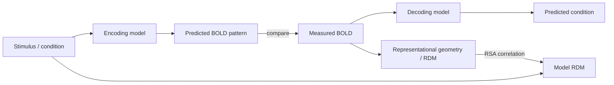

# RSA and encoding/decoding models

> Mean activation tells you *whether* a region responds; pattern analysis tells you *what* it represents. The cost is a steeper analysis pipeline and a much harsher menu of pitfalls.

If you've worked through [Functional connectivity](functional.md) and [Group-level statistics](group-stats.md), this is where pattern-based analyses live. The shared assumption: the *spatial pattern* of voxel responses, not the mean, carries the information about the experimental variable.

## The pattern-analysis family



| Approach | Question | Output |
| --- | --- | --- |
| **MVPA (decoding)** | Can a classifier read the condition from the pattern? | Accuracy / AUC per ROI or searchlight |
| **RSA** | Does the geometry of patterns match a model's geometry? | Spearman / Kendall ρ between RDMs |
| **Encoding** | Does a feature-based model predict the BOLD pattern? | Voxel-wise $R^2$ on held-out data |

Decoding and encoding are duals: decoding predicts condition from BOLD; encoding predicts BOLD from features. RSA compares geometries without ever fitting an explicit mapping.

## Representational Similarity Analysis [Kriegeskorte et al., 2008](https://doi.org/10.3389/neuro.06.004.2008)[^krieg]

### RDMs

For each condition pair $(i, j)$, compute a dissimilarity between their BOLD patterns:

$$
d_{ij} = 1 - \text{corr}(\mathbf{x}_i, \mathbf{x}_j) \quad \text{or} \quad d_{ij} = \|\mathbf{x}_i - \mathbf{x}_j\|_2
$$

Stack into an $N \times N$ Representational Dissimilarity Matrix.

### Second-order isomorphism

You don't compare RDMs at the pattern level — you compare them at the *geometry* level. The brain RDM and a model RDM (e.g., visual similarity, semantic embedding, layer-7 of a DNN) are correlated via rank-correlation (Spearman or Kendall). Equating geometries is a much weaker (and more defensible) claim than equating representations.

### Model RDMs

- **Visual.** Pixelwise correlation, Gabor filter outputs, GIST features.
- **Semantic.** Word2Vec, GloVe, sentence-BERT embeddings; or behavioural similarity ratings.
- **DNN-based.** Layer activations from ResNet, CLIP, ViT — model RDMs from each layer; the layer that best matches a region tells you which level of abstraction it operates at [Khaligh-Razavi & Kriegeskorte, 2014](https://doi.org/10.1371/journal.pcbi.1003915)[^kr14].

`rsatoolbox` (<https://rsatoolbox.readthedocs.io>) is the reference Python implementation — handles fixed and flexible model RDMs, noise-ceiling estimation, and group inference.

## Decoding

### Classifier choice

| Classifier | When to use |
| --- | --- |
| **Linear SVM** | The default; well-tuned, interpretable. |
| **Logistic regression with L2** | When you want calibrated probabilities. |
| **Ridge classifier** | Same as L2 logistic in practice; faster. |
| **Nonlinear (RBF SVM, RF)** | Almost never beats linear in MVPA — high-dimensional voxel space is already nonlinear enough. Don't use unless you have a specific reason. |

The features are typically beta maps per trial (or per block) within an ROI or searchlight sphere.

### Whole-brain vs ROI vs searchlight

- **ROI decoding** — one accuracy per pre-defined region. Clean inference; needs strong anatomical priors.
- **Whole-brain decoding** — one classifier on every grey-matter voxel. Massive feature space; needs regularisation.
- **Searchlight** [Kriegeskorte et al., 2006](https://doi.org/10.1073/pnas.0600244103)[^searchlight] — a sphere (radius 6-12 mm) slides over the brain; train + cross-validate a classifier inside each sphere; produce a map of local decoding accuracy.

Searchlight is the most common whole-brain decoding tool; it's also the most error-prone (see *Pitfalls*).

### Cross-validation done right

- **Leave-one-run-out** is the gold standard for fMRI — each run is independent (separate motion correction, drift, etc.).
- **Leave-one-subject-out** for cross-subject decoding.
- **Stratify by condition** so each fold has all classes.
- **Never** cross-validate at the trial level within a run — the BOLD smoothness leaks signal across "training" and "test" trials.

```python
from sklearn.model_selection import GroupKFold
cv = GroupKFold(n_splits=n_runs)  # groups=run_labels
```

### Permutation testing for searchlight maps [Stelzer et al., 2013](https://doi.org/10.1016/j.neuroimage.2012.09.063)[^stelzer]

Chance level (50% for binary) is *not* the right null when the classifier is regularised on small samples — true chance is empirically estimated. Shuffle the labels (within run, preserving the run structure), rerun the searchlight, repeat 1000×, threshold-free cluster enhancement on each null map, build a null distribution of TFCE values per voxel, and correct.

This is computationally expensive. Start with ~100 permutations to estimate timing; then run 1000 on a cluster.

## Encoding models

Encoding models flip the question: given a stimulus feature vector $\mathbf{s}_t$, predict the BOLD response in each voxel:

$$
y_v(t) = \sum_k w_{v,k}\, s_{t,k} + \varepsilon_v(t)
$$

with $w$ fit by ridge regression. Voxel-wise $R^2$ on held-out data quantifies how well the feature space explains that voxel.

Why ridge: feature dimensionalities for natural stimuli (CLIP embeddings: 512 dims; word2vec: 300; DNN layer: 1000s) easily exceed timepoints. Ridge regularises to avoid overfitting; cross-validate $\alpha$ per voxel or via banded ridge for multiple feature spaces.

The Gallant lab's pipeline [Naselaris et al., 2011](https://doi.org/10.1016/j.neuroimage.2010.07.073)[^gallant] is the canonical reference; their `voxelwise-modeling-tutorials` (<https://gallantlab.org/voxelwise-tutorials>) is the practical guide.

## Tools

| Tool | Strength | Weakness |
| --- | --- | --- |
| **`nilearn.decoding`** | Easy ROI / searchlight MVPA; sklearn API | Modest for encoding models |
| **`rsatoolbox`** | RSA done right: noise ceilings, model comparison | RSA-specific |
| **`brainiak`** | Searchlight, shared-response modelling, hyperalignment | Larger learning curve |
| **`himalaya`** | Banded ridge encoding on GPU | Encoding-specific |
| **`mvpa2` (PyMVPA)** | Older, comprehensive | Maintenance-mode |

## Pitfalls — the seven deadly sins

1. **Double dipping** [Kriegeskorte et al., 2009](https://doi.org/10.1038/nn.2303)[^dd]. Selecting voxels *based on the same contrast you then test*. The textbook example: pick top-100 voxels for "faces > houses", then report a face-vs-house decoding accuracy on the same data. Inflated accuracy guaranteed.
2. **Leakage across folds.** Z-scoring or feature selection on the full dataset before CV. Always nest inside the fold.
3. **Voxel-selection bias.** Selecting the top-1000 most variable voxels using all the data; same problem as double-dipping.
4. **Motion-task confounds.** If patients move more during one condition than another, the classifier learns motion. Censor + match.
5. **Chance ≠ 1/n.** With small folds + regularisation, empirical chance often differs from 1/n_classes by several percentage points. Always permute.
6. **Searchlight smoothness without correction.** Adjacent searchlights overlap heavily; voxel-wise FDR over-corrects, naive thresholding under-corrects. Use TFCE + permutation.
7. **RSA at the noise ceiling.** Always estimate the noise ceiling [Nili et al., 2014](https://doi.org/10.1371/journal.pcbi.1003553)[^nili]; a model RDM that explains 0.05 of the variance might be near the ceiling for a noisy ROI.

## Worked example — ROI decoding + searchlight

```python
import numpy as np
from nilearn.decoding import Decoder, SearchLight
from sklearn.model_selection import GroupKFold
from sklearn.svm import LinearSVC

beta_maps = "sub-01_beta_maps.nii.gz"    # one volume per trial
labels    = np.load("sub-01_labels.npy") # condition per trial
runs      = np.load("sub-01_runs.npy")
mask      = "sub-01_GM_mask.nii.gz"

# ---- ROI decoding ----
roi_mask = "sub-01_FFA_mask.nii.gz"
clf = Decoder(estimator="svc", mask=roi_mask, standardize="zscore_sample",
              cv=GroupKFold(n_splits=len(np.unique(runs))),
              scoring="accuracy")
clf.fit(beta_maps, labels, groups=runs)
print("ROI accuracy:", np.mean(clf.cv_scores_["face"]))

# ---- Searchlight ----
sl = SearchLight(
    mask_img=mask, radius=8.0,
    estimator=LinearSVC(C=1.0, max_iter=5000),
    cv=GroupKFold(n_splits=len(np.unique(runs))),
    scoring="accuracy", n_jobs=8, verbose=1,
)
sl.fit(beta_maps, labels, groups=runs)

# accuracy map -> chance-centred z-map needs permutation; sketch:
chance = 0.5
acc_map = sl.scores_img_
# Permute labels within runs 1000x and re-run sl on a cluster.
```

For the encoding analogue, swap to `himalaya.ridge.RidgeCV` with stimulus features as X and per-voxel BOLD as y; pick $\alpha$ per voxel; report $R^2$ on a held-out run.

## Group-level inference

Pattern analyses end with a per-subject map of accuracy or RSA-correlation. Group inference is then [Group-level statistics](group-stats.md) territory — one-sample t-test against chance, with [Multiple comparisons](multiple-comparisons.md) (TFCE + permutation is the standard for searchlight maps).

!!! tip "Beginner takeaway"
    Five rules for honest pattern analysis:

    1. Define your ROI / feature selection *before* you see the test data.
    2. Cross-validate at the run level, not the trial level.
    3. Permute labels (within run) for the null — never assume chance = 1/n.
    4. Estimate the noise ceiling for any RSA result.
    5. Report effect sizes (accuracy − chance, RSA ρ) with CIs, not just p-values.

## References

[^krieg]: Kriegeskorte N, Mur M, Bandettini PA. Representational similarity analysis — connecting the branches of systems neuroscience. *Front Syst Neurosci.* 2008;2:4. [doi:10.3389/neuro.06.004.2008](https://doi.org/10.3389/neuro.06.004.2008)
[^kr14]: Khaligh-Razavi S-M, Kriegeskorte N. Deep supervised, but not unsupervised, models may explain IT cortical representation. *PLoS Comput Biol.* 2014;10(11):e1003915. [doi:10.1371/journal.pcbi.1003915](https://doi.org/10.1371/journal.pcbi.1003915)
[^searchlight]: Kriegeskorte N, Goebel R, Bandettini P. Information-based functional brain mapping. *PNAS.* 2006;103(10):3863-3868. [doi:10.1073/pnas.0600244103](https://doi.org/10.1073/pnas.0600244103)
[^stelzer]: Stelzer J, Chen Y, Turner R. Statistical inference and multiple testing correction in classification-based multi-voxel pattern analysis. *NeuroImage.* 2013;65:69-82. [doi:10.1016/j.neuroimage.2012.09.063](https://doi.org/10.1016/j.neuroimage.2012.09.063)
[^gallant]: Naselaris T, Kay KN, Nishimoto S, Gallant JL. Encoding and decoding in fMRI. *NeuroImage.* 2011;56(2):400-410. [doi:10.1016/j.neuroimage.2010.07.073](https://doi.org/10.1016/j.neuroimage.2010.07.073)
[^dd]: Kriegeskorte N, Simmons WK, Bellgowan PSF, Baker CI. Circular analysis in systems neuroscience. *Nat Neurosci.* 2009;12(5):535-540. [doi:10.1038/nn.2303](https://doi.org/10.1038/nn.2303)
[^nili]: Nili H, Wingfield C, Walther A, et al. A toolbox for representational similarity analysis. *PLoS Comput Biol.* 2014;10(4):e1003553. [doi:10.1371/journal.pcbi.1003553](https://doi.org/10.1371/journal.pcbi.1003553)

1. **Haxby JV, Connolly AC, Guntupalli JS.** Decoding neural representational spaces using multivariate pattern analysis. *Annu Rev Neurosci.* 2014;37:435-456. [doi:10.1146/annurev-neuro-062012-170325](https://doi.org/10.1146/annurev-neuro-062012-170325)
2. **Pereira F, Mitchell T, Botvinick M.** Machine learning classifiers and fMRI: a tutorial overview. *NeuroImage.* 2009;45(1 Suppl):S199-S209. [doi:10.1016/j.neuroimage.2008.11.007](https://doi.org/10.1016/j.neuroimage.2008.11.007)
3. **Schrimpf M, Kubilius J, Hong H, et al.** Brain-Score: which artificial neural network for object recognition is most brain-like? *bioRxiv.* 2018. [doi:10.1101/407007](https://doi.org/10.1101/407007)
4. **Allen EJ, St-Yves G, Wu Y, et al.** A massive 7T fMRI dataset to bridge cognitive neuroscience and AI. *Nat Neurosci.* 2022;25(1):116-126. [doi:10.1038/s41593-021-00962-x](https://doi.org/10.1038/s41593-021-00962-x)

## Where to next

[Multiple comparisons](multiple-comparisons.md) — once you have a searchlight map, the correction problem is non-trivial.
