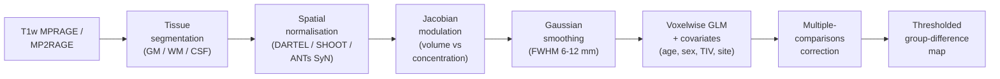

# Voxel-based morphometry (VBM)

> Compare grey-matter density voxel-by-voxel across groups — the workhorse of structural-MRI group analysis since Ashburner & Friston 2000.

Course map: why VBM at all → what each pipeline step does → modulation, smoothing, and the GLM → group inference → VBM vs DBM vs SBM → canonical disease findings → PhD-level pitfalls → software → references → where to next.

## 1. Learning objectives

By the end of this page you should be able to:

- State the five canonical VBM pipeline stages and explain what each one buys you.
- Explain Jacobian modulation in one sentence and say what you measure with vs without it.
- Pick a smoothing FWHM defensibly and report it as a free parameter, not a default.
- Include the non-negotiable VBM covariates (age, sex, total intracranial volume, site) in the second-level design matrix.
- Compare VBM, DBM, and SBM and choose the right one for a cortical-thickness vs subcortical-volume vs whole-brain morphometry question.
- Cite the Eklund 2016 cluster-failure paper and explain why VBM was one of the methods it implicated.

## 2. What VBM actually does

The beginner one-liner: every voxel gets a grey-matter probability between 0 and 1, and you compare those probabilities across groups with a voxelwise GLM. The conceptual one-liner: VBM segments T1 into tissue classes, warps every brain into a common template, **modulates** by the Jacobian of that warp so total tissue is preserved, smooths to satisfy random-field assumptions, and runs a mass-univariate GLM at every voxel.

The promise is that you do not have to pre-specify regions of interest — any voxel can win. The cost is that you inherit all of the multiple-comparisons machinery of mass-univariate neuroimaging (see [multiple-comparisons.md](multiple-comparisons.md)), and your results are only as good as your tissue segmentation, your normalisation, and your smoothing choice. None of the three is neutral.

The original methods paper is [Ashburner & Friston 2000](https://doi.org/10.1006/nimg.2000.0582); the diffeomorphic normalisation that made VBM defensible is DARTEL ([Ashburner 2007](https://doi.org/10.1016/j.neuroimage.2007.07.007)); the modern reference implementation is [CAT12](https://neuro-jena.github.io/cat/) ([Gaser 2024](https://doi.org/10.1093/gigascience/giae049)).

## 3. The classical pipeline



### 3.1 Tissue segmentation

Segment T1 into grey matter (GM), white matter (WM), and cerebrospinal fluid (CSF). Standard options: [SPM12](https://www.fil.ion.ucl.ac.uk/spm/) Unified Segmentation, [CAT12](https://neuro-jena.github.io/cat/) (the modern SPM extension), [FSL FAST](https://fsl.fmrib.ox.ac.uk/fsl/fslwiki/FAST), and FreeSurfer's [SAMSEG](https://surfer.nmr.mgh.harvard.edu/fswiki/Samseg) ([Puonti 2016](https://doi.org/10.1016/j.neuroimage.2016.09.011)). All of them produce a per-voxel GM probability map in subject space.

The first place a VBM pipeline goes wrong is here: a poor bias-field correction or a brain extraction that leaves dura attached inflates GM. Always render the GM map on the T1 and inspect.

### 3.2 Spatial normalisation

Every subject's GM map has to be warped into a common space so that "voxel (60, 72, 40)" means the same anatomical location across subjects. The historical SPM normalisation was a low-DOF affine + low-frequency basis; it was good enough for adults with healthy brains and terrible for everything else. Modern VBM uses a diffeomorphic registration:

- **DARTEL** ([Ashburner 2007](https://doi.org/10.1016/j.neuroimage.2007.07.007)) — the SPM diffeomorphic algorithm; builds a study-specific template from the cohort.
- **SHOOT** — the geodesic-shooting successor in SPM12, smoother and more invertible.
- **ANTs SyN** ([Avants 2008](https://doi.org/10.1016/j.media.2007.06.004)) — symmetric diffeomorphic normalisation; arguably the most accurate ([Klein 2009](https://doi.org/10.1016/j.neuroimage.2008.12.037)) and the default in `antsRegistration`.

Always build a study-specific template when the cohort differs systematically from MNI152 (paediatric, geriatric, pathological).

### 3.3 Modulation — the step nobody explains

Spatial normalisation stretches and compresses local volumes. If you skip modulation, the value at a voxel is GM **concentration** (probability of being GM in that warped voxel). If you multiply by the Jacobian determinant $|J|$ of the warp, you get GM **volume** (concentration scaled back to the original local volume):

$$
\text{GM}_{\text{vol}}(x) \;=\; \text{GM}_{\text{conc}}(x) \cdot |J(x)|.
$$

The two questions answered are different: concentration asks "is the tissue here different in character?", volume asks "is there more or less tissue here?". The vast majority of VBM literature reports modulated (volume) maps because volume is the biologically interpretable quantity in disorders dominated by atrophy.

### 3.4 Smoothing

Convolve the modulated GM map with a Gaussian of FWHM 6–12 mm. Smoothing does three things: (1) it satisfies the random-field-theory assumption that the residual field is a continuous Gaussian process, (2) it boosts SNR for distributed effects, (3) it accommodates residual misregistration. The cost is spatial resolution — a 12 mm kernel blurs subcortical structures into each other.

Pre-register the FWHM, report it, and run a sensitivity analysis at one smaller and one larger kernel. The widely-reported cluster-extent inflation in [Eklund 2016](https://doi.org/10.1073/pnas.1602413113) interacts directly with smoothing-kernel choice.

### 3.5 The second-level GLM

A standard mass-univariate GLM at every voxel:

$$
y_v \;=\; X \beta_v + \varepsilon_v, \qquad v = 1, \ldots, V,
$$

where $y_v$ is per-subject modulated GM at voxel $v$, $X$ is the design matrix, and $\beta_v$ contains the effect of interest. The covariates that are **non-negotiable** in any VBM design:

- **Age** — GM atrophies ~0.2% per year in adulthood.
- **Sex** — males have larger absolute GM volumes.
- **Total intracranial volume (TIV)** — proportional or covariate-based correction. Without TIV correction every "group difference" is partly head-size.
- **Site / scanner** — if the cohort is multi-site, include site as a fixed effect *and* harmonise (see [structural.md ComBat section](structural.md#multi-site-harmonisation-and-longitudinal-pitfalls)).

For multiple-comparisons correction, voxelwise FWE via random-field theory, TFCE permutation (the modern default, especially via FSL `randomise` or PALM), or cluster-extent inference with a tight cluster-forming threshold — see [multiple-comparisons.md](multiple-comparisons.md).

## 4. VBM software comparison

| Tool | Segmentation | Normalisation | Strengths | Notes |
|---|---|---|---|---|
| **SPM12 + CAT12** ([CAT12](https://neuro-jena.github.io/cat/), [Gaser 2024](https://doi.org/10.1093/gigascience/giae049)) | Unified seg + AMAP | DARTEL / SHOOT / Geodesic Shooting | Modern reference; integrated quality reports; ROI extraction | The default for most academic VBM today |
| **SPM12 alone** | Unified Segmentation | DARTEL | Lightweight; the classical pipeline | Use CAT12 unless you need bare SPM |
| **FSL FSL-VBM** ([Douaud 2007](https://doi.org/10.1093/brain/awm184)) | FAST | FNIRT | FSL-native; simple scripting | Less actively developed than CAT12 |
| **FreeSurfer SAMSEG** ([Puonti 2016](https://doi.org/10.1016/j.neuroimage.2016.09.011)) | Sequence-adaptive Bayesian | mri_robust_register | Robust to scanner; lesion-aware variants | Pairs with FreeSurfer cortical pipelines |
| **ANTs (N4 + Atropos + SyN)** | Atropos | SyN | Best-in-class registration accuracy ([Klein 2009](https://doi.org/10.1016/j.neuroimage.2008.12.037)) | Heavier scripting; powerful when paired with `antsCorticalThickness.sh` |
| **AFNI 3dWarp + 3dttest++** | 3dSeg | 3dQwarp | Strong permutation stats; clustering with `3dClustSim` | Less common for VBM; mainstream for fMRI |

## 5. VBM vs DBM vs SBM

| Method | Substrate | When it wins | Reference tool |
|---|---|---|---|
| **VBM** (voxel-based morphometry) | Modulated GM probability per voxel | Subcortical, whole-brain, disease-trial endpoint, large clinical cohorts | SPM12 + CAT12, FSL FSL-VBM |
| **DBM** (deformation-based morphometry) | Jacobian determinant map per voxel | Any-tissue volume change (CSF expansion, WM atrophy); avoids the segmentation step | SPM, ANTs, MRtrix |
| **TBM** (tensor-based morphometry) | Full deformation tensor per voxel | Direction-sensitive shape change; longitudinal designs | ANTs, [tbm-deformation tools](https://www.nitrc.org/projects/tbm/) |
| **SBM** (surface-based morphometry) | Cortical thickness / area / curvature at every vertex | Cortical-only questions; resolves through sulci; the FreeSurfer / FastSurfer territory | FreeSurfer, [FastSurfer](https://deep-mi.org/research/fastsurfer/), CIVET |

VBM and SBM measure related but distinct things on cortex: VBM is sensitive to GM volume (thickness × area combined, blurred by the smoothing kernel), SBM separates the two. For a *cortical-only* hypothesis (typical Alzheimer's thickness loss, schizophrenia frontal thinning) SBM is now the field standard — see [structural.md](structural.md). For subcortical questions (hippocampal volume in TLE, putamen volume in PD) and for whole-brain unbiased searches, VBM remains the workhorse.

## 6. Canonical disease findings

| Disorder | VBM signature | Reference |
|---|---|---|
| **Alzheimer's disease** | Hippocampal and medial-temporal-lobe atrophy, posterior-cingulate and precuneus GM loss | [Frisoni 2010](https://doi.org/10.1038/nrneurol.2009.215); cross-link [clinical/alzheimers-and-dementia.md](../clinical/alzheimers-and-dementia.md) |
| **Frontotemporal dementia** | Frontal and anterior-temporal atrophy; insular GM loss | [Rohrer 2009](https://doi.org/10.1212/WNL.0b013e3181d3e2c2) |
| **Parkinson's disease** | Subcortical (substantia nigra, putamen) and frontal atrophy; cerebellar changes | Cross-link [clinical/parkinsons-and-movement.md](../clinical/parkinsons-and-movement.md) |
| **Schizophrenia** | Frontal, temporal, hippocampal, and thalamic GM reductions; ENIGMA n = 9572 | [van Erp 2018](https://doi.org/10.1016/j.biopsych.2018.04.023); cross-link [clinical/psychiatry.md](../clinical/psychiatry.md) |
| **Major depression** | Hippocampal volume reduction; orbitofrontal and ACC GM changes; ENIGMA n = 8927 | [Schmaal 2017](https://doi.org/10.1038/mp.2016.60) |
| **Multiple sclerosis** | Whole-brain and grey-matter atrophy; thalamic and deep-grey volume loss | Cross-link [clinical/multiple-sclerosis.md](../clinical/multiple-sclerosis.md) |
| **Temporal-lobe epilepsy** | Ipsilateral hippocampal and entorhinal atrophy; contralateral mirror effects | Cross-link [clinical/epilepsy.md](../clinical/epilepsy.md); pair with the AI machinery in [asymmetry.md](asymmetry.md) |

## 7. A minimal CAT12 / SPM driver

```bash
# Batch driver — call from MATLAB or via spm_jobman; this is the conceptual outline.
# 1. Segment with CAT12 (writes mwp1*.nii — modulated, warped, p1 = GM)
matlab -batch "cat_run_segment_default('sub-001_T1w.nii')"

# 2. Smooth the modulated GM
matlab -batch "spm_smooth('mri/mwp1sub-001_T1w.nii', 'smwp1sub-001_T1w.nii', [8 8 8])"

# 3. Second-level GLM in SPM (factorial design)
#    Inputs: smwp1*.nii per subject; covariates: age, sex, TIV (CAT12 estimates TIV automatically), site
#    Contrast: patients < controls; correction: FWE-corrected p < 0.05 voxelwise OR TFCE via TFCE toolbox
```

For permutation-based inference, run the same modulated, smoothed maps through [FSL `randomise`](https://fsl.fmrib.ox.ac.uk/fsl/fslwiki/Randomise) with `-T` (TFCE) — empirically the most defensible correction.

## 8. PhD-level pitfalls

### 8.1 Registration failure in atypical brains

Diffeomorphic normalisation assumes the moving brain is topologically equivalent to the template. Lesions, hydrocephalus, surgical cavities, paediatric brains, and severe atrophy break that assumption silently — the warp succeeds numerically but the local Jacobian is meaningless. Always render the warped GM map on the template and inspect for every subject; use lesion-fill T1 or cost-function masking ([Brett 2001](https://doi.org/10.1006/nimg.2001.0845)) when lesions are present.

### 8.2 Smoothing FWHM is not a hyperparameter to ignore

The same data, smoothed at 6 mm vs 12 mm FWHM, produces clusters of very different sizes and significance. [Eklund 2016](https://doi.org/10.1073/pnas.1602413113) showed that the standard cluster-extent inference in SPM, FSL, and AFNI had false-positive rates up to 70% under common smoothing and threshold choices. The modern defaults — TFCE + permutation, or voxelwise FWE — bound the problem; report kernel and correction explicitly.

### 8.3 ComBat for multi-site studies

Pool VBM across scanners without harmonisation and you measure the scanner. [Fortin 2018](https://doi.org/10.1016/j.neuroimage.2017.11.024) ported genomic ComBat to cortical thickness; the same machinery works on modulated GM maps. The non-negotiables are in [structural.md §Multi-site harmonisation](structural.md#multi-site-harmonisation-and-longitudinal-pitfalls).

### 8.4 Longitudinal VBM

Running cross-sectional VBM on each timepoint and subtracting is *wrong* — the noise in each timepoint dominates the signal of within-subject change. Use a within-subject template ([Reuter 2012](https://doi.org/10.1016/j.neuroimage.2012.02.084)) and compute Jacobian-change maps. The full mixed-effects machinery is in [longitudinal.md](longitudinal.md).

### 8.5 TIV correction — proportional vs covariate

Two conventions, neither neutral. Proportional scaling divides GM by TIV per subject; covariate inclusion keeps GM raw and adds TIV as a column of $X$. The covariate approach is usually preferred because the proportional ratio assumes an exact linear scaling that does not hold across all brain regions. Pre-register which one.

### 8.6 Synthetic-MRI-derived VBM

Synthetic MR (e.g., quantitative-MRI-derived T1) lets you compute "VBM" from sequences other than MPRAGE ([Hagiwara 2021](https://doi.org/10.1148/radiol.2020203264)); calibration against conventional VBM is essential before clinical use. See [fundamentals/sequences/qmri.md](../fundamentals/sequences/qmri.md) for the qMRI side.

### 8.7 Voxelwise inference vs ROI-wise

VBM clusters do not always survive a follow-up ROI analysis on the same data; ROI analyses with anatomically motivated masks (FreeSurfer DK, AAL, Harvard-Oxford) have much higher per-test power and are the natural companion to a whole-brain VBM screen. Pre-register both.

## 9. References

1. Ashburner J, Friston KJ. Voxel-based morphometry — the methods. *NeuroImage.* 2000;11(6 Pt 1):805-821. [doi:10.1006/nimg.2000.0582](https://doi.org/10.1006/nimg.2000.0582)
2. Ashburner J. A fast diffeomorphic image registration algorithm. *NeuroImage.* 2007;38(1):95-113. [doi:10.1016/j.neuroimage.2007.07.007](https://doi.org/10.1016/j.neuroimage.2007.07.007)
3. Gaser C, Dahnke R, Thompson PM, Kurth F, Luders E, Alzheimer's Disease Neuroimaging Initiative. CAT — a computational anatomy toolbox for the analysis of structural MRI data. *GigaScience.* 2024;13:giae049. [doi:10.1093/gigascience/giae049](https://doi.org/10.1093/gigascience/giae049)
4. Eklund A, Nichols TE, Knutsson H. Cluster failure: why fMRI inferences for spatial extent have inflated false-positive rates. *PNAS.* 2016;113(28):7900-7905. [doi:10.1073/pnas.1602413113](https://doi.org/10.1073/pnas.1602413113)
5. Avants BB, Epstein CL, Grossman M, Gee JC. Symmetric diffeomorphic image registration with cross-correlation: evaluating automated labeling of elderly and neurodegenerative brain. *Med Image Anal.* 2008;12(1):26-41. [doi:10.1016/j.media.2007.06.004](https://doi.org/10.1016/j.media.2007.06.004)
6. Klein A, Andersson J, Ardekani BA, et al. Evaluation of 14 nonlinear deformation algorithms applied to human brain MRI registration. *NeuroImage.* 2009;46(3):786-802. [doi:10.1016/j.neuroimage.2008.12.037](https://doi.org/10.1016/j.neuroimage.2008.12.037)
7. Puonti O, Iglesias JE, Van Leemput K. Fast and sequence-adaptive whole-brain segmentation using parametric Bayesian modeling. *NeuroImage.* 2016;143:235-249. [doi:10.1016/j.neuroimage.2016.09.011](https://doi.org/10.1016/j.neuroimage.2016.09.011)
8. Douaud G, Smith S, Jenkinson M, et al. Anatomically related grey and white matter abnormalities in adolescent-onset schizophrenia. *Brain.* 2007;130(9):2375-2386. [doi:10.1093/brain/awm184](https://doi.org/10.1093/brain/awm184)
9. Frisoni GB, Fox NC, Jack CR Jr, Scheltens P, Thompson PM. The clinical use of structural MRI in Alzheimer disease. *Nat Rev Neurol.* 2010;6(2):67-77. [doi:10.1038/nrneurol.2009.215](https://doi.org/10.1038/nrneurol.2009.215)
10. Rohrer JD, Warren JD, Modat M, et al. Patterns of cortical thinning in the language variants of frontotemporal lobar degeneration. *Neurology.* 2009;72(18):1562-1569. [doi:10.1212/WNL.0b013e3181d3e2c2](https://doi.org/10.1212/WNL.0b013e3181d3e2c2)
11. van Erp TGM, Walton E, Hibar DP, et al. Cortical brain abnormalities in 4474 individuals with schizophrenia and 5098 controls via the ENIGMA Consortium. *Biol Psychiatry.* 2018;84(9):644-654. [doi:10.1016/j.biopsych.2018.04.023](https://doi.org/10.1016/j.biopsych.2018.04.023)
12. Schmaal L, Hibar DP, Sämann PG, et al. Cortical abnormalities in adults and adolescents with major depression based on brain scans from 20 cohorts worldwide in the ENIGMA Major Depressive Disorder Working Group. *Mol Psychiatry.* 2017;22(6):900-909. [doi:10.1038/mp.2016.60](https://doi.org/10.1038/mp.2016.60)
13. Hagiwara A, Fujita S, Ohno Y, Aoki S. Variability and standardization of quantitative imaging: monoparametric to multiparametric quantification, radiomics, and artificial intelligence. *Invest Radiol.* 2020;55(9):601-616. [doi:10.1097/RLI.0000000000000666](https://doi.org/10.1097/RLI.0000000000000666)
14. Brett M, Leff AP, Rorden C, Ashburner J. Spatial normalization of brain images with focal lesions using cost function masking. *NeuroImage.* 2001;14(2):486-500. [doi:10.1006/nimg.2001.0845](https://doi.org/10.1006/nimg.2001.0845)
15. Fortin J-P, Cullen N, Sheline YI, et al. Harmonization of cortical thickness measurements across scanners and sites. *NeuroImage.* 2018;167:104-120. [doi:10.1016/j.neuroimage.2017.11.024](https://doi.org/10.1016/j.neuroimage.2017.11.024)
16. Reuter M, Schmansky NJ, Rosas HD, Fischl B. Within-subject template estimation for unbiased longitudinal image analysis. *NeuroImage.* 2012;61(4):1402-1418. [doi:10.1016/j.neuroimage.2012.02.084](https://doi.org/10.1016/j.neuroimage.2012.02.084)

## 10. Where to next

- [structural.md](structural.md) — cortical thickness, surface-based morphometry, ComBat multi-site harmonisation, and the FreeSurfer / FastSurfer pipelines that pair with VBM for cortical questions.
- [longitudinal.md](longitudinal.md) — within-subject templates, Reuter's longitudinal stream, and mixed-effects modelling of VBM-derived metrics.
- [group-stats.md](group-stats.md) — the second-level GLM in more detail.
- [multiple-comparisons.md](multiple-comparisons.md) — TFCE, voxelwise FWE, cluster-extent inference, and the Eklund 2016 fallout.
- [asymmetry.md](asymmetry.md) — voxelwise AI maps as a within-subject VBM contrast.
- [clinical/alzheimers-and-dementia.md](../clinical/alzheimers-and-dementia.md) — the clinical use of VBM in AD and FTD.
