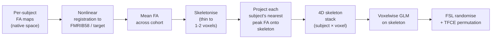
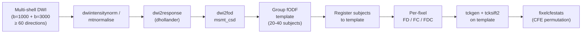

# White-matter group statistics — TBSS, fixel-based, and friends

> How to do voxelwise / fibre-specific group stats on DWI-derived metrics. TBSS is the classical workhorse; fixel-based analysis is the modern fibre-specific alternative.

Course map: why DWI group stats are hard → TBSS in detail → fixel-based analysis (FBA) → tract-profile methods (AFQ, TractSeg, BUAN) → statistical-inference comparison → PhD nuances → canonical disease findings → software → references → where to next.

## 1. Learning objectives

By the end of this page you should be able to:

- Explain why naive voxelwise statistics on FA maps fail and what TBSS skeletonisation is trying to fix.
- Run the TBSS pipeline (`tbss_1_preproc … tbss_4_prestats`) and follow it with FSL `randomise` + TFCE.
- Describe the FBA pipeline (`dwi2response … fixelcfestats`) and the per-fixel metrics FD, FC, FDC.
- Pick between voxelwise, fixel-wise, and tract-profile inference for a given hypothesis.
- State the partial-volume / crossing-fibre / registration pitfalls reviewers will probe.
- Cite Smith 2006, Raffelt 2017, and Bach 2014 and explain what each contributed.

## 2. Why DWI group statistics are hard

DWI-derived maps — FA, MD, AD, RD, NODDI's $\nu_\mathrm{ic}$, fODF metrics — are sampled on white-matter bundles that are:

- **Anisotropic and curved** — the underlying tissue varies sharply across millimetres along the bundle normal but slowly along its length.
- **Hard to align across subjects** — bundles bend differently in different folds; standard whole-brain nonlinear registration mis-aligns at the bundle scale.
- **Mixed at the voxel level** — at 2 mm isotropic, ~60–90% of WM voxels contain two or more fibre populations ([Jeurissen 2013](https://doi.org/10.1002/hbm.22099)). A single FA value at such a voxel is a weighted average of populations.
- **Partial-volumed with CSF and GM** at bundle edges — a 5 mm shift in registration moves a voxel from pure WM (FA ~0.7) into a CSF/GM mix (FA ~0.2) and the per-voxel value explodes.

Run a vanilla voxelwise GLM on co-registered FA maps and you measure registration failure plus partial-volume noise. The three families of methods on this page each address a different piece of that problem.

## 3. TBSS — the classical pipeline

[Tract-Based Spatial Statistics](https://fsl.fmrib.ox.ac.uk/fsl/fslwiki/TBSS) ([Smith 2006](https://doi.org/10.1016/j.neuroimage.2006.02.024)) is the workhorse for two reasons: it is shipped with FSL, and it has the largest literature of any WM-stats method. The trick is the **skeleton**: a thin (1–2 voxel) representation of the centre of each bundle, onto which each subject's nearest peak FA value is projected before stats.



### 3.1 The FSL TBSS recipe

```bash
# Per-subject FA from FSL dtifit or MRtrix tensor2metric
mkdir TBSS && cd TBSS
ln -s ../sub-*/dti_FA.nii.gz ./

tbss_1_preproc *.nii.gz                  # erodes, zeros end slices, moves to FA/ subdir
tbss_2_reg -T                            # nonlinear registration to FMRIB58_FA
tbss_3_postreg -S                        # mean FA + skeleton derivation
tbss_4_prestats 0.2                      # threshold the skeleton at FA > 0.2

# Second-level GLM with TFCE permutation (5000 permutations)
randomise -i all_FA_skeletonised.nii.gz -o tbss \
    -m mean_FA_skeleton_mask.nii.gz \
    -d design.mat -t design.con -n 5000 --T2
```

The TFCE option (`--T2`) handles the multiple-comparisons correction; permutation tests bound the false-positive rate exactly, side-stepping the random-field assumptions that [Eklund 2016](https://doi.org/10.1073/pnas.1602413113) showed broke down for cluster-extent inference. The same pipeline runs on MD, AD, RD by replacing `all_FA_skeletonised.nii.gz` with the corresponding skeleton-projected map; the recipe is in the FSL TBSS user guide.

### 3.2 Strengths

- **Standardised**: same pipeline across thousands of papers; reviewer-friendly.
- **Fast**: minutes per subject after preprocessing.
- **Robust to mild misalignment**: the projection step pulls each subject's nearest peak FA onto a fixed skeleton, absorbing residual registration error.
- **Permutation inference baked in**: TFCE + randomise is the gold-standard multiple-comparisons correction.

### 3.3 Weaknesses

- **Skeleton hides crossing-fibre information**: a TBSS skeleton voxel often sits at the intersection of two or three populations; you cannot tell from a TBSS finding which population changed.
- **Projection bias**: the "nearest peak FA" projection rule favours voxels with higher FA, biasing the skeleton toward dominant fibres and obscuring effects in smaller bundles ([Bach 2014](https://doi.org/10.1016/j.neuroimage.2014.06.021)).
- **Not fibre-specific**: TBSS reports voxelwise differences in a scalar that mixes biology.
- **Skeleton thresholding is arbitrary**: `tbss_4_prestats 0.2` is a default not a derivation; sensitivity analyses at 0.15 and 0.25 are good practice.

## 4. Fixel-based analysis (FBA) — the modern alternative

[Fixel-based analysis](https://mrtrix.readthedocs.io/en/latest/fixel_based_analysis/fba.html) ([Raffelt 2017](https://doi.org/10.1016/j.neuroimage.2016.09.029)) does statistics per **fixel** — a single fibre population in a single voxel — rather than per voxel. A voxel with three crossing populations contributes three fixels; each fixel has its own FD (fibre density), FC (fibre cross-section), and combined FDC.



### 4.1 The MRtrix3 recipe

```bash
# Assuming preprocessed multi-shell DWI per subject already exists
dwi2response dhollander dwi.mif wm.txt gm.txt csf.txt
dwi2fod msmt_csd dwi.mif wm.txt wmfod.mif gm.txt gm.mif csf.txt csf.mif
mtnormalise wmfod.mif wmfod_norm.mif gm.mif gm_norm.mif csf.mif csf_norm.mif \
    -mask brain_mask.mif

# Cohort-level: build template, register, compute per-fixel metrics
population_template fod_input/ -mask_dir mask_input/ wmfod_template.mif
mrregister wmfod_norm.mif -mask1 mask.mif wmfod_template.mif \
    -nl_warp subject2template_warp.mif template2subject_warp.mif
fixelreorient ...
# FD, FC, log(FC) and FDC computed per fixel; combined into cohort fixel directory

# Group statistics with connectivity-based fixel enhancement (CFE)
fixelcfestats fd_cohort/ files.txt design_matrix.txt contrast_matrix.txt \
    tracks_2_million_sift.tck stats_fd/
```

### 4.2 Per-fixel metrics

- **FD — fibre density** ($\propto$ apparent fibre density per fixel): microstructural — intra-axonal volume fraction sampled at the fixel.
- **FC — fibre cross-section**: macrostructural — the Jacobian of the warp from subject to template projected onto the fixel direction; sensitive to bundle atrophy / hypertrophy.
- **FDC — combined**: $\text{FDC} = \text{FD} \times \text{FC}$; integrates micro- and macrostructural change.

### 4.3 Connectivity-based fixel enhancement (CFE)

CFE is the fixel-space equivalent of TFCE: every fixel's test statistic is enhanced by its connections through the cohort tractogram, then permutation-tested. It exploits the topological structure of the white matter — distant fixels on the same bundle reinforce each other in the way that adjacent voxels do in TFCE.

### 4.4 Strengths and weaknesses

| FBA strengths | FBA weaknesses |
|---|---|
| Fibre-specific — separates crossing populations | Requires multi-shell HARDI (typically b = 1000 + b = 3000, ≥ 60 directions) |
| Biologically interpretable (FD = intra-axonal volume; FC = macrostructure) | Template generation slow (hours for 30 subjects) |
| Modern statistical machinery (CFE + permutation) | Smaller body of clinical literature than TBSS |
| Handles the "crossing-fibre myth" of TBSS | Mtrix-dependent; less cross-tool replication available |

## 5. Tract-profile analysis — bundle-specific

When you have a tract-level hypothesis (uncinate in psychosis, arcuate in aphasia, corticospinal in MS), profile FA / MD / NODDI along the length of the bundle and test for group differences at each node. Three reference pipelines:

- **[AFQ](https://yeatmanlab.github.io/AFQ/) — Automated Fiber Quantification** ([Yeatman 2012](https://doi.org/10.1371/journal.pone.0049790)): profile FA, MD, RD, AD along 100 nodes of ~20 canonical bundles. The classical workhorse; MATLAB-based; the [pyAFQ](https://github.com/yeatmanlab/pyAFQ) Python port is the modern entry point.
- **[TractSeg](https://github.com/MIC-DKFZ/TractSeg)** ([Wasserthal 2018](https://doi.org/10.1016/j.neuroimage.2018.07.070)): a CNN segments 72 bundles directly from CSD peaks, with no registration to a template. Faster and more accurate on atypical brains than registration-based bundle dissection.
- **[BUAN](https://docs.dipy.org/stable/examples_built/streamline_analysis/buan_lmm.html) — Bundle Analytics** ([Chandio 2020](https://doi.org/10.1038/s41598-020-74054-4)): the DIPY tract-profile framework; pairs naturally with QSIPrep + DIPY pipelines.

Tract profiles are powerful when (a) you have a focal hypothesis, (b) cohort size is small and whole-brain correction would wash the effect out, or (c) you want to localise *where along the tract* a change sits. The decision tree at the end of [diffusion.md §Bundle-specific analysis](diffusion.md#bundle-specific-analysis-when-roi-based-stats-beat-whole-brain) lays out when bundle-specific beats whole-brain TBSS or FBA.

### 5.1 Tract-profile group stats

A tract profile is a per-subject vector of length 100 (node values). Group inference:

- **Per-node $t$-tests with FDR** — the simplest; under-corrects for autocorrelation along the bundle.
- **Cluster-mass permutation along the tract** — closer to TFCE in spirit; respects node ordering.
- **Functional-data-analysis (FDA) GLM** — model the profile as a smooth function, test for group differences in the function.

## 6. Statistical-inference comparison

| Method | Inference unit | Correction | Best at | Worst at |
|---|---|---|---|---|
| **TBSS + TFCE** | Voxel on the skeleton | TFCE + 5000-permutation `randomise` | Cohort-wide diffuse change in dominant fibres | Crossing-fibre regions; small bundles |
| **FBA + CFE** | Fixel | CFE + permutation in `fixelcfestats` | Fibre-specific effects, biologically interpretable | Requires HARDI; slower; smaller literature |
| **Tract-profile (AFQ / TractSeg)** | Node along bundle | FDR or node-cluster permutation | Focal, hypothesis-driven, small cohorts | Whole-brain unbiased questions |
| **Voxelwise GLM (no skeleton)** | Voxel | TFCE permutation | Rare — only with very high-quality registration | The default failure mode; do not use without a good reason |
| **ROI-mean** | ROI | FDR across ROIs | Hypothesis-confined, transparent | Loses spatial localisation entirely |

## 7. PhD-level nuances

### 7.1 Free-water elimination before any group stats

Partial-volume contamination with CSF inflates MD and depresses FA by amounts much larger than typical group effects. [Pasternak 2009](https://doi.org/10.1002/mrm.22055) introduced the bi-tensor free-water model that recovers tissue-only FA; modern pipelines include FW-corrected metrics by default ([FW-DTI in DIPY](https://docs.dipy.org/), MRtrix add-ons). Any FA / MD analysis near ventricles, lesions, or atrophy without free-water correction is reporting partial-volume noise.

### 7.2 Registration matters more than the statistical machinery

Whether you use FSL FNIRT, ANTs SyN, MRtrix `mrregister`, or the new symmetric DARTEL/MMORF stack, mis-registration is the dominant source of variance in TBSS and voxelwise WM stats. Always render the warped FA on a template and inspect; bundle-specific methods (TractSeg) side-step this by working on each subject's native CSD peaks.

### 7.3 The crossing-fibre myth in TBSS

A widespread misconception is that the TBSS skeleton sits on "single-fibre" voxels. [Jeurissen 2013](https://doi.org/10.1002/hbm.22099) showed that ~60–90% of WM voxels contain two or more populations even at 2 mm isotropic — and skeleton voxels are no exception. A TBSS finding on the skeleton may reflect a change in *any* of the populations sharing that voxel. FBA is the principled fix.

### 7.4 Multi-site harmonisation of DWI metrics

FA, MD, and downstream metrics shift with scanner manufacturer, gradient strength, b-value spread, and reconstruction. ComBat-DTI ([Fortin 2017](https://doi.org/10.1016/j.neuroimage.2017.08.047)) ports the empirical-Bayes ComBat to DTI metrics; ComBat-GAM accommodates non-linear age effects. The non-negotiables are the same as for VBM (see [vbm.md §8.3](vbm.md#83-combat-for-multi-site-studies) and [structural.md §Multi-site harmonisation](structural.md#multi-site-harmonisation-and-longitudinal-pitfalls)).

### 7.5 Higher-order metrics (NODDI, DKI, MAP-MRI)

[NODDI](https://doi.org/10.1016/j.neuroimage.2012.03.072), [DKI](https://doi.org/10.1002/mrm.20508), and [MAP-MRI](https://doi.org/10.1016/j.neuroimage.2013.04.016) provide per-voxel scalars with cleaner biology than FA. The group-stats machinery (TBSS, FBA, tract-profile) extends directly — substitute $\nu_\mathrm{ic}$, MK, or RTOP for FA in the skeleton stack. Fewer canonical pipelines exist; see [advanced-diffusion.md](../fundamentals/sequences/advanced-diffusion.md) for the per-metric details.

### 7.6 Crossing fibres in tract-profile analyses

Bundle dissection algorithms (AFQ, TractSeg) place a streamline along the tract centre, but a voxel sampled by that streamline can contain crossing fibres from a different population. Pair tract-profile FA with a fixel-derived measure (FD along the same tract) when crossing-fibre regions are involved.

## 8. Canonical disease findings

| Disorder | WM-stats signature | Method | Reference |
|---|---|---|---|
| **Multiple sclerosis** | TBSS reductions in FA in normal-appearing WM (NAWM); FBA reductions in FD across cerebellar peduncles | TBSS, FBA | Cross-link [clinical/multiple-sclerosis.md](../clinical/multiple-sclerosis.md) |
| **Parkinson's disease** | Reduced FA in nigrostriatal tracts; FBA reductions in cerebello-thalamo-cortical fixels | TBSS, FBA | Cross-link [clinical/parkinsons-and-movement.md](../clinical/parkinsons-and-movement.md) |
| **Schizophrenia** | Frontal and corpus-callosum FA reduction; ENIGMA-DTI meta-analyses across thousands of subjects | TBSS | [Kelly 2018](https://doi.org/10.1038/mp.2017.170) |
| **Healthy ageing** | Increased RD in genu of corpus callosum; reduced FD with age | TBSS, FBA | [Genc 2020](https://doi.org/10.1016/j.neuroimage.2020.117167) |
| **Autism spectrum** | Reduced FA in commissural and association tracts; effect sizes small | TBSS, AFQ | Cross-link [clinical/psychiatry.md](../clinical/psychiatry.md) |
| **Temporal-lobe epilepsy** | Ipsilateral fornix and uncinate FA reduction | TBSS, TractSeg | Cross-link [clinical/epilepsy.md](../clinical/epilepsy.md) |
| **Stroke** | Wallerian degeneration in the descending corticospinal tract; tract-FA predicts motor outcome | AFQ, TractSeg | Cross-link [clinical/stroke-and-tbi.md](../clinical/stroke-and-tbi.md) |

## 9. Software

- [FSL TBSS](https://fsl.fmrib.ox.ac.uk/fsl/fslwiki/TBSS) — the canonical TBSS pipeline, ships with FSL.
- [FSL randomise + TFCE](https://fsl.fmrib.ox.ac.uk/fsl/fslwiki/Randomise) — permutation inference on the skeleton stack; the gold-standard correction.
- [MRtrix3 FBA](https://mrtrix.readthedocs.io/en/latest/fixel_based_analysis/fba.html) — the official fixel-based pipeline with `fixelcfestats`.
- [AFQ](https://yeatmanlab.github.io/AFQ/) — MATLAB tract-profile pipeline.
- [pyAFQ](https://github.com/yeatmanlab/pyAFQ) — Python port of AFQ; the modern entry point.
- [TractSeg](https://github.com/MIC-DKFZ/TractSeg) — CNN-based bundle segmentation; 72 bundles without registration.
- [DIPY / BUAN](https://docs.dipy.org/stable/examples_built/streamline_analysis/buan_lmm.html) — Python tract analytics; pairs with QSIPrep.
- [QSIPrep](https://qsiprep.readthedocs.io/) — the BIDS-app DWI preprocessor that feeds all of the above; see [diffusion.md](diffusion.md).
- [PALM](https://fsl.fmrib.ox.ac.uk/fsl/fslwiki/PALM) — generalised permutation testing; extends `randomise` to complex designs (paired, repeated-measures, ranked).

## 10. References

1. Smith SM, Jenkinson M, Johansen-Berg H, et al. Tract-based spatial statistics: voxelwise analysis of multi-subject diffusion data. *NeuroImage.* 2006;31(4):1487-1505. [doi:10.1016/j.neuroimage.2006.02.024](https://doi.org/10.1016/j.neuroimage.2006.02.024)
2. Raffelt DA, Tournier J-D, Smith RE, et al. Investigating white matter fibre density and morphology using fixel-based analysis. *NeuroImage.* 2017;144(Pt A):58-73. [doi:10.1016/j.neuroimage.2016.09.029](https://doi.org/10.1016/j.neuroimage.2016.09.029)
3. Bach M, Laun FB, Leemans A, et al. Methodological considerations on tract-based spatial statistics (TBSS). *NeuroImage.* 2014;100:358-369. [doi:10.1016/j.neuroimage.2014.06.021](https://doi.org/10.1016/j.neuroimage.2014.06.021)
4. Yeatman JD, Dougherty RF, Myall NJ, Wandell BA, Feldman HM. Tract profiles of white matter properties: automating fiber-quantification. *PLoS One.* 2012;7(11):e49790. [doi:10.1371/journal.pone.0049790](https://doi.org/10.1371/journal.pone.0049790)
5. Wasserthal J, Neher P, Maier-Hein KH. TractSeg — fast and accurate white matter tract segmentation. *NeuroImage.* 2018;183:239-253. [doi:10.1016/j.neuroimage.2018.07.070](https://doi.org/10.1016/j.neuroimage.2018.07.070)
6. Chandio BQ, Risacher SL, Pestilli F, et al. Bundle analytics, a computational framework for investigating the shapes and profiles of brain pathways across populations. *Sci Rep.* 2020;10:17149. [doi:10.1038/s41598-020-74054-4](https://doi.org/10.1038/s41598-020-74054-4)
7. Pasternak O, Sochen N, Gur Y, Intrator N, Assaf Y. Free water elimination and mapping from diffusion MRI. *Magn Reson Med.* 2009;62(3):717-730. [doi:10.1002/mrm.22055](https://doi.org/10.1002/mrm.22055)
8. Fortin J-P, Parker D, Tunç B, et al. Harmonization of multi-site diffusion tensor imaging data. *NeuroImage.* 2017;161:149-170. [doi:10.1016/j.neuroimage.2017.08.047](https://doi.org/10.1016/j.neuroimage.2017.08.047)
9. Jeurissen B, Leemans A, Tournier J-D, Jones DK, Sijbers J. Investigating the prevalence of complex fiber configurations in white matter tissue with diffusion magnetic resonance imaging. *Hum Brain Mapp.* 2013;34(11):2747-2766. [doi:10.1002/hbm.22099](https://doi.org/10.1002/hbm.22099)
10. Eklund A, Nichols TE, Knutsson H. Cluster failure: why fMRI inferences for spatial extent have inflated false-positive rates. *PNAS.* 2016;113(28):7900-7905. [doi:10.1073/pnas.1602413113](https://doi.org/10.1073/pnas.1602413113)
11. Kelly S, Jahanshad N, Zalesky A, et al. Widespread white matter microstructural differences in schizophrenia across 4322 individuals: results from the ENIGMA Schizophrenia DTI Working Group. *Mol Psychiatry.* 2018;23(5):1261-1269. [doi:10.1038/mp.2017.170](https://doi.org/10.1038/mp.2017.170)
12. Genc S, Smith RE, Malpas CB, et al. Development of white matter fibre density and morphology over childhood: a longitudinal fixel-based analysis. *NeuroImage.* 2020;218:117010. [doi:10.1016/j.neuroimage.2020.117167](https://doi.org/10.1016/j.neuroimage.2020.117167)

## 11. Where to next

- [diffusion.md](diffusion.md) — the upstream DWI pipeline (preprocessing, modelling, tractography) whose outputs feed every method on this page.
- [advanced-diffusion.md](../fundamentals/sequences/advanced-diffusion.md) — NODDI, DKI, MAP-MRI, free-water, and the biophysical models behind the scalars you put into group stats.
- [group-stats.md](group-stats.md) — the second-level GLM behind `randomise` and `fixelcfestats`.
- [multiple-comparisons.md](multiple-comparisons.md) — TFCE, CFE, permutation inference, and the broader correction landscape.
- [network-metrics.md](network-metrics.md) — when the question is at the connectome rather than the tract / voxel level.
- [asymmetry.md](asymmetry.md) — left vs right WM-tract differences and the AI machinery.
