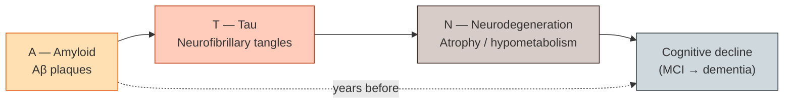

# Alzheimer's & related dementias

> The disease that built modern neuroimaging biomarkers. Amyloid, tau, neurodegeneration — in vivo, longitudinally, and now therapeutically relevant.

Alzheimer's disease (AD) is the single biggest driver of clinical and research neuroimaging investment in the last two decades. ADNI gave the field its biggest open longitudinal cohort, the A/T/N framework gave it a vocabulary, and the 2023–2024 anti-amyloid antibody approvals (lecanemab, donanemab) suddenly turned amyloid-PET from a research curiosity into a treatment-eligibility scan. This page covers the clinical picture, the biology, the imaging biomarkers in routine use, the pipelines that emit them, the reference cohorts, and where the field is still arguing.

For the underlying neuroanatomy (medial temporal lobe, default-mode network, cholinergic system), see [Fundamentals → Neuroscience & neurology](../fundamentals/foundations/neuroscience.md).

## Clinical picture

AD is the most common cause of dementia (~60–70% of cases). It is one disease in a *spectrum* of neurodegenerative dementias, and getting the differential right matters because management, prognosis, and (now) treatment differ.

### Syndromes

- **Amnestic AD** — the textbook presentation. Insidious episodic memory loss, then language, executive, visuospatial; eventual global dementia. Medial temporal onset.
- **Posterior cortical atrophy (PCA)** — visuospatial / Balint-syndrome-like; parieto-occipital onset; often AD pathology underneath.
- **Logopenic primary progressive aphasia (lvPPA)** — word-finding pauses, phonological errors; left temporo-parietal; often AD pathology.
- **Behavioural / dysexecutive AD** — frontal-predominant; harder to distinguish from FTD without biomarkers.
- **Mild cognitive impairment (MCI)** — symptomatic but not yet demented; amnestic MCI is the high-risk-of-AD subtype.
- **Preclinical AD** — biomarker-positive, cognitively normal. Defined as a research stage by [Sperling et al., 2011](https://doi.org/10.1016/j.jalz.2011.03.003).

### Related dementias (the differential)

| Dementia | Pathology | Imaging clue |
|---|---|---|
| **Vascular dementia** | Small-vessel disease, infarcts | White-matter hyperintensities, lacunes, cortical strokes |
| **Lewy body (DLB)** | α-synuclein | DAT-SPECT deficit; relative occipital hypometabolism |
| **Frontotemporal (FTD)** | TDP-43, tau, FUS | Frontal / anterior-temporal atrophy; spared hippocampi |
| **PSP / CBD / MSA** | Tauopathies / synucleinopathy | Midbrain "hummingbird" (PSP); asymmetric cortical atrophy (CBD) |
| **Creutzfeldt-Jakob** | Prion | Cortical ribboning + basal ganglia hyperintensity on DWI |
| **Normal-pressure hydrocephalus** | CSF dynamics | Ventricular enlargement out of proportion to atrophy |

Imaging often makes the call when clinical features overlap.

## Pathology and the A/T/N framework

AD pathology is now understood as a cascade: extracellular amyloid-β plaques accumulate first (sometimes decades before symptoms), followed by intracellular tau neurofibrillary tangles, followed by neurodegeneration and cognitive decline. The [Jack et al. 2018 NIA-AA Research Framework](https://doi.org/10.1016/j.jalz.2018.02.018) operationalised this as **A/T/N**:

*<small>The A/T/N cascade. Each axis is measured by a different biomarker class.</small>*

Each letter is scored independently as positive/negative by a biomarker:

| Axis | CSF biomarker | Imaging biomarker | Plasma biomarker |
|---|---|---|---|
| **A — Amyloid** | CSF Aβ42/40 ratio | Amyloid PET | Plasma Aβ42/40, p-tau217 |
| **T — Tau** | CSF p-tau181 | Tau PET | Plasma p-tau217, p-tau231 |
| **N — Neurodegeneration** | CSF total tau, NfL | Hippocampal volume, AD signature thickness, FDG-PET | Plasma NfL, GFAP |

The crucial conceptual move was decoupling biology from syndrome: a patient with "A+T+N+" has AD biology even if they're cognitively normal (preclinical AD), and a patient with classic AD-looking dementia who is "A−" does not have AD.

## Structural MRI biomarkers

The first biomarkers in clinical use, still the easiest to obtain at scale.

### Hippocampal volume

The medial temporal lobe atrophies early. Hippocampal volume from T1w segmentation (FreeSurfer, FastSurfer, FSL FIRST, ASHS for subfield-level) is the canonical structural N-marker. Normative percentiles from large cohorts (ADNI, OASIS) let a clinical reader interpret a single subject's value.

### AD signature cortical thickness

[Dickerson et al., 2009](https://doi.org/10.1093/cercor/bhn113) defined an "AD signature" — a set of cortical regions (medial temporal, inferior parietal, posterior cingulate, temporal pole) where thickness drops earliest. A weighted average across this signature is a more sensitive structural biomarker than hippocampal volume alone.

### Medial temporal atrophy (MTA) score

[Scheltens et al., 1992](https://doi.org/10.1136/jnnp.55.10.967) — a 0–4 visual score on coronal T1, still the workhorse in clinical radiology because it requires no segmentation pipeline. Cut-offs vary by age.

### Recon-all-clinical and the "ugly scan" problem

Clinical T1s are often low-resolution, motion-corrupted, or 2D acquisitions — and most FreeSurfer-style pipelines fail on them. [Iglesias et al., 2023](https://doi.org/10.1016/j.neuroimage.2023.120120) released **recon-all-clinical**, a learning-based recon that produces FreeSurfer-compatible segmentations from any clinical T1 (or even 2D FLAIR). It has reset what's possible in retrospective hospital-cohort studies.

## Amyloid PET

Amyloid PET detects fibrillar Aβ plaques. Three FDA-approved 18F tracers are in routine use, plus the original 11C-PiB:

| Tracer | Half-life | Notes |
|---|---|---|
| **[11C]PiB** (Pittsburgh compound B) | 20 min | The original; research-only because cyclotron-dependent |
| **[18F]Florbetapir** (Amyvid) | 110 min | FDA-approved 2012 |
| **[18F]Florbetaben** (Neuraceq) | 110 min | FDA-approved 2014 |
| **[18F]Flutemetamol** (Vizamyl) | 110 min | FDA-approved 2013 |

Visual read is positive/negative; quantitative SUVR is standard for research and increasingly for treatment monitoring.

### The Centiloid scale

Different tracers, different scanners, different reference regions — comparing SUVR across studies was a mess. [Klunk et al., 2015](https://doi.org/10.1016/j.jalz.2014.07.003) defined the **Centiloid** scale: a linear transform of any tracer's SUVR so that 0 = young controls' mean and 100 = typical mild-to-moderate AD. Each tracer has its own published transform (Navitsky 2018 for florbetapir, Battle 2018 for florbetaben, etc.). A Centiloid ≥ ~20–25 is generally taken as amyloid-positive.

The Centiloid scale is the reason a 2024 lecanemab trial can quote treatment-effect-on-amyloid in units that are comparable to a 2010 PiB study.

## Tau PET

Tau PET tracks neurofibrillary tangles. Younger than amyloid PET clinically, but biologically arguably more informative — tau spatial distribution correlates with symptoms much more tightly than amyloid does.

| Tracer | Notes |
|---|---|
| **[18F]Flortaucipir** (Tauvid) | FDA-approved 2020; off-target binding in choroid plexus, basal ganglia |
| **[18F]MK-6240** | Second-generation; cleaner off-target profile |
| **[18F]PI-2620** | Also reactive to some non-AD tauopathies (PSP) |
| **[18F]RO948, GTP1** | Other second-generation candidates |

Tau-PET signal spreads in a stereotyped pattern that mirrors **Braak staging** — entorhinal/medial-temporal (Braak I–II), limbic/inferior temporal (III–IV), neocortical (V–VI). [Schöll et al., 2016](https://doi.org/10.1016/j.neuron.2016.01.028) showed this spreading in vivo. Tau-PET-derived Braak staging is now used to stratify trial cohorts.

## FDG-PET hypometabolism

18F-FDG measures glucose metabolism. In AD the canonical pattern is bilateral temporoparietal and posterior cingulate hypometabolism — the **AD metabolic signature**. FDG-PET is more sensitive than structural MRI for early AD and is one of the best biomarkers for differentiating AD from FTD (frontal hypometabolism) and DLB (occipital hypometabolism).

See [Fundamentals → PET](../fundamentals/sequences/pet.md) for the modality fundamentals.

## ASL / pCASL hypoperfusion

Arterial spin labelling measures cerebral blood flow without contrast. AD shows hypoperfusion in the same posterior temporoparietal regions where FDG shows hypometabolism — unsurprising, since perfusion and metabolism are tightly coupled. ASL is attractive because it's MRI (no PET tracer), but signal-to-noise is lower; it's increasingly bundled into the structural MRI session as a cheap N-axis biomarker.

## Plasma biomarkers + imaging

The most consequential biomarker shift of 2020–2024: **plasma p-tau217** is now nearly as accurate as CSF or PET for amyloid status ([Ashton 2024](https://doi.org/10.1001/jamaneurol.2023.5005)). The emerging clinical workflow is:

1. Plasma p-tau217 screen.
2. If positive, confirmatory amyloid PET (or CSF) before starting anti-amyloid therapy.
3. Baseline MRI for ARIA (amyloid-related imaging abnormalities) risk assessment.
4. Routine surveillance MRI on therapy to detect ARIA-E (oedema) and ARIA-H (haemorrhage).

The MRI-on-therapy surveillance protocol has rapidly become a major operational topic in radiology departments.

## Pipelines and atlases

| Tool | Use |
|---|---|
| **FreeSurfer recon-all** | Cortical thickness, hippocampal volume, AD signature |
| **FastSurfer** | Deep-learning FreeSurfer-compatible, ~1 hr instead of ~10 |
| **recon-all-clinical** | T1 / FLAIR / clinical-quality input |
| **ASHS** | Hippocampal subfield segmentation (CA1, subiculum) |
| **HippUnfold** | Hippocampal unfolding; subfield + columnar geometry |
| **PETPVC** | Partial-volume correction for PET |
| **PetSurfer** | FreeSurfer-integrated PET analysis |
| **Centiloid pipeline** | Tracer-specific SUVR → Centiloid transform |
| **MELODIC / DMN templates** | Default-mode-network ICA components, often disrupted in AD |
| **ADNI processing pipelines** | Standardised UPenn / Mayo / UCSF derivatives shipped with ADNI |

## Reference datasets

See [Landmark → Reference datasets](../landmark/datasets.md) for the cohort summary table. The AD-specific cohorts:

- **ADNI** (Alzheimer's Disease Neuroimaging Initiative) — multi-site North American, longitudinal MRI + PET + CSF + cognition + genetics. The single most-used dataset in the field. [Jack et al., 2008](https://doi.org/10.1002/jmri.21049).
- **AIBL** (Australian Imaging Biomarkers and Lifestyle) — sister cohort to ADNI; lifestyle data, longer follow-up on early subjects.
- **OASIS-3** — open-access cross-sectional + longitudinal MRI + clinical, Washington University. Easier first-pass than ADNI because no DUA gating.
- **A4** (Anti-Amyloid Treatment in Asymptomatic AD) — preclinical AD trial cohort; large amyloid-PET screening dataset now public.
- **DIAN** (Dominantly Inherited Alzheimer Network) — autosomal-dominant AD families; ages of symptom onset are predictable from mutation, enabling unique pre-symptomatic studies.
- **UK Biobank** — ~50 000+ scanned subjects with future incident-dementia outcomes; the population-scale AD-risk discovery engine.

## Open questions

The unsettled problems where current PhD theses live:

- **Tracer harmonisation beyond Centiloid.** Centiloid works for amyloid; the analogous "Centaur" or tau-Centiloid is much harder because tau tracers have different off-target binding and different binding affinities by tau strain.
- **Prognostic models on biomarker-positive cognitively normal subjects.** Who progresses, who doesn't, and on what timescale.
- **Treatment monitoring after lecanemab / donanemab.** Amyloid clears on PET; cognition stabilises slowly; tau-PET response is even slower. Which biomarker, on what schedule, is the right outcome measure?
- **ARIA prediction.** APOE4 homozygotes are the highest-risk group. Can baseline MRI + genetics predict who will develop ARIA-E before it happens?
- **Differential diagnosis without PET access.** Most of the world lacks amyloid-PET. Plasma + MRI alone — how close can you get to the A/T/N triage?
- **AD vs. co-pathology.** Almost everyone over 80 has multiple pathologies (AD + vascular + LATE / TDP-43). Imaging that separates contributions to a single subject's syndrome is an unsolved problem.
- **MR-only N-axis biomarkers in clinical scans.** The recon-all-clinical wave makes this newly tractable.

## References

1. **Jack CR Jr, Bennett DA, Blennow K, et al.** NIA-AA Research Framework: Toward a biological definition of Alzheimer's disease. *Alzheimers Dement.* 2018;14(4):535-562. [doi:10.1016/j.jalz.2018.02.018](https://doi.org/10.1016/j.jalz.2018.02.018)
2. **Klunk WE, Koeppe RA, Price JC, et al.** The Centiloid Project: standardizing quantitative amyloid plaque estimation by PET. *Alzheimers Dement.* 2015;11(1):1-15. [doi:10.1016/j.jalz.2014.07.003](https://doi.org/10.1016/j.jalz.2014.07.003)
3. **Sperling RA, Aisen PS, Beckett LA, et al.** Toward defining the preclinical stages of Alzheimer's disease. *Alzheimers Dement.* 2011;7(3):280-292. [doi:10.1016/j.jalz.2011.03.003](https://doi.org/10.1016/j.jalz.2011.03.003)
4. **Dickerson BC, Bakkour A, Salat DH, et al.** The cortical signature of Alzheimer's disease. *Cereb Cortex.* 2009;19(3):497-510. [doi:10.1093/cercor/bhn113](https://doi.org/10.1093/cercor/bhn113)
5. **Scheltens P, Leys D, Barkhof F, et al.** Atrophy of medial temporal lobes on MRI in "probable" Alzheimer's disease and normal ageing. *J Neurol Neurosurg Psychiatry.* 1992;55(10):967-972. [doi:10.1136/jnnp.55.10.967](https://doi.org/10.1136/jnnp.55.10.967)
6. **Iglesias JE, Billot B, Balbastre Y, et al.** SynthSR / recon-all-clinical: cortical-thickness measurements from clinical brain MRI scans. *NeuroImage.* 2023. [doi:10.1016/j.neuroimage.2023.120120](https://doi.org/10.1016/j.neuroimage.2023.120120)
7. **Schöll M, Lockhart SN, Schonhaut DR, et al.** PET imaging of tau deposition in the aging human brain. *Neuron.* 2016;89(5):971-982. [doi:10.1016/j.neuron.2016.01.028](https://doi.org/10.1016/j.neuron.2016.01.028)
8. **Ashton NJ, Brum WS, Di Molfetta G, et al.** Diagnostic accuracy of a plasma phosphorylated tau 217 immunoassay. *JAMA Neurol.* 2024;81(3):255-263. [doi:10.1001/jamaneurol.2023.5005](https://doi.org/10.1001/jamaneurol.2023.5005)
9. **Jack CR Jr, Bernstein MA, Fox NC, et al.** The Alzheimer's Disease Neuroimaging Initiative (ADNI): MRI methods. *J Magn Reson Imaging.* 2008;27(4):685-691. [doi:10.1002/jmri.21049](https://doi.org/10.1002/jmri.21049)
10. **van Dyck CH, Swanson CJ, Aisen P, et al.** Lecanemab in early Alzheimer's disease. *N Engl J Med.* 2023;388:9-21. [doi:10.1056/NEJMoa2212948](https://doi.org/10.1056/NEJMoa2212948)

## Where to next

- For the PET physics and tracer kinetics behind amyloid and tau imaging, see [Fundamentals → PET](../fundamentals/sequences/pet.md).
- For SWI microbleed assessment and ARIA-H surveillance, see [Fundamentals → SWI](../fundamentals/sequences/swi.md).
- For the broader cohort context (ADNI, OASIS, UK Biobank) and access details, see [Landmark → Reference datasets](../landmark/datasets.md).
- For overlapping pathology in movement disorders (Lewy bodies, FTD spectrum), continue to [Parkinson's & movement disorders](parkinsons-and-movement.md).
