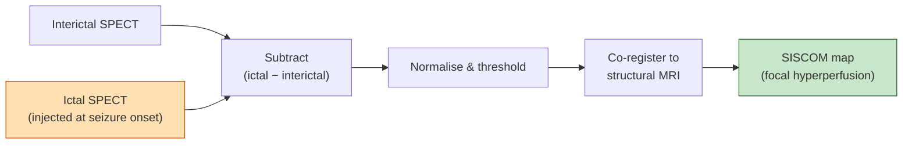

# Epilepsy

> The disease where imaging changes the surgical plan. A subtle FCD found on a re-read sends a patient from medical refractoriness to potential seizure freedom.

About a third of patients with epilepsy don't respond to medication. For the focal-onset subgroup, the question becomes: can we find the seizure focus, is it safely resectable, and will resecting it stop the seizures? That question is answered by imaging more than by any other modality, and the field has built a stack of dedicated protocols (HARNESS-MRI), dedicated lesion-detection projects (MELD), and dedicated functional-mapping techniques (fMRI, MEG, tractography) entirely around it.

For the neuroanatomy of focal cortical dysplasias, hippocampal sclerosis, and the broader epilepsy vocabulary, see [Fundamentals → Neuroscience & neurology](../fundamentals/foundations/neuroscience.md).

## Clinical picture

### Focal vs generalised

- **Focal epilepsy** — seizures originate in a discrete brain region. Surgical candidates if drug-resistant.
- **Generalised epilepsy** — bilateral simultaneous onset; surgical candidacy limited to specific syndromes (corpus callosotomy for drop attacks).
- **Combined focal-and-generalised** — both types in the same patient.
- **Unknown onset** — unclassified.

The ILAE 2017 classification ([Fisher 2017](https://doi.org/10.1111/epi.13670)) operationalises these terms.

### Common focal-epilepsy lesions

| Substrate | Notes |
|---|---|
| **Mesial temporal sclerosis (HS)** | Hippocampal atrophy, T2/FLAIR hyperintensity, loss of internal architecture. The most common surgical-epilepsy substrate. |
| **Focal cortical dysplasia (FCD)** | Malformation of cortical development; often subtle on MRI. ILAE classification: type I, II, III. |
| **Low-grade tumour** | DNET, ganglioglioma; often slow-growing, epileptogenic. |
| **Cavernoma** | Vascular malformation; SWI-hypointense "blooming". |
| **Post-traumatic / post-stroke gliosis** | Encephalomalacia + gliosis. |
| **Polymicrogyria, schizencephaly, periventricular nodular heterotopia** | Malformations of cortical development. |
| **Rasmussen encephalitis** | Progressive hemispheric atrophy. |
| **Hypothalamic hamartoma** | Gelastic seizures. |

### Surgical candidacy

The classical epilepsy-surgery workup ("phase 1"):

1. Clinical history + seizure semiology.
2. Scalp EEG (interictal + ictal).
3. High-resolution structural MRI.
4. Neuropsychology.
5. Often functional: PET (interictal FDG), SPECT (ictal/interictal subtraction), MEG, fMRI for language / memory lateralisation.

If non-invasive workup converges, surgery proceeds. If it doesn't, **invasive EEG** (subdural grids or stereo-EEG depth electrodes) is planned, again guided by imaging.

## High-resolution structural MRI: the HARNESS-MRI protocol

The single most consequential imaging change of the last decade in epilepsy. [Bernasconi et al., 2019](https://doi.org/10.1093/brain/awz030) released the ILAE-endorsed **HARNESS-MRI** (Harmonised Neuroimaging of Epilepsy Structural Sequences) recommendations: a minimum 3T protocol of high-resolution 3D T1, high-resolution 3D FLAIR, and high-resolution 2D coronal T2 — all isotropic where possible, all dedicated for FCD detection.

Adopting HARNESS-MRI in non-specialist centres roughly doubles FCD detection. Most "MR-negative" epilepsies are MR-negative because the scan didn't follow this protocol.

## FCD detection — the MELD project

Focal cortical dysplasias, especially FCD type II, are notoriously subtle: blurring of the grey-white junction, focal cortical thickening, transmantle sign. Many are missed on first read.

**MELD** (Multi-centre Epilepsy Lesion Detection) is the international project that systematised this. [Spitzer et al., 2022](https://doi.org/10.1093/brain/awac224) trained an MLP on FreeSurfer-derived surface features (cortical thickness, surface area, curvature, intrinsic curvature, sulcal depth, T1 intensity, FLAIR intensity) across multiple centres to detect FCDs as anomalies on each subject's surface, with a per-subject sensitivity of ~67% across all FCDs and substantially higher on confirmed FCD type II.

MELD is openly released; see the [MELD project site](https://meldproject.github.io/) and the [paper](https://doi.org/10.1093/brain/awac224).

## PET, SPECT, and SISCOM

When structural MRI is negative or ambiguous, functional imaging localises.

### Interictal FDG-PET

Hypometabolism in the epileptogenic zone interictally. Especially useful in temporal-lobe epilepsy. Read alongside MRI; sensitivity ~70-80% for TLE.

### Ictal / interictal SPECT and SISCOM

- **Interictal SPECT** — baseline perfusion.
- **Ictal SPECT** — injection of [99mTc]HMPAO or ECD at seizure onset, capturing peri-ictal hyperperfusion at the seizure focus.
- **SISCOM** (Subtraction Ictal SPECT Co-registered to MRI) — subtract interictal from ictal, normalise, threshold, overlay on MRI ([O'Brien 1998](https://doi.org/10.1212/WNL.50.2.445)).

*<small>SISCOM workflow. The ictal − interictal subtraction is the key signal.</small>*

SISCOM workflow requires fast, reliable injection at seizure onset, so it's only practical in dedicated epilepsy monitoring units.

## MEG for spike localisation

Magnetoencephalography measures the magnetic field from intracellular postsynaptic currents in pyramidal neurons. Dipole localisation of interictal spikes can localise the irritative zone with millimetre accuracy when spikes occur during a recording session. MEG complements EEG: MEG is sensitive to tangential dipoles (sulcal walls), EEG to radial.

## fMRI for language and memory lateralisation

Historically, the **Wada test** (intracarotid amobarbital) determined which hemisphere is language-dominant. fMRI has largely replaced it. Language tasks (verbal fluency, sentence comprehension, semantic decision) produce robust lateralised activation in inferior frontal gyrus and posterior temporal cortex. Memory tasks (scene encoding) lateralise to medial temporal lobe and predict postoperative memory decline after temporal lobectomy ([Binder 2008](https://doi.org/10.1212/01.wnl.0000319699.20681.65)).

## Tractography for surgical planning

DWI tractography reconstructs:

- **Optic radiation** — to plan temporal-lobe resection without producing Meyer's-loop visual-field defects.
- **Corticospinal tract** — to avoid motor deficits near central-region resections.
- **Arcuate / SLF** — to avoid language-tract injury.

See [Fundamentals → DWI](../fundamentals/sequences/dwi.md) for the underlying diffusion methodology.

## Pipelines

| Tool | Use |
|---|---|
| **MELD classifier** | FCD detection on FreeSurfer surfaces ([Spitzer 2022](https://doi.org/10.1093/brain/awac224)) |
| **FreeSurfer + ASHS** | Cortical surfaces + hippocampal subfields, foundation for MELD and HS quantification |
| **recon-all-clinical** | When clinical T1 / FLAIR doesn't satisfy classical recon-all |
| **NiBabies / dHCP / Infant-FreeSurfer** | Paediatric / neonatal cohorts |
| **fMRIPrep** | Preprocessing for fMRI lateralisation tasks |
| **QSIPrep + MRtrix3** | Tractography for surgical planning |
| **AnatomicuT, Lead-DBS for SEEG** | Electrode-contact localisation for stereo-EEG |
| **EZTrack / mne-python** | MEG source localisation |
| **EPILEPSIAE / ENIGMA-Epilepsy pipelines** | Standardised cohort processing |

### Paediatric and fetal considerations

- Neonatal myelination changes T1 contrast; classical adult priors fail. Use developmental priors / dedicated tools (NiBabies, dHCP).
- Fetal MRI requires motion-corrected super-resolution reconstruction (NeSVoR, SVRTK).
- Tuberous-sclerosis-related tubers, periventricular nodular heterotopia, and hemimegalencephaly are common paediatric epilepsy substrates with different imaging signatures and surgical strategies.

## Datasets

| Dataset | Description |
|---|---|
| **ENIGMA-Epilepsy** | Meta-analytic cohort; large-scale structural and DTI ([Whelan 2018](https://doi.org/10.1093/brain/awx341)) |
| **MELD cohort** | Multi-site FCD dataset for the MELD classifier |
| **EPILEPSIAE** | Long-term EEG database for seizure prediction |
| **HCP-Epilepsy / Epilepsy Connectome Project** | Multimodal connectivity in TLE |
| **OpenNeuro epilepsy datasets** | Several SEEG and EEG-fMRI datasets |

## Open questions

- **FCD type II vs III differentiation on imaging.** Type II (especially IIb with balloon cells) has the most characteristic MR features; type III (FCD adjacent to another lesion like HS) is harder.
- **MR-negative epilepsy localisation.** Where every conventional imaging is negative, the field is pushing 7T, gamma-band MEG, EEG-fMRI, machine-learning on subtle features.
- **Deep-learning FCD detection beyond MELD.** Volumetric / multi-modal models, integration of FLAIR + T1 + tissue contrast, transformers on cortical meshes — active.
- **Personalised connectome-based surgical planning.** Use the patient's own DWI + fMRI to predict postoperative deficits.
- **Seizure-prediction biomarkers.** Imaging-based prediction of seizure occurrence (combined with intracranial EEG).
- **Quantifying epileptogenicity** rather than just detecting lesions — bridging from "what's anomalous on MRI" to "what's driving the seizures".
- **Paediatric-specific pipelines for epileptogenic malformations** — different developmental contexts demand different priors.
- **Generalised-epilepsy imaging endophenotypes** — IGE has subtle thalamo-cortical changes; surgical relevance limited, but biomarker potential for trials.

## References

1. **Bernasconi A, Cendes F, Theodore WH, et al.** Recommendations for the use of structural magnetic resonance imaging in the care of patients with epilepsy: A consensus report from the ILAE Neuroimaging Task Force. *Brain.* 2019;142(6):1782-1799. [doi:10.1093/brain/awz030](https://doi.org/10.1093/brain/awz030) (HARNESS-MRI)
2. **Spitzer H, Ripart M, Whitaker K, et al.** Interpretable surface-based detection of focal cortical dysplasias: a Multi-centre Epilepsy Lesion Detection study. *Brain.* 2022;145(11):3859-3871. [doi:10.1093/brain/awac224](https://doi.org/10.1093/brain/awac224) (MELD)
3. **Fisher RS, Cross JH, French JA, et al.** Operational classification of seizure types by the International League Against Epilepsy. *Epilepsia.* 2017;58(4):522-530. [doi:10.1111/epi.13670](https://doi.org/10.1111/epi.13670)
4. **O'Brien TJ, So EL, Mullan BP, et al.** Subtraction ictal SPECT co-registered to MRI improves clinical usefulness of SPECT in localizing the surgical seizure focus. *Neurology.* 1998;50(2):445-454. [doi:10.1212/WNL.50.2.445](https://doi.org/10.1212/WNL.50.2.445)
5. **Binder JR, Sabsevitz DS, Swanson SJ, et al.** Use of preoperative functional MRI to predict verbal memory decline after temporal lobe epilepsy surgery. *Neurology.* 2008;71(23):1843-1850. [doi:10.1212/01.wnl.0000319699.20681.65](https://doi.org/10.1212/01.wnl.0000319699.20681.65)
6. **Whelan CD, Altmann A, Botía JA, et al.** Structural brain abnormalities in the common epilepsies assessed in a worldwide ENIGMA study. *Brain.* 2018;141(2):391-408. [doi:10.1093/brain/awx341](https://doi.org/10.1093/brain/awx341)
7. **Blümcke I, Spreafico R, Haaker G, et al.** Histopathological findings in brain tissue obtained during epilepsy surgery. *N Engl J Med.* 2017;377(17):1648-1656. [doi:10.1056/NEJMoa1703784](https://doi.org/10.1056/NEJMoa1703784)
8. **Wagstyl K, Adler S, Pimpel B, et al.** Planning stereoelectroencephalography using automated lesion detection: retrospective feasibility study. *Epilepsia.* 2020;61(7):1406-1416. [doi:10.1111/epi.16574](https://doi.org/10.1111/epi.16574)

## Where to next

- The MELD project repository and documentation: [meldproject.github.io](https://meldproject.github.io/).
- For DWI / tractography fundamentals used in surgical planning, see [Fundamentals → DWI](../fundamentals/sequences/dwi.md).
- For SWI / GRE detection of cavernomas and microbleeds, see [Fundamentals → SWI](../fundamentals/sequences/swi.md).
- For FreeSurfer-derived surface processing that MELD builds on, see [Landmark → Major pipelines](../landmark/pipelines.md).
- For atlases used in language-laterality and tractography studies, see [Landmark → Atlases and templates](../landmark/atlases.md).
