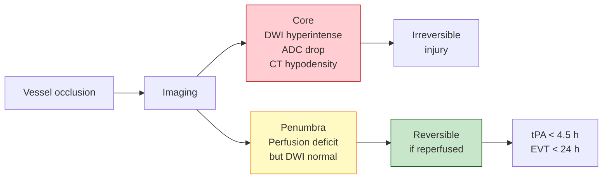

# Stroke & traumatic brain injury

> The most time-critical neuroimaging there is. A pipeline that's right but slow is wrong; a pipeline that's fast but wrong sends people to procedures they shouldn't have.

Acute stroke imaging is the single best example of imaging *directly* selecting a treatment. DWI / perfusion-CT findings decide whether a patient gets tPA, thrombectomy, or neither — within minutes, on the basis of pictures that did not exist a generation ago. Chronic stroke and TBI imaging then take over a much longer timescale: lesion segmentation, lesion-symptom mapping, plasticity, outcome prediction.

For the underlying vocabulary (ischemic vs haemorrhagic, DWI restriction, MTBI), see [Fundamentals → Neuroscience & neurology](../fundamentals/foundations/neuroscience.md). For DWI physics, see [Fundamentals → DWI](../fundamentals/sequences/dwi.md).

## Acute ischemic stroke

### The core / penumbra concept

When a vessel occludes, the territory it feeds is divided into:

- **Infarct core** — irreversibly damaged tissue. Restricted diffusion (DWI bright, ADC dark) within minutes; CT hypodensity later.
- **Penumbra** — at-risk but salvageable tissue, perfused below normal but above the irreversible-injury threshold. Visible as perfusion-DWI (or perfusion-CT) mismatch.

The clinical aim is **save the penumbra**. The bigger the mismatch, the more there is to save.

*<small>Core / penumbra and the treatment-selection logic. EVT = endovascular thrombectomy.</small>*

### Sequences and quantification

| Modality | What it shows | Cut-off / interpretation |
|---|---|---|
| **DWI (b ≈ 1000)** | Restricted diffusion = cytotoxic oedema | Hyperintense within minutes |
| **ADC map** | Quantitative diffusion | < ~620 × 10⁻⁶ mm²/s often used as core threshold |
| **FLAIR** | DWI/FLAIR mismatch = recent stroke (≤ ~4.5 h) | Used when last-known-well time is unknown ([WAKE-UP](https://doi.org/10.1056/NEJMoa1804355)) |
| **GRE / SWI** | Haemorrhage; clot susceptibility | Acute haematoma blooms; can show "clot sign" |
| **DSC perfusion** | Tmax, MTT, CBF, CBV | Tmax > 6 s ≈ tissue at risk |
| **ASL perfusion** | Quantitative CBF | Used where contrast contraindicated |
| **CT-perfusion** | CBF, CBV, Tmax | Most common in acute workflow because faster than MRI |
| **CT-angiography** | LVO identification | M1, ICA terminus, basilar = thrombectomy candidates |

### Treatment-selection trials and windows

The trials that defined modern stroke workflow:

| Trial | Year | What it established |
|---|---|---|
| **NINDS** | 1995 | IV tPA within 3 h |
| **ECASS III** | 2008 | IV tPA up to 4.5 h ([Hacke 2008](https://doi.org/10.1056/NEJMoa0804656)) |
| **MR CLEAN, ESCAPE, SWIFT-PRIME, EXTEND-IA, REVASCAT** | 2015 | Mechanical thrombectomy up to 6 h in LVO |
| **DAWN** | 2018 | Thrombectomy up to 24 h with imaging-defined small core ([Nogueira 2018](https://doi.org/10.1056/NEJMoa1706442)) |
| **DEFUSE-3** | 2018 | Thrombectomy 6–16 h with perfusion mismatch ([Albers 2018](https://doi.org/10.1056/NEJMoa1713973)) |
| **WAKE-UP** | 2018 | tPA in unknown-onset based on DWI/FLAIR mismatch |
| **EXTEND** | 2019 | tPA 4.5–9 h with perfusion mismatch |

The DAWN / DEFUSE-3 expansion of the thrombectomy window from 6 h to 24 h *based on imaging mismatch* is one of the most consequential imaging-driven trial results in neurology.

### Acute-stroke software

Automated post-processing for core / penumbra is now standard of care.

| Tool | Origin | Notes |
|---|---|---|
| **RAPID** (iSchemaView) | Stanford | The dominant commercial CT-perfusion / DWI tool; used in DEFUSE-3, DAWN |
| **OleaSphere** | Olea Medical | Commercial multi-modality post-processing |
| **Brainomix e-CTP, e-ASPECTS** | Brainomix | Commercial, deployed widely in EU/UK |
| **Viz.ai** | Viz.ai | LVO detection from CTA + workflow / paging |
| **CT-Perfusion-Stroke-Toolkit, Brain CTP** | Open-source | Research replications of RAPID-style quantification |
| **DeepSymNet, several U-Net variants** | Open-source | LVO detection / core segmentation in research |

The open-source side lags commercial mostly on regulatory / certification; algorithmically the gap is closing rapidly.

## Chronic stroke

### Lesion segmentation

A chronic stroke lesion on T1/FLAIR is a CSF-filled cavity surrounded by gliosis. Segmentation pipelines:

- **LINDA, LesionGNB, LST** — older toolbox-era methods.
- **nnU-Net** ([Isensee 2021](https://doi.org/10.1038/s41592-020-01008-z)) — current standard for almost any new lesion-segmentation task; winner of ISLES challenges across multiple editions.
- **PALS / NiiStat** — for downstream lesion-symptom mapping.

### Lesion-symptom mapping

Two main families:

- **VLSM (voxel-based lesion-symptom mapping)** — voxel-wise statistics on (lesion present?) × (behaviour). [Bates et al., 2003](https://doi.org/10.1038/nn1050).
- **SCCAN (sparse canonical correlation analysis network)** — multivariate alternative that handles vascular spatial constraints better. [Pustina et al., 2018](https://doi.org/10.1002/hbm.23934).
- Modern variants: BOLT, support-vector regression LSM, disconnectome-based LSM that uses normative tractography to project a lesion into white-matter terms.

### Plasticity and recovery

Diffusion / functional changes contralesionally, often in homotopic motor cortex, correlate with motor recovery. The **constraint-induced therapy** literature has been the largest research-fMRI use case. Predicting individual recovery from acute imaging remains hard.

## Traumatic brain injury

TBI is heterogeneous on imaging: focal injuries are obvious; diffuse injuries can be invisible on conventional sequences.

### Focal TBI

- **Contusions** — bruises, classically frontal poles, anterior temporal lobes (where brain hits skull during deceleration). FLAIR hyperintense; haemorrhagic component on SWI/GRE.
- **Subdural / epidural haematoma** — extra-axial blood, surgical decisions.
- **Subarachnoid haemorrhage** — bleeding in subarachnoid space.
- **Diffuse axonal injury (DAI)** — microhaemorrhages at grey-white interface, corpus callosum, brainstem, classically on SWI. Often the most clinically meaningful finding in moderate TBI.

See [Fundamentals → SWI](../fundamentals/sequences/swi.md) for the susceptibility-imaging basis of microhaemorrhage detection.

### Mild TBI ("concussion")

The biggest clinical-imaging gap. Conventional MRI is almost always negative. Quantitative DTI shows reduced FA, increased MD in white-matter tracts (corpus callosum, internal capsule, corticospinal tract). Single-subject interpretation remains hard because effect sizes overlap with healthy variability.

### Chronic TBI / CTE

- Atrophy patterns, especially of hippocampus, frontal / temporal cortex.
- Tau-PET attempts: [18F]flortaucipir signal in CTE has been claimed but is contested.
- Microbleed accumulation on SWI as a marker of repetitive impact exposure.

## Datasets

| Dataset | Description | Reference |
|---|---|---|
| **ISLES** (Ischemic Stroke Lesion Segmentation) | MICCAI challenge series; acute and sub-acute MRI/CT | [Maier 2017](https://doi.org/10.1016/j.media.2016.07.009) |
| **ATLAS R2.0** | Anatomical Tracings of Lesions After Stroke; large open chronic-stroke T1 + manual lesion masks | [Liew 2022](https://doi.org/10.1038/s41597-022-01401-7) |
| **TRACK-TBI** | North American multi-site prospective TBI cohort, multimodal | [Yue 2013](https://doi.org/10.1089/neu.2012.2802) |
| **CENTER-TBI** | European counterpart to TRACK-TBI | [Maas 2015](https://doi.org/10.1227/NEU.0000000000000575) |
| **MR CLEAN Registry** | Real-world Dutch thrombectomy cohort | Used heavily for outcome modelling |
| **AISD** (Acute Ischemic Stroke Dataset) | Open Chinese acute-stroke imaging | Open |

## Pipelines

| Pipeline | Use |
|---|---|
| **nnU-Net** | Lesion segmentation; default winner across ISLES editions |
| **BLAST-CT** | Lesion seg in TBI / haemorrhage on CT ([Monteiro 2020](https://doi.org/10.1016/S2589-7500(20)30085-6)) |
| **LesionMap / LST** | FLAIR lesion segmentation, also used in MS |
| **Brain CTP** | Open-source CT-perfusion quantification |
| **NiiStat / PALS** | Lesion-symptom mapping |
| **disconnectome / Lesion Quantification Toolkit (LQT)** | Project lesion into normative tractography to estimate white-matter disconnection |
| **fMRIPrep / QSIPrep / aslprep** | Standard derivatives for the multimodal TBI cohorts |
| **recon-all-clinical** | Cortical morphology on chronic stroke / TBI clinical scans |

## Open questions

- **Late-window patient selection.** Beyond DAWN/DEFUSE-3, who benefits at 24+ hours? Slow progressors with persistent collaterals are an active hypothesis.
- **Blood-marker + imaging fusion.** GFAP, UCH-L1, NfL plus imaging for prognosis in TBI; promising but not yet standard.
- **MTBI imaging biomarkers.** Single-subject MTBI diagnosis from imaging is the Holy Grail; DTI population-level effects don't yet translate to individual decisions.
- **Outcome prediction at 90 days / 1 year.** Many models predict mRS at 90 days from acute imaging; few generalise across sites.
- **Brain CT-perfusion equivalency to MRI.** Workflow trade-off: CT is faster and more available, MRI more accurate. Quantifying the trade-off systematically is ongoing.
- **Standardisation of ASPECTS-equivalent quantitative core estimation.** Different vendors produce different core volumes for the same scan; harmonisation matters for treatment-selection.
- **Open-source equivalents to RAPID.** Regulatory pathway, not algorithmic, is the bottleneck.
- **Long-term TBI outcome prediction.** CENTER-TBI / TRACK-TBI longitudinal arms are starting to enable this but cohorts are still young.
- **Chronic-stroke plasticity / recovery prediction.** Better individual-level recovery curves from acute and sub-acute imaging.

## References

1. **Hacke W, Kaste M, Bluhmki E, et al.** Thrombolysis with alteplase 3 to 4.5 hours after acute ischemic stroke. *N Engl J Med.* 2008;359(13):1317-1329. [doi:10.1056/NEJMoa0804656](https://doi.org/10.1056/NEJMoa0804656)
2. **Nogueira RG, Jadhav AP, Haussen DC, et al.** Thrombectomy 6 to 24 hours after stroke with a mismatch between deficit and infarct. *N Engl J Med.* 2018;378(1):11-21. [doi:10.1056/NEJMoa1706442](https://doi.org/10.1056/NEJMoa1706442) (DAWN)
3. **Albers GW, Marks MP, Kemp S, et al.** Thrombectomy for stroke at 6 to 16 hours with selection by perfusion imaging. *N Engl J Med.* 2018;378(8):708-718. [doi:10.1056/NEJMoa1713973](https://doi.org/10.1056/NEJMoa1713973) (DEFUSE-3)
4. **Thomalla G, Simonsen CZ, Boutitie F, et al.** MRI-guided thrombolysis for stroke with unknown time of onset. *N Engl J Med.* 2018;379(7):611-622. [doi:10.1056/NEJMoa1804355](https://doi.org/10.1056/NEJMoa1804355) (WAKE-UP)
5. **Maier O, Menze BH, von der Gablentz J, et al.** ISLES 2015 — A public evaluation benchmark for ischemic stroke lesion segmentation. *Med Image Anal.* 2017;35:250-269. [doi:10.1016/j.media.2016.07.009](https://doi.org/10.1016/j.media.2016.07.009)
6. **Liew SL, Lo BP, Donnelly MR, et al.** A large, curated, open-source stroke neuroimaging dataset to improve lesion segmentation algorithms. *Sci Data.* 2022;9:320. [doi:10.1038/s41597-022-01401-7](https://doi.org/10.1038/s41597-022-01401-7) (ATLAS R2.0)
7. **Bates E, Wilson SM, Saygin AP, et al.** Voxel-based lesion-symptom mapping. *Nat Neurosci.* 2003;6(5):448-450. [doi:10.1038/nn1050](https://doi.org/10.1038/nn1050)
8. **Isensee F, Jaeger PF, Kohl SAA, et al.** nnU-Net: a self-configuring method for deep learning-based biomedical image segmentation. *Nat Methods.* 2021;18:203-211. [doi:10.1038/s41592-020-01008-z](https://doi.org/10.1038/s41592-020-01008-z)
9. **Monteiro M, Newcombe VFJ, Mathieu F, et al.** Multiclass semantic segmentation and quantification of traumatic brain injury lesions on head CT using deep learning. *Lancet Digital Health.* 2020;2(6):e314-e322. [doi:10.1016/S2589-7500(20)30085-6](https://doi.org/10.1016/S2589-7500(20)30085-6) (BLAST-CT)
10. **Yue JK, Vassar MJ, Lingsma HF, et al.** Transforming Research and Clinical Knowledge in Traumatic Brain Injury (TRACK-TBI) pilot. *J Neurotrauma.* 2013;30(22):1831-1844. [doi:10.1089/neu.2012.2802](https://doi.org/10.1089/neu.2012.2802)
11. **Maas AIR, Menon DK, Steyerberg EW, et al.** Collaborative European NeuroTrauma Effectiveness Research in Traumatic Brain Injury (CENTER-TBI). *Neurosurgery.* 2015;76(1):67-80. [doi:10.1227/NEU.0000000000000575](https://doi.org/10.1227/NEU.0000000000000575)
12. **Pustina D, Coslett HB, Ungar L, et al.** Enhanced estimations of post-stroke aphasia severity using stacked multimodal predictions. *Hum Brain Mapp.* 2018;39(11):4267-4282. [doi:10.1002/hbm.23934](https://doi.org/10.1002/hbm.23934)

## Where to next

- For the physics of DWI / ADC that underpin acute-stroke decisions, see [Fundamentals → DWI](../fundamentals/sequences/dwi.md).
- For susceptibility-based detection of microbleeds and DAI, see [Fundamentals → SWI](../fundamentals/sequences/swi.md).
- For ISLES / ATLAS / TRACK-TBI access details, see [Landmark → Reference datasets](../landmark/datasets.md).
- For nnU-Net and downstream segmentation infrastructure, see [Landmark → Major pipelines](../landmark/pipelines.md).
