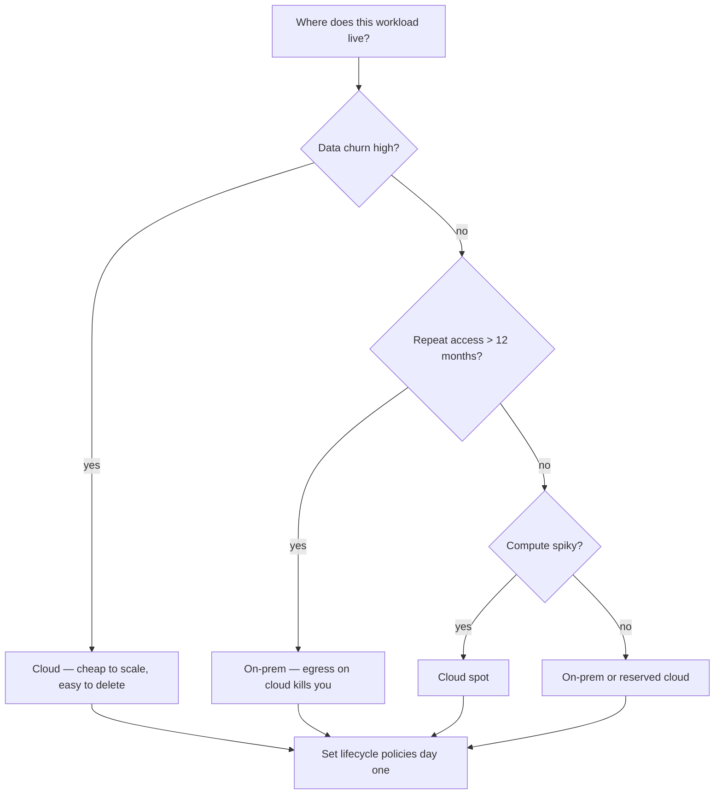

# Cloud (AWS, GCP, Azure)

> When to leave HPC for the cloud, and how to do it without lighting money on fire.

## When to use cloud

- **Your institution doesn't have an HPC** with the resources you need.
- **You need elastic capacity** — a one-off backfill of 5000 subjects in a week.
- **You're collaborating across institutions** — cloud is the lowest-friction common ground.
- **Your data already lives there** (UK Biobank, S3-hosted OpenNeuro).

## When to stay on HPC

- Most academic work; HPC compute-hours are already paid for.
- Long-running interactive analysis (cloud instances cost while idle).
- Data > 10 TB that would cost a fortune to transfer in and out.

## The three substrates

### Batch compute

- **AWS Batch** — managed Slurm-like queue on top of EC2 / Fargate.
- **GCP Batch** — similar, simpler interface.
- **Azure Batch** — similar.

Map your `sbatch` script to a Batch job definition. Same mental model.

### Kubernetes

- **EKS / GKE / AKS** — managed Kubernetes. Argo Workflows, Nextflow's K8s executor, Snakemake's K8s integration.
- More moving parts; pays off when the rest of your stack is K8s anyway.

### Serverless

- **AWS Lambda / GCP Cloud Run** — sub-minute jobs only; useful for lightweight ingestion or reporting steps.

## The egress trap

Cloud providers charge ~$0.09/GB to move data *out*. Transferring 10 TB to your laptop = $900. Common mitigations:

- **Compute in the cloud, don't download.** Keep raw data, derivatives, and analyses all in the same region.
- **Use a cloud-attached workstation** when you do need interactive work (an EC2 instance running JupyterLab).
- **Egress credits** — some providers credit egress for academic / non-profit users; ask.

## Storage tiers

- **S3 Standard / GCS Standard** — read-anytime, costs ~$0.023/GB-month.
- **S3 Intelligent-Tiering** — automatic tiering; usually the best default.
- **S3 Glacier / Coldline** — archive; cheap to store, slow to read. For raw scanner output you might never touch.

Set lifecycle policies on day one. Otherwise the bill grows monotonically.

## The cost math

Cloud bills look mysterious until you write down the unit prices and multiply. Four numbers dominate every neuroimaging cloud budget: **storage**, **compute**, **egress**, and **availability premium** (on-demand vs spot vs reserved). Below: the prices, the formulas, and worked examples. Numbers are list-price [AWS pricing](https://aws.amazon.com/pricing/) snapshots; [GCP](https://cloud.google.com/pricing) and [Azure](https://azure.microsoft.com/en-us/pricing/) are within ±20% on every line.

### Storage costs

| Tier | $ / GB·month | Read latency | Typical use |
|---|---|---|---|
| **S3 Standard** | $0.023 | ms | Active derivatives |
| **S3 Infrequent Access** | $0.0125 | ms (retrieval fee) | Year-2 raw |
| **S3 Glacier Flexible** | $0.0036 | minutes – hours | Long-term raw |
| **S3 Glacier Deep Archive** | $0.00099 | 12 h restore | Compliance / never-touch |
| **EBS gp3 (block)** | $0.08 | sub-ms | Active compute volumes |
| **On-prem POSIX-NFS (academic HPC)** | $0.001 – 0.005 | sub-ms | Already-paid storage |

Worked example: 200 GB DWI cohort (100 subjects × 2 GB).

$$
\text{S3 Standard cost / year} = 200 \text{ GB} \times \$0.023 / \text{GB·month} \times 12 = \$55.20
$$

Same data on S3 IA: $30.00/yr. On Glacier Deep Archive: $2.38/yr. On HPC NFS at the academic-internal rate: $2.40 – $12.00/yr. The *order of magnitude* of storage cost varies by tier, not by cloud vendor.

### Compute costs

| Instance | vCPU / GPU | On-demand $/h | Spot $/h | Notes |
|---|---|---|---|---|
| `c5.4xlarge` | 16 vCPU, 32 GB | $0.68 | ~$0.20 | CPU workhorse for fMRIPrep / QSIPrep |
| `r5.4xlarge` | 16 vCPU, 128 GB | $1.01 | ~$0.30 | Memory-heavy (eddy, big affine) |
| `g4dn.xlarge` | 1 T4 GPU | $0.526 | ~$0.18 | FastSurfer, MedSAM, light DL |
| `g5.2xlarge` | 1 A10G GPU | $1.21 | ~$0.45 | Larger DL training |
| `p4d.24xlarge` | 8 A100 40 GB | $32.77 | ~$10 | Foundation-model training |
| **HPC Slurm (academic)** | per node | $0.001 – 0.01 / CPU·h (amortised) | n/a | Already paid |

Worked example: fMRIPrep on 100 subjects, ~6 CPU-hours each = 600 CPU-hours total.

$$
\text{cost}_{\text{on-demand}} = \frac{600 \text{ CPU·h}}{16 \text{ vCPU}} \times \$0.68/h = \$25.50
$$

Per subject: $0.255. Switch to spot (`c5.4xlarge` at ~$0.20/h):

$$
\text{cost}_{\text{spot}} = \frac{600}{16} \times \$0.20 = \$7.50
$$

— **70% saving** for trivial code changes (retry-on-interruption). The same workload on already-paid HPC is effectively zero marginal cost; on a costed-out HPC core-hour ($0.005), it's $3.

### Egress — the silent killer

AWS S3 → public internet: **$0.09 / GB** for the first 10 TB / month (cheaper above, but never zero). Within the same region (S3 → EC2 same region): **$0.00**.

$$
\text{egress\_cost} = \text{data\_GB} \times \$0.09
$$

Worked examples:

- Pulling 5 TB of preprocessed data to your laptop once: $450 (one-time).
- Streaming a 100 MB analysis result to a collaborator daily for a year: 36.5 GB × $0.09 = $3.29 (negligible).
- Cross-region replication of a 2 TB cohort: 2000 × $0.02 = $40 (cross-region is cheaper than to-internet).

**Mitigations:**

- **Keep compute in the same region as storage.** Same-region transfer is free.
- **Pre-aggregate before egress.** A 200 GB connectome cohort becomes a 50 MB Parquet of metrics; ship the Parquet.
- **Snowball / Direct Connect** for one-time multi-TB moves; egress cost amortises below $0.02/GB.
- **Egress credits** — most providers offer them to academic / non-profit accounts; ask.

### Reserved vs on-demand vs spot

Three pricing modes:

- **On-demand** — pay-as-you-go list price.
- **Reserved / Committed Use** — 1- or 3-year commitment for ~30 – 50% discount.
- **Spot / preemptible** — bid for unused capacity at ~70% discount; provider can reclaim with 2 min notice.

The spot question is: does the expected cost of interruption beat the savings? Approximate model:

$$
\text{expected cost / min} = \text{base rate} \times \left(1 + r_{\text{int}} \times \frac{t_{\text{recov}}}{t_{\text{total}}}\right)
$$

where $r_{\text{int}}$ is the per-job interruption probability and $t_{\text{recov}} / t_{\text{total}}$ is the fraction of the run lost on each interruption (checkpoint frequency).

Worked example: 8 h fMRIPrep run, spot interruption probability $r_{\text{int}} = 0.05$, no checkpointing so $t_{\text{recov}} = 8h$, $t_{\text{total}} = 8h$:

$$
\text{effective premium} = 1 + 0.05 \times \frac{8}{8} = 1.05
$$

So spot at $0.20/h with this profile effectively costs $0.21/h — still 69% under on-demand. Add a one-line checkpoint every 30 min and $t_{\text{recov}} / t_{\text{total}} \approx 0.06$, dropping the premium to ~0.3%. **Spot + checkpointing is almost always the right answer for batch DWI / fMRI workloads.**

### Decision tree: on-prem vs cloud

Use the [AWS Pricing Calculator](https://aws.amazon.com/calculator/) (and [FAIR cost calculator](https://aws.amazon.com/calculator/) for academic estimates) to sanity-check before committing to architecture. A worked cohort-scale storage and compute walkthrough is in [Cohort-scale pipelines](../data-engineering/advanced/cohort-scale.md).

## Cost monitoring

- **AWS Cost Explorer** / **GCP Cost Report** — daily breakdown by service.
- **Budgets and alerts** — set a monthly limit and email yourself when you cross 80%.
- **Tagging** — tag every resource with project / user. The bill becomes auditable.

## Where to next

[GPUs and accelerators](gpus.md) — the hottest, most expensive cloud resource.
