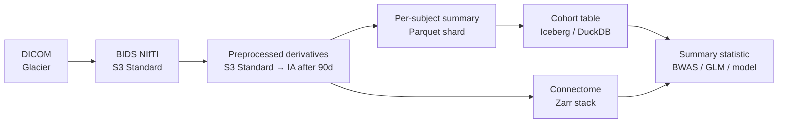

# Cohort-scale data engineering for neuroimaging

> What changes when N=10 becomes N=10,000: the DE patterns that keep UK-Biobank-scale neuroimaging pipelines from collapsing.

You can run a 50-subject study off a laptop and a tidy `submit.sh`. You cannot run a 50,000-subject study off anything that looks remotely like that. Somewhere between those two scales every assumption in your pipeline breaks — storage layout, scheduling, recovery, joins, even what "done" means. This page is the playbook for that transition, written for engineers who already know how to build pipelines and need to know what *neuroimaging at cohort scale* demands on top.

Course map: when scale becomes the problem → sharding strategies → derivatives storage → long-running jobs → partial-results recovery → BWAS readiness → cross-modal joins → anti-patterns → tools → references.

## Learning objectives

By the end of this page you should be able to:

- Recognise the qualitative regime shifts that happen as N crosses 100, 1000, and 10,000 subjects.
- Pick the right shard axis (subject, site, sequence, ROI) for a given pipeline stage.
- Design a tiered-storage layout for raw, BIDS, derivatives, cohort tables, and connectomes.
- Make a 24-hour per-subject pipeline survive preemption via checkpointing and idempotent stages.
- Plan for the failure rates that actually show up at N=10k and engineer salvage batches around them.
- Audit a cohort against a BWAS-readiness checklist before any modelling starts.

## When N becomes the problem

The scale you operate at silently dictates your architecture. At **N=10** you debug each subject by hand and remember their quirks. At **N=100** you build a `runs` table because you can't hold the cohort in your head. At **N=1000** you adopt structured observability — dashboards, SLOs, automatic alerting — because the rate of failure events exceeds your ability to triage them one at a time. At **N=10,000 the design itself must change**: any per-subject lookup that touches the network is too slow, any single-machine reducer won't fit, any pipeline whose total runtime is measured in *days* won't finish before the next batch arrives.

The [Marek 2022 BWAS paper](https://doi.org/10.1038/s41586-022-04492-w) (cross-link [analysis/reliability.md](../../analysis/reliability.md)) made N=10,000+ the new credibility floor for brain-behaviour studies — anything smaller produced effect sizes that didn't replicate. The reference cohorts everyone now compares against are [UK Biobank](https://www.ukbiobank.ac.uk/) (~50k imaged of 500k total), [ABCD](https://abcdstudy.org/) (~12k adolescents with longitudinal MRI), [HCP-LifeSpan](https://www.humanconnectome.org/) (~5k pooled across HCP-Aging, HCP-Development, HCP-YA), and [All of Us](https://allofus.nih.gov/) (~1M consented, ~100k imaging-eligible). Access details for the big three are on the [landmark datasets page](../../landmark/datasets.md).

The qualitative regime shifts to keep in mind:

| Axis | N≈100 | N≈1,000 | N≈10,000 |
| --- | --- | --- | --- |
| **Data volume** | ~200 GB | ~2 TB | ~20–100 TB |
| **Compute** | CPU-weeks | CPU-months | CPU-years (parallelised to weeks) |
| **Orchestration** | a few Slurm arrays | a workflow engine + a runs table | cohort-aware pipelines with backpressure, partial-failure salvage, and lifecycle policies |
| **Failure budget** | inspect each one | triage by category | actuarial — *expect* 5–15% to fail per stage |

## Sharding strategies — what to split by, when

Embarrassingly parallel is the gift neuroimaging gives you. Every per-subject preprocessing step has no cross-subject state, so the question is rarely *can I parallelise* but *what axis do I shard on*.

- **Shard by subject** — the default. Every BIDS-app (fMRIPrep, QSIPrep, sMRIPrep, FreeSurfer, MRIQC) supports `--participant-label`. No cross-subject state, no joins until the reducer, infinite horizontal scaling. Use this unless you have a specific reason not to.
- **Shard by site / batch** — when site harmonisation is in the loop. Keep all subjects from a site on the same compute node (or at least the same job-array partition) so [neuroCombat](https://github.com/Jfortin1/neuroCombat) or sMRIPrep-style intra-site fits can pool. You trade some throughput for the ability to compute site-level statistics without a shuffle.
- **Shard by sequence** — DWI, fMRI, and T1 processed in parallel for the same subject. Useful when sequence pipelines have very different runtimes — FreeSurfer takes 8 h, MRIQC takes 20 min, and you want both done in the wall-clock time of the slowest. Adds a join on the back end.
- **Shard by ROI / parcellation** — for connectome-level analyses where each ROI's downstream computation is independent. Rare, but the right pattern for graph-neural-network pretraining on UK Biobank where every (subject, ROI) tuple is a training example.

Decision table:

| Pipeline stage | Shard axis | Why |
| --- | --- | --- |
| dcm2niix conversion | subject | embarrassingly parallel; no shared state |
| BIDS validation | subject (cohort-rollup) | per-subject + a cohort-level pass |
| fMRIPrep / QSIPrep / sMRIPrep | subject | designed for it |
| FreeSurfer `recon-all` | subject | designed for it |
| neuroCombat harmonisation | site | needs per-site distribution fits |
| MRIQC group report | cohort (single reducer) | aggregates IQMs across all subjects |
| Connectome construction | subject | per-subject tractography |
| GNN / connectome model training | (subject, ROI) | finer-grained parallelism for big models |
| Voxelwise BWAS | voxel / vertex × subject | fits the linear model independently per voxel |

## Storage tiering for cohort-scale derivatives

At N=10k the storage bill is real, and the read pattern matters more than the size. Plan tiers around *how often each artefact is re-read*, not how big it is.

| Artefact | Tier | Format | Rationale |
| --- | --- | --- | --- |
| Raw DICOMs | Archival ([S3 Glacier Deep Archive](https://aws.amazon.com/s3/storage-classes/glacier/) / on-prem tape) | DICOM tar | Re-read essentially never after BIDS conversion. Keep for provenance + audit. |
| BIDS NIfTI | Warm (S3 Standard / NFS active tier) | NIfTI + JSON | Re-read maybe twice in a study lifetime — on initial preprocessing and on a major version bump. |
| Derivatives (preprocessed BOLD, FA maps, surfaces) | Warm, then lifecycle | NIfTI / GIFTI / CIFTI | Write-once, read on every downstream analysis for ~90 days; lifecycle to IA after that. |
| Cohort tables (per-subject summary metrics) | Warm | Parquet / [Iceberg](https://iceberg.apache.org/) | Read on every query. Columnar lets you scan one column across 12k subjects in milliseconds. |
| Connectome matrices | Warm | per-subject NPZ *or* chunked [Zarr](https://zarr.dev/) / HDF5 stack | Zarr wins when you need chunked random access (e.g. "give me edge (i,j) across all subjects"); per-subject NPZ wins when most analyses load one subject at a time. |

Concrete numbers: cortical-thickness vectors at 360 vertices × float32 × 12,000 subjects = **17 MB** as a single Parquet file. DuckDB will load and pivot that in under a second on a laptop. The same data as 12,000 individual JSON files is unusable. *The format choice is the analysis throughput.*



A five-line DuckDB query over the cohort table is the everyday interface:

```python
import duckdb
con = duckdb.connect()
con.sql("""
    SELECT site, AVG(ct_lh_v0042) AS mean_thickness, COUNT(*) AS n
    FROM read_parquet('s3://cohort/gold/cortical_thickness/*.parquet')
    JOIN read_parquet('s3://cohort/gold/demographics.parquet') USING (subject_id)
    GROUP BY site
""").df()
```

## Long-running jobs — the 24h+ regime

fMRIPrep, QSIPrep, and FreeSurfer typically take 6–24 hours *per subject*. At N=10k that's >10 CPU-years of work in the naive serial case. Even parallelised across 100 nodes it's weeks of wall-clock time, during which every preempted job, every OOM, and every NFS hiccup costs real money. Three patterns are non-negotiable.

**Checkpointing as a first-class concern.** Every long-running pipeline must persist intermediate state in a way that resume-from-failure is possible. [fMRIPrep's `--output-spaces` and `--fs-no-reconall` skip logic](https://fmriprep.org/en/stable/usage.html) is the canonical worked example — it can pick up from a partial FreeSurfer run without redoing the cortical reconstruction. Custom pipelines must engineer the same property: an explicit `stage_done.json` marker per (subject, stage) and a skip-if-present gate around every stage. See [dwi-case-study.md §4.4–4.5](../dwi-case-study.md#44-idempotency-contract) for the idempotency contract that makes this work.

**Slurm requeue policies.** The combination of `--requeue` on the submission line, a `trap` for SIGTERM in the wrapper, and an atomic checkpoint-write in the Python pipeline is what keeps preempted jobs from restarting from scratch:

```bash
#!/bin/bash
#SBATCH --requeue
#SBATCH --signal=B:SIGTERM@120   # 120s warning before kill

# forward SIGTERM into the Python process so it can checkpoint
trap 'kill -TERM "$CHILD"; wait "$CHILD"' SIGTERM

python -m pipeline.run --subject "$SUBJECT" --stage "$STAGE" &
CHILD=$!
wait "$CHILD"
```

```python
# pipeline/run.py — atomic checkpoint write before exit
import signal, json, os, sys
from pathlib import Path

def _on_term(signum, frame):
    ckpt = {"stage": current_stage, "step": current_step, "subject": subject}
    tmp = Path(f"{ckpt_path}.tmp")
    tmp.write_text(json.dumps(ckpt))
    os.replace(tmp, ckpt_path)   # atomic rename
    sys.exit(0)

signal.signal(signal.SIGTERM, _on_term)
```

Skip this and every preemption is a full rerun. At 8 CPU-hours per fMRIPrep subject and 100 preemptions per week, that is real money on a cloud bill and real wall-clock on an HPC.

**Idempotency at scale.** Every pipeline operation must be safe to re-run. Skip-if-output-exists logic must validate content (input hash + container digest + code SHA) rather than just file existence — `mtime` heuristics fail the moment you bump a container version. The [DWI case study §4.4](../dwi-case-study.md#44-idempotency-contract) walks the manifest pattern in full.

For the operational side — SLOs, runbooks, on-call rotation — see [reliability.md](../reliability.md). Don't duplicate that work; just wire your cohort pipeline onto its `runs` table.

## Partial-results recovery

At N=10,000 *some fraction of subjects will fail at every stage*. This is actuarial, not exceptional. Plan for it.

| Stage | Typical failure rate | Common causes |
| --- | --- | --- |
| DICOM conversion | 1–3% | broken transfer, missing sequences, vendor field changes |
| BIDS validation | 5–10% on first pass | naming inconsistencies, missing JSON sidecars, fixable by hand |
| fMRIPrep / QSIPrep | 5–15% | severe motion, FreeSurfer surface failures, fieldmap inconsistencies, OOM |
| Connectome construction | 3–8% | tractography failures, registration failures, malformed seg |

The discipline:

- **Log every failure with a normalised reason code** — `motion`, `fieldmap`, `fs_surface`, `oom`, `walltime`, `validator_error`, `unknown`. Make the runs table searchable by reason so "show me all fieldmap failures from site B" is one query.
- **Salvage batches.** Re-run failed subjects with adjusted parameters (more memory, longer walltime, `--ignore fieldmaps`) in a labelled retry batch. Flag for manual review any subject that fails twice.
- **Document final exclusions** in `dataset_description.json` as cohort-level metadata, with the reason code. A downstream analyst must be able to see which subjects were dropped and why, without reading your Slack history.

A working pipeline at N=10k publishes ~85–95% of subjects to gold. The 5–15% who don't make it are not a bug; they are a data product of their own — the QC log.

## BWAS-readiness checklist

A cohort exists to answer brain-behaviour questions. Per [Marek 2022](https://doi.org/10.1038/s41586-022-04492-w), reproducible BWAS effect sizes need N>1,000 (cross-link [analysis/reliability.md](../../analysis/reliability.md)). Before you ship the cohort to a modeller, audit it:

- [ ] **Pre-registered analyses.** Every brain-behaviour test you plan to run is pre-registered (cross-link [career/methods-writing.md](../../career/methods-writing.md), [analysis/reliability.md](../../analysis/reliability.md)).
- [ ] **Cohort metadata QC.** Every subject has complete metadata: age, sex, site, scanner model, scanner software version, acquisition date. Missing values are explicitly imputed or excluded — not silently dropped.
- [ ] **Imaging QC.** Every subject has the required QC metrics attached as per-subject metadata: [MRIQC](https://mriqc.readthedocs.io/) IQMs, motion summary stats (mean FD, % volumes > 0.5 mm FD), fieldmap success, eddy outlier %.
- [ ] **Phenotype QC.** Every subject has the behavioural data you plan to predict or explain. Missing-data mechanism (MCAR / MAR / MNAR) is documented and handled — cross-link [foundations/data-analysis.md](../../fundamentals/foundations/data-analysis.md).
- [ ] **Split engineering.** A held-out test split is locked before any model touches the cohort. Ideally it's a different site, scanner, or cohort altogether — the only way to detect that your model has learned scanner artefacts rather than biology.
- [ ] **Cross-modal join keys are consistent.** Subject IDs match across imaging, behaviour, and genetics. (Sounds trivial. Is not, at scale.)

A cohort that fails any of these is not ready for BWAS — it's ready for the QC backlog.

## Cross-modal joins at cohort scale

The next-generation question is rarely *what do the brain images tell us*. It's *how do imaging features combine with behaviour, genetics, and lifestyle to predict an outcome?* The DE pattern is a wide, sparse, columnar table per subject.

- **Tabular store** ([Parquet](https://parquet.apache.org/) / [Iceberg](https://iceberg.apache.org/)) for derived features. One row per subject. Columns = imaging features (cortical thickness × 360 regions, FA × 48 tracts, connectome edges × N), behavioural items (cognitive battery, mood scales), lifestyle covariates (BMI, smoking, sleep). Sparse-encode where appropriate — most subjects don't have most assessments.
- **Genetic data** lives separately in [VCF](https://samtools.github.io/hts-specs/VCFv4.4.pdf) / [PLINK](https://www.cog-genomics.org/plink/) / [BGEN](https://www.well.ox.ac.uk/~gav/bgen_format/) format, but joins on subject ID. UK Biobank ships pre-computed [polygenic risk scores](https://www.ukbiobank.ac.uk/enable-your-research/about-our-data/genetic-data) as columns — use those rather than reimplementing PRS computation.
- **Query patterns.** Most analyses are voxelwise / vertexwise GLMs with a behavioural outcome. Do the heavy aggregation (per-region averages, per-tract summaries) at *derivative* time, not at query time, so the cohort table stays compact and the query stays fast. A 12k × 1000 column table is interactive in DuckDB; a 12k × 100,000 column table is not.

The canonical reference for this pattern at biobank scale is [Alfaro-Almagro et al. 2018](https://doi.org/10.1016/j.neuroimage.2017.10.034), which documents the UK Biobank imaging-genetics pipeline end-to-end — including the cohort table schema, derivative naming, and join keys.

## Anti-patterns to avoid

- **One giant file (`all_subjects.h5`) that every reader contends on.** All your readers serialise on the file lock. Use one file per subject *or* chunked Zarr where the chunk boundary matches the read pattern.
- **Per-subject SQL queries inside a tight loop.** Each query is a round-trip. Batch the read into one query that returns all subjects, then iterate over the result in memory.
- **"Re-run the whole pipeline" when 30 subjects need re-processing.** Engineer stage-level reruns from day one — the salvage batch is a first-class workflow, not an emergency.
- **Storing every intermediate step you'll never re-read.** Decide retention policy *upfront*. fMRIPrep's intermediate workdirs are 5–10× the size of its outputs; lifecycle-delete them on success.
- **Treating site harmonisation as a post-hoc fix.** Bake [neuroCombat](https://github.com/Jfortin1/neuroCombat) or a comparable method into the pipeline contract; harmonising at analysis time means every analyst re-derives the harmonisation parameters differently.
- **Letting subject IDs drift between modalities.** A `sub-001` in imaging that is `S001` in behaviour and `1001` in genetics will silently corrupt every cross-modal join. Lock the canonical ID at ingest.

## Tools landscape

| Tool | What it does | When to reach for it |
| --- | --- | --- |
| [Nipoppy](https://github.com/nipoppy/nipoppy) | Cohort-scale BIDS pipeline orchestration with built-in tracking | Standard choice for new lab-scale → biobank-scale cohorts |
| [Brainlife.io](https://brainlife.io) | Managed cohort-scale neuroimaging on shared infrastructure | When you don't want to run your own HPC |
| [QuNex](https://qunex.yale.edu) | HCP-style processing at thousands-of-subject scale | HCP / HCP-LifeSpan-aligned pipelines |
| [Neurodesk](https://www.neurodesk.org) | Containerised + reproducible processing at scale | Teams that need reproducibility-first containers |
| [DataLad](http://datalad.org) | Version-controlled cohorts | Cross-link [bids/datalad.md](../../bids/datalad.md). Use for anything you want to publish reproducibly. |
| [fMRIPrep multi-subject docs](https://fmriprep.org/en/stable/usage.html#parallel-execution) | Official guidance on cohort parallelism | First thing to read before scaling fMRIPrep |
| [Snakemake](https://snakemake.github.io) / [Nextflow](https://www.nextflow.io) | Workflow engines for custom pipelines | When BIDS-apps aren't enough and you're stitching custom stages |
| [Apache Iceberg](https://iceberg.apache.org) + [DuckDB](https://duckdb.org) | Cohort-table queries | The lakehouse stack for the cohort table itself |

## References

1. **Marek S, Tervo-Clemmens B, Calabro FJ, et al.** Reproducible brain-wide association studies require thousands of individuals. *Nature.* 2022;603:654–660. [doi:10.1038/s41586-022-04492-w](https://doi.org/10.1038/s41586-022-04492-w)
2. **Alfaro-Almagro F, Jenkinson M, Bangerter NK, et al.** Image processing and Quality Control for the first 10,000 brain imaging datasets from UK Biobank. *NeuroImage.* 2018;166:400–424. [doi:10.1016/j.neuroimage.2017.10.034](https://doi.org/10.1016/j.neuroimage.2017.10.034)
3. **Miller KL, Alfaro-Almagro F, Bangerter NK, et al.** Multimodal population brain imaging in the UK Biobank prospective epidemiological study. *Nat Neurosci.* 2016;19:1523–1536. [doi:10.1038/nn.4393](https://doi.org/10.1038/nn.4393)
4. **Casey BJ, Cannonier T, Conley MI, et al.** The Adolescent Brain Cognitive Development (ABCD) study: imaging acquisition across 21 sites. *Dev Cogn Neurosci.* 2018;32:43–54. [doi:10.1016/j.dcn.2018.03.001](https://doi.org/10.1016/j.dcn.2018.03.001)
5. **Van Essen DC, Smith SM, Barch DM, et al.** The WU-Minn Human Connectome Project: an overview. *NeuroImage.* 2013;80:62–79. [doi:10.1016/j.neuroimage.2013.05.041](https://doi.org/10.1016/j.neuroimage.2013.05.041)

## Where to next

- [The DWI pipeline as a DE case study](../dwi-case-study.md) — the worked end-to-end pipeline these patterns sit on top of.
- [Reliability and operations](../reliability.md) — SLOs, runbooks, and the on-call posture for a long-running cohort pipeline.
- [Performance — queues, percentiles, skew](performance.md) — Little's law and tail-latency intuition for cohort throughput.
- [Distributed systems fundamentals](distributed-systems.md) — consistency models and idempotency keys underneath all of this.
- [Analysis reliability](../../analysis/reliability.md) — the statistical side of "is this cohort BWAS-ready".
- [Landmark datasets](../../landmark/datasets.md) — UK Biobank, ABCD, HCP access details.
- [DWI sequence fundamentals](../../fundamentals/sequences/dwi.md) — the modality whose cohort pipeline this page generalises from.
