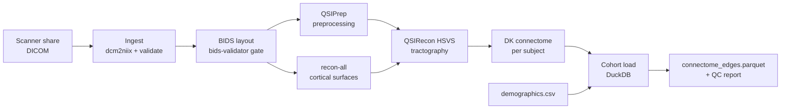

# The DWI pipeline as a DE case study

> A worked, end-to-end DWI cohort pipeline — DICOM in, group statistics out — explained as a data-engineering system, with the DAG, idempotency contract, observability surface, failure modes, retries, and cost model that turn it from a working script into infrastructure.

This is the anchor chapter of the section. Every other page abstracts a single concept; this one wires them all together against a real pipeline you can stand up in a week. Read it after [Foundations](foundations.md), [The DAG mental model](dag.md), and [The five pillars](five-pillars.md).

## 4.1 The cohort and the contract

We have a study of ~150 subjects. Each subject arrives as a directory of DICOMs from the scanner. The deliverable a downstream statistician asks for is a single tidy table:

```
subject_id, age, sex, group, source_region, target_region, streamline_count, fa_mean, qa_mean, run_id
```

That table — call it `connectome_edges` — is the **contract**. Everything upstream exists to produce it correctly, on time, with provenance, every time a new subject arrives.

The pipeline is five stages:

1. **Ingest** — pull DICOMs from the scanner share, validate, convert to NIfTI + JSON via `dcm2niix`.
2. **BIDS** — organise into a BIDS-valid layout; run `bids-validator` as a gate.
3. **Preprocess** — `QSIPrep` (motion, distortion, eddy, registration) and `recon-all` (cortical surfaces).
4. **Tractography & connectome** — `QSIRecon` (HSVS using FreeSurfer surfaces) → DK connectome matrix per subject.
5. **Group stats** — load all connectomes into DuckDB, join with demographics, emit `connectome_edges.parquet` and a QC report.

## 4.2 The DAG



Two properties of this graph drive every engineering decision below:

- **Per-subject fan-out** — stages B through G are embarrassingly parallel across subjects. Stage H is a single reducer that depends on *all* upstream subjects (or at least all that are currently valid).
- **A join in the middle** — `QSIRecon` joins outputs from QSIPrep and recon-all. That join is where most subjects fail, because either parent is more likely to be broken than the join itself.

## 4.3 Layers — bronze, silver, gold

Mapped onto the medallion model:

| Layer | Artifact | Path | Schema-ish contract |
| --- | --- | --- | --- |
| **Bronze** | Raw DICOM tarballs | `s3://cohort/bronze/dicom/{study}/{subject}/` | Whatever the scanner emitted; immutable. |
| **Bronze** | Demographics CSV | `s3://cohort/bronze/demographics/{date}.csv` | Pulled from REDCap; immutable per pull. |
| **Silver** | BIDS dataset | `s3://cohort/silver/bids/sub-{id}/` | `bids-validator` clean; `participants.tsv` present. |
| **Silver** | QSIPrep derivatives | `s3://cohort/silver/qsiprep/sub-{id}/` | Preprocessed dwi.nii.gz + JSON sidecars. |
| **Silver** | FreeSurfer subject | `s3://cohort/silver/freesurfer/sub-{id}/` | `aparc+aseg.mgz`, `lh.pial`, `rh.pial`. |
| **Gold** | Per-subject DK matrix | `s3://cohort/gold/dk/sub-{id}.parquet` | 84×84 float64; row/col labels in metadata. |
| **Gold** | Cohort edges | `s3://cohort/gold/connectome_edges.parquet` | Tidy long format; one row per (subject, edge). |

A consumer never reads bronze. The statistician reads gold. The MRI physicist debugs silver. That split is the entire point of layering.

## 4.4 Idempotency contract

Every stage must satisfy three invariants:

1. **Deterministic output path** — given a subject ID and a pipeline version, the output location is a pure function of those two. No timestamps in the path.
2. **Atomic publish** — write to `*.tmp` (or a `_INCOMPLETE` directory) and rename only on success. A reader never observes a half-written artifact.
3. **Skip-if-present** — if the output exists *and* its sidecar `_manifest.json` matches the current input hash + container hash + code SHA, the stage is a no-op.

The manifest is the trick that lifts skip-if-present from `mtime` heuristics to content-addressable correctness:

```python
# dwi_pipeline/manifest.py
from dataclasses import dataclass, asdict
import hashlib, json, os, time
from pathlib import Path

@dataclass(frozen=True)
class Manifest:
    subject_id: str
    stage: str
    input_hash: str        # sha256 of (sorted input file hashes)
    container_digest: str  # docker/apptainer image digest
    code_sha: str          # git rev-parse HEAD
    started_at: float
    finished_at: float
    exit_code: int
    host: str

def already_done(out_dir: Path, current: Manifest) -> bool:
    f = out_dir / "_manifest.json"
    if not f.exists():
        return False
    prev = json.loads(f.read_text())
    return (prev["input_hash"]      == current.input_hash
        and prev["container_digest"] == current.container_digest
        and prev["code_sha"]         == current.code_sha
        and prev["exit_code"]        == 0)
```

If any of the three hashes change — new container, new code, new input — the stage re-runs. Otherwise it's free. This is content-addressable caching done by hand; the same idea underpins Bazel, Nix, and Dagster's asset materialisations.

## 4.5 Stage by stage

The skeleton below uses Python pseudocode that maps cleanly onto either a Snakemake rule or a Dagster asset. The shape — `inputs → run-container → publish → manifest` — repeats.

### Stage 1 — Ingest

```python
# dwi_pipeline/stages/ingest.py
def ingest(subject_id: str, cfg: Config) -> Path:
    src     = cfg.scanner_share / subject_id          # bronze read
    out_dir = cfg.silver / "bids_raw" / f"sub-{subject_id}"
    man     = build_manifest(subject_id, "ingest", inputs=list(src.glob("**/*.dcm")), cfg=cfg)
    if already_done(out_dir, man):
        return out_dir
    with staging(out_dir) as tmp:
        run_container(
            image=cfg.images["dcm2niix"],
            cmd=["dcm2niix", "-o", str(tmp), "-z", "y", "-b", "y", str(src)],
            log=cfg.logs / f"ingest_{subject_id}.log",
        )
        validate_dcm2niix_output(tmp)                 # raise on missing bvec/bval
        write_manifest(tmp, man)
    return out_dir
```

`staging()` is a context manager that returns a temp directory and `os.replace`s it onto `out_dir` on clean exit — the atomic publish. `validate_dcm2niix_output` is the quality gate that prevents bad data from polluting silver.

### Stage 2 — BIDS

```python
def to_bids(subject_id: str, cfg: Config) -> Path:
    src = cfg.silver / "bids_raw" / f"sub-{subject_id}"
    out = cfg.silver / "bids"
    # ... idempotency check ...
    with staging(out / f"sub-{subject_id}") as tmp:
        rearrange_to_bids(src, tmp)                   # pure python: rename + symlinks
        run_container(
            image=cfg.images["bids_validator"],
            cmd=["bids-validator", "--json", str(out)],
            log=cfg.logs / f"bids_{subject_id}.log",
            check=True,                               # non-zero -> raise
        )
```

The validator is the schema gate at the bronze → silver boundary. A subject that fails BIDS validation never reaches preprocessing — it's quarantined to `silver/bids_quarantine/` with the validator's JSON report next to it for triage.

### Stage 3a — QSIPrep

```python
def qsiprep(subject_id: str, cfg: Config) -> Path:
    # large, slow: 4-8h, 16GB RAM, 8 cores
    out = cfg.silver / "qsiprep" / f"sub-{subject_id}"
    # ... idempotency check ...
    with staging(out) as tmp:
        run_container(
            image=cfg.images["qsiprep"],              # pinned: qsiprep:0.23.1
            cmd=[..., "--participant-label", subject_id,
                 "--n_cpus", "8", "--mem_mb", "16000",
                 "--output-resolution", "1.7"],
            log=cfg.logs / f"qsiprep_{subject_id}.log",
            timeout=8 * 3600,
            resources={"cpu": 8, "mem_gb": 18, "gpu": 0},
        )
        assert (tmp / "dwi").exists(), "QSIPrep emitted no derivatives"
```

### Stage 3b — recon-all

Independent of QSIPrep, so the scheduler runs them concurrently for the same subject.

```python
def recon(subject_id: str, cfg: Config) -> Path:
    # ~20h on one core, or 4h with -openmp 8
    ...
```

### Stage 4 — QSIRecon (the join)

```python
def qsirecon_hsvs(subject_id: str, cfg: Config) -> Path:
    qsi  = cfg.silver / "qsiprep"   / f"sub-{subject_id}"
    fs   = cfg.silver / "freesurfer"/ f"sub-{subject_id}"
    if not qsi.exists() or not fs.exists():
        raise UpstreamMissing(subject_id, [qsi, fs])
    out  = cfg.silver / "qsirecon" / f"sub-{subject_id}"
    # ... idempotency, staging ...
    run_container(image=cfg.images["qsirecon"],
                  cmd=[..., "--recon-spec", "mrtrix_singleshell_ss3t_ACT-hsvs"],
                  log=cfg.logs / f"qsirecon_{subject_id}.log")
```

### Stage 5 — Per-subject DK matrix

```python
def dk_matrix(subject_id: str, cfg: Config) -> Path:
    tck = cfg.silver / "qsirecon" / f"sub-{subject_id}" / "tractogram.tck"
    seg = cfg.silver / "qsirecon" / f"sub-{subject_id}" / "aparc+aseg_in_dwi.nii.gz"
    out = cfg.gold   / "dk"       / f"sub-{subject_id}.parquet"
    # ... idempotency ...
    matrix = mrtrix_tck2connectome(tck, seg, n_regions=84)
    df = matrix_to_long(matrix, subject_id=subject_id,
                        run_id=cfg.run_id, code_sha=cfg.code_sha)
    atomic_write_parquet(df, out)
```

### Stage 6 — Cohort load (the reducer)

```python
def cohort_load(cfg: Config) -> Path:
    import duckdb
    con = duckdb.connect()
    con.execute(f"""
      CREATE OR REPLACE TABLE edges AS
      SELECT * FROM read_parquet('{cfg.gold}/dk/sub-*.parquet');

      CREATE OR REPLACE TABLE demo AS
      SELECT * FROM read_csv_auto('{cfg.bronze}/demographics/latest.csv');

      COPY (
        SELECT e.*, d.age, d.sex, d.group
        FROM edges e JOIN demo d USING (subject_id)
      ) TO '{cfg.gold}/connectome_edges.parquet' (FORMAT PARQUET);
    """)
```

DuckDB is the unsung hero of small-cohort DE: it reads Parquet directly, joins in SQL, and writes Parquet. No warehouse required until you outgrow a single machine.

## 4.6 Observability — what you wire up on day one

You cannot debug what you cannot see. The DWI pipeline emits three telemetry streams per stage:

| Stream | What it is | Where it lands |
| --- | --- | --- |
| **Logs** | stdout/stderr of the container, structured per line | `logs/{stage}_{subject}.log` + shipped to Loki |
| **Manifests** | the `_manifest.json` written next to every output | `s3://cohort/silver/.../_manifest.json` |
| **Metrics** | runtime, peak RSS, exit code, retry count | a single `runs` table in DuckDB / Postgres |

The `runs` table is the operational truth. One row per (subject, stage, attempt):

```sql
CREATE TABLE runs (
  run_id        TEXT,
  subject_id    TEXT,
  stage         TEXT,
  attempt       INT,
  started_at    TIMESTAMP,
  finished_at   TIMESTAMP,
  exit_code     INT,
  peak_rss_gb   DOUBLE,
  host          TEXT,
  container_sha TEXT,
  code_sha      TEXT,
  log_path      TEXT,
  PRIMARY KEY (run_id, subject_id, stage, attempt)
);
```

From this table you can answer, with a single SQL query: "what's p95 runtime per stage", "which subjects are stuck", "which container version did this output come from", "show me every retry in the last 7 days". A Grafana panel on top of it costs ten minutes and pays back for years. See [Reliability & operations](reliability.md) for the SLO definitions that sit on this table.

## 4.7 Failure modes and retries

Failures cluster into five classes. The retry policy is different for each.

| Class | Examples | Retry policy |
| --- | --- | --- |
| **Input** | Missing field maps, malformed DICOM, no b > 0 | **Do not retry.** Quarantine; page the MRI tech. |
| **Resource** | OOM, walltime exceeded | Retry once with 2× memory / 1.5× walltime; then quarantine. |
| **Dependency** | TemplateFlow CDN down, image pull 503 | Exponential backoff (30s, 2min, 10min), max 3 attempts. |
| **Transient infra** | Slurm node crash, NFS hiccup | Auto-retry up to 3 times, no backoff needed. |
| **Logic bug** | Wrong b-vector flip in code | **Do not retry.** Roll forward a fix; backfill once merged. |

The decision is encoded once, near the dispatch loop:

```python
def run_with_retry(stage_fn, subject_id, cfg):
    for attempt in range(1, cfg.max_attempts + 1):
        try:
            return stage_fn(subject_id, cfg)
        except UpstreamMissing:
            raise                                # skip, depend on parent
        except InputError as e:
            quarantine(subject_id, reason=str(e)); raise
        except ResourceError as e:
            cfg = cfg.bump_resources()           # 2x mem, 1.5x walltime
        except TransientError:
            sleep(backoff(attempt))
        except Exception:
            raise                                # logic bug — surface fast
    quarantine(subject_id, reason="max attempts exceeded")
    raise MaxRetriesExceeded(subject_id)
```

This is the same shape Airflow's `retries=` and Dagster's `RetryPolicy` give you declaratively. Writing it once by hand makes the declarative form much less mysterious later.

## 4.8 Backfills and replays

A new container version drops. A bug in the ROI parcellation is fixed. Demographics get re-pulled with a corrected DOB. Any of these triggers a **backfill** — re-running a contiguous slice of the cohort against new inputs.

Two patterns:

- **Targeted replay** — bump the code SHA, run the pipeline. The manifest comparison invalidates only the affected outputs; everything else is a free no-op. This is the everyday case.
- **Cohort backfill** — bump the run_id, force-recompute everything for a frozen analysis. Used for paper-submission snapshots and audit recomputations.

```bash
# Targeted replay after a recon-all flag change
dwi-pipeline run --stage recon --code-sha $(git rev-parse HEAD) --subjects sub-001..sub-150

# Full cohort backfill for paper submission
dwi-pipeline backfill --run-id paper-v2 --force --subjects all
```

Crucially: the bronze layer is never re-derived. DICOM is the immutable source of truth; everything downstream is reproducible from it plus the code SHA plus the container digests.

## 4.9 Cost model

Per subject, the cost surface looks like this (rough numbers from a real run on a mid-2024 HPC + cloud burst):

| Stage | Wall time | Cores | RAM | Cost on HPC (FTE-hours equiv.) | Cost on cloud (us-east-1 c7i) |
| --- | --- | --- | --- | --- | --- |
| Ingest | 5 min | 2 | 2 GB | negligible | ~$0.02 |
| BIDS | 1 min | 1 | 1 GB | negligible | ~$0.01 |
| QSIPrep | 6 h | 8 | 16 GB | ~$0 (sunk) | ~$3.50 |
| recon-all | 4 h (openmp 8) | 8 | 8 GB | ~$0 (sunk) | ~$2.40 |
| QSIRecon | 2 h | 8 | 16 GB | ~$0 (sunk) | ~$1.20 |
| DK matrix | 5 min | 1 | 4 GB | negligible | ~$0.03 |
| **Per subject** | **~12 h wallclock** | | | **~$0 on HPC** | **~$7.20 burst** |
| **Cohort (150 subjects)** | ~3 days at 50 parallel | | | sunk cluster cost | **~$1,100** |
| Cohort reduce (DuckDB) | 2 min | 4 | 16 GB | negligible | ~$0.05 |
| **Storage / month** | ~250 GB silver + 5 GB gold | | | NFS quota | **~$6 (S3 Standard)** |

The cost model drives architectural decisions:

- **HPC is free at the margin, slow at the front.** Use it for steady-state cohorts. Burst to cloud for paper-deadline crunches.
- **Silver is the storage cost.** Lifecycle silver to Glacier after the paper ships; gold stays hot forever — it's tiny.
- **Compute dwarfs storage.** A failed retry of QSIPrep costs $3.50, not $0.001. That's why the idempotency contract matters: every needless re-run is a real line item.

## 4.10 What you get when this is wired up

When the five pillars and the contract are in place, the cohort lead can ask, and you can answer in minutes:

- "How many subjects are gold-ready?" → `SELECT count(*) FROM runs WHERE stage='dk_matrix' AND exit_code=0;`
- "Which subjects failed today, on which stage, with what error?" → one query against `runs` + tail of the log.
- "Re-run all subjects from study-X with QSIPrep 0.24." → one command; everything else is a no-op.
- "What container produced `sub-042`'s connectome?" → the manifest next to the file.
- "What does the cohort look like grouped by scanner site?" → the gold Parquet plus a notebook.

That's the difference between *a pipeline* and *a data product*. The science gets faster because the engineering stops being the bottleneck.

## References

1. **Esteban O, Markiewicz CJ, Blair RW, et al.** fMRIPrep: a robust preprocessing pipeline for functional MRI. *Nature Methods.* 2019;16:111–116. [doi:10.1038/s41592-018-0235-4](https://doi.org/10.1038/s41592-018-0235-4)
2. **Cieslak M, Cook PA, He X, et al.** QSIPrep: an integrative platform for preprocessing and reconstructing diffusion MRI. *Nature Methods.* 2021;18:775–778. [doi:10.1038/s41592-021-01185-5](https://doi.org/10.1038/s41592-021-01185-5)
3. **Fischl B.** FreeSurfer. *NeuroImage.* 2012;62(2):774–781. [doi:10.1016/j.neuroimage.2012.01.021](https://doi.org/10.1016/j.neuroimage.2012.01.021)
4. **Smith RE, Tournier J-D, Calamante F, Connelly A.** Anatomically-constrained tractography. *NeuroImage.* 2012;62(3):1924–1938. [doi:10.1016/j.neuroimage.2012.06.005](https://doi.org/10.1016/j.neuroimage.2012.06.005)
5. **Gorgolewski KJ, Auer T, Calhoun VD, et al.** The Brain Imaging Data Structure (BIDS). *Scientific Data.* 2016;3:160044. [doi:10.1038/sdata.2016.44](https://doi.org/10.1038/sdata.2016.44)
6. **Raasveldt M, Mühleisen H.** DuckDB: an embeddable analytical database. *SIGMOD.* 2019. [doi:10.1145/3299869.3320212](https://doi.org/10.1145/3299869.3320212)
7. **Armbrust M, Das T, Sun L, et al.** Delta Lake: high-performance ACID table storage. *VLDB.* 2020. [doi:10.14778/3415478.3415560](https://doi.org/10.14778/3415478.3415560)

## Where to next

- [Concepts in depth](concepts.md) — ETL vs ELT, idempotency mechanics, schemas, lineage, partitioning, retries, cost — the toolbox underneath this case study.
- [Reliability & operations](reliability.md) — SLOs, runbooks, on-call patterns that turn the `runs` table into an operational system.
- [Testing pipelines](testing.md) — the fixture-subject strategy that lets you exercise this whole DAG in under five minutes on CI.
- [Portfolio roadmap](portfolio-roadmap.md) — the weekend-sized milestone path from "submit.sh" to the system above.
