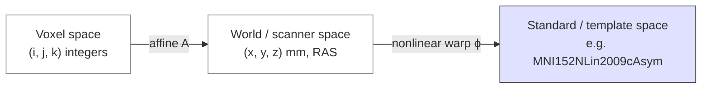
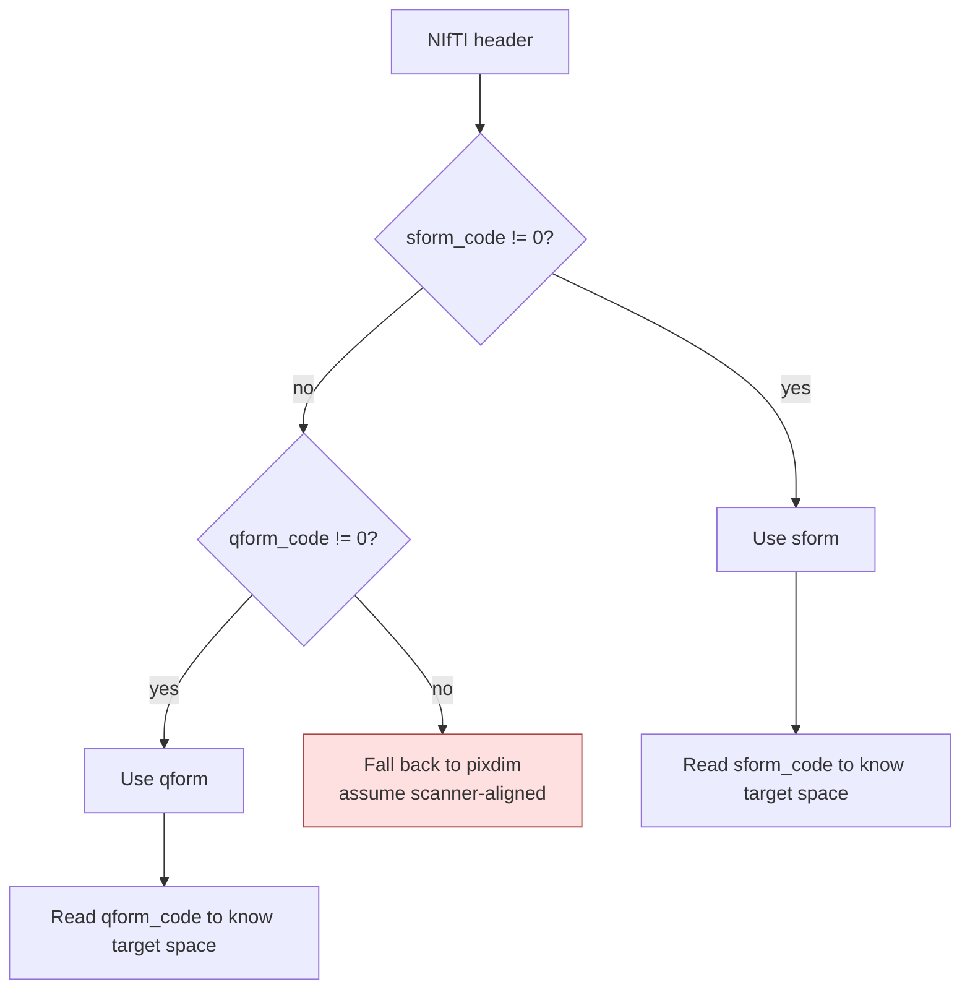
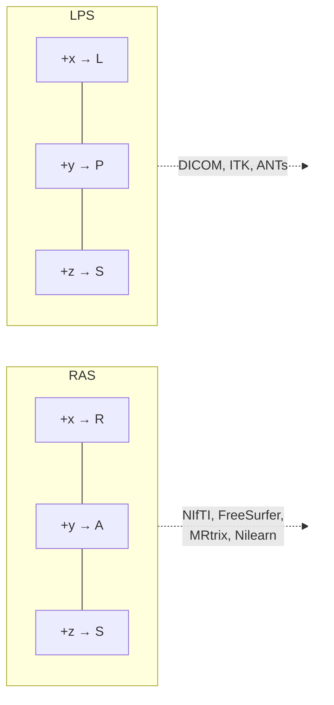

# Coordinate systems

> How voxel indices, scanner space, and standard templates relate — and where most "the masks don't line up" bugs come from.

Three spaces matter:



*<small>The three coordinate frames of a neuroimaging volume and the maps between them. Original figure.</small>*

1. **Voxel space** — the integer indices into the data array, `(i, j, k)`.
2. **World / scanner space** — millimetres relative to a fixed origin (often the scanner isocentre).
3. **Standard / template space** — millimetres in a published atlas (MNI152, fsaverage, fsLR).

The mapping between them is a 4×4 affine matrix, stored in the NIfTI header.

## The affine

```text
[x_mm]   [m00 m01 m02 m03] [i]
[y_mm] = [m10 m11 m12 m13] [j]
[z_mm]   [m20 m21 m22 m23] [k]
[  1 ]   [ 0   0   0   1 ] [1]
```

The top-left 3×3 encodes rotation, scaling, and (when present) shear. The right column encodes translation. Voxel `(0, 0, 0)` does **not** sit at world `(0, 0, 0)`; it sits at the translation column. Most bugs come from forgetting the affine entirely and just sampling by index.

## Affine matrices in practice

The 4×4 affine $A$ decomposes — uniquely, up to sign — into translation, rotation, anisotropic scale, and (rarely-but-not-never) shear:

$$
A = T(\vec t)\; R(\theta_x, \theta_y, \theta_z)\; S(s_x, s_y, s_z)\; H
$$

The translation $\vec t$ is the right column. The rotation $R \in SO(3)$ sets the orientation of the array axes relative to RAS. The scale matrix $S = \mathrm{diag}(s_x, s_y, s_z)$ holds the voxel sizes in mm. Shear $H$ is the identity for axis-aligned acquisitions; it appears for oblique slabs or after [gradient nonlinearity correction](https://surfer.nmr.mgh.harvard.edu/fswiki/GradientNonlinearityCorrection).

A concrete example. A 1 mm isotropic T1w with the array origin at the bottom-left-posterior corner of a centred FOV might carry:

$$
A =
\begin{bmatrix}
1 & 0 & 0 & -90 \\
0 & 1 & 0 & -126 \\
0 & 0 & 1 & -72 \\
0 & 0 & 0 & 1
\end{bmatrix}
$$

Then voxel index $(100, 120, 80, 1)^T$ maps to world RAS+ coordinates $p_{\text{world}} = A\, p_{\text{vox}} = (10, -6, 8, 1)^T$ mm — i.e. 10 mm right, 6 mm posterior, 8 mm superior of the world origin. Verify with [nibabel](https://nipy.org/nibabel/):

```python
import nibabel as nib, numpy as np
img = nib.load("sub-01_T1w.nii.gz")
A = img.affine
vox = np.array([100, 120, 80, 1])
world_mm = A @ vox
```

If you ever find yourself indexing a NumPy array with millimetre coordinates, you have skipped $A^{-1}$ and your downstream masks will be subtly wrong.

## qform vs sform

NIfTI stores **two** affines in the header: `qform` and `sform`. They are not redundant — they encode the same kind of mapping with different *provenance*.

- **qform** — derived from the scanner geometry (slice direction cosines, FOV, voxel size). Always rigid + scale. This is what the magnet said.
- **sform** — a more general affine, typically written by a registration tool to align the image with a reference (another modality, a template). This is what a downstream pipeline decided.

Each comes with a code (`qform_code`, `sform_code`) drawn from the [NIFTI_XFORM_* enumeration](https://nifti.nimh.nih.gov/nifti-1/documentation/nifti1fields/nifti1fields_pages/qsform.html) telling you *which* space the affine maps to: `SCANNER_ANAT`, `ALIGNED_ANAT`, `TALAIRACH`, `MNI_152`, `TEMPLATE_OTHER`. Respect the code: an image with `sform_code = MNI_152` is already in MNI and warping it again will mangle it.



*<small>The qform/sform decision logic every NIfTI reader should follow. Original figure.</small>*

## Invertibility, composition, and chain order

Most pipelines compose transforms. Three rules keep you out of trouble.

**Invertibility.** Rigid transforms are exactly invertible: $T^{-1}(\vec r) = R^T(\vec r - \vec t)$. Affine transforms are invertible iff the 3×3 block is non-singular ($\det A \ne 0$); a degenerate scan with $s_z = 0$ is not. Nonlinear warps must be inverted numerically — iteratively solving $\phi(\phi^{-1}(\vec r)) = \vec r$ — and the result is approximate. Inverse-consistency is an active research topic; see below.

**Composition.** To take a point from space $A$ to space $C$ via $B$:

$$
T_{A \to C} = T_{B \to C} \circ T_{A \to B}
$$

Read right-to-left: apply $T_{A \to B}$ first, then $T_{B \to C}$. This is the *point-mapping* convention (where does this point land?).

**Library order.** Conventions differ. [ITK](https://itk.org/) / [ANTs](https://github.com/ANTsX/ANTs) use point-mapping; [FSL](https://fsl.fmrib.ox.ac.uk/) and [SPM](https://www.fil.ion.ucl.ac.uk/spm/) historically use voxel-mapping (where does this voxel come from?), which inverts the composition order.

| Library | Convention | To chain A → B → C, multiply as |
| --- | --- | --- |
| ITK / ANTs / Slicer | Point-mapping | `T_BtoC * T_AtoB` (apply right-to-left) |
| FSL `convert_xfm` | Voxel-mapping | `T_BtoC -concat T_AtoB` (apply left-to-right) |
| SPM batch | Voxel-mapping | left-to-right multiplication |
| nibabel | Point-mapping | `T_BtoC @ T_AtoB` |

If `antsApplyTransforms` outputs nonsense, the first thing to check is whether you passed the transforms in the order ANTs expects (it applies them right-to-left, last-listed first).

## Inverse consistency in nonlinear registration

Run a non-linear registration forward and then estimate its inverse. Compose them: you will *not* get the identity. Free-form B-spline and demons-style algorithms have no built-in guarantee that $\phi \circ \phi^{-1} = \mathrm{Id}$, and the residual can be several voxels in deep white matter.

The fix is to parameterise the warp by a smooth **velocity field** $v$ and define $\phi$ as the time-1 flow of an ODE. Stationary-velocity diffeomorphic demons ([Vercauteren et al., 2009](https://doi.org/10.1016/j.neuroimage.2008.10.040)) use $\phi = \exp(v)$ via scaling-and-squaring; [DARTEL](https://doi.org/10.1016/j.neuroimage.2007.07.007) uses a similar stationary parameterisation; [ANTs SyN](https://doi.org/10.1016/j.media.2007.06.004) uses a time-varying field and integrates symmetrically from both ends. All three guarantee a smooth inverse exists and can be evaluated to machine precision — see [Fundamentals → Registration](medical-imaging/registration.md) for the math.

For any downstream task that needs round-trip warping (e.g. pushing a subject-space label through to template and pulling a template atlas back), prefer a diffeomorphic algorithm and verify the [Jacobian determinant](https://doi.org/10.1016/j.media.2007.06.004) is everywhere positive.

## RAS vs LPS

Two opposite conventions for what positive `x`, `y`, `z` mean:



*<small>The two axis conventions, and which ecosystems use each. Original figure.</small>*

- **RAS** — positive axes point toward the subject's **R**ight, **A**nterior, **S**uperior. Used by NIfTI, FreeSurfer, MRtrix, Nilearn.
- **LPS** — positive axes point toward the subject's **L**eft, **P**osterior, **S**uperior. Used by DICOM, ITK, ANTs.

If you load a NIfTI in one ecosystem and pass coordinates to a tool from the other ecosystem without converting, you will silently mirror your data left-right. Tools that handle both (e.g., 3D Slicer) record which they're using; tools that don't (some custom scripts) lie.

!!! warning "The classic L/R flip"
    If your DWI tractogram crosses to the wrong hemisphere or your fMRI activations appear on the opposite side, an RAS/LPS mismatch is the first thing to check. The second is your `.bvec` file — bvecs are direction vectors and need the same convention as the volume they describe.

## Voxel size and orientation are different

Many people conflate "the voxel is 1×1×1 mm" with "the array axes correspond to R, A, S". They don't have to. The affine handles orientation; voxel size is just the diagonal magnitude. A `90°` rotation in the affine means the first array axis runs anterior-posterior even though the spacing is "1 mm".

You can read both from a NIfTI header with **`nibabel`**:

```python
import nibabel as nib
img = nib.load("sub-001_T1w.nii.gz")
print(img.affine)
print(img.header.get_zooms())  # voxel sizes per axis
print(nib.aff2axcodes(img.affine))  # e.g. ('R', 'A', 'S')
```

## Standard spaces

The brains of different subjects don't match — different sizes, different gyrification. To compare or aggregate across subjects you warp each subject's volume into a **standard space**:

- **MNI152** — average of 152 healthy adult MRI scans, in linear or non-linear variants. `MNI152NLin2009cAsym` is what fMRIPrep / QSIPrep emit by default.
- **fsaverage / fsLR** — surface templates used after cortical reconstruction (FreeSurfer / HCP).
- **Talairach** — older atlas; still cited in literature but largely replaced by MNI.

Always record *which* template (and which version) your derivatives are in. The BIDS sidecar field for this is `space-` in the filename: `sub-001_space-MNI152NLin2009cAsym_desc-preproc_T1w.nii.gz`.

## Versioning templates

Templates themselves get updated. `MNI152NLin6Asym` and `MNI152NLin2009cAsym` are *not the same brain*. **TemplateFlow** [Ciric et al., 2022](https://doi.org/10.1038/s41592-022-01681-2)[^templateflow] distributes versioned templates so you can pin them as if they were software dependencies. Treat templates as part of your pipeline's provenance — record the TemplateFlow version in your manifest.

## Worked example — applying an affine to a landmark

!!! tip "Beginner takeaway"
    A 4×4 affine matrix is the dictionary that translates "which cell of the array" into "where in the head, in millimetres". Everything else on this page is bookkeeping around that one map.

The affine maps voxel indices to world (mm) coordinates as

$$
\mathbf{x}_{\text{world}} = A \, \mathbf{x}_{\text{voxel}}, \qquad
\mathbf{x}_{\text{voxel}} = [i, j, k, 1]^T
$$

Take a $256^3$ T1 image with $1 \times 1 \times 1$ mm isotropic voxels. Suppose the anterior commissure (AC) sits at voxel $(128, 130, 110)$. Then in nibabel:

```python
import nibabel as nib, numpy as np
img = nib.load("sub-01_T1w.nii.gz")
A = img.affine
# voxel coordinate of the AC (anterior commissure), say (128, 130, 110)
v = np.array([128, 130, 110, 1])
world_mm = A @ v          # (x, y, z, 1) in scanner mm
```

The inverse direction — "where in the array does world coordinate $(x, y, z)$ live?" — is just

$$
\mathbf{x}_{\text{voxel}} = A^{-1} \, \mathbf{x}_{\text{world}}
$$

```python
voxel_idx = np.linalg.inv(A) @ np.array([0.0, 0.0, 0.0, 1.0])  # MNI origin → voxel
```

!!! warning "Affine consistency is load-bearing"
    Pipelines that mutate volume data and write a new NIfTI without re-saving (or worse, re-using) the affine cause **silent misalignment** downstream. Masks, atlases, and statistical maps all assume the affine is truthful. If you ever resample, crop, pad, or reorient an array, you must update the affine to match — and re-save the file. A `nib.Nifti1Image(arr, A_new)` is one line; forgetting it is hours of debugging.

## Composing transforms and inverse consistency

Transforms compose by matrix multiplication. If $A_1$ maps T1 → MNI and $A_2$ maps T2 → T1, then

$$
A_{\text{T2}\to\text{MNI}} = A_1 \, A_2
$$

Apply right-to-left: the moving image's coordinates pass through $A_2$ first, then $A_1$. Most pipeline bugs at this layer come from concatenating in the wrong order, or from mixing rigid-body transforms expressed in different conventions (RAS vs LPS, voxel vs world).

A registration is **inverse-consistent** iff

$$
T_{Y \to X} \circ T_{X \to Y} \approx \mathrm{Id}
$$

within tolerance. Rigid and affine fits are inverse-consistent by construction (matrix inverse). Non-linear methods are not all symmetric: a forward-only SyN warp (`out1Warp.nii.gz`) and its naively-resampled "inverse" can disagree by several mm in high-curvature regions. SyN itself optimises a symmetric pair of half-warps precisely to fix this.

A **diffeomorphism** is a smooth, bijective, smoothly invertible map $\phi: \mathbb{R}^3 \to \mathbb{R}^3$. Without that property, group analyses on warped images are statistically suspect: a fold or tear in the warp means a voxel "has no identity to come back to", and tensor / Jacobian-based statistics blow up. Atlas-based segmentation and VBM both *assume* diffeomorphic warps.

For the full treatment, see [Medical imaging → Registration](medical-imaging/registration.md).

## References

[^templateflow]: Ciric R, Thompson WH, Lorenz R, et al. TemplateFlow: FAIR-sharing of multi-scale, multi-species brain models. *Nat Methods.* 2022;19(12):1568-1571. [doi:10.1038/s41592-022-01681-2](https://doi.org/10.1038/s41592-022-01681-2)

- **Avants BB, Epstein CL, Grossman M, Gee JC.** Symmetric diffeomorphic image registration with cross-correlation. *Med Image Anal.* 2008;12(1):26-41. [doi:10.1016/j.media.2007.06.004](https://doi.org/10.1016/j.media.2007.06.004) — SyN, velocity-field diffeomorphism.
- **Vercauteren T, Pennec X, Perchant A, Ayache N.** Diffeomorphic demons. *NeuroImage.* 2009;45(1 Suppl):S61-S72. [doi:10.1016/j.neuroimage.2008.10.040](https://doi.org/10.1016/j.neuroimage.2008.10.040)
- **Ashburner J.** A fast diffeomorphic image registration algorithm. *NeuroImage.* 2007;38(1):95-113. [doi:10.1016/j.neuroimage.2007.07.007](https://doi.org/10.1016/j.neuroimage.2007.07.007) — DARTEL.
- **NIfTI-1 qform/sform documentation.** [https://nifti.nimh.nih.gov/nifti-1/documentation/nifti1fields/nifti1fields_pages/qsform.html](https://nifti.nimh.nih.gov/nifti-1/documentation/nifti1fields/nifti1fields_pages/qsform.html) — official spec for the two affines and their codes.
- **nibabel coordinate-systems primer.** [https://nipy.org/nibabel/coordinate_systems.html](https://nipy.org/nibabel/coordinate_systems.html) — affine breakdown with figures.

## Visual references

- **NIfTI orientation primer.** [https://nipy.org/nibabel/coordinate_systems.html](https://nipy.org/nibabel/coordinate_systems.html) — official NiBabel illustrated explainer with affine diagrams and figures.
- **TemplateFlow browser.** [https://www.templateflow.org/browse/](https://www.templateflow.org/browse/) — see the actual MNI152, fsaverage, fsLR templates rendered in 3D.
- **3D Slicer coordinate-system documentation.** [https://slicer.readthedocs.io/en/latest/user_guide/coordinate_systems.html](https://slicer.readthedocs.io/en/latest/user_guide/coordinate_systems.html) — illustrated guide with worked examples.
- **MNE-Python coordinate frames page.** [https://mne.tools/stable/auto_tutorials/forward/20_source_alignment.html](https://mne.tools/stable/auto_tutorials/forward/20_source_alignment.html) — figures showing scanner / surface / device frames in one diagram.

## Where to next

[File formats](file-formats.md) — DICOM, NIfTI, GIFTI/CIFTI, and the BIDS standard that ties them into a dataset.
