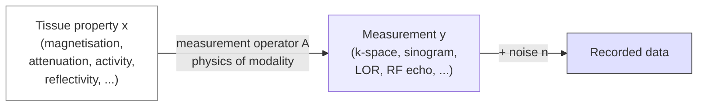

# Acquisition

> Every medical imaging modality is a **forward model** mapping a tissue property to a measurement. Knowing the forward model is what lets you reason about every artifact, every parameter trade-off, and every reconstruction method downstream.

## 1. Theory

### The universal forward model



*<small>The universal forward model y = Ax + n shared by every medical imaging modality. Original figure.</small>*

Every modality can be written as

$$
y = A x + n
$$

- $x \in \mathbb{R}^N$ — the (unknown) image we want.
- $y \in \mathbb{R}^M$ — the measurements the scanner records.
- $A \in \mathbb{R}^{M \times N}$ — the **measurement operator** (or "forward operator"), encoding the physics.
- $n$ — measurement noise, modality-specific (Gaussian thermal in MR, Poisson photon-count in PET/CT, speckle in ultrasound).

Acquisition is the engineering of $A$ and the sampling of $y$. Reconstruction is the inversion. The choice of $A$ determines what you can resolve, what you cannot, and the bias profile of the final image.

### Sampling and the resolution-SNR-time triangle

Every modality faces the same three-way trade-off:

- **Spatial resolution** — finer voxels reduce partial-volume averaging but quadruple the variance per voxel for a fixed scan time.
- **SNR** — increases with $\sqrt{N_{\text{avg}}}$, with voxel volume, and (per modality) with field strength / dose / probe power.
- **Acquisition time** — accelerates with parallel imaging, compressed sensing, multiband, or higher-power probes (which increase SAR, dose, or heating).

You pick two. You cannot escape.

## 2. Mathematics

### MRI forward model

Spatial encoding of NMR signals — turning a bulk spectroscopic technique into a tomographic imaging modality — was introduced by [Lauterbur, 1973](https://doi.org/10.1038/242190a0), one of two founding papers (with Mansfield) of MRI.

The MR signal is the Fourier transform of the magnetisation $M(\vec r)$ weighted by coil sensitivity $S_c$:

$$
y_c(\vec k) = \int_{\Omega} S_c(\vec r)\, M(\vec r)\, e^{-j 2 \pi \vec k \cdot \vec r}\, d^3 r + n_c(\vec k)
$$

with $\vec k(t) = \tfrac{\gamma}{2\pi}\int_0^t \vec G(\tau)\,d\tau$. Multi-coil reception turns this into an over-determined system that **parallel imaging** (SENSE [Pruessmann et al., 1999](https://doi.org/10.1002/(SICI)1522-2594(199911)42:5%3C952::AID-MRM16%3E3.0.CO;2-S)) and **compressed sensing** ([Lustig et al., 2007](https://doi.org/10.1002/mrm.21391)) exploit.

### CT forward model — the Radon transform

X-ray attenuation along a ray $L_{\theta, s}$ obeys Beer-Lambert:

$$
I = I_0 \exp\!\left(-\int_{L_{\theta, s}} \mu(\vec r)\, d\ell \right)
$$

Logarithmic post-processing gives the **line integral**:

$$
p(\theta, s) = -\ln(I/I_0) = \int_{L_{\theta, s}} \mu(\vec r)\, d\ell
$$

— exactly the Radon transform. Sampling many angles $\theta$ and offsets $s$ produces the **sinogram**.

### PET / SPECT forward model

Emission tomography measures coincidences (PET) or counts (SPECT) along lines of response (LORs):

$$
\lambda_i = \int_{L_i} a_i(\vec r)\, \rho(\vec r)\, d\ell, \qquad y_i \sim \text{Poisson}(\lambda_i)
$$

with $\rho$ the activity concentration and $a_i$ the attenuation along ray $i$. PET requires **attenuation correction** ($a_i$ estimated from CT, MR, or transmission scans) and **normalisation** for detector-pair efficiency.

### Ultrasound forward model

Each transmitted pulse $p(t)$ from a transducer element reflects off acoustic impedance interfaces; the received signal is the convolution of $p$ with the spatial reflectivity profile, scaled by attenuation $e^{-\alpha f \, d}$.

### EEG / MEG forward model

The lead-field matrix $G \in \mathbb{R}^{n_{\text{sensor}} \times 3 n_{\text{source}}}$ maps source dipoles $J$ to sensor signals $y = G J + n$. $G$ is computed by solving Maxwell's equations on a head model (boundary-element or finite-element).

## 3. Steps — generic acquisition pipeline

Most imaging studies, regardless of modality, follow this sequence:

1. **Patient prep** — consent, screening (metal for MR, allergies for contrast, recent pregnancy for ionising methods), positioning, coil / probe placement.
2. **Localiser / scout** — a fast low-resolution scan to plan the volume of interest.
3. **Reference / calibration** — coil sensitivity maps (MR), blank scan (CT), transmission / attenuation scan (PET), elasticity calibration (US).
4. **Protocol execution** — the sequence(s) defined by the study: structural T1w, T2w, FLAIR; DWI; BOLD fMRI; CT non-contrast and CTA; PET dynamic frames.
5. **Real-time QC** — motion monitoring; physiological logging (cardiac, respiration); operator inspection of preview images.
6. **Reconstruction** at the scanner console (default vendor recon) or off-line (research recon).
7. **Anonymisation and PACS push** — DICOM tag scrubbing, transfer to research archive.

Skipping or compressing any step shows up later as a class of artifact.

## 4. Per-modality acquisition steps

### MRI

1. **Patient screening + positioning** in a multi-channel head coil.
2. **Localiser** (3-plane scout).
3. **B0 shimming** — first / higher-order shims to homogenise the static field.
4. **Coil sensitivity calibration** (e.g. pre-scan for SENSE/GRAPPA).
5. **Protocol** — MPRAGE (T1w), TSE (T2w / FLAIR), EPI (BOLD / DWI), GRE (SWI), MRS.
6. **Field map** acquisition if EPI distortion correction is planned.
7. **Online recon** — inverse FFT + parallel-imaging combine.
8. **DICOM export**.

For protocol details and physics, see [Fundamentals → MRI sequences](../sequences/index.md).

### CT

1. **Localiser** (topogram).
2. **Bowtie filter + tube-current modulation** for dose optimisation.
3. **Helical (spiral) acquisition** at a fixed pitch.
4. **Detector readout** — sinogram per slice or volumetric for cone-beam.
5. **Online recon** — filtered back-projection or iterative.
6. **Hounsfield calibration** against air / water phantoms.
7. **Contrast-enhanced phase** — arterial / venous / delayed if CT angiography or perfusion.

### PET

1. **Tracer synthesis + QC** (radiopharmacy).
2. **Patient prep** — fasting for FDG; uptake period (~40 min FDG).
3. **Transmission / CT** for attenuation correction.
4. **Emission acquisition** — list-mode or sinogram, often dynamic for kinetic modelling.
5. **Decay correction + dead-time correction**.
6. **Reconstruction** — MLEM / OSEM with attenuation, scatter, randoms correction.
7. **Quantification** — SUV, SUVR, kinetic-model parameters.

### Ultrasound

1. **Probe selection** (frequency by depth).
2. **Acoustic coupling** (gel).
3. **B-mode imaging** — pulse-echo amplitudes form 2D / 3D image.
4. **Doppler** — colour / spectral flow.
5. **Elastography** — push-pulse + tracking for tissue stiffness.

### EEG / MEG

1. **Sensor net placement** (EEG cap; MEG dewar).
2. **Impedance check** (EEG).
3. **Head digitisation** (fiducials + scalp points).
4. **Baseline + task recording**.
5. **Empty-room recording** (MEG) for noise covariance.

## 5. Practical example — checking a fresh DICOM directory

A 5-minute audit you can run on any newly delivered scanner export:

```bash
# Count series and identify modalities
find dicom_root -name "*.dcm" | head -1 | xargs dcmdump 2>&1 | grep -E "Modality|SeriesDescription"

# Convert to NIfTI + extract key parameters
dcm2niix -b y -z y -o staging/ dicom_root/

# Inspect headers
python - <<'PY'
import json, glob
for p in sorted(glob.glob("staging/*.json")):
    j = json.load(open(p))
    print(p, "TR=", j.get("RepetitionTime"), "TE=", j.get("EchoTime"),
          "PE=", j.get("PhaseEncodingDirection"))
PY
```

A clean dataset will list each series with sane TR/TE; a broken export will reveal missing PE directions or unexpected modalities immediately.

## 6. Bias and artifacts introduced at acquisition

Every modality bakes characteristic bias into the data:

| Modality | Acquisition bias | Mitigation |
|---|---|---|
| MR | B0 / B1 inhomogeneity → intensity drift | Shimming, N4 bias correction |
| MR | Motion → ghosting, blurring | Prospective motion correction, retrospective censoring |
| MR EPI | Susceptibility → distortion | Field maps + `topup` |
| CT | Beam hardening → cupping | Iterative recon, dual-energy |
| CT | Metal → streaks | MAR algorithms |
| PET | Partial volume → underestimate small structures | PVC post-recon |
| PET | Attenuation mis-estimation | Better μ-maps |
| US | Speckle, shadowing | Compounding, harmonic imaging |
| EEG | Skull conductivity blur | Higher-density arrays, source reconstruction |

The acquisition step *cannot* be fully undone downstream. Spend time getting it right.

## 7. References

1. **Liang Z-P, Lauterbur PC.** *Principles of Magnetic Resonance Imaging: A Signal Processing Perspective.* IEEE Press; 2000. ISBN 978-0780347236.
1a. **Lauterbur PC.** Image formation by induced local interactions: examples employing nuclear magnetic resonance. *Nature.* 1973;242:190-191. [doi:10.1038/242190a0](https://doi.org/10.1038/242190a0) — the Nobel-Prize-winning paper introducing spatial encoding for NMR.
2. **Pruessmann KP, Weiger M, Scheidegger MB, Boesiger P.** SENSE: sensitivity encoding for fast MRI. *Magn Reson Med.* 1999;42(5):952-962. [doi:10.1002/(SICI)1522-2594(199911)42:5<952::AID-MRM16>3.0.CO;2-S](https://doi.org/10.1002/(SICI)1522-2594(199911)42:5%3C952::AID-MRM16%3E3.0.CO;2-S)
3. **Griswold MA, Jakob PM, Heidemann RM, et al.** Generalized autocalibrating partially parallel acquisitions (GRAPPA). *Magn Reson Med.* 2002;47(6):1202-1210. [doi:10.1002/mrm.10171](https://doi.org/10.1002/mrm.10171)
4. **Lustig M, Donoho D, Pauly JM.** Sparse MRI: the application of compressed sensing for rapid MR imaging. *Magn Reson Med.* 2007;58(6):1182-1195. [doi:10.1002/mrm.21391](https://doi.org/10.1002/mrm.21391)
5. **Kak AC, Slaney M.** *Principles of Computerized Tomographic Imaging.* SIAM Classics; 2001. ISBN 978-0898714944. Free online: [https://engineering.purdue.edu/~malcolm/pct/CTI_Ch00.pdf](https://engineering.purdue.edu/~malcolm/pct/CTI_Ch00.pdf)
6. **Phelps ME.** *PET: Physics, Instrumentation, and Scanners.* Springer; 2006. ISBN 978-0387321288.
7. **Cobbold RSC.** *Foundations of Biomedical Ultrasound.* Oxford University Press; 2007. ISBN 978-0195168310.
8. **Hämäläinen M, Hari R, Ilmoniemi RJ, Knuutila J, Lounasmaa OV.** Magnetoencephalography: theory, instrumentation, and applications to noninvasive studies of the working human brain. *Rev Mod Phys.* 1993;65(2):413-497. [doi:10.1103/RevModPhys.65.413](https://doi.org/10.1103/RevModPhys.65.413)
9. **Webb A.** *Introduction to Biomedical Imaging.* 2nd ed. Wiley; 2022. ISBN 978-1119867704.

## Exercises

1. **Identify the forward operator.** For a 64-channel cartesian MR, write out the components of $A$ (Fourier + coil-sensitivity multiplication + sampling mask).
2. **CT dose vs SNR.** Halving tube current changes Poisson photon counts by what factor; SNR by what factor?
3. **PET attenuation correction.** Why is a μ-map required for quantitative PET? What replaces it on PET/MR where there's no CT?

??? success "Solutions"
    1. `A = M ∘ F ∘ S_c`: per-coil sensitivity multiplication, FFT to k-space, mask sampling pattern.
    2. Counts: × 0.5; SNR: × 1/√2 ≈ 0.71.
    3. AC removes the exponential attenuation along each LOR. On PET/MR: UTE/Dixon-based μ-map or DL-based estimation (e.g. atlas-based, ZTE-MR).

## Where to next

[Reconstruction](reconstruction.md) — turning the measurements you just acquired into an image.
