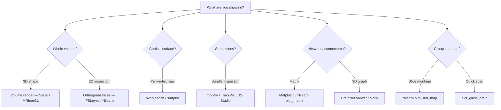

# Visualization

> Turning voxel arrays into images a human can interpret — windowing, slices, overlays, surfaces, tracts, and the colour-map decisions that decide whether a figure shows truth or hides it.

## Course map

What visualization actually does → orthogonal slices and windowing → 3D rendering and projections → overlays and statistical maps → tools at a glance → normal brain appearance per modality → pathology appearance per disease → colour maps and perception → QC and group-level visualization → good vs bad figures → references.

## 1. Learning objectives

- Read any neuroimaging figure and name the three decisions behind it: which voxels, which projection, which colour map.
- Render the canonical 3-plane orthogonal montage from raw NIfTI with [nibabel](https://nipy.org/nibabel/) + [matplotlib](https://matplotlib.org/) without orientation bugs.
- Pick the right viewer for the job (volume, surface, tractogram, connectome, cohort) without defaulting to whatever was open last.
- Recognise the appearance of CSF / WM / GM / blood across the seven core neuroimaging modalities and the major pathological signatures within each.
- Choose a colour map that is perceptually uniform, colorblind-safe, and faithful to the data type (sequential / diverging / categorical).
- Distinguish a publication-quality figure from a misleading one using concrete rules — scale bar, orientation, threshold, colour bar with units.

## 2. What visualization does

A NIfTI is a 3D (or 4D) array of numbers. Visualization is the lossy projection from that array onto a 2D screen so a human can perceive structure, lesions, or model outputs. Every figure throws away information; the skill is making the hiding *intentional and informative*.

Two layers of decision sit behind every figure:

- **Which voxels to show** — a slice, a maximum-intensity projection, a surface, a streamline bundle, a glass-brain silhouette.
- **How to colour them** — window / level, colour map, opacity, threshold, overlay order.

Get either wrong and the figure misleads. Get both right and a reader can replicate your interpretation from the picture alone.

In clinical neuroradiology, ~70% of reading time is spent scrolling orthogonal slices in a PACS viewer; in research, programmatic plots and overlays (Nilearn, Workbench, ggseg) dominate. The two cultures use *different* tools but make the same three decisions, and the rest of this page is organised around those decisions.

## 3. Orthogonal slices and windowing

### The three canonical planes

Every CT and MRI scan is read in all three orthogonal planes:

- **Axial / transverse** — top-down, the default for stroke / haemorrhage screening.
- **Sagittal** — side, the default for midline and brainstem inspection.
- **Coronal** — front-back, the default for medial-temporal-lobe and hippocampal work.

A single plane is almost always insufficient — a lesion that disappears axially can be obvious coronally. The 3-plane montage at the same cursor coordinate is the universal default.

### Window / level (W/L)

W/L is the mapping from voxel intensity range to display dynamic range. For CT it is universal because Hounsfield Units are absolute:

| Window | W (HU) | L (HU) | Used for |
|---|---|---|---|
| Brain | 80 | 35 | Grey/white differentiation, oedema, infarct |
| Subdural | 180 | 80 | Extra-axial haemorrhage |
| Bone | 2000 | 400 | Skull fractures, sinuses |
| Stroke | 40 | 35 | Early ischaemic changes (narrower than brain) |
| Lung | 1500 | -600 | Apical lung in cervical-spine CT |

For MRI, intensities are relative (arbitrary units), so percentile-based ("auto", clip to 1st-99th percentile) is the default. Always document the window if you tighten or stretch it for a figure.

### Code — a 3-plane orthogonal montage

```python
import nibabel as nib
import matplotlib.pyplot as plt

img = nib.load("sub-001_T1w.nii.gz").get_fdata()

fig, axes = plt.subplots(1, 3, figsize=(9, 3))
axes[0].imshow(img[img.shape[0] // 2, :, :].T, cmap="gray", origin="lower")
axes[1].imshow(img[:, img.shape[1] // 2, :].T, cmap="gray", origin="lower")
axes[2].imshow(img[:, :, img.shape[2] // 2].T, cmap="gray", origin="lower")
for ax, name in zip(axes, ["Sagittal", "Coronal", "Axial"]):
    ax.set_title(name)
    ax.axis("off")
fig.savefig("ortho.png", dpi=200, bbox_inches="tight")
```

For a polished version with MNI-aware coordinates and threshold overlays, use [`nilearn.plotting.plot_anat`](https://nilearn.github.io/stable/modules/generated/nilearn.plotting.plot_anat.html) — see [Getting started → Your first figure](../../getting-started/first-figure.md) for a walked-through example.

!!! warning "The origin pitfall"
    Forgetting `origin="lower"` flips superior ↔ inferior. Getting orientation wrong is the most common error in a draft figure. Always check against an anatomical landmark you know (e.g. the cerebellum sits at the bottom of an axial slice in radiological convention). See [Fundamentals → Coordinate systems](../coordinate-systems.md) for the radiological vs neurological convention and how it propagates through `nibabel`'s affine.

## 4. 3D rendering and projections

When a slice is not enough, four projections cover almost every research use case.

### Volume rendering

Ray-casting through the volume with a transfer function (opacity + colour per intensity). Best for whole-brain visualisations, surgical planning, anatomy teaching. Tools: [3D Slicer](https://www.slicer.org), [MRIcroGL](https://github.com/rordenlab/MRIcroGL), [ITK-SNAP](http://www.itksnap.org). MRIcroGL's GPU pipeline produces publication-grade renders from a single NIfTI in seconds.

### Surface rendering

Isosurface extraction from a label or thresholded volume, then rendered as a triangle mesh. The canonical neuroimaging surfaces are FreeSurfer's pial / white meshes, the HCP `fsLR` template surfaces, and CIFTI grayordinates that combine cortical surface vertices with subcortical voxels. See [Analysis → Surface-based analysis](../../analysis/surface.md) for the underlying conventions; [Connectome Workbench `wb_view`](https://www.humanconnectome.org/software/connectome-workbench) is the right viewer.

### Maximum / minimum intensity projection (MIP / mIP)

Collapse the volume along one axis, retaining only the max (or min) voxel value per ray. Standard for:

- **MIP** — MR angiography (MRA), CT angiography (CTA), time-of-flight angio — bright vessels pop against dark background.
- **mIP** — [SWI](../sequences/swi.md) venography (dark veins pop against bright parenchyma), microbleed inspection.

### Glass-brain projections

Overlay statistical maps on a transparent brain outline projected to each cardinal axis. [`nilearn.plotting.plot_glass_brain()`](https://nilearn.github.io/stable/modules/generated/nilearn.plotting.plot_glass_brain.html) is the canonical implementation; the entire stat map collapses to three silhouettes you can inspect at a glance.

### Mesh visualisation for streamlines and parcels

For tractography and parcellations, the volume is the wrong primitive. Use mesh-aware tools: [surfplot](https://surfplot.readthedocs.io/), [brainspace](https://brainspace.readthedocs.io/), [PyVista](https://pyvista.org/), [fury](https://fury.gl/). Coloured streamlines (RGB by orientation) and parcels (categorical palette) project natively onto a cortical mesh.



*<small>Decision flow for picking a viewer by what you are trying to show. Original figure.</small>*

## 5. Overlays — anatomy + statistic + segmentation

The default research figure is a thresholded statistical map overlaid on a T1w anatomy in MNI space. Three layers must be aligned and ordered:

1. **Base anatomy** — greyscale T1w of the subject or the [MNI152](https://www.bic.mni.mcgill.ca/ServicesAtlases/ICBM152NLin2009) template. Display at full opacity, low-contrast greyscale.
2. **Thresholded statistic** — red-yellow ramp for positive effects, blue-cyan for negative (the bidirectional convention). Display at 70-100% opacity above threshold, transparent below.
3. **Optional outlines** — ROI / parcellation borders as 1-2 px contours, single colour per label.

Transparency lets the reader see *where on the anatomy* an effect sits, not just that an effect exists.

```python
from nilearn import plotting, datasets

plotting.plot_stat_map(
    "group/zstat1.nii.gz",
    bg_img=datasets.load_mni152_template(),
    threshold=3.1,
    display_mode="ortho",
    cut_coords=(0, -52, 18),
    cmap="cold_hot",
    output_file="figs/group_zstat1.png",
)
```

For segmentations, give each label a distinct categorical colour and overlay at alpha ~0.5 over the anatomy. For tractography, two options:

- **Streamline density maps** — voxel count of streamlines per voxel; overlay as a sequential heatmap on T1w.
- **Direction-encoded RGB** — colour each streamline segment by its local orientation: x=red, y=green, z=blue. This is the universal DTI convention and is built into [MRtrix3 `mrview`](https://www.mrtrix.org), [DSI Studio](https://github.com/frankyeh/DSI-Studio), and [TrackVis](https://trackvis.org).

## 6. Tools at a glance

A working-set table. For the full catalogue with installation notes and opinionated picks, see [Tools → Visualization & EDA](../../tools/viz-and-eda.md).

| Category | Tools | When to reach for it |
|---|---|---|
| **Clinical-style volume viewers** | [3D Slicer](https://www.slicer.org), [ITK-SNAP](http://www.itksnap.org), [MRIcroGL](https://github.com/rordenlab/MRIcroGL), [Horos / OsiriX](https://horosproject.org), [Mango](https://mangoviewer.com), [Papaya](http://www.nitrc.org/projects/papaya/) | DICOM-native browsing; manual segmentation; one-shot GPU renders |
| **Research neuroimaging viewers** | [FSLeyes](https://github.com/pauldmccarthy/fsleyes), [Freeview](https://surfer.nmr.mgh.harvard.edu/fswiki/FreeviewGuide), [Connectome Workbench `wb_view`](https://www.humanconnectome.org/software/connectome-workbench) | NIfTI / GIFTI / CIFTI overlays, surface-based work |
| **Tractography viewers** | [MRtrix3 `mrview`](https://www.mrtrix.org), [TrackVis](https://trackvis.org), [DSI Studio](https://github.com/frankyeh/DSI-Studio), [TractEdit](https://github.com/marcotag93/TractEdit) | Streamline bundles, virtual dissection, RGB direction colouring |
| **Programmatic — Python** | [nilearn](https://nilearn.github.io/) (`plot_anat`, `plot_stat_map`, `plot_glass_brain`, `plot_surf_stat_map`), [nibabel](https://nipy.org/nibabel/) + matplotlib, [surfplot](https://surfplot.readthedocs.io/), [brainspace](https://brainspace.readthedocs.io/), [PyVista](https://pyvista.org/), [fury](https://fury.gl/), [napari](https://napari.org/) | Anything destined for a paper or a CI-built report |
| **Programmatic — R** | [ggseg](https://github.com/ggseg/ggseg), [oro.nifti](https://cran.r-project.org/web/packages/oro.nifti/), [neurobase](https://github.com/muschellij2/neurobase) | DK / Schaefer atlas plots when stats live in R |
| **Browser-native** | [Niivue](https://niivue.github.io), [Papaya](http://www.nitrc.org/projects/papaya/), [BrainBrowser](https://brainbrowser.cbrain.mcgill.ca) | Paper supplements, share-a-volume-with-a-collaborator, no install |

The defensible default: one heavyweight viewer for editing (ITK-SNAP or Slicer), one lightweight one for snapshots (FSLeyes or MRIcroGL), Nilearn for programmatic figures.

## 7. What a NORMAL brain looks like per modality

A reference card. For each modality: how CSF / WM / GM / blood / fat / air appear, and what landmarks to look at first when checking the scan is normal. Cross-link to the [Sequences & modalities](../sequences/index.md) chapter for physics.

| Modality | CSF | WM | GM | Blood | Fat | Air | First-look landmarks |
|---|---|---|---|---|---|---|---|
| **[T1w / MPRAGE](../sequences/mprage.md)** | dark | bright | dark | iso | bright | dark | Corpus callosum continuity, ventricle symmetry, no mass effect, sharp GM-WM junction |
| **T2w ([spin echo](../sequences/spin-echo.md))** | bright | dark | intermediate | dark (acute) | bright | dark | Ventricle size, focal T2 hyperintensities (the default lesion signature) |
| **[FLAIR](../sequences/flair.md)** | **suppressed** | dark | intermediate | dark | bright | dark | Periventricular WM (MS), mesial temporal lobe (FCD / HSV), cortical ribbon (encephalitis) |
| **[DWI / ADC](../sequences/dwi.md)** | dark on DWI | iso | iso | – | – | dark | Any focal bright DWI + dark ADC = acute stroke until proven otherwise |
| **[GRE / SWI](../sequences/swi.md)** | iso | iso | iso | **dark** (blood, iron, Ca) | iso | dark | Microbleeds in basal ganglia, thalamus, lobar GM-WM junction |
| **[CT (NCCT)](../sequences/ct.md)** | 0-15 HU | 25-35 HU | 35-45 HU | 50-90 HU (fresh) | -100 HU | -1000 HU | Midline shift, hyperdense vessel sign, sulcal effacement, ventricle symmetry |
| **[ASL CBF](../sequences/asl.md)** | – | ~20 mL/100g/min | ~40-80 mL/100g/min | – | – | – | Hemispheric CBF symmetry, no focal hypoperfusion in vascular territories |
| **[FDG-PET](../sequences/pet.md)** | – | low | high (posterior cingulate, precuneus) | – | – | – | Bilaterally symmetric metabolism, no focal hypometabolism |
| **Amyloid PET** | – | high (non-specific WM binding) | low (normal) | – | – | – | Cortical GM should be **darker** than WM — if cortex is brighter, amyloid-positive |
| **DAT-SPECT** | – | low | bilateral intense putamen + caudate ("commas") | – | – | – | Symmetric comma shape — asymmetric or "dot" = PD / atypical parkinsonism |
| **[MRS](../sequences/mrs.md)** | – | – | – | – | – | – | NAA peak at 2.0 ppm, creatine 3.0, choline 3.2, no lactate doublet at 1.3 |
| **[qMRI / MRF](../sequences/qmri.md)** | T1 ~3500 ms, T2 ~1500 ms (CSF) | T1 ~800 ms, T2 ~75 ms | T1 ~1300 ms, T2 ~95 ms | – | – | – | Per-tissue T1/T2 falls in published normative ranges |
| **[EEG](../sequences/eeg.md)** | – | – | – | – | – | – | Posterior dominant alpha (8-13 Hz) on eyes-closed occipital channels, no spike-wave |

Memorise the CSF column. "CSF bright" vs "CSF dark" is the single fastest way to tell T1 from T2 from FLAIR at a glance.

## 8. What PATHOLOGY looks like per disease

The visualisation atlas. Each entry: modality where it shows, what it looks like, first-look strategy. Cross-link to the matching [Clinical applications](../../clinical/index.md) chapter for management context.

### Vascular

| Pathology | Modality | Appearance | First look | Clinical |
|---|---|---|---|---|
| **Acute ischaemic stroke** | DWI / ADC; CT | Bright DWI + dark ADC; hyperdense MCA sign on CT; arterial occlusion on CTA | Any bright DWI focus in a vascular territory | [Stroke & TBI](../../clinical/stroke-and-tbi.md) |
| **Chronic infarct** | T2 / FLAIR; T1 | T2/FLAIR hyper + encephalomalacia (volume loss) + ex vacuo dilatation of adjacent ventricle | Wedge-shaped cortical loss in a vascular territory | [Stroke & TBI](../../clinical/stroke-and-tbi.md) |
| **Intracerebral haemorrhage (ICH)** | NCCT; SWI | Hyperdense (50-90 HU) acutely; evolves hyper → iso → hypo over weeks; chronic = T2/SWI dark (haemosiderin) | Hyperdense focus + mass effect on NCCT | [Stroke & TBI](../../clinical/stroke-and-tbi.md) |
| **Subarachnoid haemorrhage (SAH)** | NCCT; FLAIR | Hyperdense blood in sulci / cisterns / sylvian fissure (~95% sensitivity within 24 h); FLAIR hyper if NCCT-negative | Star-shaped basal cistern hyperdensity | [Stroke & TBI](../../clinical/stroke-and-tbi.md) |
| **AVM / aneurysm** | T2 / FLAIR; CTA / DSA | Flow voids on T2/FLAIR; CTA / DSA confirms; SAH if ruptured | Serpiginous flow voids without mass effect | [Stroke & TBI](../../clinical/stroke-and-tbi.md) |
| **CADASIL / SVD** | FLAIR; SWI | Extensive WMH including temporal poles and external capsules; microbleeds | Temporal-pole WMH in a young patient | [Stroke & TBI](../../clinical/stroke-and-tbi.md) |
| **Cerebral amyloid angiopathy (CAA)** | SWI | Lobar microbleeds + cortical superficial siderosis | SWI dark "rim" along cortex | [Alzheimer's & related dementias](../../clinical/alzheimers-and-dementia.md) |

### Inflammatory and demyelinating

| Pathology | Modality | Appearance | First look | Clinical |
|---|---|---|---|---|
| **Multiple sclerosis (MS)** | [FLAIR](../sequences/flair.md), [SWI](../sequences/swi.md) | Ovoid T2/FLAIR hyperintense lesions perpendicular to ventricles (Dawson's fingers); central vein sign on FLAIR* / SWI; paramagnetic rim lesions on SWI/QSM; T1 "black holes" | Periventricular ovoid lesions oriented along callosal veins | [Multiple sclerosis](../../clinical/multiple-sclerosis.md) |
| **HSV encephalitis** | FLAIR, DWI | T2/FLAIR + DWI hyper in limbic and insular cortex, often bilateral and asymmetric | Limbic-cortex DWI/FLAIR hyper sparing basal ganglia | – |

### Neurodegenerative

| Pathology | Modality | Appearance | First look | Clinical |
|---|---|---|---|---|
| **Alzheimer's disease** | T1 MPRAGE; FDG-PET; amyloid PET | Medial temporal lobe atrophy (hippocampus, entorhinal); posterior parietal in atypical variants; posterior-cingulate FDG hypometabolism; amyloid PET cortex > WM | Coronal hippocampal volume + posterior-cingulate FDG | [Alzheimer's & related dementias](../../clinical/alzheimers-and-dementia.md) |
| **Parkinson's disease** | SWI; neuromelanin-MRI; DAT-SPECT | Loss of "swallow-tail sign" in nigrosome-1 on SWI; hypointensity in SN on neuromelanin-MRI; asymmetric DAT-SPECT putaminal reduction ("egg" or "dot") | Axial SWI through midbrain at nigrosome-1 level | [Parkinson's & movement](../../clinical/parkinsons-and-movement.md) |

### Epilepsy

| Pathology | Modality | Appearance | First look | Clinical |
|---|---|---|---|---|
| **Mesial temporal sclerosis** | FLAIR, T2, coronal T1 | Unilateral hippocampal T2/FLAIR hyper + volume loss; loss of internal architecture | Coronal oblique view through hippocampal long axis | [Epilepsy](../../clinical/epilepsy.md) |
| **Focal cortical dysplasia (FCD)** | FLAIR, T1 | Subtle T2/FLAIR hyper + GM-WM junction blurring; "transmantle sign" pointing toward the ventricle | Slice-by-slice FLAIR inspection; automated detection with [MELD](https://meldproject.github.io/) | [Epilepsy](../../clinical/epilepsy.md) |

### Tumour and trauma

| Pathology | Modality | Appearance | First look | Clinical |
|---|---|---|---|---|
| **Brain tumour (high-grade glioma)** | T1+contrast, T2/FLAIR | Irregular ring enhancement + central necrosis + surrounding T2/FLAIR oedema + mass effect + midline shift | Ring + oedema + mass effect = high-grade until proven otherwise | – |
| **Metastases** | T1+contrast, SWI | Multiple enhancing foci at GM-WM junction; often haemorrhagic on SWI | Junction-located ring lesions, often multiple | – |
| **Meningioma** | T1+contrast | Dural-based extra-axial enhancing mass + dural tail | Look for the dural base, not the parenchyma | – |
| **TBI / diffuse axonal injury (DAI)** | SWI; FLAIR | SWI microbleeds at GM-WM junction, corpus callosum, brainstem; cortical contusions on T2/FLAIR | SWI-MIP showing "petechial" microhaemorrhages | [Stroke & TBI](../../clinical/stroke-and-tbi.md) |

### Hydrodynamic

| Pathology | Modality | Appearance | First look | Clinical |
|---|---|---|---|---|
| **Hydrocephalus** | NCCT, T1, FLAIR | Ventricular dilatation (Evans index > 0.3); transependymal flow on FLAIR; sulcal effacement | Frontal-horn span / inner-table span ratio | – |

The two patterns most worth memorising as a researcher: *"bright DWI + dark ADC = acute stroke"* and *"ovoid periventricular FLAIR hyper perpendicular to ventricles = MS"*. Both come up in nearly every clinical cohort.

## 9. Colour maps — the often-overlooked craft

### Why "jet" is harmful

The classic rainbow ("jet") colour map fails on three counts: perceptual non-uniformity (luminance peaks at yellow and dips at red/blue, so distance in colour space does not match distance in value), discontinuous luminance gradient (introduces phantom edges), and ordinal misleading-ness (no monotone ordering of hues). [Borland & Taylor (2007)](https://doi.org/10.1109/MCG.2007.323435) and the broader [Crameri et al. (2020)](https://doi.org/10.1038/s41467-020-19160-7) review document the resulting misinterpretation in published figures.

Jet also fails deuteranopia simulation — colourblind readers see merged bands.

### Pick by data type

| Data type | Choose | Examples |
|---|---|---|
| **Sequential** — one direction, no centre | viridis, plasma, magma, cividis | CBF, tSNR, FA, streamline density |
| **Diverging** — both signs meaningful, zero is the centre | RdBu_r, coolwarm, [Crameri's vik](https://www.fabiocrameri.ch/colourmaps/) | t-statistics, ComBat residuals, longitudinal change |
| **Categorical** — labels with no order | tab10, tab20, glasbey, [Crameri's batlow](https://www.fabiocrameri.ch/colourmaps/) | Parcellations, network communities, segmentation labels |
| **Statistical bicolour** — positive AND negative on transparent threshold | nilearn's `cold_hot`, FSL's `red-yellow` + `blue-lightblue` | Activation maps overlaid on anatomy |

[Matplotlib's defaults since v2.0](https://matplotlib.org/stable/users/prev_whats_new/dflt_style_changes.html) are perceptually uniform; the viridis family also passes deuteranopia and protanopia simulation. Verify any custom map at [Color Brewer 2.0](https://colorbrewer2.org).

### Discrete vs continuous

Bin a continuous metric only if there are natural breakpoints (e.g. ASPECTS regions, Centiloid bins, MMSE severity categories). Otherwise keep continuous — binning destroys ordering information for no benefit. The exception: clinical thresholds (e.g. CBF < 20 mL/100g/min ischaemic core) are *meaningful* binnings and earn discrete maps.

## 10. QC and group-level visualization

Visualization is half of QC. The full mechanics live in [Analysis → QC & outlier detection](../../analysis/qc.md); the visual decisions are:

- **Per-subject orthogonal grid** — a 3 × N tile of axial / coronal / sagittal slices for every subject in a study, on one HTML page. Spot a bad mask in seconds. [MRIQC](https://mriqc.readthedocs.io/) and [fMRIPrep](https://fmriprep.org/) reports do this by default.
- **Carpet (grayplot)** — BOLD voxels (rows, ordered by tissue class) × time (columns) as a greyscale image. Motion appears as vertical stripes. [Power 2017](https://doi.org/10.1016/j.neuroimage.2016.08.009) — the single most informative single-figure summary of an fMRI run.
- **tSNR maps** — voxelwise temporal SNR on a viridis sequential map; spatial dropouts are immediately visible.
- **Motion timecourse** — FD over volumes, with the FD = 0.5 mm threshold drawn in.
- **Group stat maps** — thresholded t / z map on the MNI template, three orthogonal views, with both axial montage *and* glass-brain projection beside each other for inspection at a glance.
- **Surface-projected group maps** — same statistic, projected to `fsLR` with [Workbench](https://www.humanconnectome.org/software/connectome-workbench) or [surfplot](https://surfplot.readthedocs.io/); lateral + medial × left + right on one canvas.
- **Tractography group results** — streamline density overlaid on the cohort T1 template; bundle-specific views with direction-encoded RGB.
- **Connectome plots** — sorted matrix view (by parcellation + community), force-directed graph layout, chord diagrams for community structure, or 3D brain-rendered nodes-and-edges with [BrainNet Viewer](https://www.nitrc.org/projects/bnv/) / [BrainSpace](https://brainspace.readthedocs.io/).
- **Cohort small multiples** — the same montage for every subject side-by-side. Individual variability that summary statistics hide jumps out visually.

## 11. Good vs bad figures — concrete rules

Always:

- Scale bar or voxel coordinate (mm).
- Orientation marker — L/R, S/I, A/P labels on the slice edge.
- Colour bar with units (HU, % change, t-statistic, mL/100g/min).
- Threshold value labelled in the caption *and* visible as a colour-bar lower limit.
- Slice indices (MNI coordinates if normalised; voxel indices if native).

Never:

- Jet colour map in 2026. There is no remaining defensible use case.
- Pseudo-3D shading or shadow on statistical maps — it implies a depth that does not exist.
- Arbitrary z-thresholds without permutation-test or RFT-cluster justification (see [Analysis → Multiple comparisons](../../analysis/multiple-comparisons.md)).
- Truncated colour scales that clip outliers without saying so.
- Figures with no orientation indicator. A reader cannot tell L from R if you do not label it.

Two tests every draft figure should pass:

- **The reproducibility test.** Can a reader regenerate this figure from your data, your script, and the threshold values printed in the legend? If no, the figure is not reproducible — and methods journals increasingly will not accept it. See [Career → Methods writing](../../career/methods-writing.md) and [Analysis → Reliability & reproducibility](../../analysis/reliability.md) for the reporting standards.
- **The "without text" test.** Cover the title and caption. Can a reader still understand what is being shown? If no, the figure is over-relying on prose. The figure should communicate first; the caption only refines.

## 12. References

1. **Borland D, Taylor MR.** Rainbow color map (still) considered harmful. *IEEE Comput Graph Appl.* 2007;27(2):14-17. [doi:10.1109/MCG.2007.323435](https://doi.org/10.1109/MCG.2007.323435)
2. **Crameri F, Shephard GE, Heron PJ.** The misuse of colour in science communication. *Nat Commun.* 2020;11:5444. [doi:10.1038/s41467-020-19160-7](https://doi.org/10.1038/s41467-020-19160-7)
3. **Power JD.** A simple but useful way to assess fMRI scan qualities. *NeuroImage.* 2017;154:150-158. [doi:10.1016/j.neuroimage.2016.08.009](https://doi.org/10.1016/j.neuroimage.2016.08.009) — carpet plots.
4. **Abraham A, Pedregosa F, Eickenberg M, et al.** Machine learning for neuroimaging with scikit-learn. *Front Neuroinform.* 2014;8:14. [doi:10.3389/fninf.2014.00014](https://doi.org/10.3389/fninf.2014.00014) — Nilearn.
5. **Marcus DS, Harms MP, Snyder AZ, et al.** Human Connectome Project informatics: quality control, database services, and data visualization. *NeuroImage.* 2013;80:202-219. [doi:10.1016/j.neuroimage.2013.05.077](https://doi.org/10.1016/j.neuroimage.2013.05.077)
6. **Esteban O, Birman D, Schaer M, et al.** MRIQC: advancing the automatic prediction of image quality in MRI from unseen sites. *PLoS One.* 2017;12:e0184661. [doi:10.1371/journal.pone.0184661](https://doi.org/10.1371/journal.pone.0184661)
7. **Gorgolewski K, Burns CD, Madison C, et al.** Nipype: a flexible, lightweight and extensible neuroimaging data processing framework in Python. *Front Neuroinform.* 2011;5:13. [doi:10.3389/fninf.2011.00013](https://doi.org/10.3389/fninf.2011.00013) — substrate for nipreps reports.
8. **Yushkevich PA, Piven J, Hazlett HC, et al.** User-guided 3D active contour segmentation of anatomical structures (ITK-SNAP). *NeuroImage.* 2006;31:1116-1128. [doi:10.1016/j.neuroimage.2006.01.015](https://doi.org/10.1016/j.neuroimage.2006.01.015)
9. **Fedorov A, Beichel R, Kalpathy-Cramer J, et al.** 3D Slicer as an image computing platform for the quantitative imaging network. *Magn Reson Imaging.* 2012;30:1323-1341. [doi:10.1016/j.mri.2012.05.001](https://doi.org/10.1016/j.mri.2012.05.001)
10. **Vos de Wael R, Benkarim O, Paquola C, et al.** BrainSpace: a toolbox for the analysis of macroscale gradients in neuroimaging and connectomics datasets. *Commun Biol.* 2020;3:103. [doi:10.1038/s42003-020-0794-7](https://doi.org/10.1038/s42003-020-0794-7)

## Where to next

- [Tools → Visualization & EDA](../../tools/viz-and-eda.md) — the full tool catalogue with opinionated picks per task.
- [Getting started → Your first figure](../../getting-started/first-figure.md) — hands-on intro from a downloaded NIfTI to a saved PNG.
- [Analysis → QC & outlier detection](../../analysis/qc.md) — visualization details specific to QC workflows.
- [Tutorials](../../tutorials/index.md) — worked tutorials whose figures use everything above.
- [Medical imaging](index.md) — back to the section landing.
