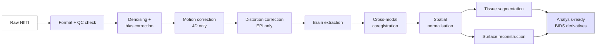
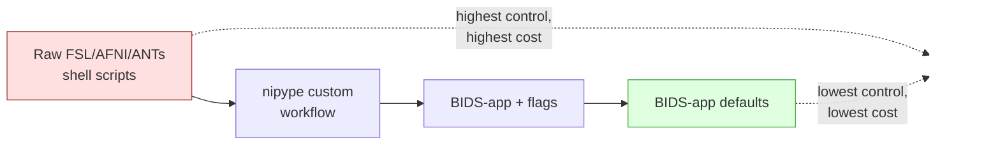

# Preprocessing overview

Raw MRI volumes are not analysis-ready. A handful of preprocessing steps are nearly universal, and most labs no longer hand-roll them — they delegate to a community BIDS-app.



*<small>The universal MRI preprocessing pipeline. Each block has many implementations; BIDS apps standardise the chain. Original figure.</small>*

## The universal steps

| Step | What it does | When |
| --- | --- | --- |
| **Format check** | BIDS validation, header sanity | Once per dataset |
| **Denoising / bias correction** | Remove scanner artifacts, intensity inhomogeneity | All modalities |
| **Motion correction** | Align volumes across time (fMRI, DWI) | 4D modalities |
| **Distortion correction** | Correct susceptibility distortions using field maps | EPI sequences (fMRI, DWI) |
| **Brain extraction** | Skull strip; mask the brain | All modalities |
| **Coregistration** | Align modalities within a subject | Multi-modal sessions |
| **Spatial normalisation** | Warp to a standard template (MNI, fsaverage) | Group analyses |
| **Tissue segmentation** | Grey / white / CSF labels | Most pipelines |
| **Surface reconstruction** | Build cortical surface mesh | Surface-based pipelines |

Each step has many implementations. Each implementation has decades of papers behind it. You do not need to reinvent them.

## Use a BIDS-app

A **BIDS-app** is a containerised, opinionated pipeline that consumes a BIDS dataset and produces a BIDS-derivatives dataset. The dominant ones:

- **fMRIPrep** ([docs](https://fmriprep.org)) — functional MRI preprocessing [Esteban et al., 2019](https://doi.org/10.1038/s41592-018-0235-4)[^fmriprep].
- **QSIPrep** ([docs](https://qsiprep.readthedocs.io)) — diffusion MRI preprocessing [Cieslak et al., 2021](https://doi.org/10.1038/s41592-021-01185-5)[^qsiprep].
- **sMRIPrep** — structural MRI preprocessing.
- **MRIQC** ([docs](https://mriqc.readthedocs.io)) — automated quality control reports [Esteban et al., 2017](https://doi.org/10.1371/journal.pone.0184661)[^mriqc].
- **PETPrep** — PET preprocessing.
- **HippUnfold**, **MELD**, **NiBabies**, **NiRodents** — modality / population specific.

They all run with the same CLI shape:

```bash
docker run --rm \
  -v $PWD/bids_dataset:/data:ro \
  -v $PWD/derivatives:/out \
  nipreps/fmriprep:24.0.0 /data /out participant \
  --fs-license-file /opt/fs_license.txt
```

The argument order — input, output, analysis-level — is part of the BIDS-app spec, so the same orchestration script works for all of them.

## Why this matters for data engineering

From a pipeline-engineering perspective, BIDS-apps give you four big things for free:

1. **Containerisation** — pinned, reproducible images.
2. **Idempotency** — most BIDS-apps skip already-completed work.
3. **Provenance** — output `dataset_description.json` records the BIDS-app version, key parameters, and a citation graph.
4. **Schema enforcement** — input validation happens before compute.

That covers four of the five pillars from [Data engineering → The five pillars](../data-engineering/five-pillars.md). The fifth — observability — is what you add on top.

## Pitfalls

- **TemplateFlow downloads.** Many BIDS-apps fetch templates at runtime. On HPC nodes without network access, pre-populate `${TEMPLATEFLOW_HOME}` before the run.
- **FreeSurfer license.** `recon-all` (and anything that wraps it) needs a `license.txt`. Free, but you have to request it from the FreeSurfer site.
- **Long runtimes.** `recon-all` is ~10 h per subject on CPU. FastSurfer is the DL-accelerated drop-in if your throughput matters.
- **Resource sizing.** fMRIPrep peaks at ~16 GB RAM and uses many cores; QSIPrep is heavier still. Look at the docs before sizing Slurm requests.

## Failure modes — what goes wrong in practice

!!! tip "Beginner takeaway"
    Every preprocessing step has one or two characteristic ways it fails. Knowing the symptom → cause → fix triplet is what separates "ran fMRIPrep once" from "can run fMRIPrep on a real cohort".

The pipeline above is the happy path. Below is the failure catalogue.

### Brain extraction fails on pediatric or pathological brains

- **Symptom** — BET drops too much frontal lobe or chunks of cerebellum; FreeSurfer's skull-strip misses the skull base; the brain mask has a "bite" out of one side.
- **Cause** — classical methods were tuned on adult, neurotypical, lesion-free brains. Pediatric brains have different T1 contrast; tumours / oedema / large ventricles violate the shape prior.
- **Fix** — switch to a learned, domain-robust extractor: **SynthStrip** ([Hoopes et al., 2022](https://doi.org/10.1016/j.neuroimage.2022.119474))[^synthstrip] or **HD-BET** ([Isensee et al., 2019](https://doi.org/10.1002/hbm.24750))[^hdbet]. Both handle pediatric, glioma, and post-surgical brains far better than BET. As a last resort, hand-edit the mask in ITK-SNAP / 3D Slicer.

### Topup vs SyN-SDC distortion correction

- **Symptom** — EPI ventral frontal cortex still looks compressed after preprocessing, or geometry doesn't match the T1 even after coregistration.
- **Cause** — `topup` needs a reversed phase-encode acquisition (a "blip-up / blip-down" pair); SyN-based fieldmap-less correction (the fMRIPrep `--use-syn-sdc` path) needs a *clean T1* and a plausible distortion prior.
- **When SyN fails** — severe susceptibility (7 T, dental hardware), missing T1, or post-surgical anatomy that breaks the registration prior. Don't trust SyN-SDC silently; eyeball the report.
- **Fix** — acquire reversed-PE volumes as protocol policy. If the data is already collected without them, use `pepolar` if you have *any* short reverse-PE scan, otherwise SyN-SDC with manual QC.

### N4 bias correction over-corrects in low-SNR regions

- **Symptom** — bright hyperintense rim around the cortex; signal drop in the centre of the brain; "ghostly" intensity gradients on the QC slice.
- **Cause** — N4 fits a smooth multiplicative field; in low-SNR regions (cerebellum, brainstem) it over-fits.
- **Fix** — shorten the convergence schedule, mask aggressively before correction (use a generous brain mask, not the head), and run N4 twice with an intermediate mask refinement rather than a single deep pass.

### FreeSurfer recon-all pial-surface errors

The single most common cause of `recon-all` QC failure: the pial surface includes dura, the dural sinus, or skull. Cortical thickness is then wildly over-estimated near the parietal vertex or the temporal pole.

- **Cause** — high-intensity dura is misclassified as grey matter.
- **Fix** — edit `wm.mgz` (white-matter cuts) or `brain.finalsurfs.mgz` (manual control points), then rerun with `recon-all -autorecon-pial -subjid <id>`. The [andysbrainbook FreeSurfer-edits chapter](https://andysbrainbook.readthedocs.io/en/latest/FreeSurfer/FS_ShortCourse/FS_07_Editing.html) walks through the gestures.

### Slice-timing correction for multi-band sequences

- **Symptom** — task GLMs fit poorly, especially for fast (<1 s) TRs.
- **Cause** — simultaneous multi-slice (SMS / multiband) acquisitions invalidate "ascending" / "interleaved" / "descending" assumptions. Multiple slices are excited together, then stepped by a multiband factor.
- **Fix** — *never* infer slice timing from the protocol name. Read the `SliceTiming` field from the BIDS JSON sidecar — it lists the acquisition time of every slice in seconds. fMRIPrep does this automatically; if you're rolling your own correction, mirror it.

### Eddy-current correction on small cohorts

- **Symptom** — DWI tractography crosses to the wrong hemisphere or produces missing tracts.
- **Cause** — `eddy_correct` (the old tool) rotates the volumes but does *not* rotate the `.bvec` directions. Tractography then integrates along the wrong directions.
- **Fix** — use FSL `eddy` (the newer one), which rotates bvecs internally. If stuck with `eddy_correct`, apply a bvec rotation step using the eddy-output transforms (`fdt_rotate_bvecs`).

### Coregistration cost-function choice

- **Symptom** — partial-volume regions (cortical ribbon, brainstem) silently misalign; whole-brain Dice looks fine.
- **Cause** — wrong similarity metric for the modality pair. Sum-of-squared-differences and normalised cross-correlation assume intensity scales match; mutual information assumes only a joint-histogram relationship.
- **Fix** — **NMI / MI** for cross-modal (T1 ↔ EPI, T1 ↔ FLAIR, T1 ↔ PET); **NCC or SSD** for intra-modal, same-contrast. For T1 ↔ EPI specifically, use **boundary-based registration (BBR)** when a FreeSurfer surface is available — it dominates pure intensity-based methods.

## Distortion correction — picking a method

The "topup vs SyN-SDC" failure-mode entry above is the symptom view. Here is the design-time view: a comparison across the three families of EPI distortion correction, so you can pick before you scan rather than debug afterwards.

| Method | Requires | Accuracy | Cost | Fails when |
| --- | --- | --- | --- | --- |
| **[topup](https://fsl.fmrib.ox.ac.uk/fsl/fslwiki/topup) (blip-up/down)** | Reversed-PE pair acquired in-session | Best when data are clean | Extra ~30 s of scan time | One direction is motion-corrupted; PE directions mislabelled in BIDS |
| **Fieldmap-based (`gre_field_mapping`)** | Dedicated B0 fieldmap acquisition | Good; gives voxel-displacement map directly | Extra ~1 min of scan time; sequence setup | Subject motion between fieldmap and EPI; phase wraps at long TE |
| **[Synb0-DisCo](https://github.com/MASILab/Synb0-DISCO)** | T1w only — DL synthesises a distortion-free b=0 | Adequate when no fieldmap exists | Zero scanner cost; GPU at processing time | T1w is poor quality; DL OOD on non-adult anatomy |
| **SyN-SDC (fieldmap-less SyN)** | T1w only — non-linear EPI → T1w | Adequate; fMRIPrep's fallback | Pure compute cost | Strong distortions near sinus / ear canals overwhelm regularisation |

Cost ordering: topup > fieldmap > Synb0/SyN-SDC, in scanner time and setup complexity. Accuracy roughly tracks cost when everything works.

**Why ASL and DWI typically choose differently from fMRI.** [DWI](sequences/dwi.md) has very high distortion (long readouts, low bandwidth) and the diffusion-weighted volumes are useless for image registration; topup using the b=0 volumes is the standard ([QSIPrep](https://qsiprep.readthedocs.io) defaults to it). [ASLPrep](https://www.nitrc.org/projects/aslprep) acquires very short labelled/control pairs where a separate fieldmap usually does not survive the perfusion contrast; Synb0-DisCo or SyN-SDC are more common. fMRI sits in the middle: topup when reversed-PE was acquired, otherwise fieldmap, with synthetic methods as a fallback. If you cannot identify which method your BIDS-app actually ran, look at the [fMRIPrep](https://fmriprep.org) or [QSIPrep](https://qsiprep.readthedocs.io) HTML report — both document the per-subject fieldmap-selection decision.

## Pipeline choice — roll your own vs adopt a BIDS-app

There is a spectrum from "raw FSL scripts in bash" to "off-the-shelf BIDS-app, no flags".



*<small>The preprocessing-pipeline spectrum. Most labs should sit between C and D. Original figure.</small>*

**When to adopt a BIDS-app default.** You are a clinical research group, your cohort matches the BIDS-app's training population, you want reviewer-defensible provenance, you do not have a methodologist on staff. This is the right answer for ~80% of projects — typically [fMRIPrep](https://fmriprep.org), [QSIPrep](https://qsiprep.readthedocs.io), [sMRIPrep](https://www.nipreps.org/smriprep/), or [FastSurfer](https://github.com/Deep-MI/FastSurfer) as a `recon-all` drop-in.

**When to customise via flags.** You have an unusual acquisition (multi-echo, sub-millimetre, 7T, pediatric); you need a specific output space; you want to disable a step your QC says is harming you. Stay within the BIDS-app flag surface — every flag you set is a thing you must justify in methods.

**When to write a [nipype](https://nipype.readthedocs.io/) workflow.** You are doing something the BIDS-apps do not support (custom field-map handling, multi-modal fusion, lesion-aware steps for cohorts like [MELD](https://meldproject.github.io/)). You accept the cost of writing, testing, containerising, and documenting it.

**When to roll raw shell scripts.** Almost never. The reproducibility tax is too high. If you find yourself here, ask whether a [nipype](https://nipype.readthedocs.io/) port or a fork of an existing BIDS-app is cheaper in the long run.

The cost of "I just need to change one step" is rarely one step — it is one step plus a year of explaining why your derivatives differ from everyone else's.

## Quality-control gates

Preprocessing should *fail loudly* at gates and *warn quietly* elsewhere. A failure gate stops the pipeline and excludes the subject from downstream analysis; a warning is logged but the run continues.

| Step | Gate or warn? | Why |
| --- | --- | --- |
| BIDS validation | **Gate** | Wrong metadata corrupts every downstream step |
| Brain extraction Dice vs reference | **Gate** | A bad mask poisons coregistration and normalisation |
| Coregistration final cost value | **Warn** | Numeric metric, hard threshold is brittle |
| Normalisation Jacobian negative voxels | **Gate** | Folding means the warp is non-diffeomorphic |
| Motion FD spikes (fMRI) | **Warn** | Mark for scrubbing downstream, do not exclude here |
| `recon-all` exit code + `IsRunning.lh` flag | **Gate** | Surface reconstruction silently fails otherwise |

Expose every gate decision to downstream code via a BIDS-derivatives sidecar (a `_desc-qc_bold.json` with `pass: false` and the reason) so cohort analyses can filter without re-deriving QC. See [Analysis → QC](../analysis/qc.md) for the cohort-level view.

## When preprocessing breaks the science

A pipeline can be technically correct and still erase the signal you were paid to find. Common own-goals:

- **Smoothing kernel ≫ effect size.** A 12 mm FWHM Gaussian washes out a 3 mm focal activation. Pick the kernel from the expected effect, not the protocol default.
- **Aggressive motion scrubbing biases low-motion groups.** Censoring frames with FD > 0.2 mm differentially removes data from kids, patients, and older subjects. The remaining data is "cleaner" *and* biased ([Power et al., 2014](https://doi.org/10.1016/j.neuroimage.2013.08.048))[^power2014]. Report the per-group censored fraction; consider FD as a continuous nuisance regressor instead of a hard threshold.
- **Defacing destroys the orbital frontal cortex.** Standard defacing tools blur or excise voxels near the face — including OFC grey matter. Surface reconstruction near the orbital frontal cortex then fails. Use *skull-stripping* before sharing instead, or a face-only defacer (`mri_reface`, `pydeface --applyto`) tested against your downstream pipeline. See [Governance → Privacy and HIPAA/GDPR](../governance/privacy-and-hipaa-gdpr.md).
- **High-pass filter cutoff < $1/T_{\text{task}}$.** A 1/100 Hz filter on a 120 s block design removes the task fundamental. Match the cutoff to the longest task period you care about.
- **Normalising to the wrong template.** A pediatric cohort warped to adult MNI152 silently distorts ventricular and cerebellar structures. Pin the right template (NKI-pediatric, UNC neonate) via TemplateFlow.

## Visual references

- **fMRIPrep workflow diagram (official).** [https://fmriprep.org/en/stable/workflows.html](https://fmriprep.org/en/stable/workflows.html) — annotated per-step pipeline figures published with the tool.
- **QSIPrep workflow diagram.** [https://qsiprep.readthedocs.io/en/latest/preprocessing.html](https://qsiprep.readthedocs.io/en/latest/preprocessing.html) — diffusion-specific preprocessing chain with illustrations.
- **MRIQC group report examples.** [https://mriqc.readthedocs.io/en/stable/reports.html](https://mriqc.readthedocs.io/en/stable/reports.html) — what the per-subject and cohort QC reports look like.
- **FreeSurfer surface-reconstruction wiki.** [https://surfer.nmr.mgh.harvard.edu/fswiki/recon-all](https://surfer.nmr.mgh.harvard.edu/fswiki/recon-all) — figures of every `recon-all` stage.
- **ANTs registration tutorial.** [https://github.com/ANTsX/ANTs/wiki/Anatomy-of-an-antsRegistration-call](https://github.com/ANTsX/ANTs/wiki/Anatomy-of-an-antsRegistration-call) — illustrated step-through.

## References

[^fmriprep]: Esteban O, Markiewicz CJ, Blair RW, et al. fMRIPrep: a robust preprocessing pipeline for functional MRI. *Nat Methods.* 2019;16(1):111-116. [doi:10.1038/s41592-018-0235-4](https://doi.org/10.1038/s41592-018-0235-4)
[^qsiprep]: Cieslak M, Cook PA, He X, et al. QSIPrep: an integrative platform for preprocessing and reconstructing diffusion MRI data. *Nat Methods.* 2021;18(7):775-778. [doi:10.1038/s41592-021-01185-5](https://doi.org/10.1038/s41592-021-01185-5)
[^mriqc]: Esteban O, Birman D, Schaer M, Koyejo OO, Poldrack RA, Gorgolewski KJ. MRIQC: Advancing the automatic prediction of image quality in MRI from unseen sites. *PLoS One.* 2017;12(9):e0184661. [doi:10.1371/journal.pone.0184661](https://doi.org/10.1371/journal.pone.0184661)
[^synthstrip]: Hoopes A, Mora JS, Dalca AV, Fischl B, Hoffmann M. SynthStrip: skull-stripping for any brain image. *NeuroImage.* 2022;260:119474. [doi:10.1016/j.neuroimage.2022.119474](https://doi.org/10.1016/j.neuroimage.2022.119474)
[^hdbet]: Isensee F, Schell M, Pflueger I, et al. Automated brain extraction of multisequence MRI using artificial neural networks. *Hum Brain Mapp.* 2019;40(17):4952-4964. [doi:10.1002/hbm.24750](https://doi.org/10.1002/hbm.24750)
[^power2014]: Power JD, Mitra A, Laumann TO, Snyder AZ, Schlaggar BL, Petersen SE. Methods to detect, characterize, and remove motion artifact in resting state fMRI. *NeuroImage.* 2014;84:320-341. [doi:10.1016/j.neuroimage.2013.08.048](https://doi.org/10.1016/j.neuroimage.2013.08.048)

- **Schilling KG, Blaber J, Hansen C, et al.** Synthesized b0 for diffusion distortion correction (Synb0-DisCo). *Magn Reson Imaging.* 2020;64:62-70. [doi:10.1016/j.mri.2019.05.008](https://doi.org/10.1016/j.mri.2019.05.008)
- **Andersson JLR, Skare S, Ashburner J.** How to correct susceptibility distortions in spin-echo echo-planar images: application to diffusion tensor imaging (`topup`). *NeuroImage.* 2003;20(2):870-888. [doi:10.1016/S1053-8119(03)00336-7](https://doi.org/10.1016/S1053-8119(03)00336-7)
- **Henschel L, Conjeti S, Estrada S, Diers K, Fischl B, Reuter M.** FastSurfer — A fast and accurate deep learning based neuroimaging pipeline. *NeuroImage.* 2020;219:117012. [doi:10.1016/j.neuroimage.2020.117012](https://doi.org/10.1016/j.neuroimage.2020.117012)
- **Spitzer H, Ripart M, Whitaker K, et al.** Interpretable surface-based detection of focal cortical dysplasias (MELD Graph). *Brain.* 2022;145(11):3859-3871. [doi:10.1093/brain/awac224](https://doi.org/10.1093/brain/awac224)
- **NiBabies.** Neonatal preprocessing pipeline. [https://www.nipreps.org/nibabies/](https://www.nipreps.org/nibabies/)

## Where to next

Once you have preprocessed data, you're in the [Data engineering](../data-engineering/index.md) section's world: how do you turn those derivatives into a reliable, observable, well-tested cohort-level pipeline?
