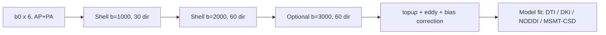

# Advanced diffusion: beyond DTI

> DTI is a single Gaussian crammed onto a voxel that almost never contains a single Gaussian. Multi-shell, HARDI, and biophysical models exist because the tensor was an aspiration, not a truth.

Course map: Why DTI breaks → HARDI and q-space → multi-shell strategy → NODDI biophysics → diffusion kurtosis → MSMT-CSD → free-water → acquisition design → software → worked NODDI fit → pitfalls → references.

## 1. Learning objectives

- State three regimes in which the single-tensor model produces a quantitatively wrong answer.

- Explain why a HARDI shell (≥45 directions at high b) buys angular resolution but not microstructural specificity on its own.

- Describe the NODDI compartment model in plain English (intra-neurite, extra-neurite, CSF) and what each parameter means physically.

- Define excess kurtosis K and explain why DKI maps respond to crossings, restriction, and tissue heterogeneity differently than FA.

- Choose a sane multi-shell acquisition for an MSMT-CSD or NODDI study at 3T.

- List which software fits which model, and the failure modes of each.

## 2. Why DTI fails

### 2.1 Single Gaussian assumption

DTI fits a $3\times3$ symmetric positive-definite tensor $\mathbf{D}$ via

\[
S(\mathbf{g}, b) = S_0\,\exp\!\left(-b\,\mathbf{g}^\top \mathbf{D}\,\mathbf{g}\right).
\]

This assumes a single zero-mean Gaussian displacement distribution per voxel. White matter voxels with two or three fibre populations, partial CSF contamination, or restricted compartments violate that assumption.

### 2.2 Crossing fibres

Estimates suggest 60–90% of WM voxels contain crossing, kissing, or fanning fibres ( Jeurissen 2013). FA collapses in crossings even when each underlying tract is highly anisotropic — a real biological effect masked by a model artifact.

### 2.3 Partial volume

Edges of ventricles, sulcal CSF, and oedema introduce a fast isotropic component that pulls mean diffusivity (MD) up and FA down. Reporting FA changes near CSF without a free-water correction is a known confound.

### 2.4 Non-Gaussian diffusion

At $b > 1500$ s/mm² the signal departs from mono-exponential decay. Hindrance and restriction in tissue create kurtosis (peakedness) that DTI absorbs into the wrong parameter.

## 3. HARDI, q-space, and the angular axis

- **HARDI** = High Angular Resolution Diffusion Imaging: one shell, many directions (typically 45–90+ at $b \approx 2000–3000$ s/mm²).

- Reconstructs an orientation distribution function (ODF) per voxel without committing to a tensor — but still cannot separate intra- vs extra-axonal signal from a single shell.

- **q-space** view: the diffusion signal is the Fourier transform of the average propagator $P(\mathbf{r}, \tau)$ in displacement space, where $\mathbf{q} = \gamma \delta \mathbf{G}/(2\pi)$. DSI samples q-space on a Cartesian grid — expensive, mostly historical now.

## 4. Multi-shell acquisition

Adding shells (multiple $b$-values) is what lets you separate compartments with different intrinsic diffusivities.

| Shell | b (s/mm²) | Directions (min) | What it buys |
|---|---|---|---|
| Low | 0 | 1–5 b0s | Normalisation, distortion |
| Mid | 700–1000 | 30 | DTI metrics, perfusion suppression |
| High | 2000 | 60 | HARDI ODFs, intra-axonal weighting |
| Ultra-high | 3000 | 60 | NODDI, restriction sensitivity |

Total typical NODDI / MSMT-CSD protocol: ~3 shells + multiple b0s, AP/PA blip-pair for `topup`.

## 5. NODDI ( Zhang 2012)

Neurite Orientation Dispersion and Density Imaging models voxel signal as a sum of three compartments:

\[
S = (1 - \nu_{\mathrm{iso}})\left[\nu_{\mathrm{ic}}\,S_{\mathrm{ic}} + (1-\nu_{\mathrm{ic}})\,S_{\mathrm{ec}}\right] + \nu_{\mathrm{iso}}\,S_{\mathrm{iso}}.
\]

- $\nu_{\mathrm{ic}}$ — intra-cellular volume fraction (Neurite Density Index, NDI) — axons/dendrites.

- $\nu_{\mathrm{iso}}$ — isotropic volume fraction — free water / CSF.

- Orientation Dispersion Index (ODI) — derived from a Watson distribution concentration $\kappa$:

\[
\mathrm{ODI} = \frac{2}{\pi}\arctan\!\left(\frac{1}{\kappa}\right).
\]

### 5.1 What the parameters mean physically

- **NDI** ≈ density of stick-like neurites. Rises with myelination and tract maturation; drops with axonal loss.

- **ODI** ≈ fanning / bending of neurites. High in cortex (dendritic arbors), low in corpus callosum.

- **$\nu_{\mathrm{iso}}$** ≈ free water — useful near oedema, CSF, ventricles.

### 5.2 Assumptions you should not forget

- Fixed intrinsic parallel diffusivity $d_\parallel = 1.7\times10^{-3}$ mm²/s in WM (different default for GM).

- Tortuosity model relating extra- to intra-cellular diffusivity.

- Single Watson distribution — fails on crossings.

NODDI is a useful summary, not a microscope. Report it as a model parameter, not a histology measurement.

## 6. Diffusion kurtosis imaging (DKI, Jensen 2005)

DKI extends DTI by one term in the cumulant expansion:

\[
\ln\!\frac{S(b)}{S_0} \approx -b\,\mathrm{D} + \frac{1}{6}\,b^2\,\mathrm{D}^2\,K,
\]

with $K$ the excess kurtosis along the encoding direction. Directional averaging gives mean kurtosis (MK), axial kurtosis (AK), radial kurtosis (RK).

- Requires at least two non-zero b-shells, typically $b = 1000$ and $2000$ s/mm² with ≥30 directions each.

- MK is sensitive to microstructural complexity — rises with crossings, drops with demyelination, changes early in stroke.

- WMTI (white matter tract integrity) builds biophysical compartment metrics on top of DKI without the NODDI fixed-diffusivity priors.

## 7. Multi-shell multi-tissue CSD ( Jeurissen 2014)

Constrained Spherical Deconvolution estimates a fibre ODF (fODF) from a single-tissue response function. **MSMT-CSD** uses tissue-specific response functions for WM, GM, and CSF estimated from the data and the multi-shell signal:

\[
S(b, \mathbf{g}) = \sum_{t \in \{\mathrm{WM, GM, CSF}\}} \int_{S^2} R_t(b, \mathbf{g}\cdot\mathbf{u})\, f_t(\mathbf{u})\,d\mathbf{u}.
\]

- Cleans up partial-volume contamination at WM/CSF and WM/GM boundaries.

- Required input for biologically meaningful tractography near cortex.

- Workflow: `dwi2response dhollander` → `dwi2fod msmt_csd` → `tckgen` (MRtrix3).

## 8. Free-water imaging ( Pasternak)

A two-compartment model:

\[
S = (1 - f)\,S_{\mathrm{tissue}} + f\,\exp(-b\,d_{\mathrm{water}}),\quad d_{\mathrm{water}} = 3.0\times10^{-3}\;\mathrm{mm^2/s}.
\]

- $f$ = free-water fraction; tissue tensor is fit after subtraction.

- Particularly relevant in Parkinson’s disease (SN free water), MS, and oedema.

- Note: single-shell free-water fits are mathematically ill-posed without spatial regularisation — be sceptical of single-shell papers claiming clean separation.

## 9. Microstructure imaging vibe-check

Be wary when papers say:

- "NDI measures myelin." It does not — myelin water imaging does (MWF).

- "ODI is dendritic complexity." It is consistent with dendritic arborisation in cortex; it is not a histological count.

- "Free-water fraction is neuroinflammation." Possibly, in a specific context, with specific controls — not generically.

Treat advanced-diffusion metrics as model-dependent indices that correlate with biology under stated assumptions. Drop the assumption, lose the meaning.

## 10. Acquisition design



Practical knobs:

- Voxel: 2.0–2.5 mm isotropic at 3T; 1.5 mm only with multi-band ≥3 and patience.

- Multi-band (SMS) factor 2–3, in-plane GRAPPA 2.

- Phase-encode blip-pair (AP/PA) for `topup`.

- Diffusion times ($\Delta, \delta$) tied to vendor minima — record them; NODDI assumes them.

## 11. Software landscape

| Tool | Models | Notes |
|---|---|---|
| **AMICO** | NODDI, ActiveAx | Accelerated linear NODDI — minutes per brain |
| **NODDI-Toolbox** (MATLAB) | NODDI | Reference implementation, slow |
| **MRtrix3** | DTI, DKI, CSD, MSMT-CSD, fixel-based | Industry standard for tractography |
| **DIPY** | DTI, DKI, NODDI (via cvxpy), CSD, free-water | Pythonic, scriptable |
| **FSL** | DTI, BedpostX (ball-and-sticks), `qboot` | Probabilistic tractography pipeline |
| **TractSeg** | Bundle segmentation (deep learning) | Consumes CSD peaks |

## 12. Worked example — NODDI in AMICO

```python
import amico

amico.core.setup()
ae = amico.Evaluation("study", "subj-01")

ae.load_data(
    dwi_filename="dwi.nii.gz",
    scheme_filename="dwi.scheme",   # b-values + directions + Delta/delta
    mask_filename="brain_mask.nii.gz",
    b0_thr=10,
)

ae.set_model("NODDI")
ae.generate_kernels(regenerate=True)
ae.load_kernels()
ae.fit()
ae.save_results()  # writes ICVF, ODI, ISOVF NIfTIs
```

DIPY equivalent skeleton:

```python
from dipy.reconst.dki import DiffusionKurtosisModel
from dipy.core.gradients import gradient_table

gtab = gradient_table(bvals, bvecs)
dki_model = DiffusionKurtosisModel(gtab)
dki_fit = dki_model.fit(data, mask=mask)
mk = dki_fit.mk(min_kurtosis=0, max_kurtosis=3)
```

## 13. Pitfalls

- Fitting NODDI on a **single shell** — implementations exist, the answer is mostly priors.

- Comparing NDI across sites without identical $\Delta, \delta$, b-values, and protocol QC.

- Tractography from a single-tensor model in regions with known crossings (centrum semiovale, brainstem) — use MSMT-CSD.

- Reporting FA in a free-water-rich voxel without correction.

- Treating ODI in cortex as "dendritic complexity" — see Section 9.

## 14. Clinical and translational use

- **Stroke**: DKI changes earlier than DTI in penumbra (Hui 2012, exploratory).

- **MS**: NODDI NDI drop in NAWM, free-water rises around lesions.

- **Parkinson's**: substantia nigra free-water fraction has replicated as a biomarker (Ofori 2015).

- **Paediatric development**: NDI and MK track myelination trajectories.

## 15. References

1. Zhang H, Schneider T, Wheeler-Kingshott CA, Alexander DC. NODDI: practical in vivo neurite orientation dispersion and density imaging of the human brain. *Neuroimage.* 2012;61(4):1000–1016. https://doi.org/10.1016/j.neuroimage.2012.03.072

2. Jensen JH, Helpern JA, Ramani A, Lu H, Kaczynski K. Diffusional kurtosis imaging: the quantification of non-Gaussian water diffusion by means of MRI. *Magn Reson Med.* 2005;53(6):1432–1440. https://doi.org/10.1002/mrm.20508

3. Jeurissen B, Tournier J-D, Dhollander T, Connelly A, Sijbers J. Multi-tissue constrained spherical deconvolution for improved analysis of multi-shell diffusion MRI data. *Neuroimage.* 2014;103:411–426. https://doi.org/10.1016/j.neuroimage.2014.07.061

4. Pasternak O, Sochen N, Gur Y, Intrator N, Assaf Y. Free water elimination and mapping from diffusion MRI. *Magn Reson Med.* 2009;62(3):717–730. https://doi.org/10.1002/mrm.22055

5. Tournier J-D, et al. MRtrix3: A fast, flexible and open software framework for medical image processing and visualisation. *Neuroimage.* 2019;202:116137. https://doi.org/10.1016/j.neuroimage.2019.116137

6. Daducci A, et al. Accelerated Microstructure Imaging via Convex Optimization (AMICO) from diffusion MRI data. *Neuroimage.* 2015;105:32–44. https://doi.org/10.1016/j.neuroimage.2014.10.026

7. Jeurissen B, Leemans A, Tournier J-D, Jones DK, Sijbers J. Investigating the prevalence of complex fiber configurations in white matter tissue with diffusion MRI. *Hum Brain Mapp.* 2013;34(11):2747–2766. https://doi.org/10.1002/hbm.22099

## Where to next

- Foundations: [../foundations/physics.md](../foundations/physics.md) — for the gradient/Stejskal–Tanner basics.

- DWI primer: [./dwi.md](./dwi.md) — the single-shell parent of this page.

- Analysis: [../../analysis/diffusion.md](../../analysis/diffusion.md) — group stats, TBSS, fixel-based.

- EPI readout: [./epi.md](./epi.md) — the readout that all of this is built on.

### Closing

Advanced diffusion is *modelling*, not measurement. Pick the model whose assumptions match your tissue and acquisition, and never let a parameter name (NDI, ODI) seduce you into reporting it as histology.
