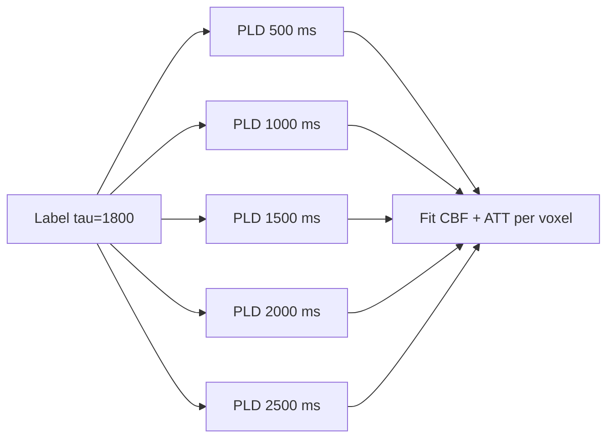

# Arterial Spin Labeling (ASL)

> A perfusion measurement that uses blood water as an endogenous tracer. No contrast injection, just clever RF labeling and a subtraction.

Course map: Physics of magnetic labeling → label–control subtraction → PASL / CASL / pCASL → [ISMRM consensus protocol](https://doi.org/10.1002/mrm.25197) → Buxton kinetic model → calibration (M0) → multi-PLD for ATT → artifacts → software → clinical use → worked Python pseudocode → references.

## 1. Learning objectives

- Explain how an RF inversion of arterial blood creates a tracer that decays at $T_{1,\mathrm{blood}}$.

- State the difference between PASL, CASL, and pCASL in one sentence each.

- Recite the single-PLD pCASL CBF equation from the 2015 ISMRM consensus.

- List the three big confounds: motion, vascular artifact, low SNR.

- Choose a single- vs multi-PLD acquisition based on the clinical question (CBF vs ATT).

- Identify the M0 calibration image and explain what it normalises.

## 2. Physics — labeling and subtraction

### 2.1 The trick

ASL acquires two image types:

- **Label**: arterial blood spins are inverted (or saturated) below the imaging slab.

- **Control**: identical readout, no effective labeling.

After a post-labeling delay (PLD) for blood to reach tissue, both are imaged. The difference $\Delta M = M_{\mathrm{control}} - M_{\mathrm{label}}$ is proportional to delivered, perfused magnetisation — that is, cerebral blood flow (CBF).

The signal is ~0.5–1% of the baseline image. ASL is a subtraction of two large numbers to recover a small one — every artifact compounds.

### 2.2 Decay

Once labeled, blood water magnetisation relaxes at $T_{1,\mathrm{blood}}$ (~1650 ms at 3T). Wait too long, no signal. Wait too little, label has not arrived (arterial transit artifact).

## 3. Label types

| Variant | Mechanism | Label efficiency $\alpha$ | Pros | Cons |
|---|---|---|---|---|
| **PASL** ( pulsed) | Single inversion slab (FAIR, QUIPSS) | ~0.95 | Simple, robust | Lower SNR, fewer labeled spins |
| **CASL** ( continuous) | Long RF + gradient at neck | ~0.68 | More signal | High SAR, magnetisation transfer artifact |
| **pCASL** ( pseudo-continuous) | Train of short RF + gradient pulses | ~0.85 | High SNR, low SAR, vendor-supported | Sensitive to off-resonance at labeling plane |

**pCASL is the recommended default** ([Alsop 2015 consensus](https://doi.org/10.1002/mrm.25197)).

## 4. ISMRM consensus protocol ([Alsop 2015](https://doi.org/10.1002/mrm.25197))

Single-PLD pCASL for cognitively normal adults:

- Labeling duration $\tau = 1800$ ms.

- PLD = 1800 ms (adults), 2000 ms (>70 y), 1500 ms (children).

- 3D readout (GRASE or stack-of-spirals) preferred over 2D EPI.

- Background suppression: 2 inversion pulses for static tissue nulling at readout.

- Separate M0 scan (control without labeling, long TR).

## 5. Quantification: the Buxton kinetic model

### 5.1 General compartment model (Buxton 1998)

\[
\Delta M(t) = 2\,M_{0,b}\,f\,\int_0^t c(\tau)\,r(t-\tau)\,m(t-\tau)\,d\tau
\]

where $c(\tau)$ is the delivery function, $r$ the residue function, $m$ the magnetisation relaxation. For a well-mixed single-compartment with arterial transit time $\Delta t$ and PLD $w$ after labeling duration $\tau$, the standard pCASL solution is:

\[
\mathrm{CBF}\;[\mathrm{mL}/100\mathrm{g}/\mathrm{min}]
= \frac{6000\,\lambda\,\Delta M\,\exp\!\left(\dfrac{w}{T_{1,b}}\right)}
{2\,\alpha\,T_{1,b}\,M_0\,\left(1 - \exp\!\left(-\dfrac{\tau}{T_{1,b}}\right)\right)}.
\]

With:

- $\lambda = 0.9$ mL/g — brain-blood partition coefficient.

- $T_{1,b} = 1650$ ms at 3T.

- $\alpha = 0.85$ for pCASL (×0.75 if background suppression with 2 pulses).

- $M_0$ from calibration scan.

- $6000$ = unit conversion to mL/100g/min.

### 5.2 What $M_0$ is for

The label–control difference is proportional to the equilibrium magnetisation of arterial blood, $M_{0,b}$. We do not image arterial blood directly — we image tissue and compute $M_{0,b} = M_{0,\mathrm{tissue}}/\lambda$. The M0 scan provides the per-voxel scaling so CBF comes out in physical units, not arbitrary signal.

## 6. Multi-PLD for arterial transit time

Single-PLD assumes $\Delta t < w$ everywhere. False in stroke, Moyamoya, severe carotid stenosis, and posterior watershed in elderly. Multi-PLD acquires $\Delta M(w_i)$ at several PLDs and fits both CBF and $\Delta t$ from the kinetic curve:



Cost: longer scan (5–8 min for multi-PLD vs 4 min for single-PLD).

## 7. Acquisition knobs

| Parameter | Typical value | Why it matters |
|---|---|---|
| Labeling duration $\tau$ | 1800 ms | Longer = more label, more SAR |
| PLD $w$ | 1800–2000 ms | Match expected $\Delta t$ |
| Label efficiency $\alpha$ | 0.85 (pCASL) | Drops with off-resonance at neck |
| Background suppression | 2 pulses | Reduces motion artifact, kills static tissue |
| Readout | 3D GRASE / stack-of-spirals | Single-shot 3D → motion-robust averaging |
| Averages | 30–60 label/control pairs | SNR scales as $\sqrt{N}$ |

## 8. Pitfalls

- **Motion**: 1% signal means head motion of 1 mm can dominate the difference. Use background suppression and motion-correct pair-wise.

- **Vascular (intra-arterial) artifact**: bright serpiginous spots at short PLD — label still in large arteries. Lengthen PLD or interpret cautiously.

- **Off-resonance at labeling plane**: $B_0$ inhomogeneity at the neck reduces $\alpha$ — common at high field. Optimise shim.

- **Caffeine, smoking, time of day**: caffeine drops CBF by ~20% within an hour. Standardise pre-scan instructions.

- **Pseudo-T2 contamination** in 2D EPI readouts — prefer 3D.

- **Atrophic cortex**: partial volume with CSF lowers apparent CBF. Apply partial-volume correction (Asllani 2008).

## 9. Software

| Tool | Strength |
|---|---|
| **[ExploreASL](https://exploreasl.github.io/Documentation/)** | Multi-vendor pipeline, QC dashboards, [BIDS](https://bids-specification.readthedocs.io/en/stable/modality-specific-files/magnetic-resonance-imaging-data.html#arterial-spin-labeling-perfusion-data)-aware |
| **[oxford_asl](https://fsl.fmrib.ox.ac.uk/fsl/fslwiki/BASIL) / [BASIL](https://asl-docs.readthedocs.io/)** (FSL) | Bayesian kinetic-model fitting, multi-PLD |
| **[ASLPrep](https://aslprep.readthedocs.io/)** | [Nipype](https://nipype.readthedocs.io/)-based, BIDS-derivatives output |
| **[ASL-MRICloud](https://braingps.mricloud.org/)** | Web / batch services |

## 10. Clinical use

- **Stroke**: CBF deficit, multi-PLD for delayed transit in penumbra; complementary to DSC perfusion without gadolinium.

- **Alzheimer's disease**: hypoperfusion in posterior cingulate, precuneus, temporoparietal — overlaps FDG-PET pattern.

- **Vascular cognitive impairment**: global / watershed CBF reduction.

- **Epilepsy**: ictal hyperperfusion, interictal hypoperfusion at seizure focus.

- **Paediatrics**: CBF normative ~2× adult — avoid Gd, ASL is the default perfusion modality.

## 11. Worked Python pseudocode

```python
import nibabel as nib
import numpy as np

# Load label/control pairs (4D), M0, mask
asl = nib.load("sub-01_asl.nii.gz").get_fdata()       # x,y,z,2N
m0  = nib.load("sub-01_m0.nii.gz").get_fdata()
mask = nib.load("sub-01_mask.nii.gz").get_fdata().astype(bool)

# Pairwise subtraction (control - label) and average
ctrl  = asl[..., 0::2]
label = asl[..., 1::2]
dM = np.mean(ctrl - label, axis=-1)

# Buxton single-PLD pCASL CBF (Alsop 2015)
lam      = 0.9      # mL/g
T1b      = 1.650    # s
alpha    = 0.85 * 0.75   # pCASL with 2-pulse BS
tau      = 1.8      # s, labeling duration
PLD      = 1.8      # s
SIcal    = 6000     # to mL/100g/min

num = SIcal * lam * dM * np.exp(PLD / T1b)
den = 2 * alpha * T1b * m0 * (1 - np.exp(-tau / T1b))

cbf = np.where(mask & (den > 0), num / den, 0.0)
nib.save(nib.Nifti1Image(cbf, nib.load("sub-01_m0.nii.gz").affine), "cbf.nii.gz")

print("Mean GM CBF:", cbf[mask].mean(), "mL/100g/min  (expect ~50)")
```

Sanity check: cortical GM CBF should land at 40–70 mL/100g/min, WM ~20–30. Anything outside is acquisition or pipeline failure, not biology.

## 12. External tools & resources

### Processing pipelines

- [ExploreASL](https://exploreasl.github.io/Documentation/) — multi-vendor, multi-site ASL pipeline with QC dashboards and BIDS support.
- [ASLPrep](https://aslprep.readthedocs.io/) — Nipype-based BIDS App producing BIDS-Derivatives outputs.
- [BASIL / oxford_asl (FSL)](https://fsl.fmrib.ox.ac.uk/fsl/fslwiki/BASIL) — Bayesian kinetic-model fitting for single- and multi-PLD ASL.
- [BASIL documentation](https://asl-docs.readthedocs.io/) — current readthedocs entry point for the BASIL toolbox.
- [ASL-MRICloud](https://braingps.mricloud.org/) — web-based ASL quantification service.
- [nibabel](https://nipy.org/nibabel/) — NIfTI I/O used in the worked example.

### Standards and consensus

- [ISMRM ASL consensus (Alsop 2015)](https://doi.org/10.1002/mrm.25197) — recommended implementation for clinical ASL.
- [BIDS ASL extension](https://bids-specification.readthedocs.io/en/stable/modality-specific-files/magnetic-resonance-imaging-data.html#arterial-spin-labeling-perfusion-data) — standard layout for ASL data.

## 13. References

1. Alsop DC, Detre JA, Golay X, et al. Recommended implementation of arterial spin-labeled perfusion MRI for clinical applications: a consensus of the ISMRM perfusion study group and the European consortium for ASL in dementia. *Magn Reson Med.* 2015;73(1):102–116. https://doi.org/10.1002/mrm.25197

2. Buxton RB, Frank LR, Wong EC, Siewert B, Warach S, Edelman RR. A general kinetic model for quantitative perfusion imaging with arterial spin labeling. *Magn Reson Med.* 1998;40(3):383–396. https://doi.org/10.1002/mrm.1910400308

3. Detre JA, Leigh JS, Williams DS, Koretsky AP. Perfusion imaging. *Magn Reson Med.* 1992;23(1):37–45. https://doi.org/10.1002/mrm.1910230106

4. Wong EC, Buxton RB, Frank LR. Quantitative imaging of perfusion using a single subtraction (QUIPSS and QUIPSS II). *Magn Reson Med.* 1998;39(5):702–708. https://doi.org/10.1002/mrm.1910390506

5. Dai W, Garcia D, de Bazelaire C, Alsop DC. Continuous flow-driven inversion for arterial spin labeling using pulsed radio frequency and gradient fields. *Magn Reson Med.* 2008;60(6):1488–1497. https://doi.org/10.1002/mrm.21790

6. Asllani I, Borogovac A, Brown TR. Regression algorithm correcting for partial volume effects in arterial spin labeling MRI. *Magn Reson Med.* 2008;60(6):1362–1371. https://doi.org/10.1002/mrm.21670

7. Mutsaerts HJ, et al. ExploreASL: An image processing pipeline for multi-center ASL perfusion MRI studies. *Neuroimage.* 2020;219:117031. https://doi.org/10.1016/j.neuroimage.2020.117031

## Where to next

- Foundations: [../foundations/physics.md](../foundations/physics.md) — Bloch and T1 relaxation behind the label.

- EPI: [./epi.md](./epi.md) — the readout for 2D ASL.

- MPRAGE: [./mprage.md](./mprage.md) — the structural for partial-volume correction.

- Analysis: [../../analysis/functional.md](../../analysis/functional.md) — perfusion as a covariate in fMRI studies.

### Closing

ASL is endogenous, non-invasive, and quantitative. It is also a 1% signal. Respect the M0, lock the PLD to your population, and never report "CBF dropped" without checking ATT.
