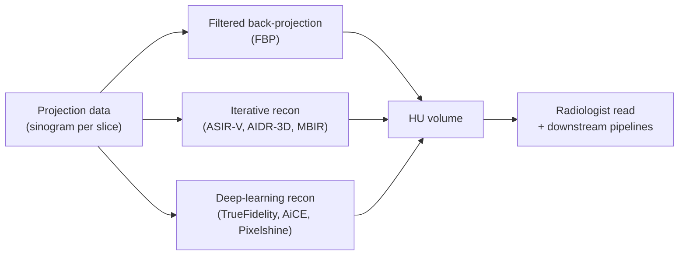

# Computed Tomography (CT)

> X-ray transmission through 360-degree projections, reconstructed into Hounsfield-Unit slices — the clinical modality of first contact for acute neurological emergencies and the imaging substrate for ~70% of clinical neuroimaging worldwide.

Course map: Why CT → physics (X-ray attenuation, Hounsfield Units) → reconstruction (FBP / iterative / deep learning) → acquisition parameters → variants (NCCT, CTA, CTP, DECT, PCCT, CBCT) → preprocessing → file formats and BIDS → medical / clinical relevance → references.

## 1. Learning objectives

- Define a Hounsfield Unit and state the HU range for air, water, white matter, gray matter, acute blood, and cortical bone.
- Write Beer-Lambert as the CT forward model and explain why polyenergetic beams produce beam hardening.
- Compare filtered back-projection, iterative reconstruction (ASIR / AIDR / MBIR), and deep-learning reconstruction by dose, speed, and known failure modes.
- Name the four CT variants that appear in any modern acute-stroke protocol and what each contributes.
- Match a head-CT finding (NCCT hypodensity, ICH, SAH, microbleed) to its standard clinical-decision rule (ASPECTS, ICH score, Fisher, Marshall).
- Recite the dose tradeoff that gates paediatric CT use and the imaging-decision rule (PECARN) used to avoid unnecessary scans.

## 2. Why CT

CT is fast and ubiquitous. A complete non-contrast head CT takes under five minutes door-to-image; a full stroke protocol (NCCT + CTA + CTP) finishes in ~15 minutes — versus 30+ minutes for any equivalent MRI workflow. In acute ischaemic stroke, intracranial hemorrhage, and head trauma, that time gap is the difference between a treatable patient and a missed window.

Geometry stability is the under-appreciated second virtue. Hounsfield Units are scanner-calibrated against water and air, so the same tissue reports within ~10% across vendors and across years — no MR-style intensity normalisation. A subarachnoid haemorrhage on a 2008 Siemens Sensation looks numerically like one on a 2025 Canon Aquilion ONE.

CT is also cheap and everywhere. There are roughly 50 times more CT scanners on Earth than MR scanners; nearly every emergency department has one within steps of the trauma bay. Most low- and middle-income countries deliver the majority of their neuroimaging on CT.

The cost is ionising radiation: ~2 mSv for a head CT, roughly 10% of average annual background. The AAPM and ACR set tighter exposure thresholds in paediatrics, and clinical-decision rules ([PECARN](https://doi.org/10.1016/S0140-6736(09)61558-0), CHALICE, CATCH) exist precisely to avoid unnecessary paediatric scans.

When MR wins: any soft-tissue-contrast question (cortex vs white matter, MS plaques, hippocampal atrophy), the posterior fossa (CT beam-hardens through dense skull base), acute infarcts under ~6 hours (NCCT often normal while DWI lights up), and any subtle lesion. The clinical workflow is *CT first, MR if CT cannot answer the question*.

## 3. Physics — X-ray attenuation and Beer-Lambert

An X-ray tube generates a polychromatic photon spectrum at peak voltage `kVp` (e.g. 120 kVp for adult head CT). Photons traverse the patient; a detector ring on the opposite side counts what arrives. Attenuation follows Beer-Lambert:

$$
I = I_0 \, e^{-\mu d}
$$

with $\mu$ the linear attenuation coefficient (cm⁻¹) at the effective beam energy and $d$ the path length. For a heterogeneous path through multiple tissues:

$$
I = I_0 \, \exp\!\left(-\sum_i \mu_i \, d_i\right).
$$

Logarithmic processing turns each measurement into a line integral $-\ln(I/I_0) = \int \mu(\vec r)\,d\ell$, which is exactly the Radon transform — see [fundamentals/medical-imaging/acquisition.md](../medical-imaging/acquisition.md) for the forward-model framing shared with every other modality.

**Beam hardening.** Real X-ray spectra are polyenergetic; lower-energy photons are preferentially absorbed, shifting the surviving spectrum upward as the beam traverses tissue. The effective $\mu$ therefore *decreases* with depth — the same physical tissue attenuates less per cm at the centre of the head than at the surface. The visible signature is **cupping** (centre of a uniform phantom looks darker than the periphery) and **streaks** between dense structures (e.g., petrous bones in the posterior fossa). Beam-hardening correction is applied at reconstruction; post hoc removal is essentially impossible.

### Hounsfield Units

Sir Godfrey Hounsfield introduced the HU scale in his 1973 description of the EMI scanner ([Hounsfield 1973](https://doi.org/10.1259/0007-1285-46-552-1016), Nobel Prize 1979 with Cormack):

$$
\mathrm{HU} = 1000 \times \frac{\mu - \mu_{\text{water}}}{\mu_{\text{water}}}.
$$

By construction, water = 0 HU and air = −1000 HU. Dense cortical bone reaches +1000 to +3000 HU. Typical adult brain values:

| Tissue | HU (typical) |
|---|---|
| Air | −1000 to −800 |
| Fat | −100 to −50 |
| CSF | 0 to 15 |
| White matter | 20 to 30 |
| Gray matter | 30 to 45 |
| Acute blood (clot) | 40 to 90 |
| Chronic calcification | 100 to 300 |
| Cortical bone | 200 to 3000 |

The narrow ~10 HU separation between gray and white matter is the entire reason brain CT is read in a tight "brain window" (window/level ≈ 80/35) and not the bone window — the human visual system cannot resolve <1% intensity differences in the standard 256-greyscale display.

## 4. Detectors and projections

Modern scanners are **multi-detector CT (MDCT)** with 16, 64, 128, 256, or 320 detector rows. More rows means broader z-axis coverage per rotation, which means shorter scan times and the ability to perform whole-organ dynamic imaging (CTP, cardiac CT) in a single breath-hold.

Key acquisition parameters:

- **Rotation time**: 0.27 s (modern flagship) to 1.0 s (legacy). Shorter = less motion blur, more tube heating.
- **Pitch**: table travel per rotation divided by total z-axis beam width. Pitch = 1 means contiguous slices with no overlap; pitch < 1 oversamples (more dose, less noise); pitch > 1 undersamples (faster scan, less dose, slice-thickness penalty).
- **Helical (spiral) vs axial (sequential)**: spiral is the default for volumetric imaging; axial is used for CTP (repeated same-z acquisitions over time) and cardiac gating.

## 5. Reconstruction



### Filtered back-projection (FBP)

The classical analytical inversion of the Radon transform: filter each projection with a ramp kernel (Ram-Lak, Shepp-Logan, Hamming), then sum back-projected filtered projections into image space. FBP is fast (~seconds per volume), deterministic, and has been the clinical default for four decades. Cost: no statistical noise model, so dose reduction shows up immediately as image noise.

### Iterative reconstruction

Vendor-specific names — Siemens ASIR / ASIR-V, GE AIDR-3D, Canon AIDR-3D, Philips iDose, Toshiba MBIR — all share a Bayesian-style template: model the Poisson photon statistics, the system optics (focal-spot blur, detector cross-talk, scatter), and an image-domain prior; iterate updates to maximise the posterior. Compared to FBP at the same image quality, iterative reconstruction reduces dose by 30-50%. The price is computation time (minutes vs seconds) and a characteristic plasticky / waxy appearance that radiologists need calibration to read.

### Deep-learning reconstruction (DLR)

Neural networks trained on paired low-dose / full-dose data — GE TrueFidelity (2019), Canon AiCE, Philips Precise Image, Siemens Pixelshine — replace the prior-or-denoiser block with a CNN. FDA-cleared since ~2019. They match diagnostic image quality at *further* reduced dose (50-80% reduction relative to FBP in some indications) and run in seconds. The honest concern is **hallucination** at very low dose: the network can synthesise plausible-looking but non-existent structure when the input signal is dominated by noise. The AAPM TG279 working group is actively studying validation protocols. See [Willemink & Noël 2019 review](https://doi.org/10.1007/s00330-018-5810-7) for the full evolution.

## 6. Acquisition parameters

| Parameter | Typical adult head CT | Comment |
|---|---|---|
| Tube voltage (`kVp`) | 120 kVp | 80 kVp in paediatrics — lower dose, higher iodine contrast |
| Tube current (`mA`) and time (`mAs`) | 200-400 mAs, auto-modulated | Sets photon flux → noise; vendor systems (CARE Dose 4D, SmartmA, DoseRight) modulate dynamically |
| Slice thickness | 0.625-1.25 mm acquired; 5 mm reformatted | Thin slices for 3D reformat, thick for clinical read |
| Reconstruction kernel | Soft (H30s, FC18, Br36) for brain; bone (H70s, FC81, Br64) for skull | Sharp kernels boost spatial resolution at the cost of noise |
| CTDIvol | ~40-60 mGy (brain) | Volume CT dose index; must appear on every clinical scan |
| DLP | 800-1200 mGy·cm | Dose-length product; multiplied by k-factor to estimate effective dose (mSv) |
| Effective dose | ~2 mSv (head) | ~10% of annual background; less than abdomen CT (~10 mSv) |

CTDIvol and DLP are mandated dose metrics in every modern clinical export — auditable by the Joint Commission and equivalents.

## 7. Variants

| Variant | Acquisition | Primary clinical use |
|---|---|---|
| **NCCT** (non-contrast CT) | Single helical pass | Stroke vs hemorrhage triage, head trauma, hydrocephalus, edema, mass effect |
| **CTA** (CT angiography) | Helical timed to iodinated bolus (50-80 mL @ 4-5 mL/s) | Large-vessel occlusion detection, aneurysm screen, dissection, vasospasm |
| **CTP** (CT perfusion) | Repeated axial acquisitions every 1-2 s over 60-90 s after bolus | Core / penumbra mismatch in acute stroke; tumour vascularity |
| **DECT** (dual-energy CT) | Two simultaneous kVp (e.g., 80 + 140) via dual-source or fast-kVp switching | Iodine maps, virtual non-contrast, gout urate, kidney-stone composition, beam-hardening reduction |
| **PCCT** (photon-counting CT) | Direct-conversion CdTe / CdZnTe detectors counting individual photons by energy | Sub-millimetre resolution, K-edge subtraction, lower dose; Siemens Naeotom Alpha FDA-cleared 2021 |
| **CBCT** (cone-beam CT) | Single rotation, flat-panel detector | Intra-procedural in IR / OR / dental; lower image quality but real-time |

The three-step **NCCT → CTA → CTP** protocol is the modern acute-stroke workflow (see [§10 below](#10-medical-clinical-relevance) and [clinical/stroke-and-tbi.md](../../clinical/stroke-and-tbi.md)).

## 8. Preprocessing for analysis

CT preprocessing is shorter than MR preprocessing because HU values are already calibrated — no bias-field correction, no intensity normalisation, no inter-scanner harmonisation at the intensity level. The first-order pipeline is:

1. **Windowing.** Clinical practice — and most automated pipelines — operate on a windowed view, not the raw HU range. Brain window: width 80, level 35 (i.e., display 0-75 HU). Blood / stroke window: width 130, level 50. Bone window: width 2000, level 700. Multi-window inputs to deep networks help small-lesion sensitivity.
2. **Skull stripping.** Much easier than MR: bone is sharply separated from brain at HU > 200. [CTNet](https://github.com/aramis-lab/clinicadl), [DeepBleed](https://github.com/msharrock/deepbleed), [BLAST-CT](https://github.com/biomedia-mira/blast-ct), and FreeSurfer's [`recon-all-clinical`](https://surfer.nmr.mgh.harvard.edu/fswiki/recon-all-clinical) all support CT brain extraction.
3. **Tissue segmentation.** Pure HU thresholds get you most of the way: CSF < 15 HU, GM 30-45 HU, WM 20-30 HU, blood > 40 HU, bone > 250 HU. Overlap regions (GM/WM, partial-volume cortex/CSF) need Bayesian or deep-learning methods — see [analysis/ct.md](../../analysis/ct.md).
4. **Spatial normalisation.** Two options: register CT to a CT template ([ATLAS-ICH](https://www.nitrc.org/projects/clinicaltbx) from Rorden 2012) directly, or co-register CT to the subject's MRI and warp via MR-to-MNI. The latter is more accurate when MR is available.
5. **Beam-hardening and metal-artifact correction.** Both happen at reconstruction. Iterative MAR (metal artifact reduction) is clinically essential for patients with aneurysm clips, stents, dental fillings, or deep-brain-stimulation hardware.

## 9. File formats and BIDS

CT comes off the scanner as DICOM. Convert to NIfTI with [`dcm2niix`](https://github.com/rordenlab/dcm2niix) — native CT support, preserves HU values, writes BIDS-style sidecars.

```bash
dcm2niix -b y -z y -f "sub-%i_%d" -o ct/ raw/dicom_ct/
```

BIDS storage for CT follows the in-progress [BEP024](https://bids.neuroimaging.io/extensions/) — the Computed Tomography scan extension. See [bids/modalities/ct.md](../../bids/modalities/ct.md) for the full layout and the (still-evolving) sidecar schema.

## 10. Medical / clinical relevance

**Beginner.** CT is the first-line imaging in any acute neurological emergency — its speed (under 5 minutes) means stroke and hemorrhage decisions are made in the CT suite, not the MRI suite.

**Routine clinical use.**

- Acute stroke triage — the **NCCT → CTA → CTP** three-step protocol selects patients for IV tPA and mechanical thrombectomy.
- Acute head trauma — NCCT for skull fractures, intracranial hemorrhage, edema, herniation.
- Hydrocephalus follow-up — shunt monitoring with ventricular indices.
- Pre-surgical bone-windowing — skull base, sinuses, mastoid air cells, temporal bone for cochlear implants.
- Vascular emergencies — aneurysm rupture screen (NCCT for SAH within 24 h), CTA for vasospasm and dissection.
- Tumour staging — bone window for metastases; contrast-enhanced CT when MR is contraindicated.
- Paediatric trauma — focused-abdominal-sonography-for-trauma (FAST) + head CT under PECARN rules.

**Disease applications.**

| Disease | CT finding | Clinical value | Reference | Cross-link |
|---|---|---|---|---|
| Acute ischemic stroke | NCCT excludes hemorrhage + CTA detects LVO + CTP estimates core / penumbra mismatch | Selects patients for IV tPA (<4.5 h) and thrombectomy (up to 24 h via DAWN / DEFUSE-3 criteria) | [Goyal 2016 HERMES](https://doi.org/10.1016/S0140-6736(16)00163-X); [Nogueira 2018 DAWN](https://doi.org/10.1056/NEJMoa1706442); [Albers 2018 DEFUSE-3](https://doi.org/10.1056/NEJMoa1713973) | [clinical/stroke-and-tbi.md](../../clinical/stroke-and-tbi.md) |
| Intracerebral hemorrhage (ICH) | NCCT detects ICH within seconds; volume + location + IVH presence | ICH score for 30-day mortality; every additional 10 mL of ICH volume raises mortality ~30% | [Hemphill 2001](https://doi.org/10.1161/01.STR.32.4.891) | [analysis/ct.md](../../analysis/ct.md) |
| Subarachnoid hemorrhage (SAH) | NCCT sensitivity ~95% within 24 h, drops to ~80% by 72 h; modern thin-slice + 3rd-gen scanners push sensitivity to near 100% within 6 h | Rule-in for SAH without LP in early presenters | [Perry 2011](https://doi.org/10.1136/bmj.d4277) | Fisher / modified-Fisher grading |
| Traumatic brain injury (TBI) | NCCT for skull fracture, ICH, contusion, midline shift; misses DAI microbleeds (MR SWI is better) | Marshall and Rotterdam scores for prognostication | [Marshall 1991](https://doi.org/10.3171/jns.1991.75.1s.s14); [Maas 2007](https://doi.org/10.1016/j.surneu.2006.01.052) (Rotterdam) | [clinical/stroke-and-tbi.md](../../clinical/stroke-and-tbi.md) |
| Hydrocephalus | Ventricular dilation; Evans index, frontal-occipital horn ratio (FOHR), callosal angle | Shunt-versus-watch decision; NPH workup | Standard neuroradiology | — |
| Paediatric head trauma | PECARN rules: low-risk children avoid CT | Reduces unnecessary paediatric radiation exposure | [Kuppermann 2009](https://doi.org/10.1016/S0140-6736(09)61558-0) | — |
| Brain death | CTA as ancillary test (cerebral circulation arrest) | Adjunct to clinical examination when EEG / NCCT inconclusive | [AAN 2015 guideline update](https://doi.org/10.1212/WNL.0000000000001999) | — |
| Vasospasm post-SAH | CTA + CTP for delayed cerebral ischemia | Triggers endovascular intervention | Standard NCC workflow | — |

**Research depth.** **Dual-energy CT** (DECT) opens material decomposition: separating iodine from haemorrhage in post-thrombectomy patients (contrast staining vs new bleed), gout urate vs calcium, kidney-stone composition (uric acid vs cystine vs calcium oxalate). The clinical-neuro application is mostly contrast-vs-haemorrhage adjudication after endovascular procedures ([Postma 2012](https://doi.org/10.1148/radiol.12112224)). **Photon-counting CT** (PCCT) is the most consequential hardware change in 20 years — direct-conversion CdTe / CdZnTe detectors count individual photons and bin them by energy, eliminating electronic noise, enabling sub-millimetre isotropic acquisition, and supporting K-edge subtraction for novel contrast agents (gold, gadolinium, bismuth nanoparticles). Siemens Naeotom Alpha gained FDA clearance in 2021; cite [Willemink 2018](https://doi.org/10.1148/radiol.2018172656). **CT-perfusion software variability** remains a major harmonisation gap: RAPID, Brain-CTP, OleaSphere, and iSchemaView produce different core / penumbra estimates from the same source data ([Bivard 2019](https://doi.org/10.1161/STROKEAHA.118.024349); Albers 2020, Olivot 2023), with implications for trial enrolment thresholds (DAWN, DEFUSE-3, EXTEND-IA) that were defined on RAPID-specific outputs. **Deep-learning reconstruction validation** is the active AAPM TG279 work — hallucination at low dose, calibration on out-of-distribution pathology, regulatory framework. **Automated CTA / NCCT triage** ([Viz.ai](https://www.viz.ai), [RapidAI](https://www.rapidai.com), [Brainomix](https://www.brainomix.com)) is the success story: FDA-cleared LVO and ICH detectors with smartphone alerts to stroke teams now save ~30 minutes door-to-needle in deployed centres, though specificity remains a workflow burden. **CT radiogenomics** (extracting genomic / molecular markers from CT-radiomic features) is emerging in glioma, lung, and renal oncology — see [analysis/ct.md §10](../../analysis/ct.md) for the analysis-side discussion.

## 11. References

1. **Hounsfield GN.** Computerized transverse axial scanning (tomography): Part 1. Description of system. *Br J Radiol.* 1973;46(552):1016-1022. [doi:10.1259/0007-1285-46-552-1016](https://doi.org/10.1259/0007-1285-46-552-1016) — the founding paper; Nobel Prize 1979 with Cormack.
2. **Goyal M, Menon BK, van Zwam WH, et al.** (HERMES collaborators). Endovascular thrombectomy after large-vessel ischaemic stroke: a meta-analysis of individual patient data from five randomised trials. *Lancet.* 2016;387(10029):1723-1731. [doi:10.1016/S0140-6736(16)00163-X](https://doi.org/10.1016/S0140-6736(16)00163-X)
3. **Nogueira RG, Jadhav AP, Haussen DC, et al.** Thrombectomy 6 to 24 hours after stroke with a mismatch between deficit and infarct (DAWN). *N Engl J Med.* 2018;378(1):11-21. [doi:10.1056/NEJMoa1706442](https://doi.org/10.1056/NEJMoa1706442)
4. **Albers GW, Marks MP, Kemp S, et al.** Thrombectomy for stroke at 6 to 16 hours with selection by perfusion imaging (DEFUSE-3). *N Engl J Med.* 2018;378(8):708-718. [doi:10.1056/NEJMoa1713973](https://doi.org/10.1056/NEJMoa1713973)
5. **Hemphill JC III, Bonovich DC, Besmertis L, et al.** The ICH score: a simple, reliable grading scale for intracerebral hemorrhage. *Stroke.* 2001;32(4):891-897. [doi:10.1161/01.STR.32.4.891](https://doi.org/10.1161/01.STR.32.4.891)
6. **Perry JJ, Stiell IG, Sivilotti MLA, et al.** Sensitivity of computed tomography performed within six hours of onset of headache for diagnosis of subarachnoid haemorrhage: prospective cohort study. *BMJ.* 2011;343:d4277. [doi:10.1136/bmj.d4277](https://doi.org/10.1136/bmj.d4277)
7. **Willemink MJ, Persson M, Pourmorteza A, Pelc NJ, Fleischmann D.** Photon-counting CT: technical principles and clinical prospects. *Radiology.* 2018;289(2):293-312. [doi:10.1148/radiol.2018172656](https://doi.org/10.1148/radiol.2018172656)
8. **Willemink MJ, Noël PB.** The evolution of image reconstruction for CT — from filtered back projection to artificial intelligence. *Eur Radiol.* 2019;29(5):2185-2195. [doi:10.1007/s00330-018-5810-7](https://doi.org/10.1007/s00330-018-5810-7)
9. **Kuppermann N, Holmes JF, Dayan PS, et al.** Identification of children at very low risk of clinically-important brain injuries after head trauma: a prospective cohort study (PECARN). *Lancet.* 2009;374(9696):1160-1170. [doi:10.1016/S0140-6736(09)61558-0](https://doi.org/10.1016/S0140-6736(09)61558-0)
10. **Mongan J, Moy L, Kahn CE Jr.** Checklist for Artificial Intelligence in Medical Imaging (CLAIM): a guide for authors and reviewers. *Radiol Artif Intell.* 2020;2(2):e200029. [doi:10.1148/ryai.2020200029](https://doi.org/10.1148/ryai.2020200029)
11. **Marshall LF, Marshall SB, Klauber MR, et al.** A new classification of head injury based on computerized tomography. *J Neurosurg.* 1991;75(1s):S14-S20. [doi:10.3171/jns.1991.75.1s.s14](https://doi.org/10.3171/jns.1991.75.1s.s14)
12. **Maas AIR, Hukkelhoven CWPM, Marshall LF, Steyerberg EW.** Prediction of outcome in traumatic brain injury with computed tomographic characteristics: a comparison between the computed tomographic classification and combinations of computed tomographic predictors. *Neurosurgery.* 2005;57(6):1173-1182. [doi:10.1227/01.NEU.0000186013.63046.6B](https://doi.org/10.1227/01.NEU.0000186013.63046.6B)
13. **Postma AA, Hofman PAM, Stadler AAR, van Oostenbrugge RJ, Tijssen MPM, Wildberger JE.** Dual-energy CT of the brain and intracranial vessels. *AJR Am J Roentgenol.* 2012;199(5 Suppl):S26-S33. [doi:10.2214/AJR.12.9115](https://doi.org/10.2214/AJR.12.9115)
14. **Wijdicks EFM, Varelas PN, Gronseth GS, Greer DM.** Evidence-based guideline update: determining brain death in adults — report of the Quality Standards Subcommittee of the American Academy of Neurology. *Neurology.* 2010;74(23):1911-1918. [doi:10.1212/WNL.0000000000001999](https://doi.org/10.1212/WNL.0000000000001999)

## Where to next

- Analysis-side companion: [analysis/ct.md](../../analysis/ct.md) — HU calibration, ASPECTS, CT-perfusion deconvolution, automated LVO detection.
- BIDS layout: [bids/modalities/ct.md](../../bids/modalities/ct.md) — BEP024 folder structure, sidecars, conversion recipes.
- Clinical context: [clinical/stroke-and-tbi.md](../../clinical/stroke-and-tbi.md) — the trials that drive the modern stroke protocol.
- Forward-model framing across modalities: [fundamentals/medical-imaging/acquisition.md](../medical-imaging/acquisition.md).
- Clinical deployment of CT AI: [tools/clinical-deployment.md](../../tools/clinical-deployment.md) — RAPID, Viz.ai, Brainomix in the workflow.

### Closing

CT is the most-used neuroimaging modality on Earth and the imaging substrate of acute neurology. The physics is settled (Beer-Lambert + Radon), the open problems are reconstruction (DLR validation, PCCT), perfusion-software harmonisation (RAPID vs everyone else), and the regulatory work of letting AI triage actually reach the radiologist's worklist without false-positive fatigue. Master the HU scale, learn the four variants, and respect the radiation budget.
