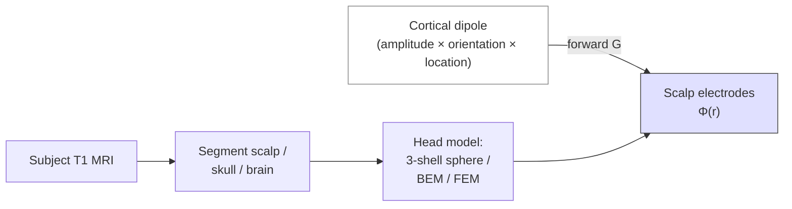

# Electroencephalography (EEG) — full course

> Microvolt-scale post-synaptic potentials from large populations of cortical pyramidal neurons, conducted through skull and scalp, sampled at millisecond resolution. Fast in time, blurry in space — the inverse of fMRI.

Course map: What EEG measures → biophysics (pyramidal dipoles, volume conduction, forward problem) → electrode systems → amplifier hardware → preprocessing (filter, reference, ICA, epoch) → analysis derivatives (pointer to sibling page) → artifacts → clinical / research uses → software → open problems → references.

## 1. Learning objectives

- Explain why EEG measures cortical pyramidal *post-synaptic* potentials rather than action potentials, and why $\sim 10^7$–$10^8$ synchronous neurons are needed for a scalp-detectable signal.
- Write down the quasi-static forward equation for scalp potential and state the role of each tissue conductivity.
- Choose between linked-mastoid, common-average, and REST references and justify the choice.
- Specify a complete preprocessing pipeline — filter, reference, bad-channel detection, ICA, epoching, baseline — with documented parameters.
- Distinguish ocular, muscle, cardiac, line-noise, and bridge artifacts and name a mitigation for each.
- Place EEG correctly in the modality landscape against MEG, fMRI, and intracranial recordings.

## 2. What EEG measures — beginner-tier opening

EEG records the *summed extracellular potential* generated by large populations of cortical pyramidal neurons firing in near-synchrony. The single-neuron contribution is far below detection; only when $\sim 10^7$–$10^8$ neurons share a brief volley of post-synaptic activity does the resulting field survive conduction through brain, CSF, skull, and scalp to reach a scalp electrode.

The signal is:

- **Amplitude**: ~1–100 µV at scalp.
- **Temporal resolution**: 1 ms (sampling at 250 Hz – 5 kHz).
- **Spatial resolution**: 2–4 cm at scalp; <1 cm at source after localisation with HD-EEG + accurate head model.
- **Frequency content**: usable 0.1–200 Hz; analysed in bands (δ, θ, α, β, γ — see § 6).

Contrast with neighbouring modalities:

| Modality | Direct? | Temporal | Spatial | Note |
|---|---|---|---|---|
| **EEG** | Electrical (direct) | 1 ms | 2–4 cm scalp | Cheap, portable |
| **MEG** | Magnetic (direct) | 1 ms | 0.5–2 cm | Tangential sources only; cryogenic |
| **fMRI BOLD** | Hemodynamic (indirect) | 1–2 s | 2–3 mm | Slow; whole-brain |
| **ECoG / sEEG** | Electrical (direct, intracranial) | 1 ms | mm | Invasive; epilepsy only |

EEG and MEG are temporal-resolution-first modalities; fMRI is spatial-resolution-first. They are complementary, and modern cognitive neuroscience routinely uses both.

Used clinically since [Hans Berger's 1929 paper](https://en.wikipedia.org/wiki/Hans_Berger) (the first human EEG recording — no DOI; original *Archiv für Psychiatrie* 87:527). For the analysis pipeline (ERPs, time-frequency, source localisation), see the sibling page [Analysis → EEG/MEG analysis](../../analysis/eeg-meg.md); this page covers fundamentals.

## 3. Physics — generators and volume conduction

### 3.1 The dipole source

Cortical pyramidal neurons have an elongated apical dendrite oriented *perpendicular* to the local cortical surface. Synaptic input arriving on the apical dendrite drives a current loop along the cell body — a current *dipole* with moment $\mathbf{p}$ aligned along the dendrite. Summed over $\sim 10^7$ neurons in a cortical patch, the effective source is a single equivalent dipole at the patch centroid.

Action potentials are too brief (~1 ms each) and too desynchronised across neurons to add coherently at the scalp. Post-synaptic potentials are slower (~10–100 ms) and more synchronisable — these dominate EEG.

### 3.2 Sulcal vs gyral sources

- **Gyral source** (crown of a gyrus): dipole points *radially* outward — easily detected by EEG, *invisible* to MEG (which measures only tangential sources).
- **Sulcal source** (wall of a sulcus): dipole points *tangentially* — strong MEG signal, weaker and more diffuse EEG signal.

This asymmetric sensitivity is the deepest reason to record EEG + MEG simultaneously when budget allows.

### 3.3 Forward problem — quasi-static Poisson

Brain currents oscillate at frequencies $\ll 1$ kHz, with wavelengths much larger than the head. The Maxwell equations reduce to *quasi-static*: no displacement currents, no induction. Conservation of charge in a piecewise-conductive volume then collapses to the **Poisson equation**

$$
\nabla \cdot \big(\sigma(\mathbf{r})\,\nabla V(\mathbf{r})\big) = -\nabla \cdot \mathbf{J}_{\text{source}}(\mathbf{r}),
$$

where $\sigma(\mathbf{r})$ is the local tissue conductivity, $V(\mathbf{r})$ the scalar potential, and $\mathbf{J}_{\text{source}}$ the primary (impressed) current density that represents the neural sources. The integral *Green's-function* form of the same equation is

$$
\Phi(\mathbf{r}) = \int \frac{\sigma(\mathbf{r}')\,\mathbf{J}_p(\mathbf{r}') \cdot (\mathbf{r} - \mathbf{r}')}{4\pi\,\sigma\,|\mathbf{r} - \mathbf{r}'|^3}\,dV',
$$

which is what BEM solvers actually evaluate. The Poisson form is the *forward model*: given sources, predict sensor measurements. Closed-form solutions exist only for spherical heads; realistic anatomy needs BEM or FEM (see § 3.5). The **inverse problem** — recover $\mathbf{J}_{\text{source}}$ from a finite set of scalp potentials — is *ill-posed*: many source configurations produce identical scalp patterns, and regularisation (depth weighting, sparsity, anatomical priors) is mandatory. That is why source localisation lives at the analysis layer ([analysis/eeg-meg.md](../../analysis/eeg-meg.md)) and not here.

### 3.4 Tissue conductivities

| Tissue | $\sigma$ (S/m) | Role |
|---|---|---|
| Brain GM | ~0.33 | Source compartment |
| Brain WM | ~0.14 (anisotropic) | Mild distortion |
| CSF | ~1.80 | Shunts current laterally |
| Skull | ~0.0066 | The major resistor — smears signal $\sim 80\times$ |
| Scalp | ~0.43 | Distributes current to electrodes |

The skull's ~50× lower conductivity than scalp is *the* reason EEG is spatially blurry: scalp potential at one electrode reflects a smeared average of cortical activity over several cm². MEG, by contrast, is *insensitive* to conductivity boundaries — magnetic permeability is uniform across head tissues — which is part of why it has tighter source localisation in principle.

### 3.5 Head models



- **3-shell spherical model** (Berg & Scherg 1994). Closed-form Φ; fast; wrong for anatomy.
- **BEM (Boundary Element Method)**. Surfaces between scalp / skull / brain meshed; solved by collocation. Standard for EEG inverse modelling.
- **FEM (Finite Element Method)**. Volumetric mesh; can include white-matter anisotropy and skull holes (fontanelles, surgery). Gold standard, expensive.

Reference: [Hallez et al., *J NeuroEng Rehabil* 2007;4:46](https://doi.org/10.1186/1743-0003-4-46).

### 3.6 The reference electrode — every potential is a difference

There is *no absolute potential*. Every channel reading is $V_i - V_\text{ref}$, where $V_\text{ref}$ is the reference electrode's potential. Common choices:

- **Linked mastoids / linked earlobes**: clinical standard; biases toward inferior topographies.
- **Common average**: arithmetic mean across all $N$ electrodes. Approximates zero if coverage is dense and symmetric; biased with sparse / asymmetric montages.
- **REST — Reference Electrode Standardization Technique** ([Yao 2001, *Physiol Meas* 22:693](https://doi.org/10.1088/0967-3334/22/4/305)): use a forward model to back-project to a virtual reference at infinity. Approximates true zero potential. Recommended for source-level analysis.

Document the reference choice in every paper. Re-referencing offline is trivial and reversible *only if* the reference signal was preserved.

### 3.7 Signal-to-noise

Single-trial scalp SNR is ~1–10 dB for evoked components (P300 ~5–10 µV against ~20 µV background EEG). Trial averaging over $K$ epochs improves SNR by $\sqrt{K}$ — the reason 100–200 trials per condition is the practical floor for ERP studies.

## 4. Recording — at the electrode

### 4.1 Electrode systems

- **International 10–20 system** (Jasper 1958) — 19+ electrodes named by anatomical position ratios (Fp, F, C, P, O × midline + lateral). The clinical standard everywhere from sleep labs to ICU.
- **10–10 system** — extension to 64–81 electrodes; covers most cortical projections.
- **10–5 system** — 256+ electrodes; high-density EEG (HD-EEG) for source localisation research.

Standardised positions enable cross-study comparison; record actual 3D positions per subject (Polhemus, photogrammetry) for accurate source modelling.

### 4.2 Electrode types

| Type | Impedance | Setup time | Use |
|---|---|---|---|
| **Passive Ag/AgCl wet (gel)** | 1–10 kΩ | 30–60 min | Research gold standard |
| **Active wet (built-in pre-amp)** | tolerates 50–100 kΩ | 10–20 min | Clinical, faster setup |
| **Dry / textile** | 10–100 kΩ | <5 min | BCI, wearables, lower SNR |

Ag/AgCl chemistry minimises electrode polarisation (slow DC drift). Conductive gel reduces skin–electrode impedance.

### 4.3 Hardware chain

A single channel passes through: skin → gel → electrode → shielded lead → differential amplifier → anti-alias low-pass → ADC. Modern systems:

- **Differential amplifier per channel** — measures $V_i - V_\text{ref}$ with shared common-mode rejection.
- **ADC**: 24-bit, 256–2048 Hz sample rate; some research systems run 16 kHz for high-frequency oscillations.
- **Anti-aliasing filter**: analog low-pass at $\sim 0.4 \times f_s$ before digitisation. Mandatory.
- **CMRR (common-mode rejection ratio)**: ≥110 dB for research-grade. High CMRR rejects line noise picked up identically on both inputs.
- **Input impedance**: ≥1 GΩ so that source impedance variations don't attenuate the signal.

### 4.4 Impedance hygiene

Target impedance: <5 kΩ for passive electrodes; <100 kΩ for active. Always document electrode impedance at start and end of recording. High or asymmetric impedance amplifies common-mode noise and creates ICA-resistant artifacts.

## 5. Preprocessing — turning raw signal into usable data

A canonical pipeline. Each step has parameters that *must* be reported.

### 5.1 Bandpass filter

Choice depends on analysis:

| Goal | Bandpass | Filter type |
|---|---|---|
| Slow ERPs (P300, CNV) | 0.1–40 Hz | Butterworth, zero-phase |
| Standard ERP | 0.5–40 Hz | FIR, zero-phase |
| Time-frequency (oscillations) | 1–100 Hz | FIR, zero-phase |
| High-frequency oscillations | 0.1–500 Hz | minimal filtering |

Always run *zero-phase* (forward-backward, `filtfilt`) — preserves component latencies. Document filter type (Butterworth / FIR), order, cutoff, and direction. A high-pass cutoff *above* 0.5 Hz attenuates slow ERP components — be explicit.

### 5.2 Notch filter

- **50 Hz** (Europe, Asia, Africa) or **60 Hz** (Americas) for line noise.
- Optional harmonics at 100/120 Hz.
- Alternative: spectral regression ([CleanLine, EEGLAB](https://github.com/sccn/cleanline_plugin)) avoids notch ringing.

### 5.3 Re-referencing

Recompute to the chosen reference (average, mastoid, REST). If the recording was made against a non-zero reference, the new reference is a linear transform of the data — trivial in matrix form.

### 5.4 Bad-channel detection

Flag electrodes that are dead, noisy, or bridged. Heuristics:

- Variance outlier ($>3\sigma$ above mean variance across channels)
- Kurtosis outlier (very-non-Gaussian distribution)
- Peak-to-peak amplitude > 200 µV sustained
- Low correlation with neighbours (PREP pipeline)

Interpolate using spherical-spline interpolation from neighbours. Document which channels were interpolated.

### 5.5 Artifact removal — ICA is the workhorse

**Independent Component Analysis** ([Bell & Sejnowski 1995, *Neural Computation* 7:1129](https://doi.org/10.1162/neco.1995.7.6.1129)) decomposes $N$-channel EEG into $N$ statistically independent components. Each component has a scalp topography and a time course. Stereotyped artifacts have stereotyped components:

- **Blinks**: frontal topography, slow time course (~300 ms positive deflection at Fp1/Fp2).
- **Saccades**: dipolar frontal topography, sharp transients.
- **Cardiac (ECG / BCG)**: regular ~1 Hz QRS-like spikes.
- **Muscle**: high-frequency, focal at frontal / temporal.
- **Bad electrode**: single-channel topography, broadband noise.

Modern workflow: fit ICA (Infomax or Picard), classify components automatically via [ICLabel](https://github.com/sccn/ICLabel) ([Pion-Tonachini 2019, *NeuroImage* 198:181](https://doi.org/10.1016/j.neuroimage.2019.05.026)), back-project after removing artifact components. [Picard](https://github.com/pierreablin/picard) is a faster Infomax variant — drop-in replacement in MNE.

ASR (Artifact Subspace Reconstruction, Mullen 2015) handles transient large-amplitude artifacts (subject moved, electrode popped) by reconstructing the corrupted sub-window from clean training data.

### 5.6 Epoching

Cut the continuous recording into time-locked windows around events. Typical for ERP: $-200$ ms to $+1000$ ms relative to stimulus onset. The pre-stimulus interval is the *baseline*.

### 5.7 Baseline correction

Subtract the per-epoch mean of the baseline window from every sample in the epoch. Removes slow drifts that survived high-pass filtering.

### 5.8 Trial rejection

Reject epochs with residual artifact. Standard threshold: peak-to-peak > 100–150 µV on any channel. Modern: [autoreject](https://github.com/autoreject/autoreject) ([Jas 2017](https://doi.org/10.1016/j.neuroimage.2017.06.030)) cross-validates per-channel thresholds and per-epoch rejection.

### 5.9 Minimal load-and-epoch in MNE-Python

The acquisition-to-epochs pipeline in [MNE-Python](https://mne.tools) is short enough to fit on one screen. This is *only* the fundamentals end of the pipeline; ERP averaging, time-frequency, and source localisation live at [analysis/eeg-meg.md](../../analysis/eeg-meg.md).

```python
import mne
from mne_bids import BIDSPath, read_raw_bids

# 1. Read a BIDS-EEG run (sidecars wire up sampling rate, reference, channels)
bids_path = BIDSPath(subject="01", task="oddball", root="data/bids", datatype="eeg")
raw = read_raw_bids(bids_path).load_data()

# 2. Band-pass + notch
raw.filter(l_freq=0.1, h_freq=40.0, fir_design="firwin")
raw.notch_filter(60.0)                          # 50.0 outside the Americas

# 3. Re-reference to common average
raw.set_eeg_reference("average", projection=True)

# 4. ICA for ocular and cardiac components, labelled by ICLabel
ica = mne.preprocessing.ICA(n_components=20, method="picard", random_state=0).fit(raw)
ica.exclude, _ = ica.find_bads_eog(raw, ch_name="Fp1")
ica.apply(raw)

# 5. Epoch around event triggers with peak-to-peak rejection
events, event_id = mne.events_from_annotations(raw)
epochs = mne.Epochs(raw, events, event_id, tmin=-0.2, tmax=1.0,
                    baseline=(None, 0), reject=dict(eeg=150e-6), preload=True)
epochs.save("derivatives/sub-01_task-oddball_epo.fif", overwrite=True)
```

Read [Gramfort 2013](https://doi.org/10.3389/fnins.2013.00267) for the design philosophy; for the equivalent recipe in MATLAB use the [EEGLAB tutorial](https://eeglab.org/tutorials/) (`pop_loadbv`, `pop_eegfiltnew`, `pop_runica`, `pop_epoch`).

### 5.10 BIDS-EEG — the storage standard

Reproducible EEG starts with a reproducible folder layout. [BIDS-EEG](https://bids-specification.readthedocs.io/en/stable/modality-specific-files/electroencephalography.html) ([Pernet 2019, *Sci Data* 6:103](https://doi.org/10.1038/s41597-019-0104-8), BEP006) extends the [Brain Imaging Data Structure](../../bids/index.md) to scalp electrophysiology. The required files per recording:

```text
sub-01/
└── eeg/
    ├── sub-01_task-oddball_eeg.{vhdr,edf,bdf,set}   # vendor raw
    ├── sub-01_task-oddball_eeg.json                 # sampling rate, reference, EOG channels
    ├── sub-01_task-oddball_channels.tsv             # type, units, status per channel
    ├── sub-01_task-oddball_electrodes.tsv           # x, y, z per electrode (mm)
    ├── sub-01_task-oddball_coordsystem.json         # head-coordinate convention
    └── sub-01_task-oddball_events.tsv               # onset, duration, trial_type
```

Critical sidecar fields in `_eeg.json`: `SamplingFrequency`, `EEGReference`, `PowerLineFrequency`, `EOGChannelCount`, `RecordingType`. The dataset-level `dataset_description.json` declares `BIDSVersion`.

Tooling:

- [mne-bids](https://mne.tools/mne-bids/) — read / write BIDS-EEG from MNE-Python; the most maintained option.
- [bidskit](https://github.com/jmtyszka/bidskit) — DICOM and EEG conversion utilities.
- [bids-validator](https://github.com/bids-standard/bids-validator) — CLI + web validator; run it before every analysis.

Cross-link: [bids/index.md](../../bids/index.md) for the wider BIDS philosophy.

## 6. Analysis outputs and derivatives — pointer

All the analysis machinery — ERP averaging, time-frequency decomposition, source localisation (MNE, dSPM, sLORETA, beamformer), connectivity (PLV, coherence, Granger) — lives at the sibling page **[Analysis → EEG/MEG analysis](../../analysis/eeg-meg.md)**. This page stops at "clean epoched data on disk".

A minimal vocabulary to cross-reference:

- **ERP components**: P1, N1, P2, N2, P3 (P300); ABR (auditory brainstem response); MMN (mismatch negativity); ERN (error-related negativity); CNV (contingent negative variation).
- **Oscillation bands**:

| Band | Range (Hz) | Cognitive correlate |
|---|---|---|
| δ (delta) | 1–4 | Deep sleep, large-scale slow waves |
| θ (theta) | 4–8 | Memory encoding, navigation, drowsiness |
| α (alpha) | 8–13 | Posterior, awake-eyes-closed; attention gating |
| β (beta) | 13–30 | Motor cortex (rest), cognitive control |
| γ (gamma) | 30–80 | Perceptual binding, attention |
| fast-γ / ripples | 80–200 | Memory replay (intracranial), sharp-wave ripples |

- **Source localisation**: dipole fit (1–2 sources), distributed inverse (MNE, dSPM, sLORETA), beamformers (LCMV, DICS).
- **Connectivity at source level**: phase-locking value (PLV), coherence, imaginary coherence, Granger causality, dynamic causal modelling (DCM).

## 7. Artifacts and failure modes

- **Eye-blink contamination.** Frontal $\sim 100$ µV deflections every few seconds. Standard fix: ICA + ICLabel. Pre-empt with an electro-oculogram (EOG) channel for template matching.
- **Eye-movement / saccade.** Dipolar frontal signal correlated with gaze direction. Reject epochs around saccades (parallel eye-tracker is the gold standard).
- **Line noise.** 50/60 Hz sinusoid. Notch filter or [CleanLine](https://github.com/sccn/cleanline_plugin) spectral regression. Tip: ensure the laptop power supply is unplugged from the participant.
- **Muscle (EMG).** Broadband high-frequency (>30 Hz) contamination, focal at frontalis / temporalis. ICA helps; the best fix is a relaxed participant in a short task.
- **Cardiac (ECG / BCG).** Regular ~1 Hz QRS-like component. ICA + ECG-channel template matching. Severe in simultaneous EEG-fMRI (BCG = ballistocardiogram, pulsatile head motion in the magnet).
- **Sweat.** Slow (~0.1 Hz) drift from sweat-altered skin–electrode impedance. High-pass filter $\geq 0.1$ Hz attenuates; aggressive filtering distorts ERPs.
- **DC drift.** Slow baseline wander from skin potential changes; high-pass at 0.1–0.5 Hz is standard for ERP work, lower for steady-state.
- **Bridge / short circuit.** Adjacent electrodes connected by excess gel — appear as identical signals. Detect by inter-channel correlation = 1. Re-prep electrodes.
- **Cardiac BCG in EEG-fMRI.** Large pulsatile artifact (~150 µV) at heart rate. Standard pipelines: gradient-artifact removal (FASTR, fMRIB plugin — [Niazy 2005](https://doi.org/10.1016/j.neuroimage.2004.11.029)) + BCG template subtraction ([Allen 1998](https://doi.org/10.1006/nimg.1998.0361)).
- **Aliasing.** If $f_s < 2 \times f_\text{max}$, high-frequency content folds into the band of interest. Anti-alias *before* downsampling, always.
- **Mains hum coupling via subject capacitance.** Improves with shielded cabling, active electrodes, and a clean grounding strategy (driven-right-leg or driven common).

## 8. Medical / clinical relevance

**Beginner.** EEG is the oldest neuroimaging modality and the only one that captures millisecond brain rhythms — irreplaceable for epilepsy, sleep, and consciousness.

**Routine clinical use.**

- Epilepsy diagnosis and monitoring (outpatient EEG, 24–72 h video-EEG, intracranial ECoG / sEEG).
- Sleep staging (PSG per AASM rules) for sleep apnoea, narcolepsy, RBD.
- ICU monitoring: continuous EEG for non-convulsive status epilepticus, ischaemia, sedation depth.
- Consciousness / coma assessment and prognostication after cardiac arrest.
- Brain-death determination (30-min flat EEG as adjunct, not gold standard).
- Neonatal cerebral function monitoring (aEEG) for therapeutic-hypothermia eligibility.
- Anaesthesia depth (BIS and related frontal-EEG indices).

**Disease applications.**

| Disease | Imaging finding | Clinical value | Cross-link |
|---|---|---|---|
| Epilepsy | Interictal spikes, ictal rhythmic onset; 24–72 h video-EEG captures rare events; intracranial ECoG / sEEG for surgical localisation | Diagnosis, classification, presurgical localisation | [doi:10.1212/WNL.0b013e3182574d76](https://doi.org/10.1212/WNL.0b013e3182574d76) (Téllez-Zenteno 2012); [clinical/epilepsy.md](../../clinical/epilepsy.md) |
| Sleep disorders | PSG staging (NREM 1/2/3, REM, wake) per AASM; MSLT for narcolepsy diagnosis | Diagnosis of apnoea, narcolepsy, RBD; deep-learning auto-staging | [doi:10.1038/s41467-018-07229-3](https://doi.org/10.1038/s41467-018-07229-3) (Stephansen 2018) |
| ICU monitoring | Continuous EEG for non-convulsive status epilepticus, ischaemia detection, sedation depth | Up to 20% of comatose ICU patients have NCSE missed without cEEG | [doi:10.1212/01.wnl.0000437304.49199.1d](https://doi.org/10.1212/01.wnl.0000437304.49199.1d) (Claassen 2013) |
| Coma / DoC after cardiac arrest | Background pattern, reactivity, SSEPs; NIRP-style prognostication | Prognosis at 72 h informs withdrawal-of-care decisions | [doi:10.1212/WNL.0000000000001246](https://doi.org/10.1212/WNL.0000000000001246) (Hofmeijer 2015) |
| Brain death | 30-min flat / electrocerebral-inactivity EEG as adjunct | Supports clinical brain-death determination (not gold standard) | [doi:10.1212/WNL.0000000000001999](https://doi.org/10.1212/WNL.0000000000001999) (AAN guideline update) |
| Neonatal HIE | Amplitude-integrated EEG (aEEG) classification (continuous normal voltage → burst-suppression → flat) | Eligibility for therapeutic hypothermia within 6 h of birth | [doi:10.1542/peds.109.5.772](https://doi.org/10.1542/peds.109.5.772) (Toet 2002) |
| Alzheimer's & dementia | Slowing of dominant α rhythm, increased θ power, decreased signal complexity | Emerging early biomarker; cheap and scalable | [doi:10.1016/j.neubiorev.2020.04.026](https://doi.org/10.1016/j.neubiorev.2020.04.026) (Babiloni 2020); [clinical/alzheimers-and-dementia.md](../../clinical/alzheimers-and-dementia.md) |
| Schizophrenia / depression | P300 amplitude reduction, mismatch negativity (MMN) deficit, frontal α asymmetry | Research biomarkers in clinical-trial use, not yet diagnostic | [doi:10.1038/npp.2014.207](https://doi.org/10.1038/npp.2014.207) (Light 2015) |

**Research depth.** **Brain-computer interfaces** turn EEG into an output channel for people with severe motor impairment: P300 spellers for ALS, motor-imagery (μ / β desynchronisation) for prosthetic control, SSVEP-based interfaces ([Wolpaw 2002](https://doi.org/10.1016/S1388-2457(02)00057-3); benchmarks at [MOABB](https://github.com/NeuroTechX/moabb)). **HD-EEG source localisation** (128–256 channels + individual head model) is the cheap-and-portable alternative to MEG for presurgical epilepsy planning and routinely catches MRI-negative cases. **EEG-fMRI fusion** localises interictal spikes by triggering the haemodynamic response, despite gradient and BCG artefacts (see § 7). **Intracranial EEG** (ECoG subdural grids; sEEG depth electrodes) is the gold standard for source location once a patient is on the surgical track — millisecond resolution at millimetre spatial scale, the only modality that resolves single-trial cognitive electrophysiology in humans. **Closed-loop neuromodulation** is the most consequential recent translation: the NeuroPace **RNS** system ([Morrell 2011](https://doi.org/10.1212/WNL.0b013e3182302056)) is FDA-approved and detects ictal patterns to trigger responsive stimulation; closed-loop DBS, phase-locked TMS, and alertness-triggered stimulation are in active trials. **EEG microstate analysis** ([Lehmann 1987](https://doi.org/10.1016/0013-4694(87)90025-3); [Michel & Koenig 2018](https://doi.org/10.1016/j.neuroimage.2017.11.062)) treats four to seven quasi-stable scalp topographies as the temporal "atoms" of cognition and is emerging as a biomarker in schizophrenia, depression, dementia. **Foundation models for EEG** trained on the TUH EEG corpus and similar are the current hope for cross-subject generalisation — see [analysis/eeg-meg.md](../../analysis/eeg-meg.md) for the analysis-side discussion.

### 8bis. Combined modalities

- **Simultaneous EEG-fMRI.** Electrical + hemodynamic concurrent. Gradient + BCG artifact removal required.
- **MEG + EEG fusion.** Tangential (MEG) + radial (EEG) sensitivity profiles are orthogonal; combined source localisation outperforms either alone.
- **EEG + TMS.** Closed-loop stimulation triggered by EEG state (e.g. α phase).

## 9. Software and tools

- [MNE-Python](https://mne.tools) — the canonical Python EEG/MEG library ([Gramfort 2013, *Front Neurosci* 7:267](https://doi.org/10.3389/fnins.2013.00267))
- [EEGLAB](https://sccn.ucsd.edu/eeglab/) — MATLAB ([Delorme & Makeig 2004, *J Neurosci Methods* 134:9](https://doi.org/10.1016/j.jneumeth.2003.10.009))
- [FieldTrip](https://www.fieldtriptoolbox.org/) — MATLAB ([Oostenveld 2011, *Comput Intell Neurosci* 2011:156869](https://doi.org/10.1155/2011/156869))
- [Brainstorm](https://neuroimage.usc.edu/brainstorm/) — MATLAB, GUI-first
- [BIDS-EEG specification](https://bids-specification.readthedocs.io/en/stable/modality-specific-files/electroencephalography.html) ([Pernet 2019, *Sci Data* 6:103](https://doi.org/10.1038/s41597-019-0104-8))
- [OpenViBE](https://openvibe.inria.fr/) — real-time BCI platform
- [Lab Streaming Layer (LSL)](https://labstreaminglayer.org/) — real-time multi-stream data acquisition
- [MOABB](https://github.com/NeuroTechX/moabb) — benchmark suite for BCI algorithms
- [Picard ICA](https://github.com/pierreablin/picard) — fast Infomax variant
- [ICLabel](https://github.com/sccn/ICLabel) — automatic IC classification
- [autoreject](https://github.com/autoreject/autoreject) — automated artifact rejection
- [PREP pipeline](http://vislab.github.io/EEG-Clean-Tools/) — standardised preprocessing for large studies
- [CleanLine](https://github.com/sccn/cleanline_plugin) — spectral regression line-noise removal

For most modern Python work, MNE-Python is the right default. EEGLAB / FieldTrip remain dominant in established MATLAB labs.

## 10. Open problems / research frontier

- **HD-EEG (256+ channels) vs low-density.** How much spatial-resolution gain is real, given that skull is still the dominant resistor? Empirical benchmarks remain mixed.
- **Deep learning on EEG.** End-to-end classification (EEGNet, [Lawhern 2018, *J Neural Eng* 15:056013](https://doi.org/10.1088/1741-2552/aace8c)); self-supervised pretraining (Banville 2021); transformer models on continuous EEG.
- **Cross-subject generalisation.** Subject-specific decoders work; cross-subject is hard due to individual anatomy + electrode placement variability. Foundation models pretrained on TUH EEG corpus are the current hope.
- **Microstate analysis** ([Lehmann 1987](https://doi.org/10.1016/0013-4694(87)90025-3); Pascual-Marqui 1995; review by [Michel & Koenig 2018](https://doi.org/10.1016/j.neuroimage.2017.11.062)). Four to seven quasi-stable scalp topographies cycling at 60–120 ms each — proposed as the temporal "atoms" of cognition; cognitive correlates still actively debated.
- **Decoding / MVPA on EEG.** Multivariate pattern analysis applied to ERPs and oscillations recovers stimulus identity, attention state, and decision variables from single trials — see [Stokes 2015](https://doi.org/10.1016/j.tics.2015.08.005), [King & Dehaene 2014](https://doi.org/10.1016/j.tics.2014.01.002). Common substrates include Common Spatial Patterns (CSP) and [Riemannian classifiers on covariance matrices](https://doi.org/10.1109/TBME.2011.2172210) ([Barachant 2012](https://doi.org/10.1109/TBME.2011.2172210)) — the latter dominate BCI competition leaderboards.
- **Reproducibility crisis & OHBM COBIDAS-MEEG guidelines.** Small samples, large analytic flexibility, and weak preregistration culture have made EEG / MEG findings hard to replicate. The OHBM Committee on Best Practices guidelines ([Pernet 2020, *Nat Neurosci* 23:1473](https://doi.org/10.1038/s41593-020-00709-0)) codify what to report; the [ERP CORE](https://erpinfo.org/erp-core) open dataset ([Kappenman 2021, *NeuroImage* 225:117465](https://doi.org/10.1016/j.neuroimage.2020.117465)) provides standardised paradigms (N170, MMN, N2pc, N400, P3, ERN, LRP) with reference data — a community benchmark for new analysis pipelines.
- **Phase-amplitude coupling.** θ-γ coupling in memory and working memory; statistical validity of PAC metrics is an active issue.
- **Simultaneous EEG-fMRI artifact mitigation.** Two dominant artefacts: (i) gradient artefacts $\sim 10\,$mV per slice, mitigated by **Average Artifact Subtraction (AAS)** ([Allen 2000, *NeuroImage* 12:230](https://doi.org/10.1006/nimg.2000.0599)) or **Optimal Basis Sets (OBS)** ([Niazy 2005](https://doi.org/10.1016/j.neuroimage.2004.11.029)); (ii) ballistocardiogram (BCG) artefacts from pulsatile head motion in $B_0$, removed by template subtraction. Even with both, the residual SNR is below stand-alone EEG; physiologically meaningful joint analysis remains an active research target.
- **Intracranial EEG (iEEG).** Two flavours: **ECoG** (subdural electrode grids on the cortical surface) and **sEEG** (depth electrodes penetrating sulcal and deep structures). Skull is no longer in the way, so SNR is ~100× higher and spatial resolution drops to millimetres — the gold standard for source location and for high-frequency-broadband / single-unit-adjacent cognitive electrophysiology. Restricted to pre-surgical epilepsy patients; ethically and practically constrained.
- **EEG biomarkers.** Depression (frontal α asymmetry?), schizophrenia (P300 reduction), Alzheimer's (slowing + decreased complexity). Effect sizes are small; replicability is the field's stress test.
- **Closed-loop EEG.** Real-time decoding for BCIs, neurofeedback, adaptive stimulation, phase-locked TMS.
- **Foundation models for EEG.** Pretraining on heterogeneous multi-task multi-subject corpora; downstream fine-tuning on labelled clinical / cognitive data. Calibration and out-of-distribution behaviour are open.
- **Open hardware.** OpenBCI / dry-electrode arrays close the cost gap but lag on SNR; consumer headsets (Muse, Emotiv) have limited channel counts and uncertain electrode contact.

## 11. References

1. **Berger H.** Über das Elektroenkephalogramm des Menschen. *Archiv für Psychiatrie.* 1929;87:527–570. ([Wikipedia summary](https://en.wikipedia.org/wiki/Hans_Berger))
2. **Nunez PL, Srinivasan R.** *Electric Fields of the Brain: The Neurophysics of EEG.* 2nd ed. Oxford University Press; 2006. ISBN 978-0195050387. ([Oxford page](https://global.oup.com/academic/product/electric-fields-of-the-brain-9780195050387))
3. **Luck SJ.** *An Introduction to the Event-Related Potential Technique.* 2nd ed. MIT Press; 2014. ISBN 978-0262525855.
4. **Buzsáki G.** *Rhythms of the Brain.* Oxford University Press; 2006. ISBN 978-0195301069.
5. **Cohen MX.** *Analyzing Neural Time Series Data: Theory and Practice.* MIT Press; 2014. ISBN 978-0262019873.
6. **Gramfort A, Luessi M, Larson E, et al.** MEG and EEG data analysis with MNE-Python. *Front Neurosci.* 2013;7:267. [doi:10.3389/fnins.2013.00267](https://doi.org/10.3389/fnins.2013.00267)
7. **Delorme A, Makeig S.** EEGLAB: an open source toolbox for analysis of single-trial EEG dynamics including ICA. *J Neurosci Methods.* 2004;134(1):9–21. [doi:10.1016/j.jneumeth.2003.10.009](https://doi.org/10.1016/j.jneumeth.2003.10.009)
8. **Oostenveld R, Fries P, Maris E, Schoffelen J-M.** FieldTrip: open source software for advanced analysis of MEG, EEG, and invasive electrophysiological data. *Comput Intell Neurosci.* 2011;2011:156869. [doi:10.1155/2011/156869](https://doi.org/10.1155/2011/156869)
9. **Pernet CR, Appelhoff S, Gorgolewski KJ, et al.** EEG-BIDS, an extension to the brain imaging data structure for electroencephalography. *Sci Data.* 2019;6:103. [doi:10.1038/s41597-019-0104-8](https://doi.org/10.1038/s41597-019-0104-8)
10. **Hallez H, Vanrumste B, Grech R, et al.** Review on solving the forward problem in EEG source analysis. *J NeuroEng Rehabil.* 2007;4:46. [doi:10.1186/1743-0003-4-46](https://doi.org/10.1186/1743-0003-4-46)
11. **Pion-Tonachini L, Kreutz-Delgado K, Makeig S.** ICLabel: an automated electroencephalographic independent component classifier, dataset, and website. *NeuroImage.* 2019;198:181–197. [doi:10.1016/j.neuroimage.2019.05.026](https://doi.org/10.1016/j.neuroimage.2019.05.026)
12. **Lawhern VJ, Solon AJ, Waytowich NR, et al.** EEGNet: a compact convolutional neural network for EEG-based brain-computer interfaces. *J Neural Eng.* 2018;15:056013. [doi:10.1088/1741-2552/aace8c](https://doi.org/10.1088/1741-2552/aace8c)
13. **Yao D.** A method to standardize a reference of scalp EEG recordings to a point at infinity. *Physiol Meas.* 2001;22:693–711. [doi:10.1088/0967-3334/22/4/305](https://doi.org/10.1088/0967-3334/22/4/305)
14. **Bell AJ, Sejnowski TJ.** An information-maximization approach to blind separation and blind deconvolution. *Neural Computation.* 1995;7(6):1129–1159. [doi:10.1162/neco.1995.7.6.1129](https://doi.org/10.1162/neco.1995.7.6.1129)
15. **Jas M, Engemann DA, Bekhti Y, Raimondo F, Gramfort A.** Autoreject: automated artifact rejection for MEG and EEG data. *NeuroImage.* 2017;159:417–429. [doi:10.1016/j.neuroimage.2017.06.030](https://doi.org/10.1016/j.neuroimage.2017.06.030)
16. **Niazy RK, Beckmann CF, Iannetti GD, Brady JM, Smith SM.** Removal of FMRI environment artifacts from EEG data using optimal basis sets. *NeuroImage.* 2005;28(3):720–737. [doi:10.1016/j.neuroimage.2004.11.029](https://doi.org/10.1016/j.neuroimage.2004.11.029)
17. **Allen PJ, Polizzi G, Krakow K, Fish DR, Lemieux L.** Identification of EEG events in the MR scanner: the problem of pulse artifact and a method for its subtraction. *NeuroImage.* 1998;8(3):229–239. [doi:10.1006/nimg.1998.0361](https://doi.org/10.1006/nimg.1998.0361)
18. **Allen PJ, Josephs O, Turner R.** A method for removing imaging artifact from continuous EEG recorded during functional MRI. *NeuroImage.* 2000;12(2):230–239. [doi:10.1006/nimg.2000.0599](https://doi.org/10.1006/nimg.2000.0599)
19. **Lehmann D, Ozaki H, Pal I.** EEG alpha map series: brain micro-states by space-oriented adaptive segmentation. *Electroenceph Clin Neurophysiol.* 1987;67(3):271–288. [doi:10.1016/0013-4694(87)90025-3](https://doi.org/10.1016/0013-4694(87)90025-3)
20. **Michel CM, Koenig T.** EEG microstates as a tool for studying the temporal dynamics of whole-brain neuronal networks: a review. *NeuroImage.* 2018;180:577–593. [doi:10.1016/j.neuroimage.2017.11.062](https://doi.org/10.1016/j.neuroimage.2017.11.062)
21. **Kappenman ES, Farrens JL, Zhang W, Stewart AX, Luck SJ.** ERP CORE: an open resource for human event-related potential research. *NeuroImage.* 2021;225:117465. [doi:10.1016/j.neuroimage.2020.117465](https://doi.org/10.1016/j.neuroimage.2020.117465)
22. **Pernet C, Garrido MI, Gramfort A, et al.** Issues and recommendations from the OHBM COBIDAS MEEG committee for reproducible EEG and MEG research. *Nat Neurosci.* 2020;23(12):1473–1483. [doi:10.1038/s41593-020-00709-0](https://doi.org/10.1038/s41593-020-00709-0)
23. **Makeig S, Bell AJ, Jung TP, Sejnowski TJ.** Independent component analysis of electroencephalographic data. In: *Advances in Neural Information Processing Systems (NIPS)*. 1996;8:145–151. ([NeurIPS proceedings](https://proceedings.neurips.cc/paper/1995/hash/754dda4b1ba34c6fa89716b85d68532b-Abstract.html))
24. **Jasper HH.** The ten-twenty electrode system of the International Federation. *Electroenceph Clin Neurophysiol.* 1958;10:371–375. (No DOI; classic reference, see [10–20 system on Wikipedia](https://en.wikipedia.org/wiki/10%E2%80%9320_system_(EEG)))

## Where to next

- Underlying cell biology: [../foundations/neuroscience.md](../foundations/neuroscience.md) — pyramidal neurons, cortical layers, network organisation.
- Quasi-static physics: [../foundations/physics.md](../foundations/physics.md) — Maxwell equations, volume conduction.
- Analysis methods (sibling page): [../../analysis/eeg-meg.md](../../analysis/eeg-meg.md) — ERPs, time-frequency, source localisation, group statistics.
- Clinical application: [../../clinical/epilepsy.md](../../clinical/epilepsy.md) — ictal vs interictal EEG, surgical planning.

### Closing

EEG is the original neuroimaging modality and still the cheapest, fastest, and most portable. The biophysics is settled (current dipoles in a volume conductor); the open problems live in cross-subject generalisation, foundation models, hybrid acquisitions, and the unending grind of artifact mitigation. Treat the millisecond resolution as the headline feature; treat the centimetre spatial resolution as the constraint that drives all the rest.
