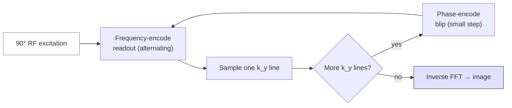

# Echo-planar imaging (EPI) — full course

Course map: Physics → k-space trajectory → parameters → artifacts & correction → fMRI / DWI pipelines → analysis outputs & derivatives → how outputs are used → clinical uses → worked examples → pitfalls → references.

## 1. Learning objectives

By the end of this handout you should be able to:

- Explain why EPI is used for fast 2D imaging and how single-shot readout differs from line-by-line spin-echo imaging.

- Name the main acquisition parameters (TR, TE, bandwidth, parallel imaging, multiband) and describe their trade-offs for SNR, distortion, and temporal resolution.

- Identify susceptibility distortion, Nyquist ghosting, and chemical shift in EPI and know which correction tools address them.

- List preprocessing steps that touch EPI in fMRI (motion, slice-time, topup/fieldmaps) and DWI (eddy).

- Document BIDS fields needed for unwarping and reproducibility.

- Name typical first- and second-level fMRI derivatives (motion TSV, betas, group z-maps) and DWI derivatives (FA, tract files) and state how they feed group stats or clinical decisions.

## 2. What EPI is (conceptual foundation)

### 2.1 The problem EPI solves

- Standard 2D Fourier imaging acquires one phase-encoding line per TR. For 128×128 pixels, that is 128 TRs per slice — far too slow for whole-brain fMRI at ~1–2 s per volume.

- Echo-planar imaging (EPI) fills most of k-space after one (or a few) RF excitation(s) by rapidly alternating the frequency-encoding (readout) gradient and applying small phase-encoding blips between echoes.

- Single-shot EPI acquires an entire 2D slice in tens of milliseconds — short enough to freeze much physiological motion for that slice (though between-slice and head motion remain).

### 2.2 Relationship to GRE and T2*

- The readout is gradient-echo-like: there is no 180° refocusing pulse during the EPI train (unless combined in diffusion prepulses). Signal decays with T2* within the echo train.

- Longer total readout → more T2* decay → signal loss and blurring in the phase-encode** direction.

### 2.3 Where EPI is used in neuroimaging

## 3. k-space trajectory in EPI

### 3.1 Zigzag path

- After slice-selective excitation, the readout gradient dephases then rephases to the echo; frequency encoding moves along k_x (or equivalent axis).

- Phase-encoding blips step k_y (or k_z for blipped 3D variants). The trajectory is often zigzag (alternating readout direction) or spiral-like variants (depending on product).

- Echo spacing (ES) — time between adjacent echoes in the train — is a key parameter: longer ES increases T2* loss and often worsens effective resolution in the phase-encode direction.

### 3.2 Single-shot vs multi-shot

- Single-shot: entire k_y extent in one train — fast, motion-robust slice-wise; long readout → distortion and signal attenuation.

- Multi-shot: k-space split across shots — can reduce distortion per shot but increases motion sensitivity and phase errors between shots.

### 3.3 Readout bandwidth

- Receiver bandwidth (BW) — kHz/pixel or Hz/pixel per vendor — wider BW → shorter readout window per line → less blurring from T2* during readout, but more noise in the receiver (noise bandwidth increases).

## 4. Acquisition parameters (detailed)

### 4.1 fMRI (BOLD) GRE-EPI — typical themes

Field strength: T2* and susceptibility scale with B₀; optimal TE and distortion severity differ 1.5 T vs 3 T vs 7 T.

### 4.2 DWI-EPI — additional parameters

## 5. Artifacts and distortions

### 5.1 Susceptibility-induced geometric distortion

- B₀ inhomogeneity near air–tissue interfaces ( sinuses, ear canals, orbitofrontal cortex) causes mis-mapping of signal along the phase-encode direction — stretch or compress anatomy.

- Stronger at higher B₀; worse with long readout time ( more k_y steps at fixed ES).

### 5.2 Correction strategies

- Field map from dual-echo GRE — estimates ΔB₀ for unwarping to T1.

- FSL topup — uses paired acquisitions with opposite phase-encoding polarity (blip-up / blip-down) to estimate distortion field.

- Document PhaseEncodingDirection, TotalReadoutTime or EffectiveEchoSpacing in BIDS.

### 5.3 Nyquist ghosting

- Asymmetry between odd and even echoes (timing, eddy currents) creates replicate images shifted in phase-encode direction. Phase correction in reconstruction reduces ghosts.

### 5.4 Chemical shift

- Fat–water frequency difference causes misregistration in readout direction — relevant near skull and marrow.

### 5.5 Multiband leakage

- Simultaneous excitation of slices can cause signal cross-talk if reconstruction is imperfect — inspect QC plots from reconstruction pipeline.

## 6. BOLD fMRI — analysis pipeline (overview)

- Drop dummy TRs (equilibration).

- Slice-time correction — align slice times within TR.

- Motion realignment — rigid 6 DOF; scrub or censor spikes.

- Susceptibility distortion correction — fieldmap or topup.

- Coregistration — mean EPI to T1; then normalization to template (workflow-dependent).

- GLM — task + nuisance regressors (motion, WM/CSF, compCorr, optional ICA-AROMA).

- Inference — cluster permutation or TFCE; multiple comparisons correction.

### 6.1 First-level outputs (typical derivatives)

These are not raw DICOM; they are what pipelines produce after preprocessing (names vary by fMRIPrep, FSL FEAT, AFNI, SPM, Nilearn — principle is the same).

### 6.2 Second-level (group) outputs

### 6.3 Resting-state (rs-fMRI) outputs (EPI-based)

### 6.4 How fMRI outputs are used in research (mapping questions → files)

### 6.5 BIDS and provenance

- Raw BIDS: sub-*/func/sub-*_bold.nii.gz + JSON sidecar (TR, PhaseEncodingDirection, SliceTiming, …).

- Derivatives: e.g. derivatives/fmriprep/ or derivatives/fsl/ — always record pipeline name + version in methods.

## 7. DWI with EPI — analysis pipeline (overview)

- Concatenate b=0 and diffusion volumes.

- FSL eddy (or equivalent) — motion and eddy-current distortion per volume.

- Brain mask; optional denoising (e.g. MP-PCA).

- Tensor or CSD fit — match directions to model.

- Registration of FA/b0 to T1 for ROI analysis.

### 7.1 Typical DWI outputs after preprocessing (EPI readout)

*(Full DWI output catalog and clinical nuance — DWI sequence handout.)*

### 7.2 How DWI-EPI outputs are used

## 8. Multi-echo EPI — design and analysis

A standard BOLD EPI run samples a single TE near the grey-matter T2* (~30 ms at 3 T). The BOLD signal is approximately

$$
S(\text{TE}) = S_0\,\exp(-\text{TE}/T_2^*),
$$

so a single-TE acquisition cannot separate **fluctuations in $S_0$** (motion, inflow, scaling artefacts) from **fluctuations in $T_2^*$** (the actual BOLD effect). Multi-echo EPI fixes that by acquiring 2–5 echoes per excitation along the same EPI train.

**Typical 3 T protocol.**

| Echo | TE (ms) | Role |
|---|---|---|
| TE₁ | 14 | Short — robust to dropout, picks up inflow / $S_0$ effects |
| TE₂ | 30 | Near grey-matter T2* — primary BOLD weighting |
| TE₃ | 46 | Long — sensitises to long-T2* structures, helps T2* fit |
| TE₄–₅ | 60–80 (optional) | Improves fit in CSF / long-T2* voxels |

The same RF excitation feeds all echoes — each echo is just another EPI readout train at a different TE. Cost: per-volume readout time grows roughly linearly with the number of echoes, so TR lengthens and slice coverage per second drops.

**Voxelwise fit.** Taking $\ln S(\text{TE}) = \ln S_0 - \text{TE}/T_2^*$ gives a linear fit per voxel per TR:

$$
\hat{T_2^*}(\mathbf{r}, t) = -\frac{\sum_i (\text{TE}_i - \overline{\text{TE}})\,\ln S_i}{\sum_i (\text{TE}_i - \overline{\text{TE}})^2}.
$$

This yields a $T_2^*$ time series and an $S_0$ time series per voxel.

**ME-ICA / tedana.** The TE-dependence of each ICA component tells you whether it is BOLD-like:

- **BOLD-like signals** scale linearly with TE in their $\ln$-amplitude → high $\kappa$ (TE-dependence) score.
- **Non-BOLD nuisance** (motion, scanner drift, swallowing) is TE-independent → high $\rho$ (TE-independence) score.

[tedana](https://tedana.readthedocs.io/) ( [DuPre 2021](https://doi.org/10.21105/joss.03669), implementing the ME-ICA framework of [Kundu 2012](https://doi.org/10.1016/j.neuroimage.2011.12.028)) classifies components and projects out the non-BOLD subspace — substantially cleaner than ICA-AROMA at high motion. The **optimal-combination** weighting was introduced by [Posse 1999](https://doi.org/10.1002/(SICI)1522-2594(199907)42:1<87::AID-MRM13>3.0.CO;2-O): each echo is weighted by $\text{TE}_i \cdot \exp(-\text{TE}_i/T_2^*)$, the BOLD-CNR-optimal weight at the voxel's local $T_2^*$. This recovers BOLD signal in orbitofrontal and temporal regions where the single-TE protocol drops out.

**Pipeline integration.** [tedana](https://tedana.readthedocs.io/en/stable/) runs as a stand-alone step after fMRIPrep, or via [AFNI's `afni_proc.py` with the `-combine OC` / `-combine tedana` options](https://afni.nimh.nih.gov/pub/dist/doc/program_help/afni_proc.py.html) — both consume per-echo NIfTI inputs and emit a denoised, optimally-combined BOLD series. fMRIPrep ≥ 22.x can pass through to tedana via the `--me-output-echos` flag.

**When to use it.** Cortical regions near sinuses (OFC, ventral temporal), high-motion populations (paediatric, clinical), studies aimed at subcortical structures. Cost: longer TR (typically 1.5–2 s for whole-brain at 2.5 mm vs. 0.8–1.0 s for single-echo with multi-band), more complex reconstruction, larger dataset.

## 9. Echo spacing and distortion — the math

The phase-encoded image is distorted because off-resonance frequencies $\Delta f(\mathbf{r})$ accumulate phase along the long readout train. The **echo spacing (ES)** — time between adjacent echoes in the EPI train — sets the effective phase-encode bandwidth:

$$
\text{BW}_\text{PE} = \frac{1}{\text{ES} \cdot N_\text{PE}}\quad\text{(Hz/pixel along PE)}.
$$

A spin at off-resonance $\Delta f$ Hz shifts by

$$
\boxed{\;\Delta y_\text{pix} = \Delta f \cdot \text{ES} \cdot N_\text{PE}\;}
$$

pixels along the phase-encode direction. Note that increasing matrix size $N_\text{PE}$ **worsens distortion** at fixed ES — every extra k-space line is more time over which off-resonance phase accumulates.

**Worked numerical example.** Matrix 64×64, ES = 0.5 ms, off-resonance $\Delta f = 100$ Hz at an air-tissue interface:

$$
\Delta y_\text{pix} = 100\;\text{Hz} \times 0.5\times 10^{-3}\;\text{s} \times 64 = 3.2\ \text{pixels}.
$$

For 3 mm voxels that is a ~1 cm displacement of orbitofrontal cortex — large enough to invalidate naive coregistration to T1.

**How to shrink ES (and therefore distortion).**

- **In-plane parallel imaging (GRAPPA / SENSE).** Skip every R-th k-space line, reconstruct from coil sensitivities. Effective ES per *acquired* line is the same, but $N_\text{PE,acquired} = N_\text{PE} / R$ → distortion scales as $1/R$. Cost: $\sqrt{R}$ SNR loss plus $g$-factor noise amplification.
- **Partial Fourier.** Acquire ~5/8 of k-space and synthesise the rest from conjugate symmetry. Roughly halves readout duration at the cost of slight blurring and reduced SNR.
- **Multi-band (SMS / simultaneous-multi-slice) slice acceleration.** Excite multiple slices at once; unmix with coil sensitivities. This shortens TR by the multi-band factor *but does not reduce per-slice ES or distortion*. Multi-band buys temporal resolution; in-plane acceleration buys geometric fidelity.
- **Higher receive bandwidth / stronger gradients.** Reduces ES directly — limited by hardware and peripheral nerve stimulation.

**Rule of thumb.** Multi-band (slice) and in-plane (PE) acceleration solve different problems. A modern HCP-style protocol uses both: in-plane R = 2 to halve distortion, multi-band 4–8 to keep TR short.

## 10. Off-resonance correction beyond topup

Four families of method, in order of common deployment:

**Field-map based ([Jezzard & Balaban 1995](https://doi.org/10.1002/mrm.1910340111)).** Acquire a dual-echo gradient-echo at the start of the session — typically [`gre_field_mapping`](https://bids-specification.readthedocs.io/en/stable/04-modality-specific-files/01-magnetic-resonance-imaging-data.html#case-1-phase-difference-image-and-at-least-one-magnitude-image) (Siemens) or a vendor-specific dual-echo product. The phase difference between echoes gives a $\Delta B_0$ map:

$$
\Delta f(\mathbf{r}) = \frac{\phi_2(\mathbf{r}) - \phi_1(\mathbf{r})}{2\pi\,(\text{TE}_2 - \text{TE}_1)}.
$$

Plug into the pixel-shift formula above and unwarp (FSL [`FUGUE`](https://fsl.fmrib.ox.ac.uk/fsl/fslwiki/FUGUE)). Works without paired-PE acquisitions but fails if the subject moves between field-map and BOLD/DWI runs. Phase unwrapping is mandatory before division — wrap artefacts produce sharp false gradients.

**Reversed-PE (topup).** Acquire two short b0 / EPI volumes with opposite phase-encode polarity (AP and PA). The susceptibility distortion has *opposite sign* in the two, so the underlying field can be solved by maximising similarity ( [Andersson 2003](https://doi.org/10.1016/S1053-8119(03)00336-7)). This is the modern default — [FSL `topup`](https://fsl.fmrib.ox.ac.uk/fsl/fslwiki/topup) for the field, then [`eddy`](https://fsl.fmrib.ox.ac.uk/fsl/fslwiki/eddy) for per-volume distortion correction in DWI, or [fMRIPrep's SDC](https://fmriprep.org/en/stable/sdc.html) for fMRI. Cost: a few seconds of extra acquisition; requires the PE polarity to be correctly labelled in BIDS. **Preferred for DWI** because the distortion field is sharper, more spatially varying, and matches the diffusion-weighted readout exactly.

**Point-spread-function (PSF) mapping ( [Zaitsev 2004](https://doi.org/10.1002/mrm.20261)).** Acquire an extra phase-encode dimension at low resolution to measure the *actual* PSF of the EPI readout in each voxel. Inverts both displacement *and* intensity pile-up in one step — superior near severe susceptibility (ear canals, frontal sinus) but adds 30–90 s and a specialised reconstruction. Currently used mostly in 7 T research protocols (Tübingen, MGH).

**Synb0-DisCo ([Schilling 2019](https://doi.org/10.1016/j.mri.2019.05.008)).** When no reversed-PE pair was acquired (legacy data, clinical scans), a deep network synthesises an undistorted b0 *from the T1*, which is then fed into topup as if it were the reversed-PE volume. Useful rescue for retrospective datasets. Validate against a held-out site before trusting it on new pathology.

**Where these methods all struggle.** Inferior frontal lobe, temporal lobe near ear canals, brainstem at the foramen magnum. Static susceptibility models assume the field is the same during the long EPI readout — true to first order but breaks down for *intra-volume* dynamic effects (respiration-induced $B_0$ fluctuations of 0.1–1 Hz). For brainstem fMRI, consider [RETROICOR](https://doi.org/10.1002/1522-2594(200007)44:1<162::AID-MRM23>3.0.CO;2-E) or dynamic-distortion-corrected EPI.

**Pipeline behaviour when each is missing.**

| Available data | [fMRIPrep](https://fmriprep.org/en/stable/sdc.html) behaviour | [QSIPrep](https://qsiprep.readthedocs.io/) behaviour |
|---|---|---|
| Reversed-PE b0 (AP+PA) | `topup` SDC — first choice | `topup` + `eddy` |
| Field-map only | Field-map-based SDC (Jezzard) | Field-map → eddy field input |
| Neither | SDC skipped, "syn-SDC" T1-based fallback | Synb0-DisCo if configured, else SDC skipped |

Document which method was used in your methods section — different correction families leave different residual distortion patterns and can interact with second-level group statistics.

### 10.1 Spiral and other non-Cartesian readouts

Cartesian EPI is the universal default, but it is not the only fast readout. **Spiral** trajectories start at $k = 0$ and spiral outward (or vice versa), filling k-space in a single shot with a continuously-rotating gradient.

- **Distortion advantage.** Off-resonance manifests as *blurring* (a rotational PSF), not as the catastrophic stretch / pile-up of Cartesian EPI. Frontal and temporal cortex stay anatomically faithful, which is why spiral was historically preferred for high-field fMRI ([Glover 1999](https://doi.org/10.1002/(SICI)1522-2594(199912)42:6<1146::AID-MRM23>3.0.CO;2-X)).
- **Reconstruction cost.** Samples land on a non-Cartesian grid → cannot use plain FFT. Standard pipeline: [non-uniform FFT (NUFFT) / gridding with density compensation](https://web.eecs.umich.edu/~fessler/code/index.html). Field-map blurring correction requires a deconvolution step, not a pixel shift.
- **Revival at 7 T.** Modern variants — **spiral-in / spiral-in-out** ( [Glover & Law 2001](https://doi.org/10.1002/mrm.1208)), **cones** (3D radial-like), and **stack-of-spirals** — are part of HCP-style 7 T protocols where Cartesian EPI distortion is intolerable. Vendor support is uneven; most spiral work still runs on academic Pulseq / RTHawk pipelines rather than product sequences.
- **When to consider it.** OFC- or brainstem-focused fMRI at ≥ 3 T, ultra-high-resolution 7 T BOLD, anywhere distortion is the limiting factor and reconstruction effort is acceptable.

## 11. Medical / clinical relevance

**Beginner — what it's used for, in one sentence.** EPI is the readout that made fMRI and DWI possible — and the source of every artifact that bedevils clinical interpretation.

### Routine clinical use

- **DWI-EPI** for acute ischaemic stroke — the trace DWI sequence on every stroke MRI is an EPI readout (see [dwi.md](./dwi.md) for the diffusion-specific clinical picture).
- **Task-based BOLD fMRI** for presurgical mapping of motor and language cortex — the FDA-cleared fMRI clinical workflow runs single-band or multi-band GRE-EPI with finger-tapping, verb-generation, and sentence-completion paradigms.
- **Resting-state fMRI** for sensorimotor and language network localisation in tumour and epilepsy patients who cannot perform tasks.
- **Body-EPI** for diffusion in prostate (PI-RADS), breast (BI-RADS), liver, and pancreas oncology — same physics, different anatomy.
- **Spinal-cord DWI-EPI** for cord ischaemia, MS plaques, and post-radiation myelopathy — the most artefact-prone clinical EPI application.

### Disease applications

| Disease | Imaging finding | Clinical value | Cross-link |
|---|---|---|---|
| Drug-resistant epilepsy (presurgical workup) | Task-fMRI language lateralisation; motor mapping near the proposed resection | Wada-test replacement; informs resection extent | [clinical/epilepsy.md](../../clinical/epilepsy.md) |
| Brain tumour (glioma, meningioma) | Task-fMRI for eloquent cortex; DWI-EPI for ADC characterisation | Neuronavigation overlay for awake craniotomy | — |
| Acute ischaemic stroke | DWI-EPI restricted diffusion + perfusion-EPI mismatch | Defines salvageable penumbra for thrombectomy | [clinical/stroke-and-tbi.md](../../clinical/stroke-and-tbi.md) |
| DBS targeting (Parkinson's, OCD, ET) | Resting-state EPI for STN / GPi / VIM connectivity profile | Connectomic targeting beyond stereotactic atlases | [clinical/parkinsons-and-movement.md](../../clinical/parkinsons-and-movement.md) |
| Psychiatric disorders (depression, OCD) | Resting-state and task EPI for default-mode and salience network alterations | TMS / DBS target selection (e.g. SGC for depression) | [clinical/psychiatry.md](../../clinical/psychiatry.md) |
| Multiple sclerosis | DWI-EPI sensitive to acute lesion oedema; fMRI for cognitive reserve studies | Differentiates acute vs chronic lesion activity | [clinical/multiple-sclerosis.md](../../clinical/multiple-sclerosis.md) |

Seminal references for each row:

- Presurgical fMRI guideline: Bauer PR, Reitsma JB, Houweling BM, Ferrier CH, Ramsey NF. Can fMRI safely replace the Wada test for preoperative assessment of language lateralisation? A meta-analysis and systematic review. *Neurology.* 2014;82(20):1763–1771. [doi:10.1212/WNL.0000000000000915](https://doi.org/10.1212/WNL.0000000000000915).
- Presurgical fMRI clinical guideline (ACR/ASFNR): Black DF, Vachha B, Mian A, et al. American Society of Functional Neuroradiology recommendations for clinical performance of fMRI. *AJNR Am J Neuroradiol.* 2017;38(4):E27. [doi:10.3174/ajnr.A5188](https://doi.org/10.3174/ajnr.A5188).
- DBS connectomic targeting: Horn A, Reich M, Vorwerk J, et al. Connectivity predicts deep brain stimulation outcome in Parkinson disease. *Ann Neurol.* 2017;82(1):67–78. [doi:10.1002/ana.24974](https://doi.org/10.1002/ana.24974).
- TMS targeting for depression: Cash RFH, Cocchi L, Lv J, et al. Personalised connectivity-guided DLPFC-TMS for depression. *Hum Brain Mapp.* 2021;42(13):4155–4172. [doi:10.1002/hbm.25330](https://doi.org/10.1002/hbm.25330).

### Research depth

The specialist conversation around clinical EPI is dominated by **distortion correction at the bedside**. Side-by-side comparisons of `topup` (reversed-PE), fieldmap-based ([Jezzard 1995](https://doi.org/10.1002/mrm.1910340111)), and ANTs-SyN structural-anchor methods in clinical OFC and brainstem fMRI show topup as the front-runner when AP/PA pairs were planned — but `Synb0-DisCo` ([Schilling 2019](https://doi.org/10.1016/j.mri.2019.05.008)) and the newer **SynBOLD-DisCo** ([Yu 2023](https://doi.org/10.1002/jmri.28709)) are the only options for legacy stroke datasets that lack reversed-PE acquisitions. Deep-learning distortion correction is moving fast: vendor pipelines (Siemens, GE, Philips) are starting to bundle DL-based EPI unwarping as standard. Clinical translation of **7 T EPI** is the harder frontier — distortion magnitudes 2-3× larger than at 3 T, and through-plane $B_0$ inhomogeneity that conventional `topup` cannot fully resolve. Spinal-cord EPI (HSV-interleaved, ZOOMit) is still a specialised research application despite obvious clinical value.

The other research frontier is **accelerated 3D-EPI and multi-echo at high temporal resolution**. 3D-EPI (PRESTO, EPIK) trades distortion characteristics for whole-brain coverage at TR < 500 ms — opening clinical resting-state at higher network-decomposition resolution. Multi-band 6–8× pushed by HCP / Lifespan / UK Biobank is now feasible on 32–64-channel clinical head coils, but **g-factor noise** and slice leakage remain hidden quality issues that radiologists rarely inspect. Real-time EPI for **fMRI neurofeedback** is in clinical trials for OCD (Sukhodolsky 2020), depression (Mehler 2018), and ADHD — see [tools/clinical-deployment.md](../../tools/clinical-deployment.md) for the deployment infrastructure. For the analysis chain that consumes EPI outputs, see [../../analysis/functional.md](../../analysis/functional.md).

## 12. Worked examples (step-by-step)

### Example A — Temporal sampling and Nyquist (fMRI)

- TR = 2000 ms → 0.5 Hz volume rate. Cardiac ~1 Hz is not fully sampled — aliasing of physiological noise into low frequencies possible; respiration retrospective correction or nuisance regression helps.

### Example B — Echo train duration (order of magnitude)

- Echo spacing 0.55 ms, Ny_phase = 64 → readout ~35 ms (ignoring ramp samples) — order of magnitude for T2* decay across train.

### Example C — topup / blip-up blip-down

- Acquire same distortion geometry with A→P and P→A phase encoding — distortion reverses — FSL topup solves for field for unwarping. Store PhaseEncodingDirection in JSON sidecars.

### Example D — DWI SNR vs b

- Higher b → stronger attenuation exp(−b·ADC) — SNR drops; need more averages or thicker slices or lower resolution.

## 13. Common pitfalls (checklist)

- [ ] TotalReadoutTime or EffectiveEchoSpacing missing → unwarping fails or wrong scale.

- [ ] PhaseEncodingDirection wrong sign → topup direction error.

- [ ] Multiband without LeakBlock QC → unnoticed slice leakage.

- [ ] Ignoring motion in long resting-state → group maps driven by motion correlation.

## 14. Credible peer-reviewed papers (EPI / fMRI)

- Mansfield P. Multi-planar image formation using NMR spin echoes. *J Phys C Solid State Phys.* 1977;10(3):L55–L58. https://doi.org/10.1088/0022-3719/10/3/004

- Jezzard P, Clare S. *Functional MRI: An Introduction to Methods.* Oxford University Press.

- Andersson JLR, et al. How to correct susceptibility distortions in spin-echo echo-planar images: application to diffusion tensor imaging. *NeuroImage.* 2003;20(2):870–888. https://doi.org/10.1016/S1053-8119(03)00336-7

- Ogawa S, et al. Brain magnetic resonance imaging with contrast dependent on blood oxygenation. *Proc Natl Acad Sci U S A.* 1990;87(24):9868–9872. https://doi.org/10.1073/pnas.87.24.9868

- Kwong KK, Belliveau JW, Chesler DA, et al. Dynamic magnetic resonance imaging of human brain activity during primary sensory stimulation. *PNAS.* 1992;89(12):5675–5679. https://doi.org/10.1073/pnas.89.12.5675 — one of the two founding human-BOLD-fMRI papers (with Ogawa 1992), demonstrated within weeks of each other at MGH and Bell Labs.

- Setsompop K, Gagoski BA, Polimeni JR, Witzel T, Wedeen VJ, Wald LL. Blipped-controlled aliasing in parallel imaging for simultaneous multislice echo planar imaging with reduced g-factor penalty. *Magn Reson Med.* 2012;67(5):1210–1224. https://doi.org/10.1002/mrm.23097

- Kundu P, Inati SJ, Evans JW, Luh W-M, Bandettini PA. Differentiating BOLD and non-BOLD signals in fMRI time series using multi-echo EPI. *NeuroImage.* 2012;60(3):1759–1770. https://doi.org/10.1016/j.neuroimage.2011.12.028

- DuPre E, Salo T, Ahmed Z, et al. TE-dependent analysis of multi-echo fMRI with tedana. *J Open Source Softw.* 2021;6(66):3669. https://doi.org/10.21105/joss.03669

- Schilling KG, Blaber J, Huo Y, et al. Synthesized b0 for diffusion distortion correction (Synb0-DisCo). *Magn Reson Imaging.* 2019;64:62–70. https://doi.org/10.1016/j.mri.2019.05.008

- Jezzard P, Balaban RS. Correction for geometric distortion in echo planar images from B0 field variations. *Magn Reson Med.* 1995;34(1):65–73. https://doi.org/10.1002/mrm.1910340111

- Posse S, Wiese S, Gembris D, et al. Enhancement of BOLD-contrast sensitivity by single-shot multi-echo functional MR imaging. *Magn Reson Med.* 1999;42(1):87–97. https://doi.org/10.1002/(SICI)1522-2594(199907)42:1<87::AID-MRM13>3.0.CO;2-O

- Glover GH. Simple analytic spiral K-space algorithm. *Magn Reson Med.* 1999;42(2):412–415. https://doi.org/10.1002/(SICI)1522-2594(199908)42:2<412::AID-MRM25>3.0.CO;2-U

- Glover GH, Law CS. Spiral-in/out BOLD fMRI for increased SNR and reduced susceptibility artifacts. *Magn Reson Med.* 2001;46(3):515–522. https://doi.org/10.1002/mrm.1208

- Zaitsev M, Hennig J, Speck O. Point spread function mapping with parallel imaging techniques and high acceleration factors. *Magn Reson Med.* 2004;52(5):1156–1166. https://doi.org/10.1002/mrm.20261

## 15. Credible online resources

- [fMRIPrep SDC documentation](https://fmriprep.org/en/stable/sdc.html) — decision tree for which susceptibility-distortion correction method is applied given available fieldmap data.
- [tedana documentation](https://tedana.readthedocs.io/en/stable/) — multi-echo ICA denoising, optimal combination, $\kappa$ / $\rho$ scoring.
- [AFNI `afni_proc.py` multi-echo workflow](https://afni.nimh.nih.gov/pub/dist/doc/program_help/afni_proc.py.html) — `-combine OC` and `-combine tedana` options.
- [QSIPrep distortion-correction docs](https://qsiprep.readthedocs.io/en/latest/preprocessing.html) — `topup` and Synb0 integration for DWI.
- [FSL `topup` / `eddy` / FEAT](https://fsl.fmrib.ox.ac.uk/fsl/fslwiki/) — distortion + motion correction + first-level GLM.
- [mriquestions — EPI](https://mriquestions.com/echo-planar-imaging.html) — k-space and ghosting primer.
- [BIDS specification](https://bids-specification.readthedocs.io/) — fMRI and DWI metadata fields.

## 16. References (sources used to create this content)

- Jezzard P, Clare S. *Functional MRI: An Introduction to Methods.* Oxford University Press.
- [FSL topup and eddy documentation](https://fsl.fmrib.ox.ac.uk/)
- [fMRIPrep SDC docs](https://fmriprep.org/en/stable/sdc.html)
- [tedana docs](https://tedana.readthedocs.io/en/stable/)
- [AFNI `afni_proc.py` reference](https://afni.nimh.nih.gov/pub/dist/doc/program_help/afni_proc.py.html)
- [mriquestions.com — EPI k-space and ghosting](https://mriquestions.com/)
- [BIDS specification — fMRI and diffusion metadata](https://bids-specification.readthedocs.io/)

### Closing

Your scanner PDF protocol and physicist sign-off override generic numbers here. Always archive sequence parameters in BIDS sidecars.

## EPI k-space trajectory

*<small>EPI fills k-space in a single zigzag readout after one excitation: frequency-encode gradient reverses each line, small phase-encode blips step k_y. Original figure.</small>*

## Visual references

- **MRI Questions — EPI explainer.** [https://mriquestions.com/echo-planar-imaging.html](https://mriquestions.com/echo-planar-imaging.html) — animated k-space trajectories and pulse-sequence diagrams.
- **FSL `topup` tutorial figures.** [https://fsl.fmrib.ox.ac.uk/fsl/fslwiki/topup/TopupUsersGuide](https://fsl.fmrib.ox.ac.uk/fsl/fslwiki/topup/TopupUsersGuide) — side-by-side AP / PA distortion correction.
- **fastMRI gallery.** [https://fastmri.med.nyu.edu](https://fastmri.med.nyu.edu) — under-sampled k-space + reconstruction comparisons.