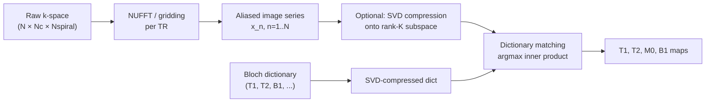

# Magnetic Resonance Fingerprinting (MRF) — full course

> Conventional MRI gives you one weighted contrast at a time. MRF gives you T1, T2, M0, B1, and off-resonance from a single pseudorandom scan by pattern-matching the dynamic signal to a precomputed Bloch dictionary.

Course map: Why MRF → Bloch + pseudorandom acquisition → dictionary generation → pattern matching → sequence families (bSSFP, FISP, EPI, 3D) → SVD / low-rank / DL reconstruction → quantitative maps → artifacts → clinical / research use → software → open problems → references.

## 1. Learning objectives

- Explain in one sentence why a pseudorandom MRF acquisition produces a tissue-unique signal evolution.
- Write the dictionary-matching objective and state why aliasing from severe k-space undersampling does not corrupt the match.
- Compare bSSFP-MRF, FISP-MRF, EPI-MRF, and 3D-MRF by SNR, B0 sensitivity, and scan time.
- Apply SVD / low-rank dictionary compression and explain its complexity gain.
- Diagnose three common failure modes — dictionary mismatch, partial volume, vendor pulse-shape drift — from an MRF map.
- Map MRF outputs (T1, T2, M0, B1+, off-resonance) onto clinical and research use cases.

## 2. Why MRF — the intuition

Standard MRI is a *contrast machine*. You pick a sequence (MPRAGE, T2-FLAIR, SPACE), the scanner spends 5–10 minutes producing *one* weighted image, and you read it. Two MPRAGEs from two scanners are not directly comparable — see [qMRI](./qmri.md) for the full reproducibility argument.

MRF (Ma et al., 2013, [doi:10.1038/nature11971](https://doi.org/10.1038/nature11971)) replaces "contrast" with "fingerprint". The scanner runs ~1000 TRs of *pseudorandomly varying* flip angle, TR, and phase. Each tissue type — based on its $(T_1, T_2, M_0, B_1, \Delta f)$ — produces a *unique* signal evolution in time. A precomputed dictionary of Bloch simulations enumerates every plausible fingerprint. Match the observed evolution voxel-by-voxel to the dictionary, read off the parameters.

The analogy: every tissue has a barcode under this acquisition. The dictionary is the barcode reader.

What you get from one ~12–20 s/slice scan:

- Quantitative T1, T2, M0 (always)
- B1+ field map (almost always)
- Off-resonance $\Delta f$ (sequence-dependent)
- Synthetic T1w / T2w / FLAIR / STIR by Bloch playback (free)
- Partial-volume fractions (with multi-component dictionaries)

The seminal moment is [Ma et al., *Nature* 2013;495:187](https://doi.org/10.1038/nature11971). FISP-MRF ([Jiang et al., *MRM* 2015;74:1621](https://doi.org/10.1002/mrm.25559)) is the variant most clinical brain protocols use today.

## 3. Physics — Bloch dynamics under pseudorandom excitation

### 3.1 Signal model

Each tissue voxel obeys the [Bloch equations](https://en.wikipedia.org/wiki/Bloch_equations) — the longitudinal and transverse magnetisation evolve as

$$
\frac{dM_z}{dt} = -\frac{M_z - M_0}{T_1},\qquad
\frac{dM_{xy}}{dt} = -\frac{M_{xy}}{T_2} - i\,\omega\,M_{xy},
$$

with $\omega = \gamma B_0 + \Delta\omega$ encoding off-resonance. MRF treats this pair as the *simulation primitive*: given $(T_1, T_2, M_0, B_1, \Delta f)$ and the per-TR schedule $(\alpha_n, \mathrm{TR}_n, \mathrm{TE}_n, \phi_n)$, integrate the equations forward $N$ times to obtain a fingerprint $\mathbf{s} \in \mathbb{C}^N$. See [foundations/physics.md](../foundations/physics.md) for the derivation and the rotating-frame conventions.

The transverse magnetisation immediately after the $n$-th excitation is

$$
S_n = f(T_1, T_2, M_0, B_1, \Delta f;\; \alpha_n, \mathrm{TR}_n, \mathrm{TE}_n, \phi_n),
$$

where $\alpha_n, \mathrm{TR}_n, \mathrm{TE}_n, \phi_n$ are the per-TR flip angle, repetition time, echo time, and RF phase. The acquisition is the time series

$$
\mathbf{s} = (S_1, S_2, \ldots, S_N) \in \mathbb{C}^N.
$$

Under a *constant* sequence (the conventional way) the steady-state simplifies — many tissues collapse to nearly identical signal. MRF deliberately *prevents* steady state by making $(\alpha_n, \mathrm{TR}_n, \phi_n)$ vary smoothly but pseudorandomly across $n$. Different $(T_1, T_2)$ tissues then trace out *distinct* trajectories in $\mathbb{C}^N$.

### 3.2 Why the trajectories are unique

Consider two tissues with parameters $\theta_a = (T_{1,a}, T_{2,a})$ and $\theta_b = (T_{1,b}, T_{2,b})$. After Bloch simulation,

$$
\mathbf{s}(\theta_a),\; \mathbf{s}(\theta_b) \in \mathbb{C}^N.
$$

For a well-designed schedule, the inner-product similarity

$$
\rho(\theta_a, \theta_b) = \frac{|\langle \mathbf{s}(\theta_a),\; \mathbf{s}(\theta_b)\rangle|}{\|\mathbf{s}(\theta_a)\|\,\|\mathbf{s}(\theta_b)\|}
$$

is strictly less than $1$ whenever $\theta_a \neq \theta_b$, and *uniformly* bounded away from $1$ over the physiological grid. That uniform separation is what makes pattern matching well-posed.

### 3.3 Sequence families

| Family | Originator | Key trait | Failure mode |
|---|---|---|---|
| **bSSFP-MRF** | [Ma 2013](https://doi.org/10.1038/nature11971) | High SNR, T1+T2 in one shot | Banding artifacts off-resonance |
| **FISP-MRF** | [Jiang 2015](https://doi.org/10.1002/mrm.25559) | Unbalanced gradients → B0-robust | Lower SNR than bSSFP |
| **EPI-MRF** | Rieger 2017 | Faster readout, multi-slice efficient | EPI distortion, lower SNR |
| **3D-MRF** | [Liao 2017](https://doi.org/10.1016/j.neuroimage.2017.08.030), Cao 2019 | Whole brain in ~5 min | Reconstruction complexity, motion |

FISP-MRF is the de facto brain standard at 3T because the banding artifacts of bSSFP-MRF are intolerable wherever $\Delta f$ varies (frontal sinus, ear canals). The vendor implementations — Siemens [MAGiC](https://www.siemens-healthineers.com/magnetic-resonance-imaging/options-and-upgrades/clinical-applications/magic) and GE MAGiC (a different but similarly named product) — are FISP-flavoured.

### 3.4 Dictionary generation

Discretise the parameter space on a log-spaced grid:

| Parameter | Typical range | Grid spacing |
|---|---|---|
| $T_1$ | 10–5000 ms | log, ~1–2% steps |
| $T_2$ | 2–3000 ms | log, ~2% steps |
| $B_1$ | 0.7–1.3 × nominal | linear, 0.05 |
| $\Delta f$ (optional) | $\pm 100$ Hz | linear, ~5 Hz |

Total dictionary size: $\sim 3\times10^4$ to $5\times10^5$ entries per protocol. Each entry $d_i \in \mathbb{C}^N$ is a Bloch simulation of the exact $(\alpha_n, \mathrm{TR}_n, \mathrm{TE}_n, \phi_n)$ schedule. Generation cost is one-off per protocol but non-trivial — see [Pulseq-MRF](https://github.com/imr-framework/pypulseq) for portable simulators.

### 3.5 Pattern matching

For each voxel signal $\mathbf{s}_\text{obs}$, the estimated parameters are

$$
\hat\theta = \arg\max_{i \in \mathcal{D}} \frac{|\langle \mathbf{s}_\text{obs},\; d_i\rangle|}{\|\mathbf{s}_\text{obs}\|\,\|d_i\|}.
$$

Read off $(T_1, T_2, B_1, \ldots)$ from the index $i$ of the dictionary winner. $M_0$ is recovered from the magnitude of the projection. That is the entire reconstruction — one inner product per (voxel, dictionary entry).

### 3.6 Why MRF tolerates massive k-space undersampling

Each TR samples a single spiral or radial arm in k-space — far below Nyquist. The per-frame image $x_n$ therefore has heavy aliasing $a_n$. The crucial property: aliasing is **incoherent across the time series** $n = 1, \ldots, N$. Stack frames into the signal vector $\mathbf{s}_\text{obs} = (x_1, \ldots, x_N)$ at a single voxel. The aliasing contribution $\mathbf{a}_\text{vox} = (a_1, \ldots, a_N)$ behaves as a zero-mean noise process *with respect to dictionary entries*. The true signal is correlated with one dictionary entry; the aliasing is correlated with none. Maximum-likelihood matching ignores it.

Practical consequence: 8–16× undersampling is routine; some protocols push 48×. This is what makes ~12 s/slice 2D scans and ~5 min 3D whole-brain scans possible.

## 4. Acquisition at the scanner

Typical 2D brain FISP-MRF protocol:

- **TRs**: $N \approx 1000$
- **Per-TR time**: 12–20 ms → scan duration ~12–20 s/slice
- **K-space sampling**: variable-density spiral (Ma 2013) or golden-angle radial (Jiang 2015)
- **One spiral arm per TR**: rotated by a golden angle ($\sim 222.5°$) for incoherence
- **Flip-angle schedule**: smoothly varying sinusoid-like envelope, typically $0°$–$60°$
- **Resolution**: 1.0–1.2 mm in-plane, 5 mm slice (2D); 1.0–1.5 mm isotropic (3D)

For 3D whole-brain MRF (Liao 2017, Cao 2019), partition encoding adds a factor proportional to slab thickness. With CAIPI-style under-sampling along $k_z$ and low-rank reconstruction, 5–7 minutes for whole-brain isotropic is achievable on a 3T 32-channel coil.

Vendor implementations:

- [Siemens MAGiC (syngo MAGiC)](https://www.siemens-healthineers.com/magnetic-resonance-imaging/options-and-upgrades/clinical-applications/magic) — FISP-MRF, 2D brain
- GE MAGiC — multi-delay multi-echo synthetic MRI (different physics, similar name; do not confuse)
- Philips MRF — research-only WIP package
- Open Pulseq-MRF — vendor-agnostic via [Pulseq](https://pulseq.github.io/) + [pypulseq](https://github.com/imr-framework/pypulseq)

## 5. Reconstruction — from raw k-space to parameter maps



### 5.1 Direct template matching (Ma 2013)

Brute-force inner product against every dictionary entry. With $V \sim 10^6$ voxels, $N \sim 10^3$ time points, $D \sim 10^5$ entries, complexity is $\mathcal{O}(VND) \sim 10^{14}$ flops. Slow but parallel.

### 5.2 SVD compression (McGivney 2014, [doi:10.1109/TMI.2014.2337321](https://doi.org/10.1109/TMI.2014.2337321))

The dictionary matrix $\mathbf{D} \in \mathbb{C}^{N \times D}$ has effective rank $K \ll N$ — typical $K \approx 10$ for $N = 1000$. Compute SVD $\mathbf{D} = \mathbf{U}\boldsymbol\Sigma\mathbf{V}^\top$, project both signal and dictionary onto $\mathbf{U}_K$:

$$
\tilde{\mathbf{s}} = \mathbf{U}_K^\top \mathbf{s},\qquad \tilde{\mathbf{D}} = \mathbf{U}_K^\top \mathbf{D}.
$$

Now matching is in $\mathbb{C}^K$ instead of $\mathbb{C}^N$ — a 100× speedup with negligible accuracy loss.

### 5.3 Low-rank reconstruction (Assländer 2018)

Move the rank-$K$ subspace *into* the reconstruction itself: solve

$$
\min_{\mathbf{X}}\; \|\mathbf{E}\mathbf{X} - \mathbf{y}\|_2^2 \quad \text{s.t.}\quad \operatorname{rank}(\mathbf{X}) \le K,
$$

where $\mathbf{E}$ is the encoding operator (coil $\circ$ NUFFT) and $\mathbf{X}$ is the time series. Dramatically denoises before matching, at the cost of a more complex solver.

### 5.4 Deep-learning reconstruction

Three families have emerged:

- **MRF-net** ([Cohen 2018, *MRM* 80:885](https://doi.org/10.1002/mrm.27198)) — replaces dictionary matching with a CNN regressor from $\mathbf{s}$ to $(T_1, T_2)$. Fast at inference; brittle out-of-distribution.
- **Spatial-context networks (SCQ)** (Fang 2019) — exploit neighbour voxels to denoise the per-voxel match.
- **Plug-and-play priors** (Hamilton 2019) — alternate dictionary matching with an image-domain denoiser (BM3D or CNN) inside an iterative loop.

DL methods break dictionary mismatch silently — out-of-grid tissues get a confidently-wrong number. Always pair with an in-distribution check.

### 5.5 Joint B1+ estimation

A key practical advantage of FISP-MRF: $B_1$ becomes a dictionary axis. Adding a $B_1$ grid expands the dictionary $\sim 10\times$, but recovers a built-in $B_1$ map — no separate AFI / Bloch–Siegert scan required. The same idea extends to motion ([Mehta 2018](https://doi.org/10.1002/mrm.26926)) via motion-robust radial sampling.

### 5.6 Reference pattern-matching loop in twelve lines

The reconstruction core, stripped of GPU and SVD tricks, is one normalised inner product per voxel. With NumPy ([numpy.org](https://numpy.org)):

```python
import numpy as np

# dictionary: D in C^{N x K}, columns are unit-norm Bloch fingerprints
# observed:   S in C^{N x V}, columns are per-voxel signal evolutions
D = D / np.linalg.norm(D, axis=0, keepdims=True)
S = S / np.linalg.norm(S, axis=0, keepdims=True)

# inner product magnitudes (V x K), pick the best dictionary index per voxel
scores      = np.abs(S.conj().T @ D)
best_idx    = scores.argmax(axis=1)                # (V,)
T1_map      = T1_grid[best_idx].reshape(H, W)
T2_map      = T2_grid[best_idx].reshape(H, W)
M0_map      = (S.conj() * D[:, best_idx]).sum(0).reshape(H, W)
```

Production reconstructions wrap this with the SVD compression of § 5.2, an FFT-based NUFFT for the spiral readout (`sigpy` / [`BART`](https://mrirecon.github.io/bart/)), and chunked GPU matmuls for the inner product. The mathematical content is what you see above.

## 6. Analysis outputs and derivatives

| Map | Units | Typical adult brain at 3T |
|---|---|---|
| $T_1$ | ms | WM 700–900, GM 1300–1500, CSF >4000 |
| $T_2$ | ms | WM 60–80, GM 80–100, CSF >2000 |
| $M_0$ | a.u. | Proton-density proxy |
| $B_1^+$ | relative | ~1.0 ± 0.2 across brain |
| $\Delta f$ | Hz | ±50 cortex; ±100 frontal sinus |
| Synthetic T1w/T2w/FLAIR | a.u. | Bloch-simulated playback |

Downstream uses:

- **ROI summaries**: ComBat-harmonisable across sites because units are physical (ms).
- **Voxel-wise statistics**: VBM-style on T1 / T2 maps; cross-site pooling needs phantom QC.
- **Atlas-based normative references**: e.g. [Stikov 2015](https://doi.org/10.1016/j.neuroimage.2015.01.061) WM T1 reference values.
- **BIDS storage**: under the [Quantitative MRI extension (BEP001)](https://bids-specification.readthedocs.io/en/stable/modality-specific-files/quantitative-mri.html) — `_T1map.nii.gz`, `_T2map.nii.gz`, `_M0map.nii.gz` with explicit JSON sidecars.
- **Synthetic-contrast reading**: clinical radiologists prefer familiar T2w/FLAIR rendering; MRF provides them for free from the same scan.

## 7. Artifacts and failure modes

- **Dictionary mismatch (silent).** If a voxel's true $(T_1, T_2)$ lies outside the dictionary grid, the matcher picks the *nearest* entry — no warning. The output is wrong in a way no statistical test catches. Mitigation: always inspect output histograms; extend the grid to cover oedema (T2 > 200 ms) and CSF (T1 > 4000 ms).
- **B0 / B1 inhomogeneity at high field.** bSSFP-MRF bands fail at 7T; FISP-MRF is the working choice. Even FISP suffers near sinuses if $\Delta f$ axis is not included in the dictionary.
- **Motion.** A continuous-time pseudorandom acquisition corrupts the *entire* fingerprint if motion occurs mid-scan. Motion-robust variants use golden-angle radial + view-sharing reconstruction; some implement intra-scan rigid registration.
- **Partial volume.** A voxel containing GM + WM + CSF does not match any single-component dictionary entry — produces a biased compromise. **Multi-component MRF** ([McGivney 2018](https://doi.org/10.1002/nbm.4140)) estimates fractions $(f_\text{GM}, f_\text{WM}, f_\text{CSF})$ instead of point parameters.
- **Slice-profile imperfection.** A non-rectangular slice excitation means the on-axis Bloch simulation overestimates flip angle for off-centre spins. Solution: simulate the *actual* slice profile in the dictionary.
- **Vendor drift.** Pulse-shape, spoiler-gradient amplitude, and RF-amplifier non-linearity differ across vendors. The dictionary you simulated for vendor A does not transfer to vendor B without recalibration — see § 11.
- **Spiral trajectory errors.** Gradient delays distort spiral k-space; uncorrected, they show up as off-centre artifacts in the parameter maps. Use trajectory measurement (Duyn 1998) or self-calibration.

## 8. Medical / clinical relevance

**Beginner.** MRF promises a single-acquisition quantitative T1, T2, M0 map per voxel — the most exciting near-term clinical translation in advanced MR.

**Routine clinical use.** Mostly pre-clinical / research today, with vendor-product deployment growing. Siemens **MAGiC** (FISP-MRF, 2D brain) is shipping; the [synthetic-MRI MAGiC family](https://syntheticmr.com/) (separate physics, similar name) is FDA-cleared and clinically deployed for routine brain. Quantitative tumour follow-up and MS longitudinal monitoring are the clearest near-term clinical niches.

**Disease applications.**

| Disease | Imaging finding | Clinical value | Cross-link |
|---|---|---|---|
| Brain tumour grading | Joint (T1, T2) distributions separate low- vs high-grade glioma; AUC ≈ 0.8 in published cohorts | Pre-operative grading, treatment-response monitoring | [doi:10.3174/ajnr.A5035](https://doi.org/10.3174/ajnr.A5035) (Badve 2017); [doi:10.1016/j.neuroimage.2017.08.030](https://doi.org/10.1016/j.neuroimage.2017.08.030) (Liao 2017) |
| Cardiac fibrosis | Simultaneous T1 / T2 mapping under ECG gating | Diffuse fibrosis quantification beyond LGE | [doi:10.1002/mrm.26216](https://doi.org/10.1002/mrm.26216) (Hamilton 2017) |
| Multiple sclerosis | Pre-lesional T1 / T2 changes in normal-appearing WM; longitudinal demyelination / remyelination | Drug-trial endpoint beyond FLAIR count | [doi:10.1002/mrm.28467](https://doi.org/10.1002/mrm.28467) (Boss 2021); [clinical/multiple-sclerosis.md](../../clinical/multiple-sclerosis.md) |
| Alzheimer's disease | Cortical T1 elongation precedes atrophy | Earlier-stage biomarker than volume loss | [doi:10.1002/mrm.30094](https://doi.org/10.1002/mrm.30094) (Coppock 2024); [clinical/alzheimers-and-dementia.md](../../clinical/alzheimers-and-dementia.md) |
| Focal cortical dysplasia | Subtle intermediate T1 / T2 between cortex and WM that conventional images miss | Pre-surgical localisation in MRI-negative epilepsy | [doi:10.1093/brain/awz113](https://doi.org/10.1093/brain/awz113) (Ma 2019); [clinical/epilepsy.md](../../clinical/epilepsy.md) |
| Prostate cancer | Quantitative T1 / T2 PI-RADS adjunct | Improves lesion conspicuity vs T2-only | Yu 2017 |
| Hepatic disease | Liver iron + fibrosis in one breath-hold (Chen 2019) | Non-invasive multi-parametric liver assessment | Hamilton 2017 family |
| Synthetic contrast generation | Single MRF scan → T1w / T2w / FLAIR / STIR by Bloch playback | Replaces a stack of conventional sequences, shorter total exam | Standard in vendor MAGiC implementations |

**Research depth.** See the analysis-side deep dive at [../../analysis/mrf.md](../../analysis/mrf.md). The advanced open problems are dominated by translational engineering rather than core physics: **vendor harmonisation** — dictionaries simulated for vendor A's pulse-shape and spoiler-gradient profile do not transfer to vendor B without recalibration; **deep-learning reconstruction quality** under distribution shift (vendor, anatomy, pathology) where out-of-grid voxels get confidently-wrong numbers; and **clinical-trial endpoint validation** — Centiloid-style cross-vendor harmonisation does not yet exist for MRF T1 / T2. **FDA-cleared MAGiC (synthetic MRI)** is the closest current production deployment and a useful benchmark for what clinical translation actually looks like. AI-MRF reconstruction trade-offs (dictionary matching vs CNN regression vs MR-STAT nonlinear-tomography — [Sbrizzi 2018](https://doi.org/10.1016/j.mri.2017.10.015)) are an active research front. **Partial-volume MRF** ([McGivney 2018](https://doi.org/10.1002/nbm.4140), Hamilton 2020) estimates GM / WM / CSF fractions instead of biased single-component point estimates — critical in atrophic brain. Bayesian uncertainty propagation through dictionary matching, scan-time reduction to sub-5-min whole-brain 3D, and the patient-throughput economics of replacing stacked weighted contrasts with a single MRF scan plus playback are the clinical-translation barriers, not the Bloch equations.

## 9. Software and tools

- [pyMRF](https://github.com/jakobasslaender/pyMRF) — Python reference implementation
- [MRF-recon (Stanford)](https://github.com/MRSRL/mrf-recon) — research reconstruction toolbox
- [Gadgetron MRF](https://github.com/gadgetron/gadgetron) — vendor-agnostic real-time reconstruction
- [BART](https://mrirecon.github.io/bart/) — Berkeley Advanced Reconstruction Toolbox; SVD + low-rank MRF production-grade
- [Pulseq](https://pulseq.github.io/) + [pypulseq](https://github.com/imr-framework/pypulseq) — open vendor-neutral pulse sequence framework, the basis of reproducible Pulseq-MRF
- [MRiLab](http://mrilab.sourceforge.net/) — GPU Bloch simulator for dictionary generation
- [Siemens MAGiC](https://www.siemens-healthineers.com/magnetic-resonance-imaging/options-and-upgrades/clinical-applications/magic) — vendor FISP-MRF (research / clinical)
- GE MAGiC — vendor synthetic-MRI (note: different physics; see [qMRI](./qmri.md))
- [ISMRM Reproducibility Challenge MRF datasets](https://github.com/ISMRM/rrsg_challenge_01) — open datasets for benchmarking (see `mrf_data` subfolders)
- [BIDS-qMRI specification](https://bids-specification.readthedocs.io/en/stable/modality-specific-files/quantitative-mri.html) — storage layout for T1 / T2 / M0 maps

## 10. Open problems / research frontier

- **Cross-vendor harmonisation.** Dictionaries simulated for vendor A's pulse shape do not transfer to vendor B. Building a vendor-agnostic dictionary (or learning a vendor-residual correction) is open.
- **Multi-parametric extensions.** Simultaneous QSM + MRF; diffusion + MRF (qMRF, [Jiang 2017](https://doi.org/10.1002/mrm.26658)); MT + MRF for myelin water fraction. Each adds a dictionary axis and a sequence-design problem.
- **MR-STAT — model-based alternative.** [Sbrizzi 2018](https://doi.org/10.1016/j.mri.2017.10.015) reformulates parameter estimation as a *nonlinear tomography* problem solved by Gauss–Newton on the full Bloch forward model — no dictionary required. Higher per-pixel cost but no grid discretisation error. Useful comparator when discussing MRF vs alternatives.
- **Deep-learning reconstruction at scale.** [Chen 2020](https://doi.org/10.1016/j.neuroimage.2019.116329) demonstrated high-resolution 3D MRF with parallel imaging + DL reconstruction. The open question is calibration under distribution shift (vendor, anatomy, pathology) — see the [Hamilton & Seiberlich 2020](https://doi.org/10.1109/JPROC.2019.2936998) review for an honest accounting of where DL-MRF over-promised.
- **Faster 3D acquisition.** Whole-brain isotropic MRF in <5 min on clinical 3T is the engineering target; requires aggressive CAIPI + low-rank + DL-prior reconstruction.
- **Foundation models for MRF reconstruction.** Replace dictionary matching with self-supervised neural surrogates trained on Bloch simulations + population data — calibration is the open question. See [ai/uncertainty.md](../../ai/uncertainty.md) for the calibration framework.
- **Validation phantoms.** The [NIST/ISMRM premium quantitative MRI phantom](https://www.nist.gov/programs-projects/quantitative-mri) is the de facto standard; field-wide phantom audits are still patchy.
- **Clinical reimbursement.** As of 2025 MRF is investigational in most jurisdictions; ICD-10 / CPT codes for "quantitative T1 mapping" don't exist outside a few cardiac applications. Reimbursement, not physics, gates clinical adoption.
- **Plug-and-play population priors.** Replace the hand-crafted denoiser with one trained on a large MRF population — better SNR, but risk of hallucinating physiology.
- **Open Pulseq-MRF.** Vendor-agnostic pulse sequence + open dictionary is the path to reproducible MRF; gradient-delay and B0-shim differences across vendors remain the practical bottleneck.
- **Sub-millimetre cortical MRF.** Trade SNR for resolution to map laminar T1 / T2; tied to 7T and laminar fMRI literature.

## 11. References

1. **Ma D, Gulani V, Seiberlich N, et al.** Magnetic resonance fingerprinting. *Nature.* 2013;495:187–192. [doi:10.1038/nature11971](https://doi.org/10.1038/nature11971)
2. **Jiang Y, Ma D, Seiberlich N, Gulani V, Griswold MA.** MR fingerprinting using fast imaging with steady-state precession (FISP) with spiral readout. *Magn Reson Med.* 2015;74:1621–1631. [doi:10.1002/mrm.25559](https://doi.org/10.1002/mrm.25559)
3. **McGivney DF, Pierre E, Ma D, et al.** SVD compression for magnetic resonance fingerprinting in the time domain. *IEEE Trans Med Imaging.* 2014;33:2311–2322. [doi:10.1109/TMI.2014.2337321](https://doi.org/10.1109/TMI.2014.2337321)
4. **Cohen O, Zhu B, Rosen MS.** MR fingerprinting deep reconstruction network (DRONE). *Magn Reson Med.* 2018;80:885–894. [doi:10.1002/mrm.27198](https://doi.org/10.1002/mrm.27198)
5. **McGivney DF, Boyacioglu R, Jiang Y, et al.** Magnetic resonance fingerprinting review part 2: technique and directions. *NMR Biomed.* 2020;33:e4140. [doi:10.1002/nbm.4140](https://doi.org/10.1002/nbm.4140) — overview / review.
6. **Panda A, Mehta BB, Coppo S, et al.** Magnetic resonance fingerprinting — an overview. *Top Magn Reson Imaging.* 2017;26:193–202. [doi:10.1097/RMR.0000000000000130](https://doi.org/10.1097/RMR.0000000000000130) — review.
7. **Liao C, Bilgic B, Manhard MK, et al.** 3D MR fingerprinting with accelerated stack-of-spirals and hybrid sliding-window and GRAPPA reconstruction. *NeuroImage.* 2017;162:13–22. [doi:10.1016/j.neuroimage.2017.08.030](https://doi.org/10.1016/j.neuroimage.2017.08.030)
8. **Hamilton JI, Jiang Y, Chen Y, et al.** MR fingerprinting for rapid quantification of myocardial T1, T2, and proton spin density. *Magn Reson Med.* 2017;77:1446–1458. [doi:10.1002/mrm.26216](https://doi.org/10.1002/mrm.26216)
9. **Assländer J, Cloos MA, Knoll F, et al.** Low-rank alternating direction method of multipliers reconstruction for MR fingerprinting. *Magn Reson Med.* 2018;79:83–96. [doi:10.1002/mrm.26639](https://doi.org/10.1002/mrm.26639)
10. **Mehta BB, Coppo S, McGivney DF, et al.** Magnetic resonance fingerprinting: a technical review. *Magn Reson Med.* 2019;81:25–46. [doi:10.1002/mrm.27403](https://doi.org/10.1002/mrm.27403)
11. **Hamilton JI, Jiang Y, Eck B, Griswold M, Seiberlich N.** Cardiac cine magnetic resonance fingerprinting for combined ejection fraction, T1, and T2 quantification. *NMR Biomed.* 2020;33:e4323. [doi:10.1002/nbm.4323](https://doi.org/10.1002/nbm.4323)
12. **Jiang Y, Hamilton JI, Lo W-C, et al.** Simultaneous T1, T2 and diffusion quantification using multiple contrast prepared magnetic resonance fingerprinting. *Magn Reson Med.* 2017. [doi:10.1002/mrm.26658](https://doi.org/10.1002/mrm.26658)
13. **Sbrizzi A, van der Heide O, Cloos M, et al.** Fast quantitative MRI as a nonlinear tomography problem (MR-STAT). *Magn Reson Imaging.* 2018;46:56–63. [doi:10.1016/j.mri.2017.10.015](https://doi.org/10.1016/j.mri.2017.10.015)
14. **Chen Y, Fang Z, Hung SC, Chang WT, Shen D, Lin W.** High-resolution 3D MR fingerprinting using parallel imaging and deep learning. *NeuroImage.* 2020;206:116329. [doi:10.1016/j.neuroimage.2019.116329](https://doi.org/10.1016/j.neuroimage.2019.116329)
15. **Hamilton JI, Seiberlich N.** Machine learning for rapid magnetic resonance fingerprinting tissue property quantification. *Proc IEEE.* 2020;108(1):69–85. [doi:10.1109/JPROC.2019.2936998](https://doi.org/10.1109/JPROC.2019.2936998)
16. **Panda A, Mehta BB, Coppo S, et al.** Magnetic resonance fingerprinting — an overview. *Curr Opin Biomed Eng.* 2017;3:56–66. [doi:10.1016/j.cobme.2017.11.001](https://doi.org/10.1016/j.cobme.2017.11.001)

## Where to next

- Sibling quantitative-MRI page: [./qmri.md](./qmri.md) — VFA, MP2RAGE, MTsat, MPM, and how MRF compares.
- Physics behind the Bloch dynamics: [../foundations/physics.md](../foundations/physics.md).
- Calibration of DL-based reconstruction: [../../ai/uncertainty.md](../../ai/uncertainty.md).
- Downstream of T1 / T2 maps: [../../analysis/structural.md](../../analysis/structural.md).
- Clinical use cases: [../../clinical/multiple-sclerosis.md](../../clinical/multiple-sclerosis.md), [../../clinical/epilepsy.md](../../clinical/epilepsy.md).

### Closing

MRF is the most ambitious idea in quantitative MRI of the last decade: trade scan-time linearity for dictionary computation, accept massive k-space undersampling, and harvest five physical maps from one ~15 s acquisition. The physics is sound; the open problems are vendor harmonisation, validation, and the unglamorous work of dictionary-grid hygiene. Treat the maps as quantitative *after* you have phantom QC and an in-distribution check — not before.
