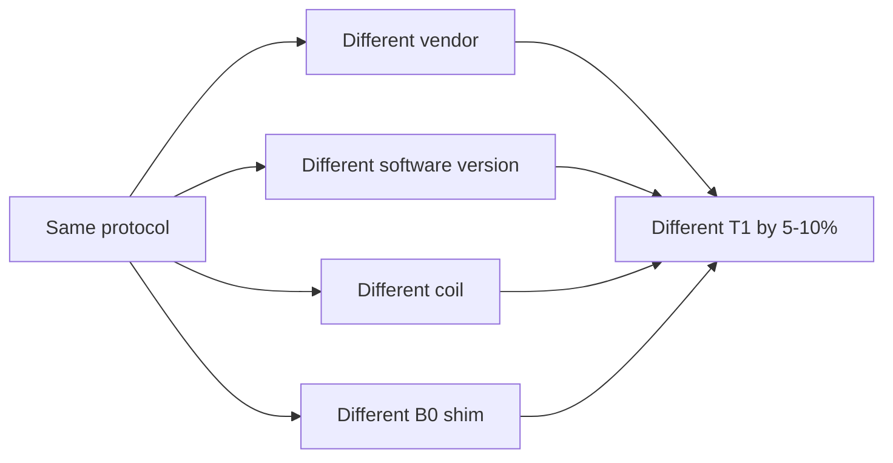

# Quantitative MRI (qMRI)

> Standard MRI gives weighted images: arbitrary units, scanner-dependent, sequence-dependent. qMRI gives physical parameters: T1, T2, T2*, MT, PD — numbers you can pool across sites and timepoints.

Course map: Why quantitative → T1 mapping (VFA, MP2RAGE, MOLLI) → T2 / T2* mapping → MT, MTsat, qMT and MPM → T1ρ → synthetic MRI → reproducibility → MR fingerprinting → software → use cases → references.

## 1. Learning objectives

- Articulate three reasons multi-site or longitudinal studies need quantitative maps.

- Compare VFA, MP2RAGE, and MOLLI for T1 mapping by accuracy, scan time, and failure mode.

- Describe MT, MTsat, and qMT in increasing order of physical specificity.

- State why "synthetic MRI" outputs are not equivalent to the original sequences they emulate.

- Identify the limits of reproducibility: scanner, vendor, coil, B1.

## 2. Why quantitative

Weighted images are products of $\rho$, $T_1$, $T_2$, sequence parameters, receive coil bias, scanner gain. Two MPRAGEs from two scanners are not directly comparable. qMRI strips the sequence dependence by fitting a model to multiple acquisitions and outputting tissue parameters with physical units (ms, %, s⁻¹).

This matters for:

- **Multi-site studies** — different scanners, same biology.

- **Longitudinal disease tracking** — subtle MS or AD changes within the noise of weighted intensity.

- **Cross-modality integration** — T1 from MRI and tracer kinetics from PET both have units.

- **Reproducibility** — the entire harmonisation literature exists because weighted images are not portable.

## 3. T1 mapping

### 3.1 Variable Flip Angle (VFA / DESPOT1)

Two or more spoiled GRE acquisitions at different flip angles $\alpha_i$. From the spoiled GRE steady-state signal:

\[
S(\alpha) = M_0\,\sin\alpha\,\frac{1 - E_1}{1 - E_1\cos\alpha},\qquad E_1 = e^{-\mathrm{TR}/T_1}.
\]

Linearise as

\[
\frac{S}{\sin\alpha} = E_1\,\frac{S}{\tan\alpha} + M_0(1 - E_1),
\]

then $T_1 = -\mathrm{TR}/\ln(\mathrm{slope})$. Fast (~5 min), but exquisitely sensitive to $B_1^+$ inhomogeneity — needs a separate $B_1$ map (AFI, Bloch–Siegert, DREAM).

### 3.2 [MP2RAGE](https://github.com/JosePMarques/MP2RAGE-related-scripts) (Marques 2010)

Two GRE blocks at different TIs after inversion. Combine as

\[
\mathrm{UNI} = \frac{\mathrm{Re}(\mathrm{GRE_{TI1}}\,\mathrm{GRE_{TI2}^*})}{|\mathrm{GRE_{TI1}}|^2 + |\mathrm{GRE_{TI2}}|^2},
\]

producing a bias-free image whose intensity is a monotonic function of $T_1$. Lookup-table inversion gives a T1 map in one ~8 min acquisition. Standard at 7T.

### 3.3 MOLLI (cardiac heritage, applied to brain)

Multiple inversion-recovery samples acquired across heartbeats — fast T1 maps with motion at the cost of bias from heart-rate and magnetisation transfer.

### 3.4 Comparison

| Method | Scan time | B1 sensitivity | T1 accuracy | Best use |
|---|---|---|---|---|
| VFA (DESPOT1) | 4–6 min | High | Moderate | Whole-brain, with B1 map |
| MP2RAGE | 6–9 min | Low (UNI) | High | 7T, research T1 maps |
| MOLLI | 1 slice / breath-hold | Medium | Medium | Fast, single-slice |
| IR-SE (reference) | 30+ min | Low | Gold standard | Phantom, calibration only |

## 4. T2 and T2* mapping

### 4.1 T2 — multi-echo spin echo (MESE)

Acquire spin-echo signals at multiple TEs:

\[
S(\mathrm{TE}) = S_0\,e^{-\mathrm{TE}/T_2}.
\]

Stimulated-echo contamination from imperfect refocusing pulses biases the fit; use an EPG (extended phase graph) model (Prasloski 2012).

### 4.2 T2* — multi-echo GRE

\[
S(\mathrm{TE}) = S_0\,e^{-\mathrm{TE}/T_2^*},\qquad \frac{1}{T_2^*} = \frac{1}{T_2} + \frac{1}{T_2'}.
\]

T2' captures static field inhomogeneity from iron, deoxyhaemoglobin, and tissue susceptibility. Closely related to SWI / QSM (see [./swi.md](./swi.md)).

## 5. MT, MTsat, qMT

Magnetisation transfer probes the macromolecular pool (myelin, proteins).

### 5.1 MT ratio (MTR)

\[
\mathrm{MTR} = 100\,\frac{S_0 - S_{\mathrm{MT}}}{S_0}\;\%.
\]

Simple, but reflects sequence parameters as much as biology.

### 5.2 MTsat (Helms 2008)

A semi-quantitative correction that compensates for T1 and B1 effects, derived from PDw, T1w, and MT-weighted FLASH acquisitions:

\[
\delta = \left(\frac{S_{\mathrm{PD}}\,\alpha}{S_{\mathrm{MT}}} - 1\right)\frac{\mathrm{TR}}{T_1} - \frac{\alpha^2}{2}.
\]

More portable than MTR; the backbone of MPM.

### 5.3 qMT

Two-pool Henkelman / Sled–Pike model fit to multi-offset MT-weighted data → free-pool $T_1$, $T_2$; macromolecular pool size $f$, exchange rate $k$. Expensive (10+ measurements), but $f$ correlates with myelin content.

### 5.4 MPM (Weiskopf 2013)

Multi-Parameter Mapping: a single ~20-min protocol of T1w, PDw, MTw multi-echo FLASH plus a B1 map yields R1, R2*, PD, and MTsat maps in subject space — standard kit for cortical microstructure / myelin proxies. The reference MPM pipeline is the [hMRI toolbox](https://hmri-group.github.io/hMRI-toolbox/) for SPM.

## 6. T1ρ

Spin-lock at frequency $\omega_1$ probes slow molecular motions (10²–10⁴ Hz). Signal:

\[
S(\mathrm{TSL}) = S_0\,e^{-\mathrm{TSL}/T_{1\rho}}.
\]

Sensitive to proteoglycan / macromolecule changes. Used in cartilage; emerging in brain (AD, MS).

## 7. Synthetic MRI (MAGiC, [SyMRI](https://syntheticmr.com/))

A single ~5 min multi-delay multi-echo acquisition fits T1, T2, PD per voxel; arbitrary weighted contrasts (T1w, T2w, FLAIR, STIR) are then synthesised by Bloch simulation.

Controversies:

- Synthetic FLAIR has known artifacts at CSF–parenchyma boundaries and from flow.

- Lesion conspicuity differs subtly from conventional FLAIR — readers must re-train.

- Quantitative maps are accurate enough for screening, not for harmonised quantitative work without site QC.

Use synthetic MRI for triage and qMRI for analysis; do not interchange.

## 8. Reproducibility — the painful part



- T1 estimates vary 5–10% between vendors at 3T, even with matched protocols ([ISMRM RB consortium](https://www.ismrm.org/study-groups/reproducible-research/)).

- VFA needs a B1 map; if it drifts, T1 drifts.

- Phantom QC every site visit — ISMRM/NIST system phantom is the closest to a standard.

- Report sequence vendor, build version, coil, and B1 method in every qMRI paper.

## 9. MR fingerprinting (brief)

MRF ([Ma 2013](https://doi.org/10.1038/nature11971)) uses pseudorandom sequence parameters and matches the resulting signal evolution against a precomputed dictionary of Bloch simulations.

- Outputs T1, T2, PD, sometimes B0/B1 from a single ~10 s/slice acquisition.

- Active area; not yet a clinical standard. Vendor implementations (GE 3D-MRF) are stabilising.

- Treat as a fast multi-parameter qMRI alternative with the same harmonisation challenges.

## 10. Software

| Tool | Coverage |
|---|---|
| **[qMRLab](https://qmrlab.org/)** (MATLAB) | T1, T2, T2*, MT, qMT, MWF, NODDI, IVIM — broad |
| **[hMRI toolbox](https://hmri-group.github.io/hMRI-toolbox/)** (SPM) | MPM pipeline (R1, R2*, PD, MTsat) |
| **[mrQ](https://github.com/mezera/mrQ)** | VFA T1 with B1 correction |
| **[MP2RAGE LUT scripts](https://github.com/JosePMarques/MP2RAGE-related-scripts)** (Marques lab) | UNI → T1 map |
| **[Pulseq](https://pulseq.github.io/)** + open MR fingerprinting | Reproducible sequences |
| **[QSMxT](https://qsmxt.github.io/QSMxT/)** | End-to-end QSM pipeline |
| **[SEPIA](https://sepia-documentation.readthedocs.io/)** | QSM toolbox covering background-field removal and dipole inversion |
| **[MRiLab](http://mrilab.sourceforge.net/)** | Numerical Bloch simulator for sequence design |

## 11. Medical / clinical relevance

**Beginner.** Quantitative MRI replaces "T1-weighted bright/dark" with actual numbers (T1, T2, MT, susceptibility) so you can compare scanners, time points, and sites.

**Routine clinical use.** qMRI is emerging — not yet routine — but two clinical workflows have crossed the deployment line. **Synthetic MRI** ([SyMRI / MAGiC](https://syntheticmr.com/)) products are FDA-cleared and deliver T1, T2, PD maps plus arbitrary synthesised weighted contrasts in ~5 min on Siemens and GE platforms, increasingly used in MS lesion follow-up, dementia work-up, and rapid paediatric brain MR. **R2\* / QSM** runs as a clinical add-on for iron-overload and movement-disorder protocols on most 3 T installations. Beyond those, qMRI is heavily used in MS clinical trials, paediatric myelination assessment, and tumour follow-up where vendor-harmonised numbers matter more than radiologist gestalt.

**Disease applications.**

| Disease | Imaging finding | Clinical value | Cross-link |
|---|---|---|---|
| Multiple sclerosis | MTR / MTsat / qMT drop in normal-appearing WM; lesion T1 / T2 elongation; iron rim on QSM in chronic active lesions | Disease activity beyond FLAIR lesion count; remyelination trials | [doi:10.1212/WNL.61.5.733](https://doi.org/10.1212/WNL.61.5.733) (Filippi 2003); [clinical/multiple-sclerosis.md](../../clinical/multiple-sclerosis.md) |
| Alzheimer's disease | Cortical T1 elongation precedes atrophy; entorhinal R1 drop in MCI | Early-stage biomarker before volume loss is detectable | [doi:10.1016/j.neuroimage.2018.04.054](https://doi.org/10.1016/j.neuroimage.2018.04.054) (Tang 2018); [clinical/alzheimers-and-dementia.md](../../clinical/alzheimers-and-dementia.md) |
| Brain tumour grading | Quantitative T1 / T2 distributions separate low- and high-grade glioma | Pre-operative grading + treatment-response monitoring | See [mrf.md](mrf.md) for the MRF version of the same biomarker |
| Iron-load disorders (haemochromatosis, NBIA) | R2* and QSM elevation in basal ganglia / liver | Quantitative iron in mg / g tissue; chelation monitoring | [doi:10.1002/jmri.20251](https://doi.org/10.1002/jmri.20251) (Haacke 2005) |
| Parkinson's disease | Substantia nigra nigrosome-1 loss on QSM ("swallow-tail sign" inversion) | Early diagnostic biomarker | [doi:10.1016/j.jns.2017.07.013](https://doi.org/10.1016/j.jns.2017.07.013) (Lehéricy 2017); [clinical/parkinsons-and-movement.md](../../clinical/parkinsons-and-movement.md) |
| Paediatric myelination | Myelin water fraction (MWF) trajectories | Quantitative developmental milestones, dysmyelination diagnosis | [doi:10.1002/mrm.21704](https://doi.org/10.1002/mrm.21704) (Deoni 2008) |
| Hepatic iron / steatosis | PDFF (fat fraction) + T2* mapping | Replaced liver biopsy for steatosis grading; iron quantification | [doi:10.1148/radiol.2511101327](https://doi.org/10.1148/radiol.2511101327) (Reeder 2011) |
| Brain age / development | Cortical R1 / R2* trajectories from MPM | Population-norm references | Callaghan 2014 |

**Research depth.** The hard problem is not the physics — the Bloch equations are settled — but **vendor harmonisation** in clinical deployment (see [Bane 2018](https://doi.org/10.1148/radiol.2018171748) for a brutally honest multi-vendor T1 phantom audit). Synthetic MRI products (SyMRI / MAGiC) have been clinically validated against conventional FLAIR / T2w ([Hagiwara 2017](https://doi.org/10.3174/ajnr.A5298)) but show systematic differences at CSF–parenchyma boundaries that radiologists must learn. **MWF as a clinical-trial endpoint** for myelin-repair therapies in MS is operational ([Mancini 2020](https://doi.org/10.1002/ana.25754) ISMRM-OAB consensus), with active trials in opicinumab, clemastine, and similar agents. **7 T qMRI** as a biomarker — laminar R1, cortical iron mapping, ultra-high-resolution MWF — is the next translational front, gated on vendor 7 T installations and pTx availability. **AI-accelerated qMRI** (single-shot multi-parameter sequences with neural reconstruction, DEEPTHRIVE, MR-STAT clinical trials, MR fingerprinting — see [mrf.md](./mrf.md)) is the most exciting near-term clinical translation. The unsolved problem at all levels is the unglamorous one: ISMRM/NIST premium phantom audits, vendor build-version tracking, and the patience to fight reproducibility losses one source at a time. Without that infrastructure, qMRI maps are pretty pictures, not biomarkers.

## 12. Pitfalls

- VFA without a B1 map: T1 errors of 10–30% in temporal lobe.

- Comparing T1 across field strengths (T1 is field-dependent) — never pool 1.5T and 3T as raw values.

- Treating MTR as quantitative across vendors — it is not. Use MTsat or qMT.

- Synthetic FLAIR for lesion counting in clinical trials — beware of the artifact pattern.

- "Calibrated" T1 maps with no phantom: trust nothing.

## 13. Worked snippet — VFA T1 in Python

```python
import numpy as np
import nibabel as nib

# Load two SPGR acquisitions and B1 map
S5  = nib.load("spgr_fa05.nii.gz").get_fdata()
S20 = nib.load("spgr_fa20.nii.gz").get_fdata()
b1  = nib.load("b1map.nii.gz").get_fdata()   # relative, ~1
TR  = 5e-3

# Nominal flip angles corrected by B1
a1 = np.deg2rad(5)  * b1
a2 = np.deg2rad(20) * b1

# Linearised DESPOT1: y = m x + c, T1 from slope
x = np.stack([S5 / np.tan(a1), S20 / np.tan(a2)], axis=-1)
y = np.stack([S5 / np.sin(a1), S20 / np.sin(a2)], axis=-1)

slope = (y[..., 1] - y[..., 0]) / (x[..., 1] - x[..., 0] + 1e-9)
T1 = -TR / np.log(np.clip(slope, 1e-6, 1 - 1e-6))
nib.save(nib.Nifti1Image(T1, nib.load("spgr_fa05.nii.gz").affine), "T1map.nii.gz")
```

Expected adult cortical T1 at 3T: 1300–1500 ms; WM 800–1000 ms; CSF >4000 ms.

## 14. External tools & resources

### General qMRI toolboxes

- [qMRLab](https://qmrlab.org/) — MATLAB/Octave umbrella for T1, T2, T2*, MT, qMT, MWF, NODDI, IVIM.
- [hMRI toolbox](https://hmri-group.github.io/hMRI-toolbox/) — SPM-based MPM pipeline (R1, R2*, PD, MTsat).
- [mrQ](https://github.com/mezera/mrQ) — VFA T1 with B1 correction.

### T1 mapping

- [MP2RAGE-related scripts (José P. Marques)](https://github.com/JosePMarques/MP2RAGE-related-scripts) — UNI → T1 lookup, background denoising, recipes.

### QSM and susceptibility

- [QSMxT](https://qsmxt.github.io/QSMxT/) — automated, containerised QSM pipeline.
- [SEPIA](https://sepia-documentation.readthedocs.io/) — modular QSM toolbox.

### Simulation and sequences

- [MRiLab](http://mrilab.sourceforge.net/) — GPU Bloch-equation simulator for qMRI sequence design.
- [Pulseq](https://pulseq.github.io/) — open vendor-neutral pulse sequence framework.

### Vendor synthetic MRI

- [SyMRI](https://syntheticmr.com/) — commercial synthetic MRI / quantification platform.

## 15. References

1. Marques JP, et al. MP2RAGE, a self bias-field corrected sequence for improved segmentation and T1-mapping at high field. *Neuroimage.* 2010;49(2):1271–1281. https://doi.org/10.1016/j.neuroimage.2010.07.024

2. Helms G, Dathe H, Kallenberg K, Dechent P. High-resolution maps of magnetization transfer with inherent correction for RF inhomogeneity and T1 relaxation obtained from 3D FLASH MRI. *Magn Reson Med.* 2008;60(6):1396–1407. https://doi.org/10.1002/mrm.21732

3. Weiskopf N, et al. Quantitative multi-parameter mapping of R1, PD, MT, and R2* at 3T: a multi-center validation. *Front Neurosci.* 2013;7:95. https://doi.org/10.3389/fnins.2013.00095

4. Deoni SCL, Rutt BK, Peters TM. Rapid combined T1 and T2 mapping using gradient recalled acquisition in the steady state. *Magn Reson Med.* 2003;49(3):515–526. https://doi.org/10.1002/mrm.10407

5. Ma D, Gulani V, Seiberlich N, et al. Magnetic resonance fingerprinting. *Nature.* 2013;495(7440):187–192. https://doi.org/10.1038/nature11971

6. Prasloski T, Mädler B, Xiang Q-S, MacKay AL, Jones C. Applications of stimulated echo correction to multi-component T2 analysis. *Magn Reson Med.* 2012;67(6):1803–1814. https://doi.org/10.1002/mrm.23157

7. Tabelow K, et al. hMRI – a toolbox for quantitative MRI in neuroscience and clinical research. *Neuroimage.* 2019;194:191–210. https://doi.org/10.1016/j.neuroimage.2019.01.029

8. Karakuzu A, et al. qMRLab: Quantitative MRI analysis, under one umbrella. *J Open Source Softw.* 2020;5(53):2343. https://doi.org/10.21105/joss.02343

## Where to next

- Foundations: [../foundations/physics.md](../foundations/physics.md) — Bloch equations behind every T1/T2 fit.

- SWI / QSM: [./swi.md](./swi.md) — quantitative susceptibility as the iron/myelin sister modality.

- MPRAGE: [./mprage.md](./mprage.md) — qualitative parent of T1 mapping.

- Analysis: [../../analysis/structural.md](../../analysis/structural.md) — segmentation pipelines that consume qMRI maps.

### Closing

If you want a number you can pool across scanners and years, you want qMRI. The price is calibration: B1 maps, phantoms, vendor diligence, and the patience to fight reproducibility losses one source at a time.
