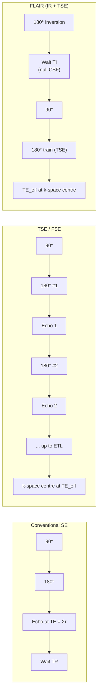

# Spin echo (SE) and fast spin echo (TSE / FSE) — full course

Course map: 90°–180° physics → TSE echo train → parameters → artifacts → PD vs T2 → analysis outputs → how outputs are used → vs FLAIR → examples → references.

## 1. Learning objectives

- Draw the timing diagram for a single-echo spin echo and state TE = 2τ (idealized) between 90° and echo.

- Explain how TSE acquires multiple k-space lines per TR and how effective TE is chosen.

- Predict T2 vs PD weighting from TR and TE combinations.

- Describe blurring, motion, and SAR limitations in long echo trains.

- Contrast TSE T2w with FLAIR ( inversion null of CSF — separate handout).

## 2. Physics — classic spin echo

### 2.1 Pulse timing

- 90° excitation tips M into the transverse plane. Static B₀ inhomogeneity causes rapid dephasing of spins.

- 180° refocusing pulse (at time τ after 90°) flips the dephasing — rephasing at TE = 2τ forms the echo.

- Refocusing cancels static ΔB₀ effects to first order → T2 weighting (not T2*) for that echo — ideal for high contrast near susceptibility interfaces vs GRE.

### 2.2 Contrast weighting

- Long TR → minimize T1 effects ( full recovery between TRs for many tissues).

- Long TE → emphasize T2 differences — CSF bright on T2w.

## 3. Fast spin echo (TSE / FSE / RARE)

### 3.1 Echo train

- After 90°, a train of 180° pulses produces multiple echoes per TR. Each echo can encode different phase-encoding lines → ETL lines per TR → scan time ↓ ~ETL (simplified).

### 3.2 Effective TE

- Echoes in the train have different TEs. The effective TE ( echo used for central k-space or weighted average — vendor-specific) determines T2 contrast.

### 3.3 SAR

- Each 180° pulse deposits RF energy. High ETL at 3 T → SAR limits may force longer TR or fewer slices per TR.

## 4. Parameter tables

Ballpark numbers at 1.5–3 T. Vendor protocols vary; treat these as starting points.

### 4.1 Contrast vs TR / TE

| Contrast | Sequence | TR (ms) | TE (ms) | ETL | Notes |
|---|---|---|---|---|---|
| T1-weighted SE | Conventional SE | 400–800 | 8–20 | n/a | Short-TR / short-TE; classic head SE pre-MPRAGE |
| PD-weighted SE | Long-TR dual-echo SE | 2000–4000 | 15–30 | 1 (or 1st echo of TSE) | First echo of dual-echo PD/T2 sequence |
| T2-weighted SE | Conventional SE | 2000–6000 | 80–120 | n/a | Replaced by TSE in nearly all neuro protocols |
| T2-weighted TSE / FSE | RARE-family | 2000–6000 | TE_eff 80–120 | 8–32 | Refocusing flip 120°–180°; scan time ↓ ∝ ETL |
| FLAIR (T2-w, CSF null) | IR-prep TSE | > TI ( 6000–10000 ) | TE_eff 80–140 | 8–24 | TI = 2000–2500 ms (1.5 T), 2400–2800 ms (3 T) |

### 4.2 Why those numbers

- **Short TR, short TE → T1w.** TR short enough that long-T1 tissues (CSF, oedema) do not fully recover → they appear dark; TE short enough that T2 differences do not dominate.
- **Long TR, short TE → PD.** TR long enough to wash out T1 differences; TE short enough to wash out T2. Residual contrast tracks proton density.
- **Long TR, long TE → T2w.** TR long for T1 neutrality; TE near the T2 of brain parenchyma (~70–100 ms) maximises GM/WM/CSF separation.
- **FLAIR TI scales with B₀.** CSF T1 lengthens with field strength (~3 s at 1.5 T, ~4.4 s at 3 T) → TI = T1·ln(2) for nulling, so TI is longer at 3 T.

## 5. ETL trade-offs and TSE blurring

ETL (echo-train length) is the number of $180°$ refocusing pulses fired per excitation in a TSE / FSE / RARE readout. Each echo encodes one phase-encode line, so scan time scales (idealised) as

$$
T_\text{scan} \approx \frac{N_\text{PE} \cdot \text{TR}}{\text{ETL}}.
$$

Going from ETL = 1 to ETL = 16 buys a ~16× speedup. There is, of course, a cost.

**The blurring story.** T2 decay continues through the echo train. By echo $n$ at time $n\cdot\text{ESP}$ (echo spacing), the signal is weighted by $\exp(-n\cdot\text{ESP}/T_2)$. Because successive echoes encode successive lines of k-space, the T2 decay envelope multiplies k-space along the phase-encode axis — equivalent to convolving the image with a broadened point-spread function. **Result: TSE images are blurred along the phase-encode direction, more severely with longer ETL and shorter tissue T2.**

Two design responses:

- **Limit ETL** for tissues with short T2 (cortex, basal ganglia at 3 T) — keep ETL ≤ 16 and ESP < 6 ms.
- **Variable-flip-angle refocusing.** Modern 3D TSE families — Siemens **SPACE**, GE **CUBE**, Philips **VISTA** — use refocusing flip angles that vary across the train (often < $180°$) and are designed to drive the magnetisation into a *pseudo-steady-state*. This flattens the signal envelope across the echo train, allowing ETL > 100 with acceptable PSF (Mugler 2014).

**Magnetisation-transfer side effect.** Non-$180°$ refocusing pulses do not fully invert — they have a partial saturation effect on bound-pool spins. Long TSE trains therefore impart an MT-like contrast that is *not* present in single-echo SE. Quantitative comparisons between SE and TSE T2w should mention this.

**CSF flow pulsation.** Pulsatile CSF dephases differently across the echo train → ghosting in periventricular regions. Cardiac gating or flow-compensation gradients on the first lobes help.

## 6. SAR scaling — 1.5 T → 3 T → 7 T

Specific absorption rate (W/kg deposited in tissue) is the binding constraint for TSE at high field. To leading order,

$$
\text{SAR} \propto B_0^2 \cdot \alpha^2 \cdot D,
$$

where $\alpha$ is the refocusing flip angle and $D$ is the RF duty cycle (∝ ETL / TR).

- **1.5 T:** $180°$ refocusing fits comfortably under IEC normal-mode SAR limits; ETL up to 32 routine.
- **3 T:** SAR is 4× that of 1.5 T at the same protocol. Vendors drop refocusing flip to $120°$–$150°$ (small T2 penalty, large SAR saving) and lengthen TR / drop slices per TR.
- **7 T:** Full $180°$ refocusing for a long ETL is *typically impossible* within SAR limits. Standard practice:
  - **Hyperecho trains** — palindromic flip-angle schedules that recover full signal at the train centre while reducing total RF power.
  - **Variable-flip-angle SPACE / CUBE** — flips often dip to $30°$–$60°$ mid-train.
  - **Parallel transmit (pTx)** — independent control of multiple Tx channels for B1 shimming and SAR redistribution (still research-grade at most sites).

Always check the *local* SAR (10 g averaging) reported by the scanner, not just whole-body SAR — pTx 7 T protocols can pass global limits while exceeding local hotspots.

## 7. Effective TE in TSE

In single-echo SE the echo time is unambiguous: TE = $2\tau$. In TSE there are ETL echoes per excitation, each with its own TE. Image contrast tracks the echo that fills **central k-space** because central k-space carries low-frequency / contrast information.

$$
\text{TE}_\text{eff} = \text{TE of the echo placed at k-space centre.}
$$

The vendor controls this through **k-space reordering**:

- **Linear reordering.** Echoes 1, 2, …, ETL fill k_y from $-k_\text{max}$ to $+k_\text{max}$. Centre echo ≈ ETL/2 → $\text{TE}_\text{eff} \approx (\text{ETL}/2) \cdot \text{ESP}$. Default for many T2 protocols.
- **Centric reordering.** First echo (highest signal) fills k_y = 0; subsequent echoes fill outward. $\text{TE}_\text{eff} \approx \text{ESP}$. Used for short-TE PD / T1 contrasts and time-resolved MRA.
- **Reverse-centric.** Last echo fills k_y = 0 → $\text{TE}_\text{eff} \approx \text{ETL} \cdot \text{ESP}$. Maximises T2 weighting in a long train.

**Why this matters in practice.** Two TSE protocols with identical "TE = 100 ms" labels can have very different contrast if their reordering differs — one places that 100 ms echo at k-space centre (true T2 contrast), the other averages it with shorter echoes. Always pair $\text{TE}_\text{eff}$ with reordering and ETL when reporting.

### 7.2 Driven-equilibrium FSE (DE-FSE / DRIVE / FRFSE)

After a long $T_2$-weighted echo train, the transverse magnetisation has decayed substantially and the residual longitudinal recovery still takes ~$5\cdot T_1$ — wasted scan time. Driven-equilibrium adds a *flip-back* pulse at the end of the train (typically $-90°$ after a $180°$) that returns transverse magnetisation along $+z$, accelerating effective $T_1$ recovery without extending TR.

- Net effect: shorter TR at the same contrast, or higher SNR at fixed TR. Especially useful for $T_2$-weighted 3D TSE of small structures (cranial nerves, inner-ear cisternae).
- Vendor names: GE **DRIVE / FRFSE**, Siemens **RESTORE**, Philips **DRIVE**.
- Trade: extra RF pulse → small SAR increment; sensitive to B1 inhomogeneity at 3 T / 7 T.

### 7.3 Half-Fourier single-shot TSE (HASTE / SS-FSE / single-shot TSE)

Single-shot acquisition of the entire phase-encode plane within one excitation, combined with half-Fourier reconstruction (acquire ~5/8 of k-space, synthesise the rest). Echo trains of 100–200 are typical; scan time per slice ≈ 1 s.

- Used for foetal brain imaging, abdominal $T_2$w in apnoea, motion-prone paediatric or sedated subjects.
- The long ETL forces severe TSE blurring along the phase-encode axis — acceptable when motion is the dominant artefact.
- Half-Fourier reduces SNR by $\sqrt{2}$ and tolerates only mild phase errors. Vendor: Siemens **HASTE**, GE **SSFSE**, Philips **single-shot TSE**.

### 7.4 T2-FLAIR vs T1-FLAIR — why long ETL is OK in one and not the other

[FLAIR](./flair.md) prepends a $180°$ inversion to a TSE readout to null CSF. The two flavours differ in what the readout is weighted for.

- **T2-FLAIR.** Long TR (≥ 9 s at 3 T), long $\text{TE}_\text{eff}$ (~80–140 ms). Goal: high T2 weighting after CSF null. The signal trajectory is dominated by T2 differences at the centre of k-space, which is filled by a *late* echo in the train. Lengthening ETL up to ~24 trades modest extra blurring for a major scan-time saving — accepted across vendors.
- **T1-FLAIR.** Short $\text{TE}_\text{eff}$ (~10–20 ms) following a shorter TI for T1 contrast. Central k-space is filled by an *early* echo. A long ETL would smear T2 weighting into the early echo and break the T1 contrast you came for. T1-FLAIR therefore typically runs at ETL ≤ 8.

Rule of thumb: long ETL is forgiving when contrast lives at long TE, hostile when contrast lives at short TE.

### 7.1 Pulse-train comparison

## 8. Artifacts

- Motion between echoes in train → ghosting / inconsistent phase.

- TSE blurring: point spread broadening along phase encode ( vendor models differ).

- CSF flow pulsation → artifact in periventricular regions.

## 9. PD-weighted imaging

- Long TR + short TE ( first echo emphasis in TSE) → proton-density-like contrast — mix of PD and T2 depending on sequence design.

## 10. Analysis outputs, derivatives, and how they are used

### Mapping questions to outputs

*(Structural segmentation outputs overlap heavily with MP-RAGE — T2 often combined as secondary contrast for lesions.)*

## 11. Worked examples

### Example A — Echo time

- τ = 6 ms → first echo at TE = 12 ms ( 2τ ) in ideal single-echo SE.

### Example B — Scan time scaling

- Matrix 256 phase steps, ETL = 1 → 256 TRs per slice ( single-echo). ETL = 16 → ~16× fewer TRs per slice ( idealized).

## 12. Pitfalls

- Treating TSE T2w as identical to single-echo T2w — contrast may differ due to refocusing train efficiency and magnetization pathway.

- Confusing with FLAIR — FLAIR uses inversion null of CSF ( FLAIR handout).

## 12.5 Medical / clinical relevance

**Beginner.** Conventional spin-echo (and its turbo / fast variants) is the workhorse for T2-weighted imaging — the bread and butter of brain MRI before FLAIR and DWI ever fire.

**Routine clinical use.**

- T2-weighted brain imaging for tumours, oedema, gliosis, white-matter disease (almost always TSE / FSE today).
- Spine: sagittal T2-FSE for cord compression, MS plaques, disc pathology, cauda equina.
- Musculoskeletal: T2 / PD-FSE for cartilage, menisci, ligaments, marrow oedema.
- Abdominal / pelvic: T2-FSE for liver, kidney, prostate, uterus; HASTE / single-shot for breath-hold protocols.
- Heavily T2-weighted CISS / FIESTA / DRIVE for cisternal anatomy and cranial-nerve imaging.

**Disease applications.**

| Disease | Imaging finding | Clinical value | Cross-link |
|---|---|---|---|
| Arachnoid / dermoid / epidermoid cysts | Bright T2 on TSE; restricted vs free diffusion on DWI separates them | Surgical planning, differential from solid tumour | Sener 1992 |
| Hydrocephalus / aqueductal stenosis | Heavily T2-weighted CISS / FIESTA shows membranes and flow voids | Decide ventriculostomy vs shunt | [doi:10.3174/ajnr.A2197](https://doi.org/10.3174/ajnr.A2197) (Algin 2010) |
| Trigeminal neuralgia, hemifacial spasm | 3D T2 CISS / FIESTA / DRIVE shows neurovascular conflict | Microvascular-decompression planning | [doi:10.1148/radiol.2520091638](https://doi.org/10.1148/radiol.2520091638) (Borges 2010) |
| Spinal-cord MS plaques | Sagittal T2-FSE (PD/T2 dual echo) | Disease burden + activity | [doi:10.1016/S1474-4422(03)00466-9](https://doi.org/10.1016/S1474-4422(03)00466-9) (Lycklama 2003); [clinical/multiple-sclerosis.md](../../clinical/multiple-sclerosis.md) |
| Pituitary microadenomas | T2-FSE + dynamic contrast — adenomas often T2-hypointense / hyperintense vs normal gland | Cushing's / acromegaly localisation | Bonneville 2005 |
| Inner-ear / cerebellopontine-angle pathology | 3D T2 CISS for cochlear nerve, vestibular schwannoma | Cochlear-implant eligibility, tumour surveillance | Standard otology practice |

**Research depth.** Modern clinical practice is dominated not by 2D-FSE but by 3D isotropic variable-flip-angle TSE — Siemens **SPACE**, GE **CUBE**, Philips **VISTA** (Mugler 2014, [doi:10.1002/jmri.24542](https://doi.org/10.1002/jmri.24542)) — which delivers a single 4–6 min isotropic volume reformat-able in any plane and is rapidly displacing stacks of orthogonal 2D-FSE for brain, spine, and MSK. The trade is the magnetisation-transfer-like saturation discussed in § 5, which makes 3D-TSE T2w *not numerically equivalent* to single-echo SE in quantitative comparisons. Multi-echo SE remains the reference for T2 mapping — see [./qmri.md](./qmri.md) — and clinical T2-mapping (rather than T2-weighted reading) is reaching MS lesion characterisation, cardiac fibrosis, and prostate cancer protocols. MT-prepared T2 sequences for direct myelin assessment are an active translational area in MS imaging. HASTE / SSFSE single-shot TSE underpins foetal brain MRI and uncooperative-paediatric protocols where motion would destroy any multi-shot acquisition. Across all flavours, the historical reliability of spin-echo refocusing against $B_0$ inhomogeneity is what keeps SE-family contrast credible at 1.5 T and 3 T even as everything else in the protocol modernises.

## 13. Credible peer-reviewed papers

- Hennig J, et al. RARE imaging: a fast imaging method for clinical MR. *Magn Reson Med.* 1986;3(6):823–833. https://doi.org/10.1002/mrm.1910030602

- Melki PS, et al. Comparing the FAISE and the RARE sequences. *J Magn Reson Imaging.* 1991;1(2):163–168. https://doi.org/10.1002/jmri.1880010209

- Mugler JP 3rd. Optimized three-dimensional fast-spin-echo MRI. *J Magn Reson Imaging.* 2014;39(4):745–767. https://doi.org/10.1002/jmri.24542

- Collins CM, Smith MB. Signal-to-noise ratio and absorbed power as functions of main magnetic field strength, and definition of "90°" RF pulse for the head in the birdcage coil. *Magn Reson Med.* 2001;45(4):684–691. https://doi.org/10.1002/mrm.1185

## 14. Credible online resources

- [mriquestions — Spin echo](https://mriquestions.com/spin-echo.html) — pulse-timing diagrams, refocusing-pulse intuition.
- [mriquestions — RARE / TSE](https://mriquestions.com/fsetse-parameters.html) — ETL, effective TE, k-space ordering.
- [mriquestions — SAR](https://mriquestions.com/sar-q--a.html) — quantitative scaling with $B_0$ and flip angle.
- [ISMRM educational materials](https://www.ismrm.org/online-education-program/) — annual meeting lecture archives on TSE, SPACE, high-field SAR.
- [Siemens MAGNETOM Flash — SPACE application guide](https://www.magnetomworld.siemens-healthineers.com/clinical-corner/application-tips) — variable-flip 3D TSE protocols.
- [GE healthcare CUBE white papers](https://www.gehealthcare.com/products/magnetic-resonance-imaging) — product T2 / FLAIR CUBE.
- [Philips VISTA technical descriptions](https://www.philips.com/healthcare/resources/landing/the-next-mr-wave) — 3D TSE family.

## 15. References (sources used to create this content)

- [mriquestions.com — spin echo and TSE](https://mriquestions.com/spin-echo.html)
- Bushberg JT, et al. *The Essential Physics of Medical Imaging* — spin echo timing.
- Vendor TSE product manuals — ETL, effective TE, SAR models.
- [ISMRM educational lectures](https://www.ismrm.org/online-education-program/) — RARE, variable-flip-angle 3D TSE, SAR at 7 T.

### Closing

For CSF-suppressed T2-like contrast, use FLAIR ( inversion recovery + TSE readout) — FLAIR handout.