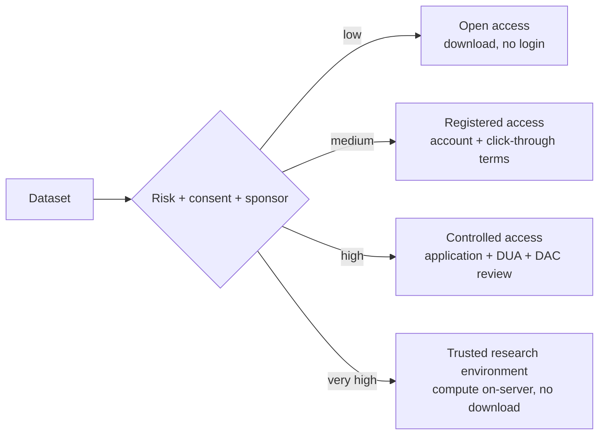

# Data sharing and data-use agreements

> NIH 2023 policy, FAIR, OpenNeuro and friends, tiers of access, the DUA clauses that actually matter, and a working recipe for releasing a BIDS dataset.

The default for neuroimaging data is now *share*, not *hoard*. NIH's 2023 Data Management and Sharing Policy made it a grant condition; funders elsewhere are following. But "sharing" covers a spectrum from fully open downloads to controlled-access repositories with multi-page DUAs. This page is the working map.

The case for sharing is not philosophical. Reproducibility is one part of it; equity and meta-analytic power are the others. The case against is narrower than people think — usually a specific legal, IRB, or sponsor constraint that's worth naming explicitly rather than treating as a vague "we can't share that".

## Why share

- **Reproducibility.** Without the data, claims aren't checkable.
- **Meta-analysis and pooled cohorts.** ENIGMA-style efforts only exist because hundreds of teams share.
- **Equity.** Single-institution datasets reflect single-institution demographics. Pooling broadens validity.
- **Funder mandate.** [NIH 2023 Data Management and Sharing Policy](https://grants.nih.gov/grants/guide/notice-files/NOT-OD-21-013.html) requires a DMS plan in every application; non-compliance is a grant-level issue.
- **Re-use credit.** Cited dataset releases now carry weight in promotion and grant review.

The **FAIR principles** ([Wilkinson 2016](https://doi.org/10.1038/sdata.2016.18)) frame the standards:

- **Findable** — persistent identifier, indexed metadata.
- **Accessible** — retrievable by the identifier, with an authentication mechanism if needed.
- **Interoperable** — uses standard formats (BIDS, DICOM, NIfTI, JSON).
- **Reusable** — clear license, provenance, and rich metadata.

BIDS ([Gorgolewski 2016](https://doi.org/10.1038/sdata.2016.44)) is the operational substrate for FAIR neuroimaging. See the handbook's [BIDS section](../bids/index.md).

## Repositories

| Repository | Modality / scope | Access tier | Notes |
|---|---|---|---|
| **[OpenNeuro](https://openneuro.org/)** | MRI, EEG, MEG, iEEG | Open by default; restricted available | The default for BIDS-formatted research data. Free, versioned. |
| **[NDA](https://nda.nih.gov/)** (NIMH Data Archive) | Mental-health imaging + genetics + behavioural | Controlled (DUC + DAA) | Required for NIMH-funded studies. Includes ABCD, NDAR. |
| **[ABCD](https://abcdstudy.org/)** | Longitudinal pediatric | Controlled via NDA | Adolescent Brain Cognitive Development. ~12k subjects, 10-year follow-up. |
| **[UK Biobank](https://www.ukbiobank.ac.uk/)** | Imaging + genetics + EHR + lifestyle | Controlled (application-based) | ~500k participants, 100k+ with imaging. |
| **[ADNI](https://adni.loni.usc.edu/)** | Alzheimer's longitudinal multimodal | Controlled (DUA) | Hosted at IDA / LONI. |
| **[IDA / LONI](https://ida.loni.usc.edu/)** | Multiple consortia | Mixed | Hosts ADNI, PPMI, AIBL, others. |
| **[Zenodo](https://zenodo.org/)** | Generic research data with DOI | Open or restricted | Useful for small auxiliary datasets, code, models. CERN-backed, free DOI. |
| **[XNAT Central](https://central.xnat.org/)** | DICOM-native | Varies | Project-based access. |
| **[INDI](http://fcon_1000.projects.nitrc.org/)** | Functional connectome cohorts | Open | The original 1000-functional-connectomes project; ABIDE, ADHD-200. |

Defaults that work for most projects:

- BIDS-formatted research data → **OpenNeuro**.
- NIMH-funded → **NDA** (you don't have a choice).
- Code → **GitHub** with a Zenodo DOI on release.
- Models → **Hugging Face**, plus a model card (see [AI → regulatory](../ai/regulatory.md#model-cards)).

## Tiers of access

| Tier | Example | What the user does |
|---|---|---|
| **Open** | Most OpenNeuro datasets | Click download |
| **Registered** | Some OpenNeuro datasets, INDI | Create an account, agree to terms |
| **Controlled** | NDA, ADNI, UK Biobank | Submit an application; named PI; institutional sign-off; DUA |
| **TRE** | UK Biobank Research Analysis Platform | Run code on the platform; no raw data leaves |

Match the tier to the data. A dataset with explicit broad consent and Safe-Harbor de-identification can be open. A pediatric cohort with rare-disease subjects probably can't.

## Data Use Agreements

A DUA is the contract between the data provider and the data recipient. The clauses that matter:

### Parties

Who is bound? The recipient institution, *not* the individual researcher. Institutional signatures are required because the institution is the legal entity that can enforce data destruction, audit access, and bear liability.

### Permitted uses

What may the recipient do? Typical language: "non-commercial research described in the approved application". Watch for:

- **Single-study restriction** vs **general research** scope.
- **Algorithm-development** carve-outs — some DUAs allow training but prohibit publishing the model weights.
- **Clinical use** — almost always prohibited under research DUAs.

### Prohibitions

What's explicitly banned?

- **Re-identification attempts** (always).
- **Redistribution** to third parties (always).
- **Combining with other datasets** without permission (often).
- **Commercial use** (often, but not universal).
- **Patenting** based on the dataset (varies).

### Security obligations

How will the recipient protect the data? References to institutional policies are common; explicit clauses on encryption, access control, and audit logging are increasingly required (see [data engineering → security](../data-engineering/advanced/security.md)).

### Publications and acknowledgement

How is the data provider credited? Usually:

- Acknowledgement in any publication.
- Citation of the dataset paper / DOI.
- Sometimes a courtesy-review window before submission.
- Authorship is usually *not* automatic for secondary use — see the CRediT section below.

### Term, destruction, audit

- **Term** — the data is licensed for a fixed period or until the project ends.
- **Destruction** — at the end of the term, the recipient certifies destruction or returns data.
- **Audit right** — the provider may audit compliance.
- **Breach notification** — recipient must notify within a defined window (often 24-72 hours).

### Indemnification, warranty

The provider almost always disclaims warranty ("data is provided as-is"); the recipient indemnifies the provider for misuse. Don't sign a DUA you haven't read with someone in your institution's contracts office.

### Sample clauses worth reading

A short list of clauses that you will see and should understand:

- **"Recipient shall not attempt to re-identify any individual..."** — the no-re-id clause. Standard. Sign it.
- **"Recipient shall not transfer the Data to any third party..."** — the no-onward-transfer clause. Plan your collaboration model around it.
- **"Recipient shall destroy the Data within 30 days of project completion..."** — the destruction clause. Affects your archival strategy.
- **"All publications shall acknowledge the Provider and cite [reference]."** — the acknowledgement clause. Tracking this matters for grant renewals.
- **"Recipient warrants that all use shall comply with applicable law including HIPAA, GDPR..."** — the compliance clause. Means your IRB / DPO must approve.
- **"Provider reserves the right to terminate this Agreement on 30 days' notice."** — the termination clause. Have a contingency plan if your DUA is pulled mid-study.

## Authorship and credit for secondary use

The classic over-reach: a primary-cohort PI demands authorship on every paper that uses their data. The modern norm: acknowledgement and citation, with authorship reserved for substantive intellectual contribution to the paper itself.

The **CRediT taxonomy** ([CASRAI](https://credit.niso.org/)) defines 14 contributor roles — conceptualisation, data curation, formal analysis, funding acquisition, etc. Use it. It separates "I collected the data" (Data curation, Resources) from "I designed the analysis" (Conceptualisation, Methodology) and makes shared-credit conversations crisper.

NDA, UK Biobank, ADNI, and most consortia publish authorship policies. Read them before you start writing.

## When you don't share

Legitimate reasons:

- **Sponsor restriction** — industry-funded studies often retain rights.
- **IRB / consent restriction** — original consent didn't cover sharing, and re-consent is impractical.
- **Legal restriction** — jurisdiction prohibits export (some EU member-states are strict).
- **Identifiability** — small-n or rare-disease cohorts where de-identification is insufficient.
- **Pre-publication embargo** — a defined window, not indefinite.

For NIH grants under the 2023 policy, *any* of these must be **explicit** in your DMS plan, with an explanation. "We don't want to" is not an acceptable reason; the policy expects positive justification.

For a true non-share case, consider the federated alternative (see the [FL chapter](federated-and-privacy-preserving.md)) or release of derivatives only (group-level statistics, model weights, summary maps).

## Practical recipe: release a BIDS dataset on OpenNeuro

The minimum viable release:

1. **BIDS-validate.** Run [`bids-validator`](https://github.com/bids-standard/bids-validator) until it's clean. Warnings are fine; errors are not.
2. **Deface.** Run `mri_reface` or `pydeface` per the [privacy chapter](privacy-and-hipaa-gdpr.md). Spot-check ≥5 subjects.
3. **Strip identifiers.** Confirm `dcm2niix -ba y` removed PHI from JSON sidecars. Inspect any `participants.tsv`. No MRNs, no DOBs (use ages), no scan dates (use offsets from a study reference date).
4. **Metadata.**
   - `dataset_description.json` — name, BIDSVersion, authors, funding, license.
   - `README` — purpose, cohort, acquisition summary, known issues.
   - `CHANGES` — version log.
   - `participants.json` — describe each column in `participants.tsv`.
5. **License.** Choose one. **CC0** is the OpenNeuro default and is what most consumers expect. CC-BY adds an attribution requirement. Custom licenses make re-use harder; avoid unless necessary.
6. **Code.** Release pre-processing and analysis code on GitHub with a Zenodo DOI on the release tag.
7. **Upload.** OpenNeuro CLI or web UI. Versioned; the first version is permanent.
8. **Cite.** Mint a DOI via OpenNeuro. Reference it in your publication.

Validation tools that catch most release errors before reviewers do:

- **bids-validator** — schema compliance.
- **PyBIDS** — programmatic checks, especially on metadata coverage.
- **MRIQC** — image-quality metrics in a publishable table.

## The minimal pre-release checklist

- [ ] IRB approval for release (or determination that re-consent / waiver applies).
- [ ] Cohort consent permits sharing in the chosen tier.
- [ ] Safe Harbor / Expert Determination pass complete.
- [ ] Defacing applied; downstream-analysis bias characterised.
- [ ] BIDS-validator clean.
- [ ] DICOM private tags and burnt-in pixel data reviewed.
- [ ] Subject IDs random; key map kept separately.
- [ ] License chosen; `dataset_description.json` complete.
- [ ] README and CHANGES committed.
- [ ] Companion code released with DOI.
- [ ] DOI minted; dataset paper cited.
- [ ] DMS plan updated to reference the released DOI.

If you can tick all 12 you've shipped a credible dataset release.

## Where to next

- [IRB and research ethics](irb-and-ethics.md) — the consent and approval layer behind any sharing decision.
- [Privacy: HIPAA, GDPR, de-identification](privacy-and-hipaa-gdpr.md) — the regulatory layer that determines what *can* be shared.
- [Federated and privacy-preserving ML](federated-and-privacy-preserving.md) — when sharing isn't an option.
- [BIDS](../bids/index.md) — the data standard you should be releasing in.
- [AI/ML → Regulatory](../ai/regulatory.md) — for releasing trained models alongside datasets.

## References

1. **NIH.** Final NIH Policy for Data Management and Sharing. NOT-OD-21-013. Effective January 25, 2023. [https://grants.nih.gov/grants/guide/notice-files/NOT-OD-21-013.html](https://grants.nih.gov/grants/guide/notice-files/NOT-OD-21-013.html)
2. **Wilkinson MD, Dumontier M, Aalbersberg IJ, et al.** The FAIR Guiding Principles for scientific data management and stewardship. *Sci Data.* 2016;3:160018. [doi:10.1038/sdata.2016.18](https://doi.org/10.1038/sdata.2016.18)
3. **Gorgolewski KJ, Auer T, Calhoun VD, et al.** The brain imaging data structure (BIDS), a format for organizing and describing outputs of neuroimaging experiments. *Sci Data.* 2016;3:160044. [doi:10.1038/sdata.2016.44](https://doi.org/10.1038/sdata.2016.44)
4. **Markiewicz CJ, Gorgolewski KJ, Feingold F, et al.** The OpenNeuro resource for sharing of neuroscience data. *eLife.* 2021;10:e71774. [doi:10.7554/eLife.71774](https://doi.org/10.7554/eLife.71774)
5. **Bycroft C, Freeman C, Petkova D, et al.** The UK Biobank resource with deep phenotyping and genomic data. *Nature.* 2018;562(7726):203-209. [doi:10.1038/s41586-018-0579-z](https://doi.org/10.1038/s41586-018-0579-z)
6. **CASRAI / NISO.** CRediT — Contributor Roles Taxonomy. [https://credit.niso.org/](https://credit.niso.org/)
7. **Poldrack RA, Gorgolewski KJ.** Making big data open: data sharing in neuroimaging. *Nat Neurosci.* 2014;17(11):1510-1517. [doi:10.1038/nn.3818](https://doi.org/10.1038/nn.3818)
