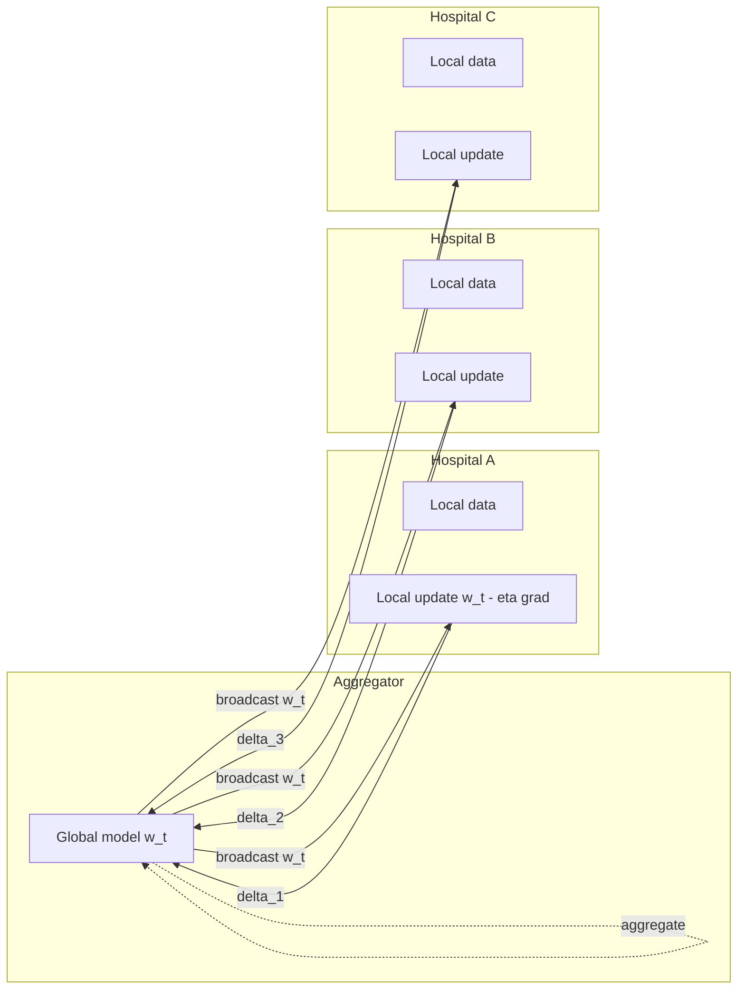
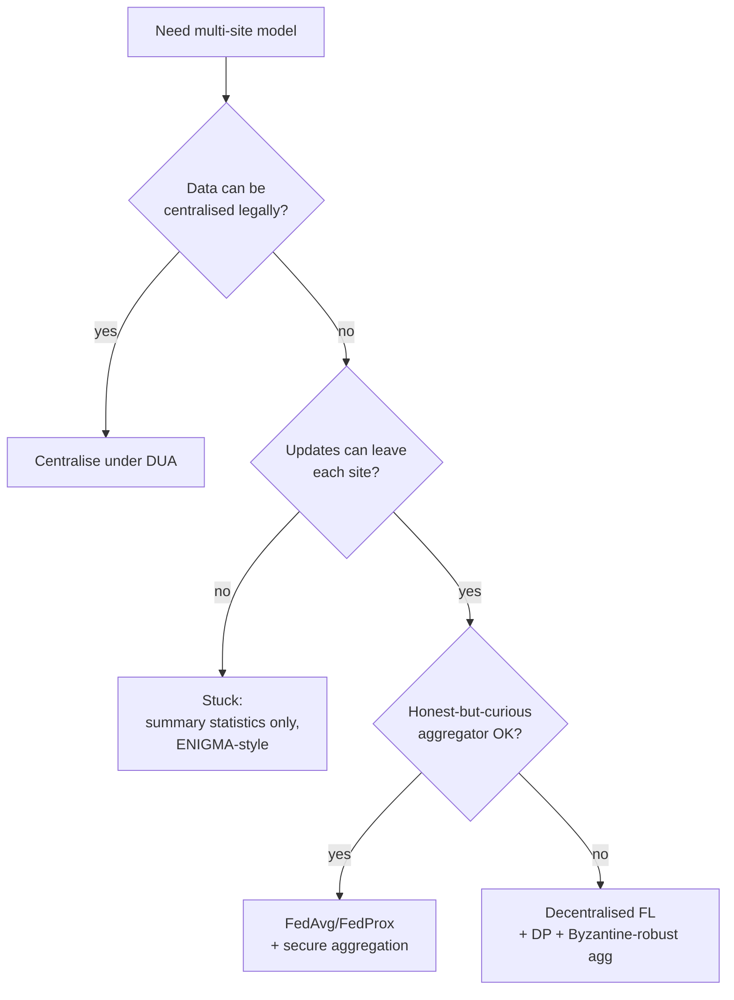

# Federated learning and privacy-preserving ML

> When the data can't move, move the model. FedAvg, FedProx, secure aggregation, DP-SGD, NVFlare / Flower / OpenFL, COINSTAC and ENIGMA. Also: when federated is overkill and a DUA + central training quietly wins.

For a single in-house dataset, train centrally. The interesting question is what to do when (a) you need data from multiple hospitals, (b) the data can't legally cross site boundaries, and (c) you still want a single model that benefits from all of it. That is the **federated learning (FL)** problem.

This page is the working set for neuroimaging FL: architectures, the heterogeneity that breaks naïve FedAvg, secure aggregation, differential privacy in FL, the frameworks you'll actually use, and the threat models you should defend against.

## Why federated for medical imaging

The classical pattern: train at one site, validate at others, ship a model. The federated pattern: train *across* sites without raw data ever leaving any of them.

Federated is attractive when:

- **Legal blockers.** EU and US institutions can't share patient-level data without DUAs, BAAs, transfer mechanisms, or all three.
- **Sample size dominated by site count.** You need 20 hospitals, not 2,000 patients per hospital.
- **Population diversity.** A model trained across sites is more robust to site / scanner / demographic shift.
- **Long-tail diseases.** No single hospital has enough rare-disease cases.

Federated is overkill when:

- The data is already centrally pooled with a legal agreement in place.
- Your collaborators are inside the same institution and BAA.
- The hospitals are homogeneous enough that one of them is representative.

The honest comparison: **central training under a well-drafted DUA almost always beats federated, when it's available.** FL is what you do when the lawyers say no.

## Architectures

### Client-server: FedAvg

The canonical algorithm ([McMahan 2017](https://arxiv.org/abs/1602.05629)):

1. Server initialises $w_0$.
2. Each round $t$: server samples a subset of clients, broadcasts $w_t$.
3. Each client $k$ runs $E$ epochs of local SGD on its data, returns $\Delta_k$ or $w_{t+1}^k$.
4. Server aggregates: $w_{t+1} = \sum_k \frac{n_k}{n} w_{t+1}^k$ (weighted by client sample count).

FedAvg works well on IID data. The variance comes from non-IID.

### Decentralised / peer-to-peer

No central aggregator. Clients exchange updates through a gossip protocol or a fixed communication graph. Removes the single point of trust but is operationally harder and has weaker convergence guarantees. Less common in clinical FL; used in cross-silo collaborations where no party is acceptable as the aggregator.

### Split learning

Each client computes the first $L$ layers; activations are sent to the server; server completes the forward and backward pass. Lower client compute, more communication, and a higher leakage surface (activations carry information). Hybrid SplitFed combines split learning with FedAvg-style aggregation. See [Vepakomma 2018](https://arxiv.org/abs/1812.00564).

## Heterogeneity — the real problem

Sites differ in scanner vendor, field strength, sequence parameters, population, ground-truth labelling protocol, and prevalence. Their local optima diverge. FedAvg drifts away from any global optimum and convergence stalls.

Three families of fixes:

### FedProx ([Li 2020](https://arxiv.org/abs/1812.06127))

Adds a proximal term to each client's local objective:

$$
\min_w F_k(w) + \frac{\mu}{2} \|w - w_t\|^2
$$

Penalises local divergence from the broadcast global model. A drop-in replacement for FedAvg; usually a small improvement on non-IID data with one extra hyper-parameter ($\mu$).

### SCAFFOLD ([Karimireddy 2020](https://arxiv.org/abs/1910.06378))

Maintains per-client and server control variates that correct for client drift. Variance reduction in the FL setting. Stronger non-IID guarantees than FedProx at the cost of double the communication (the control variates are sent alongside the model).

### Personalised FL

Sometimes you don't want one global model — you want a global backbone with site-specific heads. FedRep, Ditto, and pFedMe ([T Dinh 2020](https://arxiv.org/abs/2006.08848)) optimise for per-client performance instead of a single shared model. Useful when site-level distribution shift is large and you accept that each site runs its own personalised model.

### Pre-FL harmonisation

The neuroimaging-specific intervention is to **harmonise inputs across sites before training**: intensity normalisation, ComBat on features, or unsupervised domain adaptation. Often more impactful than the choice of FL aggregation rule. The [evaluation chapter](../ai/evaluation.md) covers harmonisation; in FL it's a per-client preprocessing step.

## Secure aggregation

Sending raw gradients to the aggregator is **not** privacy-preserving — gradients can leak training data. Membership-inference attacks ([Shokri 2017](https://doi.org/10.1109/SP.2017.41)) recover whether a specific subject was in training. Gradient-inversion attacks ([Geiping 2020](https://arxiv.org/abs/2003.14053)) recover the actual training image from a single gradient.

**Secure aggregation** ([Bonawitz 2017](https://doi.org/10.1145/3133956.3133982)) is a cryptographic protocol where the aggregator learns the *sum* of client updates but not any individual one. Pairwise additive masks cancel out in the sum; if a client drops out, a secret-sharing scheme reconstructs only the missing mask, not the client's update.

What it does:

- Hides individual client updates from the aggregator.
- Tolerates a configurable number of dropouts.

What it does *not* do:

- Defend against a malicious server. A server that *injects* updates can still attack.
- Provide differential-privacy guarantees on the aggregate output.
- Defend against attacks on the aggregated model itself (membership inference on the released model).

Use secure aggregation when the aggregator is honest-but-curious. Combine with DP-SGD when you also need output privacy.

## Differential privacy in FL

The standard approach is **DP-SGD** ([Abadi 2016](https://doi.org/10.1145/2976749.2978318)) run client-side:

1. Clip per-sample gradients to norm $C$.
2. Add Gaussian noise calibrated to $C$ and the target $(\epsilon, \delta)$.
3. Aggregate.

Two flavours:

- **Local DP** — noise added at each client. Strong per-client guarantee; large utility cost.
- **Central DP** — noise added at the server post-aggregation. Weaker trust model (clients trust the server) but better utility for a given $\epsilon$.

Practical realities in imaging:

- Reaching $\epsilon < 1$ at clinically-useful accuracy is still mostly a research problem on 3D medical volumes.
- Most published clinical FL studies report no DP at all, or DP at $\epsilon = 8$ or higher — weak by privacy-research standards.
- Combine DP with secure aggregation: the server doesn't see individual updates *and* the aggregate is DP.

The honest summary: differential privacy is the gold standard for what privacy *means*; it's not yet a settled practice for what privacy *delivers* in medical-imaging FL.

## Frameworks

| Framework | Origin | Strengths | Where it fits |
|---|---|---|---|
| **NVFlare** ([NVIDIA](https://nvflare.readthedocs.io/)) | NVIDIA | Production-grade. Tight integration with MONAI. Used by clinical consortia. | First choice for clinical-imaging FL on PyTorch / MONAI |
| **MONAI FL** ([MONAI](https://monai.io/)) | Project MONAI | MONAI-native; pairs with MONAI Bundle for reproducible workflows | When your code is already MONAI |
| **Flower** ([flower.ai](https://flower.ai/)) | Independent | Lightweight, framework-agnostic, easy to prototype | Cross-stack experiments; teaching |
| **PySyft** ([OpenMined](https://github.com/OpenMined/PySyft)) | OpenMined | DP + FL + SMPC; research-leaning | Privacy-tech research |
| **OpenFL** ([Intel / LF AI](https://openfl.readthedocs.io/)) | Intel + Linux Foundation | Used in the federated COVID-19 mortality study | Cross-institution production with audit trail |
| **FATE** ([WeBank](https://fate.fedai.org/)) | WeBank | Strong on tabular / financial; heavyweight | Less common in imaging |

For neuroimaging today, **NVFlare + MONAI** or **MONAI FL** are the defaults. Flower is the right teaching choice. PySyft is the right research choice when DP and SMPC are part of the experiment.

## Real consortia

Three neuroimaging-relevant federated efforts you should know:

- **COINSTAC** ([Plis 2016](https://doi.org/10.3389/fnins.2016.00365)) — Collaborative Informatics and Neuroimaging Suite Toolkit for Anonymous Computation. The neuroimaging-first FL platform. Implements federated GLM, ICA, regression, and PCA. The federated counterpart to many ENIGMA-style mega-analyses.
- **ABIDE / ABIDE II** — open-access mega-cohort for autism imaging. Not federated in the strict sense (data is shared), but the multi-site protocol and harmonisation literature ([Di Martino 2014](https://doi.org/10.1038/mp.2013.78)) is the template.
- **ENIGMA** ([Thompson 2014](https://doi.org/10.1007/s11682-013-9269-5)) — runs a mix of mega-analysis and federated meta-analysis. ENIGMA federated workflows ship a script to each site, return summary statistics, and pool centrally. ENIGMA's working pattern (script-based, light-touch FL) is the model many clinical consortia copy.

A landmark cross-domain federated study: the **federated COVID-19 mortality prediction** by Dayan et al. ([2021](https://doi.org/10.1038/s41591-021-01506-3)) across 20 hospitals, run on NVFlare. Required reading for anyone building a multi-hospital FL programme.

## Threat models

What are you defending against? Be explicit, because the defences differ.

| Threat | Description | Defence |
|---|---|---|
| **Honest-but-curious server** | Aggregator follows the protocol but tries to learn from updates | Secure aggregation |
| **Malicious server** | Aggregator may deviate, inject, equivocate | Byzantine-robust aggregation (Krum, trimmed mean); auditable protocol |
| **Honest-but-curious client** | A participating client tries to learn about others | Secure aggregation; DP on aggregate |
| **Malicious client** | A client poisons the model via crafted updates | Update validation, anomaly detection, contribution audits |
| **Membership-inference attack on released model** | An outsider probes whether a subject was in training | DP-SGD on training |
| **Gradient-inversion attack** | An attacker who sees individual gradients reconstructs training samples | Secure aggregation; large batch sizes; gradient clipping |

A surprising number of clinical FL papers don't state the threat model. Reviewers should reject those. You should not be those.

## Reporting FL in a paper — FUTURE-AI

[FUTURE-AI](https://future-ai.eu/) ([Lekadir 2023](https://arxiv.org/abs/2309.12325)) is the multi-stakeholder guidance for trustworthy medical AI. For FL specifically, it asks you to report:

- **Architecture** — client-server vs decentralised, aggregation rule, number of rounds, local epochs.
- **Site demographics** — patient counts, scanner mix, label-protocol differences.
- **Heterogeneity handling** — FedProx / SCAFFOLD / personalisation / pre-harmonisation.
- **Privacy posture** — secure aggregation? DP? what $\epsilon$?
- **Threat model** — explicitly named.
- **Audit** — who logged what; reproducibility of the rounds.

CONSORT-AI and SPIRIT-AI ([Liu / Cruz Rivera 2020](https://doi.org/10.1038/s41591-020-1037-7)) are the trial-level analogues. Pair with TRIPOD+AI for the prediction-model side ([AI → regulatory](../ai/regulatory.md)).

## When FL is overkill

Three patterns where central training quietly wins:

1. **Single-institution multi-department study.** One BAA, one network, one compute environment. Central training is simpler and as compliant.
2. **A well-drafted DUA already exists.** OpenNeuro, NDA, UK Biobank, ADNI — central training under a DUA is the workhorse pattern, and FL adds operational complexity without legal benefit.
3. **You have a small number of homogeneous sites.** Site effects are small; harmonisation handles them; central training is faster and more accurate.

Decision tree:

## Practical recipe

For a typical cross-hospital clinical FL programme today:

1. Stand up NVFlare or MONAI FL.
2. Start with FedProx and a small $\mu$ (e.g. 0.01).
3. Harmonise inputs per site before training.
4. Enable secure aggregation from day one.
5. Add DP-SGD only if your threat model requires output-privacy guarantees; expect a utility cost.
6. Validate on a *held-out site* not used in training, not just held-out subjects.
7. Document everything per FUTURE-AI before submission.

## Where to next

- [Data sharing and DUAs](data-sharing-and-dua.md) — the contracts even FL projects need (for code, models, and sometimes a small calibration set).
- [Privacy: HIPAA, GDPR, de-identification](privacy-and-hipaa-gdpr.md) — the regulatory baseline.
- [AI/ML → Regulatory](../ai/regulatory.md) — once the FL model heads toward clinical deployment.
- [Data engineering → security](../data-engineering/advanced/security.md) — the infrastructure controls that make secure aggregation believable.

## References

1. **McMahan B, Moore E, Ramage D, et al.** Communication-efficient learning of deep networks from decentralized data. *AISTATS.* 2017. [arXiv:1602.05629](https://arxiv.org/abs/1602.05629)
2. **Li T, Sahu AK, Zaheer M, et al.** Federated optimization in heterogeneous networks (FedProx). *MLSys.* 2020. [arXiv:1812.06127](https://arxiv.org/abs/1812.06127)
3. **Karimireddy SP, Kale S, Mohri M, et al.** SCAFFOLD: stochastic controlled averaging for federated learning. *ICML.* 2020. [arXiv:1910.06378](https://arxiv.org/abs/1910.06378)
4. **Bonawitz K, Ivanov V, Kreuter B, et al.** Practical secure aggregation for privacy-preserving machine learning. *ACM CCS.* 2017. [doi:10.1145/3133956.3133982](https://doi.org/10.1145/3133956.3133982)
5. **Abadi M, Chu A, Goodfellow I, et al.** Deep learning with differential privacy. *ACM CCS.* 2016. [doi:10.1145/2976749.2978318](https://doi.org/10.1145/2976749.2978318)
6. **Shokri R, Stronati M, Song C, Shmatikov V.** Membership inference attacks against machine learning models. *IEEE S&P.* 2017. [doi:10.1109/SP.2017.41](https://doi.org/10.1109/SP.2017.41)
7. **Geiping J, Bauermeister H, Dröge H, Moeller M.** Inverting gradients — how easy is it to break privacy in federated learning? *NeurIPS.* 2020. [arXiv:2003.14053](https://arxiv.org/abs/2003.14053)
8. **Vepakomma P, Gupta O, Swedish T, Raskar R.** Split learning for health: distributed deep learning without sharing raw patient data. *arXiv.* 2018. [arXiv:1812.00564](https://arxiv.org/abs/1812.00564)
9. **T Dinh CT, Tran N, Nguyen TD.** Personalized federated learning with Moreau envelopes (pFedMe). *NeurIPS.* 2020. [arXiv:2006.08848](https://arxiv.org/abs/2006.08848)
10. **Plis SM, Sarwate AD, Wood D, et al.** COINSTAC: a privacy enabled model and prototype for leveraging and processing decentralized brain imaging data. *Front Neurosci.* 2016;10:365. [doi:10.3389/fnins.2016.00365](https://doi.org/10.3389/fnins.2016.00365)
11. **Thompson PM, Stein JL, Medland SE, et al.** The ENIGMA Consortium: large-scale collaborative analyses of neuroimaging and genetic data. *Brain Imaging Behav.* 2014;8(2):153-182. [doi:10.1007/s11682-013-9269-5](https://doi.org/10.1007/s11682-013-9269-5)
12. **Dayan I, Roth HR, Zhong A, et al.** Federated learning for predicting clinical outcomes in patients with COVID-19. *Nat Med.* 2021;27(10):1735-1743. [doi:10.1038/s41591-021-01506-3](https://doi.org/10.1038/s41591-021-01506-3)
13. **Lekadir K, Feragen A, Fofanah AJ, et al.** FUTURE-AI: international consensus guideline for trustworthy and deployable artificial intelligence in healthcare. *arXiv.* 2023. [arXiv:2309.12325](https://arxiv.org/abs/2309.12325)
