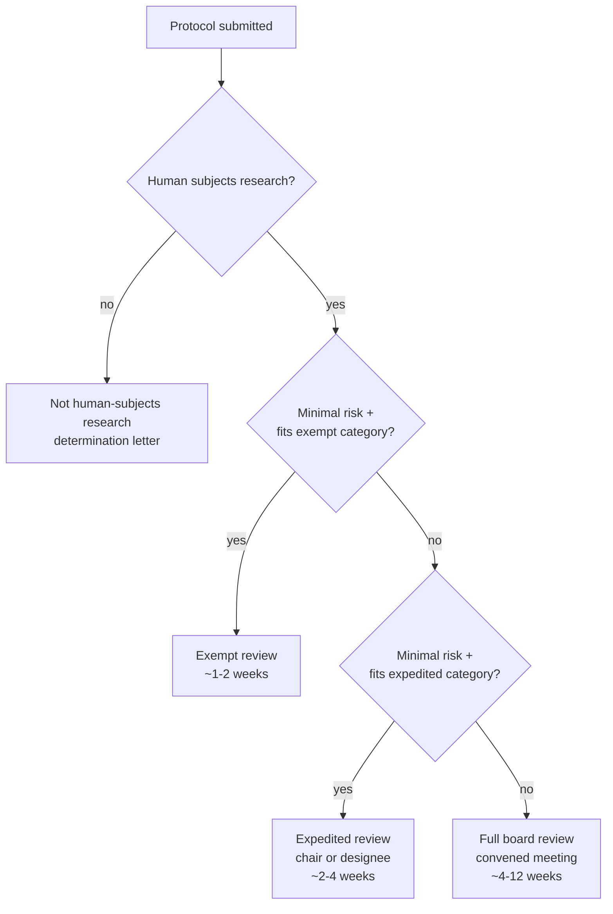

# IRB and research ethics

> Common Rule, exempt vs expedited vs full board, consent, incidental findings. The reviewer is not your enemy — but they will reject a sloppy protocol, and they should.

Every project that touches identifiable human data needs ethics-committee oversight. In the US that's an **Institutional Review Board (IRB)**; in the EU it's a member-state ethics committee under the regulation of the Clinical Trials Regulation 536/2014 and national law; the UK uses the HRA Research Ethics Service. The frameworks differ on paper and converge in practice.

This page covers what an IRB is for, the three review tracks, what's in a consent form, what's special about secondary use and incidental findings, and the practical checklist you should walk in with.

## The regulatory landscape

| Jurisdiction | Primary rule | Body |
|---|---|---|
| US federal-funded research | 45 CFR 46 (Common Rule, 2018 revision) | IRB at the awardee institution |
| US FDA-regulated research | 21 CFR 50 and 21 CFR 56 | IRB plus FDA oversight |
| EU clinical trials | Regulation 536/2014 | Member-state ethics committee |
| UK | Health Research Authority | NHS REC |
| International norms | Declaration of Helsinki; CIOMS guidelines | National bodies aligned to these |

The **Common Rule** ([45 CFR 46](https://www.hhs.gov/ohrp/regulations-and-policy/regulations/45-cfr-46/index.html)) is the single most-cited document in US human-subjects research. Subpart A is the general rule; B-D cover pregnant women / neonates, prisoners, and children respectively. The 2018 revision introduced **broad consent** as a recognised pathway, redefined "human subject" (data is now in scope), and trimmed continuing review for low-risk studies.

For neuroimaging specifically, the relevant facts are:

- An MRI is **minimal-risk** for most adults, which qualifies many studies for expedited review.
- Functional MRI tasks that induce distress (trauma cues, drug cues) push you out of minimal-risk.
- Contrast administration (gadolinium) is a procedure that requires medical-monitor sign-off.
- 7 T scanners may have additional local rules (vestibular effects, peripheral nerve stimulation).

## The three review tracks

### Exempt

Six categories under 45 CFR 46.104. The ones most relevant to neuroimaging:

- **Category 4** — secondary research on **already-existing**, **de-identified** data.
- **Category 7** — broad-consent secondary research (added in 2018).

Exempt doesn't mean *no* review. Your institution still issues a determination letter. But continuing review and adverse-event reporting are typically not required.

### Expedited

Nine categories under 45 CFR 46.110. Most prospective MRI studies on healthy adults fit Category 4 ("collection of data through noninvasive procedures routinely employed in clinical practice"). Reviewed by the chair or a designated member, not the full convened board.

### Full board

Required when risk exceeds minimal, when the population is vulnerable (children, prisoners, decisionally impaired), or when the study involves a regulated procedure. Reviewed at a convened meeting with a quorum. Expect 4-12 weeks turn-around and a list of stipulations.

## What an IRB actually reviews

Not just the consent form. The reviewer is asking five questions:

1. **Risk:benefit.** Are the risks reasonable given the anticipated benefit to the participant *or* the importance of the knowledge gained?
2. **Selection of subjects.** Is recruitment equitable? Is there coercion (a clinician asking their own patient is a flag)?
3. **Informed consent.** Is the form readable (8th-grade level), accurate, and does it cover the elements below?
4. **Data plan.** Where will data live, who has access, how long retained, how will it be destroyed?
5. **Monitoring.** Who is responsible for safety, and how are adverse events reported?

Engineers often under-prepare items 4 and 5. The IRB will reject a protocol that says "data will be stored on a secure server" without naming the server, the encryption posture, the access list, and the retention policy. The [data-engineering → security primer](../data-engineering/advanced/security.md) and the [privacy chapter](privacy-and-hipaa-gdpr.md) are what you draw on for that paragraph.

## Informed consent — the elements

Required elements (45 CFR 46.116(b)):

1. Statement that the study is research, plus purpose, duration, procedures.
2. Foreseeable risks and discomforts.
3. Reasonably expected benefits.
4. Disclosure of alternative procedures.
5. Confidentiality protections.
6. For more than minimal risk — what compensation or treatment is available if injury occurs.
7. Contact for questions about the research and about subject rights.
8. Statement that participation is voluntary, that refusal carries no penalty, and that the subject may withdraw at any time.

Additional elements often required for neuroimaging:

- **Incidental findings** disclosure — *will you tell them if you see something on the scan?*
- **Genetic / biospecimen** disclosure if applicable.
- **Future use** language — broad consent, data sharing repositories.
- **Commercial use** — will derivatives be sold or licensed?

## Broad consent and dynamic consent

**Broad consent** (2018 Common Rule) lets a subject agree to unspecified future research uses of their data, with categories of use spelled out. It's a single-shot, "yes/no" approach. Practically: a participant agrees that their MRI may be used for any future research at any institution, with IRB oversight, on broadly described topics.

**Dynamic consent** ([Kaye 2015](https://doi.org/10.1038/ejhg.2014.71)) is the newer model — a digital platform where participants can update their consent preferences over time, opt in or out of specific studies, and see what their data was used for. Closer to how people actually think about consent. Still rare in practice but moving into longitudinal cohorts (UK Biobank's recall consent is a primitive version).

## Re-consent for secondary use

If your study uses data collected under a *prior* consent that didn't anticipate your use case, you have three options:

1. **Re-consent** — go back to the subjects. Best practice, often impractical for retrospective cohorts.
2. **Waiver of consent** — the IRB can waive consent for minimal-risk research where re-consent is impracticable and the research couldn't otherwise be done. Section 45 CFR 46.116(f).
3. **De-identify to the point that it's no longer human-subjects research** — covered in the [privacy chapter](privacy-and-hipaa-gdpr.md).

Reviewers will scrutinise option 2. Be explicit about why you can't re-consent and what protections substitute.

## Incidental findings

You will see things on a research MRI that look clinical. Tumours. Aneurysms. Developmental abnormalities. You need a policy *before* the first scan, not after. Wolf et al. ([2008](https://doi.org/10.1111/j.1748-720X.2008.00266.x)) is the foundational US framework; Illes et al. ([2006](https://doi.org/10.1126/science.1135013)) is the imaging-specific recommendation.

A workable policy has three parts:

1. **Review tier.** Either (a) all scans reviewed by a board-certified neuroradiologist, or (b) a tiered approach where research-grade scans are screened by trained personnel with radiologist back-up for flagged cases.
2. **Disclosure path.** Who tells the participant? The PI? The participant's primary-care physician? A clinical neurologist on the study team?
3. **Consent language.** Tell the participant up front whether you will or will not disclose. Tell them the scan is not a clinical exam and is not a substitute for one.

A study that quietly archives concerning scans without policy is an ethical and legal failure.

## Vulnerable populations

Subpart B, C, D of the Common Rule cover pregnant women / neonates, prisoners, and children. Add to that:

- **Decisionally impaired adults** (dementia, severe psychiatric illness). Require a Legally Authorised Representative (LAR) for consent and, where possible, assent from the participant.
- **Students and employees** — coercion risk.
- **Low-literacy populations** — consent material in plain language and the participant's first language, with documented comprehension check.

For pediatric neuroimaging:

- **Parental permission** + **child assent** (typically age 7+; varies by IRB).
- Reasonable child-friendly explanation of the procedure.
- A clear "you can stop at any time" right that the child understands.

## Belmont, Helsinki, CIOMS

The three foundational documents you should be able to summarise on demand:

- **Belmont report** (1979) — three principles. **Respect for persons** (autonomy, consent, protection of those with diminished autonomy). **Beneficence** (do no harm, maximise benefit, minimise risk). **Justice** (fair distribution of burdens and benefits). The intellectual basis of the Common Rule.
- **Declaration of Helsinki** ([WMA, current revision 2024](https://www.wma.net/policies-post/wma-declaration-of-helsinki-ethical-principles-for-medical-research-involving-human-subjects/)) — the international medical-research ethics framework. Stronger on health-of-the-individual-takes-precedence than the Belmont report. Required reading for clinical research.
- **CIOMS guidelines** ([2016](https://cioms.ch/publications/product/international-ethical-guidelines-for-health-related-research-involving-humans/)) — the operational complement to Helsinki, with guidance on low-resource settings, vulnerable populations, and biobank research.

## Practical: IRB submission checklist

- [ ] Protocol document — background, aims, design, statistical plan, sample size.
- [ ] Consent form(s) — at the right reading level, in the right language(s).
- [ ] Assent form for minors if applicable.
- [ ] Recruitment material — flyers, emails, scripts. The IRB reviews these.
- [ ] Data management plan — storage, access, retention, destruction.
- [ ] Incidental-findings policy.
- [ ] CVs / training certifications for key personnel (CITI training in the US).
- [ ] Site-specific safety plan — MRI screening, contrast protocols if applicable.
- [ ] Conflict-of-interest disclosures.
- [ ] If multi-site: single-IRB reliance agreement (sIRB is now the US default for federally funded multi-site studies).

## Common reviewer asks

In rough order of frequency:

1. "Lower the reading level of the consent form to 8th grade."
2. "Add an incidental-findings paragraph."
3. "Specify where data is stored and who has access, by name or role."
4. "Justify the sample size."
5. "Add a data-destruction date or retention rationale."
6. "Provide the script for how participants will be approached."
7. "Add a statement on compensation and whether it's pro-rated for withdrawal."
8. "Clarify what happens to data if a participant withdraws."

If your protocol pre-empts these, you will get fewer stipulations and a faster turnaround.

## When ethics review fails

Two patterns to recognise:

- **Rubber-stamp review.** A board that approves everything is not protecting subjects. Push back, escalate to the institutional official, or seek an external IRB.
- **Bureaucratic obstruction.** A board that rejects low-risk de-identified data work as if it were a Phase I trial is also failing. Engage the chair, cite the Common Rule exempt categories, and ask for a determination letter on the right track.

## Where to next

- [Privacy: HIPAA, GDPR, de-identification](privacy-and-hipaa-gdpr.md) — the data-protection layer on top of ethics review.
- [Data sharing and DUAs](data-sharing-and-dua.md) — what your IRB will need to say about secondary use and repositories.
- [AI/ML → Regulatory](../ai/regulatory.md) — when an IRB-approved research tool starts heading toward clinical deployment.

## References

1. **US Department of Health and Human Services.** 45 CFR 46 — Protection of Human Subjects (Common Rule, 2018 revision). [https://www.hhs.gov/ohrp/regulations-and-policy/regulations/45-cfr-46/index.html](https://www.hhs.gov/ohrp/regulations-and-policy/regulations/45-cfr-46/index.html)
2. **Wolf SM, Lawrenz FP, Nelson CA, et al.** Managing incidental findings in human subjects research. *J Law Med Ethics.* 2008;36(2):219-248. [doi:10.1111/j.1748-720X.2008.00266.x](https://doi.org/10.1111/j.1748-720X.2008.00266.x)
3. **Illes J, Kirschen MP, Edwards E, et al.** Incidental findings in brain imaging research. *Science.* 2006;311(5762):783-784. [doi:10.1126/science.1135013](https://doi.org/10.1126/science.1135013)
4. **National Commission for the Protection of Human Subjects.** The Belmont Report. 1979. [https://www.hhs.gov/ohrp/regulations-and-policy/belmont-report/index.html](https://www.hhs.gov/ohrp/regulations-and-policy/belmont-report/index.html)
5. **World Medical Association.** Declaration of Helsinki — Ethical Principles for Medical Research Involving Human Subjects. 2024 revision. [https://www.wma.net/policies-post/wma-declaration-of-helsinki-ethical-principles-for-medical-research-involving-human-subjects/](https://www.wma.net/policies-post/wma-declaration-of-helsinki-ethical-principles-for-medical-research-involving-human-subjects/)
6. **CIOMS.** International Ethical Guidelines for Health-Related Research Involving Humans. 2016. [https://cioms.ch/publications/product/international-ethical-guidelines-for-health-related-research-involving-humans/](https://cioms.ch/publications/product/international-ethical-guidelines-for-health-related-research-involving-humans/)
7. **Kaye J, Whitley EA, Lund D, et al.** Dynamic consent: a patient interface for twenty-first century research networks. *Eur J Hum Genet.* 2015;23(2):141-146. [doi:10.1038/ejhg.2014.71](https://doi.org/10.1038/ejhg.2014.71)
