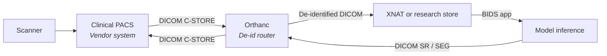

# Clinical deployment tooling

> The toolchain between a working model and a result that appears on a radiologist's worklist. DICOM I/O, PACS bridges, inference servers, FHIR for orders/results, DICOM SR for outputs, and the edge-inference layer when the scanner needs to run the model itself.

This page is a tool catalogue, not a regulatory primer. For the SaMD / TRIPOD+AI / model-card layer, see [AI/ML → Regulatory and reporting](../ai/regulatory.md). Pick tools from this page only once you've decided *what* you're shipping; the choice of how to ship it follows from that.

Each table marks tools **R** (research-friendly, permissive licence, lab use) or **C** (commercial-grade, expect support contracts and certification overhead).

## DICOM I/O — reading and writing the file format

You will read DICOM in every clinical project, even when the final pipeline is BIDS-native. The three libraries below cover essentially every reading scenario.

| Tool | Language | Notes | Class |
| --- | --- | --- | --- |
| **pydicom** | Python | The standard. Reads + writes; great for scripting and PHI scrubbing. | R |
| **GDCM** | C++ / Python bindings | Handles weird compressions (JPEG2000, RLE) pydicom punts on. | R |
| **DCMTK** | C++ / CLI | Heavyweight; ships `dcmdump`, `storescu`, `dcmodify`. The Swiss army knife. | R |
| **Highdicom** | Python (on pydicom) | Modern API for structured reports, segmentations, parametric maps. | R |

Practical pattern — read a DICOM series with pydicom, sanity-check it, then route it to a converter:

```python
import pydicom
from pathlib import Path

series = sorted(Path("incoming/").glob("*.dcm"))
ds0 = pydicom.dcmread(series[0])

assert ds0.Modality == "MR", f"Unexpected modality: {ds0.Modality}"
assert ds0.SeriesDescription.lower().startswith("t1"), "Wrong series"

# PHI scrub before logging
print(f"Series {ds0.SeriesInstanceUID[:8]}... — {len(series)} slices")
```

For writing DICOM outputs (segmentations, structured reports), **`highdicom`** is the right answer — hand-rolling Segmentation IODs in raw pydicom is a known footgun.

## PACS integration

A PACS (Picture Archiving and Communication System) is where clinical images live. Models that read or write to a PACS need a bridge.

| Tool | What it is | Notes | Class |
| --- | --- | --- | --- |
| **Orthanc** | Lightweight open-source PACS / DICOM router | The default research-PACS; REST API + plugins | R |
| **dcm4che / dcm4chee** | Industrial-strength open-source PACS toolkit | Java; production-grade; harder install | R |
| **XNAT** | Research imaging informatics platform | Project / subject / experiment model; auth + DataLad-style sharing | R |
| **Vendor PACS** | GE Centricity, Sectra, Philips IntelliSpace, etc. | What the hospital actually runs | C |

The deployment topology most translational teams converge on:



Two things this diagram earns:

- **The de-identification step has its own audit trail.** Orthanc's `Lua` scripts or `dicom-anonymizer` are common implementations; PHI handling sits inside the institution's IRB and HIPAA / GDPR posture.
- **Results return the same way they arrived.** A model that produces a segmentation should send back a DICOM SEG (or SR) to the PACS, not drop a NIfTI somewhere.

## Inference platforms

The choice depends on whether you're serving one model or many, whether you need batching, and whether the model already lives in the broader ML platform.

| Tool | Best at | Notes | Class |
| --- | --- | --- | --- |
| **NVIDIA Triton Inference Server** | Multi-model, multi-framework serving on GPU | Dynamic batching, ensembles, gRPC + HTTP | R / C |
| **TorchServe** | PyTorch-native serving | Simpler than Triton; PyTorch-only | R |
| **ONNX Runtime** | Cross-framework, CPU- and accelerator-friendly | Smaller footprint; good for edge | R |
| **MONAI Deploy** | DICOM-in, DICOM-out medical-imaging app SDK | Built on Holoscan; ergonomic for radiology workflows | R |
| **KServe / Seldon** | Kubernetes-native model-serving CRDs | When the rest of the platform is on K8s | R |

The pattern most neuroimaging teams reach for first is **MONAI Deploy** — it speaks DICOM natively, packages models as containers, and integrates with Triton under the hood. A minimal MONAI Deploy app:

```python
from monai.deploy.core import Application
from monai.deploy.operators import (
    DICOMDataLoaderOperator, DICOMSeriesSelectorOperator,
    DICOMSeriesToVolumeOperator, MonaiSegInferenceOperator,
    DICOMSegmentationWriterOperator,
)

class StrokeApp(Application):
    def compose(self):
        loader = DICOMDataLoaderOperator()
        selector = DICOMSeriesSelectorOperator(rules='{"selections":[{"name":"DWI","conditions":{"Modality":"MR"}}]}')
        to_volume = DICOMSeriesToVolumeOperator()
        infer = MonaiSegInferenceOperator(roi_size=(96,96,96), pre_transforms=..., post_transforms=...)
        writer = DICOMSegmentationWriterOperator(segment_descriptions=[...])
        self.add_flow(loader, selector, {"dicom_study_list": "dicom_study_list"})
        self.add_flow(selector, to_volume, {"study_selected_series_list": "study_selected_series_list"})
        self.add_flow(to_volume, infer, {"image": "image"})
        self.add_flow(infer, writer, {"seg_image": "seg_image"})

if __name__ == "__main__":
    StrokeApp(do_run=True)
```

Triton becomes the right answer when you're serving many models, need dynamic batching across requests, or want to mix PyTorch + ONNX + TensorRT in one server.

## Clinical workflow integration

Once the model produces a result, the result has to land somewhere the clinician already looks. Two standards do this work.

### HL7 FHIR — orders and metadata

FHIR is the modern HL7 standard for clinical data exchange. For imaging AI, the resources you'll touch most are:

- **`ImagingStudy`** — points at a DICOM study; carries series + instance metadata.
- **`Observation`** — a discrete result (e.g. "infarct volume = 12.3 mL").
- **`DiagnosticReport`** — the report shell that aggregates observations.
- **`ServiceRequest`** — the order that triggered the study and the AI run.

You typically *consume* FHIR (read the order) and *produce* FHIR (write observations and reports). Libraries: `fhir.resources` (Python), `HAPI FHIR` (Java).

### DICOM SR / SEG — image-bound outputs

For results that are *image-bound* — a segmentation, a measurement on a slice, a probability map — the right output is DICOM, not FHIR:

- **DICOM SEG** — voxel-level segmentations.
- **DICOM SR (Structured Report)** — measurements, findings, AI confidence values, model identity.
- **DICOM Parametric Map** — continuous-valued maps (e.g. CBF, probability of lesion).

`highdicom` is the practical Python entry point. Generate a SEG that references the source series:

```python
import highdicom as hd
from pydicom import dcmread

source = [dcmread(p) for p in source_paths]
seg = hd.seg.Segmentation(
    source_images=source,
    pixel_array=mask,                      # (slices, rows, cols) uint8
    segmentation_type=hd.seg.SegmentationTypeValues.BINARY,
    segment_descriptions=[
        hd.seg.SegmentDescription(
            segment_number=1, segment_label="Infarct",
            segmented_property_category=..., segmented_property_type=...,
            algorithm_type=hd.seg.SegmentAlgorithmTypeValues.AUTOMATIC,
            algorithm_identification=hd.AlgorithmIdentificationSequence(
                name="StrokeSegmenter", version="1.0.0", family=...,
            ),
        ),
    ],
    series_instance_uid=hd.UID(), sop_instance_uid=hd.UID(),
    instance_number=1, manufacturer="Your Lab",
    manufacturer_model_name="StrokeSegmenter", software_versions="1.0.0",
    device_serial_number="0",
)
seg.save_as("seg.dcm")
```

The PACS will display this overlay against the source series automatically — no custom viewer required.

## Regulatory wrappers

The deployment tools above don't make you compliant. They make compliance *possible*. The regulatory layer — SaMD class, TRIPOD+AI, CLAIM, model cards, the FDA predetermined-change-control plan — is covered in depth in [AI/ML → Regulatory and reporting](../ai/regulatory.md). Read it before you ship anything to a clinical environment.

The short version, mapped to tools on this page:

- **Model card** lives in the inference container; serve it at `/model-card`.
- **DICOM SR output** must include the model identity, version, and confidence values. `highdicom` makes this explicit.
- **Audit trail** of inputs and outputs lives wherever Orthanc / dcm4chee logs go; back it up.
- **Performance monitoring** (drift, calibration on incoming data) lives in [MLOps](../data-engineering/advanced/mlops.md).

## Edge inference

Some deployments run *on the scanner* or on a workstation next to it — for latency, for network-isolated environments, or for vendor integrations. The toolchain narrows.

| Tool | What it is | Notes | Class |
| --- | --- | --- | --- |
| **TensorRT** | NVIDIA's accelerated-inference compiler | The right answer on Jetson, scanner GPUs, or any NVIDIA edge box | R / C |
| **OpenVINO** | Intel's inference toolkit | CPU / iGPU / VPU on Intel-based scanner consoles | R / C |
| **ONNX Runtime + Mobile** | Cross-platform, smaller footprint | Good baseline before reaching for vendor-specific tools | R |
| **CoreML** | Apple silicon | Niche for radiology but real for some demo / tablet workflows | R |

Edge inference is mostly a *compilation* problem: take a trained PyTorch / TensorFlow model, export to ONNX, then compile to the target with TensorRT or OpenVINO. The compilation step quantises (FP16 / INT8), fuses operators, and produces a binary tuned to the target hardware. Expect 2-10× speedups versus generic ONNX Runtime on the same hardware.

```bash
# PyTorch → ONNX → TensorRT, the typical path
python export_onnx.py --ckpt model.pt --out model.onnx
trtexec --onnx=model.onnx --saveEngine=model.plan --fp16 --workspace=4096
```

The engineering trade-off: every edge target is a separate build, separate validation, and separate certification surface. Only push to the edge when the latency or network-isolation requirement is real.

---

## References

1. **Bidgood WD, Horii SC, Prior FW, Van Syckle DE.** Understanding and using DICOM, the data interchange standard for biomedical imaging. *J Am Med Inform Assoc.* 1997;4:199-212. [doi:10.1136/jamia.1997.0040199](https://doi.org/10.1136/jamia.1997.0040199)
2. **Mason D.** SU-E-T-33: Pydicom — an open source DICOM library. *Med Phys.* 2011;38:3493. [doi:10.1118/1.3611983](https://doi.org/10.1118/1.3611983)
3. **Jodogne S.** The Orthanc ecosystem for medical imaging. *J Digit Imaging.* 2018;31:341-352. [doi:10.1007/s10278-018-0082-y](https://doi.org/10.1007/s10278-018-0082-y)
4. **Marcus DS, Olsen TR, Ramaratnam M, Buckner RL.** The Extensible Neuroimaging Archive Toolkit (XNAT). *Neuroinformatics.* 2007;5:11-34. [doi:10.1385/NI:5:1:11](https://doi.org/10.1385/NI:5:1:11)
5. **Herrmann MD, Clunie DA, Fedorov A, et al.** Implementing the DICOM standard for digital pathology (and highdicom rationale). *J Pathol Inform.* 2018;9:37. [doi:10.4103/jpi.jpi_42_18](https://doi.org/10.4103/jpi.jpi_42_18)
6. **HL7 International.** FHIR R5 specification. [https://hl7.org/fhir/](https://hl7.org/fhir/)
7. **NVIDIA.** Triton Inference Server documentation. [https://github.com/triton-inference-server/server](https://github.com/triton-inference-server/server)
8. **MONAI Consortium.** MONAI Deploy App SDK. [https://github.com/Project-MONAI/monai-deploy-app-sdk](https://github.com/Project-MONAI/monai-deploy-app-sdk)

## Where to next

- [AI/ML → Regulatory and reporting](../ai/regulatory.md) — the regulatory layer these tools enable.
- [Data engineering → MLOps](../data-engineering/advanced/mlops.md) — the production-monitoring layer once a model is live.
- [Decision trees](decision-trees.md) — the upstream tool choices that determine what you'll deploy.
- [Visualisation and EDA](viz-and-eda.md) — the QC layer you'll wire in next to inference.
