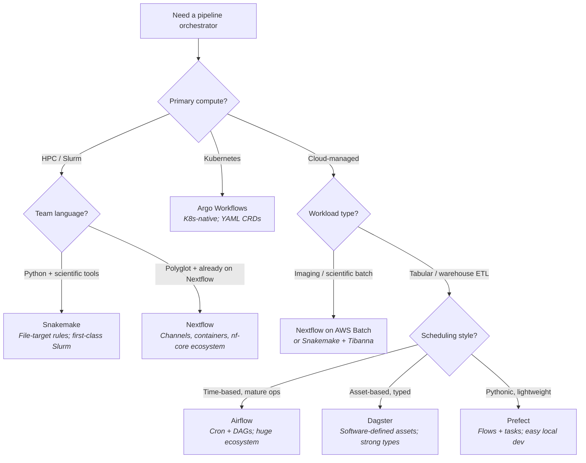
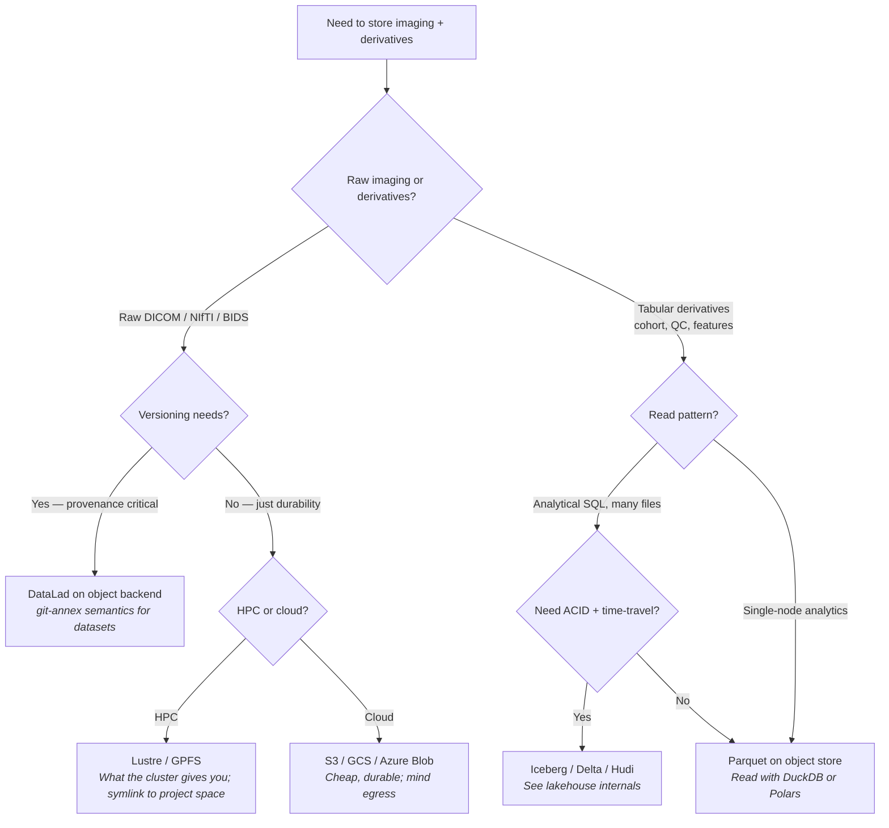
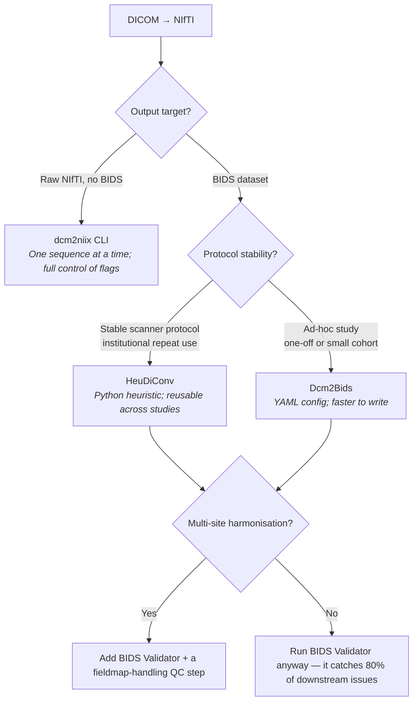
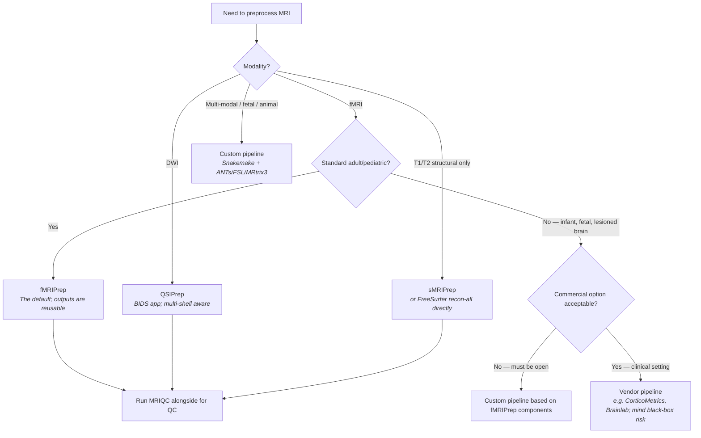
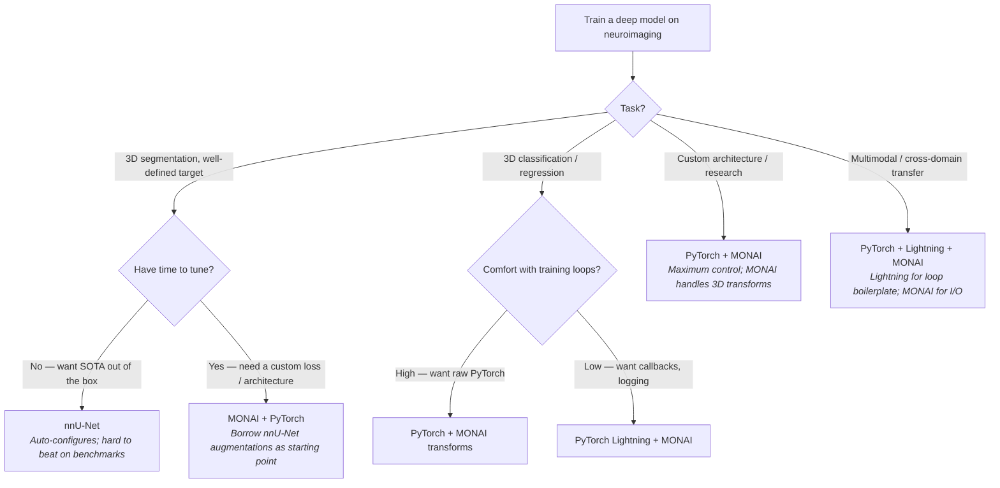
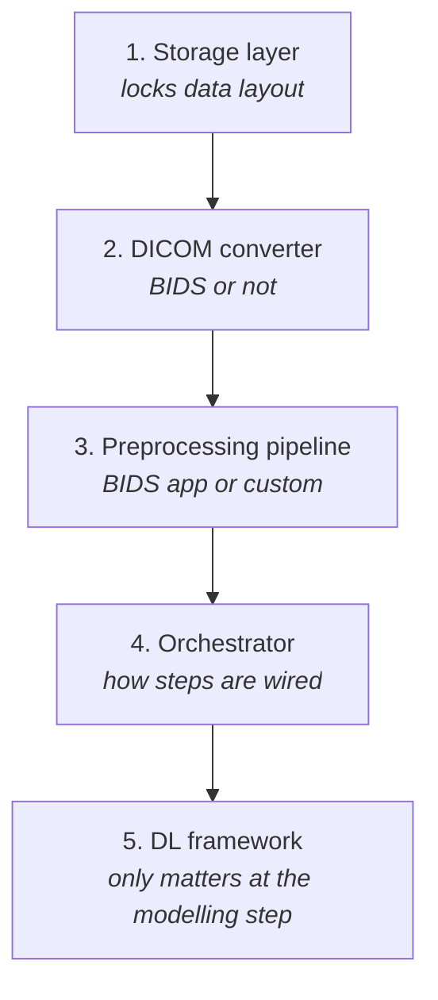

# Decision trees

> Concrete flowcharts for the five tool choices that bite neuroimaging teams hardest. Pick a branch, get a recommendation, move on.

The catalogues in [Tools landscape](index.md) tell you *what* a tool does. This page tells you *which one to pick* for the situation you're actually in. Each tree ends in a recommendation and a one-line rationale so you can defend the call in code review.

These are starting points, not laws. If your context contradicts a branch, follow the context.

## Which orchestrator for my lab?

The single most-debated choice in any group standing up its first pipeline. The right answer depends on three things: where you run (HPC vs Kubernetes vs cloud-managed), what your team already speaks, and whether you're optimising for *scientific reruns* or *scheduled production*.

Three judgement calls embedded in the tree:

- **Snakemake is the neuroimaging default on Slurm** because file-target rules map cleanly onto BIDS layouts and `recon-all`-style "input file → output file" steps. See [Data engineering → DAG thinking](../data-engineering/dag.md).
- **Nextflow wins if your group already runs it** — the cost of a second orchestrator is higher than the cost of any per-task feature.
- **Airflow/Dagster/Prefect are warehouse-shaped tools.** Use them for cohort tables, billing, derivative aggregation — not for `recon-all`.

## Which storage layer?

Storage decisions look architectural but are usually answered by *who pays the bill* and *what the read pattern is*. Object storage wins on cost and durability; POSIX wins on per-file latency. Lakehouse table formats only matter once you have analytical SQL workloads against many files.

Rules of thumb the tree encodes:

- **DataLad is the only storage layer that knows what a dataset is** — siblings, sub-datasets, content tracking. If reviewers will ask "what version of the data produced Figure 3?", you need it.
- **Don't put DICOMs in a lakehouse.** Lakehouse formats are for *rows*. Keep imaging in object storage and reference paths from tables.
- **Lustre / GPFS are HPC-only facts of life.** Don't fight them; use [Performance](../data-engineering/performance.md) patterns to work around small-file pain.

See [Lakehouse internals](../data-engineering/advanced/lakehouse.md) for the deeper treatment.

## Which DICOM converter?

The conversion step looks trivial until it isn't. Protocol drift, multi-echo sequences, derived series, and vendor quirks all show up here. The three real options share an engine (`dcm2niix`) but differ in how they organise the output.

The honest summary:

- **HeuDiConv** pays off when the same protocol runs for months and you'll convert hundreds of subjects with it. The heuristic file is code; you review it like code.
- **Dcm2Bids** pays off when the study is small or the protocol is still settling. The YAML is easier to iterate than a heuristic.
- **Raw `dcm2niix`** is for when something weird is happening — vendor-specific physio, exotic diffusion schemes, or a sequence the wrappers don't know about.

See [BIDS](../bids/index.md) for the layout spec these tools target.

## Which preprocessing pipeline?

Most teams should not write their own preprocessing pipeline. The BIDS apps exist precisely so you don't have to re-litigate motion correction, field-map unwarping, and confound estimation per study. Roll your own only when you have a *named, defensible* reason.

The honest summary:

- **fMRIPrep / QSIPrep / sMRIPrep are the right default.** They're peer-reviewed, container-shipped, and produce confounds files that downstream tools (Nilearn, AFNI's `3dTproject`) already know how to read.
- **Custom pipelines belong to two categories:** populations the BIDS apps don't support (fetal, neonatal, severe pathology, non-human) and methodological studies that *are about* the preprocessing.
- **Commercial pipelines** show up in clinical contexts where vendor support and certification matter more than reproducibility. Treat outputs as opaque; validate against an open reference cohort.

## Which deep-learning framework?

For neuroimaging segmentation specifically, this collapses faster than it does for generic ML. The question is mostly "how much do I want to write?"

The honest summary:

- **nnU-Net is the strongest segmentation baseline of the last five years.** If your task fits its assumptions (one label map, paired imaging), start there and only move off it if you need something it doesn't expose.
- **MONAI is the 3D-aware layer on top of PyTorch.** Use it for transforms, networks, metrics, and dataloaders. It saves you from rewriting `RandCropByPosNegLabeld` for every project.
- **Lightning is loop-boilerplate elimination.** Worth it once you have multi-GPU, gradient accumulation, and structured logging. See [Training mechanics](../ai/training-mechanics.md).
- **Raw PyTorch is always available** and is the right answer for research code that doesn't fit the above moulds.

| Framework | Best at | Watch out for |
| --- | --- | --- |
| **PyTorch** | Everything; the substrate | You write all the boilerplate |
| **MONAI** | 3D medical I/O, transforms, networks | API drift between minor versions |
| **nnU-Net** | Segmentation SOTA with zero config | Hard to extend; opinionated training |
| **Lightning** | Multi-GPU + logging boilerplate | Adds an abstraction layer to debug through |

See [Deep learning for imaging](../ai/deep-learning.md) and [Training mechanics](../ai/training-mechanics.md) for the implementation detail underneath these choices.

## A meta-tree — how to actually use this page

Most teams don't make these decisions in isolation; one drives the next. The dependency order that minimises rework:

Two practical implications:

- **Storage and converter together decide whether the rest of your stack is BIDS-native.** Reversing this later means rerunning conversion across every subject.
- **Framework choice is local.** You can rewrite a training script; you cannot easily rewrite an orchestrator across a 500-subject pipeline. Defer DL-framework debates until the data layer is settled.

---

## References

1. **Mölder F, Jablonski KP, Letcher B, et al.** Sustainable data analysis with Snakemake. *F1000Res.* 2021;10:33. [doi:10.12688/f1000research.29032.2](https://doi.org/10.12688/f1000research.29032.2)
2. **Di Tommaso P, Chatzou M, Floden EW, et al.** Nextflow enables reproducible computational workflows. *Nat Biotechnol.* 2017;35:316-319. [doi:10.1038/nbt.3820](https://doi.org/10.1038/nbt.3820)
3. **Halchenko YO, Hanke M, Heunis S, et al.** DataLad: distributed system for joint management of code, data, and their relationship. *J Open Source Softw.* 2021;6:3262. [doi:10.21105/joss.03262](https://doi.org/10.21105/joss.03262)
4. **Li X, Morgan PS, Ashburner J, et al.** The first step for neuroimaging data analysis: DICOM to NIfTI conversion (dcm2niix). *J Neurosci Methods.* 2016;264:47-56. [doi:10.1016/j.jneumeth.2016.03.001](https://doi.org/10.1016/j.jneumeth.2016.03.001)
5. **Esteban O, Markiewicz CJ, Blair RW, et al.** fMRIPrep: a robust preprocessing pipeline for functional MRI. *Nat Methods.* 2019;16:111-116. [doi:10.1038/s41592-018-0235-4](https://doi.org/10.1038/s41592-018-0235-4)
6. **Isensee F, Jaeger PF, Kohl SAA, et al.** nnU-Net: a self-configuring method for deep learning-based biomedical image segmentation. *Nat Methods.* 2021;18:203-211. [doi:10.1038/s41592-020-01008-z](https://doi.org/10.1038/s41592-020-01008-z)
7. **Cardoso MJ, Li W, Brown R, et al.** MONAI: an open-source framework for deep learning in healthcare. *arXiv:2211.02701.* 2022. [doi:10.48550/arXiv.2211.02701](https://doi.org/10.48550/arXiv.2211.02701)

## Where to next

- [Visualisation and EDA](viz-and-eda.md) — once your pipeline runs, you need to look at the outputs.
- [Clinical deployment](clinical-deployment.md) — the next layer of tooling once a model graduates.
- [Data engineering → DAG thinking](../data-engineering/dag.md) — the conceptual layer underneath every orchestrator choice.
