# Capstone — DICOM to a published figure

> The full pipeline on one screen: scanner DICOM → BIDS → fMRIPrep → first-level GLM → publication figure. The synthesis exercise.

## Prerequisites

You should have done [Getting Started](../getting-started/index.md) and read at least the index pages of [BIDS toolkit](../bids/index.md), [Analysis](../analysis/index.md), and [Computing](../computing/index.md).

## The capstone shape

```mermaid
flowchart LR
    DCM[Raw DICOM<br/>from scanner] --> CONV[dcm2niix +<br/>HeuDiConv]
    CONV --> BIDS[BIDS dataset]
    BIDS --> VAL[bids-validator]
    VAL --> FMR[fMRIPrep on cluster]
    FMR --> DERIV[BIDS-Derivatives]
    DERIV --> FL[Nilearn first-level]
    FL --> CON[Contrast maps]
    CON --> SL[Second-level GLM]
    SL --> COR[Permutation FWE]
    COR --> FIG[Publication figure]
    style DCM fill:#fff,stroke:#888
    style FIG fill:#e0e0ff,stroke:#444
```



## 1. Get raw DICOMs

If you can't get clinical-export DICOMs, simulate with an OpenNeuro DICOM dump (some datasets ship the raw DICOM alongside NIfTI). For this tutorial we'll assume you have a folder:

```text
raw_dicom/
└── sub-001/
    └── scan_2026_06_15/
        ├── *.dcm  (hundreds of files)
```

## 2. Convert to BIDS with HeuDiConv

Write a heuristic (`heuristic.py`) once per scanner protocol:

```python
def create_key(template, outtype=("nii.gz",), annotation_classes=None):
    return template, outtype, annotation_classes

def infotodict(seqinfo):
    t1 = create_key("sub-{subject}/anat/sub-{subject}_T1w")
    bold = create_key("sub-{subject}/func/sub-{subject}_task-rest_run-{item:02d}_bold")
    info = {t1: [], bold: []}
    for s in seqinfo:
        if "MPRAGE" in s.protocol_name:
            info[t1].append(s.series_id)
        elif "rest" in s.protocol_name.lower() and s.dim4 > 1:
            info[bold].append(s.series_id)
    return info
```

```bash
heudiconv -d 'raw_dicom/{subject}/scan_*/*.dcm' \
          -s 001 -f heuristic.py -c dcm2niix -b -o data/bids
```

## 3. Validate

```bash
npx bids-validator data/bids
```

## 4. Run fMRIPrep on the cluster

The Slurm + Apptainer script (full template in [Computing → HPC and Slurm](../computing/hpc-slurm.md)):

```bash
#!/usr/bin/env bash
#SBATCH --job-name=fmriprep
#SBATCH --time=24:00:00
#SBATCH --cpus-per-task=8
#SBATCH --mem=32G
set -euo pipefail
SUB=$1

apptainer run --cleanenv \
  -B $PWD/data/bids:/data:ro \
  -B $PWD/data/derivatives:/out \
  -B $PWD/work:/work \
  -B $FS_LICENSE:/license.txt:ro \
  fmriprep.sif \
  /data /out participant --participant-label "$SUB" \
  --work-dir /work --fs-license-file /license.txt \
  --output-spaces MNI152NLin2009cAsym
```

```bash
sbatch run_fmriprep.sh 001
```

## 5. First-level GLM in Python

```python
import pandas as pd
from nilearn.glm.first_level import FirstLevelModel
from nilearn import plotting
import numpy as np

bold = "data/derivatives/fmriprep/sub-001/func/sub-001_task-rest_space-MNI152NLin2009cAsym_desc-preproc_bold.nii.gz"
mask = "data/derivatives/fmriprep/sub-001/func/sub-001_task-rest_space-MNI152NLin2009cAsym_desc-brain_mask.nii.gz"
events = pd.read_csv("data/bids/sub-001/func/sub-001_task-rest_events.tsv", sep="\t")
confounds = pd.read_csv("data/derivatives/fmriprep/sub-001/func/sub-001_task-rest_desc-confounds_timeseries.tsv", sep="\t")
confounds = confounds[["trans_x","trans_y","trans_z","rot_x","rot_y","rot_z"]].fillna(0)

flm = FirstLevelModel(t_r=2.0, hrf_model="spm", drift_model="cosine",
                      high_pass=0.01, mask_img=mask, minimize_memory=True)
flm = flm.fit(bold, events=events, confounds=confounds)

contrast = np.zeros(flm.design_matrices_[0].shape[1])
idx = flm.design_matrices_[0].columns.get_loc("stimulus")
contrast[idx] = 1
z_map = flm.compute_contrast(contrast, output_type="z_score")
z_map.to_filename("data/derivatives/firstlevel/sub-001_z_stimulus.nii.gz")
```

Loop the same code over every subject.

## 6. Second-level + correction

```python
from nilearn.glm.second_level import non_parametric_inference

cmaps = sorted(Path("data/derivatives/firstlevel").glob("sub-*_z_stimulus.nii.gz"))
design = pd.DataFrame({"intercept": [1]*len(cmaps)})
corrected = non_parametric_inference(
    [str(p) for p in cmaps], design_matrix=design,
    second_level_contrast="intercept",
    threshold=0.001, n_perm=5000, n_jobs=8, smoothing_fwhm=8,
)
```

## 7. Make the figure

```python
import matplotlib.pyplot as plt
from nilearn import plotting

fig, axes = plt.subplots(2, 1, figsize=(8, 8), dpi=150)

plotting.plot_glass_brain(
    corrected["t"], threshold=3.1, display_mode="lzry",
    title="Group main effect (TFCE-FWE p<0.05)",
    colorbar=True, axes=axes[0], plot_abs=False,
)

plotting.plot_stat_map(
    corrected["t"], threshold=3.1,
    cut_coords=[-20, -5, 5, 25, 45], display_mode="z",
    title="Axial slices", axes=axes[1],
)

fig.savefig("figs/capstone_fig.pdf", bbox_inches="tight")
fig.savefig("figs/capstone_fig.png", dpi=300, bbox_inches="tight")
```

## 8. Reproducibility — wrap it in a Makefile

```makefile
.PHONY: bids preproc firstlevel groupstats fig

bids:
\theudiconv -d 'raw_dicom/{subject}/scan_*/*.dcm' -s $(SUBS) -f heuristic.py -c dcm2niix -b -o data/bids

preproc:
\tfor s in $(SUBS); do sbatch run_fmriprep.sh $$s; done

firstlevel:
\tfor s in $(SUBS); do python firstlevel.py $$s; done

groupstats:
\tpython groupstats.py

fig:
\tpython make_fig.py

all: bids preproc firstlevel groupstats fig
```

That's the whole capstone in one Makefile target.

## What you've demonstrated

If you've reached this point you've used every section of the handbook:

- Fundamentals (modalities, coordinate systems, file formats).
- BIDS toolkit (DICOM → BIDS, validation, derivatives layout).
- Medical imaging (preprocessing as the BIDS app handles it).
- Analysis (first/second-level GLM, multiple-comparisons).
- Data engineering (Makefile + reproducible pipeline).
- Computing (Slurm + Apptainer + Python environment).
- AI/ML thinking (you'd plug in nnU-Net for segmentation, classical ML for prediction).

That's research-level competence. The rest of the handbook is depth and breadth on top of this synthesis.

## References

1. **Esteban O, Markiewicz CJ, Blair RW, et al.** fMRIPrep. *Nat Methods.* 2019;16:111-116. [doi:10.1038/s41592-018-0235-4](https://doi.org/10.1038/s41592-018-0235-4)
2. **Halchenko Y, Goncalves M, Velasco PF, et al.** HeuDiConv. *J Open Source Softw.* 2024;9(99):5839. [doi:10.21105/joss.05839](https://doi.org/10.21105/joss.05839)
3. **Abraham A, Pedregosa F, Eickenberg M, et al.** Machine learning for neuroimaging with scikit-learn. *Front Neuroinform.* 2014;8:14. [doi:10.3389/fninf.2014.00014](https://doi.org/10.3389/fninf.2014.00014)
