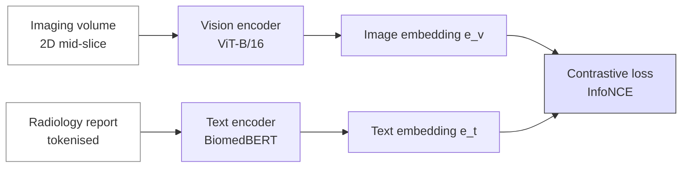

# Tutorial — Multimodal image + text (BiomedCLIP-style)

> Fine-tune a vision-language model to align medical images with their radiology reports. The starting point for retrieval, zero-shot classification, and report-conditioned generation.

## Prerequisites

- [AI/ML → Foundation models](../ai/foundation-models.md)
- [AI/ML → Training mechanics](../ai/training-mechanics.md)
- A GPU with ≥16 GB memory.

## What we'll build



At inference, the same encoder pair gives you:

- **Image → text retrieval**: most similar reports for an unseen scan.
- **Text → image retrieval**: most similar scans for a free-text query.
- **Zero-shot classification**: describe each class in words; pick the highest-scoring text.

## The contrastive (InfoNCE) loss

Given a batch of $N$ paired (image, text) examples, the encoders produce normalised embeddings $v_i, t_i \in \mathbb{R}^d$. The loss for the batch is:

$$
\mathcal{L} = -\frac{1}{2N} \sum_i \left[
  \log \frac{\exp(\langle v_i, t_i \rangle / \tau)}{\sum_j \exp(\langle v_i, t_j \rangle / \tau)}
  +
  \log \frac{\exp(\langle v_i, t_i \rangle / \tau)}{\sum_j \exp(\langle v_j, t_i \rangle / \tau)}
\right]
$$

with temperature $\tau$ a learned scalar (init ~ 0.07). The first term is image-to-text; the second is text-to-image. This is the [Radford et al., 2021](https://doi.org/10.48550/arXiv.2103.00020) CLIP loss applied to medical-imaging pairs.

## 1. Get a dataset

Three public choices:

- **MIMIC-CXR** — chest radiographs + reports. ~370k pairs. Credentialed access ([physionet.org](https://physionet.org/content/mimic-cxr/)).
- **OpenI** — chest radiographs + reports. Open, smaller (~7k pairs).
- **PadChest** — chest radiographs + Spanish reports. Open.

For neuroimaging specifically, public image+report pairs are rare; you'd typically build your own from your institution's PACS + report archive (requires IRB).

For this tutorial we'll write the recipe against a generic image-text dataset; substitute your loader.

## 2. Initialise from BiomedCLIP

```python
from open_clip import create_model_from_pretrained, get_tokenizer

# BiomedCLIP from Microsoft Research (Zhang et al., 2023)
model, preprocess = create_model_from_pretrained(
    "hf-hub:microsoft/BiomedCLIP-PubMedBERT_256-vit_base_patch16_224"
)
tokenizer = get_tokenizer(
    "hf-hub:microsoft/BiomedCLIP-PubMedBERT_256-vit_base_patch16_224"
)
```

That gives you a ViT-B/16 vision encoder + a PubMedBERT-style text encoder, jointly trained on 15M biomedical image-text pairs.

## 3. Fine-tune on your domain (~50 lines)

```python
import torch
from torch.utils.data import DataLoader
from torch import optim
import torch.nn.functional as F

class PairDataset(torch.utils.data.Dataset):
    def __init__(self, image_paths, reports, preprocess):
        self.image_paths = image_paths
        self.reports = reports
        self.preprocess = preprocess

    def __len__(self):
        return len(self.image_paths)

    def __getitem__(self, i):
        from PIL import Image
        img = self.preprocess(Image.open(self.image_paths[i]).convert("RGB"))
        return img, self.reports[i]

device = torch.device("cuda")
model = model.to(device).train()
opt = optim.AdamW(model.parameters(), lr=1e-5, weight_decay=0.1)
scaler = torch.amp.GradScaler("cuda")

dataset = PairDataset(train_image_paths, train_reports, preprocess)
loader = DataLoader(dataset, batch_size=32, shuffle=True, num_workers=4)

for epoch in range(10):
    for imgs, texts in loader:
        imgs = imgs.to(device, non_blocking=True)
        tokens = tokenizer(list(texts)).to(device)

        with torch.autocast(device_type="cuda", dtype=torch.bfloat16):
            image_feats = model.encode_image(imgs)
            text_feats  = model.encode_text(tokens)
            image_feats = F.normalize(image_feats, dim=-1)
            text_feats  = F.normalize(text_feats,  dim=-1)

            logit_scale = model.logit_scale.exp()
            logits_per_image = logit_scale * image_feats @ text_feats.T
            logits_per_text  = logits_per_image.T

            labels = torch.arange(len(imgs), device=device)
            loss = (F.cross_entropy(logits_per_image, labels) +
                    F.cross_entropy(logits_per_text,  labels)) / 2

        opt.zero_grad(set_to_none=True)
        scaler.scale(loss).backward()
        scaler.step(opt); scaler.update()
```

Three details that matter:

- **Symmetric loss** — both image→text and text→image cross-entropies.
- **`logit_scale.exp()`** — the temperature is learned in log-space.
- **`F.normalize`** — cosine similarity requires unit norms.

## 4. Zero-shot classification

Describe each class in natural language; pick the highest-similarity description.

```python
model.eval()
class_prompts = [
    "an MRI showing a brain tumour",
    "an MRI showing acute ischemic stroke",
    "an MRI of a healthy brain",
]
with torch.no_grad():
    text_feats = F.normalize(
        model.encode_text(tokenizer(class_prompts).to(device)), dim=-1)

    img = preprocess(Image.open("unseen.jpg").convert("RGB")).unsqueeze(0).to(device)
    image_feats = F.normalize(model.encode_image(img), dim=-1)
    sims = (image_feats @ text_feats.T).softmax(dim=-1)[0]

for prompt, p in zip(class_prompts, sims):
    print(f"{p.item():.3f}  {prompt}")
```

No supervised training on these classes — yet you get a meaningful probability over them. That's the power of vision-language contrastive learning.

## 5. Cross-modal retrieval

```python
# Index a corpus of historical scans
corpus = [preprocess(Image.open(p).convert("RGB")) for p in corpus_paths]
corpus = torch.stack(corpus).to(device)
with torch.no_grad():
    corpus_feats = F.normalize(model.encode_image(corpus), dim=-1)

# Query with free text
query = "ring-enhancing lesion in the right temporal lobe"
qtok = tokenizer([query]).to(device)
with torch.no_grad():
    qfeat = F.normalize(model.encode_text(qtok), dim=-1)
    sims = (qfeat @ corpus_feats.T)[0]

top = sims.topk(5)
for sim, idx in zip(top.values, top.indices):
    print(f"{sim:.3f}  {corpus_paths[idx]}")
```

This is the basis of an "ask the PACS" search tool — vector-store + cross-modal retrieval, see [Data engineering → MLOps overlap](../data-engineering/advanced/mlops.md#vector-stores-rag-era).

## 6. Honest evaluation

Vision-language metrics:

- **Recall@K** (R@1, R@5, R@10) — for image↔text retrieval.
- **Zero-shot AUROC** — per class, with bootstrap CIs.
- **Cross-site retrieval** — train on Site A, query on Site B; expect a drop.

Failure modes specific to medical VLMs:

- **Shortcut features** — "patient name in the corner" can leak label.
- **Report-style memorisation** — model learns a hospital's phrasing rather than the imaging content.
- **Hallucinated findings** in generative variants — never deploy text-generation for clinical decisions without rigorous, prospective validation.

See [AI/ML → Evaluation pitfalls](../ai/evaluation.md) and [AI/ML → Regulatory](../ai/regulatory.md).

## Pitfalls

- **PHI leakage in the report text** — strip names, MRNs, dates *before* embedding.
- **Batch size matters** — InfoNCE needs many negatives; use the largest batch the GPU fits.
- **Learning rate too high** — fine-tuning a pretrained CLIP-class model usually wants `1e-5` to `1e-6`.
- **Class imbalance in the unsupervised pretraining** — biomedical corpora are dominated by chest X-rays; brain MRI is under-represented in BiomedCLIP. Validate carefully.

## References

1. **Radford A, Kim JW, Hallacy C, et al.** Learning transferable visual models from natural language supervision (CLIP). *arXiv:2103.00020.* 2021. [doi:10.48550/arXiv.2103.00020](https://doi.org/10.48550/arXiv.2103.00020)
2. **Zhang S, Xu Y, Usuyama N, et al.** BiomedCLIP: a multimodal biomedical foundation model pretrained from fifteen million scientific image-text pairs. *arXiv:2303.00915.* 2023. [doi:10.48550/arXiv.2303.00915](https://doi.org/10.48550/arXiv.2303.00915)
3. **Boecking B, Usuyama N, Bannur S, et al.** Making the most of text semantics to improve biomedical vision-language processing. *ECCV.* 2022. [doi:10.1007/978-3-031-20059-5_1](https://doi.org/10.1007/978-3-031-20059-5_1) — BioViL.
4. **Tu T, Azizi S, Driess D, et al.** Towards generalist biomedical AI. *NEJM AI.* 2024;1(3). [doi:10.1056/AIoa2300138](https://doi.org/10.1056/AIoa2300138) — Med-PaLM Multimodal.
5. **Johnson AEW, Pollard TJ, Berkowitz SJ, et al.** MIMIC-CXR, a de-identified publicly available database of chest radiographs with free-text reports. *Sci Data.* 2019;6:317. [doi:10.1038/s41597-019-0322-0](https://doi.org/10.1038/s41597-019-0322-0)
